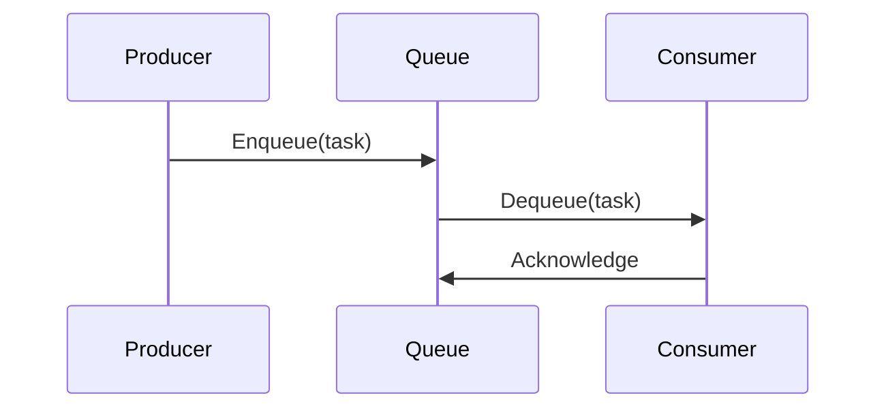
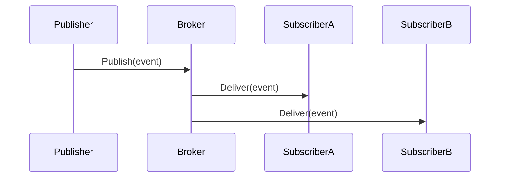

# Message Queues

## 1. Overview
Message queues enable asynchronous, decoupled communication between components in a distributed system. Producers send messages to a queue; consumers retrieve and process them independently. This pattern is fundamental to achieving scalability, elasticity, resilience, and smooth handling of traffic spikes in high‑volume environments.

## 2. Core Concepts

- **Producer**: Component that creates and sends messages.  
- **Queue**: Buffer that stores messages until they are consumed.  
- **Consumer**: Component that receives and processes messages.  
- **Broker**: Middleware that routes, persists, and delivers messages.  
- **Message**: A self‑contained data payload (often JSON or binary).

## 3. Key Benefits

| Benefit                 | Description                                                                 |
|-------------------------|-----------------------------------------------------------------------------|
| **Decoupling**          | Producers and consumers evolve independently.                               |
| **Elasticity**          | Consumers can scale out/in based on queue depth.                            |
| **Load Leveling**       | Smooths out traffic bursts by buffering requests.                           |
| **Fault Isolation**     | Failed consumers don’t block producers; messages can be retried or DLQed.   |
| **Reliability**         | Persistent queues ensure no data loss (with proper configuration).          |

## 4. Common Patterns

### 4.1 Point‑to‑Point (Work Queue)
- **One producer, one consumer** per message.
- Ideal for task offloading.



### 4.2 Publish/Subscribe (Fan‑Out)
- **One producer, many consumers** receive each message.
- Great for event broadcasting.



### 4.3 Competing Consumers
Multiple consumers compete to process messages from the same queue, enabling horizontal scaling and high throughput.

### 4.4 Message Routing
- **Content-based routing**: Broker examines message attributes to route to appropriate queue(s).  
- **Topic exchanges** (e.g., in RabbitMQ) or **Subscriptions** (e.g., Azure Service Bus).

### 4.5 Scatter‑Gather
1. **Scatter**: Producer sends related tasks to multiple queues.  
2. **Gather**: Aggregator collects responses and merges results.

### 4.6 Dead‑Letter Queue (DLQ)
Holds messages that cannot be processed after N retries, essential for isolating poison messages.

## 5. Types of Message Queues

| Category          | Examples                                  | Characteristics                                    |
|-------------------|-------------------------------------------|----------------------------------------------------|
| **Brokered**      | Azure Service Bus, RabbitMQ, AWS SQS      | Centralized broker, rich routing features.         |
| **Brokerless**    | Apache Kafka, Redis Streams               | Distributed commit log, often lower latency.       |
| **Cloud‑Native**  | Google Pub/Sub, AWS SNS + SQS             | Fully managed, auto‑scaling, integrated with cloud.|

## 6. Design Considerations

- **Durability**: Persistent vs. in‑memory queues  
- **Ordering**: FIFO guarantees vs. at‑least‑once delivery  
- **Idempotency**: Consumers must handle duplicate messages safely  
- **TTL & Size Limits**: Configure message/queue time‑to‑live and max size  
- **Batching**: Group messages to improve throughput  
- **Security**: Encrypt in transit (TLS) and at rest; enforce access controls  

## 7. Monitoring & Metrics

- **Queue Length**: Backlog indicates scaling needs  
- **Message Age**: Time in queue before consumption  
- **Throughput**: Messages/sec in/out  
- **Error Rate & DLQ Count**: Failed deliveries and retries  
- **Latency**: End‑to‑end processing time  

## 8. Typical Use Cases

- **Order Processing** in e‑commerce  
- **Event‑Driven Microservices** orchestration  
- **IoT Telemetry Ingestion**  
- **Log Aggregation and ETL Pipelines**  
- **Email & Notification Dispatch**  

## 9. Best Practices

1. **Make Consumers Idempotent**  
2. **Scale Consumers Based on Queue Depth** (auto‑scaling rules)  
3. **Use Exponential Back‑off** for retries  
4. **Archive or Purge Old Messages** to manage storage  
5. **Implement DLQs** and monitor them closely  
6. **Encrypt Messages** and rotate keys regularly  
7. **Document Schema Contracts** and version gracefully  

## 10. Example: Azure Service Bus (C#)

```csharp
using Azure.Messaging.ServiceBus;

var connectionString = "<YOUR_SERVICE_BUS_CONN>";
var queueName        = "orders";

await using var client = new ServiceBusClient(connectionString);

// Producer: send message
var sender  = client.CreateSender(queueName);
var message = new ServiceBusMessage("{ "orderId": 123 }");
await sender.SendMessageAsync(message);

// Consumer: receive messages
var processor = client.CreateProcessor(queueName, new ServiceBusProcessorOptions());
processor.ProcessMessageAsync += async args =>
{
    var body = args.Message.Body.ToString();
    Console.WriteLine($"Received: {body}");
    await args.CompleteMessageAsync(args.Message);
};
processor.ProcessErrorAsync += args =>
{
    Console.Error.WriteLine($"Error: {args.Exception}");
    return Task.CompletedTask;
};
await processor.StartProcessingAsync();
// ...
```

## 11. Related Resources

- **Azure Service Bus**  
- **AWS SQS & SNS**  
- **RabbitMQ Official Docs**  
- **Apache Kafka Architecture**  

## 12. Conclusion
Message Queues are a cornerstone of modern, scalable, and elastic architectures. By decoupling components and smoothing traffic spikes, they enable robust, fault‑tolerant systems that can grow and shrink dynamically with demand.