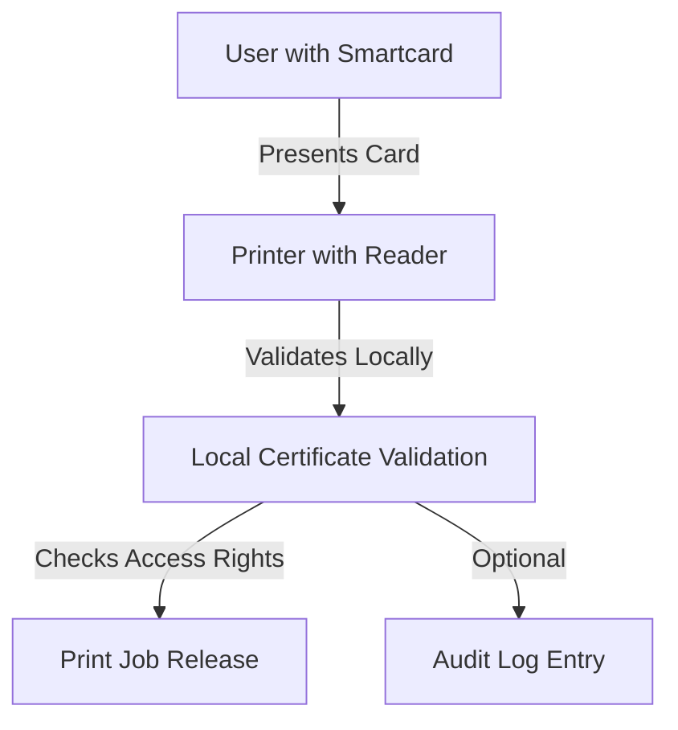
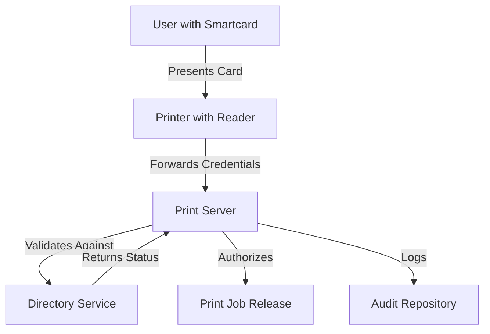
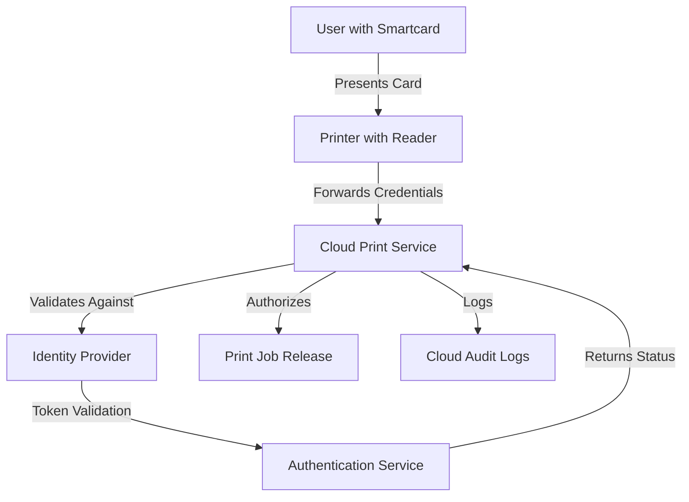

# Smartcard Integration

## Overview

Smartcard Integration enables secure authentication for printing environments through hardware-based credentials. By leveraging chip-based security tokens, organizations can enforce strong authentication, maintain audit trails, and protect sensitive documents from unauthorized access.

## Key Components

### Hardware Infrastructure

- **Smartcard Types**:
  - Personal Identity Verification (PIV) cards
  - Common Access Cards (CAC)
  - FIDO2 security keys
  - Custom organization-issued smartcards
  - Contactless NFC cards

- **Reader Technology**:
  - Contact readers (inserted cards)
  - Contactless/proximity readers (tap cards)
  - Dual-interface readers (supporting both methods)
  - Mobile device NFC capability (for virtual cards)
  
- **Printer Hardware**:
  - External reader attachments
  - Embedded card readers
  - Multi-function device integrations
  - Kiosk-style print release stations

### Software Components

- **Card Management System**:
  - Certificate issuance and management
  - Card lifecycle tracking
  - Revocation mechanisms
  - User-to-card association

- **Print Management Integration**:
  - Job holding mechanisms
  - Secure spooling
  - User-to-job mapping
  - Follow-me printing support

- **Directory Service Connector**:
  - Active Directory / LDAP integration
  - Azure AD / Entra ID support
  - Attribute mapping
  - Group-based policy enforcement

## Implementation Guide

### Planning Phase

1. **Security Architecture Design**
   - Define authentication policy requirements
   - Determine certificate infrastructure needs
   - Establish card issuance procedures
   - Document security controls

2. **Technical Compatibility Assessment**
   - Evaluate existing printer capabilities
   - Assess network infrastructure
   - Review directory service readiness
   - Determine middleware requirements

3. **Organizational Readiness**
   - Develop user communication plan
   - Create training materials
   - Establish help desk procedures
   - Define card issuance workflows

### Deployment Process

1. **Certificate Infrastructure Setup**
   ```
   # Sample PowerShell for AD CS Configuration
   Install-WindowsFeature ADCS-Cert-Authority -IncludeManagementTools
   Install-AdcsCertificationAuthority -CAType EnterpriseRootCA -CACommonName "OrgName Issuing CA" -KeyLength 4096 -HashAlgorithm SHA256 -CryptoProviderName "RSA#Microsoft Software Key Storage Provider"
   Install-AdcsEnrollmentWebService
   ```

2. **Card Management System Deployment**
   - Install management server components
   - Configure database connectivity
   - Set up admin accounts and permissions
   - Establish certificate templates

3. **Print Server Configuration**
   ```
   # Sample Configuration for Print Management Integration
   Install-Module -Name PrintManagement
   Set-PrintConfiguration -ComputerName PrintServer01 -Authentication SmartcardRequired
   Set-PrintServerSecurity -DefaultDACL "O:BAG:DUD:(A;;CCDCLC;;;PS)(A;CIIO;RC;;;PS)(A;;LCSWSDRC;;;BA)"
   ```

4. **Printer/MFP Setup**
   - Install card readers where needed
   - Update firmware to support authentication
   - Configure network settings
   - Test connectivity to authentication services

5. **User Provisioning**
   - Issue smartcards to users
   - Enroll certificates
   - Associate cards with user accounts
   - Train on usage procedures

### Integration Patterns

#### Direct Integration



#### Server-Mediated Integration



#### Cloud-Based Integration



## Security Considerations

### Certificate Management

- **Issuance Controls**
  - Multi-factor authentication for certificate requests
  - Background checks for issuers
  - Physical security for issuance stations
  - Secure delivery procedures

- **Lifecycle Management**
  - Automatic expiration enforcement
  - Revocation checking (CRL/OCSP)
  - Key recovery procedures
  - Certificate renewal processes

- **Private Key Protection**
  - Hardware-based key storage
  - PIN protection requirements
  - Anti-hammering (lockout after failed attempts)
  - Tamper-evident physical cards

### Threat Mitigations

- **Lost/Stolen Card Procedures**
  - Immediate revocation process
  - Emergency access procedures
  - Temporary credentials issuance
  - Mandatory reissuance protocols

- **Man-in-the-Middle Prevention**
  - TLS for all communications
  - Certificate pinning
  - Network segmentation
  - Mutual authentication

- **Physical Security**
  - Card readers in supervised areas
  - Tamper-evident hardware
  - Regular inspection procedures
  - Camera surveillance where appropriate

## Advanced Configurations

### Multi-Factor Authentication

Combining smartcard with other authentication factors:

1. **Card + PIN**
   - Requires something you have and something you know
   - Protects against stolen cards
   - PIN management considerations
   - Keypad security requirements

2. **Card + Biometric**
   - Highest security combination
   - Template storage considerations
   - Match-on-card vs. match-on-reader
   - Privacy implications

3. **Card + Mobile Verification**
   - Push notification approval
   - QR code scanning
   - Time-based approvals
   - Geofencing options

### Cross-Domain Authentication

Supporting users across organizational boundaries:

1. **Trust Relationships**
   - Federation services configuration
   - Cross-certification between CAs
   - Bridge CA implementation
   - Trust path validation

2. **Guest Access**
   - Temporary credential issuance
   - Limited privilege assignment
   - Time-bounded access
   - Audit enhancement for external users

## Compliance Aspects

### Regulatory Considerations

- **Government Standards**
  - FIPS 201 compliance for PIV cards
  - NIST SP 800-73 for card interfaces
  - NIST SP 800-76 for biometric data (if applicable)
  - NIST SP 800-78 for cryptographic specifications

- **Industry Regulations**
  - PCI-DSS requirements for payment environments
  - HIPAA for healthcare settings
  - SOX for financial reporting
  - GDPR for personal data protection

### Audit Requirements

- **Transaction Logging**
  - Authentication attempts (successful and failed)
  - Print job release events
  - Administrative actions
  - Card lifecycle events

- **Reporting Capabilities**
  - Compliance reports
  - Usage statistics
  - Security incident identification
  - Trend analysis

## Troubleshooting

### Common Issues

1. **Card Read Failures**
   - Check physical card condition
   - Verify reader functionality
   - Test with known good card
   - Inspect for debris in reader

2. **Authentication Errors**
   - Verify certificate validity
   - Check revocation status
   - Test network connectivity
   - Validate directory service availability

3. **Print Release Problems**
   - Verify job in queue
   - Check user-to-job association
   - Test printer functionality
   - Validate access rights

### Diagnostic Procedures

- **Reader Testing**
   ```
   # Sample Test Script for Card Reader Functionality
   $reader = Get-SmartCardReader -Name "ACS SmartCard Reader 3000"
   Test-SmartCardReader -Reader $reader -Verbose
   Get-SmartCardReaderStatus -Reader $reader | Format-Table
   ```

- **Certificate Validation**
   ```
   # Sample Certificate Test
   $cert = Get-Certificate -Thumbprint "A1B2C3D4E5F6G7H8I9J0..."
   Test-Certificate -Cert $cert -Policy SSL
   Get-CertificateRevocationList -Certificate $cert
   ```

- **System Logging**
   - Enable diagnostic logging
   - Collect event logs from relevant systems
   - Analyze authentication patterns
   - Review system performance metrics

## Vendor Solutions

### Enterprise Print Management Systems

1. **PaperCut MF**
   - Native smartcard integration
   - Multi-vendor printer support
   - Comprehensive reporting
   - Cloud or on-premises deployment

2. **Kofax ControlSuite**
   - Advanced security features
   - Document workflow capabilities
   - Compliance-focused configuration
   - Integration with document management

3. **Pharos Blueprint**
   - Policy-driven approach
   - Cost recovery capabilities
   - Detailed analytics
   - Secure mobile printing

### Specialized Authentication Providers

1. **HID Global**
   - Complete card issuance systems
   - Reader hardware for various environments
   - Certificate management services
   - Government-certified options

2. **Thales (Gemalto)**
   - Smart card management solutions
   - PKI infrastructure components
   - Hardware security modules
   - Multi-application card platforms

3. **Entrust Datacard**
   - End-to-end credential solutions
   - Instant issuance capabilities
   - Cloud-based certificate services
   - Mobile credential options

## Case Studies

### Government Agency Implementation

A federal agency deployed CAC-based print authentication across 2,500 devices to meet FIPS 201 compliance requirements and protect sensitive information.

**Results**:
- 100% compliance with federal security directives
- 30% reduction in overall printing volume
- Complete audit trail for all printed documents
- Successful integration with existing PKI infrastructure

### Healthcare Provider Deployment

A multi-hospital healthcare system implemented smartcard authentication for clinical and administrative printing to enhance HIPAA compliance and reduce unauthorized access to patient information.

**Results**:
- Eliminated abandoned PHI documents at printers
- Streamlined workflow with tap-and-release functionality
- Integrated with existing hospital ID badges
- Significant reduction in compliance risk

## Future Directions

### Emerging Technologies

- **Virtual Smartcards**:
  - Mobile device emulation of physical cards
  - Cloud-based credential storage
  - Device attestation mechanisms
  - Push-based authentication

- **Post-Quantum Cryptography**:
  - Preparing for quantum computing threats
  - Algorithm transition planning
  - Certificate renewal strategies
  - Hybrid approach during transition

### Integration Opportunities

- **Zero Trust Architecture**:
  - Continuous verification models
  - Risk-based authentication decisions
  - Contextual access policies
  - Real-time security posture assessment

- **Blockchain-Based Credentials**:
  - Decentralized identity verification
  - Self-sovereign identity integration
  - Immutable audit trails
  - Cross-organizational verification

## Appendix

### Technical Specifications

Detailed reader specifications, card format standards, and API documentation for integration with various print management systems.

### Reference Architectures

Sample deployment architectures for small, medium, and enterprise environments with network diagrams and component specifications.

### Implementation Checklists

Step-by-step guides for planning, deployment, testing, and maintenance of smartcard authentication systems.

### Training Materials

End-user training guides, administrator reference materials, and help desk troubleshooting procedures.
