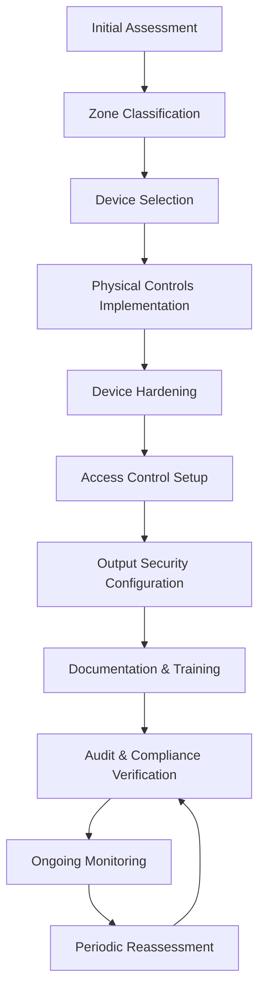
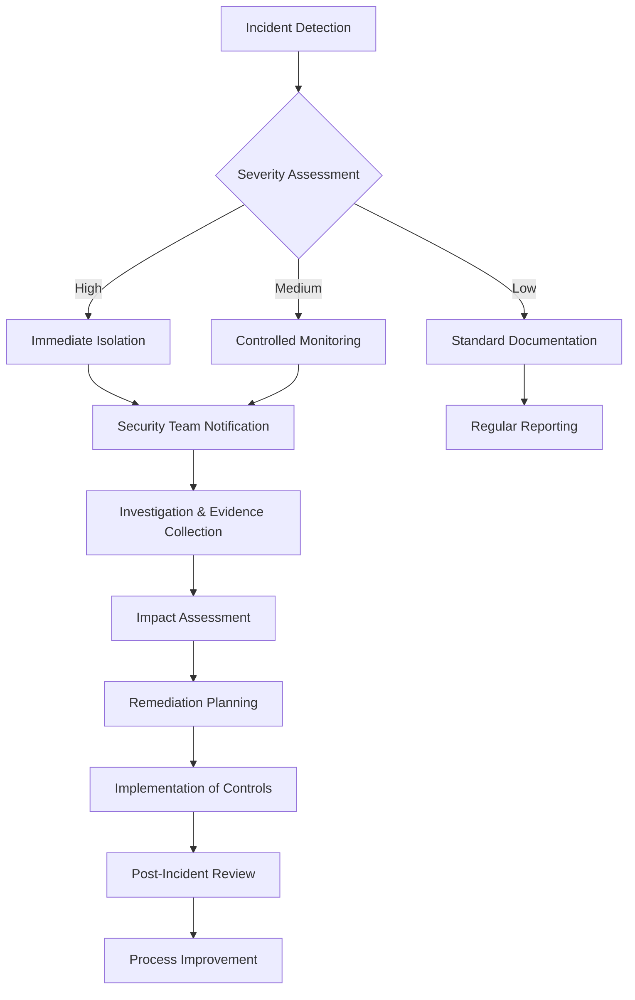

# Physical Security Protocols for Printer Systems

## Overview

This document outlines comprehensive physical security measures for enterprise printer deployments. Physical security is a critical but often overlooked component of printer security that complements digital protection measures such as encryption, access controls, and authentication systems.

## Table of Contents

1. [Risk Assessment](#risk-assessment)
2. [Printer Placement Guidelines](#printer-placement-guidelines)
3. [Physical Access Controls](#physical-access-controls)
4. [Secure Output Management](#secure-output-management)
5. [Device Hardening](#device-hardening)
6. [Asset Tracking and Inventory](#asset-tracking-and-inventory)
7. [Disposal and Decommissioning](#disposal-and-decommissioning)
8. [Incident Response Plan](#incident-response-plan)
9. [Compliance Considerations](#compliance-considerations)
10. [Appendices](#appendices)

## Risk Assessment

### Threat Identification

| Threat Category | Description | Risk Level | Potential Impact |
|----------------|-------------|------------|------------------|
| Document Theft | Unauthorized removal of printed materials | High | Data breach, compliance violations |
| Device Tampering | Physical alteration of printer hardware | Medium | Information compromise, service disruption |
| Memory Access | Extraction of data from internal storage | High | Exposure of cached documents, credentials |
| Port Exploitation | Unauthorized use of USB/network ports | Medium | Malware injection, configuration changes |
| Visual Surveillance | Observation of sensitive outputs | Medium | Information disclosure |
| Component Theft | Removal of hard drives, memory modules | Medium | Data breach, service disruption |

### Vulnerability Assessment Checklist

* [ ] Unsecured printer locations
* [ ] Unmonitored output trays
* [ ] Accessible maintenance panels
* [ ] Unprotected physical ports (USB, Ethernet)
* [ ] Inadequate disposal procedures
* [ ] Unrestricted access to device interfaces
* [ ] Lack of asset tracking mechanisms
* [ ] Absence of tamper-evident features

## Printer Placement Guidelines

### Security Zones Categorization

* **Level 1 (High Security)**: Finance, HR, executive areas, R&D
  * Requirements: Dedicated secure rooms, card access, surveillance
  * Printer types: Advanced MFPs with full security feature set

* **Level 2 (Medium Security)**: General office areas, departmental zones
  * Requirements: Partial physical barriers, observable placement
  * Printer types: Department-level MFPs with core security features

* **Level 3 (Standard Security)**: Common areas, open workspaces
  * Requirements: Staff supervision, non-isolated locations
  * Printer types: Basic network printers with essential security

### Optimal Placement Considerations

1. **Visibility**: Position printers within line of sight of authorized personnel
2. **Environment**: Secure from unauthorized external access points
3. **Monitoring**: Within range of surveillance systems
4. **Access**: Balance between accessibility and security
5. **Infrastructure**: Consider cable management for tamper prevention

### Placement Diagrams

For detailed placement diagrams specific to facility types, refer to the appendix section.

## Physical Access Controls

### Access Methods and Recommendations

| Control Type | Description | Implementation Level | Recommended Environments |
|--------------|-------------|----------------------|--------------------------|
| Lock and Key | Physical keys for printer rooms/cabinets | Basic | Small offices, Level 3 zones |
| Card Access | Badge readers for print areas | Intermediate | Medium businesses, Level 2 zones |
| Biometric | Fingerprint/facial recognition | Advanced | Enterprise, Level 1 zones |
| PIN Entry | Numerical codes for area access | Basic | Supplementary to other methods |
| Mantrap | Dual-door systems with interlocks | Maximum | High-security facilities, Level 1 |

### Cabinet and Enclosure Specifications

* **Security Rating**: Minimum UL 2050 Class 3 for high-security environments
* **Material**: 18-gauge steel minimum for printer enclosures
* **Locking Mechanism**: Multi-point locking systems with tamper alerts
* **Ventilation**: Secured airflow design to prevent bypass
* **Cable Management**: Protected cable pathways to prevent tapping

## Secure Output Management

### Secure Print Release Methods

| Method | Description | Security Level | Implementation Complexity |
|--------|-------------|----------------|---------------------------|
| Pull Printing | Documents held until user authenticates at device | High | Medium |
| PIN Release | Numeric code required to release print jobs | Medium | Low |
| Card Authentication | ID/access card swipe releases documents | High | Medium |
| Biometric Release | Fingerprint/facial recognition for print release | Maximum | High |
| Mobile Release | Smartphone app authentication for document release | High | Medium |

### Output Tray Security

1. **Partitioned Trays**: Physical separation of output by user/department
2. **Lockable Output Bins**: Secure compartments requiring key/code access
3. **Auto-eject Protection**: Anti-theft features for unclaimed outputs
4. **Collection Timers**: Automatic alerts for uncollected documents
5. **Output Encrypting Trays**: Special trays that obscure document content

## Device Hardening

### Physical Port Security

| Port Type | Security Measure | Implementation Method |
|-----------|------------------|------------------------|
| USB | Port disablement | BIOS/firmware configuration, epoxy sealing |
| Ethernet | Port locks | Specialized locking devices, cabinet restrictions |
| Memory Card | Slot blocking | Physical covers, firmware disablement |
| Control Panel | Access restrictions | Display locks, timeout policies |
| Service Ports | Tamper-evident seals | Serialized security labels, inspection protocols |

### Tamper Protection Mechanisms

1. **Chassis Intrusion Detection**
   * Sensors that detect unauthorized case opening
   * Automatic alerts to security personnel
   * Event logging for audit purposes

2. **Tamper-Evident Seals**
   * Apply to access panels, memory compartments, and connection ports
   * Serial-numbered for tracking
   * Void-indicator technology that shows evidence of tampering

3. **Security Fasteners**
   * Proprietary screw heads requiring specialized tools
   * One-way screws that cannot be removed conventionally
   * Locking bolt mechanisms for critical components

## Asset Tracking and Inventory

### Inventory Management System

1. **Required Device Information**
   * Serial number
   * MAC address
   * IP address
   * Physical location
   * Security features enabled
   * Firmware version
   * Hard drive status

2. **Tracking Technologies**
   * RFID asset tags
   * QR code inventory systems
   * GPS trackers for high-value units
   * Network-based location tracking

### Regular Audit Procedures

| Audit Type | Frequency | Responsibility | Documentation |
|------------|-----------|----------------|---------------|
| Physical Inventory | Quarterly | IT Asset Management | Full inventory spreadsheet |
| Security Feature Verification | Bi-annually | Security Team | Compliance checklist |
| Firmware/Configuration | Monthly | IT Operations | Version control document |
| Tamper Inspection | Weekly | Facilities/Security | Inspection log |

## Disposal and Decommissioning

### Data Sanitization Procedures

| Component | Sanitization Method | Verification Procedure |
|-----------|---------------------|------------------------|
| Internal Storage | DoD 5220.22-M 7-pass wipe | Verification scan, certification |
| Flash Memory | Secure erase + firmware reset | Function testing, log verification |
| NVRAM | Factory reset + power cycle | Settings verification |
| Mechanical Memory | Physical destruction | Visual inspection |

### Physical Destruction Requirements

1. **Hard Drive Destruction Standards**
   * Degaussing with minimum 7,000 oersted field
   * Physical shredding to maximum 2mm particles
   * Documented chain of custody

2. **Documentation Requirements**
   * Asset retirement authorization
   * Certificate of destruction
   * Environmental compliance verification
   * Data sanitization certification

### Certified Disposal Vendors

Refer to the appendix for a current list of approved disposal vendors that meet security and environmental requirements.

## Incident Response Plan

### Physical Security Breach Procedures

1. **Immediate Actions**
   * Isolate affected device(s)
   * Document visible evidence (photos, notes)
   * Preserve physical evidence
   * Notify security team

2. **Assessment Phase**
   * Determine breach scope
   * Identify potentially compromised data
   * Evaluate tamper indicators
   * Review access logs and surveillance

3. **Remediation Steps**
   * Replace compromised components
   * Perform security sweep of area
   * Update access controls
   * Enhance monitoring measures

### Documentation Requirements

* Incident report form (see Appendix A)
* Chain of custody documentation
* Evidence collection procedures
* Notification templates for stakeholders

## Compliance Considerations

### Regulatory Requirements

| Regulation | Physical Security Requirements | Documentation Needed |
|------------|--------------------------------|----------------------|
| HIPAA | Access-controlled environment, secure disposal | Risk assessments, disposal certificates |
| PCI DSS | Physically secured devices, monitored access | Access logs, inventory controls |
| GDPR | Safeguards for devices processing personal data | Processing records, security measures |
| NIST 800-53 | Physical access enforcement, monitoring, visitor controls | Security plans, access records |
| ISO 27001 | Equipment security, secure areas, clear desk policy | Asset inventory, security protocols |

### Internal Policy Alignment

Ensure physical security protocols align with:
* Corporate security policies
* Data protection standards
* Business continuity plans
* Vendor management requirements
* Industry-specific guidelines

## Appendices

### Appendix A: Security Inspection Checklist

```
PRINTER PHYSICAL SECURITY INSPECTION

Device ID: ________________  Location: ________________  Date: ________________
Inspector: ________________  

ACCESS CONTROLS:
☐ Device located in appropriate security zone
☐ Physical access restrictions functioning
☐ Enclosure/cabinet secure
☐ Keys/access cards properly managed

TAMPER PROTECTION:
☐ Security seals intact
☐ No signs of chassis intrusion
☐ Access panels secured
☐ No unauthorized devices attached

PORT SECURITY:
☐ USB ports protected/disabled
☐ Network ports secured
☐ Service ports covered
☐ Memory card slots secured

OUTPUT MANAGEMENT:
☐ Output trays clear of sensitive documents
☐ Secure print release functioning
☐ Collection procedures followed

GENERAL SECURITY:
☐ Asset tag present and legible
☐ Firmware current
☐ Warning labels intact
☐ Surrounding environment secure

COMMENTS:
________________________________________________________________
________________________________________________________________

ACTIONS REQUIRED:
________________________________________________________________
________________________________________________________________

Signature: ________________
```

### Appendix B: Recommended Security Products

| Product Category | Recommended Solutions | Security Level | Approximate Cost |
|------------------|------------------------|----------------|------------------|
| Printer Cabinets | SecurePrint Cabinet SP-300, DataGuard PrintSafe | High | $500-1,500 |
| Port Locks | Kensington K65042, LockPort USB Blockers | Medium-High | $5-20 per port |
| Tamper Seals | TamperSafe TS-100 Series, SecuriSeal Void Labels | Medium-High | $2-5 per seal |
| Tracking Systems | AssetTag RFID System, PrinterTrack Software | Medium-High | $15-50 per device |
| Secure Output | SecureRelease Terminal, PrinterLogic SecurePrint | High | $300-800 per device |

### Appendix C: Implementation Workflow



### Appendix D: Incident Response Flowchart



### Appendix E: Zone-Based Placement Diagrams

Detailed facility maps with recommended printer placements based on security zones are available in the digital resources folder. Contact Security Operations for access.

---

## Document Information

**Version:** 2.1  
**Last Updated:** 2025-04-15  
**Author:** Security Operations Team  
**Reviewers:** IT Infrastructure, Compliance, Risk Management  
**Next Review Date:** 2025-10-15  

