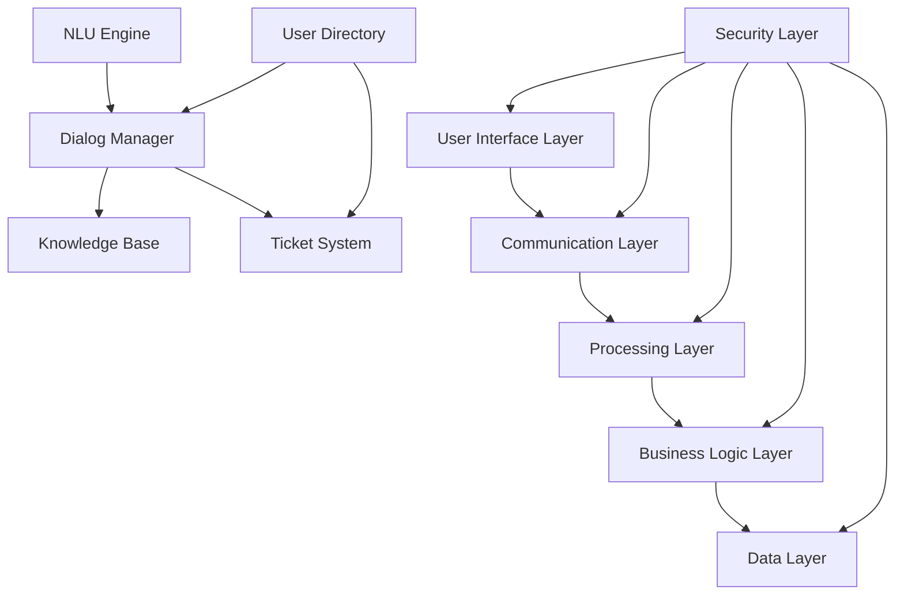

# Bot Architecture and Components

## Overview

The Help Desk Bot is built on a modular architecture designed for scalability, flexibility, and ease of maintenance. This document details each component of the bot architecture, explaining its purpose, configuration options, and how it interacts with other components.

## Core Architecture

The Help Desk Bot follows a layered architecture with these principal components:

### 1. User Interface Layer

The bot provides multiple interface options to meet users where they are:

#### Chat Interfaces
- **Web Widget Integration**
  - Embedded on internal portal pages
  - Customizable appearance (colors, size, position)
  - Supports rich formatting, attachments, and screen sharing
  - Configuration path: `/config/ui/web-widget.json`

```json
{
  "widgetId": "help-desk-bot-widget",
  "position": "bottom-right",
  "initialMessage": "Hello! I'm your Help Desk Assistant. How can I help you today?",
  "theme": {
    "primaryColor": "#0078D4",
    "fontFamily": "Segoe UI, sans-serif",
    "headerText": "IT Help Desk",
    "headerLogo": "/assets/logo.png"
  },
  "features": {
    "attachments": true,
    "screenSharing": true,
    "feedbackButton": true,
    "transcriptEmail": true
  }
}
```

- **Microsoft Teams Integration**
  - Personal bot chat
  - Channel integration for team-wide support
  - Uses Teams Adaptive Cards for rich interactions
  - Configuration path: `/config/ui/ms-teams.json`

```json
{
  "botId": "help-desk-bot-teams",
  "manifestVersion": "1.10",
  "manifestPath": "/config/teams/manifest.json",
  "adaptiveCardsEnabled": true,
  "defaultCardType": "ticketCreation",
  "commandsEnabled": true,
  "commands": [
    {
      "command": "help",
      "description": "Shows available commands",
      "response": "adaptiveCard:help"
    },
    {
      "command": "new ticket",
      "description": "Creates a new support ticket",
      "response": "adaptiveCard:newTicket"
    },
    {
      "command": "status",
      "description": "Checks status of your open tickets",
      "response": "adaptiveCard:ticketStatus"
    }
  ]
}
```

- **Slack Integration**
  - Direct message support
  - Channel integration with slash commands
  - Interactive button support
  - Configuration path: `/config/ui/slack.json`

```json
{
  "botToken": "${ENV_SLACK_BOT_TOKEN}",
  "signingSecret": "${ENV_SLACK_SIGNING_SECRET}",
  "appId": "A03XXXXXX",
  "interactiveComponents": true,
  "slashCommands": [
    {
      "command": "/helpdesk",
      "description": "Interact with Help Desk Bot",
      "subcommands": ["new", "status", "faq"]
    }
  ],
  "homeTabEnabled": true,
  "directMessagePrompt": "Need help? Ask me anything about IT support."
}
```

#### Email Integration
- Allows ticket creation and updates via email
- Automatic parsing of email content for context
- Attachment handling
- Configuration path: `/config/ui/email.json`

```json
{
  "inboundEmailAddress": "helpdesk-bot@company.com",
  "emailCheckInterval": 300,
  "emailParsingRules": [
    {
      "field": "subject",
      "pattern": "IT Support: (.*)",
      "extractAs": "ticketTitle"
    },
    {
      "field": "body",
      "pattern": "Priority: (High|Medium|Low)",
      "extractAs": "ticketPriority"
    }
  ],
  "defaultTicketType": "email-generated",
  "attachmentConfig": {
    "maxSize": 10485760,
    "allowedTypes": ["image/*", "application/pdf", ".docx", ".xlsx"]
  }
}
```

### 2. Communication Layer

Handles all message routing between users and the bot's processing units:

- **Message Queue System**
  - Uses RabbitMQ for asynchronous message processing
  - Ensures message delivery even during high load
  - Configuration path: `/config/communication/message-queue.json`

```json
{
  "provider": "rabbitmq",
  "host": "${ENV_RABBITMQ_HOST}",
  "port": 5672,
  "virtualHost": "help-desk-bot",
  "username": "${ENV_RABBITMQ_USER}",
  "password": "${ENV_RABBITMQ_PASS}",
  "queues": {
    "incomingMessages": {
      "name": "incoming-user-messages",
      "durable": true,
      "prefetch": 10
    },
    "processedResponses": {
      "name": "bot-responses",
      "durable": true,
      "prefetch": 10
    },
    "humanHandoff": {
      "name": "human-agent-queue",
      "durable": true,
      "prefetch": 5
    }
  },
  "deadLetterExchange": "help-desk-dlx",
  "messageRetention": 86400,
  "maxRetries": 3
}
```

- **WebSocket Server**
  - Provides real-time communication for web interfaces
  - Handles typing indicators and read receipts
  - Configuration path: `/config/communication/websocket.json`

```json
{
  "port": 8080,
  "path": "/ws/bot",
  "maxConnections": 1000,
  "pingInterval": 30000,
  "messageFormat": "json",
  "authentication": {
    "required": true,
    "type": "jwt",
    "jwtSecret": "${ENV_WS_JWT_SECRET}"
  },
  "metrics": {
    "enabled": true,
    "path": "/ws/metrics"
  }
}
```

- **API Gateway**
  - RESTful API for programmatic interactions
  - Handles authentication and rate limiting
  - Provides webhook capabilities for integrations
  - Configuration path: `/config/communication/api-gateway.json`

```json
{
  "port": 3000,
  "basePath": "/api/v1",
  "cors": {
    "enabled": true,
    "allowedOrigins": ["https://portal.company.com", "https://support.company.com"]
  },
  "rateLimit": {
    "windowMs": 60000,
    "max": 100,
    "standardHeaders": true
  },
  "routes": {
    "messages": {
      "path": "/messages",
      "methods": ["GET", "POST"],
      "rateLimit": {
        "windowMs": 60000,
        "max": 50
      }
    },
    "tickets": {
      "path": "/tickets",
      "methods": ["GET", "POST", "PUT"],
      "rateLimit": {
        "windowMs": 60000,
        "max": 30
      }
    },
    "users": {
      "path": "/users",
      "methods": ["GET"],
      "rateLimit": {
        "windowMs": 60000,
        "max": 20
      }
    },
    "webhooks": {
      "path": "/webhooks",
      "methods": ["POST"],
      "rateLimit": {
        "windowMs": 60000,
        "max": 10
      }
    }
  }
}
```

### 3. Processing Layer

The brain of the bot, responsible for understanding and processing user requests:

- **Natural Language Understanding (NLU) Engine**
  - Classifies user intents
  - Extracts entities and parameters
  - Uses machine learning models specific to IT support
  - Configuration path: `/config/processing/nlu.json`

```json
{
  "engine": "luis", // Alternatives: "dialogflow", "rasa", "custom"
  "endpoint": "${ENV_LUIS_ENDPOINT}",
  "appId": "${ENV_LUIS_APP_ID}",
  "apiKey": "${ENV_LUIS_API_KEY}",
  "version": "1.0.5",
  "minimumConfidenceScore": 0.65,
  "fallbackIntent": "None",
  "sentimentAnalysis": true,
  "enhancedEntityRecognition": true,
  "customEntities": [
    {
      "name": "SoftwareApplication",
      "values": ["MS Office", "Teams", "Outlook", "SAP", "Salesforce"]
    },
    {
      "name": "HardwareDevice",
      "values": ["laptop", "printer", "monitor", "keyboard", "phone"]
    }
  ],
  "trainingSchedule": "0 0 * * 0", // Weekly training (cron syntax)
  "logPredictions": true
}
```

- **Dialog Manager**
  - Controls conversation flow
  - Manages context and state
  - Handles multi-turn conversations
  - Configuration path: `/config/processing/dialog-manager.json`

```json
{
  "engine": "botframework", // Alternatives: "custom", "rasa"
  "dialogPath": "/dialogs",
  "defaultDialog": "welcome",
  "sessionTimeout": 1800, // seconds
  "contextPersistence": true,
  "contextDb": {
    "type": "redis",
    "connection": "${ENV_REDIS_CONNECTION_STRING}",
    "ttl": 86400 // 24 hours
  },
  "conversationLogs": {
    "enabled": true,
    "storageType": "database", // Alternatives: "file", "blob"
    "rotation": "daily"
  },
  "handoffTriggers": [
    {
      "type": "explicit", 
      "patterns": ["talk to agent", "speak to human", "agent please"]
    },
    {
      "type": "sentiment",
      "threshold": -0.7 // Negative sentiment threshold
    },
    {
      "type": "noMatch",
      "consecutiveNoMatches": 3
    }
  ]
}
```

- **Knowledge Base Connector**
  - Retrieves answers from knowledge articles
  - Performs semantic search
  - Ranks responses by relevance
  - Configuration path: `/config/processing/kb-connector.json`

```json
{
  "engine": "elastic", // Alternatives: "azure_search", "custom"
  "endpoint": "${ENV_ELASTIC_ENDPOINT}",
  "index": "help-desk-knowledge",
  "credentials": {
    "username": "${ENV_ELASTIC_USER}",
    "password": "${ENV_ELASTIC_PASS}"
  },
  "searchConfig": {
    "fuzziness": "AUTO",
    "boost": {
      "title": 3,
      "keywords": 2,
      "content": 1
    },
    "highlight": {
      "enabled": true,
      "field": "content",
      "fragmentSize": 150,
      "fragmentCount": 3
    }
  },
  "resultProcessing": {
    "maxResults": 3,
    "confidenceThreshold": 0.6,
    "includeMetadata": true
  },
  "caching": {
    "enabled": true,
    "ttl": 3600
  }
}
```

### 4. Business Logic Layer

Connects the bot to your organization's specific processes and systems:

- **Ticket System Integration**
  - Creates and updates tickets in your service desk
  - Retrieves ticket status
  - Attaches conversation logs
  - Configuration path: `/config/business/ticket-system.json`

```json
{
  "system": "servicenow", // Alternatives: "jira", "zendesk", "custom"
  "endpoint": "${ENV_SERVICENOW_ENDPOINT}",
  "credentials": {
    "username": "${ENV_SERVICENOW_USERNAME}",
    "password": "${ENV_SERVICENOW_PASSWORD}"
  },
  "defaultValues": {
    "category": "IT Support",
    "assignmentGroup": "Service Desk L1"
  },
  "mappings": {
    "title": "short_description",
    "description": "description",
    "priority": "priority",
    "requester": "caller_id",
    "category": "category",
    "subcategory": "subcategory"
  },
  "ticketCreation": {
    "autoCreate": true,
    "requiredFields": ["title", "description"],
    "confirmationMessage": "I've created ticket {{ticketNumber}} for you. A support agent will review it shortly."
  },
  "statusCheck": {
    "enabled": true,
    "userIdentification": {
      "method": "email", // Alternatives: "employeeId", "username"
      "verification": false
    }
  },
  "webhooks": {
    "statusUpdate": {
      "endpoint": "/api/v1/webhooks/ticket-update",
      "secret": "${ENV_WEBHOOK_SECRET}"
    }
  }
}
```

- **User Directory Integration**
  - Authenticates users
  - Retrieves user details and permissions
  - Personalizes responses
  - Configuration path: `/config/business/user-directory.json`

```json
{
  "provider": "azure_ad", // Alternatives: "ldap", "okta", "custom"
  "endpoint": "https://graph.microsoft.com/v1.0",
  "tenantId": "${ENV_AAD_TENANT_ID}",
  "clientId": "${ENV_AAD_CLIENT_ID}",
  "clientSecret": "${ENV_AAD_CLIENT_SECRET}",
  "scope": ["User.Read", "User.ReadBasic.All"],
  "userAttributes": [
    "id",
    "displayName",
    "givenName",
    "mail",
    "department",
    "jobTitle",
    "officeLocation"
  ],
  "groupMembership": {
    "check": true,
    "adminGroups": ["IT Admins", "Help Desk Staff"]
  },
  "caching": {
    "enabled": true,
    "ttl": 3600
  }
}
```

- **Asset Management Integration**
  - Retrieves user device information
  - Checks warranty and support status
  - Links tickets to specific assets
  - Configuration path: `/config/business/asset-management.json`

```json
{
  "system": "sccm", // Alternatives: "intune", "jamf", "custom"
  "endpoint": "${ENV_SCCM_ENDPOINT}",
  "credentials": {
    "username": "${ENV_SCCM_USERNAME}",
    "password": "${ENV_SCCM_PASSWORD}"
  },
  "queries": {
    "userDevices": "select SMS_R_System.Name, SMS_G_System_COMPUTER_SYSTEM.Model from SMS_R_System inner join SMS_G_System_COMPUTER_SYSTEM on SMS_G_System_COMPUTER_SYSTEM.ResourceID = SMS_R_System.ResourceId where SMS_R_System.UserName = '%username%'",
    "deviceDetails": "select * from SMS_G_System_COMPUTER_SYSTEM where SMS_G_System_COMPUTER_SYSTEM.Name = '%devicename%'"
  },
  "assetLinking": {
    "enabled": true,
    "ticketField": "configuration_item"
  },
  "userIdentification": {
    "method": "email", // Alternatives: "username", "employeeId"
    "transform": "replace('.', ' ')"
  }
}
```

### 5. Data Layer

Manages data storage and retrieval:

- **Session Storage**
  - Maintains conversation context
  - Stores user preferences
  - Configuration path: `/config/data/session-storage.json`

```json
{
  "provider": "redis",
  "connection": "${ENV_REDIS_CONNECTION_STRING}",
  "sessionTtl": 1800,
  "prefix": "helpdesk:session:",
  "serialization": "json",
  "compression": false,
  "clustering": {
    "enabled": true,
    "nodes": [
      {"host": "${ENV_REDIS_HOST1}", "port": 6379},
      {"host": "${ENV_REDIS_HOST2}", "port": 6379},
      {"host": "${ENV_REDIS_HOST3}", "port": 6379}
    ]
  }
}
```

- **Conversation Log Database**
  - Stores complete conversation history
  - Enables analytics and training
  - Configuration path: `/config/data/conversation-logs.json`

```json
{
  "provider": "mongodb",
  "connection": "${ENV_MONGO_CONNECTION_STRING}",
  "database": "helpdesk_bot",
  "collection": "conversation_logs",
  "retention": {
    "enabled": true,
    "days": 90
  },
  "anonymization": {
    "enabled": false,
    "fields": ["userIdentifiers", "personalInfo"]
  },
  "indexes": [
    {
      "fields": {"sessionId": 1},
      "options": {"unique": true}
    },
    {
      "fields": {"userId": 1, "timestamp": -1},
      "options": {}
    },
    {
      "fields": {"intent": 1},
      "options": {}
    }
  ]
}
```

- **Analytics Database**
  - Stores metrics and usage statistics
  - Powers dashboards and reports
  - Configuration path: `/config/data/analytics.json`

```json
{
  "provider": "timescaledb", // Alternatives: "influxdb", "elasticsearch"
  "connection": "${ENV_TIMESCALE_CONNECTION_STRING}",
  "metrics": {
    "collection": {
      "interval": 60, // seconds
      "aggregation": true
    },
    "types": [
      {"name": "messages", "aggregation": "count"},
      {"name": "intents", "aggregation": "count", "dimensions": ["intent"]},
      {"name": "responseTime", "aggregation": "avg"},
      {"name": "sentiment", "aggregation": "avg"},
      {"name": "handoffs", "aggregation": "count"},
      {"name": "ticketsCreated", "aggregation": "count"}
    ]
  },
  "retention": {
    "rawData": "7d", // 7 days
    "hourlyAggregation": "30d", // 30 days
    "dailyAggregation": "365d" // 1 year
  },
  "export": {
    "enabled": true,
    "format": "csv",
    "schedule": "0 0 1 * *", // Monthly export (cron syntax)
    "destination": "${ENV_ANALYTICS_EXPORT_PATH}"
  }
}
```

### 6. Security Layer

Ensures secure operation of the bot:

- **Authentication Provider**
  - Verifies user identity
  - Issues tokens for session management
  - Configuration path: `/config/security/authentication.json`

```json
{
  "providers": [
    {
      "type": "azureAd",
      "enabled": true,
      "tenantId": "${ENV_AAD_TENANT_ID}",
      "clientId": "${ENV_AAD_CLIENT_ID}",
      "clientSecret": "${ENV_AAD_CLIENT_SECRET}",
      "defaultScope": "https://helpdesk-bot.company.com/user_impersonation",
      "allowedDomains": ["company.com"]
    },
    {
      "type": "basic",
      "enabled": true,
      "userStore": {
        "type": "database",
        "connection": "${ENV_USER_DB_CONNECTION}",
        "table": "users",
        "fields": {
          "username": "email",
          "password": "password_hash"
        }
      },
      "passwordPolicy": {
        "hashAlgorithm": "bcrypt",
        "saltRounds": 10
      }
    }
  ],
  "jwt": {
    "issuer": "helpdesk-bot",
    "audience": "api-clients",
    "secret": "${ENV_JWT_SECRET}",
    "expiration": 3600 // 1 hour
  },
  "sessionManagement": {
    "inactivityTimeout": 1800, // 30 minutes
    "absoluteTimeout": 28800, // 8 hours
    "singleSession": false,
    "renewalEnabled": true
  }
}
```

- **Authorization Service**
  - Controls access to features and data
  - Enforces role-based permissions
  - Configuration path: `/config/security/authorization.json`

```json
{
  "rbacEnabled": true,
  "roles": [
    {
      "name": "user",
      "permissions": [
        "create:ticket",
        "read:ticket:own",
        "update:ticket:own",
        "read:kb"
      ]
    },
    {
      "name": "agent",
      "permissions": [
        "create:ticket",
        "read:ticket:all",
        "update:ticket:assigned",
        "read:kb",
        "read:stats:basic"
      ]
    },
    {
      "name": "admin",
      "permissions": [
        "create:ticket",
        "read:ticket:all",
        "update:ticket:all",
        "read:kb",
        "write:kb",
        "read:stats:all",
        "config:read",
        "config:write"
      ]
    }
  ],
  "roleAssignment": {
    "method": "directoryGroup", // Alternatives: "database", "custom"
    "mappings": [
      {"group": "All Users", "role": "user"},
      {"group": "Help Desk Staff", "role": "agent"},
      {"group": "IT Admins", "role": "admin"}
    ],
    "defaultRole": "user"
  }
}
```

- **Data Protection**
  - Encrypts sensitive data
  - Implements PII handling policies
  - Configuration path: `/config/security/data-protection.json`

```json
{
  "encryption": {
    "atRest": {
      "enabled": true,
      "algorithm": "AES-256-GCM",
      "keyRotation": {
        "automatic": true,
        "interval": "90d"
      }
    },
    "inTransit": {
      "tlsRequired": true,
      "minimumVersion": "TLS1.2"
    }
  },
  "piiHandling": {
    "detection": {
      "enabled": true,
      "types": ["creditCard", "ssn", "passport", "driverLicense", "email", "phone"]
    },
    "masking": {
      "enabled": true,
      "pattern": "***"
    },
    "retention": {
      "policy": "minimize",
      "maxAge": "30d"
    }
  },
  "audit": {
    "enabled": true,
    "events": [
      "authentication",
      "authorization",
      "dataAccess",
      "configuration"
    ],
    "storage": {
      "type": "database",
      "connection": "${ENV_AUDIT_DB_CONNECTION}",
      "retention": "365d"
    }
  }
}
```

## Deployment Architecture

The Help Desk Bot can be deployed in various configurations depending on your organizational needs:

### Cloud Deployment (Primary)

```
┌─────────────────────────────────────────────────────┐
│                Azure Environment                    │
│                                                     │
│  ┌─────────┐    ┌─────────┐    ┌─────────────────┐  │
│  │  Azure  │    │  App    │    │ Azure Cognitive │  │
│  │  Bot    │◄───┤ Service │◄───┤    Services     │  │
│  │ Service │    │         │    │     (LUIS)      │  │
│  └─────────┘    └─────────┘    └─────────────────┘  │
│      │              │                  │            │
│      │              │                  │            │
│      ▼              ▼                  ▼            │
│  ┌─────────┐    ┌─────────┐    ┌─────────────────┐  │
│  │  Azure  │    │  Cosmos │    │  Azure Search   │  │
│  │ Storage │    │   DB    │    │     Service     │  │
│  └─────────┘    └─────────┘    └─────────────────┘  │
│                                                     │
└─────────────────────────────────────────────────────┘
            │                 │              │
            ▼                 ▼              ▼
┌───────────────────┐ ┌─────────────┐ ┌────────────────┐
│   Web Interface   │ │ MS Teams    │ │ Integration    │
│   (Azure CDN)     │ │ Integration │ │ Services       │
└───────────────────┘ └─────────────┘ └────────────────┘
```

### On-Premises Deployment (Alternative)

```
┌─────────────────────────────────────────────────┐
│              Corporate Data Center              │
│                                                 │
│  ┌─────────┐    ┌─────────┐    ┌────────────┐  │
│  │  Bot    │    │ App     │    │ NLU Engine │  │
│  │ Service │◄───┤ Server  │◄───┤ (Rasa NLU) │  │
│  │ (Rasa)  │    │ (Node)  │    │            │  │
│  └─────────┘    └─────────┘    └────────────┘  │
│      │              │               │          │
│      │              │               │          │
│      ▼              ▼               ▼          │
│  ┌─────────┐    ┌─────────┐    ┌────────────┐  │
│  │  File   │    │ MongoDB │    │ Elastic    │  │
│  │ Storage │    │         │    │ Search     │  │
│  └─────────┘    └─────────┘    └────────────┘  │
│                                                │
└─────────────────────────────────────────────────┘
            │                 │             │
            ▼                 ▼             ▼
┌───────────────────┐ ┌─────────────┐ ┌───────────────┐
│   Web Interface   │ │ MS Teams    │ │ Integration   │
│      (Nginx)      │ │ Integration │ │ Service       │
└───────────────────┘ └─────────────┘ └───────────────┘
```

### Hybrid Deployment (Optional)

For organizations with specific security requirements or legacy systems, a hybrid deployment model can be used:

```
┌─────────────────────────────┐  ┌─────────────────────────┐
│      Azure Environment      │  │   Corporate Data Center │
│                             │  │                         │
│  ┌─────────┐    ┌─────────┐ │  │ ┌─────────┐  ┌────────┐ │
│  │  Azure  │    │  LUIS   │ │  │ │ Service │  │ LDAP/  │ │
│  │  Bot    ◄────┤Cognitive◄─┼──┼─┤ Now     │  │ Active │ │
│  │ Service │    │ Services│ │  │ │         │  │ Direct.│ │
│  └─────────┘    └─────────┘ │  │ └─────────┘  └────────┘ │
│      │                      │  │      │           │      │
│      │                      │  │      │           │      │
│      ▼                      │  │      ▼           ▼      │
│  ┌─────────┐    ┌─────────┐ │  │ ┌─────────┐  ┌────────┐ │
│  │  Azure  │    │  Cosmos │ │  │ │ SQL     │  │ File   │ │
│  │ Storage │    │   DB    │ │  │ │ Server  │  │ Share  │ │
│  └─────────┘    └─────────┘ │  │ └─────────┘  └────────┘ │
│                             │  │                         │
└─────────────────────────────┘  └─────────────────────────┘
         │                │             │          │
         ▼                ▼             ▼          ▼
┌─────────────────┐  ┌─────────┐  ┌─────────┐  ┌────────────┐
│ Web Interface   │  │ Teams   │  │ VPN/    │  │ Secure API │
│ (Public)        │  │         │  │ Express │  │ Gateway    │
└─────────────────┘  └─────────┘  └─────────┘  └────────────┘
```

## Component Interdependencies

Understanding the relationships between components is crucial for maintenance and troubleshooting:

### Critical Path Dependencies



### Fault Tolerance and Graceful Degradation

The bot architecture includes several mechanisms for fault tolerance:

1. **Circuit Breakers**
   - Prevent cascading failures when downstream systems fail
   - Automatically retry with exponential backoff
   - Configuration examples:

```json
// In /config/resilience/circuit-breakers.json
{
  "circuitBreakers": [
    {
      "name": "ticketSystem",
      "failureThreshold": 5,
      "resetTimeout": 30000,
      "timeout": 5000,
      "fallback": {
        "type": "queueForLater",
        "queueName": "ticket-system-retry"
      }
    },
    {
      "name": "nluEngine",
      "failureThreshold": 3,
      "resetTimeout": 60000,
      "timeout": 3000,
      "fallback": {
        "type": "patternMatching",
        "configPath": "/config/fallbacks/pattern-matching.json"
      }
    }
  ]
}
```

2. **Fallback Mechanisms**
   - Ensures bot can continue functioning even when components fail
   - Configuration examples:

```json
// In /config/resilience/fallbacks.json
{
  "fallbacks": [
    {
      "component": "knowledgeBase",
      "strategy": "staticResponses",
      "config": {
        "responsesPath": "/responses/static-kb-responses.json",
        "defaultResponse": "I'm having trouble accessing our knowledge base right now. Let me take down your issue and have someone follow up with you."
      }
    },
    {
      "component": "ticketSystem",
      "strategy": "localQueue",
      "config": {
        "queuePath": "/local/ticket-queue",
        "processingInterval": 300000,
        "maxRetries": 5,
        "userMessage": "I'll create a ticket for you, but our ticketing system is experiencing delays. I'll make sure your issue is logged and a support agent will contact you soon."
      }
    }
  ]
}
```

## Configuration Best Practices

1. **Environment-Based Configuration**
   - Use different configurations for development, testing, and production
   - Store sensitive values in environment variables
   - Example structure:
     - `/config/environments/development.json`
     - `/config/environments/testing.json`
     - `/config/environments/production.json`

2. **Centralized Secret Management**
   - Use Azure Key Vault or HashiCorp Vault for secrets
   - Never commit secrets to version control
   - Rotate secrets regularly

3. **Change Management**
   - Document all configuration changes
   - Use version control for configuration files
   - Implement approval workflows for production changes

4. **Configuration Validation**
   - Validate configurations during startup
   - Use JSON Schema for structural validation
   - Test configuration changes in non-production environments first

## Monitoring and Health Checks

The bot includes comprehensive health check endpoints:

```json
// In /config/monitoring/health-checks.json
{
  "enabled": true,
  "endpoint": "/health",
  "checks": [
    {
      "name": "nlu-service",
      "endpoint": "${ENV_NLU_ENDPOINT}/health",
      "interval": 60,
      "timeout": 5,
      "unhealthyThreshold": 3
    },
    {
      "name": "ticket-system",
      "endpoint": "${ENV_TICKET_SYSTEM}/api/health",
      "interval": 60,
      "timeout": 5,
      "unhealthyThreshold": 3
    },
    {
      "name": "database",
      "type": "custom",
      "handler": "healthChecks/database.js",
      "interval": 30,
      "timeout": 10,
      "unhealthyThreshold": 2
    }
  ],
  "aggregation": {
    "status": {
      "up": ["ALL_UP"],
      "degraded": ["ANY_DOWN"],
      "down": ["DATABASE_DOWN", "NLU_DOWN"]
    }
  }
}
```

## Configuration Management Tools

The bot supports several methods for configuration management:

1. **File-Based Configuration**
   - JSON files in the `/config` directory
   - Environment-specific overrides
   - Configuration schema validation

2. **Admin Portal**
   - Web interface for configuration management
   - Role-based access control
   - Configuration change history

3. **API-Based Configuration**
   - RESTful API for programmatic configuration
   - Supports partial updates
   - Validation and error reporting

## Conclusion

This document provides a comprehensive overview of the Help Desk Bot's architecture and components. Understanding this architecture is essential for effective configuration, maintenance, and troubleshooting of the bot.

For detailed information on setting up and configuring specific components, refer to the dedicated documents for each area of functionality.
