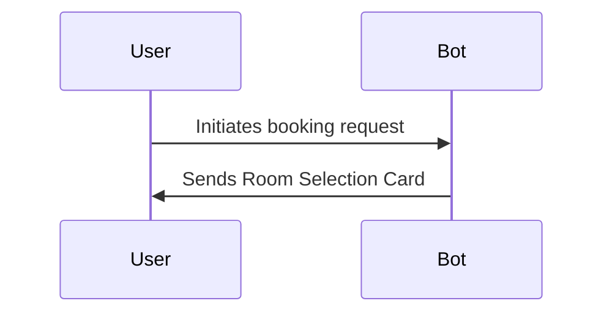
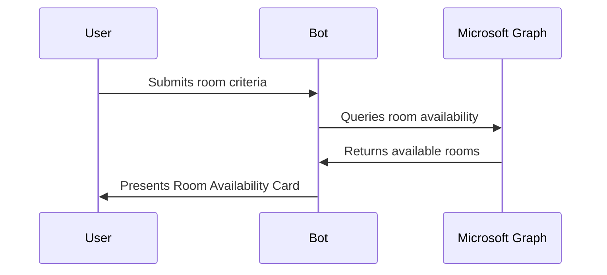
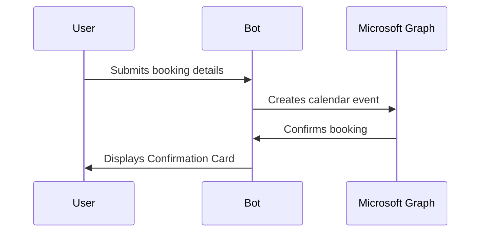

# Meeting Room Booking Bot - Adaptive Card Booking Flow

## Overview

The Meeting Room Booking Bot is a Microsoft Teams application that streamlines the room reservation process through an intuitive Adaptive Card interface. This documentation provides comprehensive details on the implementation, architecture, and usage of the Adaptive Card booking flow for meeting room reservations within Microsoft Teams.

## Key Features

- **Interactive Adaptive Cards**: User-friendly interface for room selection and booking
- **Real-time Availability**: Integration with Exchange/Microsoft Graph for up-to-date room availability
- **Booking Confirmation**: Automatic confirmation cards with meeting details
- **Seamless Calendar Integration**: Direct creation of calendar events
- **Conflict Resolution**: Intelligent handling of booking conflicts
- **Cross-Platform Support**: Works across desktop, web, and mobile Teams clients

## Architecture

### High-Level Components

```
┌───────────────────┐     ┌───────────────────┐     ┌───────────────────┐
│                   │     │                   │     │                   │
│  Teams Client     │◄────┤  Bot Service      │◄────┤  Microsoft Graph  │
│  (Adaptive Cards) │     │  (Azure Bot Svc)  │     │  API              │
│                   │     │                   │     │                   │
└───────────────────┘     └───────────────────┘     └───────────────────┘
                                   ▲
                                   │
                          ┌────────┴──────────┐
                          │                   │
                          │  Azure Functions  │
                          │  (Business Logic) │
                          │                   │
                          └───────────────────┘
```

### Component Details

1. **Teams Client**
   - Renders Adaptive Cards
   - Handles user interactions
   - Sends actions back to the bot

2. **Bot Service**
   - Hosted on Azure Bot Service
   - Processes incoming activities
   - Generates and sends Adaptive Cards
   - Manages conversation state

3. **Azure Functions**
   - Implements business logic
   - Performs availability checks
   - Processes booking requests
   - Handles error scenarios

4. **Microsoft Graph API**
   - Queries room resources
   - Checks calendar availability
   - Creates calendar events
   - Manages room reservations

## Adaptive Card Flow Sequence

### 1. Initial Booking Request

The user initiates the booking process through one of the following methods:
- Messaging the bot directly
- Using the messaging extension
- Clicking on a "Book Room" action in a Teams tab



### 2. Room Selection Card

The first card presented to the user includes:
- Building/location selection dropdown
- Floor/area selection (filtered based on building)
- Room capacity filter
- Date selector
- Optional equipment filters (projector, whiteboard, etc.)

**Sample Card JSON:**

```json
{
  "type": "AdaptiveCard",
  "body": [
    {
      "type": "TextBlock",
      "size": "Medium",
      "weight": "Bolder",
      "text": "Find Available Meeting Rooms"
    },
    {
      "type": "Input.ChoiceSet",
      "id": "buildingSelection",
      "label": "Building",
      "choices": [
        {
          "title": "Building A",
          "value": "buildingA"
        },
        {
          "title": "Building B",
          "value": "buildingB"
        }
      ]
    },
    {
      "type": "Input.ChoiceSet",
      "id": "floorSelection",
      "label": "Floor",
      "choices": [
        {
          "title": "Floor 1",
          "value": "floor1"
        },
        {
          "title": "Floor 2",
          "value": "floor2"
        }
      ]
    },
    {
      "type": "Input.Number",
      "id": "capacity",
      "label": "Minimum Capacity",
      "placeholder": "Enter number of attendees",
      "min": 1,
      "max": 50
    },
    {
      "type": "Input.Date",
      "id": "meetingDate",
      "label": "Date"
    }
  ],
  "actions": [
    {
      "type": "Action.Submit",
      "title": "Find Rooms",
      "data": {
        "actionType": "findRooms"
      }
    }
  ],
  "$schema": "http://adaptivecards.io/schemas/adaptive-card.json",
  "version": "1.5"
}
```

### 3. Room Availability Results

After submitting the room selection criteria, the bot queries the Microsoft Graph API and presents available rooms:
- List of available rooms matching criteria
- Room details (capacity, equipment, location)
- Available time slots
- Quick booking buttons for common durations (30min, 1hr)



### 4. Time Selection

The user selects a room and specifies:
- Start time
- End time (or duration)
- Meeting title
- Optional meeting details

**Sample Card JSON:**

```json
{
  "type": "AdaptiveCard",
  "body": [
    {
      "type": "TextBlock",
      "size": "Medium",
      "weight": "Bolder",
      "text": "Book Room: Conference Room A"
    },
    {
      "type": "ColumnSet",
      "columns": [
        {
          "type": "Column",
          "width": "auto",
          "items": [
            {
              "type": "Image",
              "url": "https://example.com/room-image.png",
              "size": "Small"
            }
          ]
        },
        {
          "type": "Column",
          "width": "stretch",
          "items": [
            {
              "type": "TextBlock",
              "text": "📍 Building A, Floor 2",
              "wrap": true
            },
            {
              "type": "TextBlock",
              "text": "👥 Capacity: 12 people",
              "wrap": true
            },
            {
              "type": "TextBlock",
              "text": "🖥️ Equipment: Projector, Whiteboard",
              "wrap": true
            }
          ]
        }
      ]
    },
    {
      "type": "Input.Text",
      "id": "meetingTitle",
      "label": "Meeting Title",
      "placeholder": "Enter meeting title",
      "isRequired": true
    },
    {
      "type": "Input.Time",
      "id": "startTime",
      "label": "Start Time",
      "value": "09:00"
    },
    {
      "type": "Input.ChoiceSet",
      "id": "duration",
      "label": "Duration",
      "value": "60",
      "choices": [
        {
          "title": "30 minutes",
          "value": "30"
        },
        {
          "title": "1 hour",
          "value": "60"
        },
        {
          "title": "1.5 hours",
          "value": "90"
        },
        {
          "title": "2 hours",
          "value": "120"
        }
      ]
    },
    {
      "type": "Input.Text",
      "id": "meetingDescription",
      "label": "Description (Optional)",
      "placeholder": "Enter meeting details",
      "isMultiline": true
    }
  ],
  "actions": [
    {
      "type": "Action.Submit",
      "title": "Book Now",
      "data": {
        "actionType": "bookRoom",
        "roomId": "room123"
      }
    },
    {
      "type": "Action.Submit",
      "title": "Back to Results",
      "data": {
        "actionType": "backToResults"
      }
    }
  ],
  "$schema": "http://adaptivecards.io/schemas/adaptive-card.json",
  "version": "1.5"
}
```

### 5. Booking Confirmation

Upon successful booking:
- The bot creates a calendar event via Microsoft Graph
- A confirmation card is displayed with meeting details
- Option to modify or cancel the booking
- Calendar invitation is sent to the user



### 6. Booking Management

After booking completion:
- Users can view their bookings
- Modify existing bookings (time, room, attendees)
- Cancel bookings
- Receive reminders before meetings

## Implementation Guide

### Prerequisites

- Microsoft 365 developer account
- Azure subscription
- Bot Framework SDK (v4.15.0 or higher)
- Adaptive Cards SDK (v2.10.0 or higher)
- Teams Toolkit extension for Visual Studio Code (recommended)

### Setup Steps

1. **Register the Bot in Azure Bot Service**

```bash
# Using Azure CLI
az bot create --resource-group "YourResourceGroup" --name "MeetingRoomBookingBot" --kind "registration" --sku "F0" --msi-required
```

2. **Configure Microsoft Graph API Permissions**

The bot requires the following Microsoft Graph permissions:
- Calendars.ReadWrite
- Place.Read.All
- User.Read
- User.ReadBasic.All

```csharp
// Required Graph scopes
string[] scopes = new string[] { 
    "Calendars.ReadWrite", 
    "Place.Read.All", 
    "User.Read", 
    "User.ReadBasic.All" 
};
```

3. **Initialize the Bot Framework Application**

```csharp
// Bot initialization in Startup.cs
services.AddSingleton<IBotFrameworkHttpAdapter, AdapterWithErrorHandler>();
services.AddTransient<IBot, MeetingRoomBookingBot>();
services.AddSingleton<IStorage, MemoryStorage>();
services.AddSingleton<UserState>();
services.AddSingleton<ConversationState>();
```

4. **Create Adaptive Card Templates**

Store your Adaptive Card JSON templates in a `/Cards` directory and load them as needed:

```csharp
// Card loading utility
public static class CardHelper
{
    public static AdaptiveCard GetCardFromFile(string fileName)
    {
        var filePath = Path.Combine("Cards", fileName);
        var cardJson = File.ReadAllText(filePath);
        return AdaptiveCard.FromJson(cardJson).Card;
    }
}
```

5. **Implement Microsoft Graph Integration**

```csharp
// Room availability check
public async Task<List<Room>> GetAvailableRoomsAsync(string building, string floor, int capacity, DateTime date)
{
    var graphClient = GetGraphClient();
    var rooms = await graphClient.Places
        .Request()
        .Filter($"building eq '{building}' and floorNumber eq '{floor}' and capacity ge {capacity}")
        .GetAsync();
        
    var availableRooms = new List<Room>();
    foreach (var room in rooms)
    {
        var availability = await CheckRoomAvailabilityAsync(graphClient, room.Id, date);
        if (availability.Any())
        {
            availableRooms.Add(new Room
            {
                Id = room.Id,
                Name = room.DisplayName,
                Capacity = room.Capacity.Value,
                Building = room.Building,
                Floor = room.FloorNumber,
                AvailableSlots = availability
            });
        }
    }
    
    return availableRooms;
}
```

6. **Handle Card Actions**

Implement activity handlers to process card submissions:

```csharp
protected override async Task OnAdaptiveCardSubmitActionAsync(ITurnContext<IMessageActivity> turnContext, CancellationToken cancellationToken)
{
    var data = JsonConvert.DeserializeObject<BookingCardAction>(turnContext.Activity.Value.ToString());
    
    switch (data.ActionType)
    {
        case "findRooms":
            await HandleFindRoomsActionAsync(turnContext, data, cancellationToken);
            break;
            
        case "bookRoom":
            await HandleBookRoomActionAsync(turnContext, data, cancellationToken);
            break;
            
        case "backToResults":
            await HandleBackToResultsActionAsync(turnContext, data, cancellationToken);
            break;
            
        default:
            await turnContext.SendActivityAsync("Unsupported action type.");
            break;
    }
}
```

### Error Handling

Implement robust error handling for common scenarios:

1. **Room No Longer Available**

```csharp
try {
    // Attempt to book the room
    await BookRoomAsync(roomId, startTime, endTime, title, description);
} catch (GraphServiceException ex) when (ex.Message.Contains("Suggested time span is not available")) {
    // Room is no longer available
    await turnContext.SendActivityAsync(MessageFactory.Attachment(
        CreateErrorCard("This room is no longer available for the selected time. Please try another room or time slot.")));
    
    // Refresh room availability
    await HandleFindRoomsActionAsync(turnContext, lastSearchCriteria, cancellationToken);
}
```

2. **Authorization Errors**

```csharp
try {
    // Graph API operations
} catch (GraphServiceException ex) when (ex.StatusCode == HttpStatusCode.Unauthorized) {
    // Token expired or invalid
    await turnContext.SendActivityAsync(MessageFactory.Attachment(
        CreateErrorCard("Your session has expired. Please start over to authenticate again.")));
        
    // Clear user state and prompt for new sign-in
    await userState.ClearStateAsync(turnContext, cancellationToken);
}
```

3. **Network/Service Errors**

```csharp
try {
    // API operations
} catch (Exception ex) when (
    ex is HttpRequestException || 
    ex is TaskCanceledException ||
    (ex is GraphServiceException gse && gse.StatusCode >= HttpStatusCode.InternalServerError)) {
    
    // Log the error
    logger.LogError(ex, "Service error occurred during room booking");
    
    // Send friendly message
    await turnContext.SendActivityAsync(MessageFactory.Attachment(
        CreateErrorCard("We're experiencing technical difficulties. Please try again in a few moments.")));
}
```

## Best Practices

### Performance Optimization

1. **Caching Room Data**

```csharp
// Cache room data to reduce Graph API calls
private readonly MemoryCache _cache = new MemoryCache(new MemoryCacheOptions());

public async Task<List<Room>> GetRoomsAsync(string building)
{
    string cacheKey = $"rooms_{building}";
    
    if (!_cache.TryGetValue(cacheKey, out List<Room> rooms))
    {
        // Cache miss, fetch from Graph API
        rooms = await FetchRoomsFromGraphAsync(building);
        
        // Cache for 1 hour
        _cache.Set(cacheKey, rooms, TimeSpan.FromHours(1));
    }
    
    return rooms;
}
```

2. **Batch Availability Requests**

Use Microsoft Graph batch requests to check availability for multiple rooms simultaneously:

```csharp
public async Task<Dictionary<string, List<TimeSlot>>> CheckMultipleRoomAvailabilityAsync(
    List<string> roomIds, DateTime date)
{
    var batchRequestContent = new BatchRequestContent();
    
    foreach (var roomId in roomIds)
    {
        var request = graphClient.Users[roomId]
            .Calendar
            .GetSchedule(new List<string> { roomId }, date, date.AddDays(1))
            .Request()
            .GetHttpRequestMessage();
            
        batchRequestContent.AddBatchRequestStep(new BatchRequestStep(roomId, request));
    }
    
    var batchResponse = await graphClient.Batch.Request().PostAsync(batchRequestContent);
    
    // Process batch response
    var availabilityMap = new Dictionary<string, List<TimeSlot>>();
    foreach (var roomId in roomIds)
    {
        if (batchResponse.Responses.TryGetValue(roomId, out var response))
        {
            if (response.StatusCode == HttpStatusCode.OK)
            {
                var scheduleResponse = await response.GetResponseObjectAsync<ScheduleResponse>();
                availabilityMap[roomId] = ConvertToTimeSlots(scheduleResponse);
            }
        }
    }
    
    return availabilityMap;
}
```

### User Experience Guidelines

1. **Progressive Disclosure**

Present information in stages to avoid overwhelming the user:
- Start with minimal required fields
- Add advanced options in later steps
- Use "Show more" buttons for additional filters

2. **Visual Cues for Availability**

Use color and icons to indicate room status:
- Green for available rooms
- Red for booked rooms
- Yellow for rooms with partial availability

3. **Responsive Design**

Ensure cards work well across different devices:
- Test on desktop, web, and mobile Teams clients
- Adjust layouts for smaller screens
- Implement fallbacks for unsupported features

## Testing

### Unit Testing

Example test for the room availability service:

```csharp
[Fact]
public async Task GetAvailableRooms_WithValidCriteria_ReturnsAvailableRooms()
{
    // Arrange
    var mockGraphClient = new Mock<IGraphServiceClient>();
    SetupMockGraphClient(mockGraphClient);
    
    var service = new RoomService(mockGraphClient.Object);
    
    // Act
    var results = await service.GetAvailableRoomsAsync(
        "Building A", 
        "Floor 1", 
        5, 
        DateTime.Today.AddDays(1));
    
    // Assert
    Assert.NotEmpty(results);
    Assert.All(results, room => Assert.True(room.Capacity >= 5));
    Assert.All(results, room => Assert.Equal("Building A", room.Building));
    Assert.All(results, room => Assert.Equal("Floor 1", room.Floor));
}
```

### Integration Testing

Test the end-to-end booking flow:

```csharp
[Fact]
public async Task BookingFlow_CompletesSuccessfully()
{
    // Arrange
    var storage = new MemoryStorage();
    var conversationState = new ConversationState(storage);
    var userState = new UserState(storage);
    
    var testAdapter = new TestAdapter()
        .Use(new AutoSaveStateMiddleware(conversationState, userState));
    
    var bot = new MeetingRoomBookingBot(conversationState, userState);
    
    // Act & Assert
    await testAdapter
        .Send("book a room")
        .AssertReply(activity => {
            Assert.Equal(ActivityTypes.Message, activity.Type);
            Assert.NotNull(activity.Attachments);
            Assert.Single(activity.Attachments);
            Assert.Equal("application/vnd.microsoft.card.adaptive", activity.Attachments[0].ContentType);
            
            // Verify it's the room selection card
            var card = JsonConvert.DeserializeObject<AdaptiveCard>(
                activity.Attachments[0].Content.ToString());
            Assert.Contains(card.Body, item => 
                item is AdaptiveTextBlock text && 
                text.Text.Contains("Find Available Meeting Rooms"));
        })
        .Send(new Activity { 
            Type = ActivityTypes.Message, 
            Value = JObject.FromObject(new {
                actionType = "findRooms",
                buildingSelection = "buildingA",
                floorSelection = "floor1",
                capacity = 5,
                meetingDate = DateTime.Today.AddDays(1).ToString("yyyy-MM-dd")
            })
        })
        .AssertReply(activity => {
            // Verify it's the room availability card
            var card = JsonConvert.DeserializeObject<AdaptiveCard>(
                activity.Attachments[0].Content.ToString());
            Assert.Contains(card.Body, item => 
                item is AdaptiveTextBlock text && 
                text.Text.Contains("Available Rooms"));
        })
        // Continue with booking process
        .StartTestAsync();
}
```

## Troubleshooting

### Common Issues and Resolutions

| Issue | Possible Cause | Resolution |
|-------|---------------|------------|
| Rooms not showing in results | Insufficient Graph permissions | Verify the bot has `Place.Read.All` permissions |
| Booking fails with 403 error | Calendar permissions missing | Ensure the bot has `Calendars.ReadWrite` scope |
| Empty building dropdown | Room list cache issue | Clear the room cache or restart the bot service |
| "Room unavailable" errors | Race condition during booking | Implement optimistic concurrency with version checking |
| Card rendering issues | Unsupported Adaptive Card features | Check Teams client version and use feature detection |

### Debugging Tips

1. **Enable Detailed Logging**

```csharp
public class MeetingRoomBookingBot : ActivityHandler
{
    private readonly ILogger<MeetingRoomBookingBot> _logger;
    
    public MeetingRoomBookingBot(ILogger<MeetingRoomBookingBot> logger)
    {
        _logger = logger;
    }
    
    protected override async Task OnMessageActivityAsync(ITurnContext<IMessageActivity> turnContext, CancellationToken cancellationToken)
    {
        _logger.LogInformation("Processing message activity with text: {Text}", turnContext.Activity.Text);
        
        try
        {
            // Bot logic here
        }
        catch (Exception ex)
        {
            _logger.LogError(ex, "Error during message processing");
            throw;
        }
    }
}
```

2. **Inspect Adaptive Card Rendering**

Add a debug card action to inspect the card data:

```json
{
  "type": "Action.Submit",
  "title": "Debug",
  "style": "destructive",
  "id": "debugAction",
  "data": {
    "actionType": "debug"
  }
}
```

3. **Test Microsoft Graph Queries Independently**

Use Graph Explorer (https://developer.microsoft.com/graph/graph-explorer) to test queries before implementing them in the bot.

## Future Enhancements

### Planned Features

1. **Multi-Room Booking**
   - Ability to book multiple rooms for the same meeting
   - Conflict resolution across rooms

2. **Recurring Meetings**
   - Support for creating recurring meeting patterns
   - Management of series exceptions

3. **Room Equipment Management**
   - Detailed equipment filtering
   - Equipment reservation within rooms

4. **Analytics Dashboard**
   - Room utilization metrics
   - Booking patterns analysis

## References

- [Microsoft Teams Bot Framework Documentation](https://docs.microsoft.com/en-us/microsoftteams/platform/bots/what-are-bots)
- [Adaptive Cards Schema](https://adaptivecards.io/explorer/)
- [Microsoft Graph API - Calendar Resources](https://docs.microsoft.com/en-us/graph/api/resources/calendar?view=graph-rest-1.0)
- [Microsoft Graph API - Places and Rooms](https://docs.microsoft.com/en-us/graph/api/resources/place?view=graph-rest-1.0)

## Appendix

### Full Code Samples

#### Room Service Implementation

```csharp
public class RoomService : IRoomService
{
    private readonly IGraphServiceClient _graphClient;
    private readonly IMemoryCache _cache;
    private readonly ILogger<RoomService> _logger;

    public RoomService(
        IGraphServiceClient graphClient,
        IMemoryCache memoryCache,
        ILogger<RoomService> logger)
    {
        _graphClient = graphClient;
        _cache = memoryCache;
        _logger = logger;
    }

    public async Task<List<Place>> GetBuildingsAsync()
    {
        const string cacheKey = "buildings";

        if (!_cache.TryGetValue(cacheKey, out List<Place> buildings))
        {
            try
            {
                var places = await _graphClient.Places
                    .Request()
                    .Filter("type eq 'building'")
                    .GetAsync();

                buildings = places.CurrentPage.ToList();
                _cache.Set(cacheKey, buildings, TimeSpan.FromHours(24));
            }
            catch (Exception ex)
            {
                _logger.LogError(ex, "Error fetching buildings");
                return new List<Place>();
            }
        }

        return buildings;
    }

    public async Task<List<Room>> GetAvailableRoomsAsync(
        string buildingId, 
        string floor, 
        int capacity, 
        DateTime date,
        TimeSpan startTime,
        TimeSpan duration)
    {
        try
        {
            // Filter rooms by building, floor and capacity
            var rooms = await _graphClient.Places
                .Request()
                .Filter($"type eq 'room' and building eq '{buildingId}' and floorLabel eq '{floor}' and capacity ge {capacity}")
                .GetAsync();

            var roomIds = rooms.CurrentPage.Select(r => r.Id).ToList();
            
            // Check availability for all rooms
            var startDateTime = new DateTimeOffset(date.Add(startTime));
            var endDateTime = startDateTime.AddMinutes(duration.TotalMinutes);
            
            var scheduleRequest = new List<ScheduleInformation>
            {
                new ScheduleInformation
                {
                    ScheduleId = roomIds,
                    StartTime = new DateTimeTimeZone
                    {
                        DateTime = startDateTime.ToString("o"),
                        TimeZone = "UTC"
                    },
                    EndTime = new DateTimeTimeZone
                    {
                        DateTime = endDateTime.ToString("o"),
                        TimeZone = "UTC"
                    }
                }
            };

            var scheduleResult = await _graphClient.Users[roomIds[0]]
                .Calendar
                .GetSchedule(scheduleRequest)
                .Request()
                .PostAsync();

            // Filter available rooms
            var availableRoomIds = new HashSet<string>();
            foreach (var item in scheduleResult)
            {
                if (item.ScheduleItems == null || !item.ScheduleItems.Any())
                {
                    availableRoomIds.Add(item.ScheduleId);
                }
            }

            // Create result
            var availableRooms = rooms.CurrentPage
                .Where(r => availableRoomIds.Contains(r.Id))
                .Select(r => new Room
                {
                    Id = r.Id,
                    Name = r.DisplayName,
                    Building = r.Building,
                    Floor = r.FloorLabel,
                    Capacity = r.Capacity ?? 0,
                    HasAudio = r.AudioDeviceName != null,
                    HasVideo = r.VideoDeviceName != null
                })
                .ToList();

            return availableRooms;
        }
        catch (Exception ex)
        {
            _logger.LogError(ex, "Error fetching available rooms");
            return new List<Room>();
        }
    }

    public async Task<bool> BookRoomAsync(
        string roomId,
        string userEmail,
        string subject,
        string description,
        DateTime date,
        TimeSpan startTime,
        TimeSpan duration)
    {
        try
        {
            var startDateTime = date.Add(startTime);
            var endDateTime = startDateTime.AddMinutes(duration.TotalMinutes);

            var newEvent = new Event
            {
                Subject = subject,
                Body = new ItemBody
                {
                    ContentType = BodyType.Text,
                    Content = description
                },
                Start = new DateTimeTimeZone
                {
                    DateTime = startDateTime.ToString("o"),
                    TimeZone = "UTC"
                },
                End = new DateTimeTimeZone
                {
                    DateTime = endDateTime.ToString("o"),
                    TimeZone = "UTC"
                },
                Location = new Location
                {
                    DisplayName = "Meeting Room",
                    LocationUri = roomId
                },
                Attendees = new List<Attendee>
                {
                    new Attendee
                    {
                        EmailAddress = new EmailAddress
                        {
                            Address = roomId,
                            Name = "Meeting Room"
                        },
                        Type = AttendeeType.Resource
                    },
                    new Attendee
                    {
                        EmailAddress = new EmailAddress
                        {
                            Address = userEmail
                        },
                        Type = AttendeeType.Required
                    }
                }
            };

            await _graphClient.Me.Events
                .Request()
                .AddAsync(newEvent);

            return true;
        }
        catch (Exception ex)
        {
            _logger.LogError(ex, "Error booking room");
            return false;
        }
    }
}
```

#### Adaptive Card Creation Helper

```csharp
public static class CardFactory
{
    public static Attachment CreateRoomSelectionCard(
        List<Place> buildings,
        List<string> floors,
        DateTime defaultDate)
    {
        var card = new AdaptiveCard(new AdaptiveSchemaVersion(1, 5))
        {
            Body = new List<AdaptiveElement>
            {
                new AdaptiveTextBlock
                {
                    Text = "Find Available Meeting Rooms",
                    Size = AdaptiveTextSize.Medium,
                    Weight = AdaptiveTextWeight.Bolder
                },
                new AdaptiveChoiceSetInput
                {
                    Id = "buildingSelection",
                    Label = "Building",
                    Choices = buildings.Select(b => new AdaptiveChoice
                    {
                        Title = b.DisplayName,
                        Value = b.Id
                    }).ToList(),
                    IsRequired = true
                },
                new AdaptiveChoiceSetInput
                {
                    Id = "floorSelection",
                    Label = "Floor",
                    Choices = floors.Select(f => new AdaptiveChoice
                    {
                        Title = $"Floor {f}",
                        Value = f
                    }).ToList(),
                    IsRequired = true
                },
                new AdaptiveNumberInput
                {
                    Id = "capacity",
                    Label = "Minimum Capacity",
                    Placeholder = "Enter number of attendees",
                    Min = 1,
                    Max = 50,
                    Value = 4
                },
                new AdaptiveDateInput
                {
                    Id = "meetingDate",
                    Label = "Date",
                    Value = defaultDate.ToString("yyyy-MM-dd")
                },
                new AdaptiveTimeInput
                {
                    Id = "startTime",
                    Label = "Start Time",
                    Value = "09:00"
                },
                new AdaptiveChoiceSetInput
                {
                    Id = "duration",
                    Label = "Duration",
                    Value = "60",
                    Choices = new List<AdaptiveChoice>
                    {
                        new AdaptiveChoice { Title = "30 minutes", Value = "30" },
                        new AdaptiveChoice { Title = "1 hour", Value = "60" },
                        new AdaptiveChoice { Title = "1.5 hours", Value = "90" },
                        new AdaptiveChoice { Title = "2 hours", Value = "120" }
                    }
                }
            },
            Actions = new List<AdaptiveAction>
            {
                new AdaptiveSubmitAction
                {
                    Title = "Find Rooms",
                    Data = new { actionType = "findRooms" }
                }
            }
        };

        return new Attachment
        {
            ContentType = AdaptiveCard.ContentType,
            Content = card
        };
    }

    public static Attachment CreateRoomAvailabilityCard(List<Room> rooms)
    {
        var card = new AdaptiveCard(new AdaptiveSchemaVersion(1, 5))
        {
            Body = new List<AdaptiveElement>
            {
                new AdaptiveTextBlock
                {
                    Text = $"Available Rooms ({rooms.Count})",
                    Size = AdaptiveTextSize.Medium,
                    Weight = AdaptiveTextWeight.Bolder
                }
            }
        };

        foreach (var room in rooms)
        {
            card.Body.Add(new AdaptiveContainer
            {
                Items = new List<AdaptiveElement>
                {
                    new AdaptiveColumnSet
                    {
                        Columns = new List<AdaptiveColumn>
                        {
                            new AdaptiveColumn
                            {
                                Width = "stretch",
                                Items = new List<AdaptiveElement>
                                {
                                    new AdaptiveTextBlock
                                    {
                                        Text = room.Name,
                                        Weight = AdaptiveTextWeight.Bolder,
                                        Size = AdaptiveTextSize.Default
                                    },
                                    new AdaptiveTextBlock
                                    {
                                        Text = $"📍 {room.Building}, Floor {room.Floor}",
                                        Spacing = AdaptiveSpacing.None,
                                        IsSubtle = true
                                    },
                                    new AdaptiveTextBlock
                                    {
                                        Text = $"👥 Capacity: {room.Capacity} people",
                                        Spacing = AdaptiveSpacing.None,
                                        IsSubtle = true
                                    }
                                }
                            },
                            new AdaptiveColumn
                            {
                                Width = "auto",
                                Items = new List<AdaptiveElement>
                                {
                                    new AdaptiveActionSet
                                    {
                                        Actions = new List<AdaptiveAction>
                                        {
                                            new AdaptiveSubmitAction
                                            {
                                                Title = "Select",
                                                Data = new 
                                                { 
                                                    actionType = "selectRoom",
                                                    roomId = room.Id
                                                }
                                            }
                                        }
                                    }
                                }
                            }
                        }
                    }
                },
                Style = AdaptiveContainerStyle.Default,
                Separator = true
            });
        }

        card.Actions = new List<AdaptiveAction>
        {
            new AdaptiveSubmitAction
            {
                Title = "Back",
                Data = new { actionType = "backToSelection" }
            }
        };

        return new Attachment
        {
            ContentType = AdaptiveCard.ContentType,
            Content = card
        };
    }

    public static Attachment CreateBookingConfirmationCard(
        Room room,
        string meetingTitle,
        DateTime meetingDate,
        TimeSpan startTime,
        int durationMinutes)
    {
        var endTime = startTime.Add(TimeSpan.FromMinutes(durationMinutes));
        
        var card = new AdaptiveCard(new AdaptiveSchemaVersion(1, 5))
        {
            Body = new List<AdaptiveElement>
            {
                new AdaptiveTextBlock
                {
                    Text = "✅ Room Booked Successfully",
                    Size = AdaptiveTextSize.Medium,
                    Weight = AdaptiveTextWeight.Bolder,
                    Color = AdaptiveTextColor.Good
                },
                new AdaptiveTextBlock
                {
                    Text = meetingTitle,
                    Size = AdaptiveTextSize.Large,
                    Weight = AdaptiveTextWeight.Bolder
                },
                new AdaptiveFactSet
                {
                    Facts = new List<AdaptiveFact>
                    {
                        new AdaptiveFact(
                            "Room:",
                            room.Name),
                        new AdaptiveFact(
                            "Location:",
                            $"{room.Building}, Floor {room.Floor}"),
                        new AdaptiveFact(
                            "Date:",
                            meetingDate.ToString("dddd, MMMM d, yyyy")),
                        new AdaptiveFact(
                            "Time:",
                            $"{startTime:hh\\:mm} - {endTime:hh\\:mm}"),
                        new AdaptiveFact(
                            "Capacity:",
                            $"{room.Capacity} people")
                    }
                },
                new AdaptiveTextBlock
                {
                    Text = "A calendar invitation has been sent to your email.",
                    Wrap = true,
                    Spacing = AdaptiveSpacing.Medium
                }
            },
            Actions = new List<AdaptiveAction>
            {
                new AdaptiveSubmitAction
                {
                    Title = "Book Another Room",
                    Data = new { actionType = "newBooking" }
                },
                new AdaptiveSubmitAction
                {
                    Title = "Cancel This Booking",
                    Style = AdaptiveActionStyle.Destructive,
                    Data = new 
                    { 
                        actionType = "cancelBooking",
                        roomId = room.Id,
                        date = meetingDate.ToString("yyyy-MM-dd"),
                        startTime = startTime.ToString("hh\\:mm"),
                        endTime = endTime.ToString("hh\\:mm")
                    }
                }
            }
        };

        return new Attachment
        {
            ContentType = AdaptiveCard.ContentType,
            Content = card
        };
    }
}
```

### Resource Models

```csharp
public class Room
{
    public string Id { get; set; }
    public string Name { get; set; }
    public string Building { get; set; }
    public string Floor { get; set; }
    public int Capacity { get; set; }
    public bool HasAudio { get; set; }
    public bool HasVideo { get; set; }
    public List<EquipmentItem> Equipment { get; set; } = new List<EquipmentItem>();
}

public class EquipmentItem
{
    public string Name { get; set; }
    public string Type { get; set; }
}

public class BookingCardAction
{
    public string ActionType { get; set; }
    public string BuildingSelection { get; set; }
    public string FloorSelection { get; set; }
    public int Capacity { get; set; }
    public string MeetingDate { get; set; }
    public string StartTime { get; set; }
    public string Duration { get; set; }
    public string RoomId { get; set; }
    public string MeetingTitle { get; set; }
    public string MeetingDescription { get; set; }
}
```
