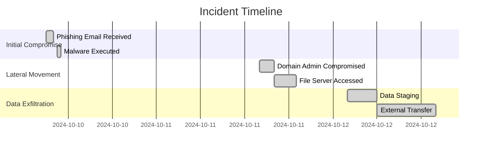
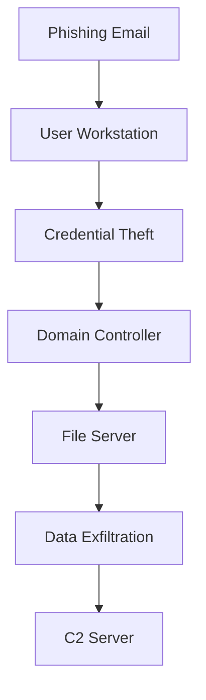
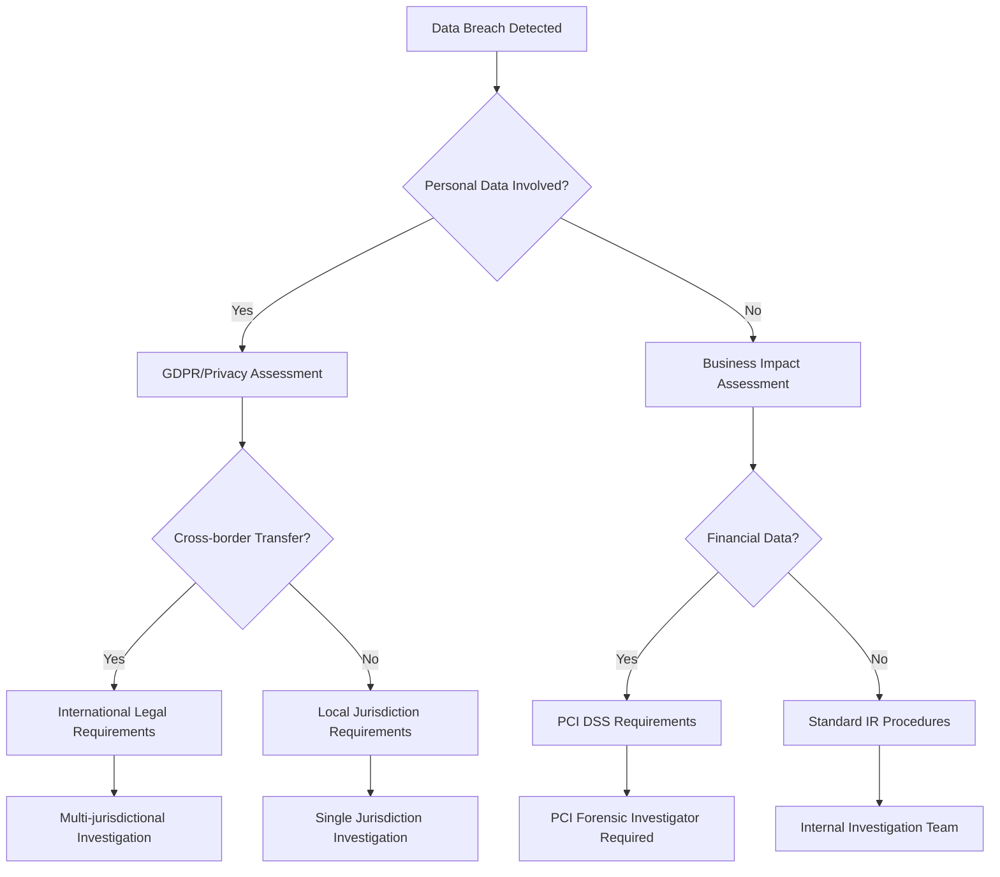

# Forensic Reporting

## Overview
This document provides comprehensive guidance for AI agents on digital forensic reporting procedures, methodologies, and best practices. It covers investigation protocols, evidence handling, report generation, and legal considerations for forensic investigations.

## Core Principles

### 1. Chain of Custody
- Maintain unbroken documentation of evidence handling
- Record every access and transfer
- Preserve evidence integrity at all times

### 2. Objectivity and Impartiality
- Report facts without bias
- Present all relevant findings
- Avoid speculation or assumptions

### 3. Repeatability and Reproducibility
- Document all procedures used
- Ensure findings can be verified
- Maintain detailed technical notes

## Forensic Investigation Framework

### Phase 1: Preparation and Planning

#### Initial Assessment
```yaml
assessment_checklist:
  - incident_type: 
    - Data breach
    - Malware infection
    - Insider threat
    - System compromise
  - scope_definition:
    - Affected systems
    - Time window
    - Data types involved
  - legal_requirements:
    - Regulatory compliance
    - Law enforcement involvement
    - Litigation hold requirements
```

#### Resource Requirements
- **Personnel**: Certified forensic analysts, legal counsel, incident response team
- **Tools**: EnCase, FTK, Volatility, Wireshark, specialized hardware
- **Infrastructure**: Forensic workstations, evidence storage, isolated network

### Phase 2: Evidence Collection

#### Types of Evidence

##### Volatile Evidence (Order of Volatility)
1. CPU registers and cache
2. Memory (RAM)
3. Network connections
4. Running processes
5. Network routing tables
6. ARP cache
7. Temporary file systems

##### Non-Volatile Evidence
- Hard drives and SSDs
- USB devices
- Optical media
- Cloud storage
- Backup tapes
- Log files

#### Collection Procedures

##### Memory Acquisition
```bash
# Windows Memory Collection
winpmem_3.3.rc1.exe -o memory.raw

# Linux Memory Collection
sudo ./linpmem -o memory.raw

# Verification
sha256sum memory.raw > memory.raw.sha256
```

##### Disk Imaging
```bash
# Create forensic image
dcfldd if=/dev/sda hash=sha256 hashlog=sda.hashlog \
  conv=sync,noerror of=evidence.dd

# Verify image integrity
sha256sum evidence.dd
```

##### Network Traffic Capture
```bash
# Full packet capture
tcpdump -i eth0 -w capture.pcap

# Targeted capture with filters
tcpdump -i eth0 'host 192.168.1.100 and port 443' -w targeted.pcap
```

### Phase 3: Analysis

#### File System Analysis

##### Timeline Creation
```python
# Example timeline generation structure
timeline_entry = {
    "timestamp": "2024-10-15T14:30:22Z",
    "source": "NTFS MFT",
    "action": "FILE_CREATE",
    "path": "C:\\Users\\suspect\\Documents\\sensitive.xlsx",
    "metadata": {
        "size": 245678,
        "hash": "a7b9c3d2e4f5...",
        "owner": "DOMAIN\\suspect"
    }
}
```

##### Artifact Recovery
- Deleted files
- System artifacts
- Browser history
- Registry analysis
- Email archives

#### Memory Analysis

##### Process Analysis
```yaml
suspicious_indicators:
  - unsigned_processes: Check digital signatures
  - hidden_processes: Compare with multiple tools
  - injection_techniques: 
    - Process hollowing
    - DLL injection
    - Thread hijacking
  - network_connections: Unusual destinations
```

##### Malware Detection
- String extraction
- Import table analysis
- Behavioral patterns
- Network indicators
- Persistence mechanisms

#### Log Analysis

##### Windows Event Logs
```json
{
  "critical_events": {
    "4624": "Successful logon",
    "4625": "Failed logon",
    "4688": "Process creation",
    "4697": "Service installation",
    "7045": "New service installed"
  },
  "analysis_priority": [
    "Security.evtx",
    "System.evtx",
    "Application.evtx",
    "PowerShell-Operational.evtx"
  ]
}
```

##### Linux System Logs
- `/var/log/auth.log`: Authentication events
- `/var/log/syslog`: System events
- `/var/log/kern.log`: Kernel events
- `/var/log/apache2/`: Web server logs

### Phase 4: Report Generation

#### Report Structure

##### Executive Summary
```markdown
## Executive Summary

### Incident Overview
- **Date Discovered**: October 15, 2024
- **Type**: Data Exfiltration
- **Severity**: Critical
- **Status**: Contained

### Key Findings
1. Unauthorized access via compromised credentials
2. 50GB of sensitive data exfiltrated
3. Malware installed for persistence
4. Evidence of lateral movement

### Recommendations
1. Immediate password reset for all users
2. Network segmentation implementation
3. Enhanced monitoring deployment
4. Security awareness training
```

##### Technical Details
- Methodology employed
- Tools and techniques used
- Detailed timeline of events
- Technical indicators of compromise
- System vulnerabilities identified

##### Evidence Summary
```yaml
evidence_catalog:
  - item_id: "EVD-001"
    type: "Disk Image"
    source: "DESKTOP-ABC123"
    hash: "sha256:a7b9c3d2..."
    acquisition_date: "2024-10-15"
    chain_of_custody: 
      - handler: "J. Smith"
        date: "2024-10-15"
        action: "Acquired"
    
  - item_id: "EVD-002"
    type: "Memory Dump"
    source: "SERVER-XYZ789"
    hash: "sha256:e4f5g6h7..."
    acquisition_date: "2024-10-15"
```

#### Visualization Requirements

##### Timeline Visualization


##### Attack Path Diagram


### Phase 5: Legal Considerations

#### Admissibility Requirements

##### Documentation Standards
```json
{
  "legal_requirements": {
    "chain_of_custody": {
      "continuous": true,
      "documented": true,
      "signatures": "required"
    },
    "evidence_handling": {
      "write_blocking": "mandatory",
      "hashing": "before_and_after",
      "storage": "tamper_evident"
    },
    "reporting": {
      "objectivity": "required",
      "technical_accuracy": "verified",
      "peer_review": "recommended"
    }
  }
}
```

##### Expert Testimony Preparation
- Clear methodology documentation
- Tool validation records
- Certification maintenance
- Continuing education records

## Reporting Templates

### Incident Response Report Template

```markdown
# Forensic Investigation Report

## Case Information
- **Case Number**: [YYYY-MM-DD-XXX]
- **Investigator**: [Name, Certification]
- **Date Range**: [Start] to [End]
- **Client**: [Organization Name]

## 1. Executive Summary
[Brief overview of the incident and key findings]

## 2. Scope of Investigation
### 2.1 Systems Examined
- [System 1: Hostname, IP, OS]
- [System 2: Hostname, IP, OS]

### 2.2 Time Period
[Specific dates and times covered]

## 3. Methodology
### 3.1 Tools Used
- [Tool Name v.X.X]
- [Tool Name v.X.X]

### 3.2 Procedures Followed
1. [Step 1]
2. [Step 2]

## 4. Findings
### 4.1 Timeline of Events
[Chronological listing of significant events]

### 4.2 Technical Analysis
[Detailed technical findings]

### 4.3 Indicators of Compromise
- **Network IOCs**:
  - [IP addresses]
  - [Domain names]
- **Host IOCs**:
  - [File hashes]
  - [Registry keys]

## 5. Conclusions
[Summary of what occurred based on evidence]

## 6. Recommendations
1. [Immediate actions]
2. [Long-term improvements]

## 7. Appendices
### A. Evidence Inventory
### B. Technical Details
### C. Log Excerpts
```

### Malware Analysis Report Template

```markdown
# Malware Analysis Report

## Sample Information
- **MD5**: [Hash]
- **SHA256**: [Hash]
- **File Name**: [Original name]
- **File Type**: [PE/ELF/Script]
- **First Seen**: [Date]

## Static Analysis
### File Properties
- **Size**: [Bytes]
- **Compile Time**: [Timestamp]
- **Packer**: [If applicable]

### Strings of Interest
- [Relevant strings found]

### Import Analysis
- [Suspicious API calls]

## Dynamic Analysis
### Behavioral Summary
- [Key behaviors observed]

### Network Activity
- **Contacted IPs**: [List]
- **Domains**: [List]
- **Protocols**: [HTTP/HTTPS/DNS]

### System Modifications
- **Files Created/Modified**
- **Registry Changes**
- **Process Activity**

## Detection and Mitigation
### YARA Rules
```yara
rule MalwareName {
    meta:
        description = "Detects XYZ malware"
        author = "Analyst Name"
        date = "2024-10-15"
    
    strings:
        $s1 = {48 8B 45 F8}
        $s2 = "malicious.domain.com"
    
    condition:
        all of them
}
```

### Recommended Actions
1. [Detection methods]
2. [Removal procedures]
3. [Prevention measures]
```

## Quality Assurance

### Peer Review Process
```yaml
review_checklist:
  technical_accuracy:
    - Hash verification
    - Timeline consistency
    - IOC validation
  report_quality:
    - Grammar and spelling
    - Clarity of explanations
    - Completeness of findings
  legal_compliance:
    - Chain of custody intact
    - Methodology documented
    - Objectivity maintained
```

### Common Errors to Avoid

1. **Speculation Without Evidence**
   - Stick to facts supported by evidence
   - Use qualifying language when uncertain

2. **Incomplete Documentation**
   - Document all steps taken
   - Include negative findings

3. **Technical Jargon Overuse**
   - Define technical terms
   - Provide context for findings

4. **Missing Context**
   - Explain significance of findings
   - Relate to business impact

## Tools and Resources

### Forensic Tools

#### Disk Forensics
- **EnCase**: Commercial forensic suite
- **FTK**: Forensic toolkit
- **Autopsy**: Open-source platform
- **X-Ways**: Advanced hex editor

#### Memory Forensics
- **Volatility**: Memory analysis framework
- **Rekall**: Memory forensic framework
- **Redline**: IOC analysis tool

#### Network Forensics
- **Wireshark**: Packet analysis
- **NetworkMiner**: Network forensic tool
- **Zeek**: Network security monitor

### Documentation Tools
```json
{
  "case_management": {
    "commercial": ["CaseGuard", "FTK Lab"],
    "open_source": ["XIRAF", "CyLR"]
  },
  "reporting": {
    "templates": ["SANS formats", "NIST guidelines"],
    "visualization": ["Timeline Explorer", "Plaso/Log2timeline"]
  }
}
```

## Compliance and Standards

### Industry Standards
- **ISO/IEC 27037**: Digital evidence handling
- **ISO/IEC 27043**: Incident investigation
- **NIST SP 800-86**: Integration into incident response

### Legal Requirements
```yaml
jurisdiction_considerations:
  US:
    - Federal Rules of Evidence
    - Electronic Communications Privacy Act
    - Fourth Amendment considerations
  EU:
    - GDPR requirements
    - Data retention directives
    - Cross-border data transfers
  industry_specific:
    - HIPAA (Healthcare)
    - PCI DSS (Payment cards)
    - SOX (Financial)
```

## Continuous Improvement

### Metrics and KPIs
```json
{
  "performance_metrics": {
    "time_to_detection": "< 24 hours",
    "evidence_collection_time": "< 48 hours",
    "report_generation": "< 5 days",
    "accuracy_rate": "> 99%"
  },
  "quality_metrics": {
    "peer_review_score": "> 90%",
    "client_satisfaction": "> 95%",
    "court_admissibility": "100%"
  }
}
```

### Training Requirements
- Annual certification maintenance
- Tool-specific training
- Legal update briefings
- Incident response exercises

## Advanced Forensic Techniques

### Anti-Forensics Detection

#### Common Anti-Forensics Techniques
```yaml
anti_forensics_indicators:
  data_destruction:
    - Secure deletion tools (DBAN, sdelete)
    - Overwriting patterns
    - Physical destruction
  data_hiding:
    - Steganography
    - Alternate data streams
    - Slack space utilization
  artifact_manipulation:
    - Timestamp modification
    - Log tampering
    - Registry cleaning
  encryption:
    - Full disk encryption
    - Container files
    - Encrypted communications
```

#### Detection Strategies
1. **Signature Analysis**
   - Known tool artifacts
   - Wiping patterns
   - Encryption signatures

2. **Behavioral Analysis**
   - Unusual system activity
   - Missing expected artifacts
   - Timeline inconsistencies

### Cloud Forensics

#### Platform-Specific Procedures
```json
{
  "aws": {
    "evidence_sources": [
      "CloudTrail logs",
      "VPC Flow Logs",
      "S3 access logs",
      "EC2 snapshots"
    ],
    "collection_tools": [
      "AWS CLI",
      "AWS Systems Manager",
      "Third-party tools"
    ]
  },
  "azure": {
    "evidence_sources": [
      "Activity logs",
      "Diagnostic logs",
      "Network watcher",
      "VM snapshots"
    ],
    "collection_tools": [
      "Azure CLI",
      "Azure PowerShell",
      "Azure Security Center"
    ]
  },
  "gcp": {
    "evidence_sources": [
      "Cloud Audit Logs",
      "VPC Flow Logs",
      "Stackdriver logs",
      "Compute Engine snapshots"
    ]
  }
}
```

### Mobile Device Forensics

#### iOS Forensics
```bash
# Logical extraction
idevicebackup2 backup --full /evidence/ios_backup/

# File system extraction (jailbroken devices)
ssh root@device "tar -cf - /" > filesystem.tar
```

#### Android Forensics
```bash
# ADB backup
adb backup -apk -shared -nosystem -all -f android_backup.ab

# Physical extraction (root required)
dd if=/dev/block/mmcblk0 of=/sdcard/device.img
```

## Emergency Procedures

### Critical Incident Response
```markdown
## Immediate Actions (First 4 Hours)

1. **Isolate Affected Systems**
   - Network disconnection
   - Preserve volatile evidence

2. **Document Initial State**
   - Screenshot active processes
   - Capture network connections

3. **Secure Physical Evidence**
   - Power considerations
   - Transport procedures

4. **Notify Stakeholders**
   - Legal team
   - Management
   - Law enforcement (if required)
```

### Evidence Preservation Priorities
1. Volatile memory
2. System logs
3. Network traffic
4. Disk images
5. Physical devices

## Automation and AI Integration

### Automated Evidence Collection
```python
# Example automation framework
class ForensicCollector:
    def __init__(self):
        self.evidence_path = "/evidence/"
        self.case_number = self.generate_case_number()
        
    def collect_memory(self, target_host):
        """Automated memory collection"""
        commands = {
            'windows': 'winpmem.exe -o {}.mem',
            'linux': 'linpmem -o {}.mem'
        }
        # Implementation details
        
    def collect_logs(self, log_sources):
        """Centralized log collection"""
        for source in log_sources:
            self.fetch_logs(source)
            self.verify_integrity(source)
```

### AI-Powered Analysis
```yaml
ai_analysis_capabilities:
  pattern_recognition:
    - Anomaly detection in logs
    - Behavioral analysis
    - Timeline correlation
  natural_language_processing:
    - Document analysis
    - Email categorization
    - Chat message analysis
  machine_learning:
    - Malware classification
    - User behavior profiling
    - Predictive incident detection
```

## Decision Trees for Forensic Scenarios

### Data Breach Response Decision Tree


### Evidence Prioritization Matrix
```json
{
  "priority_matrix": {
    "critical": {
      "volatility": "high",
      "business_impact": "high",
      "legal_requirement": "mandatory",
      "examples": ["RAM", "Active network connections"]
    },
    "high": {
      "volatility": "medium",
      "business_impact": "high",
      "legal_requirement": "recommended",
      "examples": ["System logs", "User profiles"]
    },
    "medium": {
      "volatility": "low",
      "business_impact": "medium",
      "legal_requirement": "optional",
      "examples": ["Application logs", "Temporary files"]
    },
    "low": {
      "volatility": "none",
      "business_impact": "low",
      "legal_requirement": "none",
      "examples": ["Archived data", "Backup tapes"]
    }
  }
}
```

## Cost-Benefit Analysis Framework

### Investigation Cost Factors
```yaml
cost_calculation:
  personnel:
    - forensic_analyst: $150-300/hour
    - legal_counsel: $300-500/hour
    - expert_witness: $400-800/hour
  tools:
    - commercial_licenses: $5,000-50,000/year
    - cloud_storage: $0.023/GB/month
    - specialized_hardware: $10,000-100,000
  time_factors:
    - initial_response: 4-8 hours
    - full_investigation: 40-400 hours
    - report_generation: 16-80 hours
  business_impact:
    - system_downtime: $5,000-100,000/hour
    - reputation_damage: Variable
    - regulatory_fines: $10,000-20M
```

### ROI Calculation
```python
def calculate_forensic_roi(incident_cost, investigation_cost, recovery_benefit):
    """
    Calculate Return on Investment for forensic investigation
    """
    prevented_future_cost = incident_cost * 0.4  # 40% reduction assumption
    total_benefit = recovery_benefit + prevented_future_cost
    roi = (total_benefit - investigation_cost) / investigation_cost * 100
    return roi
```

## Integration with Security Operations

### SIEM Integration
```json
{
  "siem_integration": {
    "real_time_alerts": [
      "Suspicious file deletion",
      "Mass data exfiltration",
      "Anti-forensics tool usage"
    ],
    "automated_responses": [
      "Snapshot creation",
      "Network isolation",
      "Evidence preservation"
    ],
    "correlation_rules": [
      "Multiple failed logins + data access",
      "Malware detection + network traffic",
      "Privilege escalation + file deletion"
    ]
  }
}
```

### SOAR Playbooks
```yaml
forensic_playbook:
  trigger: "Security incident detected"
  actions:
    - step: "Initial assessment"
      automation: "Collect system info"
      human_review: required
    - step: "Evidence preservation"
      automation: "Create snapshots"
      human_review: optional
    - step: "Analysis initiation"
      automation: "Run initial scans"
      human_review: required
    - step: "Report generation"
      automation: "Compile findings"
      human_review: required
```

---
*Last Updated: 2024*
*Review Schedule: Quarterly*
*Document Owner: Security Operations Team*
*Version: 2.0*
