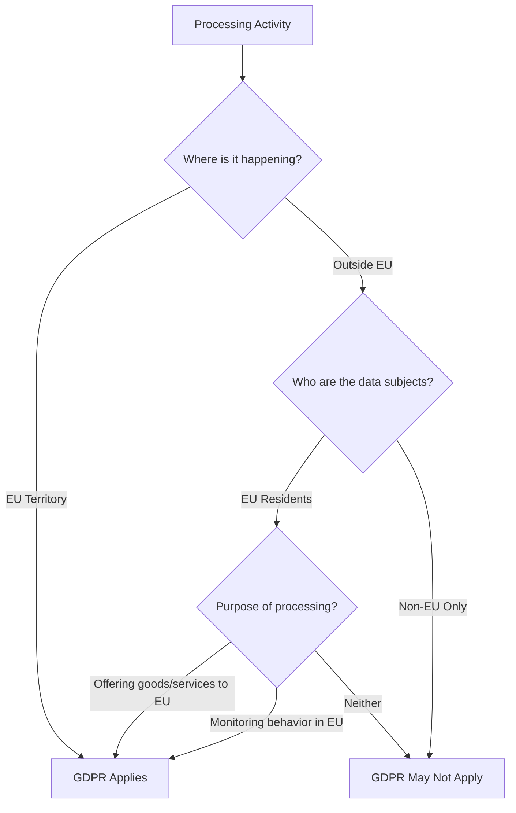
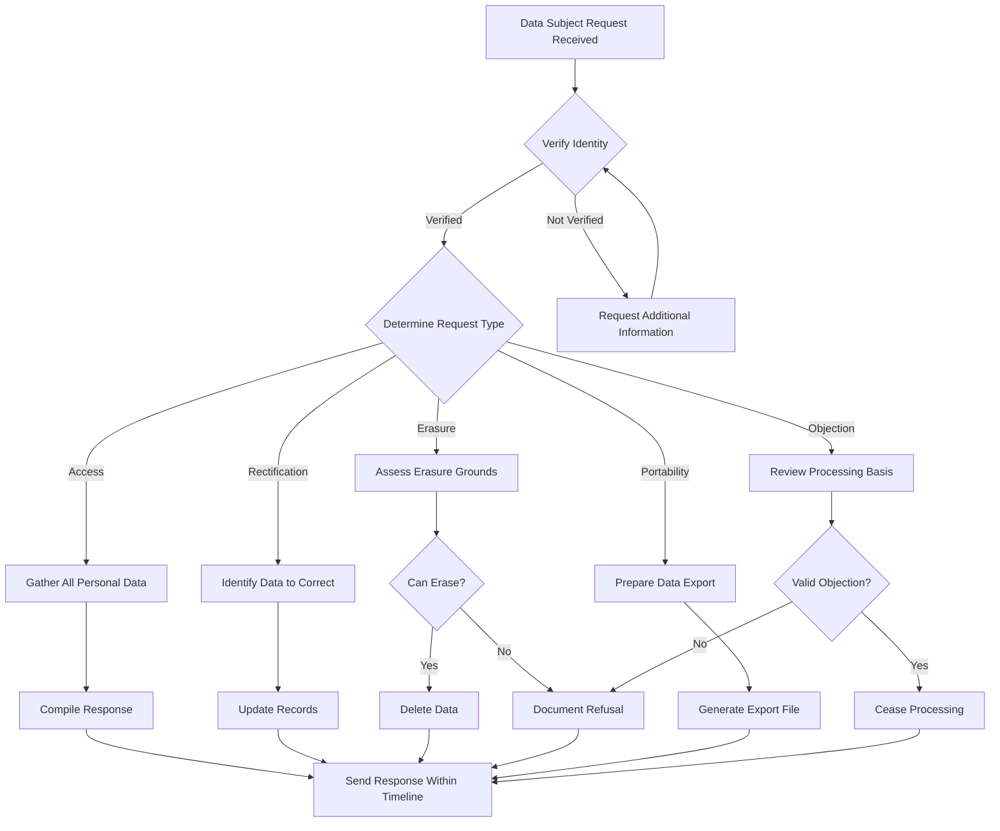
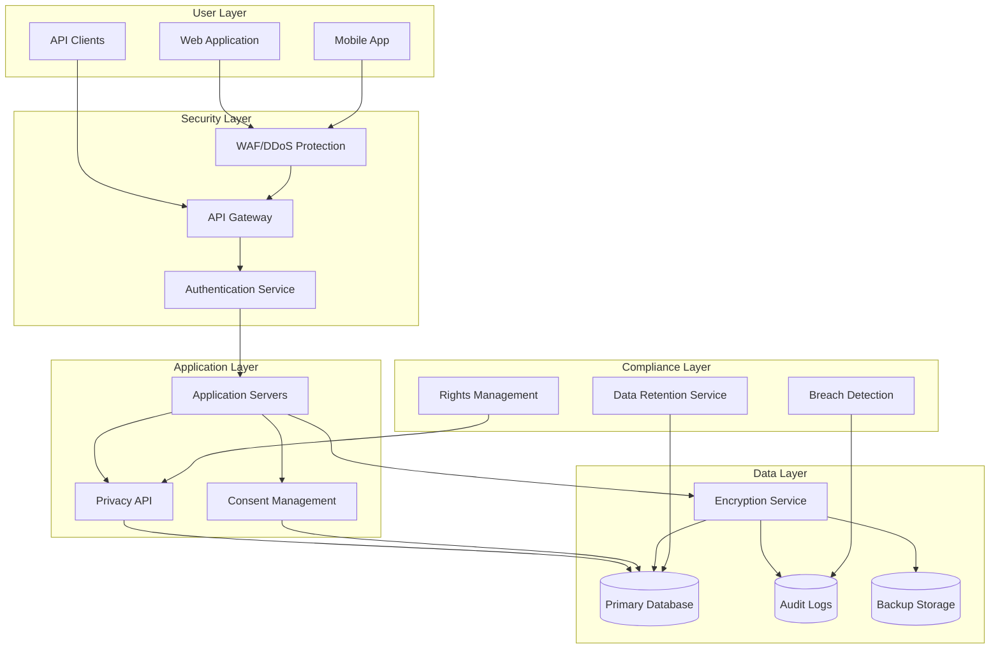
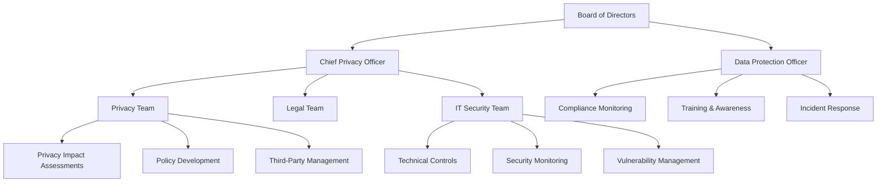
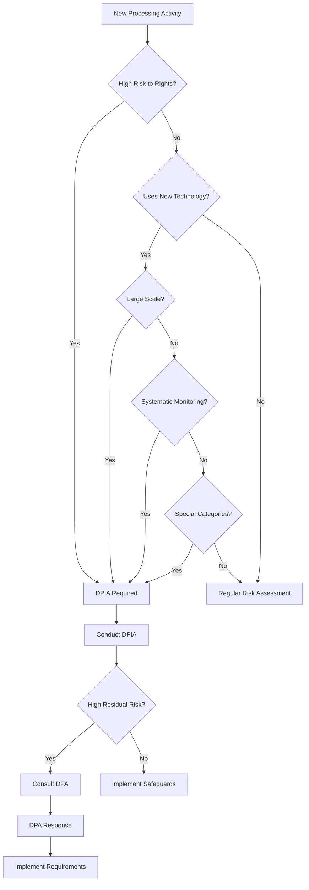
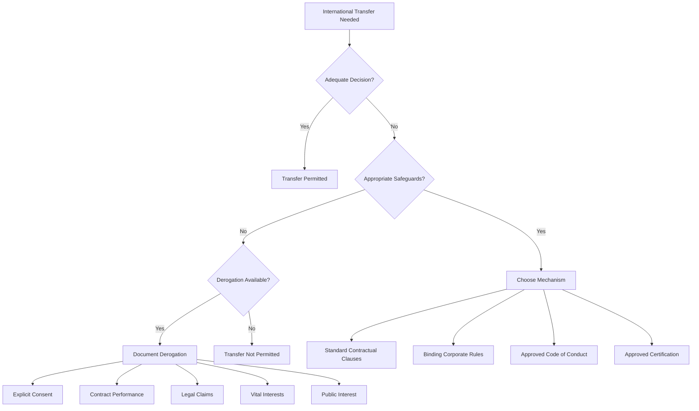
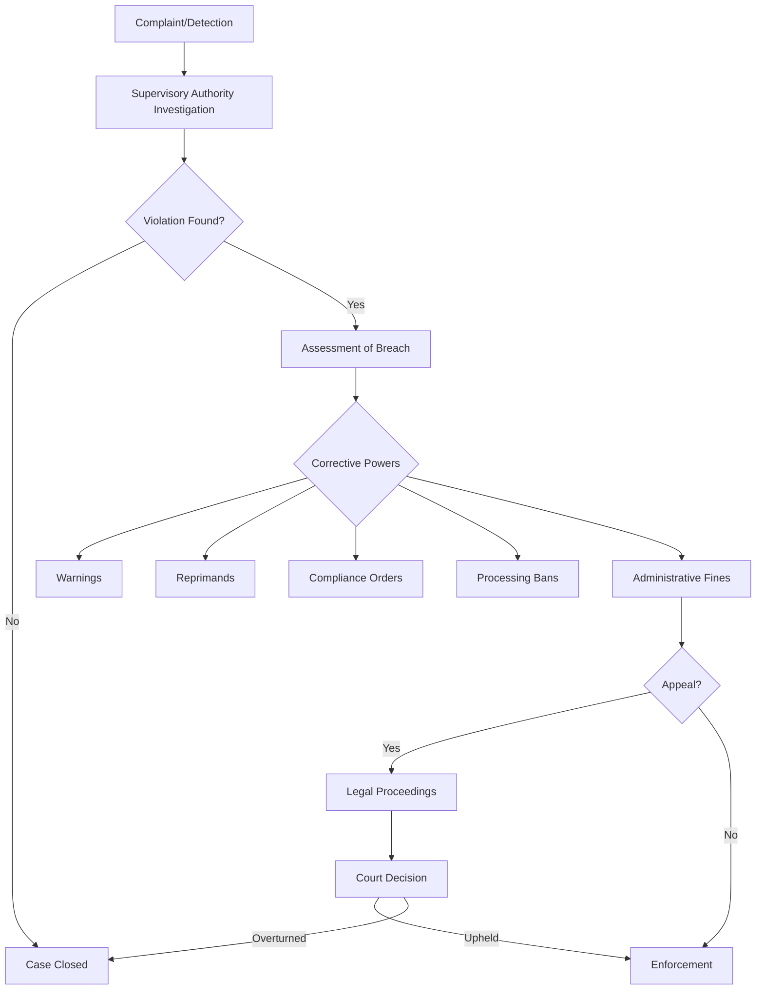

# GDPR Compliance Guide

> **Last Updated**: May 2025  
> **Classification**: Security Operations / Compliance  
> **Scope**: Comprehensive GDPR compliance framework for organizational implementation

## Executive Summary

The General Data Protection Regulation (GDPR) is a comprehensive data protection law that applies to all organizations processing personal data of individuals in the European Union, regardless of the organization's location. This guide provides detailed implementation strategies, technical requirements, and operational procedures for achieving and maintaining GDPR compliance.

### Key Principles
- **Lawfulness, fairness, and transparency**
- **Purpose limitation**
- **Data minimization**
- **Accuracy**
- **Storage limitation**
- **Integrity and confidentiality**
- **Accountability**

## Table of Contents

1. [GDPR Fundamentals](#gdpr-fundamentals)
2. [Scope and Applicability](#scope-and-applicability)
3. [Legal Bases for Processing](#legal-bases-for-processing)
4. [Data Subject Rights](#data-subject-rights)
5. [Technical Implementation Requirements](#technical-implementation-requirements)
6. [Organizational Measures](#organizational-measures)
7. [Data Protection Impact Assessments (DPIA)](#data-protection-impact-assessments-dpia)
8. [Breach Management](#breach-management)
9. [Third-Party Management](#third-party-management)
10. [International Data Transfers](#international-data-transfers)
11. [Documentation Requirements](#documentation-requirements)
12. [Compliance Monitoring](#compliance-monitoring)
13. [Penalties and Enforcement](#penalties-and-enforcement)
14. [Azure-Specific Implementation](#azure-specific-implementation)
15. [Automation and Tools](#automation-and-tools)

## 1. GDPR Fundamentals

### 1.1 Key Definitions

```yaml
definitions:
  personal_data:
    description: "Any information relating to an identified or identifiable natural person"
    examples:
      - Name, address, email
      - IP addresses
      - Location data
      - Online identifiers
      - Genetic data
      - Biometric data
      
  data_subject:
    description: "An identified or identifiable natural person"
    
  data_controller:
    description: "Entity that determines the purposes and means of processing personal data"
    
  data_processor:
    description: "Entity that processes personal data on behalf of the controller"
    
  processing:
    description: "Any operation performed on personal data"
    operations:
      - Collection
      - Recording
      - Organization
      - Structuring
      - Storage
      - Adaptation
      - Retrieval
      - Consultation
      - Use
      - Disclosure
      - Dissemination
      - Erasure
      - Destruction
```

### 1.2 Core Requirements

1. **Lawful Basis**: Every processing activity must have a documented lawful basis
2. **Transparency**: Clear communication about data processing activities
3. **Data Minimization**: Only collect data necessary for specified purposes
4. **Security**: Implement appropriate technical and organizational measures
5. **Accountability**: Demonstrate compliance through documentation

## 2. Scope and Applicability

### 2.1 Territorial Scope



### 2.2 Material Scope

**GDPR Applies to:**
- Automated processing of personal data
- Manual processing if data is part of a filing system
- Processing by controllers or processors in the EU
- Processing related to offering goods/services to EU individuals
- Processing related to monitoring behavior of EU individuals

**GDPR Does NOT Apply to:**
- Processing by natural persons for purely personal/household activities
- Processing for law enforcement purposes (separate directive applies)
- Anonymous data processing

## 3. Legal Bases for Processing

### 3.1 Six Legal Bases

```json
{
  "legal_bases": {
    "consent": {
      "requirements": [
        "Freely given",
        "Specific",
        "Informed",
        "Unambiguous",
        "Clear affirmative action",
        "Withdrawable"
      ],
      "documentation": "Maintain records of consent including when, how, and what was consented to"
    },
    "contract": {
      "requirements": [
        "Processing necessary for contract performance",
        "Pre-contractual steps at data subject's request"
      ],
      "examples": ["Order fulfillment", "Account management", "Service delivery"]
    },
    "legal_obligation": {
      "requirements": [
        "Processing required by law",
        "Clear legal requirement"
      ],
      "examples": ["Tax reporting", "Employee records", "Regulatory compliance"]
    },
    "vital_interests": {
      "requirements": [
        "Protect vital interests of data subject or another person",
        "Data subject physically or legally incapable of giving consent"
      ],
      "examples": ["Medical emergencies", "Humanitarian situations"]
    },
    "public_task": {
      "requirements": [
        "Necessary for task in public interest",
        "Exercise of official authority"
      ],
      "examples": ["Public administration", "Law enforcement", "Public health"]
    },
    "legitimate_interests": {
      "requirements": [
        "Necessary for legitimate interests",
        "Interests not overridden by data subject rights",
        "Legitimate Interest Assessment (LIA) required"
      ],
      "process": [
        "Identify legitimate interest",
        "Show processing is necessary",
        "Balance against individual's interests",
        "Document assessment"
      ]
    }
  }
}
```

### 3.2 Special Categories of Data

**Prohibited unless specific conditions met:**
- Racial or ethnic origin
- Political opinions
- Religious or philosophical beliefs
- Trade union membership
- Genetic data
- Biometric data (for identification)
- Health data
- Sex life or sexual orientation

**Conditions for Processing:**
1. Explicit consent
2. Employment law obligations
3. Vital interests
4. Legitimate activities by foundations
5. Manifestly made public by data subject
6. Legal claims
7. Substantial public interest
8. Health or social care
9. Public health
10. Archiving/research

## 4. Data Subject Rights

### 4.1 Implementation Framework

```yaml
data_subject_rights:
  right_to_information:
    articles: [13, 14]
    requirements:
      - Identity of controller
      - Contact details of DPO
      - Purposes and legal basis
      - Recipients or categories
      - International transfers
      - Retention periods
      - Rights available
      - Complaint procedures
    implementation:
      - Privacy notices
      - Just-in-time notifications
      - Layered approach
      - Clear language
      
  right_of_access:
    articles: [15]
    requirements:
      - Confirm if processing
      - Provide copy of data
      - Provide supplementary information
    timeline: "One month (extendable by 2 months)"
    
  right_to_rectification:
    articles: [16]
    requirements:
      - Correct inaccurate data
      - Complete incomplete data
    timeline: "One month"
    
  right_to_erasure:
    articles: [17]
    conditions:
      - No longer necessary
      - Consent withdrawn
      - Unlawful processing
      - Legal obligation
    exceptions:
      - Freedom of expression
      - Legal obligations
      - Public health
      - Archiving/research
      - Legal claims
    
  right_to_restrict:
    articles: [18]
    conditions:
      - Accuracy contested
      - Processing unlawful
      - No longer needed but required for legal claims
      - Objection pending
    
  right_to_portability:
    articles: [20]
    requirements:
      - Automated processing
      - Based on consent or contract
      - Technically feasible
    format: "Structured, commonly used, machine-readable"
    
  right_to_object:
    articles: [21]
    scenarios:
      - Direct marketing (absolute)
      - Based on legitimate interests
      - Based on public task
    
  automated_decision_rights:
    articles: [22]
    protections:
      - Right not to be subject to automated decisions
      - Exceptions require safeguards
      - Right to human intervention
```

### 4.2 Request Handling Process



### 4.3 Response Templates

```markdown
# Access Request Response Template

Dear [Data Subject Name],

Thank you for your data access request dated [Date].

## Your Personal Data

We process the following categories of your personal data:

**Identity Data:**
- Name: [Name]
- Date of Birth: [DOB]
- Contact Details: [Details]

**Transaction Data:**
- [List relevant transaction data]

**Technical Data:**
- IP Addresses: [If applicable]
- Browser Information: [If applicable]

## Processing Information

**Purposes of Processing:**
- [List purposes]

**Legal Basis:**
- [Specify legal basis for each purpose]

**Recipients:**
- [List categories of recipients]

**Retention Period:**
- [Specify retention periods]

**Your Rights:**
You have the right to:
- Rectification of inaccurate data
- Erasure under certain circumstances
- Restriction of processing
- Data portability
- Object to processing
- Lodge a complaint with a supervisory authority

Best regards,
[Organization Name]
[Data Protection Officer]
```

## 5. Technical Implementation Requirements

### 5.1 Privacy by Design Principles

```yaml
privacy_by_design:
  proactive_not_reactive:
    implementation:
      - Risk assessments before processing
      - Security controls from inception
      - Privacy considerations in system design
  
  privacy_as_default:
    implementation:
      - Minimal data collection settings
      - Opt-in for additional processing
      - Automatic data deletion schedules
  
  full_functionality:
    implementation:
      - Privacy without compromising features
      - Win-win approaches
      - Creative solutions
  
  end_to_end_security:
    implementation:
      - Encryption at rest and in transit
      - Access controls
      - Audit logging
      - Regular security testing
  
  visibility_transparency:
    implementation:
      - Clear privacy notices
      - Accessible policies
      - Regular communications
  
  respect_user_privacy:
    implementation:
      - User-centric design
      - Easy privacy controls
      - Clear consent mechanisms
  
  privacy_embedded:
    implementation:
      - Architecture reviews
      - Code reviews for privacy
      - Privacy testing
```

### 5.2 Technical Security Measures

```json
{
  "encryption": {
    "at_rest": {
      "requirements": "AES-256 or equivalent",
      "scope": "All personal data storage",
      "key_management": "Secure key storage and rotation"
    },
    "in_transit": {
      "requirements": "TLS 1.2 minimum",
      "scope": "All data transmissions",
      "certificate_management": "Valid certificates, proper validation"
    }
  },
  "access_control": {
    "authentication": {
      "methods": ["Multi-factor authentication", "Strong passwords", "Biometric"],
      "requirements": "Risk-based authentication"
    },
    "authorization": {
      "model": "Role-based access control (RBAC)",
      "principle": "Least privilege",
      "review": "Regular access reviews"
    }
  },
  "monitoring": {
    "logging": {
      "events": ["Access attempts", "Data modifications", "Exports", "Deletions"],
      "retention": "12 months minimum",
      "protection": "Tamper-proof log storage"
    },
    "alerting": {
      "triggers": ["Unauthorized access", "Mass exports", "Unusual patterns"],
      "response": "Automated and manual procedures"
    }
  },
  "data_protection": {
    "pseudonymization": {
      "techniques": ["Tokenization", "Hashing", "Encryption"],
      "reversibility": "Controlled de-pseudonymization"
    },
    "anonymization": {
      "techniques": ["Aggregation", "Generalization", "Noise addition"],
      "validation": "Re-identification risk assessment"
    },
    "minimization": {
      "collection": "Only necessary data",
      "retention": "Time-limited storage",
      "access": "Need-to-know basis"
    }
  }
}
```

### 5.3 System Architecture Patterns



[CONTINUATION_POINT: Technical Implementation Section - Completed System Architecture Patterns, continuing with Implementation Checklist]

### 5.4 Implementation Checklist

```yaml
technical_implementation_checklist:
  data_inventory:
    - Map all personal data flows
    - Document data sources
    - Identify processing activities
    - Classify data sensitivity
    - Document retention periods
    
  access_controls:
    - Implement role-based access
    - Enable multi-factor authentication
    - Regular access reviews
    - Privileged access management
    - Session management
    
  encryption:
    - Encrypt data at rest
    - Encrypt data in transit
    - Key management procedures
    - Certificate management
    - Secure key storage
    
  monitoring:
    - Enable audit logging
    - Configure security alerts
    - Implement SIEM
    - Regular log reviews
    - Incident response procedures
    
  data_lifecycle:
    - Automated retention policies
    - Secure deletion procedures
    - Backup encryption
    - Archive management
    - Test restore procedures
```

## 6. Organizational Measures

### 6.1 Governance Structure



### 6.2 Policy Framework

```json
{
  "policies": {
    "data_protection_policy": {
      "purpose": "Overall framework for data protection",
      "contents": [
        "Scope and applicability",
        "Roles and responsibilities",
        "Data protection principles",
        "Legal bases",
        "Rights procedures",
        "Security measures"
      ],
      "review_frequency": "Annual"
    },
    "privacy_notice": {
      "purpose": "Transparency to data subjects",
      "formats": [
        "Full privacy policy",
        "Layered notice",
        "Just-in-time notice",
        "Cookie notice"
      ],
      "languages": "All operational languages"
    },
    "retention_policy": {
      "purpose": "Define data retention periods",
      "contents": [
        "Data categories",
        "Retention periods",
        "Deletion procedures",
        "Exception handling"
      ]
    },
    "breach_response_policy": {
      "purpose": "Handle data breaches",
      "contents": [
        "Detection procedures",
        "Assessment criteria",
        "Notification requirements",
        "Remediation steps"
      ]
    },
    "training_policy": {
      "purpose": "Ensure staff awareness",
      "requirements": [
        "Initial training",
        "Annual refreshers",
        "Role-specific training",
        "Incident-based training"
      ]
    }
  }
}
```

### 6.3 Training Program

```yaml
training_program:
  general_awareness:
    audience: "All staff"
    frequency: "Annual"
    topics:
      - GDPR principles
      - Data subject rights
      - Security basics
      - Incident reporting
    format:
      - Online modules
      - Assessment quiz
      - Certificate of completion
    
  role_specific:
    customer_service:
      topics:
        - Handling data requests
        - Consent management
        - Complaint handling
      frequency: "Bi-annual"
      
    developers:
      topics:
        - Privacy by design
        - Secure coding
        - Data minimization
        - Testing for privacy
      frequency: "Quarterly"
      
    marketing:
      topics:
        - Consent requirements
        - Legitimate interests
        - Email marketing rules
        - Cookie compliance
      frequency: "Quarterly"
      
    management:
      topics:
        - Accountability
        - Risk management
        - Resource allocation
        - Compliance monitoring
      frequency: "Bi-annual"
```

## 7. Data Protection Impact Assessments (DPIA)

### 7.1 When to Conduct DPIA



### 7.2 DPIA Process

```json
{
  "dpia_process": {
    "step_1_describe": {
      "activities": [
        "Nature of processing",
        "Scope of processing",
        "Context of processing",
        "Purposes of processing"
      ],
      "documentation": {
        "data_flows": "Detailed flow diagrams",
        "data_types": "Categories and sensitivity",
        "volume": "Number of data subjects",
        "retention": "Storage periods"
      }
    },
    "step_2_necessity": {
      "assessments": [
        "Is processing necessary?",
        "Is it proportionate?",
        "Could purpose be achieved otherwise?",
        "What is the legal basis?"
      ],
      "documentation": {
        "legitimate_interests": "If applicable, conduct LIA",
        "alternatives": "Document considered alternatives",
        "benefits": "Identify benefits to organization and individuals"
      }
    },
    "step_3_risks": {
      "identify_risks": [
        "Unauthorized access",
        "Accidental loss",
        "Unlawful destruction",
        "Identity theft",
        "Financial loss",
        "Reputational damage",
        "Physical harm"
      ],
      "assess_likelihood": ["Remote", "Possible", "Probable", "Highly Probable"],
      "assess_severity": ["Minimal", "Significant", "Severe", "Maximum"]
    },
    "step_4_measures": {
      "technical_measures": [
        "Encryption",
        "Pseudonymization",
        "Access controls",
        "Audit logging"
      ],
      "organizational_measures": [
        "Training",
        "Policies",
        "Contracts",
        "Monitoring"
      ]
    },
    "step_5_consultation": {
      "internal": ["DPO", "IT Security", "Legal", "Business stakeholders"],
      "external": ["Data subjects", "Supervisory authority", "Security experts"]
    },
    "step_6_sign_off": {
      "approval_required": ["Risk owner", "DPO", "Senior management"],
      "documentation": ["Risk register", "Action plan", "Residual risks"]
    }
  }
}
```

### 7.3 DPIA Template

```markdown
# Data Protection Impact Assessment

## 1. Processing Operation
**Name:** [Processing Operation Name]  
**Date:** [Assessment Date]  
**Assessor:** [Name and Role]  
**Version:** [Version Number]

## 2. Description of Processing
### 2.1 Nature
- What personal data is collected?
- How is it collected?
- How is it used?
- How is it stored?
- Who has access?

### 2.2 Scope
- Categories of data subjects
- Volume of data
- Geographical area
- Duration of processing

### 2.3 Purpose
- Primary purposes
- Secondary purposes
- Benefits to organization
- Benefits to individuals

### 2.4 Legal Basis
- [ ] Consent
- [ ] Contract
- [ ] Legal obligation
- [ ] Vital interests
- [ ] Public task
- [ ] Legitimate interests

## 3. Necessity and Proportionality
### 3.1 Necessity Test
- Why is processing necessary?
- Could purpose be achieved without processing?
- Is the amount of data proportionate?

### 3.2 Alternatives Considered
- Alternative approaches
- Why alternatives were rejected

## 4. Risk Assessment
### 4.1 Risk Identification
| Risk | Likelihood | Severity | Risk Score |
|------|------------|----------|------------|
| Unauthorized access | Medium | High | High |
| Data breach | Low | High | Medium |
| Retention beyond purpose | Medium | Medium | Medium |

## 5. Mitigation Measures
### 5.1 Technical Measures
- Encryption: [Details]
- Access control: [Details]
- Monitoring: [Details]

### 5.2 Organizational Measures
- Training: [Details]
- Policies: [Details]
- Procedures: [Details]

## 6. Residual Risks
[Document any remaining risks after mitigation]

## 7. Consultation
- DPO consulted: [Date]
- Stakeholders consulted: [List]
- Data subjects consulted: [If applicable]

## 8. Sign-off
- Risk Owner: [Name] [Date]
- DPO: [Name] [Date]
- Senior Management: [Name] [Date]

## 9. Review Schedule
Next review date: [Date]
```

## 8. Breach Management

### 8.1 Breach Response Framework

```yaml
breach_response:
  detection:
    sources:
      - Security monitoring
      - User reports
      - Third-party notifications
      - Audit findings
    immediate_actions:
      - Contain the breach
      - Preserve evidence
      - Notify incident team
      
  assessment:
    timeline: "Within 24 hours"
    criteria:
      severity:
        - Number of individuals affected
        - Types of data involved
        - Potential consequences
        - Ease of identification
      risk_factors:
        - Special categories of data
        - Financial information
        - Children's data
        - Large scale
    documentation:
      - Nature of breach
      - Categories affected
      - Approximate numbers
      - Consequences
      - Measures taken
      
  notification:
    supervisory_authority:
      timeline: "72 hours"
      exceptions: "Unless unlikely to result in risk"
      content:
        - Nature of breach
        - DPO contact details
        - Likely consequences
        - Mitigation measures
    data_subjects:
      timeline: "Without undue delay"
      requirement: "High risk to rights"
      content:
        - Clear language
        - Nature of breach
        - Recommendations
        - Support measures
      
  remediation:
    immediate:
      - Stop the breach
      - Recover data
      - Limit damage
    long_term:
      - Root cause analysis
      - Process improvements
      - Additional controls
      - Training updates
```

### 8.2 Breach Notification Templates

```markdown
# Supervisory Authority Notification

**To:** [Supervisory Authority]  
**From:** [Organization Name]  
**Date:** [Date]  
**Subject:** Personal Data Breach Notification under Article 33 GDPR

## 1. Contact Information
- Organization: [Name]
- DPO: [Name and contact]
- Incident Reference: [Reference number]

## 2. Breach Description
- Date/time of breach: [When]
- Date/time of detection: [When]
- Nature of breach: [Description]

## 3. Data Categories
Personal data types involved:
- [List categories]

Special categories involved:
- [If applicable]

## 4. Individuals Affected
- Number affected: [Approximate number]
- Categories of individuals: [Types]
- Geographical scope: [Regions]

## 5. Likely Consequences
[Describe potential impact on individuals]

## 6. Measures Taken
Measures to address breach:
- [List actions]

Measures to mitigate effects:
- [List mitigations]

## 7. Additional Information
[Any other relevant details]

---

# Data Subject Notification

**Dear [Name/Customer],**

We are writing to inform you of a personal data security incident that may affect you.

## What Happened?
On [date], we discovered [brief description of breach].

## Information Involved
The following information may have been affected:
- [List data types]

## What We Are Doing
We have taken the following steps:
- [List measures]

## What You Should Do
We recommend you:
- [List recommendations]
- Monitor your accounts
- Contact us if you notice suspicious activity

## For More Information
Contact our dedicated support team:
- Phone: [Number]
- Email: [Email]
- Website: [URL]

We sincerely apologize for any inconvenience.

[Organization Name]
[Date]
```

## 9. Third-Party Management

### 9.1 Processor Management Framework

```json
{
  "processor_management": {
    "selection": {
      "due_diligence": [
        "Security certifications",
        "Privacy compliance",
        "Sub-processor policies",
        "Breach history",
        "Geographic locations"
      ],
      "assessment_criteria": {
        "technical": "Security capabilities",
        "organizational": "Privacy maturity",
        "contractual": "Willingness to accept terms",
        "financial": "Stability and insurance"
      }
    },
    "contracting": {
      "mandatory_clauses": [
        "Process only on instructions",
        "Ensure confidentiality",
        "Implement security measures",
        "Assist with compliance",
        "Delete/return data",
        "Allow audits",
        "Notify breaches"
      ],
      "additional_terms": [
        "Sub-processing restrictions",
        "Data location limits",
        "Specific security requirements",
        "SLA requirements",
        "Liability provisions"
      ]
    },
    "monitoring": {
      "activities": [
        "Regular security reviews",
        "Compliance assessments",
        "Incident reports",
        "Audit rights exercise",
        "Performance metrics"
      ],
      "frequency": "Risk-based approach",
      "documentation": "Maintain assessment records"
    },
    "termination": {
      "requirements": [
        "Data return procedures",
        "Deletion certification",
        "Transition assistance",
        "Ongoing confidentiality"
      ]
    }
  }
}
```

### 9.2 Data Processing Agreement Template

```markdown
# Data Processing Agreement

This Data Processing Agreement ("DPA") forms part of the Main Agreement between:

**Controller:** [Organization Name]  
**Processor:** [Processor Name]

## 1. Definitions
[Incorporate GDPR definitions]

## 2. Processing Details
### 2.1 Nature and Purpose
The Processor shall process Personal Data for: [purpose]

### 2.2 Categories of Data
- [List data types]

### 2.3 Categories of Data Subjects
- [List subject types]

### 2.4 Duration
Processing shall continue for: [duration]

## 3. Processor Obligations
The Processor shall:
1. Process only on written instructions
2. Ensure persons are under confidentiality
3. Implement Article 32 security measures
4. Respect conditions for sub-processors
5. Assist with data subject rights
6. Assist with compliance obligations
7. Delete/return all Personal Data
8. Provide audit information

## 4. Security Measures
[Specify technical and organizational measures]

## 5. Sub-processing
- Prior authorization required: Yes/No
- General authorization with notification: Yes/No
- List of approved sub-processors: [Annex]

## 6. International Transfers
[Specify transfer mechanisms]

## 7. Breach Notification
Timeline: Without undue delay
Content: [Specify requirements]

## 8. Audit Rights
Frequency: [Annual/Risk-based]
Notice period: [30 days]

## 9. Liability and Indemnification
[Specify terms]

## 10. Term and Termination
[Specify conditions]

Signed:
Controller: _____________ Date: _______
Processor: _____________ Date: _______
```

## 10. International Data Transfers

### 10.1 Transfer Mechanisms



### 10.2 Transfer Impact Assessment

```yaml
transfer_impact_assessment:
  step_1_identify:
    - Destination country
    - Legal framework
    - Data protection level
    - Government access laws
    
  step_2_assess:
    legal_analysis:
      - Data protection laws
      - Surveillance laws
      - Access by authorities
      - Legal remedies
    practical_analysis:
      - Technical measures
      - Organizational measures
      - Contractual protections
      
  step_3_implement:
    standard_clauses:
      - Select appropriate module
      - Complete annex
      - Assess effectiveness
    supplementary_measures:
      technical:
        - Encryption in transit
        - Encryption at rest
        - Pseudonymization
        - Split processing
      contractual:
        - Enhanced audit rights
        - Notification obligations
        - Transparency measures
      organizational:
        - Internal policies
        - Training programs
        - Access controls
        
  step_4_document:
    - Assessment rationale
    - Measures implemented
    - Residual risks
    - Approval records
    
  step_5_monitor:
    - Legal changes
    - Practical experience
    - Incident reports
    - Regular reviews
```

## 11. Documentation Requirements

### 11.1 Record of Processing Activities (ROPA)

```json
{
  "controller_ropa": {
    "organization_details": {
      "name": "Organization name",
      "contact": "Contact details",
      "dpo": "DPO contact details",
      "representative": "EU representative if applicable"
    },
    "processing_activities": [
      {
        "name": "Activity name",
        "purposes": ["Purpose 1", "Purpose 2"],
        "legal_basis": "Specified legal basis",
        "legitimate_interests": "If applicable",
        "categories_data": ["Data type 1", "Data type 2"],
        "categories_subjects": ["Subject type 1", "Subject type 2"],
        "categories_recipients": ["Recipient type 1"],
        "international_transfers": "Countries and safeguards",
        "retention_periods": "Time limits",
        "security_measures": "General description"
      }
    ]
  },
  "processor_ropa": {
    "organization_details": {
      "name": "Processor name",
      "contact": "Contact details",
      "dpo": "DPO contact details",
      "representative": "EU representative if applicable"
    },
    "processing_activities": [
      {
        "name": "Activity name",
        "categories_processing": ["Type 1", "Type 2"],
        "controllers": ["Controller 1", "Controller 2"],
        "categories_data": ["Data type 1", "Data type 2"],
        "international_transfers": "Countries and safeguards",
        "security_measures": "General description"
      }
    ]
  }
}
```

### 11.2 Documentation Matrix

| Document Type | Purpose | Update Frequency | Owner |
|--------------|---------|------------------|--------|
| ROPA | Record processing activities | Ongoing | DPO |
| Privacy Notices | Inform data subjects | As needed | Legal |
| DPIAs | Assess high-risk processing | Per project | Privacy Team |
| Policies | Guide operations | Annual | Compliance |
| Procedures | Operational instructions | As needed | Operations |
| Training Records | Demonstrate competence | After training | HR |
| Consent Records | Prove lawful basis | Ongoing | Systems |
| Breach Register | Track incidents | Per incident | Security |
| Vendor Assessments | Third-party compliance | Annual | Procurement |
| Audit Reports | Compliance verification | Per audit | Audit |

## 12. Compliance Monitoring

### 12.1 Monitoring Framework

```yaml
compliance_monitoring:
  continuous_monitoring:
    automated_checks:
      - Consent expiration
      - Retention periods
      - Access logs
      - Security events
    manual_reviews:
      - Policy compliance
      - Process adherence
      - Training completion
      - Vendor performance
      
  periodic_assessments:
    quarterly:
      - KPI review
      - Incident analysis
      - Rights requests
      - Vendor status
    annual:
      - Policy review
      - ROPA update
      - Training effectiveness
      - Control testing
      
  metrics:
    operational:
      - Rights requests handled
      - Response times
      - Consent rates
      - Opt-out rates
    risk:
      - Incidents detected
      - Breaches reported
      - Findings resolved
      - Controls effectiveness
    compliance:
      - Training completion
      - Policy violations
      - Audit findings
      - Remediation status
```

### 12.2 KPI Dashboard

```json
{
  "privacy_kpis": {
    "rights_management": {
      "metrics": [
        {
          "name": "Request response time",
          "target": "< 30 days",
          "measurement": "Average days to respond"
        },
        {
          "name": "Request volume",
          "target": "Tracking only",
          "measurement": "Number per month by type"
        }
      ]
    },
    "consent_management": {
      "metrics": [
        {
          "name": "Valid consent rate",
          "target": "> 95%",
          "measurement": "Percentage with valid consent"
        },
        {
          "name": "Consent withdrawal rate",
          "target": "< 5%",
          "measurement": "Monthly withdrawal percentage"
        }
      ]
    },
    "security_incidents": {
      "metrics": [
        {
          "name": "Breach notification time",
          "target": "< 72 hours",
          "measurement": "Hours to authority notification"
        },
        {
          "name": "Incident closure rate",
          "target": "> 90%",
          "measurement": "Percentage closed within SLA"
        }
      ]
    },
    "training_compliance": {
      "metrics": [
        {
          "name": "Training completion",
          "target": "> 95%",
          "measurement": "Staff completed annual training"
        },
        {
          "name": "Assessment pass rate",
          "target": "> 80%",
          "measurement": "First-attempt pass percentage"
        }
      ]
    }
  }
}
```

## 13. Penalties and Enforcement

### 13.1 Penalty Structure

```markdown
# GDPR Penalties

## Administrative Fines

### Tier 1 - Up to €10 million or 2% of global annual turnover
Infringements:
- Failure to implement privacy by design
- Failure to appoint DPO when required
- Failure to conduct DPIA when required
- Failure to have appropriate contracts with processors
- Failure to maintain records of processing
- Failure to cooperate with supervisory authority

### Tier 2 - Up to €20 million or 4% of global annual turnover
Infringements:
- Basic principles (lawfulness, fairness, transparency)
- Conditions for consent
- Data subject rights
- International transfer violations
- Non-compliance with supervisory authority orders

## Other Penalties
- Temporary or permanent ban on processing
- Order to rectify, restrict, or erase data
- Suspension of data flows
- Compensation to data subjects
- Criminal sanctions (member state specific)

## Factors Considered
- Nature, gravity, and duration
- Intentional or negligent
- Actions to mitigate damage
- Degree of responsibility
- Previous infringements
- Cooperation with authority
- Categories of data affected
- How violation became known
- Any other aggravating or mitigating factors
```

### 13.2 Enforcement Process



## 14. Azure-Specific Implementation

### 14.1 Azure Services for GDPR Compliance

```json
{
  "azure_gdpr_services": {
    "azure_information_protection": {
      "purpose": "Classify and protect documents",
      "features": [
        "Automatic classification",
        "Encryption",
        "Rights management",
        "Tracking and revocation"
      ],
      "use_cases": [
        "Protect sensitive documents",
        "Control access to data",
        "Track document usage",
        "Prevent data leaks"
      ]
    },
    "azure_key_vault": {
      "purpose": "Manage encryption keys and secrets",
      "features": [
        "Centralized key management",
        "Hardware security modules",
        "Secret management",
        "Certificate management"
      ],
      "use_cases": [
        "Store encryption keys",
        "Manage API secrets",
        "Certificate lifecycle",
        "Compliance requirements"
      ]
    },
    "azure_monitor": {
      "purpose": "Monitor and audit activities",
      "features": [
        "Activity logs",
        "Diagnostic logs",
        "Metrics collection",
        "Alerts and notifications"
      ],
      "use_cases": [
        "Track access to data",
        "Monitor security events",
        "Compliance reporting",
        "Incident detection"
      ]
    },
    "azure_policy": {
      "purpose": "Enforce compliance standards",
      "features": [
        "Policy definitions",
        "Initiative assignments",
        "Compliance assessment",
        "Remediation tasks"
      ],
      "use_cases": [
        "Enforce encryption",
        "Require tags",
        "Control regions",
        "Audit compliance"
      ]
    },
    "azure_sentinel": {
      "purpose": "Security incident and event management",
      "features": [
        "Threat detection",
        "Investigation tools",
        "Automated response",
        "Compliance dashboards"
      ],
      "use_cases": [
        "Detect breaches",
        "Investigate incidents",
        "Automate responses",
        "Compliance monitoring"
      ]
    }
  }
}
```

### 14.2 Implementation Script Examples

```powershell
# Enable Azure Information Protection
function Enable-AIPProtection {
    param(
        [string]$SubscriptionId,
        [string]$ResourceGroupName,
        [string]$TenantId
    )
    
    # Connect to Azure
    Connect-AzAccount -TenantId $TenantId
    Set-AzContext -SubscriptionId $SubscriptionId
    
    # Create AIP labels
    $labels = @(
        @{
            Name = "Public"
            Description = "Public information"
            Color = "Green"
        },
        @{
            Name = "Internal"
            Description = "Internal use only"
            Color = "Blue"
        },
        @{
            Name = "Confidential"
            Description = "Confidential information"
            Color = "Orange"
            EncryptContent = $true
        },
        @{
            Name = "Highly Confidential"
            Description = "Highly confidential information"
            Color = "Red"
            EncryptContent = $true
            RestrictAccess = $true
        }
    )
    
    foreach ($label in $labels) {
        New-Label -Name $label.Name `
                  -Description $label.Description `
                  -Color $label.Color `
                  -EncryptContent:$label.EncryptContent `
                  -RestrictAccess:$label.RestrictAccess
    }
}

# Configure Key Vault for GDPR
function Configure-KeyVault {
    param(
        [string]$VaultName,
        [string]$ResourceGroupName,
        [string]$Location = "North Europe"
    )
    
    # Create Key Vault
    $vault = New-AzKeyVault -Name $VaultName `
                           -ResourceGroupName $ResourceGroupName `
                           -Location $Location `
                           -EnabledForDeployment `
                           -EnabledForDiskEncryption `
                           -EnabledForTemplateDeployment `
                           -EnablePurgeProtection `
                           -SoftDeleteRetentionInDays 90
    
    # Set access policies
    Set-AzKeyVaultAccessPolicy -VaultName $VaultName `
                               -ObjectId (Get-AzADUser -UserPrincipalName "dpo@company.com").Id `
                               -PermissionsToKeys @("get", "list") `
                               -PermissionsToSecrets @("get", "list") `
                               -PermissionsToCertificates @("get", "list")
}

# Setup Compliance Monitoring
function Setup-ComplianceMonitoring {
    param(
        [string]$WorkspaceName,
        [string]$ResourceGroupName
    )
    
    # Create Log Analytics Workspace
    $workspace = New-AzOperationalInsightsWorkspace `
        -Name $WorkspaceName `
        -ResourceGroupName $ResourceGroupName `
        -Location "North Europe" `
        -Sku "PerGB2018"
    
    # Enable solutions
    $solutions = @(
        "Security",
        "AzureActivity",
        "KeyVault",
        "SqlAdvancedThreatProtection"
    )
    
    foreach ($solution in $solutions) {
        New-AzOperationalInsightsSolution `
            -Type $solution `
            -ResourceGroupName $ResourceGroupName `
            -Location $workspace.Location `
            -WorkspaceResourceId $workspace.ResourceId
    }
}
```

## 15. Automation and Tools

### 15.1 Compliance Automation Framework

```yaml
automation_framework:
  data_discovery:
    tools:
      - Microsoft Purview
      - Azure Information Protection Scanner
      - Custom scripts
    processes:
      - Scan file shares
      - Analyze databases
      - Identify personal data
      - Create data map
      
  consent_management:
    tools:
      - OneTrust
      - TrustArc
      - Custom consent service
    processes:
      - Capture consent
      - Store consent records
      - Handle withdrawals
      - Audit consent status
      
  rights_management:
    tools:
      - ServiceNow
      - Custom rights portal
      - Azure Logic Apps
    processes:
      - Receive requests
      - Verify identity
      - Process requests
      - Track completion
      
  monitoring:
    tools:
      - Azure Sentinel
      - Power BI
      - Custom dashboards
    processes:
      - Monitor metrics
      - Generate reports
      - Alert on violations
      - Track remediation
```

### 15.2 PowerShell Automation Scripts

```powershell
# GDPR Compliance Check Script
function Test-GDPRCompliance {
    param(
        [string]$TenantId,
        [string]$SubscriptionId
    )
    
    $results = @()
    
    # Check encryption at rest
    Write-Host "Checking encryption at rest..."
    $storageAccounts = Get-AzStorageAccount
    foreach ($sa in $storageAccounts) {
        $encryption = Get-AzStorageAccountEncryption -ResourceGroupName $sa.ResourceGroupName -Name $sa.StorageAccountName
        $results += [PSCustomObject]@{
            Resource = $sa.StorageAccountName
            Type = "Storage Account"
            Check = "Encryption at Rest"
            Status = if($encryption.Services.Blob.Enabled) {"Compliant"} else {"Non-Compliant"}
        }
    }
    
    # Check SQL Database encryption
    Write-Host "Checking SQL Database encryption..."
    $sqlServers = Get-AzSqlServer
    foreach ($server in $sqlServers) {
        $databases = Get-AzSqlDatabase -ServerName $server.ServerName -ResourceGroupName $server.ResourceGroupName
        foreach ($db in $databases) {
            if ($db.DatabaseName -ne "master") {
                $tde = Get-AzSqlDatabaseTransparentDataEncryption -ServerName $server.ServerName `
                    -DatabaseName $db.DatabaseName -ResourceGroupName $server.ResourceGroupName
                $results += [PSCustomObject]@{
                    Resource = "$($server.ServerName)/$($db.DatabaseName)"
                    Type = "SQL Database"
                    Check = "TDE Enabled"
                    Status = if($tde.Status -eq "Enabled") {"Compliant"} else {"Non-Compliant"}
                }
            }
        }
    }
    
    # Check Key Vault configuration
    Write-Host "Checking Key Vault configuration..."
    $keyVaults = Get-AzKeyVault
    foreach ($kv in $keyVaults) {
        $kvDetails = Get-AzKeyVault -VaultName $kv.VaultName -ResourceGroupName $kv.ResourceGroupName
        $results += [PSCustomObject]@{
            Resource = $kv.VaultName
            Type = "Key Vault"
            Check = "Soft Delete Enabled"
            Status = if($kvDetails.EnableSoftDelete) {"Compliant"} else {"Non-Compliant"}
        }
        $results += [PSCustomObject]@{
            Resource = $kv.VaultName
            Type = "Key Vault"
            Check = "Purge Protection"
            Status = if($kvDetails.EnablePurgeProtection) {"Compliant"} else {"Non-Compliant"}
        }
    }
    
    # Generate report
    $results | Format-Table -AutoSize
    $results | Export-Csv -Path "GDPRComplianceReport_$(Get-Date -Format 'yyyyMMdd').csv" -NoTypeInformation
}

# Data Subject Rights Request Handler
function Process-DataSubjectRequest {
    param(
        [Parameter(Mandatory=$true)]
        [ValidateSet("Access", "Rectification", "Erasure", "Portability", "Restriction", "Objection")]
        [string]$RequestType,
        
        [Parameter(Mandatory=$true)]
        [string]$DataSubjectEmail,
        
        [Parameter(Mandatory=$true)]
        [string]$RequestId
    )
    
    $logEntry = @{
        RequestId = $RequestId
        RequestType = $RequestType
        DataSubject = $DataSubjectEmail
        ReceivedDate = Get-Date
        Status = "Received"
    }
    
    # Log the request
    $logEntry | ConvertTo-Json | Out-File -Path "DSRLog_$RequestId.json"
    
    switch ($RequestType) {
        "Access" {
            # Search for user data across systems
            $userData = @{
                AzureAD = Get-AzADUser -Filter "mail eq '$DataSubjectEmail'"
                Storage = Search-StorageAccounts -Email $DataSubjectEmail
                Database = Search-Databases -Email $DataSubjectEmail
            }
            
            # Compile and encrypt response
            $response = $userData | ConvertTo-Json
            $encryptedResponse = Protect-Data -Data $response -DataSubject $DataSubjectEmail
            
            # Prepare for delivery
            $logEntry.Status = "Completed"
            $logEntry.CompletedDate = Get-Date
        }
        
        "Erasure" {
            # Verify erasure grounds
            if (Test-ErasureGrounds -DataSubject $DataSubjectEmail) {
                # Execute erasure
                Remove-AzureADUserData -Email $DataSubjectEmail
                Remove-StorageData -Email $DataSubjectEmail
                Remove-DatabaseData -Email $DataSubjectEmail
                
                $logEntry.Status = "Completed"
                $logEntry.CompletedDate = Get-Date
            } else {
                $logEntry.Status = "Rejected"
                $logEntry.RejectionReason = "Legal obligation to retain"
            }
        }
        
        "Portability" {
            # Export data in machine-readable format
            $portableData = Export-UserData -Email $DataSubjectEmail -Format "JSON"
            $logEntry.Status = "Completed"
            $logEntry.ExportPath = $portableData
        }
    }
    
    # Update log
    $logEntry | ConvertTo-Json | Out-File -Path "DSRLog_$RequestId.json"
    
    # Send notification
    Send-DSRNotification -RequestId $RequestId -Status $logEntry.Status -Email $DataSubjectEmail
}

# Consent Management Function
function Manage-Consent {
    param(
        [string]$DataSubject,
        [string]$Purpose,
        [ValidateSet("Grant", "Withdraw")]
        [string]$Action,
        [string]$ConsentId = (New-Guid).ToString()
    )
    
    $consentRecord = @{
        ConsentId = $ConsentId
        DataSubject = $DataSubject
        Purpose = $Purpose
        Action = $Action
        Timestamp = Get-Date
        IPAddress = (Get-NetIPAddress).IPAddress[0]
        Method = "API"
    }
    
    # Store consent record
    $consentRecord | ConvertTo-Json | Add-Content -Path "ConsentLog.json"
    
    # Update consent database
    if ($Action -eq "Grant") {
        Add-ConsentRecord -Record $consentRecord
    } else {
        Remove-ConsentRecord -DataSubject $DataSubject -Purpose $Purpose
    }
    
    # Audit log
    Write-AuditLog -Action "Consent$Action" -DataSubject $DataSubject -Purpose $Purpose
    
    return $consentRecord
}

# Breach Detection and Response
function Respond-ToDataBreach {
    param(
        [string]$IncidentId,
        [string]$Description,
        [datetime]$DetectedTime,
        [string[]]$AffectedSystems,
        [int]$EstimatedAffectedRecords
    )
    
    $breach = @{
        IncidentId = $IncidentId
        Description = $Description
        DetectedTime = $DetectedTime
        ReportedTime = Get-Date
        AffectedSystems = $AffectedSystems
        EstimatedAffectedRecords = $EstimatedAffectedRecords
        RiskLevel = "TBD"
        Status = "Under Investigation"
    }
    
    # Immediate containment
    foreach ($system in $AffectedSystems) {
        Invoke-ContainmentAction -System $system -Action "Isolate"
    }
    
    # Assess risk
    $riskFactors = @{
        DataTypes = Get-AffectedDataTypes -Systems $AffectedSystems
        Encryption = Test-DataEncryption -Systems $AffectedSystems
        Scale = $EstimatedAffectedRecords
    }
    
    $breach.RiskLevel = Assess-BreachRisk @riskFactors
    
    # Determine notification requirements
    if ($breach.RiskLevel -in @("High", "Critical")) {
        # Notify DPA within 72 hours
        $dpaNotification = @{
            IncidentId = $IncidentId
            NotificationTime = Get-Date
            Description = $Description
            AffectedRecords = $EstimatedAffectedRecords
            MitigationMeasures = Get-MitigationMeasures -IncidentId $IncidentId
        }
        
        Send-DPANotification @dpaNotification
        
        # Prepare data subject notifications
        if ($breach.RiskLevel -eq "Critical") {
            $affectedSubjects = Get-AffectedDataSubjects -Systems $AffectedSystems
            Queue-DataSubjectNotifications -Subjects $affectedSubjects -IncidentId $IncidentId
        }
    }
    
    # Log breach
    $breach | ConvertTo-Json | Out-File -Path "Breach_$IncidentId.json"
    
    return $breach
}
```

### 15.3 Monitoring Dashboard Configuration

```json
{
  "gdpr_dashboard": {
    "widgets": [
      {
        "type": "scorecard",
        "title": "Overall GDPR Compliance Score",
        "metrics": [
          "consent_rate",
          "request_response_time",
          "training_completion",
          "audit_findings"
        ]
      },
      {
        "type": "chart",
        "title": "Data Subject Requests",
        "visualization": "line",
        "data_source": "dsr_tracking",
        "group_by": "request_type",
        "time_range": "30_days"
      },
      {
        "type": "chart",
        "title": "Consent Status",
        "visualization": "pie",
        "data_source": "consent_management",
        "categories": ["granted", "withdrawn", "expired", "pending"]
      },
      {
        "type": "table",
        "title": "Recent Incidents",
        "data_source": "incident_log",
        "columns": ["date", "type", "severity", "status"],
        "limit": 10
      },
      {
        "type": "map",
        "title": "Data Processing Locations",
        "data_source": "processing_activities",
        "show_transfers": true
      }
    ],
    "alerts": [
      {
        "name": "DSR SLA Breach",
        "condition": "response_time > 25_days",
        "severity": "high",
        "recipients": ["dpo@company.com", "legal@company.com"]
      },
      {
        "name": "High Risk Processing",
        "condition": "new_processing_activity AND risk_score > 7",
        "severity": "medium",
        "recipients": ["privacy@company.com"]
      },
      {
        "name": "Consent Expiration",
        "condition": "consent_expiry < 30_days",
        "severity": "low",
        "recipients": ["marketing@company.com"]
      }
    ]
  }
}
```

## Conclusion

This comprehensive GDPR compliance guide provides the framework, tools, and procedures necessary for organizations to achieve and maintain compliance with the General Data Protection Regulation. Key success factors include:

1. **Leadership Commitment**: Executive sponsorship and adequate resources
2. **Privacy Culture**: Embedding privacy into organizational DNA
3. **Continuous Improvement**: Regular assessments and updates
4. **Technology Enablement**: Leveraging tools for automation and monitoring
5. **Documentation**: Maintaining comprehensive records
6. **Training**: Ensuring all staff understand their responsibilities

Remember that GDPR compliance is not a one-time project but an ongoing program requiring continuous attention and improvement. Regular reviews, updates to processes, and staying informed about regulatory changes are essential for maintaining compliance.

For specific legal advice, always consult with qualified privacy professionals and legal counsel familiar with your jurisdiction and industry requirements.

---

**Document Version**: 3.0  
**Last Review**: May 2025  
**Next Review**: May 2026  
**Owner**: Data Protection Office  
**Classification**: Public
