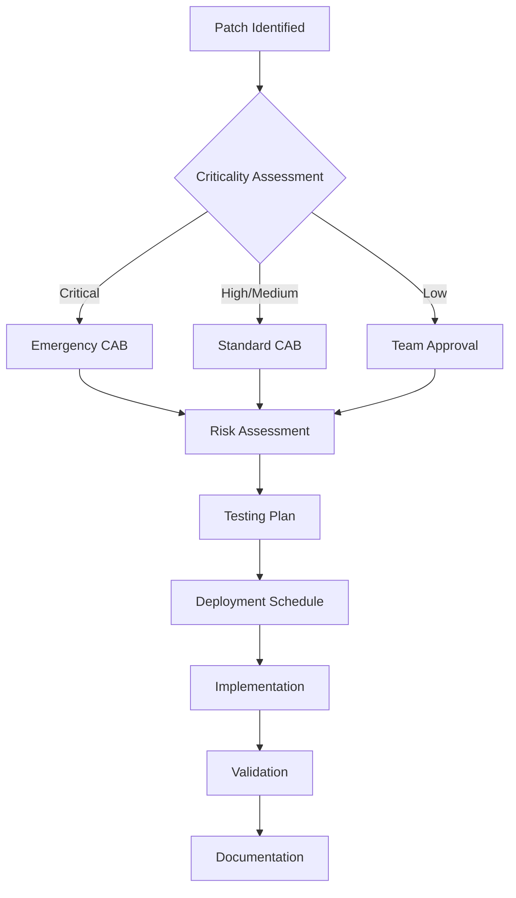
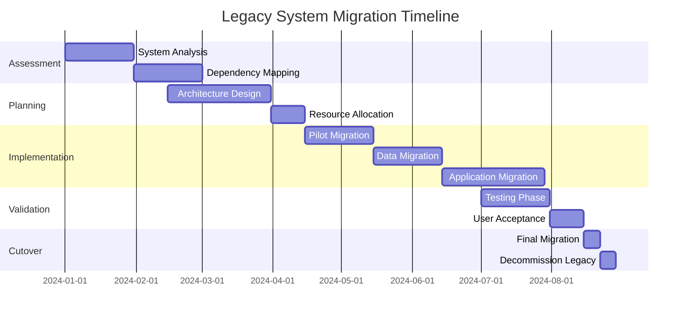

# Patch Management and Legacy Software Guidelines with Examples

## Overview

This document provides comprehensive guidance on patch management processes and handling legacy software systems in Azure Cloud Services (ACS) environments. The guidelines ensure security compliance, minimize vulnerabilities, and maintain system stability while managing the complexities of modern cloud infrastructure.

## Table of Contents

1. [Introduction](#introduction)
2. [Patch Management Framework](#patch-management-framework)
3. [Legacy Software Management](#legacy-software-management)
4. [Implementation Examples](#implementation-examples)
5. [Risk Assessment Matrix](#risk-assessment-matrix)
6. [Automation Strategies](#automation-strategies)
7. [Compliance Requirements](#compliance-requirements)
8. [Best Practices](#best-practices)
9. [Troubleshooting Guide](#troubleshooting-guide)
10. [References and Resources](#references-and-resources)

## Introduction

### Purpose
- Establish standardized procedures for applying security patches
- Manage legacy software systems safely within modern cloud environments
- Ensure compliance with security frameworks and regulatory requirements
- Minimize downtime while maintaining security posture

### Scope
- All Azure-hosted systems and applications
- Legacy systems requiring extended support
- Third-party software components
- Operating systems, middleware, and application layers

## Patch Management Framework

### 1. Assessment Phase

#### Vulnerability Scanning
```yaml
scanning_strategy:
  frequency: weekly
  tools:
    - Microsoft Defender for Cloud
    - Azure Security Center
    - Qualys VMDR
  scope:
    - Virtual Machines
    - App Services
    - Container Instances
    - Database Services
```

#### Patch Classification
```json
{
  "patch_categories": {
    "critical": {
      "sla": "24-48 hours",
      "approval": "automatic",
      "testing": "minimal"
    },
    "high": {
      "sla": "7 days",
      "approval": "change_board",
      "testing": "standard"
    },
    "medium": {
      "sla": "30 days",
      "approval": "team_lead",
      "testing": "comprehensive"
    },
    "low": {
      "sla": "90 days",
      "approval": "team_lead",
      "testing": "standard"
    }
  }
}
```

### 2. Planning Phase

#### Deployment Windows
```markdown
**Production Environment Windows:**
- Primary: Saturdays 2:00 AM - 6:00 AM (UTC)
- Secondary: Wednesdays 10:00 PM - 2:00 AM (UTC)
- Emergency: As required with 2-hour notice

**Non-Production Environment Windows:**
- Daily: 6:00 PM - 10:00 PM (UTC)
- Extended: Weekends (full day)
```

#### Change Management Process


### 3. Testing Phase

#### Test Environment Requirements
```yaml
test_environments:
  - name: patch_validation
    configuration:
      replicate_production: true
      isolation_level: network_isolated
      data_sensitivity: anonymized
    resources:
      vm_count: 5
      database_instances: 2
      load_balancers: 1
```

#### Testing Methodology
```python
# Example automated patch testing script
import azure.mgmt.compute
import pytest

class PatchTestSuite:
    def __init__(self, subscription_id, resource_group):
        self.subscription_id = subscription_id
        self.resource_group = resource_group
        
    def run_patch_tests(self, patch_id):
        """Execute comprehensive patch testing"""
        test_results = {
            "functionality": self.test_core_functionality(),
            "performance": self.test_performance_impact(),
            "compatibility": self.test_application_compatibility(),
            "rollback": self.test_rollback_procedure()
        }
        return test_results
    
    def test_core_functionality(self):
        # Test critical system functions
        pass
    
    def test_performance_impact(self):
        # Measure performance before/after
        pass
```

### 4. Deployment Phase

#### Azure Update Management Implementation
```json
{
  "update_deployment": {
    "name": "Monthly_Security_Patches",
    "scope": {
      "subscriptions": ["subscription-id"],
      "resource_groups": ["prod-rg", "dev-rg"],
      "tags": {
        "Environment": "Production",
        "PatchGroup": "Group1"
      }
    },
    "schedule": {
      "frequency": "Monthly",
      "interval": 1,
      "startTime": "2024-01-01T02:00:00Z",
      "timeZone": "UTC"
    },
    "updateClassifications": [
      "Critical",
      "Security",
      "UpdateRollup"
    ],
    "rebootSetting": "IfRequired",
    "duration": "PT4H"
  }
}
```

#### Deployment Automation Script
```bash
#!/bin/bash
# Azure patch deployment automation

# Variables
RESOURCE_GROUP="prod-resources"
UPDATE_CONFIG="patch-config.json"
LOG_FILE="/var/log/patch-deployment.log"

# Function to deploy patches
deploy_patches() {
    echo "Starting patch deployment at $(date)" >> $LOG_FILE
    
    # Create update deployment
    az automation software-update-configuration create \
        --resource-group $RESOURCE_GROUP \
        --automation-account-name "patch-automation" \
        --name "Security-Patches-$(date +%Y%m%d)" \
        --configuration @$UPDATE_CONFIG \
        --output json >> $LOG_FILE
    
    # Monitor deployment
    monitor_deployment
}

# Function to monitor deployment progress
monitor_deployment() {
    deployment_id=$(az automation software-update-configuration runs list \
        --resource-group $RESOURCE_GROUP \
        --automation-account-name "patch-automation" \
        --query "[0].name" -o tsv)
    
    while true; do
        status=$(az automation software-update-configuration runs show \
            --resource-group $RESOURCE_GROUP \
            --automation-account-name "patch-automation" \
            --name $deployment_id \
            --query "status" -o tsv)
        
        if [ "$status" == "Succeeded" ] || [ "$status" == "Failed" ]; then
            echo "Deployment completed with status: $status" >> $LOG_FILE
            break
        fi
        
        sleep 60
    done
}
```

### 5. Validation Phase

#### Post-Deployment Checks
```yaml
validation_checklist:
  system_health:
    - service_availability: all_services_running
    - connectivity_tests: internal_external_endpoints
    - performance_metrics: within_baseline_thresholds
  
  security_verification:
    - vulnerability_scan: no_new_vulnerabilities
    - compliance_check: meets_security_policies
    - log_analysis: no_security_events
  
  application_functionality:
    - critical_paths: tested_and_working
    - integration_points: fully_functional
    - user_acceptance: no_reported_issues
```

## Legacy Software Management

### 1. Identification and Assessment

#### Legacy System Inventory
```json
{
  "legacy_systems": [
    {
      "system_name": "Financial_Processing_System",
      "version": "Windows Server 2012 R2",
      "end_of_support": "2023-10-10",
      "business_criticality": "high",
      "migration_status": "planned_2024_Q3",
      "extended_support": {
        "enabled": true,
        "type": "Azure_ESU",
        "cost_annual": 50000,
        "expiration": "2026-10-10"
      }
    },
    {
      "system_name": "Legacy_CRM_Application",
      "version": "SQL Server 2008 R2",
      "end_of_support": "2019-07-09",
      "business_criticality": "medium",
      "migration_status": "in_progress",
      "interim_measures": {
        "network_isolation": true,
        "compensating_controls": ["WAF", "IPS", "Enhanced_Monitoring"]
      }
    }
  ]
}
```

### 2. Risk Management

#### Legacy System Risk Matrix
```markdown
| Risk Factor | Assessment Criteria | Mitigation Strategy |
|-------------|-------------------|-------------------|
| **Security Vulnerabilities** | No security patches available | Implement compensating controls |
| **Compliance Issues** | Fails regulatory requirements | Document exceptions, add controls |
| **Integration Challenges** | Incompatible with modern systems | Use API gateways, middleware |
| **Support Availability** | No vendor support | Internal expertise, third-party |
| **Business Continuity** | Single point of failure | Redundancy, migration planning |
```

### 3. Compensating Controls

#### Network Isolation Configuration
```json
{
  "network_security_group": {
    "name": "legacy-system-nsg",
    "rules": [
      {
        "name": "DenyInternetOutbound",
        "priority": 100,
        "direction": "Outbound",
        "access": "Deny",
        "protocol": "*",
        "sourceAddressPrefix": "*",
        "destinationAddressPrefix": "Internet"
      },
      {
        "name": "AllowSpecificInbound",
        "priority": 110,
        "direction": "Inbound",
        "access": "Allow",
        "protocol": "TCP",
        "sourceAddressPrefix": "10.1.0.0/24",
        "destinationPortRange": "443"
      }
    ]
  }
}
```

#### Enhanced Monitoring
```yaml
monitoring_configuration:
  legacy_system_alerts:
    - alert_name: "Suspicious_Activity_Legacy"
      severity: "High"
      conditions:
        - metric: "Failed_Login_Attempts"
          threshold: 5
          timeWindow: "5_minutes"
    
    - alert_name: "Performance_Degradation"
      severity: "Medium"
      conditions:
        - metric: "CPU_Usage"
          threshold: 90
          timeWindow: "15_minutes"
    
  log_analytics:
    workspace: "legacy-monitoring-workspace"
    retention_days: 365
    data_sources:
      - windows_events
      - custom_logs
      - performance_counters
```

### 4. Extended Security Updates (ESU)

#### Azure ESU Implementation
```powershell
# PowerShell script for ESU activation
$ResourceGroup = "legacy-systems-rg"
$VMName = "legacy-server-01"

# Enable ESU for Windows Server
$vm = Get-AzVM -ResourceGroupName $ResourceGroup -Name $VMName
$vm.LicenseType = "Windows_Server"
Update-AzVM -ResourceGroupName $ResourceGroup -VM $vm

# Verify ESU status
$esuStatus = Get-AzVM -ResourceGroupName $ResourceGroup -Name $VMName | 
    Select-Object -ExpandProperty LicenseType

Write-Output "ESU Status for $VMName : $esuStatus"
```

### 5. Migration Planning

#### Phased Migration Approach


## Implementation Examples

### Example 1: Critical Security Patch Deployment

```yaml
# Azure DevOps Pipeline for Critical Patches
trigger: none

variables:
  resourceGroup: 'production-rg'
  automationAccount: 'patch-automation-account'
  
stages:
- stage: Assessment
  jobs:
  - job: ScanVulnerabilities
    steps:
    - task: AzureCLI@2
      inputs:
        azureSubscription: 'ACS-Production'
        scriptType: 'bash'
        scriptLocation: 'inlineScript'
        inlineScript: |
          # Run vulnerability assessment
          az security assessment create \
            --name "Pre-Patch-Assessment" \
            --resource-group $(resourceGroup)

- stage: Deployment
  dependsOn: Assessment
  condition: succeeded()
  jobs:
  - deployment: DeployPatches
    environment: 'production'
    strategy:
      rolling:
        maxParallel: 25%
        preDeploy:
          steps:
          - script: |
              # Create system restore points
              echo "Creating restore points..."
        deploy:
          steps:
          - task: AzureCLI@2
            inputs:
              scriptType: 'bash'
              inlineScript: |
                # Deploy patches
                az automation software-update-configuration create \
                  --resource-group $(resourceGroup) \
                  --automation-account-name $(automationAccount) \
                  --name "Critical-Security-$(Build.BuildId)"
```

### Example 2: Legacy System Compensating Controls

```python
# Azure Function for Legacy System Monitoring
import json
import logging
import azure.functions as func
from azure.monitor import MonitorClient
from azure.storage.blob import BlobServiceClient

def main(req: func.HttpRequest) -> func.HttpResponse:
    logging.info('Legacy system security monitor triggered')
    
    # Configuration
    config = {
        "legacy_systems": ["LEGACY-APP-01", "LEGACY-DB-01"],
        "security_checks": [
            "unauthorized_access_attempts",
            "unusual_network_traffic",
            "file_integrity_violations"
        ]
    }
    
    results = {}
    
    for system in config["legacy_systems"]:
        results[system] = perform_security_checks(system, config["security_checks"])
    
    # Store results in blob storage for audit
    store_audit_results(results)
    
    # Alert on critical findings
    critical_alerts = process_critical_findings(results)
    
    return func.HttpResponse(
        json.dumps({
            "status": "completed",
            "systems_checked": len(config["legacy_systems"]),
            "critical_alerts": len(critical_alerts)
        }),
        status_code=200
    )

def perform_security_checks(system_name, checks):
    """Execute security checks on legacy system"""
    check_results = {}
    
    for check in checks:
        if check == "unauthorized_access_attempts":
            check_results[check] = check_unauthorized_access(system_name)
        elif check == "unusual_network_traffic":
            check_results[check] = check_network_anomalies(system_name)
        elif check == "file_integrity_violations":
            check_results[check] = check_file_integrity(system_name)
    
    return check_results
```

### Example 3: Automated Patch Testing

```yaml
# Automated Patch Testing Configuration
test_configuration:
  name: "Patch_Validation_Suite"
  environment: "test"
  
  pre_deployment_tests:
    - name: "System_Baseline"
      type: "performance"
      metrics:
        - cpu_usage
        - memory_usage
        - disk_io
        - network_throughput
      duration: "30_minutes"
    
    - name: "Application_Functionality"
      type: "functional"
      test_suites:
        - unit_tests
        - integration_tests
        - end_to_end_tests
      timeout: "60_minutes"
  
  post_deployment_tests:
    - name: "System_Performance"
      type: "performance"
      compare_baseline: true
      acceptable_deviation: "10%"
    
    - name: "Security_Validation"
      type: "security"
      scans:
        - vulnerability_scan
        - compliance_check
        - penetration_test
  
  rollback_criteria:
    - condition: "performance_degradation > 20%"
      action: "automatic_rollback"
    - condition: "critical_functionality_failure"
      action: "automatic_rollback"
    - condition: "security_vulnerability_introduced"
      action: "manual_review"
```

### Example 4: Legacy System Migration

```json
{
  "migration_plan": {
    "source_system": {
      "name": "Legacy_Financial_App",
      "platform": "Windows_Server_2008",
      "database": "SQL_Server_2008",
      "dependencies": [
        "Active_Directory",
        "File_Share",
        "Print_Services"
      ]
    },
    "target_system": {
      "name": "Modern_Financial_App",
      "platform": "Azure_App_Service",
      "database": "Azure_SQL_Database",
      "architecture": "microservices"
    },
    "migration_phases": [
      {
        "phase": 1,
        "name": "Data_Migration",
        "duration": "2_weeks",
        "tasks": [
          "Schema_conversion",
          "Data_validation",
          "Incremental_sync"
        ]
      },
      {
        "phase": 2,
        "name": "Application_Refactoring",
        "duration": "4_weeks",
        "tasks": [
          "Code_modernization",
          "API_development",
          "Container_deployment"
        ]
      },
      {
        "phase": 3,
        "name": "Cutover",
        "duration": "1_week",
        "tasks": [
          "Traffic_routing",
          "Validation_testing",
          "Legacy_decommission"
        ]
      }
    ]
  }
}
```

## Risk Assessment Matrix

### Patch Management Risks

| Risk Category | Likelihood | Impact | Mitigation Strategy |
|---------------|------------|--------|-------------------|
| **Patch Incompatibility** | Medium | High | Comprehensive testing, phased rollout |
| **Service Disruption** | Low | High | Maintenance windows, rolling updates |
| **Security Exposure** | High | Critical | Rapid deployment, compensating controls |
| **Rollback Failure** | Low | Critical | Backup verification, tested procedures |
| **Performance Degradation** | Medium | Medium | Performance testing, monitoring |

### Legacy System Risks

| Risk Category | Likelihood | Impact | Mitigation Strategy |
|---------------|------------|--------|-------------------|
| **Unpatched Vulnerabilities** | High | Critical | Network isolation, IPS/IDS |
| **Compliance Violations** | High | High | Documented exceptions, controls |
| **Support Unavailability** | High | Medium | Internal expertise, documentation |
| **Integration Failures** | Medium | High | API gateways, middleware |
| **Data Loss** | Low | Critical | Regular backups, redundancy |

## Automation Strategies

### 1. Patch Automation Framework

```powershell
# PowerShell DSC for Patch Management
Configuration PatchManagementConfig {
    param (
        [string[]]$ComputerName = 'localhost'
    )
    
    Import-DscResource -ModuleName 'PSDesiredStateConfiguration'
    Import-DscResource -ModuleName 'xWindowsUpdate'
    
    Node $ComputerName {
        # Windows Update Settings
        xWindowsUpdateAgent UpdateAgent {
            IsSingleInstance = 'Yes'
            UpdateNow = $true
            Category = @('Security', 'Critical')
            Source = 'MicrosoftUpdate'
            NotificationLevel = 'ScheduledInstallation'
        }
        
        # Automatic reboot if required
        LocalConfigurationManager {
            RebootNodeIfNeeded = $true
            ConfigurationMode = 'ApplyAndAutoCorrect'
            ConfigurationModeFrequencyMins = 15
        }
    }
}

# Generate MOF files
PatchManagementConfig -OutputPath "C:\DSC\PatchConfig"

# Apply configuration
Start-DscConfiguration -Path "C:\DSC\PatchConfig" -Wait -Verbose
```

### 2. Legacy System Monitoring Automation

```python
# Azure Automation Runbook for Legacy Monitoring
import azure.mgmt.monitor
import azure.mgmt.security
from azure.identity import DefaultAzureCredential
import datetime
import json

def main():
    # Initialize Azure clients
    credential = DefaultAzureCredential()
    subscription_id = "your-subscription-id"
    
    monitor_client = azure.mgmt.monitor.MonitorManagementClient(
        credential, subscription_id
    )
    security_client = azure.mgmt.security.SecurityCenter(
        credential, subscription_id
    )
    
    # Define legacy systems to monitor
    legacy_systems = [
        {
            "name": "LEGACY-APP-01",
            "resource_id": "/subscriptions/.../virtualMachines/LEGACY-APP-01",
            "monitoring_rules": {
                "cpu_threshold": 85,
                "memory_threshold": 90,
                "security_events": ["4625", "4672", "4720"]
            }
        }
    ]
    
    alerts = []
    
    for system in legacy_systems:
        # Check performance metrics
        perf_alerts = check_performance_metrics(
            monitor_client, 
            system["resource_id"], 
            system["monitoring_rules"]
        )
        
        # Check security events
        sec_alerts = check_security_events(
            security_client,
            system["resource_id"],
            system["monitoring_rules"]["security_events"]
        )
        
        alerts.extend(perf_alerts + sec_alerts)
    
    # Process and send alerts
    if alerts:
        send_alerts(alerts)
    
    return json.dumps({
        "timestamp": datetime.datetime.utcnow().isoformat(),
        "systems_monitored": len(legacy_systems),
        "alerts_generated": len(alerts)
    })

def check_performance_metrics(client, resource_id, rules):
    """Check performance metrics against thresholds"""
    alerts = []
    
    # Query metrics
    end_time = datetime.datetime.utcnow()
    start_time = end_time - datetime.timedelta(minutes=5)
    
    metrics = client.metrics.list(
        resource_id,
        timespan=f"{start_time}/{end_time}",
        metricnames="Percentage CPU,Memory Available Bytes"
    )
    
    for metric in metrics.value:
        if metric.name.value == "Percentage CPU":
            for timeseries in metric.timeseries:
                for data in timeseries.data:
                    if data.average and data.average > rules["cpu_threshold"]:
                        alerts.append({
                            "type": "performance",
                            "metric": "cpu",
                            "value": data.average,
                            "threshold": rules["cpu_threshold"],
                            "resource": resource_id
                        })
    
    return alerts
```

### 3. Continuous Compliance Monitoring

```yaml
# Azure Policy for Patch Compliance
{
  "properties": {
    "displayName": "Ensure critical patches are applied within SLA",
    "policyType": "Custom",
    "mode": "All",
    "parameters": {
      "criticalPatchSLA": {
        "type": "Integer",
        "metadata": {
          "displayName": "Critical Patch SLA (hours)",
          "description": "Maximum hours allowed for critical patch application"
        },
        "defaultValue": 48
      }
    },
    "policyRule": {
      "if": {
        "allOf": [
          {
            "field": "type",
            "equals": "Microsoft.Compute/virtualMachines"
          },
          {
            "field": "Microsoft.Compute/virtualMachines/osProfile.windowsConfiguration",
            "exists": "true"
          }
        ]
      },
      "then": {
        "effect": "deployIfNotExists",
        "details": {
          "type": "Microsoft.GuestConfiguration/guestConfigurationAssignments",
          "name": "CriticalPatchCompliance",
          "deployment": {
            "properties": {
              "mode": "incremental",
              "template": {
                "$schema": "https://schema.management.azure.com/schemas/2019-04-01/deploymentTemplate.json#",
                "contentVersion": "1.0.0.0",
                "resources": [
                  {
                    "apiVersion": "2021-01-25",
                    "type": "Microsoft.GuestConfiguration/guestConfigurationAssignments",
                    "name": "CriticalPatchCompliance",
                    "properties": {
                      "guestConfiguration": {
                        "name": "CriticalPatchCompliance",
                        "version": "1.0"
                      }
                    }
                  }
                ]
              }
            }
          }
        }
      }
    }
  }
}
```

## Compliance Requirements

### 1. Regulatory Frameworks

| Framework | Requirements | Implementation |
|-----------|-------------|----------------|
| **SOC 2** | Timely security patches | Automated deployment, audit trails |
| **ISO 27001** | Vulnerability management | Regular scans, risk assessments |
| **HIPAA** | Security safeguards | Encryption, access controls |
| **PCI DSS** | System hardening | Configuration standards, monitoring |
| **GDPR** | Data protection | Privacy controls, breach notification |

### 2. Audit Requirements

```json
{
  "audit_configuration": {
    "patch_management": {
      "log_retention": "365_days",
      "required_logs": [
        "patch_deployment_history",
        "vulnerability_scan_results",
        "compliance_exceptions",
        "rollback_events"
      ],
      "audit_frequency": "quarterly",
      "report_format": "JSON"
    },
    "legacy_systems": {
      "documentation_required": [
        "business_justification",
        "risk_assessment",
        "compensating_controls",
        "migration_timeline"
      ],
      "review_frequency": "monthly",
      "approval_chain": [
        "security_team",
        "risk_management",
        "executive_leadership"
      ]
    }
  }
}
```

### 3. Compliance Monitoring Dashboard

```yaml
# Grafana Dashboard Configuration
dashboards:
  - name: "Patch Compliance Overview"
    panels:
      - title: "Patch Coverage %"
        type: "stat"
        query: |
          SELECT 
            COUNT(CASE WHEN last_patch_date > NOW() - INTERVAL '30 days' THEN 1 END) * 100.0 / COUNT(*)
          FROM systems
        
      - title: "Critical Patches by SLA"
        type: "timeseries"
        query: |
          SELECT 
            date_trunc('day', patch_date) as time,
            COUNT(*) as patches,
            severity
          FROM patch_history
          WHERE severity = 'Critical'
          GROUP BY time, severity
        
      - title: "Legacy System Risk Score"
        type: "gauge"
        query: |
          SELECT 
            AVG(risk_score) as avg_risk
          FROM legacy_systems
          WHERE active = true
```

## Best Practices

### 1. Patch Management Best Practices

1. **Establish Clear SLAs**
   - Critical: 24-48 hours
   - High: 7 days
   - Medium: 30 days
   - Low: 90 days

2. **Implement Phased Rollouts**
   ```yaml
   rollout_phases:
     - phase: "Development"
       percentage: 100
       validation_period: "24_hours"
     - phase: "Staging"
       percentage: 100
       validation_period: "48_hours"
     - phase: "Production_Pilot"
       percentage: 10
       validation_period: "72_hours"
     - phase: "Production_Full"
       percentage: 100
       validation_period: "continuous"
   ```

3. **Maintain Rollback Procedures**
   ```bash
   #!/bin/bash
   # Automated rollback script
   
   BACKUP_PATH="/backups/pre-patch"
   VM_NAME=$1
   
   # Stop services
   systemctl stop application-service
   
   # Restore system state
   restore-system --source $BACKUP_PATH --target $VM_NAME
   
   # Verify restoration
   if verify-system-state $VM_NAME; then
       echo "Rollback successful"
       systemctl start application-service
   else
       echo "Rollback failed - manual intervention required"
       send-alert --priority critical --team sre
   fi
   ```

4. **Document Everything**
   - Patch deployment history
   - Test results
   - Rollback procedures
   - Known issues and workarounds

### 2. Legacy System Best Practices

1. **Comprehensive Documentation**
   ```markdown
   ## Legacy System Documentation Template
   
   ### System Overview
   - Name: [System Name]
   - Version: [Version]
   - Business Purpose: [Description]
   - Technical Owner: [Name]
   - Business Owner: [Name]
   
   ### Dependencies
   - Internal Systems: [List]
   - External Services: [List]
   - Required Ports: [List]
   
   ### Security Measures
   - Network Isolation: [Yes/No]
   - Compensating Controls: [List]
   - Monitoring: [Description]
   
   ### Migration Plan
   - Target Date: [Date]
   - Migration Strategy: [Description]
   - Risks: [List]
   ```

2. **Implement Defense in Depth**
   ```json
   {
     "security_layers": {
       "network": {
         "firewall_rules": "restrictive",
         "network_segmentation": true,
         "intrusion_prevention": "enabled"
       },
       "host": {
         "antivirus": "updated_definitions",
         "host_firewall": "enabled",
         "file_integrity_monitoring": true
       },
       "application": {
         "web_application_firewall": true,
         "input_validation": "strict",
         "secure_coding_practices": "enforced"
       },
       "data": {
         "encryption_at_rest": true,
         "encryption_in_transit": true,
         "data_loss_prevention": "active"
       }
     }
   }
   ```

3. **Regular Risk Assessments**
   - Monthly security reviews
   - Quarterly penetration testing
   - Annual third-party audits

4. **Skills Transfer and Documentation**
   - Create runbooks for common operations
   - Document troubleshooting procedures
   - Conduct knowledge transfer sessions
   - Maintain vendor contact information

### 3. Automation Best Practices

1. **Use Infrastructure as Code**
   ```terraform
   # Terraform configuration for patch management
   resource "azurerm_automation_account" "patch_automation" {
     name                = "patch-automation-account"
     location            = var.location
     resource_group_name = var.resource_group_name
     sku_name           = "Basic"
   }
   
   resource "azurerm_automation_schedule" "patch_schedule" {
     name                    = "weekly-patch-schedule"
     resource_group_name     = var.resource_group_name
     automation_account_name = azurerm_automation_account.patch_automation.name
     frequency              = "Week"
     interval               = 1
     timezone               = "UTC"
     start_time             = "2023-01-01T02:00:00Z"
     week_days              = ["Saturday"]
   }
   ```

2. **Implement Comprehensive Monitoring**
   ```yaml
   monitoring_strategy:
     metrics:
       - patch_success_rate
       - mean_time_to_patch
       - rollback_frequency
       - system_availability
     
     alerts:
       - name: "Failed Patch Deployment"
         condition: "patch_success_rate < 95%"
         severity: "High"
         action: "page_on_call_engineer"
       
       - name: "Extended Downtime"
         condition: "system_availability < 99.9%"
         severity: "Critical"
         action: "escalate_to_management"
   ```

3. **Version Control Everything**
   - Scripts and automation code
   - Configuration files
   - Documentation
   - Runbooks and procedures

## Troubleshooting Guide

### Common Patch Management Issues

1. **Patch Installation Failures**
   ```powershell
   # Troubleshooting script
   function Diagnose-PatchFailure {
       param([string]$ComputerName)
       
       # Check Windows Update service
       $wuService = Get-Service -Name wuauserv -ComputerName $ComputerName
       if ($wuService.Status -ne "Running") {
           Write-Warning "Windows Update service is not running"
           Start-Service -Name wuauserv -ComputerName $ComputerName
       }
       
       # Check disk space
       $disk = Get-WmiObject Win32_LogicalDisk -ComputerName $ComputerName -Filter "DeviceID='C:'"
       $freeSpace = [math]::Round($disk.FreeSpace/1GB, 2)
       if ($freeSpace -lt 10) {
           Write-Warning "Low disk space: $freeSpace GB free"
       }
       
       # Check update history
       $updateHistory = Get-WmiObject -Class Win32_QuickFixEngineering -ComputerName $ComputerName |
           Sort-Object InstalledOn -Descending |
           Select-Object -First 10
       
       return @{
           ServiceStatus = $wuService.Status
           FreeSpace = $freeSpace
           RecentUpdates = $updateHistory
       }
   }
   ```

2. **Performance Degradation After Patching**
   ```yaml
   troubleshooting_steps:
     - name: "Identify Performance Bottleneck"
       commands:
         - "Get-Counter -Counter '\Processor(_Total)\% Processor Time' -SampleInterval 5 -MaxSamples 12"
         - "Get-Counter -Counter '\Memory\Available MBytes' -SampleInterval 5 -MaxSamples 12"
         - "Get-Counter -Counter '\PhysicalDisk(_Total)\Disk Queue Length' -SampleInterval 5 -MaxSamples 12"
     
     - name: "Check Service Status"
       commands:
         - "Get-Service | Where-Object {$_.Status -eq 'Stopped' -and $_.StartType -eq 'Automatic'}"
         - "Get-EventLog -LogName System -EntryType Error -Newest 50"
     
     - name: "Analyze Patch Impact"
       commands:
         - "wmic qfe list brief /format:table"
         - "Get-WinEvent -FilterHashtable @{LogName='Setup'; StartTime=(Get-Date).AddDays(-1)}"
   ```

3. **Legacy System Connectivity Issues**
   ```bash
   #!/bin/bash
   # Legacy system connectivity troubleshooting
   
   LEGACY_IP="10.1.2.3"
   LEGACY_PORTS=(445 1433 3389)
   
   echo "Testing connectivity to legacy system at $LEGACY_IP"
   
   # Test ICMP
   if ping -c 4 $LEGACY_IP > /dev/null; then
       echo "✓ ICMP connectivity successful"
   else
       echo "✗ ICMP connectivity failed"
   fi
   
   # Test specific ports
   for port in "${LEGACY_PORTS[@]}"; do
       if nc -z -w5 $LEGACY_IP $port; then
           echo "✓ Port $port is accessible"
       else
           echo "✗ Port $port is not accessible"
       fi
   done
   
   # Check firewall rules
   echo "Current firewall rules:"
   iptables -L -n | grep $LEGACY_IP
   
   # Check routing
   echo "Route to legacy system:"
   traceroute -n $LEGACY_IP
   ```

### Legacy System Common Issues

1. **Authentication Failures**
   ```powershell
   # Debug authentication issues
   function Test-LegacyAuth {
       param(
           [string]$SystemName,
           [string]$Username
       )
       
       # Test NTLM authentication
       $ntlmTest = Test-NetConnection -ComputerName $SystemName -Port 445
       
       # Test Kerberos
       $kerberosTest = klist tickets | Select-String $SystemName
       
       # Check domain trust
       $trustTest = Test-ComputerSecureChannel -Server $SystemName
       
       return @{
           NTLM = $ntlmTest.TcpTestSucceeded
           Kerberos = ($null -ne $kerberosTest)
           TrustRelationship = $trustTest
       }
   }
   ```

2. **Performance Issues**
   ```sql
   -- SQL query to identify performance bottlenecks in legacy database
   SELECT 
       TOP 10
       total_worker_time/execution_count AS avg_cpu_time,
       total_elapsed_time/execution_count AS avg_elapsed_time,
       total_logical_reads/execution_count AS avg_logical_reads,
       execution_count,
       SUBSTRING(st.text, (qs.statement_start_offset/2)+1,
           ((CASE qs.statement_end_offset
             WHEN -1 THEN DATALENGTH(st.text)
             ELSE qs.statement_end_offset
           END - qs.statement_start_offset)/2) + 1) AS statement_text
   FROM sys.dm_exec_query_stats qs
   CROSS APPLY sys.dm_exec_sql_text(qs.sql_handle) st
   ORDER BY total_worker_time/execution_count DESC;
   ```

## References and Resources

### Azure Documentation
- [Azure Update Management](https://docs.microsoft.com/en-us/azure/automation/update-management/overview)
- [Azure Security Center](https://docs.microsoft.com/en-us/azure/security-center/)
- [Azure Extended Security Updates](https://docs.microsoft.com/en-us/azure/azure-arc/servers/extended-security-updates)
- [Azure Policy](https://docs.microsoft.com/en-us/azure/governance/policy/overview)

### Security Standards
- [NIST Cybersecurity Framework](https://www.nist.gov/cyberframework)
- [CIS Controls](https://www.cisecurity.org/controls)
- [ISO 27001:2013](https://www.iso.org/standard/54534.html)
- [PCI DSS v4.0](https://www.pcisecuritystandards.org/)

### Tools and Utilities
- [Microsoft Security Compliance Toolkit](https://www.microsoft.com/en-us/download/details.aspx?id=55319)
- [Azure Advisor](https://docs.microsoft.com/en-us/azure/advisor/advisor-overview)
- [Microsoft Defender for Cloud](https://docs.microsoft.com/en-us/azure/defender-for-cloud/)
- [Azure Arc](https://docs.microsoft.com/en-us/azure/azure-arc/overview)

### Community Resources
- [Azure Security Best Practices](https://docs.microsoft.com/en-us/azure/security/fundamentals/best-practices-and-patterns)
- [Microsoft Tech Community](https://techcommunity.microsoft.com/)
- [Azure Updates Blog](https://azure.microsoft.com/en-us/updates/)
- [Security Update Guide](https://msrc.microsoft.com/update-guide/)

---

**Document Version:** 1.0  
**Last Updated:** 2024  
**Review Cycle:** Quarterly  
**Owner:** Security Operations Team
