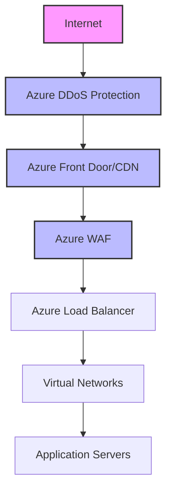
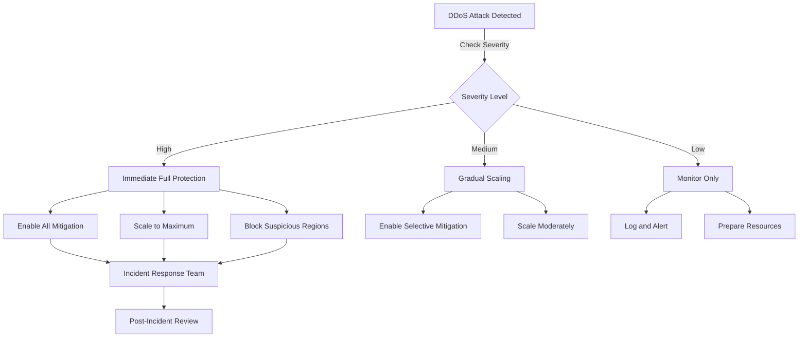
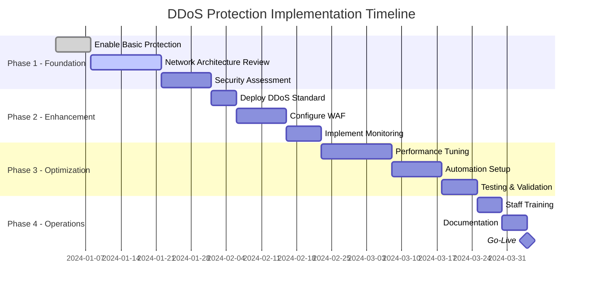

## Overview
Distributed Denial of Service (DDoS) attacks are among the most common and disruptive cybersecurity threats facing organizations today. This comprehensive guide provides actionable strategies, architectural patterns, and implementation details for protecting Azure-based and hybrid infrastructures against DDoS attacks.

## Table of Contents
1. [Understanding DDoS Attacks](#understanding-ddos-attacks)
2. [Azure DDoS Protection Layers](#azure-ddos-protection-layers)
3. [Protection Strategies](#protection-strategies)
4. [Implementation Best Practices](#implementation-best-practices)
5. [Monitoring and Detection](#monitoring-and-detection)
6. [Incident Response](#incident-response)
7. [Cost Considerations](#cost-considerations)
8. [Compliance and Governance](#compliance-and-governance)

## Understanding DDoS Attacks

### Types of DDoS Attacks
1. **Volumetric Attacks**
   - UDP floods
   - ICMP floods
   - DNS amplification attacks
   - NTP amplification attacks
   - *Characteristics*: High bandwidth consumption, typically measured in Gbps
   - *Protection Strategy*: Rate limiting, null routing, cloud-based mitigation

2. **Protocol Attacks**
   - SYN flood
   - TCP connection attacks
   - Fragmented packet attacks
   - *Characteristics*: Exhaust server resources or intermediate equipment
   - *Protection Strategy*: Connection limiting, SYN cookies, state tables optimization

3. **Application Layer Attacks**
   - HTTP flood
   - Slowloris
   - DNS query floods
   - *Characteristics*: Target specific web applications or services
   - *Protection Strategy*: Application firewall rules, behavioral analysis, rate limiting

### Attack Vectors and Indicators
```yaml
common_indicators:
  - sudden_traffic_spike: 
      threshold: \"300% above baseline\"
      duration: \">5 minutes\"
  - connection_exhaustion:
      tcp_connections: \">10000 per second\"
      half_open_connections: \">5000\"
  - application_slowdown:
      response_time: \">5 seconds\"
      error_rate: \">10%\"
  - geographic_anomalies:
      single_source_traffic: \">30% of total\"
      unusual_locations: true
```

## Azure DDoS Protection Layers

### 1. Azure DDoS Protection Basic
**Features:**
- Automatically enabled for all Azure customers
- Protects against common network-layer attacks
- No additional cost
- Limited mitigation capabilities

**Limitations:**
- No custom policies
- No telemetry or analytics
- Basic protection only

### 2. Azure DDoS Protection Standard
**Features:**
- Enhanced DDoS mitigation capabilities
- Machine learning-based traffic analysis
- Adaptive tuning
- Real-time attack metrics and diagnostics
- Cost protection guarantee

**Implementation:**
```bash
# Enable DDoS Protection Standard via Azure CLI
az network ddos-protection create \\
  --resource-group myResourceGroup \\
  --name myDDoSProtectionPlan \\
  --location eastus

# Associate with Virtual Network
az network vnet update \\
  --resource-group myResourceGroup \\
  --name myVNet \\
  --ddos-protection-plan myDDoSProtectionPlan
```

**Configuration Example:**
```json
{
  \"properties\": {
    \"ddosProtectionPlan\": {
      \"id\": \"/subscriptions/{subscription-id}/resourceGroups/{resource-group}/providers/Microsoft.Network/ddosProtectionPlans/{ddos-plan-name}\"
    },
    \"enableDdosProtection\": true
  }
}
```

### 3. Azure Front Door with DDoS Protection
**Integration Benefits:**
- Global distribution and edge protection
- Layer 7 DDoS protection
- Web Application Firewall (WAF) integration
- SSL offloading

**Configuration:**
```yaml
front_door_config:
  waf_policy:
    mode: \"Prevention\"
    custom_rules:
      - name: \"RateLimitRule\"
        priority: 1
        rule_type: \"RateLimitRule\"
        rate_limit_duration: \"OneMin\"
        rate_limit_threshold: 1000
        action: \"Block\"
    managed_rules:
      - rule_set_type: \"DefaultRuleSet\"
        rule_set_version: \"1.0\"
```

## Protection Strategies

### 1. Multi-Layered Defense Architecture


### 2. Network Architecture Best Practices

#### Network Segmentation
```json
{
  \"virtualNetworks\": [
    {
      \"name\": \"DMZ-VNet\",
      \"addressSpace\": \"10.1.0.0/16\",
      \"subnets\": [
        {
          \"name\": \"PublicSubnet\",
          \"addressPrefix\": \"10.1.1.0/24\",
          \"networkSecurityGroup\": \"Public-NSG\"
        },
        {
          \"name\": \"PrivateSubnet\",
          \"addressPrefix\": \"10.1.2.0/24\",
          \"networkSecurityGroup\": \"Private-NSG\"
        }
      ]
    }
  ]
}
```

#### Network Security Group Rules
```bash
# Create NSG rule to limit ICMP traffic
az network nsg rule create \\
  --resource-group myResourceGroup \\
  --nsg-name myNSG \\
  --name LimitICMP \\
  --priority 100 \\
  --source-address-prefixes '*' \\
  --source-port-ranges '*' \\
  --destination-address-prefixes '*' \\
  --destination-port-ranges '*' \\
  --access Deny \\
  --protocol Icmp \\
  --direction Inbound

# Rate limit incoming connections
az network nsg rule create \\
  --resource-group myResourceGroup \\
  --nsg-name myNSG \\
  --name RateLimitTCP \\
  --priority 110 \\
  --source-address-prefixes '*' \\
  --source-port-ranges '*' \\
  --destination-address-prefixes '*' \\
  --destination-port-ranges 80 443 \\
  --access Allow \\
  --protocol Tcp \\
  --direction Inbound
```

### 3. Application-Level Protection

#### Rate Limiting Implementation
```python
# Example: Azure Functions rate limiting
import azure.functions as func
from datetime import datetime, timedelta
from azure.storage.blob import BlobServiceClient
import json

def main(req: func.HttpRequest) -> func.HttpResponse:
    # Get client IP
    client_ip = req.headers.get('X-Forwarded-For', '').split(',')[0]
    
    # Check rate limit
    if check_rate_limit(client_ip):
        return func.HttpResponse(
            \"Rate limit exceeded\",
            status_code=429,
            headers={'Retry-After': '60'}
        )
    
    # Process request
    return process_request(req)

def check_rate_limit(ip_address, limit=100, window=60):
    # Implementation using Azure Storage or Redis
    # Returns True if limit exceeded
    pass
```

#### Web Application Firewall Rules
```json
{
  \"customRules\": [
    {
      \"name\": \"BlockSuspiciousUserAgents\",
      \"priority\": 5,
      \"ruleType\": \"MatchRule\",
      \"matchConditions\": [
        {
          \"matchVariables\": [
            {
              \"variableName\": \"RequestHeaders\",
              \"selector\": \"User-Agent\"
            }
          ],
          \"operator\": \"Contains\",
          \"matchValues\": [\"bot\", \"crawler\", \"scanner\"],
          \"transforms\": [\"Lowercase\"]
        }
      ],
      \"action\": \"Block\"
    }
  ]
}
```

### 4. Geographic Filtering
```bash
# Configure geo-filtering in Azure Front Door
az network front-door waf-policy rule create \\
  --policy-name myWAFPolicy \\
  --resource-group myResourceGroup \\
  --name GeoFilter \\
  --priority 10 \\
  --rule-type MatchRule \\
  --action Block \\
  --match-condition \"RemoteAddr GeoMatch 'CN' 'RU' 'KP'\"
```

## Implementation Best Practices

### 1. Capacity Planning
```yaml
capacity_requirements:
  bandwidth:
    baseline: \"1 Gbps\"
    peak: \"10 Gbps\"
    ddos_surge: \"100 Gbps\"
  
  compute:
    auto_scale:
      min_instances: 3
      max_instances: 100
      scale_out_cpu_threshold: 70
      scale_in_cpu_threshold: 30
    
  storage:
    log_retention: \"90 days\"
    metrics_retention: \"365 days\"
    estimated_daily_logs: \"100 GB\"
```

### 2. Auto-Scaling Configuration
```json
{
  \"autoscale\": {
    \"name\": \"DDoSAutoScale\",
    \"profiles\": [
      {
        \"name\": \"DDoSResponseProfile\",
        \"capacity\": {
          \"minimum\": \"5\",
          \"maximum\": \"100\",
          \"default\": \"10\"
        },
        \"rules\": [
          {
            \"metricTrigger\": {
              \"metricName\": \"Percentage CPU\",
              \"metricResourceUri\": \"[resourceId('Microsoft.Compute/virtualMachineScaleSets', 'myScaleSet')]\",
              \"timeGrain\": \"PT1M\",
              \"statistic\": \"Average\",
              \"timeWindow\": \"PT5M\",
              \"timeAggregation\": \"Average\",
              \"operator\": \"GreaterThan\",
              \"threshold\": 75
            },
            \"scaleAction\": {
              \"direction\": \"Increase\",
              \"type\": \"ChangeCount\",
              \"value\": \"10\",
              \"cooldown\": \"PT1M\"
            }
          }
        ]
      }
    ]
  }
}
```

### 3. Content Delivery Network Integration
```bash
# Configure Azure CDN with DDoS protection
az cdn profile create \\
  --name myCDNProfile \\
  --resource-group myResourceGroup \\
  --sku Standard_Microsoft

# Create CDN endpoint with security policies
az cdn endpoint create \\
  --name myEndpoint \\
  --profile-name myCDNProfile \\
  --resource-group myResourceGroup \\
  --origin www.contoso.com \\
  --enable-compression true \\
  --query-string-caching-behavior IgnoreQueryString
```

## Monitoring and Detection

### 1. Azure Monitor Integration
```kusto
// KQL query for DDoS attack detection
AzureDiagnostics
| where ResourceType == \"PUBLICIPADDRESSES\" 
| where Category == \"DDoSProtectionNotifications\"
| where OperationName == \"DDoSMitigationStarted\" or OperationName == \"DDoSMitigationStopped\"
| project TimeGenerated, Resource, OperationName, Message
| order by TimeGenerated desc
```

### 2. Custom Metrics and Alerts
```json
{
  \"alerts\": [
    {
      \"name\": \"DDoS Attack Detected\",
      \"description\": \"Alert when DDoS attack is detected\",
      \"severity\": 1,
      \"frequency\": \"PT1M\",
      \"windowSize\": \"PT5M\",
      \"criteria\": {
        \"allOf\": [
          {
            \"query\": \"AzureDiagnostics | where Category == 'DDoSProtectionNotifications'\",
            \"timeAggregation\": \"Count\",
            \"operator\": \"GreaterThan\",
            \"threshold\": 0
          }
        ]
      },
      \"actions\": {
        \"actionGroups\": [
          \"/subscriptions/{subscription}/resourceGroups/{resourceGroup}/providers/microsoft.insights/actionGroups/SecurityTeam\"
        ]
      }
    }
  ]
}
```

### 3. Real-time Dashboard Configuration
```json
{
  \"dashboard\": {
    \"name\": \"DDoS Protection Dashboard\",
    \"widgets\": [
      {
        \"type\": \"LineChart\",
        \"title\": \"Inbound Traffic Pattern\",
        \"query\": \"AzureMetrics | where MetricName == 'BytesInDDoS' | summarize avg(Total) by bin(TimeGenerated, 5m)\"
      },
      {
        \"type\": \"ScoreCard\",
        \"title\": \"Current Attack Status\",
        \"query\": \"AzureDiagnostics | where Category == 'DDoSProtectionNotifications' | where TimeGenerated > ago(5m) | count\"
      },
      {
        \"type\": \"Table\",
        \"title\": \"Top Attack Sources\",
        \"query\": \"AzureDiagnostics | where Category == 'DDoSProtectionNotifications' | summarize Count=count() by SourceIP | top 10 by Count\"
      }
    ]
  }
}
```

## Incident Response

### 1. Automated Response Playbook
```yaml
ddos_response_playbook:
  detection:
    - monitor_metrics: [\"PacketsInDDoS\", \"BytesInDDoS\", \"TCPPacketsInDDoS\"]
    - threshold_breach: true
  
  immediate_actions:
    - enable_enhanced_mitigation: true
    - scale_out_resources:
        target_capacity: \"200%\"
        regions: [\"primary\", \"secondary\"]
    - activate_geo_blocking:
        block_countries: [\"high_risk_list\"]
    - enable_rate_limiting:
        requests_per_minute: 100
    
  escalation:
    - notify_security_team: true
    - engage_azure_support: 
        severity: \"A\"
        description: \"Active DDoS attack detected\"
    
  mitigation:
    - analyze_attack_patterns: true
    - update_waf_rules: true
    - implement_ip_blocking: true
    - increase_cache_ttl: true
  
  post_incident:
    - generate_report: true
    - update_runbooks: true
    - conduct_retrospective: true
```

### 2. Communication Protocol
```json
{
  \"communication_matrix\": {
    \"severity_levels\": {
      \"high\": {
        \"stakeholders\": [\"CTO\", \"Security Team\", \"Network Team\", \"PR Team\"],
        \"channels\": [\"email\", \"sms\", \"teams\"],
        \"sla\": \"5 minutes\"
      },
      \"medium\": {
        \"stakeholders\": [\"Security Team\", \"Network Team\"],
        \"channels\": [\"email\", \"teams\"],
        \"sla\": \"15 minutes\"
      },
      \"low\": {
        \"stakeholders\": [\"Security Team\"],
        \"channels\": [\"email\"],
        \"sla\": \"1 hour\"
      }
    }
  }
}
```

### 3. Recovery Procedures
```bash
#!/bin/bash
# DDoS Recovery Script

# 1. Verify attack has stopped
check_attack_status() {
    az monitor metrics list \\
        --resource /subscriptions/{sub}/resourceGroups/{rg}/providers/Microsoft.Network/publicIPAddresses/{pip} \\
        --metric-names PacketsInDDoS \\
        --aggregation Average \\
        --interval PT1M \\
        --start-time $(date -u -d '10 minutes ago' '+%Y-%m-%dT%H:%M:%S')
}

# 2. Scale down resources
scale_down_resources() {
    az vmss scale \\
        --resource-group myResourceGroup \\
        --name myScaleSet \\
        --new-capacity 5
}

# 3. Remove temporary blocks
remove_ip_blocks() {
    # Remove temporary IP blocks from WAF
    az network front-door waf-policy custom-rule delete \\
        --policy-name myWAFPolicy \\
        --resource-group myResourceGroup \\
        --name TempIPBlock
}

# 4. Reset rate limits to normal
reset_rate_limits() {
    # Update rate limiting rules to normal levels
    az network front-door waf-policy custom-rule update \\
        --policy-name myWAFPolicy \\
        --resource-group myResourceGroup \\
        --name RateLimitRule \\
        --rate-limit-threshold 1000
}

# Execute recovery
check_attack_status
if [ $? -eq 0 ]; then
    scale_down_resources
    remove_ip_blocks
    reset_rate_limits
    echo \"Recovery completed successfully\"
else
    echo \"Attack may still be ongoing\"
fi
```

## Cost Considerations

### 1. DDoS Protection Pricing Model
```yaml
pricing_tiers:
  basic:
    cost: \"Free\"
    features:
      - \"Basic network protection\"
      - \"No SLA\"
      - \"Limited telemetry\"
  
  standard:
    monthly_cost: \"$2,944\"
    overage_cost: \"$0.045 per protected resource per hour\"
    features:
      - \"Advanced protection\"
      - \"99.99% SLA\"
      - \"Full telemetry and analytics\"
      - \"Cost protection\"
    
  cost_protection:
    coverage: \"100% of scaled-out costs during attack\"
    requirements:
      - \"DDoS Standard enabled\"
      - \"Attack confirmed by Microsoft\"
      - \"Proper documentation submitted\"
```

### 2. Cost Optimization Strategies
```json
{
  \"optimization_strategies\": [
    {
      \"strategy\": \"Regional Deployment\",
      \"description\": \"Deploy DDoS Protection Standard only in critical regions\",
      \"potential_savings\": \"30-50%\"
    },
    {
      \"strategy\": \"Shared Protection Plans\",
      \"description\": \"Share DDoS protection plans across multiple subscriptions\",
      \"potential_savings\": \"20-40%\"
    },
    {
      \"strategy\": \"Reserved Capacity\",
      \"description\": \"Use reserved instances for predictable workloads\",
      \"potential_savings\": \"40-60%\"
    }
  ]
}
```

### 3. Budget Alerts Configuration
```bash
# Create budget with alerts for DDoS protection costs
az consumption budget create \\
  --budget-name DDoSProtectionBudget \\
  --resource-group myResourceGroup \\
  --amount 5000 \\
  --time-grain Monthly \\
  --start-date 2024-01-01 \\
  --end-date 2024-12-31 \\
  --category Cost \\
  --notifications \"ActualCost_GreaterThan_80_Percent\" \"contactEmails=security-team@company.com\" \\
  --notifications \"ActualCost_GreaterThan_100_Percent\" \"contactEmails=cto@company.com\"
```

## Compliance and Governance

### 1. Regulatory Requirements
```yaml
compliance_frameworks:
  pci_dss:
    requirements:
      - \"6.6\": \"Web application firewall deployment\"
      - \"8.2.3\": \"Strong password requirements\"
      - \"10.1\": \"Audit trail implementation\"
    ddos_specific:
      - \"Deploy WAF in blocking mode\"
      - \"Monitor and log all security events\"
      - \"Regular security assessments\"
  
  iso_27001:
    controls:
      - \"A.13.1\": \"Network security management\"
      - \"A.16.1\": \"Incident response procedures\"
    implementation:
      - \"Documented DDoS response plan\"
      - \"Regular drills and testing\"
      - \"Continuous monitoring\"
  
  gdpr:
    requirements:
      - \"Article 32\": \"Security of processing\"
      - \"Article 33\": \"Data breach notification\"
    considerations:
      - \"Ensure DDoS protection doesn't compromise privacy\"
      - \"Log retention policies compliance\"
      - \"Incident reporting within 72 hours\"
```

### 2. Azure Policy Implementation
```json
{
  \"policyDefinition\": {
    \"displayName\": \"Require DDoS Protection Standard on Virtual Networks\",
    \"description\": \"This policy ensures all virtual networks have DDoS Protection Standard enabled\",
    \"mode\": \"All\",
    \"policyRule\": {
      \"if\": {
        \"allOf\": [
          {
            \"field\": \"type\",
            \"equals\": \"Microsoft.Network/virtualNetworks\"
          },
          {
            \"field\": \"Microsoft.Network/virtualNetworks/enableDdosProtection\",
            \"notEquals\": \"true\"
          }
        ]
      },
      \"then\": {
        \"effect\": \"deny\"
      }
    }
  }
}
```

### 3. Audit and Compliance Reporting
```kusto
// Compliance audit query for DDoS protection
AzureActivity
| where OperationNameValue contains \"DDoS\"
| where TimeGenerated > ago(30d)
| summarize 
    TotalOperations = count(),
    SuccessfulOperations = countif(ActivityStatusValue == \"Success\"),
    FailedOperations = countif(ActivityStatusValue == \"Failed\")
    by OperationNameValue, ResourceGroup
| project 
    Operation = OperationNameValue,
    ResourceGroup,
    Success = SuccessfulOperations,
    Failed = FailedOperations,
    ComplianceRate = round(100.0 * SuccessfulOperations / TotalOperations, 2)
| order by ComplianceRate desc
```

## Advanced Scenarios

### 1. Multi-Cloud DDoS Protection
```yaml
multi_cloud_architecture:
  azure:
    primary_region: \"East US\"
    secondary_region: \"West Europe\"
    protection: \"DDoS Standard\"
  
  aws:
    regions: [\"us-east-1\", \"eu-west-1\"]
    protection: \"AWS Shield Advanced\"
  
  cloudflare:
    plan: \"Enterprise\"
    features:
      - \"L3/L4 DDoS protection\"
      - \"L7 DDoS protection\"
      - \"Magic Transit\"
  
  traffic_distribution:
    - service: \"Cloudflare\"
      percentage: 100
      role: \"Primary edge protection\"
    - service: \"Azure\"
      percentage: 60
      role: \"Primary application hosting\"
    - service: \"AWS\"
      percentage: 40
      role: \"Secondary/failover\"
```

### 2. Machine Learning-Based Protection
```python
# Example: Custom ML model for DDoS detection
import pandas as pd
from sklearn.ensemble import IsolationForest
from azure.ai.ml import MLClient
from azure.identity import DefaultAzureCredential

class DDoSMLDetector:
    def __init__(self, workspace_name, resource_group, subscription_id):
        self.ml_client = MLClient(
            DefaultAzureCredential(),
            subscription_id,
            resource_group,
            workspace_name
        )
        self.model = IsolationForest(
            contamination=0.01,
            random_state=42
        )
    
    def train_model(self, training_data):
        \"\"\"Train anomaly detection model on normal traffic patterns\"\"\"
        features = self.extract_features(training_data)
        self.model.fit(features)
        
    def detect_anomaly(self, traffic_data):
        \"\"\"Detect potential DDoS attacks\"\"\"
        features = self.extract_features(traffic_data)
        predictions = self.model.predict(features)
        return predictions == -1  # -1 indicates anomaly
    
    def extract_features(self, data):
        \"\"\"Extract relevant features from traffic data\"\"\"
        return data[[
            'packets_per_second',
            'bytes_per_second',
            'unique_source_ips',
            'tcp_flags_distribution',
            'packet_size_variance',
            'time_between_packets'
        ]]
```

### 3. Honeypot Integration
```bash
# Deploy honeypot for DDoS intelligence gathering
#!/bin/bash

# Create honeypot VM
az vm create \\
  --resource-group HoneypotRG \\
  --name DDoSHoneypot \\
  --image Ubuntu2204 \\
  --size Standard_B2s \\
  --admin-username azureuser \\
  --generate-ssh-keys \\
  --public-ip-address HoneypotIP \\
  --nsg HoneypotNSG

# Configure honeypot services
ssh azureuser@<honeypot-ip> << 'EOF'
# Install and configure dionaea honeypot
sudo apt-get update
sudo apt-get install -y dionaea
sudo systemctl start dionaea
sudo systemctl enable dionaea

# Configure logging to Azure
wget https://aka.ms/downloadazcopy-v10-linux
tar -xvf downloadazcopy-v10-linux
sudo cp ./azcopy_linux_amd64_*/azcopy /usr/local/bin/

# Create log shipping script
cat > /usr/local/bin/ship_logs.sh << 'SCRIPT'
#!/bin/bash
azcopy copy \"/var/log/dionaea/*\" \\
  \"https://mystorageaccount.blob.core.windows.net/honeypot-logs/\" \\
  --recursive
SCRIPT

chmod +x /usr/local/bin/ship_logs.sh
echo \"*/5 * * * * /usr/local/bin/ship_logs.sh\" | crontab -
EOF
```

## Decision Matrix for AI Agents

### Protection Level Selection
```yaml
decision_criteria:
  critical_infrastructure:
    criteria:
      - availability_requirement: \">99.99%\"
      - data_sensitivity: \"high\"
      - regulatory_compliance: true
      - budget: \"enterprise\"
    recommendation: \"DDoS Protection Standard + WAF Premium\"
  
  standard_application:
    criteria:
      - availability_requirement: \">99.9%\"
      - data_sensitivity: \"medium\"
      - regulatory_compliance: false
      - budget: \"standard\"
    recommendation: \"DDoS Protection Standard + WAF Standard\"
  
  development_environment:
    criteria:
      - availability_requirement: \">99%\"
      - data_sensitivity: \"low\"
      - regulatory_compliance: false
      - budget: \"limited\"
    recommendation: \"DDoS Protection Basic + NSG rules\"
```

### Automated Response Decision Tree


## Code Examples and Automation Scripts

### 1. Comprehensive DDoS Protection Deployment
```powershell
# PowerShell script for complete DDoS protection deployment
param(
    [Parameter(Mandatory=$true)]
    [string]$ResourceGroupName,
    
    [Parameter(Mandatory=$true)]
    [string]$Location,
    
    [Parameter(Mandatory=$true)]
    [string]$VNetName,
    
    [Parameter(Mandatory=$false)]
    [string]$DdosProtectionPlanName = \"CompanyDDoSProtection\"
)

# Install required modules
Install-Module -Name Az.Network -Force -AllowClobber

# Login to Azure
Connect-AzAccount

# Create DDoS Protection Plan
$ddosPlan = New-AzDdosProtectionPlan `
    -ResourceGroupName $ResourceGroupName `
    -Name $DdosProtectionPlanName `
    -Location $Location

Write-Host \"DDoS Protection Plan created: $($ddosPlan.Name)\"

# Get Virtual Network
$vnet = Get-AzVirtualNetwork `
    -ResourceGroupName $ResourceGroupName `
    -Name $VNetName

# Enable DDoS Protection on VNet
$vnet.DdosProtectionPlan = New-Object Microsoft.Azure.Commands.Network.Models.PSResourceId
$vnet.DdosProtectionPlan.Id = $ddosPlan.Id
$vnet.EnableDdosProtection = $true

# Update VNet
$vnet | Set-AzVirtualNetwork

Write-Host \"DDoS Protection enabled on VNet: $VNetName\"

# Create monitoring alerts
$actionGroup = New-AzActionGroup `
    -ResourceGroupName $ResourceGroupName `
    -Name \"DDoSAlertGroup\" `
    -ShortName \"DDoSAlert\" `
    -Location \"Global\" `
    -EmailReceiver @{
        Name = \"SecurityTeam\"
        EmailAddress = \"security@company.com\"
    }

# Create metric alert for DDoS
$condition = New-AzMetricAlertRuleV2Criteria `
    -MetricName \"IfUnderDDoSAttack\" `
    -MetricNamespace \"Microsoft.Network/publicIPAddresses\" `
    -TimeAggregation Maximum `
    -Operator GreaterThan `
    -Threshold 0

$alert = New-AzMetricAlertRuleV2 `
    -ResourceGroupName $ResourceGroupName `
    -Name \"DDoSAttackAlert\" `
    -Description \"Alert when DDoS attack is detected\" `
    -Severity 1 `
    -WindowSize 00:05:00 `
    -Frequency 00:01:00 `
    -TargetResourceRegion $Location `
    -TargetResourceType \"Microsoft.Network/publicIPAddresses\" `
    -Criteria $condition `
    -ActionGroupId $actionGroup.Id

Write-Host \"Monitoring and alerts configured\"
```

### 2. Real-time Attack Analysis
```python
# Python script for real-time DDoS attack analysis
import asyncio
import aiohttp
from datetime import datetime, timedelta
from azure.monitor.query import LogsQueryClient
from azure.identity import DefaultAzureCredential
from azure.core.exceptions import HttpResponseError
import pandas as pd
import numpy as np

class DDoSAnalyzer:
    def __init__(self, workspace_id):
        self.workspace_id = workspace_id
        self.credential = DefaultAzureCredential()
        self.logs_client = LogsQueryClient(self.credential)
        
    async def analyze_traffic_patterns(self):
        \"\"\"Analyze traffic patterns for DDoS indicators\"\"\"
        query = \"\"\"
        AzureDiagnostics
        | where TimeGenerated > ago(5m)
        | where Category == \"NetworkSecurityGroupFlowEvent\"
        | summarize 
            TotalPackets = sum(packets_d),
            UniqueSourceIPs = dcount(src_ip_s),
            TotalBytes = sum(bytes_d)
            by bin(TimeGenerated, 1m)
        | order by TimeGenerated desc
        \"\"\"
        
        try:
            response = self.logs_client.query_workspace(
                workspace_id=self.workspace_id,
                query=query,
                timespan=timedelta(minutes=10)
            )
            
            df = pd.DataFrame(response.tables[0].rows)
            return self.detect_anomalies(df)
            
        except HttpResponseError as e:
            print(f\"Error querying logs: {e}\")
            return None
    
    def detect_anomalies(self, df):
        \"\"\"Detect anomalies in traffic patterns\"\"\"
        if df.empty:
            return None
            
        # Calculate statistical thresholds
        mean_packets = df['TotalPackets'].mean()
        std_packets = df['TotalPackets'].std()
        threshold = mean_packets + (3 * std_packets)
        
        # Check for anomalies
        anomalies = df[df['TotalPackets'] > threshold]
        
        if not anomalies.empty:
            return {
                'alert': True,
                'severity': self.calculate_severity(anomalies),
                'details': {
                    'peak_packets': anomalies['TotalPackets'].max(),
                    'unique_sources': anomalies['UniqueSourceIPs'].max(),
                    'duration': len(anomalies),
                    'start_time': anomalies['TimeGenerated'].min()
                }
            }
        
        return {'alert': False}
    
    def calculate_severity(self, anomalies):
        \"\"\"Calculate attack severity based on multiple factors\"\"\"
        packet_ratio = anomalies['TotalPackets'].max() / anomalies['TotalPackets'].mean()
        source_concentration = 1 / anomalies['UniqueSourceIPs'].mean()
        
        if packet_ratio > 10 and source_concentration > 0.5:
            return 'CRITICAL'
        elif packet_ratio > 5:
            return 'HIGH'
        elif packet_ratio > 2:
            return 'MEDIUM'
        else:
            return 'LOW'
    
    async def continuous_monitoring(self):
        \"\"\"Continuously monitor for DDoS attacks\"\"\"
        while True:
            result = await self.analyze_traffic_patterns()
            
            if result and result['alert']:
                await self.trigger_response(result)
            
            await asyncio.sleep(60)  # Check every minute
    
    async def trigger_response(self, alert_data):
        \"\"\"Trigger automated response based on severity\"\"\"
        severity = alert_data['severity']
        
        response_actions = {
            'CRITICAL': [
                'scale_out_maximum',
                'enable_geo_blocking',
                'activate_waf_strict',
                'notify_security_team'
            ],
            'HIGH': [
                'scale_out_moderate',
                'enable_rate_limiting',
                'activate_waf_standard'
            ],
            'MEDIUM': [
                'monitor_closely',
                'prepare_scaling'
            ],
            'LOW': [
                'log_event'
            ]
        }
        
        for action in response_actions.get(severity, []):
            await self.execute_action(action, alert_data)
    
    async def execute_action(self, action, data):
        \"\"\"Execute specific response action\"\"\"
        # Implementation for each action type
        print(f\"Executing action: {action} for {data['severity']} severity attack\")
        
        # Add actual implementation for each action
        # This would include API calls to Azure services

# Usage
analyzer = DDoSAnalyzer(workspace_id=\"your-workspace-id\")
asyncio.run(analyzer.continuous_monitoring())
```

### 3. Automated Recovery Orchestration
```yaml
# Azure Logic App definition for automated DDoS recovery
name: DDoS-Recovery-Orchestration
type: Microsoft.Logic/workflows
properties:
  definition:
    $schema: https://schema.management.azure.com/providers/Microsoft.Logic/schemas/2016-06-01/workflowdefinition.json#
    contentVersion: 1.0.0.0
    triggers:
      manual:
        type: Request
        kind: Http
        inputs:
          schema:
            type: object
            properties:
              attackStopped:
                type: boolean
              duration:
                type: integer
              severity:
                type: string
    
    actions:
      Check_Attack_Status:
        type: Http
        inputs:
          method: GET
          uri: https://management.azure.com/subscriptions/@{variables('subscriptionId')}/resourceGroups/@{variables('resourceGroup')}/providers/Microsoft.Network/ddosProtectionPlans/@{variables('ddosPlanName')}/ddosProtectionPlanStatus?api-version=2021-03-01
          authentication:
            type: ManagedServiceIdentity
      
      Condition_Attack_Stopped:
        type: If
        expression:
          and:
            - equals:
              - \"@body('Check_Attack_Status')['properties']['isUnderDDoSAttack']\"
              - false
        actions:
          true:
            Scale_Down_Resources:
              type: Http
              inputs:
                method: PATCH
                uri: https://management.azure.com/subscriptions/@{variables('subscriptionId')}/resourceGroups/@{variables('resourceGroup')}/providers/Microsoft.Compute/virtualMachineScaleSets/@{variables('scaleSetName')}?api-version=2021-07-01
                body:
                  sku:
                    capacity: 5
            
            Reset_WAF_Rules:
              type: Http
              inputs:
                method: PUT
                uri: https://management.azure.com/subscriptions/@{variables('subscriptionId')}/resourceGroups/@{variables('resourceGroup')}/providers/Microsoft.Network/ApplicationGatewayWebApplicationFirewallPolicies/@{variables('wafPolicyName')}?api-version=2021-05-01
                body:
                  properties:
                    customRules: []
                    policySettings:
                      requestBodyCheck: true
                      maxRequestBodySizeInKb: 128
                      fileUploadLimitInMb: 100
                      state: Enabled
                      mode: Detection
            
            Remove_Temporary_Blocks:
              type: Http
              inputs:
                method: DELETE
                uri: https://management.azure.com/subscriptions/@{variables('subscriptionId')}/resourceGroups/@{variables('resourceGroup')}/providers/Microsoft.Network/networkSecurityGroups/@{variables('nsgName')}/securityRules/TempDDoSBlock?api-version=2021-05-01
            
            Generate_Report:
              type: Function
              inputs:
                function:
                  id: /subscriptions/@{variables('subscriptionId')}/resourceGroups/@{variables('resourceGroup')}/providers/Microsoft.Web/sites/@{variables('functionAppName')}/functions/GenerateDDoSReport
                body:
                  attackDuration: \"@triggerBody()['duration']\"
                  severity: \"@triggerBody()['severity']\"
                  timestamp: \"@utcNow()\"
            
            Send_Notification:
              type: SendEmail
              inputs:
                to: security-team@company.com
                subject: DDoS Attack Mitigation Complete
                body: |
                  The DDoS attack has been successfully mitigated.
                  
                  Duration: @{triggerBody()['duration']} minutes
                  Severity: @{triggerBody()['severity']}
                  Recovery actions completed:
                  - Resources scaled down to normal levels
                  - WAF rules reset to standard configuration
                  - Temporary IP blocks removed
                  - Detailed report generated
                  
                  Please review the attached report for full details.
          
          false:
            Wait_And_Retry:
              type: Wait
              inputs:
                interval:
                  count: 5
                  unit: Minute
            
            Recheck_Status:
              type: Workflow
              inputs:
                host:
                  workflow:
                    id: @{workflow().id}
                body: @triggerBody()
```

## Performance Optimization

### 1. Caching Strategy
```nginx
# Nginx configuration for DDoS mitigation through caching
http {
    # Enable caching
    proxy_cache_path /var/cache/nginx levels=1:2 keys_zone=ddos_cache:100m max_size=10g inactive=60m;
    
    # Rate limiting
    limit_req_zone $binary_remote_addr zone=ddos_limit:10m rate=10r/s;
    limit_conn_zone $binary_remote_addr zone=addr:10m;
    
    server {
        listen 80;
        server_name example.com;
        
        # Apply rate limiting
        limit_req zone=ddos_limit burst=20 nodelay;
        limit_conn addr 10;
        
        # Cache configuration
        location / {
            proxy_cache ddos_cache;
            proxy_cache_valid 200 301 302 10m;
            proxy_cache_valid 404 1m;
            proxy_cache_use_stale error timeout updating http_500 http_502 http_503 http_504;
            proxy_cache_background_update on;
            proxy_cache_lock on;
            
            # Add DDoS protection headers
            add_header X-Cache-Status $upstream_cache_status;
            add_header X-RateLimit-Limit 10;
            add_header X-RateLimit-Remaining $limit_req_status;
            
            proxy_pass http://backend;
        }
        
        # Block suspicious patterns
        location ~ \\.(aspx|php|jsp|cgi)$ {
            return 404;
        }
        
        # Protect against slow POST attacks
        client_body_timeout 10s;
        client_header_timeout 10s;
        client_max_body_size 100K;
        send_timeout 10s;
    }
}
```

### 2. Database Connection Pooling
```csharp
// C# implementation of connection pooling for DDoS resilience
using System;
using System.Data.SqlClient;
using Microsoft.Extensions.Configuration;
using System.Collections.Concurrent;
using System.Threading;
using System.Threading.Tasks;

public class ResilientDatabasePool
{
    private readonly string _connectionString;
    private readonly ConcurrentBag<SqlConnection> _connectionPool;
    private readonly SemaphoreSlim _poolSemaphore;
    private readonly int _maxPoolSize;
    private readonly int _minPoolSize;
    private readonly TimeSpan _connectionTimeout;
    
    public ResilientDatabasePool(IConfiguration configuration)
    {
        _connectionString = configuration.GetConnectionString(\"DefaultConnection\");
        _maxPoolSize = configuration.GetValue<int>(\"Database:MaxPoolSize\", 100);
        _minPoolSize = configuration.GetValue<int>(\"Database:MinPoolSize\", 10);
        _connectionTimeout = TimeSpan.FromSeconds(configuration.GetValue<int>(\"Database:ConnectionTimeout\", 30));
        
        _connectionPool = new ConcurrentBag<SqlConnection>();
        _poolSemaphore = new SemaphoreSlim(_maxPoolSize, _maxPoolSize);
        
        // Pre-populate pool
        InitializePool();
    }
    
    private void InitializePool()
    {
        for (int i = 0; i < _minPoolSize; i++)
        {
            var connection = CreateConnection();
            _connectionPool.Add(connection);
        }
    }
    
    private SqlConnection CreateConnection()
    {
        var connection = new SqlConnection(_connectionString);
        connection.StateChange += (sender, e) =>
        {
            if (e.CurrentState == System.Data.ConnectionState.Broken)
            {
                // Handle broken connections during DDoS
                HandleBrokenConnection((SqlConnection)sender);
            }
        };
        return connection;
    }
    
    public async Task<SqlConnection> GetConnectionAsync()
    {
        await _poolSemaphore.WaitAsync(_connectionTimeout);
        
        try
        {
            if (_connectionPool.TryTake(out SqlConnection connection))
            {
                if (connection.State == System.Data.ConnectionState.Open)
                {
                    return connection;
                }
                else
                {
                    await connection.OpenAsync();
                    return connection;
                }
            }
            else
            {
                // Create new connection if pool is empty
                var newConnection = CreateConnection();
                await newConnection.OpenAsync();
                return newConnection;
            }
        }
        catch (SqlException ex) when (IsDDoSRelated(ex))
        {
            // Handle DDoS-related database errors
            throw new DDoSProtectionException(\"Database unavailable due to DDoS attack\", ex);
        }
        finally
        {
            _poolSemaphore.Release();
        }
    }
    
    public void ReturnConnection(SqlConnection connection)
    {
        if (connection != null && connection.State == System.Data.ConnectionState.Open)
        {
            _connectionPool.Add(connection);
        }
        else
        {
            connection?.Dispose();
        }
    }
    
    private bool IsDDoSRelated(SqlException ex)
    {
        // Check for DDoS-related error codes
        return ex.Number == -2 || // Timeout
               ex.Number == 1205 || // Deadlock
               ex.Number == 8645;   // Memory pressure
    }
    
    private void HandleBrokenConnection(SqlConnection connection)
    {
        connection.Dispose();
        // Optionally implement circuit breaker pattern
        // Log the issue for monitoring
    }
}

// Usage example
public class DatabaseService
{
    private readonly ResilientDatabasePool _dbPool;
    
    public DatabaseService(ResilientDatabasePool dbPool)
    {
        _dbPool = dbPool;
    }
    
    public async Task<T> ExecuteQueryAsync<T>(string query, Func<SqlCommand, Task<T>> executeFunc)
    {
        SqlConnection connection = null;
        try
        {
            connection = await _dbPool.GetConnectionAsync();
            using (var command = new SqlCommand(query, connection))
            {
                command.CommandTimeout = 30; // Short timeout during DDoS
                return await executeFunc(command);
            }
        }
        finally
        {
            if (connection != null)
            {
                _dbPool.ReturnConnection(connection);
            }
        }
    }
}
```

## Testing and Validation

### 1. DDoS Simulation Framework
```python
# Python framework for DDoS protection testing
import asyncio
import aiohttp
import random
import time
from dataclasses import dataclass
from typing import List, Dict, Any
import matplotlib.pyplot as plt
import numpy as np

@dataclass
class DDoSTestConfig:
    target_url: str
    duration_seconds: int
    requests_per_second: int
    attack_patterns: List[str]
    source_ips: List[str]
    
class DDoSSimulator:
    def __init__(self, config: DDoSTestConfig):
        self.config = config
        self.results = {
            'successful_requests': 0,
            'failed_requests': 0,
            'response_times': [],
            'error_types': {},
            'timestamps': []
        }
    
    async def simulate_attack(self):
        \"\"\"Simulate DDoS attack with various patterns\"\"\"
        tasks = []
        start_time = time.time()
        
        # Create attack patterns
        for pattern in self.config.attack_patterns:
            if pattern == 'volumetric':
                tasks.append(self.volumetric_attack())
            elif pattern == 'slowloris':
                tasks.append(self.slowloris_attack())
            elif pattern == 'application_layer':
                tasks.append(self.application_layer_attack())
        
        # Run attacks concurrently
        await asyncio.gather(*tasks)
        
        # Generate report
        self.generate_report()
    
    async def volumetric_attack(self):
        \"\"\"Simulate volumetric attack\"\"\"
        async with aiohttp.ClientSession() as session:
            for _ in range(self.config.requests_per_second * self.config.duration_seconds):
                start = time.time()
                try:
                    headers = {'X-Forwarded-For': random.choice(self.config.source_ips)}
                    async with session.get(
                        self.config.target_url, 
                        headers=headers,
                        timeout=aiohttp.ClientTimeout(total=5)
                    ) as response:
                        response_time = time.time() - start
                        self.results['response_times'].append(response_time)
                        self.results['timestamps'].append(time.time())
                        
                        if response.status == 200:
                            self.results['successful_requests'] += 1
                        else:
                            self.results['failed_requests'] += 1
                            error_type = f\"HTTP_{response.status}\"
                            self.results['error_types'][error_type] = \\
                                self.results['error_types'].get(error_type, 0) + 1
                                
                except Exception as e:
                    self.results['failed_requests'] += 1
                    error_type = type(e).__name__
                    self.results['error_types'][error_type] = \\
                        self.results['error_types'].get(error_type, 0) + 1
                
                await asyncio.sleep(1 / self.config.requests_per_second)
    
    async def slowloris_attack(self):
        \"\"\"Simulate Slowloris attack\"\"\"
        connections = []
        
        for _ in range(100):  # Create 100 slow connections
            try:
                reader, writer = await asyncio.open_connection(
                    self.config.target_url.split('://')[1].split('/')[0],
                    80
                )
                
                # Send partial HTTP header
                writer.write(b\"GET / HTTP/1.1\\r\
\")
                writer.write(b\"Host: \" + self.config.target_url.encode() + b\"\\r\
\")
                await writer.drain()
                
                connections.append((reader, writer))
                
                # Keep connections open, sending data slowly
                for _ in range(self.config.duration_seconds):
                    for reader, writer in connections:
                        writer.write(b\"X-Header: test\\r\
\")
                        await writer.drain()
                    await asyncio.sleep(10)
                    
            except Exception as e:
                self.results['failed_requests'] += 1
                self.results['error_types']['SlowlorisBlocked'] = \\
                    self.results['error_types'].get('SlowlorisBlocked', 0) + 1
    
    async def application_layer_attack(self):
        \"\"\"Simulate application layer attack\"\"\"
        async with aiohttp.ClientSession() as session:
            # Target expensive endpoints
            expensive_endpoints = [
                '/search?q=' + 'a' * 1000,
                '/api/compute-intensive',
                '/download/large-file'
            ]
            
            for _ in range(self.config.duration_seconds):
                tasks = []
                for endpoint in expensive_endpoints:
                    url = self.config.target_url + endpoint
                    tasks.append(self.make_request(session, url))
                
                await asyncio.gather(*tasks)
                await asyncio.sleep(1)
    
    async def make_request(self, session, url):
        \"\"\"Make individual request with timing\"\"\"
        start = time.time()
        try:
            async with session.get(url, timeout=aiohttp.ClientTimeout(total=30)) as response:
                response_time = time.time() - start
                self.results['response_times'].append(response_time)
                self.results['timestamps'].append(time.time())
                
                if response.status == 200:
                    self.results['successful_requests'] += 1
                else:
                    self.results['failed_requests'] += 1
                    
        except Exception as e:
            self.results['failed_requests'] += 1
    
    def generate_report(self):
        \"\"\"Generate visual report of DDoS test results\"\"\"
        fig, ((ax1, ax2), (ax3, ax4)) = plt.subplots(2, 2, figsize=(15, 10))
        
        # Response time over time
        ax1.plot(self.results['timestamps'], self.results['response_times'])
        ax1.set_title('Response Time During Attack')
        ax1.set_xlabel('Time')
        ax1.set_ylabel('Response Time (seconds)')
        
        # Success vs failure rate
        success_rate = self.results['successful_requests'] / \\
                      (self.results['successful_requests'] + self.results['failed_requests'])
        ax2.pie([success_rate, 1-success_rate], 
                labels=['Success', 'Failed'],
                autopct='%1.1f%%')
        ax2.set_title('Request Success Rate')
        
        # Error types distribution
        if self.results['error_types']:
            ax3.bar(self.results['error_types'].keys(), 
                   self.results['error_types'].values())
            ax3.set_title('Error Types Distribution')
            ax3.set_xlabel('Error Type')
            ax3.set_ylabel('Count')
            plt.setp(ax3.xaxis.get_majorticklabels(), rotation=45)
        
        # Response time distribution
        ax4.hist(self.results['response_times'], bins=50, edgecolor='black')
        ax4.set_title('Response Time Distribution')
        ax4.set_xlabel('Response Time (seconds)')
        ax4.set_ylabel('Frequency')
        
        plt.tight_layout()
        plt.savefig('ddos_test_report.png', dpi=150)
        plt.close()
        
        # Generate text report
        print(\"\
=== DDoS Test Report ===\")
        print(f\"Total Requests: {self.results['successful_requests'] + self.results['failed_requests']}\")
        print(f\"Successful: {self.results['successful_requests']}\")
        print(f\"Failed: {self.results['failed_requests']}\")
        print(f\"Success Rate: {success_rate*100:.2f}%\")
        print(f\"Average Response Time: {np.mean(self.results['response_times']):.3f}s\")
        print(f\"Max Response Time: {np.max(self.results['response_times']):.3f}s\")
        print(\"\
Error Types:\")
        for error, count in self.results['error_types'].items():
            print(f\"  {error}: {count}\")

# Usage example
if __name__ == \"__main__\":
    config = DDoSTestConfig(
        target_url=\"https://test-environment.example.com\",
        duration_seconds=300,
        requests_per_second=1000,
        attack_patterns=['volumetric', 'application_layer'],
        source_ips=['192.168.1.' + str(i) for i in range(1, 255)]
    )
    
    simulator = DDoSSimulator(config)
    asyncio.run(simulator.simulate_attack())
```

### 2. Protection Validation Checklist
```yaml
validation_checklist:
  infrastructure_level:
    - verify_ddos_plan_active: 
        command: \"az network ddos-protection show --name <plan-name>\"
        expected: \"provisioningState: Succeeded\"
    
    - check_vnet_protection:
        command: \"az network vnet show --name <vnet-name>\"
        expected: \"enableDdosProtection: true\"
    
    - validate_waf_rules:
        command: \"az network application-gateway waf-policy show --name <policy-name>\"
        verify:
          - \"mode: Prevention\"
          - \"state: Enabled\"
          - \"customRules: [count > 0]\"
    
    - confirm_auto_scale:
        command: \"az monitor autoscale show --name <autoscale-name>\"
        verify:
          - \"enabled: true\"
          - \"profiles: [appropriate rules defined]\"
  
  application_level:
    - test_rate_limiting:
        endpoint: \"/api/test\"
        requests_per_minute: 200
        expected_blocked: 100
    
    - verify_cache_headers:
        endpoints: [\"/\", \"/api/data\", \"/static/*\"]
        required_headers:
          - \"Cache-Control\"
          - \"ETag\"
          - \"Last-Modified\"
    
    - check_connection_limits:
        max_connections_per_ip: 100
        timeout_seconds: 30
    
    - validate_error_handling:
        test_scenarios:
          - \"connection_overflow\"
          - \"malformed_requests\"
          - \"slow_requests\"
  
  monitoring_validation:
    - verify_alerts_configured:
        required_alerts:
          - \"DDoS attack detected\"
          - \"High CPU usage\"
          - \"Memory pressure\"
          - \"Connection limit exceeded\"
    
    - check_log_collection:
        log_types:
          - \"Application logs\"
          - \"Security logs\"
          - \"Performance metrics\"
          - \"Network flow logs\"
    
    - test_alert_channels:
        channels:
          - email: \"security@company.com\"
          - sms: \"+1234567890\"
          - webhook: \"https://incident.company.com/webhook\"
  
  recovery_testing:
    - simulate_attack_stop:
        steps:
          - \"Trigger mock attack\"
          - \"Verify protection activates\"
          - \"Stop attack\"
          - \"Measure recovery time\"
          - \"Verify scale-down\"
    
    - test_failover:
        regions: [\"primary\", \"secondary\"]
        expected_rto: \"< 5 minutes\"
        expected_rpo: \"< 1 minute\"
```

### 3. Performance Benchmarking
```bash
#!/bin/bash
# DDoS protection performance benchmarking script

# Configuration
TARGET_URL=\"https://your-application.azurewebsites.net\"
NORMAL_LOAD=100
ATTACK_LOAD=10000
TEST_DURATION=300
RESULTS_DIR=\"./ddos-benchmark-results\"

# Create results directory
mkdir -p $RESULTS_DIR

echo \"Starting DDoS Protection Benchmarking...\"

# 1. Baseline Performance Test
echo \"Phase 1: Establishing baseline performance...\"
ab -n $NORMAL_LOAD -c 10 -g $RESULTS_DIR/baseline.tsv $TARGET_URL/ > $RESULTS_DIR/baseline.txt

# 2. Gradual Load Increase
echo \"Phase 2: Testing gradual load increase...\"
for load in 100 500 1000 5000 10000; do
    echo \"Testing with $load requests...\"
    ab -n $load -c 50 -g $RESULTS_DIR/load_${load}.tsv $TARGET_URL/ > $RESULTS_DIR/load_${load}.txt
    sleep 30  # Allow system to stabilize
done

# 3. Sustained Attack Simulation
echo \"Phase 3: Simulating sustained attack...\"
timeout $TEST_DURATION ab -n 999999999 -c 1000 -g $RESULTS_DIR/sustained_attack.tsv $TARGET_URL/ > $RESULTS_DIR/sustained_attack.txt &
ATTACK_PID=$!

# Monitor system response during attack
for i in $(seq 1 $((TEST_DURATION/30))); do
    sleep 30
    curl -w \"@curl-format.txt\" -o /dev/null -s $TARGET_URL >> $RESULTS_DIR/response_times.txt
done

# 4. Recovery Test
echo \"Phase 4: Testing recovery after attack...\"
kill $ATTACK_PID 2>/dev/null
sleep 60  # Wait for system to stabilize

# Test recovery performance
ab -n $NORMAL_LOAD -c 10 -g $RESULTS_DIR/recovery.tsv $TARGET_URL/ > $RESULTS_DIR/recovery.txt

# 5. Generate Report
echo \"Generating benchmark report...\"
cat > $RESULTS_DIR/report.md << EOF
# DDoS Protection Benchmark Report

## Test Configuration
- Target URL: $TARGET_URL
- Normal Load: $NORMAL_LOAD requests
- Attack Load: $ATTACK_LOAD concurrent connections
- Test Duration: $TEST_DURATION seconds

## Results Summary

### Baseline Performance
$(grep \"Requests per second\" $RESULTS_DIR/baseline.txt)
$(grep \"Time per request\" $RESULTS_DIR/baseline.txt | head -1)

### Load Test Results
$(for load in 100 500 1000 5000 10000; do
    echo \"Load $load: $(grep \"Requests per second\" $RESULTS_DIR/load_${load}.txt)\"
done)

### Attack Response
$(grep \"Requests per second\" $RESULTS_DIR/sustained_attack.txt)
$(grep \"Failed requests\" $RESULTS_DIR/sustained_attack.txt)

### Recovery Performance
$(grep \"Requests per second\" $RESULTS_DIR/recovery.txt)
$(grep \"Time per request\" $RESULTS_DIR/recovery.txt | head -1)

## Visualizations
See attached graphs for detailed analysis.
EOF

# Generate visualizations using gnuplot
gnuplot << EOF
set terminal png
set output \"$RESULTS_DIR/response_time_graph.png\"
set title \"Response Time During DDoS Test\"
set xlabel \"Request Number\"
set ylabel \"Response Time (ms)\"
set grid
plot \"$RESULTS_DIR/sustained_attack.tsv\" using 9 with lines title \"Response Time\"
EOF

echo \"Benchmarking complete. Results available in $RESULTS_DIR\"
```

## Troubleshooting Guide

### Common Issues and Solutions

```yaml
troubleshooting_guide:
  protection_not_activating:
    symptoms:
      - \"DDoS metrics show attack but mitigation not triggered\"
      - \"Traffic still reaching backend during attack\"
    
    diagnostic_steps:
      - check_plan_status: \"az network ddos-protection show\"
      - verify_vnet_association: \"az network vnet show\"
      - review_nsg_rules: \"az network nsg rule list\"
    
    solutions:
      - \"Ensure DDoS Protection Standard is enabled\"
      - \"Verify VNet is associated with DDoS plan\"
      - \"Check NSG rules aren't blocking mitigation\"
      - \"Review diagnostic logs for errors\"
  
  false_positives:
    symptoms:
      - \"Legitimate traffic being blocked\"
      - \"High false positive rate in WAF\"
    
    diagnostic_steps:
      - analyze_blocked_requests: |
          AzureDiagnostics
          | where Category == \"ApplicationGatewayFirewallLog\"
          | where action_s == \"Blocked\"
          | summarize count() by ruleName_s, Message
      
      - review_traffic_patterns: |
          AzureDiagnostics
          | where Category == \"ApplicationGatewayAccessLog\"
          | summarize count() by clientIP_s, requestUri_s
          | order by count_ desc
    
    solutions:
      - \"Tune WAF rules based on traffic patterns\"
      - \"Add exceptions for legitimate sources\"
      - \"Adjust rate limiting thresholds\"
      - \"Implement IP allowlisting for partners\"
  
  performance_degradation:
    symptoms:
      - \"High latency during protection\"
      - \"Application timeouts\"
      - \"Database connection issues\"
    
    diagnostic_steps:
      - check_resource_utilization: \"az monitor metrics list\"
      - analyze_bottlenecks: \"Review Application Insights\"
      - examine_scaling_events: \"az monitor autoscale history list\"
    
    solutions:
      - \"Optimize application code\"
      - \"Implement connection pooling\"
      - \"Increase cache TTL values\"
      - \"Pre-scale resources during attacks\"
  
  cost_overruns:
    symptoms:
      - \"Unexpected Azure charges\"
      - \"Budget alerts triggered\"
    
    diagnostic_steps:
      - review_cost_analysis: \"Azure Cost Management\"
      - check_resource_usage: \"az consumption usage list\"
      - verify_scaling_policies: \"az monitor autoscale show\"
    
    solutions:
      - \"Set scaling limits\"
      - \"Use reserved instances\"
      - \"Implement cost alerts\"
      - \"Apply for DDoS cost protection\"
  
  monitoring_gaps:
    symptoms:
      - \"Attacks detected late or not at all\"
      - \"Missing critical metrics\"
      - \"Blind spots in coverage\"
    
    diagnostic_steps:
      - audit_monitoring_coverage: \"Review all monitoring sources\"
      - check_metric_collection: \"Verify metrics are being collected\"
      - test_alert_firing: \"Trigger test conditions\"
    
    solutions:
      - \"Implement comprehensive monitoring strategy\"
      - \"Enable diagnostic logs on all resources\"
      - \"Configure proper log retention policies\"
      - \"Set up end-to-end monitoring dashboards\"
  
  regional_failover_issues:
    symptoms:
      - \"Traffic not redirecting during regional outage\"
      - \"Failover taking too long\"
      - \"Data inconsistency across regions\"
    
    diagnostic_steps:
      - test_traffic_manager: \"az network traffic-manager profile show\"
      - verify_health_probes: \"Check endpoint health configurations\"
      - review_dns_ttl: \"Verify DNS TTL settings\"
    
    solutions:
      - \"Optimize Traffic Manager configuration\"
      - \"Reduce health probe intervals\"
      - \"Lower DNS TTL values\"
      - \"Implement active-active architecture\"

## Conclusion and Next Steps

### Implementation Roadmap


### Key Takeaways for AI Implementation

1. **Decision Framework**
   - Always evaluate threat level before applying mitigation
   - Balance protection strength with legitimate traffic needs
   - Consider cost implications of scaling decisions
   - Prioritize automated responses for faster reaction times

2. **Implementation Priorities**
   ```yaml
   priority_matrix:
     immediate:
       - \"Enable DDoS Protection Standard for critical assets\"
       - \"Configure basic WAF rules\"
       - \"Set up monitoring and alerting\"
     
     short_term:
       - \"Implement auto-scaling policies\"
       - \"Deploy geographic filtering\"
       - \"Create incident response playbooks\"
     
     long_term:
       - \"Develop ML-based detection models\"
       - \"Establish multi-cloud protection\"
       - \"Build comprehensive automation framework\"
   ```

3. **Success Metrics**
   ```json
   {
     \"protection_effectiveness\": {
       \"mitigation_time\": \"< 60 seconds\",
       \"false_positive_rate\": \"< 0.1%\",
       \"availability_during_attack\": \"> 99.9%\"
     },
     \"operational_efficiency\": {
       \"automated_response_rate\": \"> 95%\",
       \"recovery_time\": \"< 5 minutes\",
       \"cost_per_incident\": \"optimized\"
     },
     \"compliance_metrics\": {
       \"audit_pass_rate\": \"100%\",
       \"documentation_completeness\": \"100%\",
       \"training_completion\": \"100%\"
     }
   }
   ```

### Future Considerations

1. **Emerging Threats**
   - IoT botnet attacks
   - AI-powered attack patterns
   - Encrypted attack traffic
   - Zero-day exploits

2. **Technology Evolution**
   - 5G network implications
   - Edge computing protection
   - Quantum-resistant security
   - Blockchain-based mitigation

3. **Best Practices Evolution**
   - Continuous learning from incidents
   - Regular strategy updates
   - Industry collaboration
   - Threat intelligence sharing

### Resources and References

1. **Official Documentation**
   - [Azure DDoS Protection Documentation](https://docs.microsoft.com/en-us/azure/ddos-protection/)
   - [Azure WAF Documentation](https://docs.microsoft.com/en-us/azure/web-application-firewall/)
   - [Azure Monitor Documentation](https://docs.microsoft.com/en-us/azure/azure-monitor/)

2. **Community Resources**
   - [Azure Security Center Blog](https://azure.microsoft.com/en-us/blog/topics/security/)
   - [DDoS Protection Best Practices](https://docs.microsoft.com/en-us/azure/ddos-protection/ddos-best-practices)
   - [Security Community Forums](https://techcommunity.microsoft.com/t5/azure-security/bd-p/AzureSecurity)

3. **Training and Certification**
   - Azure Security Engineer Associate (AZ-500)
   - Azure Network Engineer Associate
   - Security Operations Analyst Associate

4. **Support Channels**
   - Azure Support: 24/7 technical support
   - Azure Security Center: Threat detection and response
   - Microsoft Security Response Center: Security incident reporting

### Final Recommendations

1. **For Small Organizations**
   - Start with DDoS Protection Basic and NSG rules
   - Implement CDN for static content
   - Use Azure Front Door for basic WAF protection
   - Focus on monitoring and alerting

2. **For Medium Organizations**
   - Deploy DDoS Protection Standard
   - Implement comprehensive WAF policies
   - Set up auto-scaling infrastructure
   - Develop incident response procedures

3. **For Large Enterprises**
   - Multi-region DDoS protection strategy
   - Advanced ML-based detection
   - Dedicated security operations center
   - Continuous testing and optimization

4. **For AI Agents**
   - Use decision trees for automated responses
   - Implement pattern recognition for attack detection
   - Maintain updated threat intelligence
   - Balance security with user experience

---
