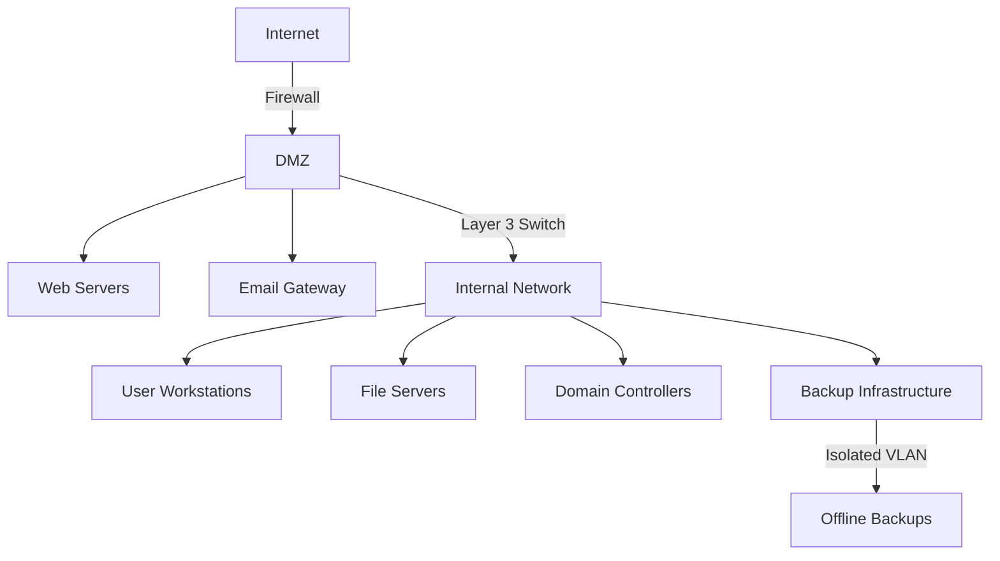
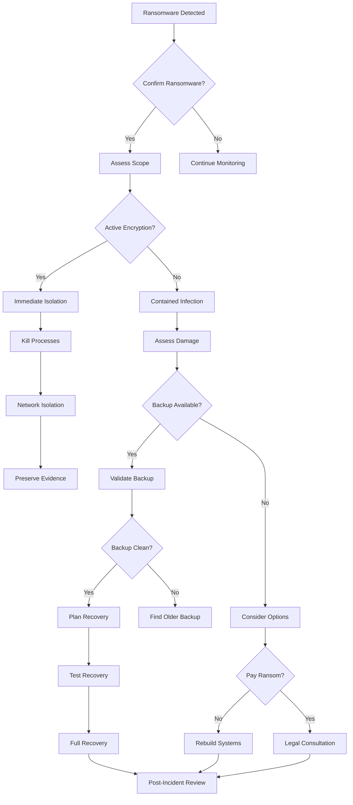

## Overview
This comprehensive guide provides detailed procedures, technical instructions, and decision-making frameworks for containing ransomware attacks. The information is structured to enable AI agents to rapidly identify, isolate, and mitigate ransomware incidents while preserving forensic evidence and maintaining business continuity.

## Table of Contents
1. [Introduction](#introduction)
2. [Pre-Incident Preparation](#pre-incident-preparation)
3. [Initial Detection and Assessment](#initial-detection-and-assessment)
4. [Immediate Containment Actions](#immediate-containment-actions)
5. [Network Isolation Procedures](#network-isolation-procedures)
6. [Endpoint Containment](#endpoint-containment)
7. [Data Recovery Process](#data-recovery-process)
8. [Forensic Preservation](#forensic-preservation)
9. [Communication Protocols](#communication-protocols)
10. [Post-Incident Activities](#post-incident-activities)
11. [Technical Scripts and Commands](#technical-scripts-and-commands)
12. [Decision Trees](#decision-trees)
13. [Azure-Specific Containment](#azure-specific-containment)
14. [Preventive Measures](#preventive-measures)
15. [References and Resources](#references-and-resources)

## Introduction

### Purpose
This document serves as a comprehensive technical reference for ransomware containment. It provides:
- Step-by-step procedures for incident response
- Technical commands and scripts for containment
- Decision frameworks for AI-driven response
- Integration with Azure security services
- Forensic preservation techniques

### Key Principles
1. **Speed**: Act quickly to limit spread
2. **Preservation**: Maintain forensic evidence
3. **Documentation**: Log all actions taken
4. **Communication**: Keep stakeholders informed
5. **Recovery**: Plan for restoration from the start

### Ransomware Types and Characteristics
```json
{
  \"ransomware_types\": {
    \"crypto_ransomware\": {
      \"behavior\": \"Encrypts files and demands payment\",
      \"indicators\": [\"Changed file extensions\", \"Ransom notes\", \"Encrypted files\"],
      \"common_extensions\": [\".locked\", \".encrypted\", \".enc\", \".crypt\", \".locky\"]
    },
    \"locker_ransomware\": {
      \"behavior\": \"Locks system access without encrypting files\",
      \"indicators\": [\"Unable to access desktop\", \"Lock screen messages\", \"System freeze\"],
      \"recovery_priority\": \"Boot from external media\"
    },
    \"double_extortion\": {
      \"behavior\": \"Encrypts and exfiltrates data before demanding ransom\",
      \"indicators\": [\"Unusual outbound traffic\", \"Data staging locations\", \"Encryption activity\"],
      \"critical_action\": \"Block outbound connections immediately\"
    },
    \"ransomware_as_a_service\": {
      \"behavior\": \"Deployed by affiliates using common toolkits\",
      \"indicators\": [\"Known toolkit signatures\", \"Common C2 infrastructure\", \"Affiliate identifiers\"],
      \"examples\": [\"REvil\", \"DarkSide\", \"Conti\", \"LockBit\"]
    }
  }
}
```

## Pre-Incident Preparation

### Essential Tools and Resources
```yaml
incident_response_toolkit:
  forensic_tools:
    - tool: \"FTK Imager\"
      purpose: \"Create forensic images\"
      download: \"https://accessdata.com/product-download\"
    - tool: \"WinHex\"
      purpose: \"Hex editor for analysis\"
      download: \"https://www.x-ways.net/winhex/\"
    - tool: \"Volatility\"
      purpose: \"Memory analysis\"
      download: \"https://www.volatilityfoundation.org/\"
    
  containment_tools:
    - tool: \"Process Explorer\"
      purpose: \"Process analysis\"
      command: \"procexp.exe /accepteula\"
    - tool: \"Autoruns\"
      purpose: \"Persistence detection\"
      command: \"autoruns.exe /accepteula\"
    - tool: \"TCPView\"
      purpose: \"Network connection monitoring\"
      command: \"tcpview.exe /accepteula\"
    
  backup_verification:
    - tool: \"VEEAM Ready\"
      purpose: \"Backup verification\"
      script: |
        Get-VBRBackup | ForEach-Object {
          $backup = $_
          $backup.GetAllStorages() | ForEach-Object {
            Test-Path $_.FilePath
          }
        }
```

### Network Segmentation Map


### Critical Asset Inventory
```sql
-- Sample query for asset inventory database
SELECT 
    asset_id,
    asset_name,
    asset_type,
    ip_address,
    criticality_level,
    backup_status,
    recovery_priority,
    isolation_group
FROM critical_assets
WHERE criticality_level IN ('HIGH', 'CRITICAL')
ORDER BY recovery_priority ASC;
```

## Initial Detection and Assessment

### Detection Indicators
```python
# AI Agent Detection Script
import os
import hashlib
import subprocess
import json
from datetime import datetime

class RansomwareDetector:
    def __init__(self):
        self.indicators = {
            'file_extensions': [
                '.locked', '.enc', '.encrypted', '.locky', '.odin',
                '.crypt', '.crypto', '.cerber', '.satan', '.ransom'
            ],
            'ransom_note_names': [
                'READ_ME.txt', 'DECRYPT_INSTRUCTIONS.html', 
                'HOW_TO_DECRYPT.txt', '!!!READ_THIS!!!.txt'
            ],
            'suspicious_processes': [
                'vssadmin.exe', 'wbadmin.exe', 'bcdedit.exe',
                'cipher.exe', 'diskpart.exe'
            ],
            'network_indicators': {
                'tor_nodes': [],  # Load from threat intel
                'c2_servers': []  # Load from threat intel
            }
        }
    
    def scan_for_indicators(self, target_path=\"/\"):
        findings = {
            'timestamp': datetime.now().isoformat(),
            'encrypted_files': [],
            'ransom_notes': [],
            'suspicious_processes': [],
            'network_connections': []
        }
        
        # File system scan
        for root, dirs, files in os.walk(target_path):
            for file in files:
                file_path = os.path.join(root, file)
                
                # Check for encrypted file extensions
                if any(file.endswith(ext) for ext in self.indicators['file_extensions']):
                    findings['encrypted_files'].append({
                        'path': file_path,
                        'modified': os.path.getmtime(file_path),
                        'size': os.path.getsize(file_path)
                    })
                
                # Check for ransom notes
                if file in self.indicators['ransom_note_names']:
                    findings['ransom_notes'].append({
                        'path': file_path,
                        'content_hash': self.get_file_hash(file_path)
                    })
        
        # Process scan
        findings['suspicious_processes'] = self.scan_processes()
        
        # Network scan
        findings['network_connections'] = self.scan_network()
        
        return findings
    
    def get_file_hash(self, file_path):
        try:
            with open(file_path, 'rb') as f:
                return hashlib.sha256(f.read()).hexdigest()
        except:
            return None
    
    def scan_processes(self):
        suspicious = []
        try:
            result = subprocess.run(['tasklist'], capture_output=True, text=True)
            for line in result.stdout.split('\
'):
                for proc in self.indicators['suspicious_processes']:
                    if proc.lower() in line.lower():
                        suspicious.append({
                            'process': proc,
                            'details': line.strip()
                        })
        except:
            pass
        return suspicious
    
    def scan_network(self):
        connections = []
        try:
            result = subprocess.run(['netstat', '-an'], capture_output=True, text=True)
            # Parse and identify suspicious connections
            # This is a simplified example
        except:
            pass
        return connections
    
    def assess_threat_level(self, findings):
        score = 0
        
        # Scoring logic
        if findings['encrypted_files']:
            score += len(findings['encrypted_files']) * 0.1
        if findings['ransom_notes']:
            score += 20
        if findings['suspicious_processes']:
            score += 15
        if findings['network_connections']:
            score += 10
        
        if score >= 50:
            return \"CRITICAL\"
        elif score >= 30:
            return \"HIGH\"
        elif score >= 10:
            return \"MEDIUM\"
        else:
            return \"LOW\"
```

### Rapid Assessment Checklist
```markdown
## Ransomware Incident Assessment Checklist

### Initial Indicators (First 5 minutes)
- [ ] Multiple users reporting file access issues
- [ ] Files with unusual extensions
- [ ] Ransom notes on desktops or in folders
- [ ] Unusual system behavior (slowness, crashes)
- [ ] Antivirus/EDR alerts
- [ ] Network traffic anomalies

### System Assessment (5-15 minutes)
- [ ] Number of affected systems identified
- [ ] Critical systems impacted (list them)
- [ ] Network segments affected
- [ ] Backup systems status
- [ ] Active encryption processes identified
- [ ] C2 communications detected

### Business Impact Assessment
- [ ] Critical business processes affected
- [ ] Data classification of affected files
- [ ] Regulatory compliance implications
- [ ] Customer impact assessment
- [ ] Third-party systems affected
```

## Immediate Containment Actions

### Priority Action Matrix
```python
class ContainmentActions:
    def __init__(self):
        self.priority_actions = {
            1: {
                \"action\": \"isolate_affected_systems\",
                \"time_to_execute\": \"0-2 minutes\",
                \"command\": self.isolate_system
            },
            2: {
                \"action\": \"disable_network_shares\",
                \"time_to_execute\": \"2-5 minutes\",
                \"command\": self.disable_shares
            },
            3: {
                \"action\": \"block_c2_communications\",
                \"time_to_execute\": \"5-10 minutes\",
                \"command\": self.block_c2
            },
            4: {
                \"action\": \"preserve_evidence\",
                \"time_to_execute\": \"10-15 minutes\",
                \"command\": self.preserve_evidence
            }
        }
    
    def execute_containment(self, severity=\"CRITICAL\"):
        results = []
        for priority, action in self.priority_actions.items():
            try:
                result = action[\"command\"]()
                results.append({
                    \"priority\": priority,
                    \"action\": action[\"action\"],
                    \"status\": \"completed\",
                    \"result\": result
                })
            except Exception as e:
                results.append({
                    \"priority\": priority,
                    \"action\": action[\"action\"],
                    \"status\": \"failed\",
                    \"error\": str(e)
                })
        return results
    
    def isolate_system(self):
        commands = [
            # Windows network isolation
            \"netsh advfirewall set allprofiles firewallpolicy blockinbound,blockoutbound\",
            \"netsh interface set interface 'Ethernet' admin=disable\",
            \"netsh wlan disconnect\",
            
            # Disable unnecessary services
            \"sc stop RemoteRegistry\",
            \"sc stop RemoteAccess\",
            \"sc stop RpcSs\"
        ]
        
        results = []
        for cmd in commands:
            try:
                result = subprocess.run(cmd.split(), capture_output=True)
                results.append({
                    \"command\": cmd,
                    \"status\": \"success\" if result.returncode == 0 else \"failed\",
                    \"output\": result.stdout.decode()
                })
            except Exception as e:
                results.append({
                    \"command\": cmd,
                    \"status\": \"error\",
                    \"error\": str(e)
                })
        return results
    
    def disable_shares(self):
        # PowerShell script to disable all shares except critical ones
        ps_script = \"\"\"
        $shares = Get-SmbShare | Where-Object {$_.Name -ne 'IPC$' -and $_.Name -ne 'ADMIN$'}
        foreach ($share in $shares) {
            Remove-SmbShare -Name $share.Name -Force
            Write-Output \"Disabled share: $($share.Name)\"
        }
        \"\"\"
        
        try:
            result = subprocess.run(
                [\"powershell\", \"-ExecutionPolicy\", \"Bypass\", \"-Command\", ps_script],
                capture_output=True
            )
            return {\"status\": \"success\", \"disabled_shares\": result.stdout.decode()}
        except Exception as e:
            return {\"status\": \"error\", \"error\": str(e)}
    
    def block_c2(self):
        # Block known C2 communications
        firewall_rules = \"\"\"
        # Block common ransomware ports
        netsh advfirewall firewall add rule name=\"Block_Ransomware_C2_Out\" dir=out action=block protocol=TCP remoteport=443,8443,4443,9443
        netsh advfirewall firewall add rule name=\"Block_Tor_Out\" dir=out action=block protocol=TCP remoteport=9001,9030
        
        # Block known bad IPs (example - should be from threat intel)
        netsh advfirewall firewall add rule name=\"Block_BadIP_1\" dir=out action=block remoteip=10.0.0.1
        \"\"\"
        
        try:
            for rule in firewall_rules.split('\
'):
                if rule.strip():
                    subprocess.run(rule.split(), check=True)
            return {\"status\": \"success\", \"rules_added\": True}
        except Exception as e:
            return {\"status\": \"error\", \"error\": str(e)}
    
    def preserve_evidence(self):
        # Create forensic preservation
        evidence_commands = [
            # Memory dump
            \"wmic memorychip get\",
            
            # Process list
            \"tasklist /v > C:\\\\evidence\\\\processes.txt\",
            
            # Network connections
            \"netstat -anob > C:\\\\evidence\\\
etwork.txt\",
            
            # Registry snapshot
            \"reg export HKLM C:\\\\evidence\\\\hklm.reg\",
            
            # Event logs
            \"wevtutil epl System C:\\\\evidence\\\\system.evtx\",
            \"wevtutil epl Security C:\\\\evidence\\\\security.evtx\",
            \"wevtutil epl Application C:\\\\evidence\\\\application.evtx\"
        ]
        
        # Ensure evidence directory exists
        os.makedirs(\"C:\\\\evidence\", exist_ok=True)
        
        results = []
        for cmd in evidence_commands:
            try:
                subprocess.run(cmd, shell=True, check=True)
                results.append({\"command\": cmd, \"status\": \"success\"})
            except Exception as e:
                results.append({\"command\": cmd, \"status\": \"error\", \"error\": str(e)})
        
        return results
```

### Emergency Response Commands
```bash
# Windows Emergency Commands

# 1. Network Isolation
netsh advfirewall set allprofiles firewallpolicy blockinbound,blockoutbound
netsh interface set interface name=\"Ethernet\" admin=disable
netsh wlan disconnect

# 2. Stop Shadow Copy Deletion
vssadmin resize shadowstorage /for=C: /on=C: /maxsize=unbounded
wmic shadowcopy list brief

# 3. Kill Suspicious Processes
taskkill /F /IM wscript.exe
taskkill /F /IM cscript.exe
taskkill /F /IM powershell.exe
taskkill /F /IM cmd.exe

# 4. Block Process Creation
reg add \"HKLM\\Software\\Microsoft\\Windows\\CurrentVersion\\Policies\\System\" /v DisableRegistryTools /t REG_DWORD /d 1 /f
reg add \"HKLM\\Software\\Microsoft\\Windows\\CurrentVersion\\Policies\\System\" /v DisableTaskMgr /t REG_DWORD /d 1 /f

# 5. Preserve Registry
reg export HKLM C:\\evidence\\hklm_%date%_%time%.reg
reg export HKCU C:\\evidence\\hkcu_%date%_%time%.reg

# Linux Emergency Commands

# 1. Network Isolation
iptables -P INPUT DROP
iptables -P OUTPUT DROP
ifconfig eth0 down

# 2. Process Management
ps aux | grep -E '(encrypt|crypt|ransom)' | awk '{print $2}' | xargs kill -9
killall -9 openssl

# 3. Preserve Evidence
dd if=/dev/mem of=/evidence/memory.dump
cp -a /var/log/* /evidence/logs/
tar -czf /evidence/home_backup.tar.gz /home/
```

## Network Isolation Procedures

### VLAN Segregation
```python
class NetworkIsolation:
    def __init__(self, switch_config):
        self.switch_config = switch_config
        self.isolation_vlan = 999  # Quarantine VLAN
    
    def isolate_infected_segment(self, affected_vlans):
        \"\"\"
        Isolate infected network segments by moving them to quarantine VLAN
        \"\"\"
        commands = []
        
        for vlan in affected_vlans:
            # Cisco switch commands
            commands.extend([
                \"enable\",
                f\"configure terminal\",
                f\"interface range {self.get_vlan_interfaces(vlan)}\",
                f\"switchport access vlan {self.isolation_vlan}\",
                \"shutdown\",
                \"no shutdown\",
                \"exit\"
            ])
        
        # Block inter-VLAN routing
        commands.extend([
            f\"vlan {self.isolation_vlan}\",
            \"name QUARANTINE\",
            \"exit\",
            f\"no ip route 0.0.0.0 0.0.0.0 vlan{self.isolation_vlan}\",
            \"exit\",
            \"write memory\"
        ])
        
        return self.execute_switch_commands(commands)
    
    def create_acl_blocks(self, malicious_ips):
        \"\"\"
        Create ACLs to block known malicious IPs
        \"\"\"
        acl_commands = [
            \"configure terminal\",
            \"ip access-list extended RANSOMWARE_BLOCK\"
        ]
        
        for ip in malicious_ips:
            acl_commands.append(f\"deny ip any host {ip}\")
            acl_commands.append(f\"deny ip host {ip} any\")
        
        acl_commands.extend([
            \"permit ip any any\",
            \"exit\",
            \"interface range GigabitEthernet1/0/1-48\",
            \"ip access-group RANSOMWARE_BLOCK in\",
            \"exit\",
            \"write memory\"
        ])
        
        return self.execute_switch_commands(acl_commands)
    
    def implement_port_security(self):
        \"\"\"
        Implement strict port security to prevent lateral movement
        \"\"\"
        port_security_commands = [
            \"configure terminal\",
            \"interface range GigabitEthernet1/0/1-48\",
            \"switchport port-security\",
            \"switchport port-security maximum 1\",
            \"switchport port-security violation shutdown\",
            \"switchport port-security mac-address sticky\",
            \"exit\",
            \"write memory\"
        ]
        
        return self.execute_switch_commands(port_security_commands)
    
    def execute_switch_commands(self, commands):
        # Implementation would use SSH/Telnet to execute commands
        # This is a simplified representation
        return {\"commands\": commands, \"status\": \"executed\"}
    
    def get_vlan_interfaces(self, vlan):
        # Query switch for interfaces in specified VLAN
        return \"GigabitEthernet1/0/1-24\"  # Example
```

### Firewall Rules Implementation
```yaml
firewall_rules:
  perimeter_firewall:
    immediate_blocks:
      - rule_name: \"Block_All_Outbound\"
        action: \"deny\"
        direction: \"outbound\"
        protocol: \"any\"
        source: \"internal_network\"
        destination: \"any\"
        priority: 1
      
      - rule_name: \"Block_RDP_External\"
        action: \"deny\"
        direction: \"inbound\"
        protocol: \"tcp\"
        port: 3389
        source: \"any\"
        destination: \"internal_network\"
        priority: 2
      
      - rule_name: \"Block_SMB\"
        action: \"deny\"
        direction: \"both\"
        protocol: \"tcp\"
        port: [445, 139]
        source: \"any\"
        destination: \"any\"
        priority: 3
    
    c2_blocks:
      - rule_name: \"Block_Known_C2\"
        action: \"deny\"
        direction: \"outbound\"
        protocol: \"tcp\"
        destination_ips: [\"malicious_ip_list\"]
        priority: 4
      
      - rule_name: \"Block_Tor\"
        action: \"deny\"
        direction: \"outbound\"
        protocol: \"tcp\"
        port: [9001, 9030]
        priority: 5
    
  internal_segmentation:
    - rule_name: \"Isolate_User_Workstations\"
      action: \"deny\"
      source: \"user_vlan\"
      destination: \"server_vlan\"
      priority: 1
    
    - rule_name: \"Protect_Backup_Network\"
      action: \"deny\"
      source: \"any\"
      destination: \"backup_vlan\"
      exceptions: [\"backup_admin_ip\"]
      priority: 2
```

### Azure NSG Configuration
```powershell
# Azure Network Security Group Rules for Ransomware Containment

# Create emergency NSG
$emergencyNSG = New-AzNetworkSecurityGroup -ResourceGroupName \"RG-Security\" `
    -Location \"EastUS\" -Name \"NSG-RansomwareContainment\"

# Rule 1: Block all outbound traffic
$rule1 = New-AzNetworkSecurityRuleConfig -Name \"BlockAllOutbound\" `
    -Description \"Block all outbound during ransomware incident\" `
    -Access Deny -Protocol \"*\" -Direction Outbound -Priority 100 `
    -SourceAddressPrefix \"*\" -SourcePortRange \"*\" `
    -DestinationAddressPrefix \"*\" -DestinationPortRange \"*\"

# Rule 2: Block common ransomware ports
$rule2 = New-AzNetworkSecurityRuleConfig -Name \"BlockRansomwarePorts\" `
    -Description \"Block common ransomware C2 ports\" `
    -Access Deny -Protocol \"Tcp\" -Direction Outbound -Priority 110 `
    -SourceAddressPrefix \"*\" -SourcePortRange \"*\" `
    -DestinationAddressPrefix \"*\" `
    -DestinationPortRange @(\"443\", \"8443\", \"4443\", \"9443\", \"9001\", \"9030\")

# Rule 3: Block SMB
$rule3 = New-AzNetworkSecurityRuleConfig -Name \"BlockSMB\" `
    -Description \"Block SMB to prevent lateral movement\" `
    -Access Deny -Protocol \"Tcp\" -Direction Inbound -Priority 120 `
    -SourceAddressPrefix \"*\" -SourcePortRange \"*\" `
    -DestinationAddressPrefix \"*\" -DestinationPortRange @(\"445\", \"139\")

# Add rules to NSG
$emergencyNSG.SecurityRules.Add($rule1)
$emergencyNSG.SecurityRules.Add($rule2)
$emergencyNSG.SecurityRules.Add($rule3)

# Apply NSG to affected subnets
$vnet = Get-AzVirtualNetwork -Name \"VNET-Production\" -ResourceGroupName \"RG-Network\"
$subnet = Get-AzVirtualNetworkSubnetConfig -Name \"Subnet-Workstations\" -VirtualNetwork $vnet
$subnet.NetworkSecurityGroup = $emergencyNSG
Set-AzVirtualNetwork -VirtualNetwork $vnet

# Create Application Security Groups for micro-segmentation
$asgInfected = New-AzApplicationSecurityGroup -ResourceGroupName \"RG-Security\" `
    -Name \"ASG-InfectedSystems\" -Location \"EastUS\"

$asgClean = New-AzApplicationSecurityGroup -ResourceGroupName \"RG-Security\" `
    -Name \"ASG-CleanSystems\" -Location \"EastUS\"

# Rule to block infected systems from clean systems
$isolationRule = New-AzNetworkSecurityRuleConfig -Name \"IsolateInfected\" `
    -Description \"Prevent infected systems from accessing clean systems\" `
    -Access Deny -Protocol \"*\" -Direction Inbound -Priority 200 `
    -SourceApplicationSecurityGroupId $asgInfected.Id `
    -SourcePortRange \"*\" `
    -DestinationApplicationSecurityGroupId $asgClean.Id `
    -DestinationPortRange \"*\"
```

## Endpoint Containment

### Windows Endpoint Isolation
```powershell
# Comprehensive Windows Endpoint Containment Script

param(
    [Parameter(Mandatory=$true)]
    [string]$ComputerName,
    
    [Parameter(Mandatory=$false)]
    [string]$EvidencePath = \"C:\\RansomwareEvidence\",
    
    [Parameter(Mandatory=$false)]
    [switch]$PreserveMemory,
    
    [Parameter(Mandatory=$false)]
    [switch]$NetworkOnly
)

function Start-EndpointContainment {
    Write-Host \"Starting ransomware containment on $ComputerName\" -ForegroundColor Red
    
    # Create evidence directory
    if (!(Test-Path $EvidencePath)) {
        New-Item -ItemType Directory -Path $EvidencePath -Force
    }
    
    # Step 1: Network Isolation
    Write-Host \"Isolating network...\" -ForegroundColor Yellow
    Invoke-NetworkIsolation
    
    if (!$NetworkOnly) {
        # Step 2: Process Termination
        Write-Host \"Terminating suspicious processes...\" -ForegroundColor Yellow
        Stop-SuspiciousProcesses
        
        # Step 3: Disable Scheduled Tasks
        Write-Host \"Disabling scheduled tasks...\" -ForegroundColor Yellow
        Disable-SuspiciousTasks
        
        # Step 4: Preserve Evidence
        Write-Host \"Preserving evidence...\" -ForegroundColor Yellow
        Save-ForensicEvidence
        
        # Step 5: Disable User Accounts
        Write-Host \"Locking user accounts...\" -ForegroundColor Yellow
        Disable-UserAccounts
        
        # Step 6: Enable Enhanced Logging
        Write-Host \"Enabling enhanced logging...\" -ForegroundColor Yellow
        Enable-EnhancedLogging
    }
    
    Write-Host \"Containment complete. Evidence saved to $EvidencePath\" -ForegroundColor Green
}

function Invoke-NetworkIsolation {
    try {
        # Windows Defender Firewall - Block all
        netsh advfirewall set allprofiles firewallpolicy blockinbound,blockoutbound
        
        # Disable network adapters
        Get-NetAdapter | Disable-NetAdapter -Confirm:$false
        
        # Block specific ports associated with ransomware
        $ransomwarePorts = @(445, 139, 3389, 443, 8443, 4443)
        foreach ($port in $ransomwarePorts) {
            netsh advfirewall firewall add rule name=\"Block_Ransomware_$port\" `
                dir=out action=block protocol=TCP remoteport=$port
        }
        
        # Add exception for management connection (if needed)
        $mgmtIP = \"10.0.0.10\"  # Management server IP
        netsh advfirewall firewall add rule name=\"Allow_Mgmt\" `
            dir=in action=allow protocol=TCP remoteip=$mgmtIP
        
        # Log the action
        Add-Content -Path \"$EvidencePath\
etwork_isolation.log\" `
            -Value \"$(Get-Date): Network isolation completed\"
    }
    catch {
        Write-Error \"Failed to isolate network: $_\"
    }
}

function Stop-SuspiciousProcesses {
    $suspiciousProcesses = @(
        \"wscript.exe\",
        \"cscript.exe\",
        \"powershell.exe\",
        \"cmd.exe\",
        \"rundll32.exe\",
        \"regsvr32.exe\",
        \"mshta.exe\",
        \"wmic.exe\"
    )
    
    $ransomwareIndicators = @(
        \"*crypt*\",
        \"*lock*\",
        \"*ransom*\",
        \"*encrypt*\"
    )
    
    # Get current process list for evidence
    Get-Process | Export-Csv \"$EvidencePath\\processes_before_kill.csv\" -NoTypeInformation
    
    # Kill suspicious processes
    foreach ($proc in $suspiciousProcesses) {
        Get-Process -Name $proc -ErrorAction SilentlyContinue | Stop-Process -Force
    }
    
    # Kill processes with ransomware indicators
    foreach ($indicator in $ransomwareIndicators) {
        Get-Process | Where-Object {$_.ProcessName -like $indicator} | Stop-Process -Force
    }
    
    # Document killed processes
    Add-Content -Path \"$EvidencePath\\killed_processes.log\" `
        -Value \"$(Get-Date): Suspicious processes terminated\"
}

function Disable-SuspiciousTasks {
    # Export current scheduled tasks
    schtasks /query /fo CSV > \"$EvidencePath\\scheduled_tasks.csv\"
    
    # Disable suspicious scheduled tasks
    $suspiciousTasks = Get-ScheduledTask | Where-Object {
        $_.TaskName -match \"crypt|lock|ransom|encrypt\" -or
        $_.Actions.Execute -match \"wscript|cscript|powershell|cmd\"
    }
    
    foreach ($task in $suspiciousTasks) {
        try {
            Disable-ScheduledTask -TaskName $task.TaskName
            Add-Content -Path \"$EvidencePath\\disabled_tasks.log\" `
                -Value \"$(Get-Date): Disabled task: $($task.TaskName)\"
        }
        catch {
            Write-Warning \"Failed to disable task: $($task.TaskName)\"
        }
    }
}

function Save-ForensicEvidence {
    # Memory dump (if specified)
    if ($PreserveMemory) {
        Write-Host \"Creating memory dump...\" -ForegroundColor Yellow
        $memoryDumpPath = \"$EvidencePath\\memory.dmp\"
        Start-Process -FilePath \"winpmem.exe\" -ArgumentList \"-d $memoryDumpPath\" -Wait
    }
    
    # Registry backup
    $registryKeys = @(
        \"HKLM\\Software\\Microsoft\\Windows\\CurrentVersion\\Run\",
        \"HKCU\\Software\\Microsoft\\Windows\\CurrentVersion\\Run\",
        \"HKLM\\System\\CurrentControlSet\\Services\"
    )
    
    foreach ($key in $registryKeys) {
        $filename = $key.Replace(\"\\\", \"_\") + \".reg\"
        reg export $key \"$EvidencePath\\$filename\" /y
    }
    
    # Event logs
    $eventLogs = @(\"System\", \"Security\", \"Application\", \"Microsoft-Windows-Sysmon/Operational\")
    foreach ($log in $eventLogs) {
        try {
            wevtutil epl $log \"$EvidencePath\\$log.evtx\"
        }
        catch {
            Write-Warning \"Failed to export log: $log\"
        }
    }
    
    # Network connections
    netstat -anob > \"$EvidencePath\
etwork_connections.txt\"
    
    # Running services
    Get-Service | Export-Csv \"$EvidencePath\\services.csv\" -NoTypeInformation
    
    # File system artifacts
    # Recent file modifications
    Get-ChildItem -Path C:\\ -Recurse -ErrorAction SilentlyContinue |
        Where-Object {$_.LastWriteTime -gt (Get-Date).AddHours(-24)} |
        Select-Object FullName, LastWriteTime, Length |
        Export-Csv \"$EvidencePath\\recent_file_changes.csv\" -NoTypeInformation
}

function Disable-UserAccounts {
    # Get list of currently logged-in users
    $loggedInUsers = (Get-WmiObject -Class Win32_ComputerSystem).UserName
    
    # Disable all non-admin local accounts
    Get-LocalUser | Where-Object {
        $_.Enabled -eq $true -and 
        $_.Name -ne \"Administrator\" -and
        $_.Name -notin @(\"SYSTEM\", \"LOCAL SERVICE\", \"NETWORK SERVICE\")
    } | Disable-LocalUser
    
    # Document disabled accounts
    Get-LocalUser | Select-Object Name, Enabled, LastLogon | 
        Export-Csv \"$EvidencePath\\user_accounts.csv\" -NoTypeInformation
    
    # Force logoff current users (except current session)
    $currentSessionId = (Get-Process -PID $PID).SessionId
    quser | ForEach-Object {
        if ($_ -match \"^\\s+(\\w+)\\s+(\\d+)\") {
            $sessionId = $matches[2]
            if ($sessionId -ne $currentSessionId) {
                logoff $sessionId
            }
        }
    }
}

function Enable-EnhancedLogging {
    # Enable PowerShell script block logging
    $regPath = \"HKLM:\\Software\\Policies\\Microsoft\\Windows\\PowerShell\\ScriptBlockLogging\"
    if (!(Test-Path $regPath)) {
        New-Item -Path $regPath -Force
    }
    Set-ItemProperty -Path $regPath -Name \"EnableScriptBlockLogging\" -Value 1
    
    # Enable process creation auditing
    auditpol /set /subcategory:\"Process Creation\" /success:enable /failure:enable
    
    # Enable file system auditing on critical folders
    $criticalFolders = @(\"C:\\Windows\", \"C:\\Program Files\", \"C:\\Users\")
    foreach ($folder in $criticalFolders) {
        $acl = Get-Acl $folder
        $auditRule = New-Object System.Security.AccessControl.FileSystemAuditRule(
            \"Everyone\", \"CreateFiles,Delete,DeleteSubdirectoriesAndFiles,Write\",
            \"ContainerInherit,ObjectInherit\", \"None\", \"Success,Failure\"
        )
        $acl.AddAuditRule($auditRule)
        Set-Acl $folder $acl
    }
    
    # Increase security log size
    wevtutil sl Security /ms:1073741824  # 1GB
    
    # Enable command line logging
    reg add \"HKLM\\Software\\Microsoft\\Windows\\CurrentVersion\\Policies\\System\\Audit\" `
        /v ProcessCreationIncludeCmdLine_Enabled /t REG_DWORD /d 1 /f
}

# Execute containment
Start-EndpointContainment
```

### Linux Endpoint Containment
```bash
#!/bin/bash

# Linux Ransomware Containment Script
# Usage: ./contain_ransomware.sh [hostname]

HOSTNAME=${1:-$(hostname)}
EVIDENCE_DIR=\"/ransomware_evidence\"
LOG_FILE=\"$EVIDENCE_DIR/containment_$(date +%Y%m%d_%H%M%S).log\"

# Color codes for output
RED='\\033[0;31m'
YELLOW='\\033[1;33m'
GREEN='\\033[0;32m'
NC='\\033[0m' # No Color

# Logging function
log_action() {
    echo \"[$(date '+%Y-%m-%d %H:%M:%S')] $1\" | tee -a \"$LOG_FILE\"
}

# Create evidence directory
create_evidence_dir() {
    if [ ! -d \"$EVIDENCE_DIR\" ]; then
        mkdir -p \"$EVIDENCE_DIR\"
        chmod 700 \"$EVIDENCE_DIR\"
    fi
}

# Network isolation
isolate_network() {
    log_action \"Starting network isolation\"
    
    # Drop all network traffic
    iptables -P INPUT DROP
    iptables -P OUTPUT DROP
    iptables -P FORWARD DROP
    
    # Clear existing rules
    iptables -F
    iptables -X
    
    # Allow loopback
    iptables -A INPUT -i lo -j ACCEPT
    iptables -A OUTPUT -o lo -j ACCEPT
    
    # Block common ransomware ports
    for port in 443 8443 4443 9443 445 139 3389; do
        iptables -A OUTPUT -p tcp --dport $port -j DROP
        iptables -A INPUT -p tcp --dport $port -j DROP
    done
    
    # Save iptables rules
    iptables-save > \"$EVIDENCE_DIR/iptables_rules.txt\"
    
    # Disable network interfaces (except lo)
    for interface in $(ip link show | grep -E \"^[0-9]+\" | cut -d: -f2 | grep -v lo); do
        ip link set $interface down
        log_action \"Disabled interface: $interface\"
    done
    
    # Block DNS
    echo \"127.0.0.1 localhost\" > /etc/hosts
    
    log_action \"Network isolation completed\"
}

# Kill suspicious processes
kill_suspicious_processes() {
    log_action \"Terminating suspicious processes\"
    
    # Save current process list
    ps aux > \"$EVIDENCE_DIR/processes_before.txt\"
    
    # Common ransomware process indicators
    SUSPICIOUS_PATTERNS=(
        \"encrypt\"
        \"crypt\"
        \"ransom\"
        \"lock\"
        \".sh\"
        \"openssl enc\"
    )
    
    for pattern in \"${SUSPICIOUS_PATTERNS[@]}\"; do
        pgrep -f \"$pattern\" | while read pid; do
            if [ ! -z \"$pid\" ]; then
                # Save process info before killing
                ps -p $pid -o pid,ppid,user,cmd >> \"$EVIDENCE_DIR/killed_processes.txt\"
                kill -9 $pid
                log_action \"Killed process: $pid (pattern: $pattern)\"
            fi
        done
    done
    
    # Kill suspicious interpreter processes
    for cmd in \"python\" \"perl\" \"ruby\" \"node\" \"php\"; do
        pkill -9 \"$cmd\"
    done
}

# Preserve forensic evidence
preserve_evidence() {
    log_action \"Preserving forensic evidence\"
    
    # Memory dump (if tools available)
    if command -v dd &> /dev/null; then
        dd if=/proc/kcore of=\"$EVIDENCE_DIR/memory.dump\" bs=1M count=1024 2>/dev/null || \\
            log_action \"Memory dump failed (expected on some systems)\"
    fi
    
    # System information
    uname -a > \"$EVIDENCE_DIR/system_info.txt\"
    cat /proc/version >> \"$EVIDENCE_DIR/system_info.txt\"
    
    # Network connections
    netstat -tulpan > \"$EVIDENCE_DIR/network_connections.txt\"
    ss -tulpan >> \"$EVIDENCE_DIR/network_connections.txt\"
    
    # Process tree
    pstree -a > \"$EVIDENCE_DIR/process_tree.txt\"
    
    # Open files
    lsof > \"$EVIDENCE_DIR/open_files.txt\"
    
    # System logs
    mkdir -p \"$EVIDENCE_DIR/logs\"
    cp -r /var/log/* \"$EVIDENCE_DIR/logs/\" 2>/dev/null
    
    # Cron jobs
    crontab -l > \"$EVIDENCE_DIR/crontab_root.txt\"
    for user in $(cut -f1 -d: /etc/passwd); do
        crontab -u $user -l > \"$EVIDENCE_DIR/crontab_$user.txt\" 2>/dev/null
    done
    
    # Recent file changes
    find / -type f -mtime -1 > \"$EVIDENCE_DIR/recent_changes.txt\" 2>/dev/null
    
    # Hash running binaries
    for pid in $(ls /proc | grep -E '^[0-9]+$'); do
        if [ -e \"/proc/$pid/exe\" ]; then
            exe=$(readlink -f \"/proc/$pid/exe\")
            md5sum \"$exe\" >> \"$EVIDENCE_DIR/running_binaries_hash.txt\" 2>/dev/null
        fi
    done
    
    log_action \"Evidence preservation completed\"
}

# Disable user accounts
disable_user_accounts() {
    log_action \"Disabling user accounts\"
    
    # Backup user list
    cat /etc/passwd > \"$EVIDENCE_DIR/passwd_backup.txt\"
    
    # Lock all non-system accounts
    for user in $(awk -F: '$3 >= 1000 && $1 != \"root\" {print $1}' /etc/passwd); do
        usermod -L $user
        log_action \"Locked user account: $user\"
    done
    
    # Kill user sessions
    for user in $(who | awk '{print $1}' | sort -u); do
        if [ \"$user\" != \"root\" ]; then
            pkill -KILL -u $user
            log_action \"Killed sessions for user: $user\"
        fi
    done
}

# Enable enhanced auditing
enable_auditing() {
    log_action \"Enabling enhanced auditing\"
    
    # Enable auditd if available
    if command -v auditctl &> /dev/null; then
        # Monitor file access
        auditctl -w /home -p wa -k ransomware_home_access
        auditctl -w /etc -p wa -k ransomware_etc_access
        auditctl -w /bin -p wa -k ransomware_bin_access
        auditctl -w /sbin -p wa -k ransomware_sbin_access
        
        # Monitor network connections
        auditctl -w /usr/bin/ssh -p x -k ransomware_ssh
        auditctl -w /usr/bin/nc -p x -k ransomware_netcat
        
        # Monitor process execution
        auditctl -a always,exit -F arch=b64 -S execve -k ransomware_exec
        
        # Save audit rules
        auditctl -l > \"$EVIDENCE_DIR/audit_rules.txt\"
    fi
    
    # Increase log retention
    if [ -f /etc/logrotate.conf ]; then
        sed -i 's/rotate [0-9]*/rotate 30/' /etc/logrotate.conf
    fi
    
    log_action \"Enhanced auditing enabled\"
}

# Main containment function
main() {
    echo -e \"${RED}Starting Ransomware Containment on $HOSTNAME${NC}\"
    
    create_evidence_dir
    log_action \"Ransomware containment initiated on $HOSTNAME\"
    
    # Execute containment steps
    echo -e \"${YELLOW}Step 1: Network Isolation${NC}\"
    isolate_network
    
    echo -e \"${YELLOW}Step 2: Killing Suspicious Processes${NC}\"
    kill_suspicious_processes
    
    echo -e \"${YELLOW}Step 3: Preserving Evidence${NC}\"
    preserve_evidence
    
    echo -e \"${YELLOW}Step 4: Disabling User Accounts${NC}\"
    disable_user_accounts
    
    echo -e \"${YELLOW}Step 5: Enabling Enhanced Auditing${NC}\"
    enable_auditing
    
    # Create containment summary
    cat > \"$EVIDENCE_DIR/containment_summary.txt\" <<EOF
Ransomware Containment Summary
=============================
Hostname: $HOSTNAME
Date: $(date)
Network: Isolated
Processes: Terminated
Evidence: Preserved at $EVIDENCE_DIR
User Accounts: Disabled
Auditing: Enhanced

Next Steps:
1. Analyze evidence in $EVIDENCE_DIR
2. Check backup integrity
3. Plan recovery strategy
4. Do not reconnect network until cleared
EOF

    echo -e \"${GREEN}Containment completed. Evidence saved to $EVIDENCE_DIR${NC}\"
    log_action \"Ransomware containment completed\"
}

# Check if running as root
if [ \"$EUID\" -ne 0 ]; then 
    echo -e \"${RED}This script must be run as root${NC}\"
    exit 1
fi

# Execute main function
main
```

### macOS Endpoint Containment
```bash
#!/bin/bash

# macOS Ransomware Containment Script
# Requires sudo/root privileges

EVIDENCE_DIR=\"/Users/Shared/RansomwareEvidence\"
LOG_FILE=\"$EVIDENCE_DIR/containment_$(date +%Y%m%d_%H%M%S).log\"

# Create evidence directory
setup_evidence_dir() {
    if [ ! -d \"$EVIDENCE_DIR\" ]; then
        mkdir -p \"$EVIDENCE_DIR\"
        chmod 700 \"$EVIDENCE_DIR\"
    fi
}

# Logging function
log_action() {
    echo \"[$(date '+%Y-%m-%d %H:%M:%S')] $1\" | tee -a \"$LOG_FILE\"
}

# Network isolation
isolate_network() {
    log_action \"Starting network isolation\"
    
    # Disable all network interfaces
    networksetup -listallnetworkservices | tail -n +2 | while read service; do
        networksetup -setnetworkserviceenabled \"$service\" off
        log_action \"Disabled network service: $service\"
    done
    
    # Turn off Wi-Fi
    networksetup -setairportpower en0 off
    
    # Configure firewall
    /usr/libexec/ApplicationFirewall/socketfilterfw --setglobalstate on
    /usr/libexec/ApplicationFirewall/socketfilterfw --setblockall on
    
    # Block outbound connections with pf
    cat > /tmp/ransomware_block.conf <<EOF
# Block all outbound traffic
block out all
# Allow loopback
pass on lo0
EOF
    
    pfctl -f /tmp/ransomware_block.conf
    pfctl -e
    
    log_action \"Network isolation completed\"
}

# Kill suspicious processes
kill_suspicious_processes() {
    log_action \"Terminating suspicious processes\"
    
    # Save current process list
    ps aux > \"$EVIDENCE_DIR/processes_before.txt\"
    
    # Suspicious process patterns
    PATTERNS=(\"encrypt\" \"crypt\" \"ransom\" \"lock\" \"openssl enc\")
    
    for pattern in \"${PATTERNS[@]}\"; do
        pgrep -f \"$pattern\" | while read pid; do
            if [ ! -z \"$pid\" ]; then
                # Save process info
                ps -p $pid -o pid,ppid,user,command >> \"$EVIDENCE_DIR/killed_processes.txt\"
                kill -9 $pid
                log_action \"Killed process: $pid (pattern: $pattern)\"
            fi
        done
    done
    
    # Stop suspicious launchd services
    launchctl list | grep -iE \"(crypt|ransom|lock)\" | awk '{print $3}' | while read service; do
        launchctl stop \"$service\"
        launchctl remove \"$service\"
        log_action \"Stopped service: $service\"
    done
}

# Preserve evidence
preserve_evidence() {
    log_action \"Preserving forensic evidence\"
    
    # System information
    system_profiler > \"$EVIDENCE_DIR/system_profiler.txt\"
    
    # Network connections
    lsof -i > \"$EVIDENCE_DIR/network_connections.txt\"
    netstat -an >> \"$EVIDENCE_DIR/network_connections.txt\"
    
    # Running processes
    ps aux > \"$EVIDENCE_DIR/processes.txt\"
    
    # Launchd services
    launchctl list > \"$EVIDENCE_DIR/launchd_services.txt\"
    
    # Recent file changes
    find / -type f -mtime -1 -ls > \"$EVIDENCE_DIR/recent_changes.txt\" 2>/dev/null
    
    # System logs
    log show --last 24h > \"$EVIDENCE_DIR/system_logs.txt\"
    
    # User login history
    last > \"$EVIDENCE_DIR/login_history.txt\"
    
    # Installed applications
    ls -la /Applications > \"$EVIDENCE_DIR/applications.txt\"
    
    # Startup items
    ls -la /Library/StartupItems > \"$EVIDENCE_DIR/startup_items.txt\" 2>/dev/null
    ls -la /System/Library/StartupItems >> \"$EVIDENCE_DIR/startup_items.txt\" 2>/dev/null
    
    # LaunchAgents and LaunchDaemons
    find /Library/Launch* /System/Library/Launch* ~/Library/Launch* -name \"*.plist\" -ls > \"$EVIDENCE_DIR/launch_items.txt\" 2>/dev/null
    
    log_action \"Evidence preservation completed\"
}

# Disable user accounts
disable_user_accounts() {
    log_action \"Disabling user accounts\"
    
    # List all users
    dscl . -list /Users | grep -v '^_' > \"$EVIDENCE_DIR/user_list.txt\"
    
    # Disable non-admin accounts
    dscl . -list /Users | grep -v '^_' | while read user; do
        if [ \"$user\" != \"root\" ] && [ \"$user\" != $(whoami) ]; then
            # Disable account
            dscl . -authonly \"$user\" -ok
            log_action \"Disabled account: $user\"
        fi
    done
    
    # Force logout active users
    who | awk '{print $2}' | while read terminal; do
        if [ \"$terminal\" != $(tty | cut -d'/' -f3-) ]; then
            pkill -KILL -t \"$terminal\"
        fi
    done
}

# Enable enhanced monitoring
enable_monitoring() {
    log_action \"Enabling enhanced monitoring\"
    
    # Enable firewall logging
    /usr/libexec/ApplicationFirewall/socketfilterfw --setloggingmode on
    
    # Enable file system events monitoring
    sudo fs_usage -w -f filesys > \"$EVIDENCE_DIR/fs_events.txt\" &
    
    # Enable network monitoring
    sudo tcpdump -i any -w \"$EVIDENCE_DIR/network_capture.pcap\" &
    
    log_action \"Enhanced monitoring enabled\"
}

# Main function
main() {
    echo \"Starting Ransomware Containment on macOS\"
    
    setup_evidence_dir
    log_action \"Ransomware containment initiated\"
    
    isolate_network
    kill_suspicious_processes
    preserve_evidence
    disable_user_accounts
    enable_monitoring
    
    # Create summary
    cat > \"$EVIDENCE_DIR/containment_summary.txt\" <<EOF
macOS Ransomware Containment Summary
===================================
Date: $(date)
Network: Isolated
Processes: Terminated
Evidence: Preserved at $EVIDENCE_DIR
User Accounts: Disabled
Monitoring: Enhanced

Next Steps:
1. Analyze evidence
2. Check Time Machine backups
3. Plan recovery strategy
4. Do not reconnect network until cleared
EOF

    echo \"Containment completed. Evidence saved to $EVIDENCE_DIR\"
    log_action \"Ransomware containment completed\"
}

# Check if running as root
if [ \"$EUID\" -ne 0 ]; then 
    echo \"This script must be run as root (use sudo)\"
    exit 1
fi

# Execute
main
```

## Data Recovery Process

### Recovery Prioritization Matrix
```python
class RecoveryPrioritization:
    def __init__(self):
        self.priority_matrix = {
            \"critical\": {
                \"recovery_order\": 1,
                \"max_downtime\": \"4 hours\",
                \"systems\": [
                    \"Domain Controllers\",
                    \"Core Business Applications\",
                    \"Financial Systems\",
                    \"Customer Databases\"
                ]
            },
            \"high\": {
                \"recovery_order\": 2,
                \"max_downtime\": \"24 hours\",
                \"systems\": [
                    \"Email Servers\",
                    \"File Servers\",
                    \"Web Servers\",
                    \"Collaboration Tools\"
                ]
            },
            \"medium\": {
                \"recovery_order\": 3,
                \"max_downtime\": \"48 hours\",
                \"systems\": [
                    \"Development Servers\",
                    \"Test Environments\",
                    \"Non-critical Applications\"
                ]
            },
            \"low\": {
                \"recovery_order\": 4,
                \"max_downtime\": \"1 week\",
                \"systems\": [
                    \"Archive Systems\",
                    \"Training Environments\",
                    \"Legacy Systems\"
                ]
            }
        }
    
    def generate_recovery_plan(self, affected_systems):
        recovery_plan = []
        
        for priority, details in sorted(self.priority_matrix.items(), 
                                       key=lambda x: x[1][\"recovery_order\"]):
            for system in affected_systems:
                if system in details[\"systems\"]:
                    recovery_plan.append({
                        \"system\": system,
                        \"priority\": priority,
                        \"order\": details[\"recovery_order\"],
                        \"max_downtime\": details[\"max_downtime\"],
                        \"recovery_method\": self.determine_recovery_method(system)
                    })
        
        return recovery_plan
    
    def determine_recovery_method(self, system):
        # Logic to determine best recovery method
        if self.check_clean_backup(system):
            return \"restore_from_backup\"
        elif self.check_snapshot_available(system):
            return \"restore_from_snapshot\"
        elif self.check_replica_available(system):
            return \"failover_to_replica\"
        else:
            return \"rebuild_from_scratch\"
    
    def check_clean_backup(self, system):
        # Check if clean backup exists before infection
        # Implementation depends on backup solution
        return True  # Placeholder
    
    def check_snapshot_available(self, system):
        # Check for VM or storage snapshots
        return False  # Placeholder
    
    def check_replica_available(self, system):
        # Check for replication systems
        return False  # Placeholder
```

### Backup Validation Process
```powershell
# Backup Validation and Recovery Script

function Test-BackupIntegrity {
    param(
        [string]$BackupPath,
        [datetime]$InfectionTime,
        [string]$ValidationPath = \"C:\\BackupValidation\"
    )
    
    Write-Host \"Starting backup integrity validation...\" -ForegroundColor Yellow
    
    # Create validation directory
    New-Item -ItemType Directory -Path $ValidationPath -Force | Out-Null
    
    # Get backup catalog
    $backupCatalog = Get-ChildItem -Path $BackupPath -Recurse -File |
        Where-Object { $_.CreationTime -lt $InfectionTime }
    
    $validationResults = @()
    
    foreach ($backup in $backupCatalog) {
        $result = @{
            BackupFile = $backup.FullName
            CreationTime = $backup.CreationTime
            Size = $backup.Length
            IsValid = $false
            ValidationTests = @{}
        }
        
        # Test 1: File accessibility
        try {
            $stream = [System.IO.File]::OpenRead($backup.FullName)
            $stream.Close()
            $result.ValidationTests.FileAccess = \"PASS\"
        }
        catch {
            $result.ValidationTests.FileAccess = \"FAIL: $_\"
        }
        
        # Test 2: Archive integrity (if applicable)
        if ($backup.Extension -in @('.zip', '.7z', '.tar')) {
            $result.ValidationTests.ArchiveIntegrity = Test-Archive -Path $backup.FullName
        }
        
        # Test 3: Checksum verification
        if (Test-Path \"$($backup.FullName).md5\") {
            $expectedHash = Get-Content \"$($backup.FullName).md5\"
            $actualHash = Get-FileHash -Path $backup.FullName -Algorithm MD5
            $result.ValidationTests.Checksum = if ($expectedHash -eq $actualHash.Hash) { \"PASS\" } else { \"FAIL\" }
        }
        
        # Test 4: Restore test
        $testRestorePath = Join-Path $ValidationPath \"test_restore_$(Get-Random)\"
        try {
            # Attempt partial restore
            if ($backup.Extension -eq '.vhd' -or $backup.Extension -eq '.vhdx') {
                Mount-VHD -Path $backup.FullName -ReadOnly
                $result.ValidationTests.RestoreTest = \"PASS\"
                Dismount-VHD -Path $backup.FullName
            }
            else {
                # For file backups, try to extract/copy
                Copy-Item -Path $backup.FullName -Destination $testRestorePath
                $result.ValidationTests.RestoreTest = \"PASS\"
                Remove-Item -Path $testRestorePath -Force
            }
        }
        catch {
            $result.ValidationTests.RestoreTest = \"FAIL: $_\"
        }
        
        # Determine overall validity
        $result.IsValid = -not ($result.ValidationTests.Values -contains \"FAIL\")
        $validationResults += $result
    }
    
    # Generate validation report
    $report = @{
        ValidationTime = Get-Date
        TotalBackups = $backupCatalog.Count
        ValidBackups = ($validationResults | Where-Object { $_.IsValid }).Count
        InvalidBackups = ($validationResults | Where-Object { -not $_.IsValid }).Count
        Details = $validationResults
    }
    
    $report | ConvertTo-Json -Depth 4 | Out-File \"$ValidationPath\\validation_report.json\"
    
    # Create recovery recommendation
    $recommendation = Generate-RecoveryRecommendation -ValidationResults $validationResults
    $recommendation | Out-File \"$ValidationPath\\recovery_recommendation.txt\"
    
    return $report
}

function Generate-RecoveryRecommendation {
    param($ValidationResults)
    
    $recommendation = @\"
BACKUP RECOVERY RECOMMENDATION
==============================

Based on backup validation results:

SAFE TO RESTORE:
$($ValidationResults | Where-Object { $_.IsValid } | ForEach-Object {
    \"- $($_.BackupFile) (Created: $($_.CreationTime))\"
} | Out-String)

DO NOT RESTORE (Potentially Infected or Corrupted):
$($ValidationResults | Where-Object { -not $_.IsValid } | ForEach-Object {
    \"- $($_.BackupFile) (Issues: $($_.ValidationTests.Keys | Where-Object { $_.ValidationTests[$_] -like 'FAIL*' }))\"
} | Out-String)

RECOVERY STRATEGY:
1. Use the most recent valid backup before infection time
2. Restore to isolated environment first
3. Scan restored data with updated antivirus
4. Verify data integrity before production restoration
5. Document any data loss between backup and infection time

\"@
    
    return $recommendation
}

function Start-SafeRecovery {
    param(
        [string]$BackupFile,
        [string]$RecoveryPath,
        [switch]$IsolatedEnvironment
    )
    
    Write-Host \"Starting safe recovery process...\" -ForegroundColor Green
    
    # Create isolated recovery environment if specified
    if ($IsolatedEnvironment) {
        $recoveryVM = New-IsolatedRecoveryVM
        $RecoveryPath = \"\\\\$recoveryVM\\C$\\Recovery\"
    }
    
    # Pre-recovery validation
    $preChecks = @{
        DestinationSpace = (Get-PSDrive C).Free -gt (Get-Item $BackupFile).Length * 2
        NetworkIsolated = Test-NetworkIsolation
        AntivirusUpdated = Test-AntivirusStatus
        BackupIntegrity = (Test-BackupIntegrity -BackupPath $BackupFile).ValidBackups -gt 0
    }
    
    if ($preChecks.Values -contains $false) {
        Write-Error \"Pre-recovery checks failed: $($preChecks | ConvertTo-Json)\"
        return
    }
    
    # Start recovery
    try {
        # Create recovery staging area
        New-Item -ItemType Directory -Path $RecoveryPath -Force
        
        # Restore backup
        switch -Regex ($BackupFile) {
            '\\.vhd[x]?$' {
                Mount-VHD -Path $BackupFile -ReadOnly
                $mountPoint = (Get-VHD -Path $BackupFile).Path
                Copy-Item -Path \"$mountPoint\\*\" -Destination $RecoveryPath -Recurse
                Dismount-VHD -Path $BackupFile
            }
            '\\.bak$' {
                # SQL backup
                Restore-SqlDatabase -BackupFile $BackupFile -Database \"RecoveryDB\" -RestorePath $RecoveryPath
            }
            default {
                # Generic file copy
                Expand-Archive -Path $BackupFile -DestinationPath $RecoveryPath
            }
        }
        
        # Post-restore validation
        $postChecks = @{
            FilesRestored = (Get-ChildItem $RecoveryPath -Recurse).Count -gt 0
            NoMalwareDetected = Invoke-MalwareScan -Path $RecoveryPath
            DataIntegrity = Test-DataIntegrity -Path $RecoveryPath
        }
        
        if ($postChecks.NoMalwareDetected -and $postChecks.DataIntegrity) {
            Write-Host \"Recovery successful and validated\" -ForegroundColor Green
            return @{
                Status = \"Success\"
                RecoveryPath = $RecoveryPath
                ValidationResults = $postChecks
            }
        }
        else {
            Write-Warning \"Recovery completed but validation failed\"
            return @{
                Status = \"ValidationFailed\"
                RecoveryPath = $RecoveryPath
                ValidationResults = $postChecks
            }
        }
    }
    catch {
        Write-Error \"Recovery failed: $_\"
        return @{
            Status = \"Failed\"
            Error = $_.Exception.Message
        }
    }
}

# Automated recovery orchestration
function Start-AutomatedRecovery {
    param(
        [string]$BackupRepository,
        [datetime]$InfectionTimestamp,
        [string[]]$AffectedSystems
    )
    
    Write-Host \"Starting automated recovery orchestration\" -ForegroundColor Cyan
    
    # Phase 1: Validate all available backups
    $validationReport = Test-BackupIntegrity -BackupPath $BackupRepository `
        -InfectionTime $InfectionTimestamp
    
    # Phase 2: Generate recovery plan
    $prioritizer = New-Object RecoveryPrioritization
    $recoveryPlan = $prioritizer.GenerateRecoveryPlan($AffectedSystems)
    
    # Phase 3: Execute recovery in priority order
    $recoveryResults = @()
    foreach ($system in $recoveryPlan) {
        Write-Host \"Recovering $($system.system) (Priority: $($system.priority))\" -ForegroundColor Yellow
        
        $backupFile = Find-LatestValidBackup -System $system.system `
            -ValidationReport $validationReport
        
        if ($backupFile) {
            $result = Start-SafeRecovery -BackupFile $backupFile `
                -RecoveryPath \"C:\\Recovery\\$($system.system)\" `
                -IsolatedEnvironment
            
            $recoveryResults += @{
                System = $system.system
                Result = $result
                Timestamp = Get-Date
            }
        }
        else {
            Write-Warning \"No valid backup found for $($system.system)\"
            $recoveryResults += @{
                System = $system.system
                Result = @{ Status = \"NoBackupAvailable\" }
                Timestamp = Get-Date
            }
        }
    }
    
    # Phase 4: Generate recovery report
    $finalReport = @{
        RecoveryTimestamp = Get-Date
        SystemsRecovered = ($recoveryResults | Where-Object { $_.Result.Status -eq \"Success\" }).Count
        SystemsFailed = ($recoveryResults | Where-Object { $_.Result.Status -ne \"Success\" }).Count
        Details = $recoveryResults
    }
    
    $finalReport | ConvertTo-Json -Depth 4 | Out-File \"C:\\Recovery\\recovery_report.json\"
    
    return $finalReport
}
```

### Azure-Specific Recovery
```powershell
# Azure VM Recovery Process

function Start-AzureVMRecovery {
    param(
        [string]$ResourceGroupName,
        [string]$VMName,
        [datetime]$SnapshotTime
    )
    
    Write-Host \"Starting Azure VM recovery from snapshot\" -ForegroundColor Green
    
    # Find pre-infection snapshot
    $snapshots = Get-AzSnapshot -ResourceGroupName $ResourceGroupName |
        Where-Object { 
            $_.TimeCreated -lt $SnapshotTime -and 
            $_.SourceResourceId -match $VMName 
        } | Sort-Object TimeCreated -Descending | Select-Object -First 1
    
    if (-not $snapshots) {
        Write-Error \"No valid snapshot found before infection time\"
        return
    }
    
    # Create recovery VM from snapshot
    $recoveryVMName = \"$VMName-Recovery-$(Get-Date -Format 'yyyyMMddHHmmss')\"
    
    # Create managed disk from snapshot
    $diskConfig = New-AzDiskConfig -Location $snapshots.Location `
        -SourceResourceId $snapshots.Id -CreateOption Copy
    
    $disk = New-AzDisk -Disk $diskConfig -ResourceGroupName $ResourceGroupName `
        -DiskName \"$recoveryVMName-OSDisk\"
    
    # Create VM configuration
    $vmConfig = New-AzVMConfig -VMName $recoveryVMName -VMSize \"Standard_DS2_v2\"
    $vmConfig = Set-AzVMOSDisk -VM $vmConfig -ManagedDiskId $disk.Id -CreateOption Attach
    
    # Create the recovery VM
    New-AzVM -ResourceGroupName $ResourceGroupName -Location $snapshots.Location `
        -VM $vmConfig
    
    # Apply network isolation
    $nsg = New-AzNetworkSecurityGroup -ResourceGroupName $ResourceGroupName `
        -Location $snapshots.Location -Name \"$recoveryVMName-NSG\"
    
    # Block all inbound/outbound except management
    $nsgRule = New-AzNetworkSecurityRuleConfig -Name \"BlockAll\" `
        -Access Deny -Protocol \"*\" -Direction Outbound -Priority 100 `
        -SourceAddressPrefix \"*\" -SourcePortRange \"*\" `
        -DestinationAddressPrefix \"*\" -DestinationPortRange \"*\"
    
    $nsg.SecurityRules.Add($nsgRule)
    Set-AzNetworkSecurityGroup -NetworkSecurityGroup $nsg
    
    Write-Host \"Recovery VM created: $recoveryVMName\" -ForegroundColor Green
}

# Azure Backup Recovery
function Start-AzureBackupRecovery {
    param(
        [string]$VaultName,
        [string]$ResourceGroupName,
        [string]$VMName,
        [datetime]$RecoveryPointTime
    )
    
    # Get recovery services vault
    $vault = Get-AzRecoveryServicesVault -Name $VaultName `
        -ResourceGroupName $ResourceGroupName
    
    # Set vault context
    Set-AzRecoveryServicesVaultContext -Vault $vault
    
    # Get backup item
    $backupItem = Get-AzRecoveryServicesBackupItem -BackupManagementType AzureVM `
        -WorkloadType AzureVM -Name $VMName -VaultId $vault.ID
    
    # Get recovery points
    $recoveryPoints = Get-AzRecoveryServicesBackupRecoveryPoint -Item $backupItem `
        -StartDate $RecoveryPointTime.AddDays(-7) -EndDate $RecoveryPointTime
    
    # Select latest recovery point before infection
    $selectedRP = $recoveryPoints | Where-Object { 
        $_.RecoveryPointTime -lt $RecoveryPointTime 
    } | Sort-Object RecoveryPointTime -Descending | Select-Object -First 1
    
    if (-not $selectedRP) {
        Write-Error \"No valid recovery point found\"
        return
    }
    
    # Restore to new VM
    $recoveryConfig = New-AzRecoveryServicesBackupRecoveryConfig -RecoveryPoint $selectedRP `
        -StorageAccountName \"recoverysa\" -StorageAccountResourceGroupName $ResourceGroupName `
        -RestoreAsUnmanagedDisks
    
    Restore-AzRecoveryServicesBackupItem -RecoveryConfig $recoveryConfig
}
```

## Forensic Preservation

### Evidence Collection Framework
```python
class ForensicCollector:
    def __init__(self, evidence_path=\"/forensics\"):
        self.evidence_path = evidence_path
        self.case_id = datetime.now().strftime(\"%Y%m%d_%H%M%S\")
        self.evidence_manifest = []
        
    def collect_system_artifacts(self, system_name):
        \"\"\"Collect system-level forensic artifacts\"\"\"
        artifacts = {
            \"memory_dump\": self.capture_memory(),
            \"registry_hives\": self.export_registry(),
            \"event_logs\": self.collect_event_logs(),
            \"network_state\": self.capture_network_state(),
            \"process_list\": self.capture_processes(),
            \"file_timeline\": self.create_file_timeline()
        }
        
        self.document_evidence(system_name, artifacts)
        return artifacts
    
    def capture_memory(self):
        \"\"\"Create memory dump for analysis\"\"\"
        memory_file = f\"{self.evidence_path}/memory_{self.case_id}.raw\"
        
        # Windows memory capture
        if platform.system() == \"Windows\":
            subprocess.run([
                \"winpmem.exe\",
                memory_file
            ])
        # Linux memory capture
        elif platform.system() == \"Linux\":
            subprocess.run([
                \"dd\",
                \"if=/proc/kcore\",
                f\"of={memory_file}\",
                \"bs=1M\"
            ])
        
        # Calculate hash for integrity
        return {
            \"file\": memory_file,
            \"hash\": self.calculate_hash(memory_file),
            \"size\": os.path.getsize(memory_file),
            \"timestamp\": datetime.now().isoformat()
        }
    
    def export_registry(self):
        \"\"\"Export Windows registry hives\"\"\"
        registry_exports = {}
        hives = [
            (\"HKEY_LOCAL_MACHINE\\\\SOFTWARE\", \"HKLM_SOFTWARE\"),
            (\"HKEY_LOCAL_MACHINE\\\\SYSTEM\", \"HKLM_SYSTEM\"),
            (\"HKEY_CURRENT_USER\", \"HKCU\"),
            (\"HKEY_USERS\", \"HKU\")
        ]
        
        for hive, name in hives:
            export_file = f\"{self.evidence_path}/registry_{name}_{self.case_id}.reg\"
            subprocess.run([
                \"reg\", \"export\", hive, export_file
            ])
            
            registry_exports[name] = {
                \"file\": export_file,
                \"hash\": self.calculate_hash(export_file)
            }
        
        return registry_exports
    
    def collect_event_logs(self):
        \"\"\"Collect Windows event logs\"\"\"
        logs = {}
        channels = [
            \"System\",
            \"Security\",
            \"Application\",
            \"Microsoft-Windows-Sysmon/Operational\",
            \"Microsoft-Windows-PowerShell/Operational\"
        ]
        
        for channel in channels:
            log_file = f\"{self.evidence_path}/eventlog_{channel.replace('/', '_')}_{self.case_id}.evtx\"
            try:
                subprocess.run([
                    \"wevtutil\", \"epl\", channel, log_file
                ])
                logs[channel] = {
                    \"file\": log_file,
                    \"hash\": self.calculate_hash(log_file)
                }
            except:
                logs[channel] = {\"error\": \"Failed to export\"}
        
        return logs
    
    def capture_network_state(self):
        \"\"\"Capture current network connections and configuration\"\"\"
        network_data = {
            \"connections\": self.get_network_connections(),
            \"routing_table\": self.get_routing_table(),
            \"dns_cache\": self.get_dns_cache(),
            \"arp_cache\": self.get_arp_cache()
        }
        
        # Save to file
        network_file = f\"{self.evidence_path}/network_state_{self.case_id}.json\"
        with open(network_file, 'w') as f:
            json.dump(network_data, f, indent=2, default=str)
        
        return {
            \"file\": network_file,
            \"data\": network_data
        }
    
    def capture_processes(self):
        \"\"\"Capture running processes with details\"\"\"
        processes = []
        
        for proc in psutil.process_iter(['pid', 'name', 'username', 'cmdline', 'create_time']):
            try:
                pinfo = proc.info
                pinfo['connections'] = proc.connections()
                pinfo['memory_info'] = proc.memory_info()._asdict()
                pinfo['cpu_percent'] = proc.cpu_percent()
                processes.append(pinfo)
            except (psutil.NoSuchProcess, psutil.AccessDenied):
                continue
        
        # Save process list
        process_file = f\"{self.evidence_path}/processes_{self.case_id}.json\"
        with open(process_file, 'w') as f:
            json.dump(processes, f, indent=2, default=str)
        
        return {
            \"file\": process_file,
            \"count\": len(processes),
            \"suspicious\": self.identify_suspicious_processes(processes)
        }
    
    def create_file_timeline(self):
        \"\"\"Create timeline of file system changes\"\"\"
        timeline = []
        
        # Focus on critical directories
        critical_paths = [
            \"C:\\\\Windows\\\\System32\",
            \"C:\\\\Program Files\",
            \"C:\\\\Users\",
            \"/etc\",
            \"/usr/bin\",
            \"/home\"
        ]
        
        for path in critical_paths:
            if os.path.exists(path):
                for root, dirs, files in os.walk(path):
                    for file in files:
                        file_path = os.path.join(root, file)
                        try:
                            stat = os.stat(file_path)
                            timeline.append({
                                \"path\": file_path,
                                \"modified\": stat.st_mtime,
                                \"accessed\": stat.st_atime,
                                \"created\": stat.st_ctime,
                                \"size\": stat.st_size
                            })
                        except:
                            continue
        
        # Sort by modification time
        timeline.sort(key=lambda x: x['modified'], reverse=True)
        
        # Save timeline
        timeline_file = f\"{self.evidence_path}/file_timeline_{self.case_id}.json\"
        with open(timeline_field, 'w') as f:
            json.dump(timeline[:10000], f, indent=2)  # Limit to recent 10k files
        
        return {
            \"file\": timeline_file,
            \"total_files\": len(timeline),
            \"recent_changes\": timeline[:100]
        }
    
    def calculate_hash(self, file_path):
        \"\"\"Calculate SHA256 hash of file\"\"\"
        sha256_hash = hashlib.sha256()
        with open(file_path, \"rb\") as f:
            for byte_block in iter(lambda: f.read(4096), b\"\"):
                sha256_hash.update(byte_block)
        return sha256_hash.hexdigest()
    
    def document_evidence(self, system_name, artifacts):
        \"\"\"Create chain of custody documentation\"\"\"
        evidence_record = {
            \"case_id\": self.case_id,
            \"system_name\": system_name,
            \"collection_time\": datetime.now().isoformat(),
            \"collector\": os.environ.get('USERNAME', 'unknown'),
            \"artifacts\": artifacts
        }
        
        self.evidence_manifest.append(evidence_record)
        
        # Save manifest
        manifest_file = f\"{self.evidence_path}/evidence_manifest_{self.case_id}.json\"
        with open(manifest_file, 'w') as f:
            json.dump(self.evidence_manifest, f, indent=2)
        
        return manifest_file
```

### Live Analysis Tools
```python
class LiveForensicAnalysis:
    def __init__(self, evidence_collector):
        self.collector = evidence_collector
        self.findings = []
    
    def analyze_ransomware_indicators(self):
        \"\"\"Perform live analysis for ransomware indicators\"\"\"
        
        # Check for encryption activity
        encryption_indicators = self.detect_encryption_activity()
        
        # Check for data staging
        staging_indicators = self.detect_data_staging()
        
        # Check for persistence mechanisms
        persistence_indicators = self.detect_persistence()
        
        # Check for lateral movement
        lateral_movement = self.detect_lateral_movement()
        
        return {
            \"encryption\": encryption_indicators,
            \"staging\": staging_indicators,
            \"persistence\": persistence_indicators,
            \"lateral_movement\": lateral_movement
        }
    
    def detect_encryption_activity(self):
        \"\"\"Detect active encryption processes\"\"\"
        indicators = []
        
        # Check for high CPU usage by unknown processes
        for proc in psutil.process_iter(['pid', 'name', 'cpu_percent']):
            try:
                if proc.info['cpu_percent'] > 80:
                    # Check if process is accessing many files
                    open_files = proc.open_files()
                    if len(open_files) > 100:
                        indicators.append({
                            \"type\": \"high_cpu_file_access\",
                            \"process\": proc.info['name'],
                            \"pid\": proc.info['pid'],
                            \"file_count\": len(open_files)
                        })
            except:
                continue
        
        # Check for file extension changes
        recent_changes = self.get_recent_file_changes()
        suspicious_extensions = ['.encrypted', '.locked', '.crypto']
        
        for change in recent_changes:
            if any(change['path'].endswith(ext) for ext in suspicious_extensions):
                indicators.append({
                    \"type\": \"suspicious_file_extension\",
                    \"path\": change['path'],
                    \"modified\": change['modified']
                })
        
        return indicators
    
    def detect_data_staging(self):
        \"\"\"Detect data exfiltration staging\"\"\"
        staging_locations = []
        
        # Common staging directories
        temp_dirs = [
            \"C:\\\\Windows\\\\Temp\",
            \"C:\\\\Users\\\\Public\",
            \"/tmp\",
            \"/var/tmp\"
        ]
        
        for temp_dir in temp_dirs:
            if os.path.exists(temp_dir):
                # Look for large compressed files
                for file in os.listdir(temp_dir):
                    file_path = os.path.join(temp_dir, file)
                    if os.path.isfile(file_path):
                        size = os.path.getsize(file_path)
                        if size > 100 * 1024 * 1024:  # 100MB
                            if file.endswith(('.zip', '.rar', '.7z', '.tar')):
                                staging_locations.append({
                                    \"path\": file_path,
                                    \"size\": size,
                                    \"created\": os.path.getctime(file_path)
                                })
        
        return staging_locations
    
    def detect_persistence(self):
        \"\"\"Detect ransomware persistence mechanisms\"\"\"
        persistence = []
        
        # Windows persistence locations
        if platform.system() == \"Windows\":
            # Registry run keys
            run_keys = [
                r\"SOFTWARE\\Microsoft\\Windows\\CurrentVersion\\Run\",
                r\"SOFTWARE\\Microsoft\\Windows\\CurrentVersion\\RunOnce\"
            ]
            
            for key in run_keys:
                try:
                    import winreg
                    with winreg.OpenKey(winreg.HKEY_LOCAL_MACHINE, key) as k:
                        for i in range(winreg.QueryInfoKey(k)[1]):
                            name, value, _ = winreg.EnumValue(k, i)
                            if self.is_suspicious_executable(value):
                                persistence.append({
                                    \"type\": \"registry_run\",
                                    \"location\": key,
                                    \"name\": name,
                                    \"value\": value
                                })
                except:
                    pass
            
            # Scheduled tasks
            tasks = subprocess.run([\"schtasks\", \"/query\", \"/fo\", \"CSV\"], 
                                 capture_output=True, text=True)
            for line in tasks.stdout.split('\
'):
                if 'crypt' in line.lower() or 'ransom' in line.lower():
                    persistence.append({
                        \"type\": \"scheduled_task\",
                        \"task\": line
                    })
        
        return persistence
    
    def detect_lateral_movement(self):
        \"\"\"Detect attempts at lateral movement\"\"\"
        lateral_indicators = []
        
        # Check for SMB connections
        connections = psutil.net_connections()
        for conn in connections:
            if conn.laddr.port == 445 or conn.raddr.port == 445:
                lateral_indicators.append({
                    \"type\": \"smb_connection\",
                    \"local\": f\"{conn.laddr.ip}:{conn.laddr.port}\",
                    \"remote\": f\"{conn.raddr.ip}:{conn.raddr.port}\",
                    \"status\": conn.status
                })
        
        # Check for RDP connections
        for conn in connections:
            if conn.laddr.port == 3389 or conn.raddr.port == 3389:
                lateral_indicators.append({
                    \"type\": \"rdp_connection\",
                    \"local\": f\"{conn.laddr.ip}:{conn.laddr.port}\",
                    \"remote\": f\"{conn.raddr.ip}:{conn.raddr.port}\",
                    \"status\": conn.status
                })
        
        # Check for PSExec artifacts
        psexec_artifacts = [
            \"C:\\\\Windows\\\\PSEXESVC.exe\",
            \"C:\\\\Windows\\\\System32\\\\PSEXESVC.exe\"
        ]
        
        for artifact in psexec_artifacts:
            if os.path.exists(artifact):
                lateral_indicators.append({
                    \"type\": \"psexec_artifact\",
                    \"path\": artifact,
                    \"created\": os.path.getctime(artifact)
                })
        
        return lateral_indicators
```

### Memory Analysis
```python
class MemoryAnalysis:
    def __init__(self, memory_dump_path):
        self.memory_dump = memory_dump_path
        self.volatility_profile = self.detect_profile()
    
    def detect_profile(self):
        \"\"\"Detect Volatility profile for memory dump\"\"\"
        # This would normally use Volatility's imageinfo plugin
        return \"Win10x64_19041\"  # Example
    
    def extract_processes(self):
        \"\"\"Extract process list from memory\"\"\"
        cmd = [
            \"volatility\",
            \"-f\", self.memory_dump,
            \"--profile\", self.volatility_profile,
            \"pslist\"
        ]
        
        result = subprocess.run(cmd, capture_output=True, text=True)
        return self.parse_process_output(result.stdout)
    
    def extract_network_connections(self):
        \"\"\"Extract network connections from memory\"\"\"
        cmd = [
            \"volatility\",
            \"-f\", self.memory_dump,
            \"--profile\", self.volatility_profile,
            \"netscan\"
        ]
        
        result = subprocess.run(cmd, capture_output=True, text=True)
        return self.parse_network_output(result.stdout)
    
    def extract_registry_keys(self):
        \"\"\"Extract registry keys from memory\"\"\"
        cmd = [
            \"volatility\",
            \"-f\", self.memory_dump,
            \"--profile\", self.volatility_profile,
            \"printkey\",
            \"-K\", \"Software\\\\Microsoft\\\\Windows\\\\CurrentVersion\\\\Run\"
        ]
        
        result = subprocess.run(cmd, capture_output=True, text=True)
        return self.parse_registry_output(result.stdout)
    
    def search_for_iocs(self, ioc_list):
        \"\"\"Search memory for specific IOCs\"\"\"
        findings = []
        
        for ioc in ioc_list:
            if ioc['type'] == 'string':
                cmd = [
                    \"volatility\",
                    \"-f\", self.memory_dump,
                    \"--profile\", self.volatility_profile,
                    \"yarascan\",
                    \"-Y\", f\"rule ioc_search {{ strings: $s = \\\"{ioc['value']}\\\" condition: $s }}\"
                ]
                
                result = subprocess.run(cmd, capture_output=True, text=True)
                if result.stdout:
                    findings.append({
                        \"ioc\": ioc['value'],
                        \"type\": ioc['type'],
                        \"hits\": self.parse_yara_output(result.stdout)
                    })
        
        return findings
    
    def extract_dlls(self, pid):
        \"\"\"Extract loaded DLLs for a specific process\"\"\"
        cmd = [
            \"volatility\",
            \"-f\", self.memory_dump,
            \"--profile\", self.volatility_profile,
            \"dlllist\",
            \"-p\", str(pid)
        ]
        
        result = subprocess.run(cmd, capture_output=True, text=True)
        return self.parse_dll_output(result.stdout)
    
    def dump_process(self, pid, output_dir):
        \"\"\"Dump a specific process from memory\"\"\"
        cmd = [
            \"volatility\",
            \"-f\", self.memory_dump,
            \"--profile\", self.volatility_profile,
            \"procdump\",
            \"-p\", str(pid),
            \"-D\", output_dir
        ]
        
        subprocess.run(cmd)
        return f\"{output_dir}/executable.{pid}.exe\"
```

## Communication Protocols

### Incident Communication Framework
```yaml
incident_communication:
  immediate_notifications:
    - group: \"Executive Team\"
      method: \"SMS + Email\"
      template: \"executive_breach_notification\"
      timeframe: \"Within 15 minutes\"
    
    - group: \"IT Security Team\"
      method: \"Pager + Slack\"
      template: \"technical_incident_alert\"
      timeframe: \"Immediately\"
    
    - group: \"Legal Department\"
      method: \"Email + Phone\"
      template: \"legal_incident_brief\"
      timeframe: \"Within 30 minutes\"
    
    - group: \"PR/Communications\"
      method: \"Email\"
      template: \"communications_alert\"
      timeframe: \"Within 1 hour\"
  
  status_updates:
    frequency: \"Every 30 minutes during active incident\"
    channels:
      - name: \"Incident War Room\"
        platform: \"Microsoft Teams\"
        participants: [\"Security Team\", \"IT Operations\", \"Management\"]
      
      - name: \"Executive Updates\"
        platform: \"Email\"
        participants: [\"C-Suite\", \"Board Members\"]
      
      - name: \"Technical Status\"
        platform: \"Slack #incident-response\"
        participants: [\"IT Staff\", \"Security Team\", \"DevOps\"]
  
  templates:
    executive_breach_notification: |
      URGENT: Ransomware Incident Detected
      
      Time Detected: [TIMESTAMP]
      Severity: [CRITICAL/HIGH/MEDIUM]
      Systems Affected: [COUNT]
      Business Impact: [DESCRIPTION]
      
      Current Actions:
      - Network isolation in progress
      - Forensic evidence collection started
      - Recovery planning initiated
      
      Next Update: [TIME]
      
      Incident Commander: [NAME]
      Contact: [PHONE]
    
    technical_incident_alert: |
      **RANSOMWARE ALERT**
      
      Detection Time: [TIMESTAMP]
      Indicators: [IOC_LIST]
      Affected Hosts: [HOST_LIST]
      
      Immediate Actions Required:
      1. Isolate affected network segments
      2. Kill suspicious processes
      3. Preserve forensic evidence
      4. Check backup integrity
      
      Join War Room: [LINK]
      Runbook: [LINK]
    
    customer_notification: |
      Important Security Notice
      
      We recently detected a security incident affecting our systems.
      
      What Happened:
      [BRIEF DESCRIPTION]
      
      Impact to You:
      [CUSTOMER IMPACT]
      
      Actions We've Taken:
      [REMEDIATION STEPS]
      
      What You Should Do:
      [CUSTOMER ACTIONS]
      
      Questions? Contact: [SUPPORT EMAIL]
```

### Stakeholder Communication Matrix
```python
class StakeholderCommunication:
    def __init__(self):
        self.stakeholder_matrix = {
            \"internal\": {
                \"executives\": {
                    \"contacts\": [\"ceo@company.com\", \"cto@company.com\"],
                    \"update_frequency\": \"30 minutes\",
                    \"information_level\": \"high-level summary\",
                    \"delivery_method\": [\"email\", \"phone\"]
                },
                \"it_security\": {
                    \"contacts\": [\"security-team@company.com\"],
                    \"update_frequency\": \"real-time\",
                    \"information_level\": \"full technical detail\",
                    \"delivery_method\": [\"slack\", \"dashboard\"]
                },
                \"legal\": {
                    \"contacts\": [\"legal@company.com\"],
                    \"update_frequency\": \"hourly\",
                    \"information_level\": \"compliance focused\",
                    \"delivery_method\": [\"email\", \"secure portal\"]
                },
                \"hr\": {
                    \"contacts\": [\"hr@company.com\"],
                    \"update_frequency\": \"as needed\",
                    \"information_level\": \"employee impact\",
                    \"delivery_method\": [\"email\"]
                }
            },
            \"external\": {
                \"customers\": {
                    \"contacts\": [\"customer list\"],
                    \"update_frequency\": \"as appropriate\",
                    \"information_level\": \"service impact only\",
                    \"delivery_method\": [\"email\", \"website\"]
                },
                \"partners\": {
                    \"contacts\": [\"partner contacts\"],
                    \"update_frequency\": \"as affected\",
                    \"information_level\": \"relevant impact\",
                    \"delivery_method\": [\"secure email\"]
                },
                \"media\": {
                    \"contacts\": [\"pr@company.com\"],
                    \"update_frequency\": \"controlled release\",
                    \"information_level\": \"public statement\",
                    \"delivery_method\": [\"press release\"]
                },
                \"regulators\": {
                    \"contacts\": [\"compliance contacts\"],
                    \"update_frequency\": \"per requirements\",
                    \"information_level\": \"regulatory compliance\",
                    \"delivery_method\": [\"official channels\"]
                }
            }
        }
    
    def generate_update(self, stakeholder_group, incident_data):
        \"\"\"Generate appropriate update for stakeholder group\"\"\"
        template = self.get_template(stakeholder_group)
        information_level = self.stakeholder_matrix[stakeholder_group][\"information_level\"]
        
        if information_level == \"high-level summary\":
            return self.create_executive_summary(incident_data)
        elif information_level == \"full technical detail\":
            return self.create_technical_report(incident_data)
        elif information_level == \"compliance focused\":
            return self.create_compliance_report(incident_data)
        else:
            return self.create_general_update(incident_data)
    
    def send_update(self, stakeholder_group, message):
        \"\"\"Send update to stakeholder group\"\"\"
        contacts = self.stakeholder_matrix[stakeholder_group][\"contacts\"]
        methods = self.stakeholder_matrix[stakeholder_group][\"delivery_method\"]
        
        for method in methods:
            if method == \"email\":
                self.send_email(contacts, message)
            elif method == \"slack\":
                self.send_slack(contacts, message)
            elif method == \"phone\":
                self.send_sms(contacts, message)
    
    def track_communications(self, incident_id):
        \"\"\"Track all communications for incident\"\"\"
        return {
            \"incident_id\": incident_id,
            \"communications\": [
                {
                    \"timestamp\": datetime.now(),
                    \"recipient\": \"stakeholder\",
                    \"method\": \"email\",
                    \"message\": \"content\",
                    \"status\": \"delivered\"
                }
            ]
        }
```

## Post-Incident Activities

### Post-Incident Review Process
```python
class PostIncidentReview:
    def __init__(self, incident_id):
        self.incident_id = incident_id
        self.timeline = []
        self.lessons_learned = []
        self.action_items = []
    
    def conduct_review(self):
        \"\"\"Conduct comprehensive post-incident review\"\"\"
        review_results = {
            \"incident_summary\": self.summarize_incident(),
            \"timeline_analysis\": self.analyze_timeline(),
            \"effectiveness_assessment\": self.assess_response_effectiveness(),
            \"lessons_learned\": self.identify_lessons_learned(),
            \"recommendations\": self.generate_recommendations(),
            \"action_plan\": self.create_action_plan()
        }
        
        return review_results
    
    def summarize_incident(self):
        \"\"\"Create incident summary\"\"\"
        return {
            \"incident_id\": self.incident_id,
            \"start_time\": self.get_incident_start(),
            \"detection_time\": self.get_detection_time(),
            \"containment_time\": self.get_containment_time(),
            \"recovery_time\": self.get_recovery_time(),
            \"systems_affected\": self.get_affected_systems(),
            \"data_impact\": self.assess_data_impact(),
            \"financial_impact\": self.calculate_financial_impact()
        }
    
    def analyze_timeline(self):
        \"\"\"Analyze incident timeline\"\"\"
        timeline_analysis = {
            \"detection_delay\": self.calculate_detection_delay(),
            \"response_time\": self.calculate_response_time(),
            \"containment_duration\": self.calculate_containment_duration(),
            \"recovery_duration\": self.calculate_recovery_duration(),
            \"critical_decisions\": self.identify_critical_decisions()
        }
        
        return timeline_analysis
    
    def assess_response_effectiveness(self):
        \"\"\"Assess effectiveness of response\"\"\"
        metrics = {
            \"detection_effectiveness\": self.rate_detection(),
            \"containment_effectiveness\": self.rate_containment(),
            \"communication_effectiveness\": self.rate_communication(),
            \"recovery_effectiveness\": self.rate_recovery(),
            \"overall_rating\": self.calculate_overall_rating()
        }
        
        return metrics
    
    def identify_lessons_learned(self):
        \"\"\"Identify key lessons from incident\"\"\"
        lessons = [
            {
                \"category\": \"Detection\",
                \"lesson\": \"Need better endpoint detection\",
                \"priority\": \"High\"
            },
            {
                \"category\": \"Response\",
                \"lesson\": \"Improve automated isolation\",
                \"priority\": \"Critical\"
            }
        ]
        
        return lessons
    
    def generate_recommendations(self):
        \"\"\"Generate improvement recommendations\"\"\"
        recommendations = [
            {
                \"area\": \"Technology\",
                \"recommendation\": \"Deploy EDR solution\",
                \"cost_estimate\": 50000,
                \"implementation_time\": \"3 months\"
            },
            {
                \"area\": \"Process\",
                \"recommendation\": \"Update incident response playbook\",
                \"cost_estimate\": 5000,
                \"implementation_time\": \"1 month\"
            },
            {
                \"area\": \"Training\",
                \"recommendation\": \"Conduct ransomware tabletop exercise\",
                \"cost_estimate\": 10000,
                \"implementation_time\": \"2 weeks\"
            }
        ]
        
        return recommendations
    
    def create_action_plan(self):
        \"\"\"Create post-incident action plan\"\"\"
        action_plan = {
            \"immediate_actions\": [
                {
                    \"action\": \"Patch identified vulnerabilities\",
                    \"owner\": \"IT Security\",
                    \"deadline\": \"48 hours\"
                }
            ],
            \"short_term_actions\": [
                {
                    \"action\": \"Implement additional monitoring\",
                    \"owner\": \"SOC Team\",
                    \"deadline\": \"1 week\"
                }
            ],
            \"long_term_actions\": [
                {
                    \"action\": \"Deploy new backup solution\",
                    \"owner\": \"Infrastructure Team\",
                    \"deadline\": \"3 months\"
                }
            ]
        }
        
        return action_plan
```

### Recovery Validation Checklist
```markdown
## Ransomware Recovery Validation Checklist

### System Recovery Validation
- [ ] All systems restored to operational state
- [ ] System integrity verified through checksums
- [ ] No ransomware artifacts remaining
- [ ] All patches and updates applied
- [ ] Security software updated and functional

### Data Recovery Validation
- [ ] All critical data restored
- [ ] Data integrity verified
- [ ] No encrypted files remaining
- [ ] Backup systems tested and functional
- [ ] Recovery point objectives (RPO) met

### Security Posture Validation
- [ ] All vulnerabilities patched
- [ ] Firewall rules updated
- [ ] Network segmentation improved
- [ ] Monitoring enhanced
- [ ] Incident response procedures updated

### Business Continuity Validation
- [ ] All business processes restored
- [ ] Customer services operational
- [ ] Communication channels restored
- [ ] Third-party connections verified
- [ ] Compliance requirements met

### Documentation and Lessons Learned
- [ ] Incident report completed
- [ ] Timeline documented
- [ ] Lessons learned captured
- [ ] Playbooks updated
- [ ] Training needs identified
```

## Technical Scripts and Commands

### Quick Reference Command Sheet
```bash
# Windows - Immediate Containment
# Network Isolation
netsh advfirewall set allprofiles state on
netsh advfirewall set allprofiles firewallpolicy blockinbound,blockoutbound

# Kill all PowerShell processes
taskkill /F /IM powershell.exe

# Disable RDP
reg add \"HKLM\\System\\CurrentControlSet\\Control\\Terminal Server\" /v fDenyTSConnections /t REG_DWORD /d 1 /f

# Stop file sharing
net share C$ /delete
net share Admin$ /delete

# Linux - Immediate Containment
# Drop all network traffic
iptables -P INPUT DROP
iptables -P OUTPUT DROP

# Kill suspicious processes
pkill -f encrypt
pkill -f crypt

# Disable SSH
systemctl stop sshd
systemctl disable sshd

# Azure - Emergency Actions
# Block all NSG traffic
az network nsg rule create --resource-group RG-Emergency --nsg-name NSG-Lockdown --name DenyAll --priority 100 --direction Inbound --access Deny --protocol '*' --source-address-prefix '*' --destination-address-prefix '*'

# Stop affected VMs
az vm stop --resource-group RG-Affected --name VM-Name

# Create snapshot for forensics
az snapshot create --resource-group RG-Forensics --name Snapshot-Evidence --source VM-Disk-Id
```

### PowerShell Ransomware Response Toolkit
```powershell
# Ransomware Response Functions

function Invoke-RansomwareContainment {
    param(
        [string[]]$ComputerNames,
        [switch]$NetworkOnly,
        [switch]$CollectEvidence
    )
    
    $results = @()
    
    foreach ($computer in $ComputerNames) {
        Write-Host \"Processing $computer...\" -ForegroundColor Yellow
        
        $result = Invoke-Command -ComputerName $computer -ScriptBlock {
            # Isolate network
            netsh advfirewall set allprofiles firewallpolicy blockinbound,blockoutbound
            
            # Kill suspicious processes
            Get-Process | Where-Object {
                $_.Name -match '(crypt|ransom|lock)' -or
                $_.Path -match 'Temp|AppData'
            } | Stop-Process -Force
            
            # Collect evidence
            if ($using:CollectEvidence) {
                $evidence = @{
                    Processes = Get-Process | Select-Object Name, Id, Path
                    Services = Get-Service | Select-Object Name, Status, StartType
                    NetworkConnections = netstat -an
                    ScheduledTasks = Get-ScheduledTask
                }
                
                return $evidence
            }
            
            return \"Containment completed\"
        }
        
        $results += [PSCustomObject]@{
            Computer = $computer
            Status = if ($?) { \"Success\" } else { \"Failed\" }
            Result = $result
            Timestamp = Get-Date
        }
    }
    
    return $results
}

function Test-RansomwareIndicators {
    param(
        [string]$Path = \"C:\\\",
        [string[]]$KnownExtensions = @('.locked', '.encrypted', '.enc')
    )
    
    $indicators = @{
        EncryptedFiles = @()
        RansomNotes = @()
        SuspiciousProcesses = @()
        NetworkConnections = @()
    }
    
    # Check for encrypted files
    Get-ChildItem -Path $Path -Recurse -ErrorAction SilentlyContinue |
        Where-Object { $KnownExtensions -contains $_.Extension } |
        ForEach-Object {
            $indicators.EncryptedFiles += $_
        }
    
    # Check for ransom notes
    Get-ChildItem -Path $Path -Recurse -Include \"*README*\", \"*DECRYPT*\", \"*RECOVER*\" -ErrorAction SilentlyContinue |
        ForEach-Object {
            $indicators.RansomNotes += $_
        }
    
    # Check for suspicious processes
    Get-Process | Where-Object {
        $_.ProcessName -match '(crypt|ransom|lock)' -or
        ($_.CPU -gt 80 -and $_.ProcessName -notmatch '(System|svchost)')
    } | ForEach-Object {
        $indicators.SuspiciousProcesses += $_
    }
    
    # Check network connections
    $connections = Get-NetTCPConnection | Where-Object {
        $_.State -eq 'Established' -and
        $_.RemotePort -in @(443, 8443, 4443, 9443)
    }
    $indicators.NetworkConnections = $connections
    
    return $indicators
}

function Start-ForensicCollection {
    param(
        [string]$OutputPath = \"C:\\Forensics\",
        [switch]$IncludeMemoryDump
    )
    
    # Create output directory
    New-Item -ItemType Directory -Path $OutputPath -Force
    
    # Collect system information
    Get-ComputerInfo | Export-Csv \"$OutputPath\\system_info.csv\"
    
    # Collect process information
    Get-Process | Export-Csv \"$OutputPath\\processes.csv\"
    Get-CimInstance Win32_Process | Export-Csv \"$OutputPath\\process_details.csv\"
    
    # Collect network information
    Get-NetTCPConnection | Export-Csv \"$OutputPath\
etwork_connections.csv\"
    Get-NetUDPEndpoint | Export-Csv \"$OutputPath\\udp_endpoints.csv\"
    
    # Collect event logs
    $logs = @('System', 'Security', 'Application')
    foreach ($log in $logs) {
        wevtutil epl $log \"$OutputPath\\$log.evtx\"
    }
    
    # Registry backup
    reg export HKLM \"$OutputPath\\HKLM.reg\"
    reg export HKCU \"$OutputPath\\HKCU.reg\"
    
    # Memory dump (if requested)
    if ($IncludeMemoryDump) {
        & \"$PSScriptRoot\\winpmem_mini_x64_rc2.exe\" \"$OutputPath\\memory.raw\"
    }
    
    # Create collection summary
    @{
        CollectionTime = Get-Date
        OutputPath = $OutputPath
        FilesCollected = (Get-ChildItem $OutputPath).Count
        TotalSize = (Get-ChildItem $OutputPath | Measure-Object -Property Length -Sum).Sum
    } | ConvertTo-Json | Out-File \"$OutputPath\\collection_summary.json\"
}

# Execute containment across domain
function Invoke-DomainWideContainment {
    # Get all computers in domain
    $computers = Get-ADComputer -Filter * | Select-Object -ExpandProperty Name
    
    # Exclude domain controllers and critical servers
    $excludeList = @('DC01', 'DC02', 'CriticalApp01')
    $targetComputers = $computers | Where-Object { $_ -notin $excludeList }
    
    # Run containment
    $results = Invoke-RansomwareContainment -ComputerNames $targetComputers -CollectEvidence
    
    # Generate report
    $results | Export-Csv \"C:\\Incident\\containment_results.csv\"
    
    return $results
}
```

## Decision Trees

### Ransomware Response Decision Tree


### Isolation Decision Matrix
```python
def determine_isolation_level(indicators):
    \"\"\"
    Determine appropriate isolation level based on indicators
    \"\"\"
    isolation_matrix = {
        \"network_only\": {
            \"conditions\": [
                \"single_host_affected\",
                \"no_lateral_movement\",
                \"no_data_exfiltration\"
            ],
            \"actions\": [
                \"block_internet_access\",
                \"isolate_vlan\",
                \"maintain_local_access\"
            ]
        },
        \"full_isolation\": {
            \"conditions\": [
                \"multiple_hosts_affected\",
                \"active_lateral_movement\",
                \"data_exfiltration_detected\"
            ],
            \"actions\": [
                \"disconnect_all_networks\",
                \"disable_all_shares\",
                \"block_all_communications\"
            ]
        },
        \"segment_isolation\": {
            \"conditions\": [
                \"department_affected\",
                \"contained_spread\",
                \"critical_systems_unaffected\"
            ],
            \"actions\": [
                \"isolate_department_vlan\",
                \"block_inter_vlan_routing\",
                \"maintain_critical_services\"
            ]
        }
    }
    
    # Evaluate conditions
    if all(indicators.get(condition) for condition in isolation_matrix[\"full_isolation\"][\"conditions\"]):
        return \"full_isolation\"
    elif all(indicators.get(condition) for condition in isolation_matrix[\"segment_isolation\"][\"conditions\"]):
        return \"segment_isolation\"
    else:
        return \"network_only\"
```

## Azure-Specific Containment

### Azure Resource Isolation
```powershell
# Azure Ransomware Containment Script

function Invoke-AzureRansomwareResponse {
    param(
        [string]$ResourceGroupName,
        [string]$SubscriptionId,
        [switch]$EmergencyShutdown
    )
    
    # Set subscription context
    Set-AzContext -SubscriptionId $SubscriptionId
    
    # Create isolation NSG
    $isolationNSG = New-AzNetworkSecurityGroup `
        -ResourceGroupName $ResourceGroupName `
        -Location \"EastUS\" `
        -Name \"NSG-RansomwareIsolation\"
    
    # Add deny-all rules
    $denyAllInbound = New-AzNetworkSecurityRuleConfig `
        -Name \"DenyAllInbound\" `
        -Description \"Block all inbound traffic during ransomware incident\" `
        -Access Deny `
        -Protocol \"*\" `
        -Direction Inbound `
        -Priority 100 `
        -SourceAddressPrefix \"*\" `
        -SourcePortRange \"*\" `
        -DestinationAddressPrefix \"*\" `
        -DestinationPortRange \"*\"
    
    $denyAllOutbound = New-AzNetworkSecurityRuleConfig `
        -Name \"DenyAllOutbound\" `
        -Description \"Block all outbound traffic during ransomware incident\" `
        -Access Deny `
        -Protocol \"*\" `
        -Direction Outbound `
        -Priority 100 `
        -SourceAddressPrefix \"*\" `
        -SourcePortRange \"*\" `
        -DestinationAddressPrefix \"*\" `
        -DestinationPortRange \"*\"
    
    $isolationNSG.SecurityRules.Add($denyAllInbound)
    $isolationNSG.SecurityRules.Add($denyAllOutbound)
    Set-AzNetworkSecurityGroup -NetworkSecurityGroup $isolationNSG
    
    # Apply to all VMs in resource group
    $vms = Get-AzVM -ResourceGroupName $ResourceGroupName
    foreach ($vm in $vms) {
        Write-Host \"Isolating VM: $($vm.Name)\" -ForegroundColor Yellow
        
        # Get VM's network interface
        $nic = Get-AzNetworkInterface -ResourceId $vm.NetworkProfile.NetworkInterfaces[0].Id
        
        # Apply isolation NSG
        $nic.NetworkSecurityGroup = $isolationNSG
        Set-AzNetworkInterface -NetworkInterface $nic
        
        # Create snapshot for forensics
        $snapshotConfig = New-AzSnapshotConfig `
            -SourceResourceId $vm.StorageProfile.OsDisk.ManagedDisk.Id `
            -Location $vm.Location `
            -CreateOption Copy
        
        $snapshot = New-AzSnapshot `
            -ResourceGroupName $ResourceGroupName `
            -SnapshotName \"$($vm.Name)-Forensic-$(Get-Date -Format 'yyyyMMddHHmmss')\" `
            -Snapshot $snapshotConfig
        
        # Stop VM if emergency shutdown requested
        if ($EmergencyShutdown) {
            Stop-AzVM -ResourceGroupName $ResourceGroupName -Name $vm.Name -Force
        }
    }
    
    # Disable Azure Automation runbooks
    $automationAccounts = Get-AzAutomationAccount -ResourceGroupName $ResourceGroupName
    foreach ($account in $automationAccounts) {
        $runbooks = Get-AzAutomationRunbook -ResourceGroupName $ResourceGroupName `
            -AutomationAccountName $account.AutomationAccountName
        
        foreach ($runbook in $runbooks) {
            Set-AzAutomationRunbook -ResourceGroupName $ResourceGroupName `
                -AutomationAccountName $account.AutomationAccountName `
                -Name $runbook.Name `
                -Published $false
        }
    }
    
    # Create activity log alert
    $actionGroup = New-AzActionGroup -ResourceGroupName $ResourceGroupName `
        -Name \"RansomwareIncidentAG\" `
        -ShortName \"RansomAG\" `
        -Location \"Global\"
    
    $condition = New-AzActivityLogAlertCondition -Field \"category\" -Equal \"Security\"
    
    Set-AzActivityLogAlert -Location \"Global\" `
        -Name \"RansomwareIncidentAlert\" `
        -ResourceGroupName $ResourceGroupName `
        -Scope \"/subscriptions/$SubscriptionId\" `
        -Action $actionGroup `
        -Condition $condition
    
    # Generate isolation report
    $report = @{
        Timestamp = Get-Date
        ResourceGroup = $ResourceGroupName
        VMsIsolated = $vms.Count
        SnapshotsCreated = $vms.Count
        NSGApplied = $isolationNSG.Name
        RunbooksDisabled = $runbooks.Count
    }
    
    $report | ConvertTo-Json | Out-File \"C:\\AzureIncident\\isolation_report.json\"
    
    return $report
}

# Azure Backup validation
function Test-AzureBackupIntegrity {
    param(
        [string]$VaultName,
        [string]$ResourceGroupName,
        [datetime]$InfectionTime
    )
    
    $vault = Get-AzRecoveryServicesVault -Name $VaultName `
        -ResourceGroupName $ResourceGroupName
    
    Set-AzRecoveryServicesVaultContext -Vault $vault
    
    $backupItems = Get-AzRecoveryServicesBackupItem `
        -BackupManagementType AzureVM `
        -WorkloadType AzureVM
    
    $validBackups = @()
    
    foreach ($item in $backupItems) {
        $recoveryPoints = Get-AzRecoveryServicesBackupRecoveryPoint `
            -Item $item `
            -StartDate $InfectionTime.AddDays(-30) `
            -EndDate $InfectionTime
        
        foreach ($rp in $recoveryPoints) {
            if ($rp.RecoveryPointTime -lt $InfectionTime) {
                $validBackups += @{
                    VMName = $item.VirtualMachineId.Split('/')[-1]
                    RecoveryPointTime = $rp.RecoveryPointTime
                    RecoveryPointType = $rp.RecoveryPointType
                    Status = \"Clean\"
                }
            }
        }
    }
    
    return $validBackups
}

# Azure Security Center integration
function Get-AzureSecurityAlerts {
    param(
        [string]$SubscriptionId,
        [datetime]$StartTime
    )
    
    $alerts = Get-AzSecurityAlert -SubscriptionId $SubscriptionId |
        Where-Object { $_.TimeGenerated -gt $StartTime }
    
    $ransomwareAlerts = $alerts | Where-Object {
        $_.AlertType -match \"Ransomware\" -or
        $_.AlertName -match \"Suspicious file encryption activity\"
    }
    
    return $ransomwareAlerts
}
```

### Azure Sentinel Integration
```kql
// KQL Queries for Ransomware Detection in Azure Sentinel

// Detect mass file encryption activity
SecurityEvent
| where TimeGenerated > ago(1h)
| where EventID == 4663
| where ObjectType == \"File\"
| where AccessMask == \"0x2\"
| summarize 
    FileCount = count(),
    DistinctExtensions = dcount(tostring(split(ObjectName, \".\")[-1])),
    Files = make_set(ObjectName, 100)
    by Computer, Account
| where FileCount > 100 and DistinctExtensions < 5
| project TimeGenerated, Computer, Account, FileCount, DistinctExtensions, Files

// Detect ransomware file extensions
SecurityEvent
| where TimeGenerated > ago(1h)
| where EventID == 4663
| extend FileExtension = tostring(split(ObjectName, \".\")[-1])
| where FileExtension in (
    \"locked\", \"encrypted\", \"enc\", \"crypt\", \"locky\",
    \"cerber\", \"satan\", \"ransom\", \"odin\", \"crypto\"
)
| summarize 
    Count = count(),
    Files = make_set(ObjectName, 100),
    FirstSeen = min(TimeGenerated),
    LastSeen = max(TimeGenerated)
    by Computer, Account, FileExtension
| project FirstSeen, Computer, Account, FileExtension, Count, Files

// Detect shadow copy deletion
SecurityEvent
| where TimeGenerated > ago(1h)
| where EventID == 4688
| where CommandLine has_any (\"vssadmin\", \"delete\", \"shadows\", \"wmic\", \"shadowcopy\")
| project TimeGenerated, Computer, Account, Process, CommandLine, ParentProcessName

// Detect suspicious PowerShell activity
SecurityEvent
| where TimeGenerated > ago(1h)
| where EventID == 4688
| where Process =~ \"powershell.exe\"
| where CommandLine has_any (
    \"bypass\", \"hidden\", \"encrypted\", \"base64\",
    \"downloadstring\", \"invoke-expression\", \"iex\"
)
| project TimeGenerated, Computer, Account, CommandLine, ParentProcessName

// Create alert rule
let suspiciousActivity = 
    union 
    (SecurityEvent | where EventID == 4663 | extend Type = \"FileAccess\"),
    (SecurityEvent | where EventID == 4688 | extend Type = \"ProcessCreation\")
| where TimeGenerated > ago(5m)
| where Type == \"FileAccess\" and ObjectName has_any (\".locked\", \".encrypted\")
    or Type == \"ProcessCreation\" and CommandLine has_any (\"vssadmin\", \"wmic\")
| summarize Count = count() by Computer, Type
| where Count > 10;
suspiciousActivity
```

## Preventive Measures

### Ransomware Prevention Framework
```yaml
preventive_controls:
  technical_controls:
    endpoint_protection:
      - control: \"Next-Gen Antivirus\"
        implementation: \"Deploy EDR solution with behavioral analysis\"
        effectiveness: \"High\"
      
      - control: \"Application Whitelisting\"
        implementation: \"AppLocker or Windows Defender Application Control\"
        effectiveness: \"Very High\"
      
      - control: \"Exploit Protection\"
        implementation: \"Enable Windows Defender Exploit Guard\"
        effectiveness: \"High\"
    
    network_security:
      - control: \"Network Segmentation\"
        implementation: \"VLAN separation, microsegmentation\"
        effectiveness: \"Very High\"
      
      - control: \"Email Security\"
        implementation: \"Advanced threat protection, sandboxing\"
        effectiveness: \"High\"
      
      - control: \"Web Filtering\"
        implementation: \"Block malicious domains, enforce SSL inspection\"
        effectiveness: \"Medium\"
    
    backup_protection:
      - control: \"Immutable Backups\"
        implementation: \"WORM storage, air-gapped backups\"
        effectiveness: \"Very High\"
      
      - control: \"Backup Encryption\"
        implementation: \"Encrypt backups at rest and in transit\"
        effectiveness: \"High\"
      
      - control: \"Backup Testing\"
        implementation: \"Monthly restore tests, automated validation\"
        effectiveness: \"High\"
    
    access_control:
      - control: \"Privileged Access Management\"
        implementation: \"PAM solution, just-in-time access\"
        effectiveness: \"Very High\"
      
      - control: \"MFA Enforcement\"
        implementation: \"Require MFA for all administrative access\"
        effectiveness: \"High\"
      
      - control: \"Least Privilege\"
        implementation: \"Remove unnecessary admin rights\"
        effectiveness: \"High\"
  
  administrative_controls:
    policies:
      - policy: \"Incident Response Plan\"
        requirement: \"Documented and tested ransomware response\"
        review_frequency: \"Quarterly\"
      
      - policy: \"Backup Policy\"
        requirement: \"3-2-1 backup rule, regular testing\"
        review_frequency: \"Monthly\"
      
      - policy: \"Patch Management\"
        requirement: \"Critical patches within 24 hours\"
        review_frequency: \"Weekly\"
    
    training:
      - program: \"Security Awareness\"
        topics: [\"Phishing recognition\", \"Safe browsing\", \"Incident reporting\"]
        frequency: \"Quarterly\"
      
      - program: \"Incident Response Training\"
        topics: [\"Ransomware response\", \"Forensics\", \"Communication\"]
        frequency: \"Semi-annually\"
    
    testing:
      - exercise: \"Tabletop Exercise\"
        scenario: \"Ransomware attack simulation\"
        frequency: \"Quarterly\"
      
      - exercise: \"Red Team Assessment\"
        focus: \"Ransomware attack paths\"
        frequency: \"Annually\"
  
  monitoring_and_detection:
    siem_rules:
      - rule: \"Mass file modification\"
        logic: \"Alert on >100 file changes in 5 minutes\"
        severity: \"Critical\"`
        logic: \"Alert on vssadmin delete shadows or wmic shadowcopy delete\"
        severity: \"Critical\"
      
      - rule: \"Encryption process detection\"
        logic: \"High CPU + high disk I/O + file extension changes\"
        severity: \"Critical\"
      
      - rule: \"Suspicious PowerShell activity\"
        logic: \"Base64 encoded commands, download cradles, bypass execution policy\"
        severity: \"High\"
      
      - rule: \"Ransomware file extensions\"
        logic: \"Creation of files with known ransomware extensions\"
        severity: \"Critical\"
    
    endpoint_detection:
      - indicator: \"Rapid file modifications\"
        threshold: \"50+ files per minute\"
        response: \"Automatic isolation\"
      
      - indicator: \"Known ransomware hashes\"
        source: \"Threat intelligence feeds\"
        response: \"Block and alert\"
      
      - indicator: \"Suspicious network connections\"
        patterns: \"Tor nodes, C2 servers, unusual ports\"
        response: \"Network isolation\"
    
    azure_specific:
      - service: \"Azure Security Center\"
        configuration: \"Enable ransomware alerts\"
        integration: \"SIEM forwarding\"
      
      - service: \"Azure Sentinel\"
        playbooks: \"Automated ransomware response\"
        detection_rules: \"Custom KQL queries\"
      
      - service: \"Azure Backup\"
        protection: \"Soft delete, RBAC, encryption\"
        monitoring: \"Backup job failures\"

### Security Hardening Measures
```yaml
hardening_measures:
  system_hardening:
    windows:
      - measure: \"Disable PowerShell v2\"
        command: \"Disable-WindowsOptionalFeature -Online -FeatureName MicrosoftWindowsPowerShellV2\"
        rationale: \"Prevents downgrade attacks\"
      
      - measure: \"Enable Controlled Folder Access\"
        command: \"Set-MpPreference -EnableControlledFolderAccess Enabled\"
        rationale: \"Protects against unauthorized file modifications\"
      
      - measure: \"Disable LLMNR\"
        registry: \"HKLM\\Software\\Policies\\Microsoft\\Windows NT\\DNSClient\"
        value: \"EnableMulticast = 0\"
        rationale: \"Prevents credential harvesting\"
      
      - measure: \"Disable SMBv1\"
        command: \"Disable-WindowsOptionalFeature -Online -FeatureName SMB1Protocol\"
        rationale: \"Removes vulnerable protocol\"
    
    linux:
      - measure: \"Disable unnecessary services\"
        command: \"systemctl disable telnet.socket rsh.socket\"
        rationale: \"Reduces attack surface\"
      
      - measure: \"Kernel hardening\"
        sysctl:
          - \"kernel.randomize_va_space = 2\"
          - \"kernel.exec-shield = 1\"
          - \"net.ipv4.tcp_syncookies = 1\"
        rationale: \"Enhances system security\"
      
      - measure: \"File system hardening\"
        fstab_options: \"noexec,nosuid,nodev\"
        target_mounts: [\"/tmp\", \"/var/tmp\", \"/dev/shm\"]
        rationale: \"Prevents execution from temporary directories\"
    
    network:
      - measure: \"Implement VLANs\"
        configuration: \"Separate user, server, and management traffic\"
        rationale: \"Contains lateral movement\"
      
      - measure: \"Deploy internal firewalls\"
        zones:
          - \"User workstations\"
          - \"Servers\"
          - \"Critical infrastructure\"
        rationale: \"Creates security boundaries\"
      
      - measure: \"Network Access Control\"
        implementation: \"802.1X authentication\"
        rationale: \"Prevents unauthorized devices\"
```

### Backup Best Practices
```yaml
backup_strategy:
  3-2-1_rule:
    description: \"Three copies, two different media, one offsite\"
    implementation:
      primary_copy: \"Production data\"
      secondary_copy: \"Local backup storage\"
      tertiary_copy: \"Cloud or offsite storage\"
    
  backup_types:
    full_backup:
      frequency: \"Weekly\"
      retention: \"4 weeks\"
      verification: \"Monthly restore test\"
    
    incremental_backup:
      frequency: \"Daily\"
      retention: \"7 days\"
      verification: \"Weekly integrity check\"
    
    snapshot_backup:
      frequency: \"Every 4 hours\"
      retention: \"48 hours\"
      verification: \"Automated validation\"
  
  protection_measures:
    immutability:
      technology: \"WORM storage\"
      configuration: \"Write once, read many\"
      benefit: \"Prevents modification\"
    
    air_gap:
      method: \"Physical disconnect\"
      frequency: \"After each backup\"
      benefit: \"Network isolation\"
    
    encryption:
      algorithm: \"AES-256\"
      key_management: \"Hardware Security Module\"
      scope: \"At rest and in transit\"
    
    access_control:
      authentication: \"Multi-factor\"
      authorization: \"Principle of least privilege\"
      auditing: \"All access logged\"
  
  testing_procedures:
    restore_testing:
      frequency: \"Monthly\"
      scope: \"Random sample of backups\"
      environment: \"Isolated test network\"
      validation: \"Data integrity verification\"
    
    disaster_recovery:
      frequency: \"Quarterly\"
      scope: \"Full system recovery\"
      metrics: \"RTO and RPO validation\"
      documentation: \"Lessons learned\"
```

## References and Resources

### Threat Intelligence Feeds
```yaml
threat_intelligence:
  commercial_feeds:
    - provider: \"CrowdStrike\"
      api_endpoint: \"https://api.crowdstrike.com/intel/v1\"
      update_frequency: \"Real-time\"
      content: \"IOCs, TTPs, actor profiles\"
    
    - provider: \"FireEye\"
      api_endpoint: \"https://api.fireeye.com/intel\"
      update_frequency: \"Hourly\"
      content: \"Malware signatures, C2 servers\"
    
    - provider: \"Palo Alto Unit 42\"
      api_endpoint: \"https://autofocus.paloaltonetworks.com/api\"
      update_frequency: \"Daily\"
      content: \"Threat reports, indicators\"
  
  open_source_feeds:
    - source: \"MISP\"
      url: \"https://www.misp-project.org/feeds/\"
      format: \"JSON, CSV\"
      content: \"Community-shared IOCs\"
    
    - source: \"AlienVault OTX\"
      url: \"https://otx.alienvault.com/api/v1\"
      format: \"JSON\"
      content: \"Pulses, indicators\"
    
    - source: \"Ransomware Tracker\"
      url: \"https://ransomwaretracker.abuse.ch/feeds/\"
      format: \"CSV\"
      content: \"C2 servers, payment sites\"
  
  information_sharing:
    - platform: \"FS-ISAC\"
      membership: \"Financial sector\"
      benefits: \"Sector-specific intelligence\"
    
    - platform: \"MS-ISAC\"
      membership: \"State and local government\"
      benefits: \"Government threat intel\"
    
    - platform: \"InfraGard\"
      membership: \"Critical infrastructure\"
      benefits: \"FBI partnership\"
```

### Regulatory Requirements
```yaml
compliance_requirements:
  gdpr:
    notification_timeline: \"72 hours\"
    authority: \"Data Protection Authority\"
    requirements:
      - \"Document the breach\"
      - \"Assess risk to individuals\"
      - \"Notify if high risk\"
      - \"Maintain breach register\"
  
  hipaa:
    notification_timeline: \"60 days\"
    authority: \"HHS Office for Civil Rights\"
    requirements:
      - \"Risk assessment\"
      - \"Breach notification\"
      - \"Media notice if >500 affected\"
      - \"Annual summary to HHS\"
  
  pci_dss:
    notification_timeline: \"Immediately\"
    authority: \"Payment card brands\"
    requirements:
      - \"Contain the breach\"
      - \"Forensic investigation\"
      - \"Notify card brands\"
      - \"Implement remediation\"
  
  state_laws:
    california_ccpa:
      notification_timeline: \"Without unreasonable delay\"
      requirements: \"Notice to AG if >500 residents\"
    
    new_york_shield:
      notification_timeline: \"Without unreasonable delay\"
      requirements: \"Notice to AG, residents, credit bureaus\"
```

### Tools and Resources
```yaml
response_tools:
  forensics:
    - tool: \"Volatility\"
      purpose: \"Memory analysis\"
      url: \"https://www.volatilityfoundation.org/\"
      license: \"GPL v2\"
    
    - tool: \"Autopsy\"
      purpose: \"Disk forensics\"
      url: \"https://www.autopsy.com/\"
      license: \"Apache 2.0\"
    
    - tool: \"KAPE\"
      purpose: \"Triage collection\"
      url: \"https://www.kroll.com/kape\"
      license: \"Free\"
  
  monitoring:
    - tool: \"Sysmon\"
      purpose: \"Windows system monitoring\"
      url: \"https://docs.microsoft.com/sysinternals/\"
      license: \"Microsoft\"
    
    - tool: \"osquery\"
      purpose: \"Cross-platform monitoring\"
      url: \"https://osquery.io/\"
      license: \"Apache 2.0\"
    
    - tool: \"Wazuh\"
      purpose: \"Security monitoring\"
      url: \"https://wazuh.com/\"
      license: \"GPL v2\"
  
  analysis:
    - tool: \"CyberChef\"
      purpose: \"Data analysis\"
      url: \"https://gchq.github.io/CyberChef/\"
      license: \"Apache 2.0\"
    
    - tool: \"MITRE ATT&CK Navigator\"
      purpose: \"Threat mapping\"
      url: \"https://mitre-attack.github.io/attack-navigator/\"
      license: \"Apache 2.0\"
```

### Training and Exercises
```yaml
training_programs:
  technical_training:
    - course: \"SANS FOR508\"
      title: \"Advanced Incident Response\"
      duration: \"6 days\"
      certification: \"GCFA\"
    
    - course: \"SANS FOR610\"
      title: \"Reverse Engineering Malware\"
      duration: \"5 days\"
      certification: \"GREM\"
    
    - course: \"SANS SEC504\"
      title: \"Hacker Tools and Incident Handling\"
      duration: \"6 days\"
      certification: \"GCIH\"
  
  tabletop_exercises:
    - scenario: \"Ransomware Attack\"
      participants: [\"IT\", \"Security\", \"Management\", \"Legal\"]
      duration: \"4 hours\"
      frequency: \"Quarterly\"
      objectives:
        - \"Test communication procedures\"
        - \"Validate decision-making\"
        - \"Identify gaps\"
    
    - scenario: \"Data Exfiltration\"
      participants: [\"Security\", \"Legal\", \"PR\"]
      duration: \"3 hours\"
      frequency: \"Semi-annually\"
      objectives:
        - \"Practice breach notification\"
        - \"Test escalation procedures\"
  
  simulations:
    - type: \"Red Team Exercise\"
      scope: \"Full environment\"
      duration: \"2 weeks\"
      frequency: \"Annually\"
      objectives:
        - \"Test detection capabilities\"
        - \"Evaluate response procedures\"
        - \"Identify vulnerabilities\"
    
    - type: \"Purple Team Exercise\"
      scope: \"Critical systems\"
      duration: \"1 week\"
      frequency: \"Semi-annually\"
      objectives:
        - \"Improve detection rules\"
        - \"Enhance response playbooks\"
```

### Contact Information
```yaml
emergency_contacts:
  internal:
    - role: \"CISO\"
      name: \"[Name]\"
      phone: \"[24/7 number]\"
      email: \"[email]\"
    
    - role: \"Security Operations Manager\"
      name: \"[Name]\"
      phone: \"[24/7 number]\"
      email: \"[email]\"
    
    - role: \"Legal Counsel\"
      name: \"[Name]\"
      phone: \"[24/7 number]\"
      email: \"[email]\"
  
  external:
    - service: \"Incident Response Retainer\"
      provider: \"[Provider Name]\"
      phone: \"[24/7 hotline]\"
      account: \"[Account number]\"
    
    - service: \"Cyber Insurance\"
      provider: \"[Insurance Company]\"
      policy: \"[Policy number]\"
      hotline: \"[24/7 number]\"
    
    - service: \"Law Enforcement\"
      agency: \"FBI Cyber Division\"
      phone: \"[Local field office]\"
      website: \"https://www.fbi.gov/investigate/cyber\"
  
  vendors:
    - vendor: \"Microsoft\"
      support: \"[Premier support number]\"
      account: \"[Account number]\"
    
    - vendor: \"Firewall Vendor\"
      support: \"[Support number]\"
      account: \"[Account number]\"
    
    - vendor: \"Backup Vendor\"
      support: \"[Support number]\"
      account: \"[Account number]\"
```

## Document Maintenance

This ransomware containment guide should be reviewed and updated:
- **Quarterly**: Technical procedures and scripts
- **Semi-annually**: Contact information and vendor details
- **Annually**: Complete document review and update
- **After any incident**: Incorporate lessons learned

Last Updated: [Date]
Version: 1.0
Owner: Security Operations Team
Classification: Internal Use Only

---

*This document contains sensitive security information. Handle according to organizational data classification policies.*`
