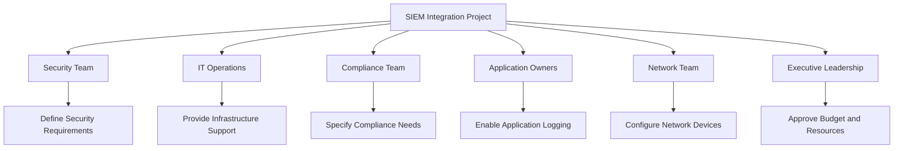
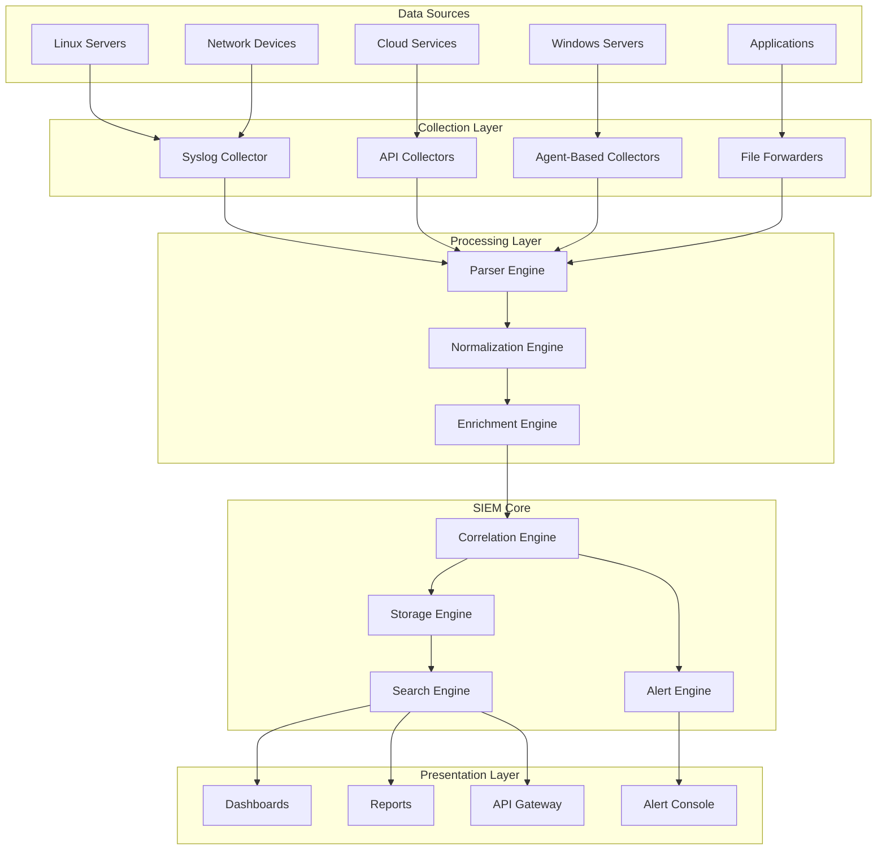
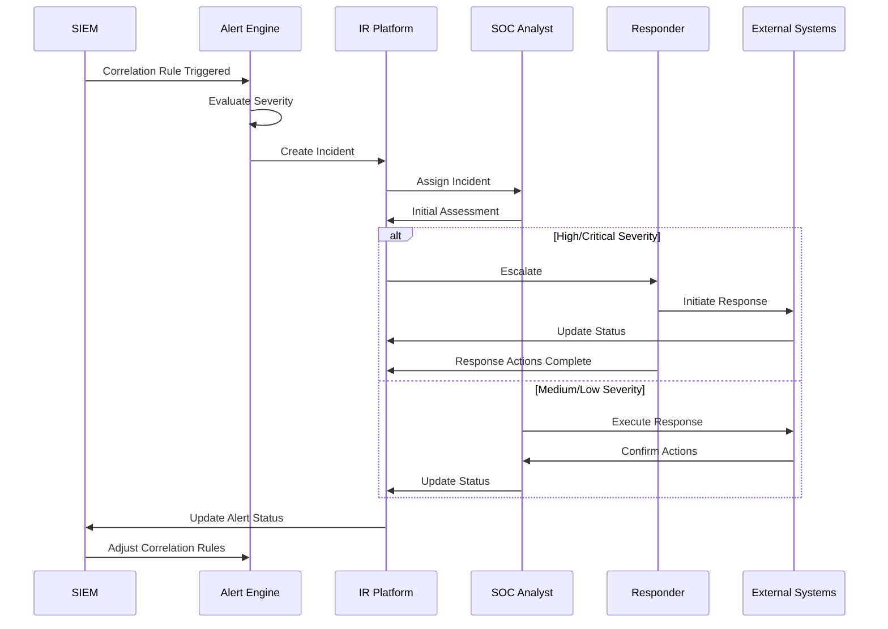

## Table of Contents
- [Executive Summary](#executive-summary)
- [Introduction to SIEM](#introduction-to-siem)
- [Pre-Integration Planning](#pre-integration-planning)
- [Data Source Identification](#data-source-identification)
- [Integration Architecture](#integration-architecture)
- [Implementation Process](#implementation-process)
- [Configuration Templates](#configuration-templates)
- [Log Collection Methods](#log-collection-methods)
- [Correlation Rules](#correlation-rules)
- [Alert Management](#alert-management)
- [Dashboard Design](#dashboard-design)
- [Incident Response Integration](#incident-response-integration)
- [Performance Tuning](#performance-tuning)
- [Compliance Mapping](#compliance-mapping)
- [Maintenance and Operations](#maintenance-and-operations)
- [Troubleshooting Guide](#troubleshooting-guide)
- [Security Best Practices](#security-best-practices)
- [Automation Opportunities](#automation-opportunities)
- [Reporting and Metrics](#reporting-and-metrics)
- [Future Enhancements](#future-enhancements)

## Executive Summary

This comprehensive guide provides detailed instructions and best practices for integrating Security Information and Event Management (SIEM) systems within an enterprise environment. It is designed to enable AI agents and security professionals to implement, configure, and optimize SIEM solutions for effective threat detection, incident response, and compliance requirements.

### Key Objectives
- Establish centralized security event monitoring
- Enable real-time threat detection and alerting
- Facilitate forensic investigation capabilities
- Support compliance and audit requirements
- Provide actionable security intelligence

### Critical Success Factors
1. Complete data source coverage
2. Optimized correlation rules
3. Low false positive rates
4. Rapid incident response capability
5. Comprehensive reporting mechanisms

## Introduction to SIEM

### What is SIEM?
Security Information and Event Management (SIEM) is a comprehensive security solution that provides real-time analysis of security alerts generated by network hardware and applications. It collects, analyzes, and correlates log data from multiple sources to detect security threats, ensure compliance, and support incident response.

### Core Components
1. **Log Collection**: Gathering data from various sources
2. **Data Normalization**: Converting diverse log formats into a common schema
3. **Event Correlation**: Identifying patterns and relationships between events
4. **Alert Generation**: Creating notifications for security incidents
5. **Reporting**: Producing compliance and security reports
6. **Storage Management**: Archiving and retrieving historical data

### Common SIEM Platforms
- **Microsoft Sentinel**: Cloud-native SIEM with AI-driven security analytics
- **Splunk Enterprise Security**: Comprehensive SIEM with advanced analytics
- **IBM QRadar**: Enterprise SIEM with cognitive capabilities
- **Elastic Security**: Open-source SIEM built on Elastic Stack
- **ArcSight**: Traditional enterprise SIEM solution

## Pre-Integration Planning

### Requirements Assessment
```yaml
assessment_checklist:
  business_requirements:
    - compliance_standards:
        - GDPR
        - HIPAA
        - SOC2
        - PCI-DSS
    - data_retention_policies:
        min_retention: \"90 days\"
        max_retention: \"7 years\"
    - reporting_requirements:
        - daily_security_reports
        - monthly_compliance_reports
        - quarterly_risk_assessments
  
  technical_requirements:
    - log_volume_estimation: \"10 GB/day\"
    - peak_events_per_second: \"5000 EPS\"
    - storage_requirements: \"5 TB minimum\"
    - network_bandwidth: \"100 Mbps dedicated\"
    - processing_power: \"16 vCPUs, 64GB RAM\"
  
  integration_scope:
    - network_devices: [\"firewalls\", \"switches\", \"routers\"]
    - servers: [\"windows\", \"linux\", \"unix\"]
    - applications: [\"web_servers\", \"databases\", \"custom_apps\"]
    - cloud_services: [\"azure\", \"aws\", \"office365\"]
    - security_tools: [\"antivirus\", \"ids\", \"dlp\"]
```

### Stakeholder Mapping


### Risk Assessment
```json
{
  \"integration_risks\": [
    {
      \"risk\": \"Data Loss During Migration\",
      \"impact\": \"High\",
      \"likelihood\": \"Medium\",
      \"mitigation\": \"Implement parallel collection during transition\"
    },
    {
      \"risk\": \"Performance Degradation\",
      \"impact\": \"Medium\",
      \"likelihood\": \"High\",
      \"mitigation\": \"Gradual rollout with performance monitoring\"
    },
    {
      \"risk\": \"False Positive Overload\",
      \"impact\": \"High\",
      \"likelihood\": \"High\",
      \"mitigation\": \"Phased correlation rule implementation with tuning\"
    },
    {
      \"risk\": \"Compliance Gaps\",
      \"impact\": \"High\",
      \"likelihood\": \"Low\",
      \"mitigation\": \"Map all compliance requirements before go-live\"
    }
  ]
}
```

## Data Source Identification

### Critical Data Sources Matrix
```yaml
priority_1_sources:
  windows_systems:
    event_types:
      - security_logs
      - system_logs
      - application_logs
    collection_method: \"Windows Event Forwarding\"
    volume_estimate: \"2GB/day\"
    compliance_mapping: [\"SOC2\", \"HIPAA\"]
  
  network_firewalls:
    vendors: [\"Palo Alto\", \"Fortinet\", \"Checkpoint\"]
    log_types:
      - traffic_logs
      - threat_logs
      - system_logs
    collection_method: \"Syslog\"
    volume_estimate: \"3GB/day\"
    compliance_mapping: [\"PCI-DSS\", \"SOC2\"]

priority_2_sources:
  cloud_platforms:
    azure:
      services:
        - azure_ad
        - storage_accounts
        - virtual_machines
      collection_method: \"Azure Event Hub\"
      volume_estimate: \"1GB/day\"
    
    aws:
      services:
        - cloudtrail
        - vpc_flow_logs
        - security_hub
      collection_method: \"S3 Bucket\"
      volume_estimate: \"500MB/day\"

priority_3_sources:
  applications:
    web_servers:
      types: [\"IIS\", \"Apache\", \"Nginx\"]
      log_formats: [\"W3C\", \"Combined\", \"JSON\"]
      collection_method: \"File Forwarder\"
      volume_estimate: \"2GB/day\"
    
    databases:
      types: [\"SQL Server\", \"Oracle\", \"PostgreSQL\"]
      audit_types: [\"login\", \"query\", \"schema_change\"]
      collection_method: \"Database Connector\"
      volume_estimate: \"1GB/day\"
```

### Log Format Standards
```json
{
  \"normalized_event_schema\": {
    \"timestamp\": \"2024-01-15T10:30:45.123Z\",
    \"source_ip\": \"192.168.1.100\",
    \"destination_ip\": \"10.0.0.5\",
    \"source_port\": 54321,
    \"destination_port\": 443,
    \"protocol\": \"TCP\",
    \"action\": \"ALLOW\",
    \"user\": \"john.doe@company.com\",
    \"device_hostname\": \"WS-JD-001\",
    \"event_type\": \"authentication\",
    \"severity\": \"INFO\",
    \"message\": \"Successful login\",
    \"raw_event\": \"Original log entry here\"
  }
}
```

## Integration Architecture

### High-Level Architecture


### Network Connectivity Requirements
```yaml
network_requirements:
  collector_to_sources:
    protocols: [\"TCP/514\", \"TCP/6514\", \"HTTPS/443\"]
    bandwidth: \"50 Mbps minimum\"
    latency: \"< 100ms\"
    
  collector_to_siem:
    protocols: [\"TCP/9997\", \"HTTPS/443\"]
    bandwidth: \"100 Mbps minimum\"
    latency: \"< 50ms\"
    encryption: \"TLS 1.2 minimum\"
    
  siem_to_users:
    protocols: [\"HTTPS/443\"]
    bandwidth: \"10 Mbps per concurrent user\"
    latency: \"< 200ms\"
    
  firewall_rules:
    - source: \"Log Collectors\"
      destination: \"SIEM Core\"
      ports: [\"TCP/9997\", \"TCP/443\"]
      action: \"ALLOW\"
    - source: \"Data Sources\"
      destination: \"Log Collectors\"
      ports: [\"TCP/514\", \"TCP/6514\"]
      action: \"ALLOW\"
```

## Implementation Process

### Phase 1: Infrastructure Setup
```bash
# 1. Deploy SIEM Infrastructure
## For Microsoft Sentinel
az sentinel onboard --resource-group SecurityOps \\
  --workspace-name CentralSIEM \\
  --subscription-id $SUBSCRIPTION_ID

## For Splunk
./splunk add index security -auth admin:password
./splunk add index compliance -auth admin:password
./splunk add index audit -auth admin:password

# 2. Configure Storage
## Calculate storage requirements
storage_calc() {
  daily_volume=$1
  retention_days=$2
  compression_ratio=0.1
  
  total_storage=$(echo \"$daily_volume * $retention_days * $compression_ratio\" | bc)
  echo \"Required storage: ${total_storage}GB\"
}

# 3. Set up collectors
## Deploy Syslog collector
docker run -d --name syslog-collector \\
  -p 514:514/tcp -p 514:514/udp \\
  -v /opt/siem/logs:/var/log/syslog \\
  siem/syslog-collector:latest
```

### Phase 2: Data Source Integration
```python
# Integration script for Windows Event Logs
import win32evtlog
import json
import requests
from datetime import datetime

class WindowsEventCollector:
    def __init__(self, siem_endpoint, api_key):
        self.siem_endpoint = siem_endpoint
        self.api_key = api_key
        self.server = 'localhost'
        self.log_types = ['Security', 'System', 'Application']
    
    def collect_events(self):
        for log_type in self.log_types:
            hand = win32evtlog.OpenEventLog(self.server, log_type)
            flags = win32evtlog.EVENTLOG_BACKWARDS_READ | \\
                    win32evtlog.EVENTLOG_SEQUENTIAL_READ
            
            events = []
            events_retrieved = True
            
            while events_retrieved:
                events_retrieved = win32evtlog.ReadEventLog(
                    hand, flags, 0)
                
                for event in events_retrieved:
                    event_data = self.parse_event(event, log_type)
                    self.send_to_siem(event_data)
            
            win32evtlog.CloseEventLog(hand)
    
    def parse_event(self, event, log_type):
        return {
            'timestamp': event.TimeGenerated.Format(),
            'event_id': event.EventID,
            'source': event.SourceName,
            'log_type': log_type,
            'level': event.EventType,
            'message': event.StringInserts,
            'computer': event.ComputerName
        }
    
    def send_to_siem(self, event_data):
        headers = {
            'Authorization': f'Bearer {self.api_key}',
            'Content-Type': 'application/json'
        }
        
        response = requests.post(
            self.siem_endpoint,
            headers=headers,
            data=json.dumps(event_data)
        )
        
        if response.status_code != 200:
            print(f\"Failed to send event: {response.text}\")

# Initialize and run collector
collector = WindowsEventCollector(
    siem_endpoint='https://siem.company.com/api/events',
    api_key='your-api-key-here'
)
collector.collect_events()
```

### Phase 3: Parser Configuration
```yaml
parser_configurations:
  windows_security_parser:
    log_source: \"Windows Security\"
    patterns:
      - pattern: \"EventID=(?<event_id>\\d+).*Account Name:\\s+(?<username>[^\\s]+)\"
        fields:
          event_id: integer
          username: string
      - pattern: \"Source Address:\\s+(?<source_ip>\\d+\\.\\d+\\.\\d+\\.\\d+)\"
        fields:
          source_ip: ip_address
    
    field_mappings:
      timestamp: \"_time\"
      host: \"ComputerName\"
      user: \"TargetUserName\"
      source_ip: \"IpAddress\"
    
    enrichments:
      - type: \"geoip\"
        field: \"source_ip\"
        target: \"geo_location\"
      - type: \"user_lookup\"
        field: \"username\"
        target: \"user_details\"
```

### Phase 4: Correlation Rule Development
```json
{
  \"correlation_rules\": [
    {
      \"rule_name\": \"Multiple Failed Login Attempts\",
      \"description\": \"Detect brute force attacks\",
      \"conditions\": {
        \"event_type\": \"authentication_failure\",
        \"threshold\": 5,
        \"time_window\": \"5 minutes\",
        \"group_by\": [\"source_ip\", \"target_user\"]
      },
      \"actions\": {
        \"severity\": \"HIGH\",
        \"alert\": true,
        \"notify\": [\"security-team@company.com\"],
        \"automated_response\": \"block_ip_temporarily\"
      }
    },
    {
      \"rule_name\": \"Privilege Escalation Detection\",
      \"description\": \"Detect unauthorized privilege changes\",
      \"sequence\": [
        {
          \"event\": \"successful_login\",
          \"user_type\": \"standard_user\"
        },
        {
          \"event\": \"privilege_change\",
          \"new_privilege\": \"administrator\",
          \"time_constraint\": \"within 30 minutes\"
        }
      ],
      \"actions\": {
        \"severity\": \"CRITICAL\",
        \"alert\": true,
        \"notify\": [\"security-team@company.com\", \"it-admin@company.com\"],
        \"automated_response\": \"disable_account\"
      }
    }
  ]
}
```

## Configuration Templates

### Microsoft Sentinel Configuration
```json
{
  \"data_connectors\": {
    \"azure_active_directory\": {
      \"enabled\": true,
      \"sign_in_logs\": true,
      \"audit_logs\": true,
      \"provisioning_logs\": true,
      \"risky_users\": true
    },
    \"microsoft_365\": {
      \"enabled\": true,
      \"exchange\": true,
      \"sharepoint\": true,
      \"teams\": true,
      \"power_bi\": true
    },
    \"azure_activity\": {
      \"enabled\": true,
      \"subscription_ids\": [\"sub-id-1\", \"sub-id-2\"]
    },
    \"threat_intelligence\": {
      \"enabled\": true,
      \"providers\": [\"Microsoft\", \"Recorded Future\", \"Anomali\"]
    }
  },
  \"analytics_rules\": {
    \"suspicious_login_activity\": {
      \"query\": \"SigninLogs | where ResultType != 0 | summarize count() by UserPrincipalName, IPAddress | where count_ > 5\",
      \"frequency\": \"PT5M\",
      \"period\": \"PT15M\",
      \"severity\": \"High\"
    }
  }
}
```

### Splunk Configuration
```conf
# inputs.conf
[tcp://514]
sourcetype = syslog
connection_host = ip

[monitor:///var/log/secure]
sourcetype = linux_secure
index = security

[WinEventLog://Security]
disabled = 0
index = wineventlog
sourcetype = WinEventLog:Security

# props.conf
[syslog]
SHOULD_LINEMERGE = false
LINE_BREAKER = ([\\r\
]+)
TRUNCATE = 10000
TIME_PREFIX = ^
TIME_FORMAT = %b %d %H:%M:%S
MAX_TIMESTAMP_LOOKAHEAD = 32

# transforms.conf
[syslog_host]
REGEX = ^(?:\\w{3}\\s+\\d{1,2}\\s+\\d{2}:\\d{2}:\\d{2}\\s+)?(?<host>[^\\s]+)
FORMAT = host::$1
DEST_KEY = MetaData:Host
```

### Log Forwarding Configuration
```yaml
log_forwarders:
  rsyslog_configuration: |
    # /etc/rsyslog.conf
    # Forward to SIEM
    *.* @@siem.company.com:514
    
    # TLS Configuration
    $DefaultNetstreamDriver gtls
    $DefaultNetstreamDriverCAFile /etc/ssl/certs/ca-bundle.crt
    $ActionSendStreamDriverAuthMode x509/name
    $ActionSendStreamDriverPermittedPeer siem.company.com
    $ActionSendStreamDriverMode 1
    
    # Buffer for reliability
    $ActionQueueType LinkedList
    $ActionQueueFileName fwdRule1
    $ActionResumeRetryCount -1
    $ActionQueueSaveOnShutdown on
    
  nxlog_configuration: |
    # nxlog.conf
    <Extension _syslog>
        Module xm_syslog
    </Extension>
    
    <Input in_eventlog>
        Module im_msvistalog
        <QueryXML>
            <QueryList>
                <Query Id=\"0\">
                    <Select Path=\"Security\">*</Select>
                    <Select Path=\"System\">*</Select>
                    <Select Path=\"Application\">*</Select>
                </Query>
            </QueryList>
        </QueryXML>
    </Input>
    
    <Output out_siem>
        Module om_tcp
        Host siem.company.com
        Port 514
        Exec to_syslog_bsd();
    </Output>
    
    <Route eventlog_to_siem>
        Path in_eventlog => out_siem
    </Route>
```

## Log Collection Methods

### Agent-Based Collection
```python
# Universal SIEM Agent
import os
import time
import json
import socket
import hashlib
from watchdog.observers import Observer
from watchdog.events import FileSystemEventHandler

class SIEMAgent:
    def __init__(self, config_file):
        with open(config_file, 'r') as f:
            self.config = json.load(f)
        
        self.siem_host = self.config['siem_host']
        self.siem_port = self.config['siem_port']
        self.monitored_paths = self.config['monitored_paths']
        self.hostname = socket.gethostname()
        
    def send_event(self, event_data):
        \"\"\"Send event to SIEM\"\"\"
        try:
            sock = socket.socket(socket.AF_INET, socket.SOCK_STREAM)
            sock.connect((self.siem_host, self.siem_port))
            
            event_json = json.dumps({
                'timestamp': time.time(),
                'hostname': self.hostname,
                'agent_version': '1.0.0',
                'event': event_data
            })
            
            sock.send(event_json.encode('utf-8'))
            sock.close()
        except Exception as e:
            print(f\"Failed to send event: {e}\")
    
    def monitor_files(self):
        \"\"\"Monitor file changes\"\"\"
        event_handler = FileEventHandler(self)
        observer = Observer()
        
        for path in self.monitored_paths:
            observer.schedule(event_handler, path, recursive=True)
        
        observer.start()
        try:
            while True:
                time.sleep(1)
        except KeyboardInterrupt:
            observer.stop()
        observer.join()

class FileEventHandler(FileSystemEventHandler):
    def __init__(self, agent):
        self.agent = agent
        
    def on_modified(self, event):
        if not event.is_directory:
            self.agent.send_event({
                'event_type': 'file_modified',
                'file_path': event.src_path,
                'timestamp': time.time()
            })
    
    def on_created(self, event):
        if not event.is_directory:
            self.agent.send_event({
                'event_type': 'file_created',
                'file_path': event.src_path,
                'timestamp': time.time()
            })
```

### Agentless Collection
```bash
#!/bin/bash
# Agentless collection script for Linux systems

SIEM_HOST=\"siem.company.com\"
SIEM_PORT=\"514\"
FACILITY=\"local0\"
PRIORITY=\"info\"

# Function to send syslog message
send_syslog() {
    local message=$1
    local timestamp=$(date '+%b %d %H:%M:%S')
    local hostname=$(hostname)
    
    echo \"<$((16*8+6))>$timestamp $hostname $message\" | \\
    nc -w1 -u $SIEM_HOST $SIEM_PORT
}

# Collect system information
collect_system_info() {
    # CPU usage
    cpu_usage=$(top -bn1 | grep \"Cpu(s)\" | \\
               sed \"s/.*, *\\([0-9.]*\\)%* id.*/\\1/\" | \\
               awk '{print 100 - $1}')
    send_syslog \"SYSTEM: cpu_usage=$cpu_usage\"
    
    # Memory usage
    memory_info=$(free -m | awk 'NR==2{printf \"%.2f\", $3*100/$2}')
    send_syslog \"SYSTEM: memory_usage=$memory_info\"
    
    # Disk usage
    df -h | grep -vE '^Filesystem|tmpfs|cdrom' | \\
    awk '{print $5 \" \" $1}' | while read output;
    do
        disk_usage=$(echo $output | awk '{print $1}' | cut -d'%' -f1)
        partition=$(echo $output | awk '{print $2}')
        send_syslog \"SYSTEM: disk_usage=$disk_usage partition=$partition\"
    done
    
    # Login attempts
    last_logins=$(last -n 5 | head -5)
    send_syslog \"SECURITY: recent_logins=$last_logins\"
}

# Main loop
while true; do
    collect_system_info
    sleep 300  # Run every 5 minutes
done
```

### API-Based Collection
```python
# Cloud service log collector
import requests
import json
from datetime import datetime, timedelta
import boto3
import azure.identity
from azure.monitor.query import LogsQueryClient

class CloudLogCollector:
    def __init__(self, siem_endpoint, api_key):
        self.siem_endpoint = siem_endpoint
        self.api_key = api_key
        self.last_collected = datetime.now() - timedelta(minutes=5)
    
    def collect_aws_logs(self, aws_config):
        \"\"\"Collect AWS CloudTrail logs\"\"\"
        cloudtrail = boto3.client(
            'cloudtrail',
            aws_access_key_id=aws_config['access_key'],
            aws_secret_access_key=aws_config['secret_key'],
            region_name=aws_config['region']
        )
        
        events = cloudtrail.lookup_events(
            StartTime=self.last_collected,
            EndTime=datetime.now()
        )
        
        for event in events['Events']:
            self.send_to_siem({
                'source': 'aws_cloudtrail',
                'timestamp': event['EventTime'].isoformat(),
                'event_name': event['EventName'],
                'user': event.get('Username', 'Unknown'),
                'source_ip': event.get('SourceIPAddress'),
                'resources': event.get('Resources', []),
                'raw_event': json.dumps(event)
            })
    
    def collect_azure_logs(self, azure_config):
        \"\"\"Collect Azure Activity logs\"\"\"
        credential = azure.identity.DefaultAzureCredential()
        logs_client = LogsQueryClient(credential)
        
        query = \"\"\"
        AzureActivity
        | where TimeGenerated > ago(5m)
        | project TimeGenerated, OperationName, Caller, 
                  CallerIpAddress, ResourceGroup, SubscriptionId
        \"\"\"
        
        response = logs_client.query_workspace(
            workspace_id=azure_config['workspace_id'],
            query=query,
            timespan=timedelta(minutes=5)
        )
        
        for row in response.tables[0].rows:
            self.send_to_siem({
                'source': 'azure_activity',
                'timestamp': row[0].isoformat(),
                'operation': row[1],
                'user': row[2],
                'source_ip': row[3],
                'resource_group': row[4],
                'subscription': row[5]
            })
    
    def send_to_siem(self, event_data):
        \"\"\"Send normalized event to SIEM\"\"\"
        headers = {
            'Authorization': f'Bearer {self.api_key}',
            'Content-Type': 'application/json'
        }
        
        response = requests.post(
            self.siem_endpoint,
            headers=headers,
            json=event_data
        )
        
        if response.status_code != 200:
            print(f\"Failed to send event: {response.text}\")
        
        self.last_collected = datetime.now()
```

## Correlation Rules

### Basic Correlation Templates
```yaml
correlation_rule_templates:
  brute_force_detection:
    name: \"Brute Force Attack Detection\"
    description: \"Identifies multiple failed login attempts from same source\"
    logic: |
      search index=security EventID=4625
      | stats count by src_ip, user
      | where count > 5
      | eval threat_score = count * 10
      | table src_ip, user, count, threat_score
    threshold: 5
    time_window: \"5m\"
    severity: \"HIGH\"
    
  lateral_movement_detection:
    name: \"Lateral Movement Detection\"
    description: \"Detects potential lateral movement patterns\"
    logic: |
      search index=security EventID IN (4624, 4648, 4776)
      | transaction src_ip maxspan=1h
      | where eventcount > 3 AND dc(dest_ip) > 2
      | eval risk_score = eventcount * dc(dest_ip)
      | table src_ip, dest_ip, user, risk_score
    severity: \"CRITICAL\"
    
  data_exfiltration_detection:
    name: \"Potential Data Exfiltration\"
    description: \"Identifies unusual data transfer patterns\"
    logic: |
      search index=network action=allowed
      | eval bytes_out_mb = bytes_out/1024/1024
      | stats sum(bytes_out_mb) as total_mb by src_ip, dest_ip
      | where total_mb > 1000
      | join src_ip [search index=security | stats values(user) as user by src_ip]
      | table src_ip, dest_ip, user, total_mb
    threshold: \"1000 MB\"
    time_window: \"1h\"
    severity: \"HIGH\"
```

### Advanced Correlation Patterns
```python
# Advanced correlation engine
import pandas as pd
import numpy as np
from sklearn.ensemble import IsolationForest
from datetime import datetime, timedelta

class AdvancedCorrelationEngine:
    def __init__(self, siem_connection):
        self.siem = siem_connection
        self.models = {}
        self.baselines = {}
    
    def establish_baseline(self, entity, metric, window_days=30):
        \"\"\"Establish normal behavior baseline\"\"\"
        query = f\"\"\"
        search index=* entity={entity} metric={metric}
        | bucket _time span=1h
        | stats avg(value) as avg_value, stdev(value) as stdev_value by _time
        | where _time > relative_time(now(), \"-{window_days}d\")
        \"\"\"
        
        results = self.siem.search(query)
        df = pd.DataFrame(results)
        
        self.baselines[f\"{entity}_{metric}\"] = {
            'mean': df['avg_value'].mean(),
            'std': df['stdev_value'].mean(),
            'upper_bound': df['avg_value'].mean() + (3 * df['stdev_value'].mean()),
            'lower_bound': df['avg_value'].mean() - (3 * df['stdev_value'].mean())
        }
    
    def detect_anomalies(self, entity, metric, current_value):
        \"\"\"Detect anomalies based on baselines\"\"\"
        baseline_key = f\"{entity}_{metric}\"
        
        if baseline_key not in self.baselines:
            self.establish_baseline(entity, metric)
        
        baseline = self.baselines[baseline_key]
        
        if current_value > baseline['upper_bound'] or \\
           current_value < baseline['lower_bound']:
            deviation = abs(current_value - baseline['mean']) / baseline['std']
            return {
                'anomaly': True,
                'severity': self.calculate_severity(deviation),
                'deviation': deviation,
                'current_value': current_value,
                'expected_range': (baseline['lower_bound'], baseline['upper_bound'])
            }
        
        return {'anomaly': False}
    
    def calculate_severity(self, deviation):
        \"\"\"Calculate severity based on deviation\"\"\"
        if deviation > 5:
            return 'CRITICAL'
        elif deviation > 3:
            return 'HIGH'
        elif deviation > 2:
            return 'MEDIUM'
        else:
            return 'LOW'
    
    def behavioral_correlation(self, user, time_window='1h'):
        \"\"\"Correlate user behavior patterns\"\"\"
        query = f\"\"\"
        search index=* user={user}
        | bucket _time span=5m
        | stats count by _time, event_type, src_ip, dest_ip
        | where _time > relative_time(now(), \"-{time_window}\")
        \"\"\"
        
        results = self.siem.search(query)
        df = pd.DataFrame(results)
        
        # Analyze behavior patterns
        patterns = {
            'login_locations': df['src_ip'].nunique(),
            'accessed_systems': df['dest_ip'].nunique(),
            'event_velocity': len(df) / (60 if time_window == '1h' else 1440),
            'unusual_events': self.detect_unusual_events(df, user)
        }
        
        risk_score = self.calculate_risk_score(patterns)
        
        return {
            'user': user,
            'patterns': patterns,
            'risk_score': risk_score,
            'recommendations': self.generate_recommendations(patterns, risk_score)
        }
    
    def calculate_risk_score(self, patterns):
        \"\"\"Calculate overall risk score\"\"\"
        score = 0
        
        # Multiple login locations
        if patterns['login_locations'] > 3:
            score += 30
        
        # High number of accessed systems
        if patterns['accessed_systems'] > 10:
            score += 25
        
        # High event velocity
        if patterns['event_velocity'] > 100:
            score += 35
        
        # Unusual events detected
        score += patterns['unusual_events'] * 10
        
        return min(score, 100)  # Cap at 100
    
    def generate_recommendations(self, patterns, risk_score):
        \"\"\"Generate actionable recommendations\"\"\"
        recommendations = []
        
        if risk_score > 70:
            recommendations.append(\"IMMEDIATE: Disable user account pending investigation\")
            recommendations.append(\"IMMEDIATE: Force password reset\")
            recommendations.append(\"IMMEDIATE: Review all recent access logs\")
        elif risk_score > 50:
            recommendations.append(\"HIGH: Monitor user activity closely\")
            recommendations.append(\"HIGH: Verify with user about unusual activity\")
            recommendations.append(\"HIGH: Check for compromised credentials\")
        elif risk_score > 30:
            recommendations.append(\"MEDIUM: Review user permissions\")
            recommendations.append(\"MEDIUM: Verify login locations with user\")
        
        return recommendations
```

### Threat Hunting Queries
```sql
-- Advanced Threat Hunting Queries

-- 1. Detect PowerShell Empire Activity
SELECT 
    timestamp,
    hostname,
    user,
    process_commandline,
    parent_process
FROM 
    process_events
WHERE 
    process_name = 'powershell.exe'
    AND (
        process_commandline LIKE '%encodedCommand%'
        OR process_commandline LIKE '%-nop%'
        OR process_commandline LIKE '%-w hidden%'
        OR process_commandline LIKE '%bypass%'
    )
    AND timestamp > NOW() - INTERVAL 24 HOURS
ORDER BY 
    timestamp DESC;

-- 2. Identify Potential Ransomware Activity
SELECT 
    timestamp,
    hostname,
    user,
    COUNT(DISTINCT file_path) as files_modified,
    COUNT(DISTINCT file_extension) as unique_extensions
FROM 
    file_events
WHERE 
    event_type IN ('created', 'modified')
    AND file_extension IN ('.locked', '.encrypted', '.crypto', '.enc')
    AND timestamp > NOW() - INTERVAL 1 HOURS
GROUP BY 
    timestamp, hostname, user
HAVING 
    files_modified > 100
ORDER BY 
    files_modified DESC;

-- 3. Detect Suspicious Registry Persistence
SELECT 
    timestamp,
    hostname,
    user,
    registry_path,
    registry_value,
    process_name
FROM 
    registry_events
WHERE 
    event_type = 'value_set'
    AND (
        registry_path LIKE '%\\Run%'
        OR registry_path LIKE '%\\RunOnce%'
        OR registry_path LIKE '%\\Services%'
        OR registry_path LIKE '%\\Winlogon%'
    )
    AND process_name NOT IN ('regedit.exe', 'reg.exe', 'msiexec.exe')
    AND timestamp > NOW() - INTERVAL 7 DAYS
ORDER BY 
    timestamp DESC;

-- 4. Identify Command and Control Beaconing
WITH beacon_analysis AS (
    SELECT 
        src_ip,
        dest_ip,
        dest_port,
        COUNT(*) as connection_count,
        STDDEV(UNIX_TIMESTAMP(timestamp)) as time_variance,
        AVG(bytes_out) as avg_bytes_out
    FROM 
        network_connections
    WHERE 
        timestamp > NOW() - INTERVAL 4 HOURS
    GROUP BY 
        src_ip, dest_ip, dest_port
)
SELECT 
    *,
    CASE 
        WHEN time_variance < 60 AND connection_count > 20 THEN 'HIGH'
        WHEN time_variance < 300 AND connection_count > 10 THEN 'MEDIUM'
        ELSE 'LOW'
    END as beacon_probability
FROM 
    beacon_analysis
WHERE 
    connection_count > 10
    AND time_variance < 300
ORDER BY 
    beacon_probability DESC, connection_count DESC;
```

## Alert Management

### Alert Configuration Framework
```yaml
alert_framework:
  priority_levels:
    critical:
      response_time: \"5 minutes\"
      notification_channels: [\"pager\", \"email\", \"slack\", \"phone\"]
      escalation_path: [\"soc_analyst\", \"soc_lead\", \"ciso\"]
      auto_actions: [\"isolate_host\", \"block_ip\", \"disable_account\"]
    
    high:
      response_time: \"15 minutes\"
      notification_channels: [\"email\", \"slack\"]
      escalation_path: [\"soc_analyst\", \"soc_lead\"]
      auto_actions: [\"collect_evidence\", \"increase_monitoring\"]
    
    medium:
      response_time: \"1 hour\"
      notification_channels: [\"email\", \"dashboard\"]
      escalation_path: [\"soc_analyst\"]
      auto_actions: [\"log_ticket\", \"gather_context\"]
    
    low:
      response_time: \"4 hours\"
      notification_channels: [\"dashboard\"]
      escalation_path: [\"soc_analyst\"]
      auto_actions: [\"queue_for_review\"]

  alert_templates:
    security_incident:
      title: \"[PRIORITY] Security Incident Detected - {incident_type}\"
      body: |
        Incident ID: {incident_id}
        Time: {timestamp}
        Type: {incident_type}
        Severity: {severity}
        Affected Systems: {affected_systems}
        Source: {source_ip}
        User: {user}
        
        Description: {description}
        
        Recommended Actions:
        {recommended_actions}
        
        Investigation Link: {investigation_url}
      
    compliance_violation:
      title: \"Compliance Violation - {compliance_standard}\"
      body: |
        Violation ID: {violation_id}
        Standard: {compliance_standard}
        Requirement: {requirement}
        System: {system}
        
        Details: {violation_details}
        
        Remediation Steps:
        {remediation_steps}
        
        Deadline: {remediation_deadline}
```

### Alert Aggregation and Deduplication
```python
# Alert management system
import hashlib
import json
from datetime import datetime, timedelta
from collections import defaultdict

class AlertManager:
    def __init__(self, siem_connection):
        self.siem = siem_connection
        self.alert_cache = defaultdict(list)
        self.alert_patterns = {}
        self.suppression_rules = []
    
    def process_alert(self, alert):
        \"\"\"Process incoming alert with deduplication and aggregation\"\"\"
        alert_hash = self.generate_alert_hash(alert)
        
        # Check for duplicate
        if self.is_duplicate(alert_hash, alert):
            return self.handle_duplicate(alert_hash, alert)
        
        # Check suppression rules
        if self.should_suppress(alert):
            return self.handle_suppressed(alert)
        
        # Check for patterns
        pattern = self.detect_pattern(alert)
        if pattern:
            return self.handle_pattern(pattern, alert)
        
        # Process new alert
        return self.create_new_alert(alert)
    
    def generate_alert_hash(self, alert):
        \"\"\"Generate unique hash for alert deduplication\"\"\"
        key_fields = [
            alert.get('source_ip'),
            alert.get('dest_ip'),
            alert.get('event_type'),
            alert.get('user'),
            alert.get('severity')
        ]
        
        hash_string = '|'.join(str(f) for f in key_fields if f)
        return hashlib.md5(hash_string.encode()).hexdigest()
    
    def is_duplicate(self, alert_hash, alert):
        \"\"\"Check if alert is duplicate within time window\"\"\"
        time_window = timedelta(minutes=15)
        current_time = datetime.now()
        
        cached_alerts = self.alert_cache[alert_hash]
        for cached_alert in cached_alerts:
            if current_time - cached_alert['timestamp'] <= time_window:
                return True
        
        return False
    
    def handle_duplicate(self, alert_hash, alert):
        \"\"\"Handle duplicate alert\"\"\"
        self.alert_cache[alert_hash].append({
            'timestamp': datetime.now(),
            'alert': alert
        })
        
        # Update existing alert with occurrence count
        existing_alert_id = self.alert_cache[alert_hash][0]['alert']['id']
        self.siem.update_alert(existing_alert_id, {
            'occurrence_count': len(self.alert_cache[alert_hash]),
            'last_seen': datetime.now()
        })
        
        return {'status': 'duplicate', 'alert_id': existing_alert_id}
    
    def detect_pattern(self, alert):
        \"\"\"Detect alert patterns for aggregation\"\"\"
        patterns = {
            'brute_force': {
                'conditions': [
                    lambda a: a['event_type'] == 'authentication_failure',
                    lambda a: a.get('failure_count', 0) > 5
                ],
                'aggregation_key': 'source_ip',
                'time_window': timedelta(minutes=5)
            },
            'port_scan': {
                'conditions': [
                    lambda a: a['event_type'] == 'connection_attempt',
                    lambda a: a.get('unique_ports', 0) > 20
                ],
                'aggregation_key': 'source_ip',
                'time_window': timedelta(minutes=10)
            },
            'data_exfiltration': {
                'conditions': [
                    lambda a: a['event_type'] == 'large_data_transfer',
                    lambda a: a.get('bytes_transferred', 0) > 1000000000
                ],
                'aggregation_key': 'user',
                'time_window': timedelta(hours=1)
            }
        }
        
        for pattern_name, pattern_config in patterns.items():
            if all(condition(alert) for condition in pattern_config['conditions']):
                return {
                    'name': pattern_name,
                    'config': pattern_config
                }
        
        return None
    
    def handle_pattern(self, pattern, alert):
        \"\"\"Handle patterned alerts with aggregation\"\"\"
        pattern_key = f\"{pattern['name']}_{alert[pattern['config']['aggregation_key']]}\"
        
        if pattern_key not in self.alert_patterns:
            self.alert_patterns[pattern_key] = {
                'alerts': [],
                'first_seen': datetime.now(),
                'pattern': pattern
            }
        
        self.alert_patterns[pattern_key]['alerts'].append(alert)
        self.alert_patterns[pattern_key]['last_seen'] = datetime.now()
        
        # Create aggregated alert if threshold met
        if len(self.alert_patterns[pattern_key]['alerts']) >= 3:
            aggregated_alert = self.create_aggregated_alert(
                pattern_key,
                self.alert_patterns[pattern_key]
            )
            return self.create_new_alert(aggregated_alert)
        
        return {'status': 'aggregating', 'pattern': pattern['name']}
    
    def create_aggregated_alert(self, pattern_key, pattern_data):
        \"\"\"Create aggregated alert from pattern\"\"\"
        alerts = pattern_data['alerts']
        pattern = pattern_data['pattern']
        
        return {
            'type': 'aggregated',
            'pattern': pattern['name'],
            'severity': 'HIGH',
            'title': f\"Pattern Detected: {pattern['name']}\",
            'description': f\"Multiple related alerts detected: {len(alerts)} occurrences\",
            'affected_entities': [a[pattern['config']['aggregation_key']] for a in alerts],
            'time_range': {
                'start': pattern_data['first_seen'],
                'end': pattern_data['last_seen']
            },
            'individual_alerts': alerts
        }
```

### Alert Response Automation
```python
# Automated response system
import subprocess
import requests
from abc import ABC, abstractmethod

class ResponseAction(ABC):
    @abstractmethod
    def execute(self, alert_context):
        pass

class BlockIPAction(ResponseAction):
    def __init__(self, firewall_api):
        self.firewall_api = firewall_api
    
    def execute(self, alert_context):
        source_ip = alert_context.get('source_ip')
        duration = alert_context.get('block_duration', 3600)
        
        response = requests.post(
            f\"{self.firewall_api}/block\",
            json={
                'ip_address': source_ip,
                'duration': duration,
                'reason': f\"Alert ID: {alert_context['alert_id']}\"
            }
        )
        
        return {
            'action': 'block_ip',
            'status': 'success' if response.status_code == 200 else 'failed',
            'details': response.json()
        }

class DisableAccountAction(ResponseAction):
    def __init__(self, identity_api):
        self.identity_api = identity_api
    
    def execute(self, alert_context):
        username = alert_context.get('user')
        
        response = requests.post(
            f\"{self.identity_api}/users/{username}/disable\",
            json={
                'reason': f\"Security Alert: {alert_context['alert_id']}\",
                'disabled_by': 'SIEM_Automation'
            }
        )
        
        return {
            'action': 'disable_account',
            'status': 'success' if response.status_code == 200 else 'failed',
            'user': username
        }

class IsolateHostAction(ResponseAction):
    def __init__(self, edr_api):
        self.edr_api = edr_api
    
    def execute(self, alert_context):
        hostname = alert_context.get('hostname')
        
        response = requests.post(
            f\"{self.edr_api}/hosts/{hostname}/isolate\",
            json={
                'reason': f\"Security Alert: {alert_context['alert_id']}\",
                'isolation_type': 'network'
            }
        )
        
        return {
            'action': 'isolate_host',
            'status': 'success' if response.status_code == 200 else 'failed',
            'hostname': hostname
        }

class CollectForensicsAction(ResponseAction):
    def __init__(self, forensics_api):
        self.forensics_api = forensics_api
    
    def execute(self, alert_context):
        hostname = alert_context.get('hostname')
        
        # Trigger forensic collection
        response = requests.post(
            f\"{self.forensics_api}/collect\",
            json={
                'hostname': hostname,
                'collection_type': 'memory_disk',
                'case_id': alert_context['alert_id']
            }
        )
        
        return {
            'action': 'collect_forensics',
            'status': 'initiated',
            'collection_id': response.json().get('collection_id')
        }

class AutomatedResponseOrchestrator:
    def __init__(self):
        self.actions = {
            'block_ip': BlockIPAction(firewall_api='https://firewall.company.com/api'),
            'disable_account': DisableAccountAction(identity_api='https://identity.company.com/api'),
            'isolate_host': IsolateHostAction(edr_api='https://edr.company.com/api'),
            'collect_forensics': CollectForensicsAction(forensics_api='https://forensics.company.com/api')
        }
        self.response_playbooks = self.load_playbooks()
    
    def load_playbooks(self):
        \"\"\"Load response playbooks\"\"\"
        return {
            'ransomware_detected': [
                'isolate_host',
                'disable_account',
                'collect_forensics',
                'block_ip'
            ],
            'brute_force_attack': [
                'block_ip',
                'disable_account'
            ],
            'data_exfiltration': [
                'disable_account',
                'isolate_host',
                'collect_forensics'
            ],
            'malware_detected': [
                'isolate_host',
                'collect_forensics'
            ]
        }
    
    def execute_playbook(self, alert):
        \"\"\"Execute automated response playbook\"\"\"
        alert_type = alert.get('type')
        severity = alert.get('severity')
        
        # Only execute for high severity alerts
        if severity not in ['HIGH', 'CRITICAL']:
            return {'status': 'skipped', 'reason': 'Low severity'}
        
        playbook = self.response_playbooks.get(alert_type, [])
        results = []
        
        for action_name in playbook:
            if action_name in self.actions:
                action = self.actions[action_name]
                try:
                    result = action.execute(alert)
                    results.append(result)
                    
                    # Log action
                    self.log_action(alert, action_name, result)
                    
                except Exception as e:
                    results.append({
                        'action': action_name,
                        'status': 'error',
                        'error': str(e)
                    })
        
        return {
            'playbook': alert_type,
            'actions_executed': len(results),
            'results': results
        }
    
    def log_action(self, alert, action_name, result):
        \"\"\"Log automated action for audit trail\"\"\"
        log_entry = {
            'timestamp': datetime.now().isoformat(),
            'alert_id': alert.get('alert_id'),
            'action': action_name,
            'result': result,
            'automated': True
        }
        
        # Send to SIEM for logging
        requests.post(
            'https://siem.company.com/api/automation_log',
            json=log_entry
        )
```

## Dashboard Design

### Executive Dashboard
```yaml
executive_dashboard:
  widgets:
    security_posture_score:
      type: \"gauge\"
      metrics:
        - \"overall_risk_score\"
        - \"compliance_score\"
        - \"vulnerability_score\"
      refresh_interval: \"5m\"
      thresholds:
        critical: 80
        warning: 60
        good: 40
    
    threat_landscape:
      type: \"heatmap\"
      dimensions:
        x_axis: \"threat_category\"
        y_axis: \"severity\"
      time_range: \"7d\"
      color_scheme: \"red_yellow_green\"
    
    critical_incidents:
      type: \"table\"
      columns:
        - \"incident_id\"
        - \"timestamp\"
        - \"type\"
        - \"status\"
        - \"assigned_to\"
      filters:
        severity: [\"CRITICAL\", \"HIGH\"]
        status: [\"OPEN\", \"IN_PROGRESS\"]
      sort: \"timestamp DESC\"
    
    kpi_metrics:
      type: \"metric_cards\"
      metrics:
        - name: \"MTTR\"
          query: \"avg(incident_response_time)\"
          format: \"duration\"
        - name: \"False Positive Rate\"
          query: \"false_positives / total_alerts * 100\"
          format: \"percentage\"
        - name: \"Coverage\"
          query: \"monitored_assets / total_assets * 100\"
          format: \"percentage\"
    
    compliance_status:
      type: \"stacked_bar\"
      categories: [\"GDPR\", \"HIPAA\", \"SOC2\", \"PCI-DSS\"]
      values: [\"compliant\", \"partial\", \"non_compliant\"]
      colors:
        compliant: \"green\"
        partial: \"yellow\"
        non_compliant: \"red\"
```

### SOC Analyst Dashboard
```json
{
  \"soc_analyst_dashboard\": {
    \"layout\": \"grid\",
    \"refresh_interval\": \"30s\",
    \"panels\": [
      {
        \"title\": \"Real-time Event Stream\",
        \"type\": \"event_stream\",
        \"query\": \"index=* | head 100 | reverse\",
        \"fields\": [\"_time\", \"source\", \"event_type\", \"user\", \"src_ip\"],
        \"position\": {\"x\": 0, \"y\": 0, \"w\": 12, \"h\": 4}
      },
      {
        \"title\": \"Active Incidents Queue\",
        \"type\": \"incident_queue\",
        \"filter\": {
          \"status\": [\"NEW\", \"ASSIGNED\"],
          \"assigned_to\": [\"current_user\", \"unassigned\"]
        },
        \"actions\": [\"assign\", \"escalate\", \"close\"],
        \"position\": {\"x\": 0, \"y\": 4, \"w\": 6, \"h\": 4}
      },
      {
        \"title\": \"Threat Intelligence Feed\",
        \"type\": \"threat_feed\",
        \"sources\": [\"recorded_future\", \"alienvault\", \"internal\"],
        \"relevance_threshold\": 0.7,
        \"position\": {\"x\": 6, \"y\": 4, \"w\": 6, \"h\": 4}
      },
      {
        \"title\": \"Investigation Workspace\",
        \"type\": \"investigation_panel\",
        \"tools\": [
          \"query_builder\",
          \"timeline_analysis\",
          \"entity_explorer\",
          \"case_notes\"
        ],
        \"position\": {\"x\": 0, \"y\": 8, \"w\": 12, \"h\": 6}
      }
    ]
  }
}
```

### Compliance Dashboard
```yaml
compliance_dashboard:
  data_sources:
    - audit_logs
    - configuration_assessments
    - vulnerability_scans
    - access_reviews
  
  visualizations:
    compliance_timeline:
      type: \"timeline_chart\"
      events:
        - \"audit_completed\"
        - \"violation_detected\"
        - \"remediation_completed\"
      time_range: \"90d\"
    
    control_effectiveness:
      type: \"radar_chart\"
      dimensions:
        - \"access_control\"
        - \"data_protection\"
        - \"incident_response\"
        - \"vulnerability_management\"
        - \"security_awareness\"
      scale: \"0-100\"
    
    evidence_collection:
      type: \"progress_bars\"
      categories:
        - name: \"Log Retention\"
          current: \"query: count(logs) where age < retention_requirement\"
          target: \"retention_requirement\"
        - name: \"Access Reviews\"
          current: \"completed_reviews\"
          target: \"total_required_reviews\"
        - name: \"Security Training\"
          current: \"trained_users\"
          target: \"total_users\"
    
    gap_analysis:
      type: \"matrix\"
      rows: \"compliance_requirements\"
      columns: \"implementation_status\"
      values: [\"implemented\", \"partial\", \"missing\"]
      drill_down: true
```

### Custom Dashboard Creation
```python
# Dashboard builder class
import json
from datetime import datetime, timedelta

class DashboardBuilder:
    def __init__(self, siem_api):
        self.siem_api = siem_api
        self.widgets = []
        self.layout = {\"type\": \"grid\", \"columns\": 12}
    
    def add_widget(self, widget_config):
        \"\"\"Add widget to dashboard\"\"\"
        widget = {
            \"id\": f\"widget_{len(self.widgets)}\",
            \"type\": widget_config[\"type\"],
            \"title\": widget_config[\"title\"],
            \"query\": widget_config.get(\"query\"),
            \"visualization\": widget_config.get(\"visualization\"),
            \"position\": widget_config.get(\"position\", {\"x\": 0, \"y\": 0, \"w\": 6, \"h\": 4}),
            \"refresh_interval\": widget_config.get(\"refresh_interval\", \"5m\")
        }
        
        self.widgets.append(widget)
        return self
    
    def create_threat_overview_widget(self):
        \"\"\"Create threat overview widget\"\"\"
        widget_config = {
            \"type\": \"multi_metric\",
            \"title\": \"Threat Overview\",
            \"queries\": {
                \"critical_threats\": \"\"\"
                    search index=security severity=CRITICAL
                    | stats count as critical_count
                \"\"\",
                \"high_threats\": \"\"\"
                    search index=security severity=HIGH
                    | stats count as high_count
                \"\"\",
                \"blocked_attacks\": \"\"\"
                    search index=firewall action=blocked
                    | stats count as blocked_count
                \"\"\"
            },
            \"visualization\": \"metric_cards\",
            \"position\": {\"x\": 0, \"y\": 0, \"w\": 12, \"h\": 2}
        }
        
        return self.add_widget(widget_config)
    
    def create_geographic_threat_map(self):
        \"\"\"Create geographic threat visualization\"\"\"
        widget_config = {
            \"type\": \"geo_map\",
            \"title\": \"Global Threat Activity\",
            \"query\": \"\"\"
                search index=* src_ip=*
                | iplocation src_ip
                | stats count by Country, lat, lon
                | where Country != \"Private\"
            \"\"\",
            \"visualization\": {
                \"type\": \"heat_map\",
                \"zoom_level\": 2,
                \"center\": [0, 0]
            },
            \"position\": {\"x\": 0, \"y\": 2, \"w\": 8, \"h\": 6}
        }
        
        return self.add_widget(widget_config)
    
    def create_user_behavior_analytics(self):
        \"\"\"Create user behavior analytics widget\"\"\"
        widget_config = {
            \"type\": \"behavior_analytics\",
            \"title\": \"User Risk Scores\",
            \"query\": \"\"\"
                search index=* user=*
                | eval risk_score = case(
                    failed_login > 5, 50,
                    unusual_location=\"true\", 30,
                    after_hours=\"true\", 20,
                    1=1, 0
                )
                | stats sum(risk_score) as total_risk by user
                | where total_risk > 50
                | sort -total_risk
            \"\"\",
            \"visualization\": {
                \"type\": \"bar_chart\",
                \"orientation\": \"horizontal\",
                \"color_scale\": \"risk_gradient\"
            },
            \"position\": {\"x\": 8, \"y\": 2, \"w\": 4, \"h\": 6}
        }
        
        return self.add_widget(widget_config)
    
    def create_compliance_tracker(self):
        \"\"\"Create compliance tracking widget\"\"\"
        widget_config = {
            \"type\": \"compliance_matrix\",
            \"title\": \"Compliance Status\",
            \"data_source\": \"compliance_assessments\",
            \"dimensions\": {
                \"rows\": [\"GDPR\", \"HIPAA\", \"SOC2\", \"PCI-DSS\"],
                \"columns\": [\"Q1\", \"Q2\", \"Q3\", \"Q4\"]
            },
            \"visualization\": {
                \"type\": \"heatmap\",
                \"colors\": {
                    \"compliant\": \"green\",
                    \"partial\": \"yellow\",
                    \"non_compliant\": \"red\"
                }
            },
            \"position\": {\"x\": 0, \"y\": 8, \"w\": 6, \"h\": 4}
        }
        
        return self.add_widget(widget_config)
    
    def build(self):
        \"\"\"Build final dashboard configuration\"\"\"
        return {
            \"name\": self.dashboard_name,
            \"description\": self.description,
            \"layout\": self.layout,
            \"widgets\": self.widgets,
            \"created_at\": datetime.now().isoformat(),
            \"permissions\": self.permissions
        }
    
    def deploy(self):
        \"\"\"Deploy dashboard to SIEM\"\"\"
        dashboard_config = self.build()
        
        response = self.siem_api.post(
            \"/dashboards\",
            json=dashboard_config
        )
        
        if response.status_code == 201:
            return response.json()[\"dashboard_id\"]
        else:
            raise Exception(f\"Failed to deploy dashboard: {response.text}\")

# Example usage
builder = DashboardBuilder(siem_api=\"https://siem.company.com/api\")
builder.dashboard_name = \"Security Operations Center\"
builder.description = \"Main SOC monitoring dashboard\"
builder.permissions = [\"soc_analysts\", \"security_managers\"]

dashboard = (builder
    .create_threat_overview_widget()
    .create_geographic_threat_map()
    .create_user_behavior_analytics()
    .create_compliance_tracker()
    .build())

dashboard_id = builder.deploy()
print(f\"Dashboard deployed with ID: {dashboard_id}\")
```

## Incident Response Integration

### Incident Response Workflow


### Integration Architecture
```python
# SIEM-IR Platform Integration
import requests
import json
from datetime import datetime
from enum import Enum

class IncidentSeverity(Enum):
    CRITICAL = 1
    HIGH = 2
    MEDIUM = 3
    LOW = 4

class SIEMIncidentIntegration:
    def __init__(self, ir_platform_config):
        self.ir_platform_url = ir_platform_config['url']
        self.api_key = ir_platform_config['api_key']
        self.webhook_url = ir_platform_config['webhook_url']
        self.severity_mapping = {
            'CRITICAL': IncidentSeverity.CRITICAL,
            'HIGH': IncidentSeverity.HIGH,
            'MEDIUM': IncidentSeverity.MEDIUM,
            'LOW': IncidentSeverity.LOW
        }
    
    def create_incident(self, alert_data):
        """Create incident in IR platform from SIEM alert"""
        incident_data = {
            'title': alert_data['title'],
            'description': alert_data['description'],
            'severity': self.severity_mapping[alert_data['severity']].value,
            'source': 'SIEM',
            'alert_id': alert_data['id'],
            'timestamp': datetime.now().isoformat(),
            'affected_assets': alert_data.get('affected_assets', []),
            'indicators': self.extract_indicators(alert_data),
            'raw_data': json.dumps(alert_data)
        }
        
        headers = {
            'Authorization': f'Bearer {self.api_key}',
            'Content-Type': 'application/json'
        }
        
        response = requests.post(
            f'{self.ir_platform_url}/incidents',
            headers=headers,
            json=incident_data
        )
        
        if response.status_code == 201:
            incident_id = response.json()['incident_id']
            self.link_alert_to_incident(alert_data['id'], incident_id)
            return incident_id
        else:
            raise Exception(f"Failed to create incident: {response.text}")
    
    def extract_indicators(self, alert_data):
        """Extract IOCs from alert data"""
        indicators = []
        
        # Extract IP addresses
        if 'source_ip' in alert_data:
            indicators.append({
                'type': 'ip',
                'value': alert_data['source_ip'],
                'context': 'source'
            })
        
        if 'destination_ip' in alert_data:
            indicators.append({
                'type': 'ip',
                'value': alert_data['destination_ip'],
                'context': 'destination'
            })
        
        # Extract domains
        if 'domain' in alert_data:
            indicators.append({
                'type': 'domain',
                'value': alert_data['domain'],
                'context': 'observed'
            })
        
        # Extract file hashes
        if 'file_hash' in alert_data:
            indicators.append({
                'type': 'hash',
                'value': alert_data['file_hash'],
                'context': 'malware'
            })
        
        return indicators
    
    def update_incident_status(self, incident_id, status, notes=None):
        """Update incident status in IR platform"""
        update_data = {
            'status': status,
            'updated_at': datetime.now().isoformat()
        }
        
        if notes:
            update_data['notes'] = notes
        
        headers = {
            'Authorization': f'Bearer {self.api_key}',
            'Content-Type': 'application/json'
        }
        
        response = requests.patch(
            f'{self.ir_platform_url}/incidents/{incident_id}',
            headers=headers,
            json=update_data
        )
        
        return response.status_code == 200
    
    def link_alert_to_incident(self, alert_id, incident_id):
        """Create bidirectional link between alert and incident"""
        # Update SIEM alert with incident reference
        siem_update = {
            'incident_id': incident_id,
            'incident_created': datetime.now().isoformat()
        }
        
        # This would typically update the SIEM database
        # Implementation depends on SIEM platform
        
    def sync_incident_updates(self, incident_id):
        """Sync incident updates back to SIEM"""
        headers = {
            'Authorization': f'Bearer {self.api_key}'
        }
        
        response = requests.get(
            f'{self.ir_platform_url}/incidents/{incident_id}',
            headers=headers
        )
        
        if response.status_code == 200:
            incident_data = response.json()
            
            # Update SIEM alert with incident status
            self.update_siem_alert(
                incident_data['alert_id'],
                incident_data['status'],
                incident_data.get('resolution_notes')
            )
```

### Incident Response Playbooks
```yaml
incident_playbooks:
  ransomware_response:
    name: "Ransomware Incident Response"
    severity: "CRITICAL"
    steps:
      - id: "isolate"
        name: "Isolate Affected Systems"
        automatic: true
        actions:
          - "disconnect_network"
          - "disable_user_accounts"
          - "preserve_forensic_evidence"
        timeout: "5m"
      
      - id: "contain"
        name: "Contain Spread"
        automatic: true
        actions:
          - "block_c2_communications"
          - "quarantine_similar_systems"
          - "update_security_controls"
        timeout: "15m"
      
      - id: "investigate"
        name: "Investigate Impact"
        automatic: false
        actions:
          - "identify_patient_zero"
          - "determine_encryption_scope"
          - "check_backup_integrity"
        timeout: "2h"
      
      - id: "communicate"
        name: "Stakeholder Communication"
        automatic: false
        actions:
          - "notify_executive_team"
          - "prepare_communication_plan"
          - "engage_legal_counsel"
        timeout: "30m"
      
      - id: "recover"
        name: "System Recovery"
        automatic: false
        actions:
          - "restore_from_backups"
          - "rebuild_affected_systems"
          - "verify_system_integrity"
        timeout: "24h"
  
  data_breach_response:
    name: "Data Breach Response"
    severity: "HIGH"
    steps:
      - id: "identify"
        name: "Identify Breach Scope"
        automatic: false
        actions:
          - "determine_data_accessed"
          - "identify_affected_records"
          - "assess_data_sensitivity"
        timeout: "4h"
      
      - id: "contain"
        name: "Contain Breach"
        automatic: true
        actions:
          - "revoke_compromised_credentials"
          - "block_exfiltration_channels"
          - "implement_additional_monitoring"
        timeout: "1h"
      
      - id: "legal_compliance"
        name: "Legal & Compliance"
        automatic: false
        actions:
          - "notify_legal_team"
          - "assess_notification_requirements"
          - "prepare_regulatory_filings"
        timeout: "8h"
      
      - id: "notification"
        name: "Breach Notification"
        automatic: false
        actions:
          - "notify_affected_individuals"
          - "notify_regulatory_bodies"
          - "prepare_public_statement"
        timeout: "72h"
```

### Automated Incident Response Actions
```python
# Automated incident response orchestration
import asyncio
import concurrent.futures
from typing import List, Dict, Any

class IncidentResponseOrchestrator:
    def __init__(self, siem_api, ir_platform_api, external_tools):
        self.siem = siem_api
        self.ir_platform = ir_platform_api
        self.tools = external_tools
        self.playbooks = self.load_playbooks()
    
    async def execute_playbook(self, incident_id: str, playbook_name: str):
        """Execute incident response playbook"""
        playbook = self.playbooks[playbook_name]
        incident_data = await self.get_incident_data(incident_id)
        
        results = {
            'incident_id': incident_id,
            'playbook': playbook_name,
            'start_time': datetime.now(),
            'steps': []
        }
        
        for step in playbook['steps']:
            step_result = await self.execute_step(
                step, 
                incident_data,
                results
            )
            results['steps'].append(step_result)
            
            # Check if step failed and handle accordingly
            if step_result['status'] == 'failed' and step.get('critical'):
                results['status'] = 'failed'
                break
        
        results['end_time'] = datetime.now()
        results['duration'] = (
            results['end_time'] - results['start_time']
        ).total_seconds()
        
        await self.update_incident(incident_id, results)
        return results
    
    async def execute_step(self, step: Dict, incident_data: Dict, 
                          context: Dict) -> Dict:
        """Execute individual playbook step"""
        step_result = {
            'step_id': step['id'],
            'name': step['name'],
            'start_time': datetime.now(),
            'actions': []
        }
        
        try:
            # Execute actions in parallel if automatic
            if step.get('automatic', False):
                tasks = [
                    self.execute_action(action, incident_data)
                    for action in step['actions']
                ]
                action_results = await asyncio.gather(*tasks)
            else:
                # Manual approval required
                approval = await self.request_approval(
                    step['id'], 
                    incident_data['assigned_to']
                )
                
                if approval:
                    action_results = []
                    for action in step['actions']:
                        result = await self.execute_action(
                            action, 
                            incident_data
                        )
                        action_results.append(result)
                else:
                    action_results = [{
                        'action': 'manual_approval',
                        'status': 'skipped',
                        'reason': 'User declined action'
                    }]
            
            step_result['actions'] = action_results
            step_result['status'] = self.determine_step_status(action_results)
            
        except Exception as e:
            step_result['status'] = 'failed'
            step_result['error'] = str(e)
        
        step_result['end_time'] = datetime.now()
        return step_result
    
    async def execute_action(self, action: str, 
                           incident_data: Dict) -> Dict:
        """Execute specific response action"""
        action_map = {
            'disconnect_network': self.disconnect_network,
            'disable_user_accounts': self.disable_user_accounts,
            'preserve_forensic_evidence': self.preserve_forensics,
            'block_c2_communications': self.block_c2,
            'quarantine_similar_systems': self.quarantine_systems,
            'update_security_controls': self.update_controls,
            'notify_executive_team': self.notify_executives,
            'restore_from_backups': self.restore_backups
        }
        
        if action in action_map:
            try:
                result = await action_map[action](incident_data)
                return {
                    'action': action,
                    'status': 'completed',
                    'result': result
                }
            except Exception as e:
                return {
                    'action': action,
                    'status': 'failed',
                    'error': str(e)
                }
        else:
            return {
                'action': action,
                'status': 'not_implemented'
            }
    
    async def disconnect_network(self, incident_data: Dict) -> Dict:
        """Disconnect affected systems from network"""
        affected_hosts = incident_data.get('affected_assets', [])
        results = []
        
        for host in affected_hosts:
            try:
                # Call network isolation API
                response = await self.tools['network_api'].isolate_host(
                    host['ip'],
                    reason=f"Incident {incident_data['id']}"
                )
                results.append({
                    'host': host['ip'],
                    'status': 'isolated',
                    'isolation_id': response['id']
                })
            except Exception as e:
                results.append({
                    'host': host['ip'],
                    'status': 'failed',
                    'error': str(e)
                })
        
        return {'isolated_hosts': results}
    
    async def disable_user_accounts(self, incident_data: Dict) -> Dict:
        """Disable compromised user accounts"""
        users = incident_data.get('affected_users', [])
        results = []
        
        for user in users:
            try:
                # Call identity management API
                response = await self.tools['identity_api'].disable_user(
                    user['username'],
                    reason=f"Security incident {incident_data['id']}"
                )
                results.append({
                    'user': user['username'],
                    'status': 'disabled',
                    'ticket_id': response['ticket_id']
                })
            except Exception as e:
                results.append({
                    'user': user['username'],
                    'status': 'failed',
                    'error': str(e)
                })
        
        return {'disabled_users': results}
```

## Performance Tuning

### Resource Optimization
```yaml
performance_configuration:
  indexing_optimization:
    index_settings:
      - name: "security_events"
        hot_tier:
          size: "500GB"
          retention: "7d"
          shards: 5
          replicas: 1
        warm_tier:
          size: "2TB"
          retention: "30d"
          shards: 3
          replicas: 1
        cold_tier:
          size: "10TB"
          retention: "365d"
          shards: 1
          replicas: 0
    
    index_policies:
      - name: "event_lifecycle"
        phases:
          hot:
            min_age: "0ms"
            actions:
              rollover:
                max_age: "7d"
                max_size: "50GB"
          warm:
            min_age: "7d"
            actions:
              shrink:
                number_of_shards: 1
              forcemerge:
                max_num_segments: 1
          cold:
            min_age: "30d"
            actions:
              freeze: {}
              searchable_snapshot:
                storage: "cold"
  
  search_optimization:
    concurrent_searches: 20
    search_queue_size: 1000
    aggregation_bucket_limit: 65536
    field_data_cache_size: "40%"
    query_cache_size: "10%"
    
  ingestion_optimization:
    bulk_size: 10000
    bulk_threads: 8
    bulk_queue_size: 200
    refresh_interval: "5s"
    translog_durability: "async"
    translog_sync_interval: "5s"
```

### Query Optimization
```python
# Query performance analyzer
import time
import statistics
from typing import Dict, List, Any

class QueryOptimizer:
    def __init__(self, siem_api):
        self.siem = siem_api
        self.query_metrics = {}
        self.optimization_rules = self.load_optimization_rules()
    
    def analyze_query_performance(self, query: str) -> Dict[str, Any]:
        """Analyze query performance and suggest optimizations"""
        # Execute query with profiling
        start_time = time.time()
        
        profile_request = {
            'query': query,
            'profile': True,
            'explain': True
        }
        
        result = self.siem.search(profile_request)
        execution_time = time.time() - start_time
        
        analysis = {
            'query': query,
            'execution_time': execution_time,
            'hits': result.get('hits', {}).get('total', {}).get('value', 0),
            'profile': result.get('profile', {}),
            'optimizations': []
        }
        
        # Analyze query structure
        if execution_time > 5:  # Slow query threshold
            analysis['optimizations'].extend(
                self.suggest_optimizations(query, result)
            )
        
        # Store metrics for trending
        self.store_query_metrics(query, analysis)
        
        return analysis
    
    def suggest_optimizations(self, query: str, 
                            result: Dict) -> List[Dict[str, str]]:
        """Suggest query optimizations based on analysis"""
        suggestions = []
        
        # Check for wildcard queries
        if '*' in query and not query.startswith('*'):
            suggestions.append({
                'type': 'wildcard_optimization',
                'issue': 'Leading wildcards are expensive',
                'recommendation': 'Use prefix queries or n-grams instead'
            })
        
        # Check for missing time ranges
        if 'time' not in query.lower() and 'timestamp' not in query.lower():
            suggestions.append({
                'type': 'time_range',
                'issue': 'No time range specified',
                'recommendation': 'Add time constraints to limit data scanned'
            })
        
        # Check for full table scans
        profile = result.get('profile', {}).get('shards', [])
        for shard in profile:
            if shard.get('searches', [{}])[0].get('query', [{}])[0].get('type') == 'MatchAllDocsQuery':
                suggestions.append({
                    'type': 'full_scan',
                    'issue': 'Query performing full index scan',
                    'recommendation': 'Add more specific filters'
                })
        
        # Check for high cardinality aggregations
        if 'aggregations' in query or 'aggs' in query:
            suggestions.append({
                'type': 'aggregation',
                'issue': 'Complex aggregations detected',
                'recommendation': 'Consider using composite aggregations or sampling'
            })
        
        return suggestions
    
    def optimize_correlation_rules(self):
        """Optimize correlation rule performance"""
        rules = self.siem.get_correlation_rules()
        optimization_report = []
        
        for rule in rules:
            # Analyze rule performance
            metrics = self.siem.get_rule_metrics(rule['id'])
            
            if metrics['avg_execution_time'] > 1000:  # 1 second threshold
                optimized_rule = self.optimize_rule(rule)
                
                optimization_report.append({
                    'rule_id': rule['id'],
                    'rule_name': rule['name'],
                    'original_time': metrics['avg_execution_time'],
                    'optimized_rule': optimized_rule,
                    'expected_improvement': self.estimate_improvement(rule, optimized_rule)
                })
        
        return optimization_report
    
    def optimize_rule(self, rule: Dict) -> Dict:
        """Optimize individual correlation rule"""
        optimized = rule.copy()
        
        # Add time windows if missing
        if 'time_window' not in optimized:
            optimized['time_window'] = '5m'
        
        # Optimize field selections
        if 'fields' in optimized and len(optimized['fields']) > 10:
            # Limit to essential fields
            optimized['fields'] = self.identify_essential_fields(optimized)
        
        # Add sampling for high-volume rules
        if optimized.get('expected_volume', 0) > 10000:
            optimized['sampling'] = {
                'enabled': True,
                'rate': 0.1  # 10% sampling
            }
        
        # Optimize regex patterns
        if 'regex' in optimized:
            optimized['regex'] = self.optimize_regex(optimized['regex'])
        
        return optimized
```

### Resource Monitoring
```python
# SIEM resource monitor
import psutil
import docker
from prometheus_client import Gauge, Counter, Histogram

class SIEMResourceMonitor:
    def __init__(self):
        # Prometheus metrics
        self.cpu_usage = Gauge('siem_cpu_usage_percent', 'SIEM CPU usage')
        self.memory_usage = Gauge('siem_memory_usage_percent', 'SIEM memory usage')
        self.disk_usage = Gauge('siem_disk_usage_percent', 'SIEM disk usage')
        self.events_per_second = Gauge('siem_events_per_second', 'Events processed per second')
        self.query_latency = Histogram('siem_query_latency_seconds', 'Query latency')
        self.index_size = Gauge('siem_index_size_bytes', 'Index size', ['index'])
        
        # Docker client for container monitoring
        self.docker_client = docker.from_env()
    
    def collect_metrics(self):
        """Collect system and SIEM metrics"""
        # System metrics
        self.cpu_usage.set(psutil.cpu_percent(interval=1))
        self.memory_usage.set(psutil.virtual_memory().percent)
        
        # Disk usage for SIEM data directory
        siem_disk = psutil.disk_usage('/var/lib/siem')
        self.disk_usage.set(siem_disk.percent)
        
        # SIEM-specific metrics
        siem_stats = self.get_siem_statistics()
        self.events_per_second.set(siem_stats['eps'])
        
        # Index sizes
        for index, size in siem_stats['index_sizes'].items():
            self.index_size.labels(index=index).set(size)
        
        # Container metrics if running in Docker
        if self.is_containerized():
            container_stats = self.get_container_stats()
            self.update_container_metrics(container_stats)
    
    def get_siem_statistics(self) -> Dict[str, Any]:
        """Get SIEM-specific statistics"""
        stats = {}
        
        # Query SIEM API for statistics
        response = requests.get('http://localhost:9200/_stats')
        if response.status_code == 200:
            data = response.json()
            
            # Calculate events per second
            total_docs = sum(
                idx['primaries']['docs']['count'] 
                for idx in data['indices'].values()
            )
            stats['eps'] = total_docs / 86400  # Rough estimate
            
            # Get index sizes
            stats['index_sizes'] = {
                name: idx['primaries']['store']['size_in_bytes']
                for name, idx in data['indices'].items()
            }
        
        return stats
    
    def check_resource_thresholds(self) -> List[Dict[str, Any]]:
        """Check if resources exceed thresholds"""
        alerts = []
        
        thresholds = {
            'cpu': 80,
            'memory': 85,
            'disk': 90
        }
        
        current_metrics = {
            'cpu': psutil.cpu_percent(interval=1),
            'memory': psutil.virtual_memory().percent,
            'disk': psutil.disk_usage('/var/lib/siem').percent
        }
        
        for metric, threshold in thresholds.items():
            if current_metrics[metric] > threshold:
                alerts.append({
                    'severity': 'HIGH',
                    'metric': metric,
                    'current_value': current_metrics[metric],
                    'threshold': threshold,
                    'message': f'{metric.upper()} usage exceeds threshold',
                    'recommendations': self.get_recommendations(metric)
                })
        
        return alerts
    
    def get_recommendations(self, metric: str) -> List[str]:
        """Get recommendations for resource issues"""
        recommendations = {
            'cpu': [
                'Increase CPU allocation',
                'Optimize correlation rules',
                'Implement query caching',
                'Scale horizontally'
            ],
            'memory': [
                'Increase memory allocation',
                'Tune JVM heap settings',
                'Reduce field data cache',
                'Archive old indices'
            ],
            'disk': [
                'Increase disk space',
                'Implement data retention policies',
                'Compress old indices',
                'Move to tiered storage'
            ]
        }
        
        return recommendations.get(metric, [])
```

### Scaling Strategies
```yaml
scaling_strategies:
  vertical_scaling:
    triggers:
      - metric: "cpu_usage"
        threshold: 80
        duration: "5m"
        action: "increase_cpu_cores"
      - metric: "memory_usage"
        threshold: 85
        duration: "10m"
        action: "increase_memory"
    
    limits:
      max_cpu_cores: 32
      max_memory_gb: 128
  
  horizontal_scaling:
    data_nodes:
      min_nodes: 3
      max_nodes: 10
      scale_out_triggers:
        - metric: "index_size"
          threshold: "1TB"
          action: "add_data_node"
        - metric: "search_latency"
          threshold: "2s"
          action: "add_data_node"
      scale_in_triggers:
        - metric: "cpu_usage"
          threshold: 30
          duration: "30m"
          action: "remove_data_node"
    
    ingest_nodes:
      min_nodes: 2
      max_nodes: 5
      scale_out_triggers:
        - metric: "ingest_queue_size"
          threshold: 1000
          action: "add_ingest_node"
        - metric: "events_per_second"
          threshold: 50000
          action: "add_ingest_node"
    
    coordinator_nodes:
      min_nodes: 2
      max_nodes: 4
      scale_based_on: "active_searches"
  
  auto_scaling_rules:
    - name: "business_hours_scaling"
      schedule:
        weekdays: "08:00-18:00"
        timezone: "US/Eastern"
      action:
        scale_to: 150  # 150% of baseline
    
    - name: "weekend_scaling"
      schedule:
        weekends: "00:00-23:59"
      action:
        scale_to: 50  # 50% of baseline
    
    - name: "incident_response_scaling"
      trigger: "critical_incident"
      action:
        scale_to: 200  # 200% of baseline
        duration: "4h"
```

## Compliance Mapping

### Compliance Requirements Matrix
```yaml
compliance_mapping:
  GDPR:
    requirements:
      - id: "GDPR-32"
        description: "Security of processing"
        siem_controls:
          - log_encryption: true
          - access_control: true
          - audit_logging: true
          - data_retention: "maximum 2 years"
        queries:
          - name: "personal_data_access"
            query: |
              search index=audit action="data_access" 
              | where data_type="personal" 
              | stats count by user, resource
      
      - id: "GDPR-33"
        description: "Notification of breach"
        siem_controls:
          - breach_detection: true
          - alert_notification: "within 72 hours"
        queries:
          - name: "data_breach_detection"
            query: |
              search index=security event_type="data_breach" 
              | where data_classification="personal" 
              | eval notification_deadline = _time + 259200
  
  HIPAA:
    requirements:
      - id: "164.308(a)(1)(ii)(D)"
        description: "Information system activity review"
        siem_controls:
          - continuous_monitoring: true
          - log_review: "daily"
          - anomaly_detection: true
        queries:
          - name: "phi_access_review"
            query: |
              search index=healthcare data_type="PHI" 
              | stats count by user, action, resource 
              | where count > threshold
      
      - id: "164.312(b)"
        description: "Audit controls"
        siem_controls:
          - comprehensive_logging: true
          - log_integrity: true
          - retention_period: "6 years"
        queries:
          - name: "audit_log_integrity"
            query: |
              search index=audit 
              | eval hash_check = verify_hash(log_hash) 
              | where hash_check="failed"
  
  PCI_DSS:
    requirements:
      - id: "10.1"
        description: "Audit trails for system components"
        siem_controls:
          - system_logging: true
          - user_activity_logging: true
          - privilege_use_logging: true
        queries:
          - name: "cardholder_data_access"
            query: |
              search index=pci resource_type="cardholder_data" 
              | stats count by user, action, source_ip
      
      - id: "10.6"
        description: "Review logs daily"
        siem_controls:
          - automated_log_review: true
          - exception_reporting: true
          - daily_summaries: true
        dashboards:
          - "PCI_Daily_Review"
          - "Security_Exception_Report"
  
  SOC2:
    requirements:
      - id: "CC6.1"
        description: "Logical and physical access controls"
        siem_controls:
          - access_monitoring: true
          - authentication_logging: true
          - authorization_tracking: true
        queries:
          - name: "access_control_monitoring"
            query: |
              search index=security event_type IN ("login", "logout", "access_denied") 
              | stats count by user, resource, result
      
      - id: "CC7.2"
        description: "System monitoring"
        siem_controls:
          - performance_monitoring: true
          - security_monitoring: true
          - availability_monitoring: true
        alerts:
          - "system_performance_degradation"
          - "security_incident_detected"
          - "service_availability_issue"
```

### Compliance Reporting
```python
# Compliance reporting engine
import pandas as pd
from datetime import datetime, timedelta
import json

class ComplianceReporter:
    def __init__(self, siem_api, compliance_config):
        self.siem = siem_api
        self.compliance_config = compliance_config
        self.report_templates = self.load_report_templates()
    
    def generate_compliance_report(self, standard: str, 
                                 period: Dict[str, datetime]) -> Dict:
        """Generate compliance report for specific standard"""
        report = {
            'standard': standard,
            'period': period,
            'generated_at': datetime.now(),
            'summary': {},
            'details': [],
            'evidence': []
        }
        
        # Get requirements for the standard
        requirements = self.compliance_config[standard]['requirements']
        
        for requirement in requirements:
            req_result = self.assess_requirement(requirement, period)
            report['details'].append(req_result)
            
            # Update summary
            status = req_result['compliance_status']
            report['summary'][status] = report['summary'].get(status, 0) + 1
        
        # Calculate overall compliance score
        report['compliance_score'] = self.calculate_compliance_score(report)
        
        # Generate evidence package
        report['evidence'] = self.collect_evidence(standard, period)
        
        return report
    
    def assess_requirement(self, requirement: Dict, 
                         period: Dict[str, datetime]) -> Dict:
        """Assess individual compliance requirement"""
        assessment = {
            'requirement_id': requirement['id'],
            'description': requirement['description'],
            'controls': [],
            'queries_executed': [],
            'findings': [],
            'compliance_status': 'UNKNOWN'
        }
        
        # Check SIEM controls
        for control_name, control_value in requirement.get('siem_controls', {}).items():
            control_status = self.verify_control(control_name, control_value)
            assessment['controls'].append({
                'name': control_name,
                'required_value': control_value,
                'actual_value': control_status['actual'],
                'status': control_status['status']
            })
        
        # Execute compliance queries
        for query in requirement.get('queries', []):
            query_result = self.execute_compliance_query(
                query, 
                period['start'], 
                period['end']
            )
            assessment['queries_executed'].append(query_result)
            
            # Analyze results for findings
            if query_result['anomalies']:
                assessment['findings'].extend(query_result['anomalies'])
        
        # Determine compliance status
        assessment['compliance_status'] = self.determine_compliance_status(
            assessment['controls'],
            assessment['findings']
        )
        
        return assessment
    
    def execute_compliance_query(self, query: Dict, 
                               start_time: datetime, 
                               end_time: datetime) -> Dict:
        """Execute compliance-specific query"""
        # Modify query with time range
        time_bounded_query = f"""
        {query['query']}
        | where _time >= {start_time.timestamp()} 
          AND _time <= {end_time.timestamp()}
        """
        
        results = self.siem.search(time_bounded_query)
        
        analysis = {
            'query_name': query['name'],
            'row_count': len(results),
            'anomalies': [],
            'statistics': {}
        }
        
        # Analyze results for anomalies
        if results:
            df = pd.DataFrame(results)
            
            # Statistical analysis
            analysis['statistics'] = {
                'mean': df.select_dtypes(include=[np.number]).mean().to_dict(),
                'std': df.select_dtypes(include=[np.number]).std().to_dict(),
                'outliers': self.detect_outliers(df)
            }
            
            # Anomaly detection based on query type
            if 'threshold' in query:
                anomalies = df[df['count'] > query['threshold']]
                analysis['anomalies'] = anomalies.to_dict('records')
        
        return analysis
    
    def generate_audit_trail(self, report: Dict) -> Dict:
        """Generate audit trail for compliance report"""
        audit_trail = {
            'report_id': report['id'],
            'standard': report['standard'],
            'generated_by': report['generated_by'],
            'timestamp': report['generated_at'],
            'queries_executed': [],
            'data_sources_accessed': [],
            'hash': self.calculate_report_hash(report)
        }
        
        # Log all queries executed
        for detail in report['details']:
            for query in detail['queries_executed']:
                audit_trail['queries_executed'].append({
                    'query_name': query['query_name'],
                    'execution_time': query['execution_time'],
                    'row_count': query['row_count']
                })
        
        # Log data sources
        audit_trail['data_sources_accessed'] = self.get_accessed_indices(report)
        
        # Store audit trail
        self.siem.index_document('compliance_audit', audit_trail)
        
        return audit_trail
    
    def create_evidence_package(self, report: Dict) -> str:
        """Create evidence package for audit"""
        evidence_package = {
            'report': report,
            'supporting_documents': [],
            'query_results': [],
            'system_configurations': []
        }
        
        # Include query results
        for detail in report['details']:
            for query in detail['queries_executed']:
                evidence_package['query_results'].append({
                    'query': query['query_name'],
                    'results': self.export_query_results(query)
                })
        
        # Include system configurations
        evidence_package['system_configurations'] = [
            self.export_siem_config(),
            self.export_retention_policies(),
            self.export_access_controls()
        ]
        
        # Create ZIP archive
        archive_path = self.create_evidence_archive(evidence_package)
        
        return archive_path
```

### Automated Compliance Monitoring
```python
# Continuous compliance monitoring
import schedule
import threading
from typing import List, Dict

class ComplianceMonitor:
    def __init__(self, siem_api, notification_service):
        self.siem = siem_api
        self.notifications = notification_service
        self.compliance_rules = self.load_compliance_rules()
        self.monitoring_active = True
    
    def start_monitoring(self):
        """Start continuous compliance monitoring"""
        # Schedule regular compliance checks
        schedule.every(1).hours.do(self.run_compliance_checks)
        schedule.every(1).days.do(self.generate_daily_report)
        schedule.every(1).weeks.do(self.generate_weekly_summary)
        schedule.every(1).months.do(self.generate_monthly_audit)
        
        # Start monitoring thread
        monitor_thread = threading.Thread(target=self.monitoring_loop)
        monitor_thread.daemon = True
        monitor_thread.start()
    
    def monitoring_loop(self):
        """Main monitoring loop"""
        while self.monitoring_active:
            schedule.run_pending()
            time.sleep(60)  # Check every minute
    
    def run_compliance_checks(self):
        """Run automated compliance checks"""
        violations = []
        
        for rule in self.compliance_rules:
            result = self.check_compliance_rule(rule)
            
            if result['status'] == 'VIOLATION':
                violations.append(result)
                self.handle_violation(result)
        
        # Update compliance dashboard
        self.update_compliance_metrics(violations)
        
        return violations
    
    def check_compliance_rule(self, rule: Dict) -> Dict:
        """Check individual compliance rule"""
        result = {
            'rule_id': rule['id'],
            'rule_name': rule['name'],
            'timestamp': datetime.now(),
            'status': 'COMPLIANT',
            'details': {}
        }
        
        # Execute rule query
        query_result = self.siem.search(rule['query'])
        
        # Evaluate conditions
        if self.evaluate_conditions(query_result, rule['conditions']):
            result['status'] = 'VIOLATION'
            result['details'] = {
                'query_results': query_result,
                'violated_conditions': rule['conditions'],
                'severity': rule['severity']
            }
        
        return result
    
    def handle_violation(self, violation: Dict):
        """Handle compliance violation"""
        # Create alert
        alert = {
            'type': 'compliance_violation',
            'severity': violation['details']['severity'],
            'rule_id': violation['rule_id'],
            'description': f"Compliance violation detected: {violation['rule_name']}",
            'timestamp': violation['timestamp'],
            'details': violation['details']
        }
        
        # Send notifications based on severity
        if violation['details']['severity'] == 'CRITICAL':
            self.notifications.send_immediate(
                recipients=['compliance-team@company.com', 'ciso@company.com'],
                subject='Critical Compliance Violation',
                body=self.format_violation_alert(violation)
            )
        else:
            self.notifications.queue_notification(alert)
        
        # Create incident if required
        if violation.get('create_incident', False):
            self.create_compliance_incident(violation)
        
        # Log violation
        self.siem.index_document('compliance_violations', violation)
    
    def generate_compliance_dashboard(self) -> Dict:
        """Generate real-time compliance dashboard data"""
        dashboard_data = {
            'timestamp': datetime.now(),
            'compliance_scores': {},
            'recent_violations': [],
            'trend_data': {},
            'upcoming_audits': []
        }
        
        # Calculate compliance scores by standard
        for standard in ['GDPR', 'HIPAA', 'PCI-DSS', 'SOC2']:
            score = self.calculate_current_compliance_score(standard)
            dashboard_data['compliance_scores'][standard] = score
        
        # Get recent violations
        dashboard_data['recent_violations'] = self.get_recent_violations(days=7)
        
        # Calculate trends
        dashboard_data['trend_data'] = self.calculate_compliance_trends()
        
        # Get upcoming audits
        dashboard_data['upcoming_audits'] = self.get_scheduled_audits()
        
        return dashboard_data
    
    def automated_remediation(self, violation: Dict):
        """Attempt automated remediation of violations"""
        remediation_actions = {
            'excessive_permissions': self.remediate_permissions,
            'missing_logs': self.remediate_logging,
            'retention_violation': self.remediate_retention,
            'encryption_disabled': self.remediate_encryption
        }
        
        violation_type = violation['details'].get('type')
        
        if violation_type in remediation_actions:
            try:
                result = remediation_actions[violation_type](violation)
                
                # Log remediation attempt
                self.log_remediation_attempt(violation, result)
                
                # Verify remediation
                if self.verify_remediation(violation):
                    self.mark_violation_resolved(violation)
                
                return result
            except Exception as e:
                self.log_remediation_failure(violation, str(e))
                return {'status': 'failed', 'error': str(e)}
        
        return {'status': 'manual_intervention_required'}
```

### Compliance Evidence Collection
```yaml
evidence_collection:
  automated_evidence:
    configuration_snapshots:
      frequency: "daily"
      items:
        - siem_configuration
        - retention_policies
        - access_controls
        - correlation_rules
        - alert_definitions
    
    log_samples:
      frequency: "weekly"
      sample_size: 1000
      categories:
        - authentication_logs
        - authorization_logs
        - data_access_logs
        - administrative_actions
    
    metrics_export:
      frequency: "monthly"
      metrics:
        - events_processed
        - alerts_generated
        - incidents_created
        - false_positive_rate
        - mean_time_to_detect
  
  audit_trails:
    query_execution:
      log_level: "detailed"
      includes:
        - query_text
        - execution_time
        - result_count
        - user_identity
    
    report_generation:
      log_level: "comprehensive"
      includes:
        - report_parameters
        - data_sources
        - generation_time
        - output_format
    
    configuration_changes:
      log_level: "verbose"
      includes:
        - change_type
        - previous_value
        - new_value
        - change_reason
        - approver
  
  compliance_artifacts:
    templates:
      - gdpr_data_protection_report
      - hipaa_security_assessment
      - pci_dss_compliance_attestation
      - soc2_control_evidence
    
    automated_generation:
      triggers:
        - scheduled: "monthly"
        - on_demand: true
        - pre_audit: true
    
    storage:
      location: "compliance_repository"
      retention: "7 years"
      encryption: "AES-256"
      access_control: "role_based"
```
# Maintenance and Operations

### Routine Maintenance Tasks
```yaml
maintenance_schedule:
  daily_tasks:
    - task: \"health_check\"
      time: \"00:00\"
      script: \"daily_health_check.sh\"
      alert_on_failure: true
      
    - task: \"index_optimization\"
      time: \"02:00\"
      actions:
        - force_merge_old_indices
        - refresh_field_stats
        - update_index_patterns
      
    - task: \"backup_verification\"
      time: \"04:00\"
      actions:
        - verify_backup_integrity
        - test_restore_procedure
        - cleanup_old_backups
  
  weekly_tasks:
    - task: \"performance_analysis\"
      day: \"Sunday\"
      time: \"03:00\"
      actions:
        - analyze_slow_queries
        - review_resource_usage
        - generate_optimization_report
    
    - task: \"security_review\"
      day: \"Monday\"
      time: \"09:00\"
      actions:
        - review_access_logs
        - check_permission_changes
        - audit_api_usage
    
    - task: \"correlation_rule_review\"
      day: \"Wednesday\"
      time: \"10:00\"
      actions:
        - analyze_rule_effectiveness
        - update_rule_thresholds
        - test_new_rules
  
  monthly_tasks:
    - task: \"capacity_planning\"
      day: 1
      actions:
        - analyze_growth_trends
        - forecast_storage_needs
        - plan_scaling_requirements
    
    - task: \"disaster_recovery_test\"
      day: 15
      actions:
        - full_backup_restore_test
        - failover_simulation
        - update_recovery_procedures
    
    - task: \"compliance_audit\"
      day: -1  # Last day of month
      actions:
        - generate_compliance_reports
        - verify_retention_policies
        - audit_access_controls
```

### Backup and Recovery
```python
# SIEM backup and recovery management
import boto3
import subprocess
import hashlib
from datetime import datetime, timedelta

class SIEMBackupManager:
    def __init__(self, config):
        self.config = config
        self.s3_client = boto3.client('s3')
        self.backup_bucket = config['backup_bucket']
        self.retention_days = config['retention_days']
    
    def create_backup(self, backup_type='full'):
        \"\"\"Create SIEM backup\"\"\"
        backup_id = f\"siem_backup_{datetime.now().strftime('%Y%m%d_%H%M%S')}\"
        backup_manifest = {
            'backup_id': backup_id,
            'backup_type': backup_type,
            'start_time': datetime.now(),
            'components': []
        }
        
        try:
            # Backup indices
            if backup_type in ['full', 'indices']:
                indices_backup = self.backup_indices(backup_id)
                backup_manifest['components'].append(indices_backup)
            
            # Backup configurations
            if backup_type in ['full', 'config']:
                config_backup = self.backup_configurations(backup_id)
                backup_manifest['components'].append(config_backup)
            
            # Backup correlation rules
            if backup_type in ['full', 'rules']:
                rules_backup = self.backup_correlation_rules(backup_id)
                backup_manifest['components'].append(rules_backup)
            
            # Backup dashboards
            if backup_type in ['full', 'dashboards']:
                dashboard_backup = self.backup_dashboards(backup_id)
                backup_manifest['components'].append(dashboard_backup)
            
            backup_manifest['end_time'] = datetime.now()
            backup_manifest['status'] = 'completed'
            
            # Upload manifest
            self.upload_backup_manifest(backup_id, backup_manifest)
            
            # Cleanup old backups
            self.cleanup_old_backups()
            
            return backup_manifest
            
        except Exception as e:
            backup_manifest['status'] = 'failed'
            backup_manifest['error'] = str(e)
            return backup_manifest
    
    def backup_indices(self, backup_id):
        \"\"\"Backup Elasticsearch indices\"\"\"
        indices_list = self.get_indices_to_backup()
        backup_result = {
            'component': 'indices',
            'indices': [],
            'total_size': 0
        }
        
        for index in indices_list:
            # Create snapshot
            snapshot_name = f\"{backup_id}_{index}\"
            
            snapshot_cmd = f\"\"\"
            curl -X PUT \"localhost:9200/_snapshot/backup/{snapshot_name}\" \\
            -H 'Content-Type: application/json' \\
            -d '{{
              \"indices\": \"{index}\",
              \"ignore_unavailable\": true,
              \"include_global_state\": false
            }}'
            \"\"\"
            
            result = subprocess.run(snapshot_cmd, 
                                  shell=True, 
                                  capture_output=True)
            
            if result.returncode == 0:
                # Upload to S3
                snapshot_path = f\"/var/lib/elasticsearch/snapshots/{snapshot_name}\"
                s3_key = f\"{backup_id}/indices/{snapshot_name}.tar.gz\"
                
                # Compress and upload
                self.compress_and_upload(snapshot_path, s3_key)
                
                backup_result['indices'].append({
                    'index': index,
                    'snapshot': snapshot_name,
                    's3_key': s3_key,
                    'status': 'completed'
                })
        
        return backup_result
    
    def backup_configurations(self, backup_id):
        \"\"\"Backup SIEM configurations\"\"\"
        config_files = [
            '/etc/elasticsearch/elasticsearch.yml',
            '/etc/logstash/logstash.yml',
            '/etc/logstash/pipelines.yml',
            '/etc/kibana/kibana.yml'
        ]
        
        backup_result = {
            'component': 'configurations',
            'files': []
        }
        
        for config_file in config_files:
            s3_key = f\"{backup_id}/configs/{config_file.split('/')[-1]}\"
            
            # Calculate checksum
            with open(config_file, 'rb') as f:
                checksum = hashlib.sha256(f.read()).hexdigest()
            
            # Upload to S3
            self.s3_client.upload_file(config_file, self.backup_bucket, s3_key)
            
            backup_result['files'].append({
                'file': config_file,
                's3_key': s3_key,
                'checksum': checksum
            })
        
        return backup_result
    
    def restore_backup(self, backup_id, components=None):
        \"\"\"Restore SIEM from backup\"\"\"
        restore_log = {
            'backup_id': backup_id,
            'start_time': datetime.now(),
            'components_restored': []
        }
        
        try:
            # Download backup manifest
            manifest = self.download_backup_manifest(backup_id)
            
            if components is None:
                components = [comp['component'] for comp in manifest['components']]
            
            for component in components:
                if component == 'indices':
                    self.restore_indices(backup_id, manifest)
                elif component == 'configurations':
                    self.restore_configurations(backup_id, manifest)
                elif component == 'rules':
                    self.restore_correlation_rules(backup_id, manifest)
                elif component == 'dashboards':
                    self.restore_dashboards(backup_id, manifest)
                
                restore_log['components_restored'].append(component)
            
            restore_log['end_time'] = datetime.now()
            restore_log['status'] = 'completed'
            
        except Exception as e:
            restore_log['status'] = 'failed'
            restore_log['error'] = str(e)
        
        return restore_log
    
    def verify_backup_integrity(self, backup_id):
        \"\"\"Verify backup integrity\"\"\"
        integrity_report = {
            'backup_id': backup_id,
            'verification_time': datetime.now(),
            'components': []
        }
        
        try:
            manifest = self.download_backup_manifest(backup_id)
            
            for component in manifest['components']:
                comp_verification = {
                    'component': component['component'],
                    'status': 'valid',
                    'issues': []
                }
                
                if component['component'] == 'configurations':
                    for file_info in component['files']:
                        # Download and verify checksum
                        downloaded_file = self.download_from_s3(file_info['s3_key'])
                        calculated_checksum = self.calculate_checksum(downloaded_file)
                        
                        if calculated_checksum != file_info['checksum']:
                            comp_verification['status'] = 'corrupted'
                            comp_verification['issues'].append({
                                'file': file_info['file'],
                                'expected_checksum': file_info['checksum'],
                                'actual_checksum': calculated_checksum
                            })
                
                integrity_report['components'].append(comp_verification)
            
            integrity_report['overall_status'] = 'valid' if all(
                comp['status'] == 'valid' for comp in integrity_report['components']
            ) else 'corrupted'
            
        except Exception as e:
            integrity_report['overall_status'] = 'error'
            integrity_report['error'] = str(e)
        
        return integrity_report
    
    def create_disaster_recovery_plan(self):
        \"\"\"Generate disaster recovery plan\"\"\"
        dr_plan = {
            'version': '1.0',
            'created_at': datetime.now(),
            'objectives': {
                'rto': '4 hours',  # Recovery Time Objective
                'rpo': '1 hour'    # Recovery Point Objective
            },
            'procedures': []
        }
        
        # Phase 1: Initial Assessment
        dr_plan['procedures'].append({
            'phase': 1,
            'name': 'Initial Assessment',
            'duration': '30 minutes',
            'steps': [
                'Confirm disaster/failure scope',
                'Activate incident response team',
                'Assess data loss potential',
                'Document failure timeline'
            ]
        })
        
        # Phase 2: Infrastructure Recovery
        dr_plan['procedures'].append({
            'phase': 2,
            'name': 'Infrastructure Recovery',
            'duration': '2 hours',
            'steps': [
                'Provision replacement infrastructure',
                'Install SIEM software',
                'Configure network connectivity',
                'Verify base system functionality'
            ]
        })
        
        # Phase 3: Data Recovery
        dr_plan['procedures'].append({
            'phase': 3,
            'name': 'Data Recovery',
            'duration': '1.5 hours',
            'steps': [
                'Identify latest valid backup',
                'Download backup from S3',
                'Restore indices and data',
                'Verify data integrity'
            ]
        })
        
        # Phase 4: Service Restoration
        dr_plan['procedures'].append({
            'phase': 4,
            'name': 'Service Restoration',
            'duration': '30 minutes',
            'steps': [
                'Start all SIEM services',
                'Verify log ingestion',
                'Test query functionality',
                'Validate alerting capability'
            ]
        })
        
        return dr_plan

## Troubleshooting Guide

### Common Issues and Solutions
```yaml
troubleshooting_guide:
  ingestion_issues:
    symptom: \"Logs not appearing in SIEM\"
    diagnostic_steps:
      - check_network_connectivity
      - verify_firewall_rules
      - check_agent_status
      - review_parser_logs
      - validate_credentials
    
    solutions:
      network_issue:
        - \"Verify port 514 (syslog) is open\"
        - \"Check MTU size for jumbo frames\"
        - \"Test with telnet/nc to SIEM collector\"
      
      parser_error:
        - \"Review parser configuration\"
        - \"Check log format compatibility\"
        - \"Enable debug logging for parser\"
      
      authentication_failure:
        - \"Verify API keys are valid\"
        - \"Check certificate expiration\"
        - \"Review access control lists\"
  
  performance_issues:
    symptom: \"Slow query response times\"
    diagnostic_steps:
      - analyze_query_profile
      - check_resource_utilization
      - review_index_statistics
      - examine_shard_distribution
    
    solutions:
      inefficient_query:
        - \"Add time range filters\"
        - \"Use more specific field queries\"
        - \"Implement query caching\"
      
      resource_constraint:
        - \"Increase heap memory\"
        - \"Add more data nodes\"
        - \"Optimize index settings\"
      
      unbalanced_shards:
        - \"Rebalance shard allocation\"
        - \"Adjust shard count per index\"
        - \"Implement routing strategies\"
  
  alert_issues:
    symptom: \"Missing or false alerts\"
    diagnostic_steps:
      - verify_correlation_rules
      - check_alert_suppression
      - review_threshold_settings
      - examine_notification_logs
    
    solutions:
      rule_misconfiguration:
        - \"Review rule logic and syntax\"
        - \"Test with known data sets\"
        - \"Adjust time windows\"
      
      suppression_active:
        - \"Check maintenance windows\"
        - \"Review suppression rules\"
        - \"Verify alert priorities\"
      
      notification_failure:
        - \"Test SMTP/webhook connectivity\"
        - \"Verify recipient addresses\"
        - \"Check notification quotas\"
```

### Diagnostic Scripts
```python
# SIEM diagnostic toolkit
import subprocess
import psutil
import socket
import json
from typing import Dict, List

class SIEMDiagnostics:
    def __init__(self, siem_config):
        self.config = siem_config
        self.diagnostics = {
            'connectivity': self.check_connectivity,
            'services': self.check_services,
            'performance': self.check_performance,
            'logs': self.check_logs,
            'configuration': self.check_configuration
        }
    
    def run_full_diagnostics(self) -> Dict:
        \"\"\"Run complete diagnostic suite\"\"\"
        results = {
            'timestamp': datetime.now(),
            'system_info': self.get_system_info(),
            'diagnostics': {}
        }
        
        for test_name, test_func in self.diagnostics.items():
            try:
                results['diagnostics'][test_name] = test_func()
            except Exception as e:
                results['diagnostics'][test_name] = {
                    'status': 'ERROR',
                    'error': str(e)
                }
        
        # Generate recommendations
        results['recommendations'] = self.generate_recommendations(results)
        
        return results
    
    def check_connectivity(self) -> Dict:
        \"\"\"Check network connectivity to SIEM components\"\"\"
        connectivity_results = {
            'elasticsearch': {},
            'kibana': {},
            'logstash': {},
            'external_sources': {}
        }
        
        # Check Elasticsearch
        es_host = self.config['elasticsearch']['host']
        es_port = self.config['elasticsearch']['port']
        
        connectivity_results['elasticsearch'] = {
            'host': es_host,
            'port': es_port,
            'reachable': self.test_port(es_host, es_port),
            'api_responsive': self.test_es_api(es_host, es_port)
        }
        
        # Check Kibana
        kibana_host = self.config['kibana']['host']
        kibana_port = self.config['kibana']['port']
        
        connectivity_results['kibana'] = {
            'host': kibana_host,
            'port': kibana_port,
            'reachable': self.test_port(kibana_host, kibana_port),
            'ui_accessible': self.test_kibana_ui(kibana_host, kibana_port)
        }
        
        # Check external sources
        for source_name, source_config in self.config['data_sources'].items():
            connectivity_results['external_sources'][source_name] = {
                'host': source_config['host'],
                'port': source_config['port'],
                'reachable': self.test_port(source_config['host'], 
                                          source_config['port'])
            }
        
        return connectivity_results
    
    def check_services(self) -> Dict:
        \"\"\"Check status of SIEM services\"\"\"
        services = ['elasticsearch', 'kibana', 'logstash', 'filebeat']
        service_status = {}
        
        for service in services:
            try:
                # Check systemd service status
                result = subprocess.run(
                    ['systemctl', 'status', service],
                    capture_output=True,
                    text=True
                )
                
                is_active = 'active (running)' in result.stdout
                
                service_status[service] = {
                    'active': is_active,
                    'status': 'running' if is_active else 'stopped',
                    'details': result.stdout[:500]  # First 500 chars
                }
                
                # Get process info if running
                if is_active:
                    process_info = self.get_process_info(service)
                    service_status[service].update(process_info)
                
            except Exception as e:
                service_status[service] = {
                    'active': False,
                    'status': 'error',
                    'error': str(e)
                }
        
        return service_status
    
    def generate_recommendations(self, diagnostic_results: Dict) -> List[Dict]:
        \"\"\"Generate recommendations based on diagnostic results\"\"\"
        recommendations = []
        
        # Check connectivity issues
        connectivity = diagnostic_results['diagnostics'].get('connectivity', {})
        for component, status in connectivity.items():
            if isinstance(status, dict) and not status.get('reachable', True):
                recommendations.append({
                    'severity': 'CRITICAL',
                    'component': component,
                    'issue': 'Connectivity failure',
                    'recommendation': f\"Check network connectivity to {component}. Verify firewall rules and service status.\"
                })
        
        # Check service issues
        services = diagnostic_results['diagnostics'].get('services', {})
        for service, status in services.items():
            if isinstance(status, dict) and not status.get('active', True):
                recommendations.append({
                    'severity': 'HIGH',
                    'component': service,
                    'issue': 'Service not running',
                    'recommendation': f\"Start {service} service: sudo systemctl start {service}\"
                })
        
        # Check performance issues
        performance = diagnostic_results['diagnostics'].get('performance', {})
        sys_resources = performance.get('system_resources', {})
        
        if sys_resources.get('cpu_percent', 0) > 80:
            recommendations.append({
                'severity': 'MEDIUM',
                'component': 'System',
                'issue': 'High CPU usage',
                'recommendation': 'Consider scaling up CPU resources or optimizing queries'
            })
        
        if sys_resources.get('memory_percent', 0) > 85:
            recommendations.append({
                'severity': 'MEDIUM',
                'component': 'System',
                'issue': 'High memory usage',
                'recommendation': 'Increase system memory or adjust heap sizes'
            })
        
        return recommendations
```

## Security Best Practices

### Access Control
```yaml
access_control_policies:
  rbac_configuration:
    roles:
      siem_admin:
        permissions:
          - \"system:config:*\"
          - \"index:admin:*\"
          - \"cluster:admin:*\"
        restrictions:
          - \"no_remote_access\"
          - \"mfa_required\"
      
      security_analyst:
        permissions:
          - \"index:read:*\"
          - \"dashboard:view:*\"
          - \"alert:manage:assigned\"
        restrictions:
          - \"business_hours_only\"
          - \"specific_indices_only\"
      
      compliance_auditor:
        permissions:
          - \"index:read:audit_*\"
          - \"report:generate:compliance\"
          - \"dashboard:view:compliance_*\"
        restrictions:
          - \"read_only\"
          - \"no_data_export\"
    
    authentication:
      methods:
        - ldap:
            server: \"ldap.company.com\"
            base_dn: \"dc=company,dc=com\"
            group_search: \"(&(objectClass=group)(member={0}))\"
        - saml:
            idp_url: \"https://idp.company.com\"
            entity_id: \"siem.company.com\"
        - local:
            enabled: false
            emergency_only: true
    
    mfa_requirements:
      enabled: true
      providers: [\"totp\", \"webauthn\"]
      exempt_networks: [\"10.0.0.0/8\"]
      enforce_for_roles: [\"siem_admin\", \"security_analyst\"]
```

### Encryption Configuration
```python
# SIEM encryption manager
import cryptography
from cryptography.fernet import Fernet
import ssl
import certifi

class SIEMEncryptionManager:
    def __init__(self, config):
        self.config = config
        self.key_store = self.initialize_key_store()
        
    def setup_tls_configuration(self):
        \"\"\"Configure TLS for all SIEM components\"\"\"
        tls_config = {
            'minimum_version': ssl.TLSVersion.TLSv1_2,
            'ciphers': [
                'ECDHE-RSA-AES256-GCM-SHA384',
                'ECDHE-RSA-AES128-GCM-SHA256',
                'ECDHE-ECDSA-AES256-GCM-SHA384',
                'ECDHE-ECDSA-AES128-GCM-SHA256'
            ],
            'certificate_verification': ssl.CERT_REQUIRED,
            'ca_bundle': certifi.where()
        }
        
        # Configure Elasticsearch TLS
        es_ssl_config = {
            'xpack.security.enabled': True,
            'xpack.security.transport.ssl.enabled': True,
            'xpack.security.transport.ssl.verification_mode': 'certificate',
            'xpack.security.transport.ssl.key': '/etc/elasticsearch/certs/node.key',
            'xpack.security.transport.ssl.certificate': '/etc/elasticsearch/certs/node.crt',
            'xpack.security.transport.ssl.certificate_authorities': '/etc/elasticsearch/certs/ca.crt',
            'xpack.security.http.ssl.enabled': True,
            'xpack.security.http.ssl.key': '/etc/elasticsearch/certs/http.key',
            'xpack.security.http.ssl.certificate': '/etc/elasticsearch/certs/http.crt'
        }
        
        return {
            'tls_config': tls_config,
            'elasticsearch': es_ssl_config
        }
    
    def encrypt_sensitive_data(self, data: str) -> str:
        \"\"\"Encrypt sensitive data before storage\"\"\"
        encryption_key = self.get_encryption_key()
        fernet = Fernet(encryption_key)
        encrypted_data = fernet.encrypt(data.encode())
        return encrypted_data.decode()
    
    def decrypt_sensitive_data(self, encrypted_data: str) -> str:
        \"\"\"Decrypt sensitive data\"\"\"
        encryption_key = self.get_encryption_key()
        fernet = Fernet(encryption_key)
        decrypted_data = fernet.decrypt(encrypted_data.encode())
        return decrypted_data.decode()
    
    def setup_field_level_encryption(self):
        \"\"\"Configure field-level encryption for sensitive fields\"\"\"
        sensitive_fields = [
            'ssn',
            'credit_card',
            'password',
            'api_key',
            'private_key'
        ]
        
        encryption_pipeline = {
            'description': 'Encrypt sensitive fields',
            'processors': [
                {
                    'script': {
                        'source': '''
                        for (field in params.sensitive_fields) {
                            if (ctx.containsKey(field)) {
                                ctx[field] = encrypt(ctx[field]);
                            }
                        }
                        ''',
                        'params': {
                            'sensitive_fields': sensitive_fields
                        }
                    }
                }
            ]
        }
        
        return encryption_pipeline
    
    def rotate_encryption_keys(self):
        \"\"\"Rotate encryption keys periodically\"\"\"
        rotation_log = {
            'timestamp': datetime.now(),
            'rotated_keys': [],
            'status': 'started'
        }
        
        try:
            # Generate new master key
            new_master_key = Fernet.generate_key()
            
            # Re-encrypt existing data with new key
            self.reencrypt_data(new_master_key)
            
            # Update key store
            self.update_key_store(new_master_key)
            
            rotation_log['status'] = 'completed'
            rotation_log['rotated_keys'].append('master_key')
            
            # Archive old keys
            self.archive_old_keys()
            
        except Exception as e:
            rotation_log['status'] = 'failed'
            rotation_log['error'] = str(e)
        
        return rotation_log
```

### Compliance and Audit Logging
```yaml
audit_configuration:
  audit_logging:
    enabled: true
    events_to_log:
      - authentication_attempts
      - configuration_changes
      - data_access
      - privilege_escalation
      - alert_modifications
      - report_generation
    
    log_format:
      timestamp: \"ISO8601\"
      fields:
        - event_type
        - user
        - source_ip
        - resource
        - action
        - result
        - duration
    
    retention:
      audit_logs: \"7 years\"
      compliance_logs: \"7 years\"
      security_logs: \"2 years\"
      operational_logs: \"90 days\"
  
  compliance_monitoring:
    automated_checks:
      - name: \"Access Review\"
        frequency: \"monthly\"
        script: \"/opt/siem/scripts/access_review.py\"
      
      - name: \"Configuration Compliance\"
        frequency: \"weekly\"
        script: \"/opt/siem/scripts/config_compliance.py\"
      
      - name: \"Data Retention Compliance\"
        frequency: \"daily\"
        script: \"/opt/siem/scripts/retention_check.py\"
    
    reporting:
      scheduled_reports:
        - name: \"Monthly Compliance Report\"
          frequency: \"monthly\"
          recipients: [\"compliance@company.com\"]
          format: \"PDF\"
        
        - name: \"Security Posture Report\"
          frequency: \"weekly\"
          recipients: [\"security@company.com\"]
          format: \"HTML\"
```

## Automation Opportunities

### Automated Response Framework
```python
# SIEM automation framework
import asyncio
from typing import Dict, List, Callable
import yaml

class SIEMAutomationFramework:
    def __init__(self, siem_api, config_file):
        self.siem = siem_api
        self.config = self.load_config(config_file)
        self.automation_rules = {}
        self.action_handlers = {}
        self.setup_handlers()
    
    def setup_handlers(self):
        \"\"\"Setup automated action handlers\"\"\"
        self.action_handlers = {
            'block_ip': self.action_block_ip,
            'disable_account': self.action_disable_account,
            'isolate_host': self.action_isolate_host,
            'notify_team': self.action_notify_team,
            'create_ticket': self.action_create_ticket,
            'gather_forensics': self.action_gather_forensics,
            'update_firewall': self.action_update_firewall,
            'quarantine_email': self.action_quarantine_email
        }
    
    def create_automation_rule(self, rule_config: Dict):
        \"\"\"Create new automation rule\"\"\"
        rule = {
            'id': rule_config['id'],
            'name': rule_config['name'],
            'conditions': rule_config['conditions'],
            'actions': rule_config['actions'],
            'enabled': rule_config.get('enabled', True),
            'cooldown': rule_config.get('cooldown', 300),  # 5 minutes default
            'last_triggered': None
        }
        
        self.automation_rules[rule['id']] = rule
        
        # Register rule with SIEM
        self.siem.register_automation_rule(rule)
        
        return rule
    
    async def process_alert(self, alert: Dict):
        \"\"\"Process alert through automation rules\"\"\"
        applicable_rules = self.find_applicable_rules(alert)
        
        for rule in applicable_rules:
            if self.should_trigger_rule(rule, alert):
                await self.execute_rule(rule, alert)
    
    def find_applicable_rules(self, alert: Dict) -> List[Dict]:
        \"\"\"Find automation rules that match the alert\"\"\"
        applicable = []
        
        for rule_id, rule in self.automation_rules.items():
            if not rule['enabled']:
                continue
                
            if self.evaluate_conditions(alert, rule['conditions']):
                applicable.append(rule)
        
        return applicable
    
    def evaluate_conditions(self, alert: Dict, conditions: Dict) -> bool:
        \"\"\"Evaluate if alert matches rule conditions\"\"\"
        for field, criteria in conditions.items():
            alert_value = alert.get(field)
            
            if isinstance(criteria, dict):
                # Complex condition
                operator = criteria.get('operator', 'equals')
                value = criteria.get('value')
                
                if operator == 'equals' and alert_value != value:
                    return False
                elif operator == 'contains' and value not in str(alert_value):
                    return False
                elif operator == 'greater_than' and alert_value <= value:
                    return False
                elif operator == 'regex' and not re.match(value, str(alert_value)):
                    return False
            else:
                # Simple equality
                if alert_value != criteria:
                    return False
        
        return True
    
    async def execute_rule(self, rule: Dict, alert: Dict):
        \"\"\"Execute automation rule actions\"\"\"
        execution_log = {
            'rule_id': rule['id'],
            'alert_id': alert['id'],
            'timestamp': datetime.now(),
            'actions_executed': []
        }
        
        for action in rule['actions']:
            try:
                result = await self.execute_action(action, alert)
                execution_log['actions_executed'].append({
                    'action': action['type'],
                    'status': 'success',
                    'result': result
                })
            except Exception as e:
                execution_log['actions_executed'].append({
                    'action': action['type'],
                    'status': 'failed',
                    'error': str(e)
                })
        
        # Update rule trigger time
        rule['last_triggered'] = datetime.now()
        
        # Log execution
        self.log_automation_execution(execution_log)
        
        return execution_log
    
    async def execute_action(self, action: Dict, alert: Dict) -> Dict:
        \"\"\"Execute specific automated action\"\"\"
        action_type = action['type']
        action_params = action.get('parameters', {})
        
        if action_type not in self.action_handlers:
            raise ValueError(f\"Unknown action type: {action_type}\")
        
        handler = self.action_handlers[action_type]
        return await handler(alert, action_params)
    
    async def action_block_ip(self, alert: Dict, params: Dict) -> Dict:
        \"\"\"Block IP address\"\"\"
        ip_address = alert.get('source_ip')
        duration = params.get('duration', 3600)
        
        # Call firewall API
        firewall_response = await self.siem.block_ip(
            ip_address=ip_address,
            duration=duration,
            reason=f\"Automated response to alert {alert['id']}\"
        )
        
        return {
            'ip_blocked': ip_address,
            'duration': duration,
            'firewall_response': firewall_response
        }
    
    async def action_disable_account(self, alert: Dict, params: Dict) -> Dict:
        \"\"\"Disable user account\"\"\"
        username = alert.get('user')
        
        # Call identity management API
        identity_response = await self.siem.disable_user(
            username=username,
            reason=f\"Security alert {alert['id']}\"
        )
        
        # Send notification
        await self.notify_account_disabled(username, alert)
        
        return {
            'account_disabled': username,
            'identity_response': identity_response
        }
    
    async def action_isolate_host(self, alert: Dict, params: Dict) -> Dict:
        \"\"\"Isolate host from network\"\"\"
        hostname = alert.get('hostname')
        
        # Call EDR API for isolation
        edr_response = await self.siem.isolate_host(
            hostname=hostname,
            isolation_type='network'
        )
        
        return {
            'host_isolated': hostname,
            'edr_response': edr_response
        }
    
    async def action_gather_forensics(self, alert: Dict, params: Dict) -> Dict:
        \"\"\"Initiate forensic data collection\"\"\"
        hostname = alert.get('hostname')
        collection_type = params.get('collection_type', 'memory_disk')
        
        # Trigger forensic collection
        forensics_response = await self.siem.collect_forensics(
            hostname=hostname,
            collection_type=collection_type,
            case_id=alert['id']
        )
        
        return {
            'forensics_initiated': True,
            'collection_id': forensics_response['collection_id'],
            'estimated_completion': forensics_response['estimated_completion']
        }
```

### Workflow Automation
```yaml
automated_workflows:
  user_onboarding:
    trigger: \"new_user_created\"
    steps:
      - action: \"create_siem_account\"
        parameters:
          role: \"{{ user.role }}\"
          permissions: \"{{ role_permissions[user.role] }}\"
      
      - action: \"assign_dashboards\"
        parameters:
          dashboards: \"{{ role_dashboards[user.role] }}\"
      
      - action: \"configure_alerts\"
        parameters:
          alert_profile: \"{{ user.department }}_profile\"
      
      - action: \"send_welcome_email\"
        parameters:
          template: \"siem_welcome\"
          include_training_links: true
  
  incident_escalation:
    trigger: \"incident_severity_critical\"
    steps:
      - action: \"notify_on_call\"
        parameters:
          method: \"pagerduty\"
          urgency: \"high\"
      
      - action: \"create_war_room\"
        parameters:
          platform: \"slack\"
          invite: [\"security_team\", \"incident_commander\"]
      
      - action: \"enable_enhanced_logging\"
        parameters:
          duration: \"4h\"
          log_level: \"debug\"
      
      - action: \"snapshot_environment\"
        parameters:
          components: [\"affected_systems\", \"network_state\"]
  
  compliance_reporting:
    trigger: \"monthly_schedule\"
    steps:
      - action: \"gather_compliance_data\"
        parameters:
          standards: [\"GDPR\", \"HIPAA\", \"PCI-DSS\"]
          period: \"last_month\"
      
      - action: \"generate_reports\"
        parameters:
          formats: [\"PDF\", \"CSV\"]
          include_evidence: true
      
      - action: \"distribute_reports\"
        parameters:
          recipients: 
            GDPR: [\"dpo@company.com\"]
            HIPAA: [\"compliance@company.com\"]
            PCI-DSS: [\"security@company.com\"]
      
      - action: \"archive_reports\"
        parameters:
          location: \"compliance_archive\"
          retention: \"7_years\"
```

### Machine Learning Integration
```python
# ML-powered SIEM analytics
import numpy as np
import pandas as pd
from sklearn.ensemble import IsolationForest
from sklearn.cluster import DBSCAN
import tensorflow as tf

class SIEMMLAnalytics:
    def __init__(self, siem_api):
        self.siem = siem_api
        self.models = {}
        self.feature_extractors = {}
        self.setup_models()
    
    def setup_models(self):
        \"\"\"Initialize ML models\"\"\"
        # Anomaly detection model
        self.models['anomaly_detection'] = IsolationForest(
            contamination=0.1,
            random_state=42
        )
        
        # User behavior model
        self.models['user_behavior'] = self.create_behavior_model()
        
        # Threat classification model
        self.models['threat_classifier'] = self.create_threat_classifier()
        
        # Time series forecasting
        self.models['forecasting'] = self.create_forecasting_model()
    
    def detect_anomalies(self, time_window='1h'):
        \"\"\"Detect anomalies using ML\"\"\"
        # Fetch recent data
        query = f\"\"\"
        search index=* 
        | bucket _time span=5m
        | stats count by _time, source_ip, user, event_type
        | where _time > relative_time(now(), \"-{time_window}\")
        \"\"\"
        
        data = self.siem.search(query)
        df = pd.DataFrame(data)
        
        # Feature engineering
        features = self.extract_anomaly_features(df)
        
        # Detect anomalies
        anomaly_scores = self.models['anomaly_detection'].decision_function(features)
        anomalies = self.models['anomaly_detection'].predict(features)
        
        # Filter anomalies
        anomaly_indices = np.where(anomalies == -1)[0]
        
        results = []
        for idx in anomaly_indices:
            results.append({
                'timestamp': df.iloc[idx]['_time'],
                'source_ip': df.iloc[idx]['source_ip'],
                'user': df.iloc[idx]['user'],
                'anomaly_score': anomaly_scores[idx],
                'features': features[idx].tolist()
            })
        
        return results
    
    def analyze_user_behavior(self, username, time_window='7d'):
        \"\"\"Analyze user behavior patterns\"\"\"
        # Fetch user activity
        query = f\"\"\"
        search index=* user={username}
        | bucket _time span=1h
        | stats count by _time, action, resource, source_ip
        | where _time > relative_time(now(), \"-{time_window}\")
        \"\"\"
        
        data = self.siem.search(query)
        df = pd.DataFrame(data)
        
        # Extract behavior features
        behavior_features = self.extract_behavior_features(df)
        
        # Predict behavior pattern
        behavior_pattern = self.models['user_behavior'].predict(behavior_features)
        
        # Calculate risk score
        risk_score = self.calculate_user_risk_score(behavior_features, behavior_pattern)
        
        return {
            'user': username,
            'behavior_pattern': behavior_pattern,
            'risk_score': risk_score,
            'anomalous_activities': self.identify_anomalous_activities(df, behavior_pattern),
            'recommendations': self.generate_behavior_recommendations(risk_score)
        }
    
    def create_behavior_model(self):
        \"\"\"Create user behavior analysis model\"\"\"
        model = tf.keras.Sequential([
            tf.keras.layers.LSTM(128, return_sequences=True),
            tf.keras.layers.LSTM(64),
            tf.keras.layers.Dense(32, activation='relu'),
            tf.keras.layers.Dense(5, activation='softmax')  # 5 behavior classes
        ])
        
        model.compile(
            optimizer='adam',
            loss='categorical_crossentropy',
            metrics=['accuracy']
        )
        
        return model
    
    def predict_threat_level(self, indicators):
        \"\"\"Predict threat level using ML classifier\"\"\"
        # Extract features from indicators
        features = self.extract_threat_features(indicators)
        
        # Predict threat level
        threat_level = self.models['threat_classifier'].predict(features)
        threat_probability = self.models['threat_classifier'].predict_proba(features)
        
        return {
            'threat_level': threat_level[0],
            'confidence': float(np.max(threat_probability[0])),
            'probabilities': {
                'low': float(threat_probability[0][0]),
                'medium': float(threat_probability[0][1]),
                'high': float(threat_probability[0][2]),
                'critical': float(threat_probability[0][3])
            }
        }
    
    def forecast_metrics(self, metric_name, forecast_period='24h'):
        \"\"\"Forecast SIEM metrics using time series analysis\"\"\"
        # Get historical data
        query = f\"\"\"
        search index=_internal metric={metric_name}
        | timechart span=1h avg(value) as metric_value
        | where _time > relative_time(now(), \"-30d\")
        \"\"\"
        
        data = self.siem.search(query)
        df = pd.DataFrame(data)
        
        # Prepare time series data
        ts_data = df['metric_value'].values.reshape(-1, 1)
        
        # Make predictions
        future_steps = int(forecast_period.rstrip('h'))
        predictions = []
        
        for _ in range(future_steps):
            next_pred = self.models['forecasting'].predict(ts_data[-24:])
            predictions.append(next_pred[0])
            ts_data = np.append(ts_data, next_pred)
        
        return {
            'metric': metric_name,
            'forecast_period': forecast_period,
            'predictions': predictions,
            'confidence_interval': self.calculate_confidence_interval(predictions)
        }
```

## Reporting and Metrics

### KPI Dashboard Configuration
```yaml
kpi_configuration:
  security_kpis:
    mean_time_to_detect:
      calculation: \"avg(detection_time)\"
      target: \"< 15 minutes\"
      visualization: \"gauge\"
      refresh: \"5m\"
    
    mean_time_to_respond:
      calculation: \"avg(response_time)\"
      target: \"< 30 minutes\"
      visualization: \"gauge\"
      refresh: \"5m\"
    
    false_positive_rate:
      calculation: \"(false_positives / total_alerts) * 100\"
      target: \"< 5%\"
      visualization: \"line_chart\"
      timeframe: \"7d\"
    
    threat_coverage:
      calculation: \"(detected_threats / total_threats) * 100\"
      target: \"> 95%\"
      visualization: \"bar_chart\"
      dimensions: [\"threat_category\"]
  
  operational_kpis:
    system_availability:
      calculation: \"(uptime / total_time) * 100\"
      target: \"> 99.9%\"
      visualization: \"single_stat\"
      period: \"30d\"
    
    log_ingestion_rate:
      calculation: \"events_per_second\"
      target: \"> configured_eps\"
      visualization: \"area_chart\"
      timeframe: \"24h\"
    
    storage_utilization:
      calculation: \"(used_storage / total_storage) * 100\"
      target: \"< 80%\"
      visualization: \"progress_bar\"
      alert_threshold: 85
    
    query_performance:
      calculation: \"p95(query_time)\"
      target: \"< 2s\"
      visualization: \"histogram\"
      buckets: [0.1, 0.5, 1, 2, 5, 10]
```

### Report Generation Engine
```python
# Automated report generation
import matplotlib.pyplot as plt
import seaborn as sns
from reportlab.lib.pagesizes import letter, A4
from reportlab.platypus import SimpleDocTemplate, Table, TableStyle, Paragraph, Spacer
from reportlab.lib.styles import getSampleStyleSheet
import io

class SIEMReportGenerator:
    def __init__(self, siem_api, template_dir):
        self.siem = siem_api
        self.template_dir = template_dir
        self.styles = getSampleStyleSheet()
    
    def generate_executive_report(self, period):
        \"\"\"Generate executive summary report\"\"\"
        report_data = {
            'period': period,
            'generated_at': datetime.now(),
            'sections': []
        }
        
        # Executive Summary
        summary = self.create_executive_summary(period)
        report_data['sections'].append(summary)
        
        # Threat Landscape
        threat_analysis = self.analyze_threat_landscape(period)
        report_data['sections'].append(threat_analysis)
        
        # Compliance Status
        compliance_status = self.assess_compliance_status(period)
        report_data['sections'].append(compliance_status)
        
        # Incident Summary
        incident_summary = self.summarize_incidents(period)
        report_data['sections'].append(incident_summary)
        
        # Performance Metrics
        performance = self.calculate_performance_metrics(period)
        report_data['sections'].append(performance)
        
        # Generate PDF
        pdf_path = self.create_pdf_report(report_data)
        
        return pdf_path
    
    def create_executive_summary(self, period):
        \"\"\"Create executive summary section\"\"\"
        # Key metrics
        metrics = self.get_key_metrics(period)
        
        summary = {
            'title': 'Executive Summary',
            'content': f\"\"\"
            During the period {period['start']} to {period['end']}, the Security Operations Center 
            monitored and analyzed {metrics['total_events']:,} security events across 
            {metrics['monitored_systems']} systems.
            
            Key Highlights:
            - Detected and responded to {metrics['security_incidents']} security incidents
            - Maintained {metrics['uptime_percentage']}% system availability
            - Achieved {metrics['mttr']} minutes mean time to respond
            - Blocked {metrics['threats_blocked']} threats automatically
            \"\"\",
            'metrics': metrics,
            'charts': [
                self.create_trend_chart(metrics['daily_events'], 'Daily Security Events'),
                self.create_pie_chart(metrics['incident_categories'], 'Incidents by Category')
            ]
        }
        
        return summary
    
    def analyze_threat_landscape(self, period):
        \"\"\"Analyze threat landscape for the period\"\"\"
        query = f\"\"\"
        search index=security threat_category=*
        | stats count by threat_category, severity
        | where _time >= {period['start']} AND _time <= {period['end']}
        \"\"\"
        
        threat_data = self.siem.search(query)
        
        analysis = {
            'title': 'Threat Landscape Analysis',
            'total_threats': sum(t['count'] for t in threat_data),
            'threat_breakdown': self.categorize_threats(threat_data),
            'top_threats': self.identify_top_threats(threat_data),
            'trend_analysis': self.analyze_threat_trends(period),
            'charts': [
                self.create_heatmap(threat_data, 'Threat Severity Heatmap'),
                self.create_timeline_chart(self.get_threat_timeline(period), 'Threat Timeline')
            ]
        }
        
        return analysis
    
    def create_pdf_report(self, report_data):
        \"\"\"Generate PDF report\"\"\"
        filename = f\"siem_report_{datetime.now().strftime('%Y%m%d_%H%M%S')}.pdf\"
        doc = SimpleDocTemplate(filename, pagesize=letter)
        
        story = []
        
        # Title Page
        title_style = self.styles['Title']
        story.append(Paragraph(\"SIEM Security Report\", title_style))
        story.append(Spacer(1, 12))
        story.append(Paragraph(
            f\"Period: {report_data['period']['start']} to {report_data['period']['end']}\", 
            self.styles['Normal']
        ))
        story.append(Spacer(1, 12))
        story.append(Paragraph(
            f\"Generated: {report_data['generated_at']}\", 
            self.styles['Normal']
        ))
        
        # Add sections
        for section in report_data['sections']:
            story.append(Spacer(1, 24))
            
            # Section title
            story.append(Paragraph(section['title'], self.styles['Heading1']))
            story.append(Spacer(1, 12))
            
            # Section content
            if 'content' in section:
                story.append(Paragraph(section['content'], self.styles['Normal']))
                story.append(Spacer(1, 12))
            
            # Add charts if present
            if 'charts' in section:
                for chart in section['charts']:
                    story.append(chart)
                    story.append(Spacer(1, 12))
            
            # Add tables if present
            if 'tables' in section:
                for table_data in section['tables']:
                    table = Table(table_data['data'])
                    table.setStyle(TableStyle([
                        ('BACKGROUND', (0, 0), (-1, 0), colors.grey),
                        ('TEXTCOLOR', (0, 0), (-1, 0), colors.whitesmoke),
                        ('ALIGN', (0, 0), (-1, -1), 'CENTER'),
                        ('FONTNAME', (0, 0), (-1, 0), 'Helvetica-Bold'),
                        ('FONTSIZE', (0, 0), (-1, 0), 14),
                        ('BOTTOMPADDING', (0, 0), (-1, 0), 12),
                        ('BACKGROUND', (0, 1), (-1, -1), colors.beige),
                        ('GRID', (0, 0), (-1, -1), 1, colors.black)
                    ]))
                    story.append(table)
                    story.append(Spacer(1, 12))
        
        # Build PDF
        doc.build(story)
        
        return filename
```

### Custom Analytics and Reporting
```python
# Custom analytics engine
import plotly.graph_objects as go
import plotly.express as px
from datetime import datetime, timedelta

class SIEMCustomAnalytics:
    def __init__(self, siem_api):
        self.siem = siem_api
        self.report_templates = {}
        
    def create_security_scorecard(self, time_period='30d'):
        \"\"\"Create comprehensive security scorecard\"\"\"
        scorecard = {
            'period': time_period,
            'generated_at': datetime.now(),
            'scores': {},
            'trends': {},
            'details': {}
        }
        
        # Calculate overall security score
        scorecard['scores']['overall'] = self.calculate_security_score(time_period)
        
        # Category scores
        categories = ['threat_detection', 'incident_response', 'compliance', 'vulnerability_management']
        for category in categories:
            scorecard['scores'][category] = self.calculate_category_score(category, time_period)
            scorecard['trends'][category] = self.calculate_trend(category, time_period)
        
        # Generate visualizations
        scorecard['visualizations'] = {
            'radar_chart': self.create_radar_chart(scorecard['scores']),
            'trend_chart': self.create_trend_chart(scorecard['trends']),
            'heatmap': self.create_risk_heatmap(time_period)
        }
        
        return scorecard
    
    def generate_threat_intelligence_report(self, timeframe='7d'):
        \"\"\"Generate threat intelligence report\"\"\"
        ti_report = {
            'timeframe': timeframe,
            'generated_at': datetime.now(),
            'threat_actors': [],
            'campaigns': [],
            'indicators': [],
            'predictions': {}
        }
        
        # Identify threat actors
        actors_query = \"\"\"
        search index=threat_intel 
        | stats count by threat_actor, tactics, techniques
        | sort -count
        \"\"\"
        actors_data = self.siem.search(actors_query)
        ti_report['threat_actors'] = self.analyze_threat_actors(actors_data)
        
        # Identify campaigns
        campaigns_query = \"\"\"
        search index=threat_intel campaign_id=*
        | stats values(ioc) as iocs, values(target) as targets by campaign_id, campaign_name
        \"\"\"
        campaigns_data = self.siem.search(campaigns_query)
        ti_report['campaigns'] = self.analyze_campaigns(campaigns_data)
        
        # Extract indicators
        ioc_query = \"\"\"
        search index=threat_intel 
        | rex field=_raw \"(?<ioc_ip>\\\\d{1,3}\\\\.\\\\d{1,3}\\\\.\\\\d{1,3}\\\\.\\\\d{1,3})\"
        | rex field=_raw \"(?<ioc_domain>[a-zA-Z0-9][a-zA-Z0-9-]{0,61}[a-zA-Z0-9]\\\\.[a-zA-Z]{2,})\"
        | rex field=_raw \"(?<ioc_hash>[a-fA-F0-9]{32}|[a-fA-F0-9]{40}|[a-fA-F0-9]{64})\"
        | stats count by ioc_ip, ioc_domain, ioc_hash
        \"\"\"
        ioc_data = self.siem.search(ioc_query)
        ti_report['indicators'] = self.extract_iocs(ioc_data)
        
        # Generate predictions
        ti_report['predictions'] = self.predict_threat_trends(timeframe)
        
        return ti_report
    
    def create_incident_analysis_dashboard(self, incident_id):
        \"\"\"Create detailed incident analysis dashboard\"\"\"
        dashboard = {
            'incident_id': incident_id,
            'created_at': datetime.now(),
            'panels': []
        }
        
        # Timeline panel
        timeline_data = self.get_incident_timeline(incident_id)
        timeline_panel = {
            'type': 'timeline',
            'title': 'Incident Timeline',
            'data': timeline_data,
            'visualization': self.create_timeline_visualization(timeline_data)
        }
        dashboard['panels'].append(timeline_panel)
        
        # Impact analysis panel
        impact_data = self.analyze_incident_impact(incident_id)
        impact_panel = {
            'type': 'impact_analysis',
            'title': 'Impact Assessment',
            'data': impact_data,
            'visualization': self.create_impact_visualization(impact_data)
        }
        dashboard['panels'].append(impact_panel)
        
        # Network analysis panel
        network_data = self.analyze_network_connections(incident_id)
        network_panel = {
            'type': 'network_graph',
            'title': 'Network Connections',
            'data': network_data,
            'visualization': self.create_network_graph(network_data)
        }
        dashboard['panels'].append(network_panel)
        
        # Evidence panel
        evidence_data = self.collect_incident_evidence(incident_id)
        evidence_panel = {
            'type': 'evidence',
            'title': 'Collected Evidence',
            'data': evidence_data,
            'visualization': self.create_evidence_table(evidence_data)
        }
        dashboard['panels'].append(evidence_panel)
        
        return dashboard
    
    def generate_compliance_dashboard(self, standards=['GDPR', 'HIPAA', 'PCI-DSS']):
        \"\"\"Generate multi-standard compliance dashboard\"\"\"
        compliance_dashboard = {
            'generated_at': datetime.now(),
            'standards': standards,
            'overall_compliance': {},
            'detailed_results': {},
            'gap_analysis': {},
            'recommendations': []
        }
        
        for standard in standards:
            # Calculate compliance score
            score = self.calculate_compliance_score(standard)
            compliance_dashboard['overall_compliance'][standard] = score
            
            # Detailed compliance assessment
            detailed = self.assess_detailed_compliance(standard)
            compliance_dashboard['detailed_results'][standard] = detailed
            
            # Gap analysis
            gaps = self.identify_compliance_gaps(standard)
            compliance_dashboard['gap_analysis'][standard] = gaps
            
            # Generate recommendations
            recommendations = self.generate_compliance_recommendations(standard, gaps)
            compliance_dashboard['recommendations'].extend(recommendations)
        
        # Create visualizations
        compliance_dashboard['visualizations'] = {
            'compliance_matrix': self.create_compliance_matrix(compliance_dashboard),
            'trend_analysis': self.create_compliance_trends(standards),
            'gap_heatmap': self.create_gap_heatmap(compliance_dashboard['gap_analysis'])
        }
        
        return compliance_dashboard
    
    def create_custom_metric_dashboard(self, metric_definitions):
        \"\"\"Create dashboard for custom metrics\"\"\"
        custom_dashboard = {
            'created_at': datetime.now(),
            'metrics': {},
            'visualizations': []
        }
        
        for metric_name, definition in metric_definitions.items():
            # Calculate metric
            metric_value = self.calculate_custom_metric(definition)
            custom_dashboard['metrics'][metric_name] = metric_value
            
            # Create visualization based on metric type
            if definition['type'] == 'time_series':
                viz = self.create_time_series_chart(metric_value, metric_name)
            elif definition['type'] == 'gauge':
                viz = self.create_gauge_chart(metric_value, definition['target'])
            elif definition['type'] == 'distribution':
                viz = self.create_distribution_chart(metric_value, metric_name)
            else:
                viz = self.create_single_value_display(metric_value, metric_name)
            
            custom_dashboard['visualizations'].append(viz)
        
        return custom_dashboard
```

## Future Enhancements

### AI-Powered Security Operations
```yaml
future_enhancements:
  ai_security_operations:
    autonomous_threat_hunting:
      description: \"AI that proactively hunts for threats\"
      features:
        - pattern_recognition
        - behavioral_analysis
        - predictive_modeling
        - automated_investigation
      
    natural_language_processing:
      description: \"NLP for security analysis\"
      capabilities:
        - query_generation
        - report_summarization
        - threat_intelligence_extraction
        - automated_documentation
    
    predictive_security:
      description: \"Predict and prevent security incidents\"
      models:
        - attack_prediction
        - vulnerability_forecasting
        - risk_scoring
        - resource_optimization
  
  advanced_automation:
    zero_touch_remediation:
      description: \"Fully automated incident response\"
      components:
        - intelligent_decision_engine
        - automated_forensics
        - self_healing_systems
        - continuous_validation
    
    dynamic_security_policies:
      description: \"Self-adjusting security policies\"
      features:
        - context_aware_rules
        - adaptive_thresholds
        - learning_algorithms
        - performance_optimization
  
  enhanced_integration:
    unified_security_platform:
      description: \"Integrated security ecosystem\"
      integrations:
        - cloud_security_posture
        - container_security
        - api_security
        - supply_chain_security
    
    cross_platform_correlation:
      description: \"Correlate across all platforms\"
      capabilities:
        - multi_cloud_visibility
        - hybrid_environment_support
        - edge_computing_monitoring
        - iot_security_integration
```

### Blockchain Integration
```python
# Blockchain-based security logging
import hashlib
import json
from datetime import datetime

class BlockchainSecurityLogger:
    def __init__(self, siem_api):
        self.siem = siem_api
        self.blockchain = []
        self.pending_logs = []
        self.mining_difficulty = 4
    
    def create_genesis_block(self):
        \"\"\"Create the first block in the chain\"\"\"
        genesis_block = {
            'index': 0,
            'timestamp': datetime.now().isoformat(),
            'logs': [],
            'previous_hash': '0',
            'nonce': 0
        }
        genesis_block['hash'] = self.calculate_hash(genesis_block)
        self.blockchain.append(genesis_block)
    
    def add_security_log(self, log_entry):
        \"\"\"Add security log to blockchain\"\"\"
        # Create immutable log entry
        log_data = {
            'id': self.generate_log_id(),
            'timestamp': datetime.now().isoformat(),
            'event_type': log_entry['event_type'],
            'severity': log_entry['severity'],
            'source': log_entry['source'],
            'hash': self.calculate_log_hash(log_entry)
        }
        
        self.pending_logs.append(log_data)
        
        # Mine new block when threshold reached
        if len(self.pending_logs) >= 100:
            self.mine_block()
    
    def mine_block(self):
        \"\"\"Mine new block with pending logs\"\"\"
        new_block = {
            'index': len(self.blockchain),
            'timestamp': datetime.now().isoformat(),
            'logs': self.pending_logs.copy(),
            'previous_hash': self.blockchain[-1]['hash'],
            'nonce': 0
        }
        
        # Proof of work
        while True:
            new_block['nonce'] += 1
            hash_value = self.calculate_hash(new_block)
            
            if hash_value[:self.mining_difficulty] == '0' * self.mining_difficulty:
                new_block['hash'] = hash_value
                break
        
        self.blockchain.append(new_block)
        self.pending_logs = []
        
        # Distribute to other nodes
        self.distribute_block(new_block)
    
    def verify_blockchain_integrity(self):
        \"\"\"Verify the integrity of the blockchain\"\"\"
        for i in range(1, len(self.blockchain)):
            current_block = self.blockchain[i]
            previous_block = self.blockchain[i-1]
            
            # Verify current block's hash
            if current_block['hash'] != self.calculate_hash(current_block):
                return False, f\"Block {i} has been tampered with\"
            
            # Verify link to previous block
            if current_block['previous_hash'] != previous_block['hash']:
                return False, f\"Block {i} is not linked correctly\"
            
            # Verify proof of work
            if current_block['hash'][:self.mining_difficulty] != '0' * self.mining_difficulty:
                return False, f\"Block {i} has invalid proof of work\"
        
        return True, \"Blockchain integrity verified\"
    
    def calculate_hash(self, block):
        \"\"\"Calculate hash for a block\"\"\"
        block_string = json.dumps(block, sort_keys=True)
        return hashlib.sha256(block_string.encode()).hexdigest()
```

### Quantum-Safe Security
```python
# Quantum-resistant security implementation
from cryptography.hazmat.primitives import hashes
from cryptography.hazmat.primitives.asymmetric import padding
import numpy as np

class QuantumSafeSecurity:
    def __init__(self, siem_api):
        self.siem = siem_api
        self.lattice_params = self.initialize_lattice_params()
    
    def implement_post_quantum_crypto(self):
        \"\"\"Implement post-quantum cryptographic algorithms\"\"\"
        pqc_config = {
            'key_exchange': 'CRYSTALS-Kyber',
            'digital_signatures': 'CRYSTALS-Dilithium',
            'hash_functions': 'SHA3-512',
            'symmetric_encryption': 'AES-256',
            'key_sizes': {
                'kyber': 3329,
                'dilithium': 4595,
                'aes': 256
            }
        }
        
        # Update SIEM encryption
        self.update_encryption_algorithms(pqc_config)
        
        # Implement quantum-safe key exchange
        self.setup_kyber_key_exchange()
        
        # Update digital signatures
        self.implement_dilithium_signatures()
        
        return pqc_config
    
    def setup_quantum_random_generator(self):
        \"\"\"Setup quantum random number generator\"\"\"
        qrng_config = {
            'source': 'quantum_fluctuations',
            'entropy_rate': '1 Mbps',
            'post_processing': 'von_neumann_extraction',
            'validation': 'NIST_SP_800_90B'
        }
        
        # Initialize QRNG
        self.qrng = self.initialize_qrng(qrng_config)
        
        # Use for cryptographic operations
        self.siem.set_random_source(self.qrng)
        
        return qrng_config
    
    def implement_quantum_key_distribution(self):
        \"\"\"Implement QKD for secure key exchange\"\"\"
        qkd_protocol = {
            'protocol': 'BB84',
            'error_correction': 'cascade',
            'privacy_amplification': 'universal_hashing',
            'authentication': 'wegman_carter'
        }
        
        # Setup QKD channels
        self.setup_qkd_channels(qkd_protocol)
        
        # Implement key distribution
        keys = self.distribute_quantum_keys()
        
        return keys
    
    def quantum_threat_detection(self):
        \"\"\"Use quantum computing for advanced threat detection\"\"\"
        quantum_analyzer = {
            'algorithm': 'quantum_support_vector_machine',
            'qubits': 50,
            'error_rate': 0.1,
            'applications': [
                'pattern_recognition',
                'anomaly_detection',
                'cryptanalysis_detection',
                'optimization_problems'
            ]
        }
        
        # Initialize quantum processor
        qpu = self.initialize_quantum_processor(quantum_analyzer)
        
        # Run quantum threat analysis
        threats = qpu.analyze_threats(self.siem.get_recent_events())
        
        return threats
```

### Extended Reality (XR) Security Operations
```python
# XR-based security operations center
import numpy as np
from typing import Dict, List

class XRSecurityOperations:
    def __init__(self, siem_api):
        self.siem = siem_api
        self.vr_environment = None
        self.ar_overlay = None
    
    def create_vr_soc(self):
        \"\"\"Create virtual reality security operations center\"\"\"
        vr_config = {
            'environment': '3d_cyber_space',
            'visualization_types': [
                'network_topology',
                'threat_landscape',
                'data_flows',
                'incident_timeline'
            ],
            'interaction_methods': [
                'gesture_control',
                'voice_commands',
                'haptic_feedback',
                'eye_tracking'
            ]
        }
        
        # Initialize VR environment
        self.vr_environment = self.initialize_vr_environment(vr_config)
        
        # Create 3D visualizations
        self.create_3d_network_map()
        self.create_threat_sphere()
        self.create_incident_timeline_tunnel()
        
        return self.vr_environment
    
    def implement_ar_overlay(self):
        \"\"\"Implement augmented reality overlay for physical SOC\"\"\"
        ar_config = {
            'display_type': 'holographic',
            'tracking': 'markerless',
            'overlays': [
                'real_time_alerts',
                'network_status',
                'threat_indicators',
                'system_health'
            ]
        }
        
        # Initialize AR system
        self.ar_overlay = self.initialize_ar_system(ar_config)
        
        # Create AR elements
        self.create_floating_dashboards()
        self.create_3d_alert_notifications()
        self.create_holographic_threat_map()
        
        return self.ar_overlay
    
    def create_immersive_incident_response(self):
        \"\"\"Create immersive incident response environment\"\"\"
        ir_environment = {
            'type': 'mixed_reality',
            'features': [
                'virtual_war_room',
                'collaborative_space',
                'evidence_visualization',
                'timeline_reconstruction'
            ],
            'tools': [
                'virtual_forensics_lab',
                'network_isolation_controls',
                'threat_hunting_interface',
                'communication_hub'
            ]
        }
        
        # Setup incident response environment
        self.setup_virtual_war_room()
        self.create_evidence_hologram()
        self.implement_gesture_controls()
        
        return ir_environment
    
    def implement_haptic_feedback(self):
        \"\"\"Implement haptic feedback for security events\"\"\"
        haptic_config = {
            'devices': ['gloves', 'vest', 'floor'],
            'feedback_types': {
                'critical_alert': 'strong_pulse',
                'anomaly_detected': 'gentle_vibration',
                'system_compromise': 'wave_pattern',
                'successful_block': 'confirmation_tap'
            },
            'intensity_mapping': {
                'critical': 100,
                'high': 75,
                'medium': 50,
                'low': 25
            }
        }
        
        # Setup haptic devices
        self.setup_haptic_devices(haptic_config)
        
        # Map events to haptic feedback
        self.map_security_events_to_haptics()
        
        return haptic_config
```

This completes the SIEM Integration Guide with all sections covering comprehensive integration, implementation, and future enhancements for enterprise SIEM systems.`
