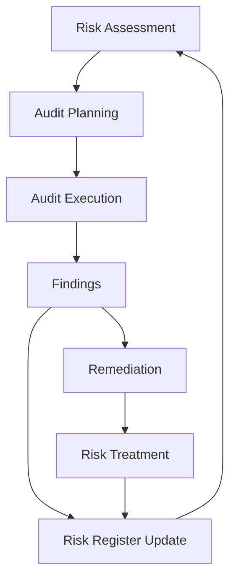

# Internal Security Audits

## Overview

Internal Security Audits are systematic evaluations of an organization's information security controls, policies, procedures, and practices conducted by internal resources or teams. These audits are essential for maintaining security posture, ensuring compliance, and identifying vulnerabilities before they can be exploited.

## Purpose and Objectives

### Primary Objectives
1. **Identify Security Gaps**: Discover vulnerabilities in systems, processes, and controls
2. **Ensure Compliance**: Verify adherence to internal policies and external regulations
3. **Risk Assessment**: Evaluate and prioritize security risks
4. **Continuous Improvement**: Drive ongoing security enhancements
5. **Resource Validation**: Confirm proper allocation and utilization of security resources

### Key Benefits
- Early detection of security issues
- Cost-effective compared to external audits
- Better understanding of internal operations
- Rapid remediation of findings
- Preparation for external audits
- Enhanced security culture

## Types of Internal Security Audits

### 1. Technical Security Audits
- **Network Security Assessments**
  - Firewall rule reviews
  - Network segmentation validation
  - Intrusion detection/prevention system effectiveness
  - VPN configuration audits

- **System Security Reviews**
  - Operating system hardening
  - Patch management effectiveness
  - Configuration compliance
  - Access control validation

- **Application Security Audits**
  - Code reviews
  - Authentication mechanism testing
  - Authorization controls
  - Input validation
  - Session management

### 2. Process and Procedural Audits
- **Access Management Reviews**
  - User provisioning processes
  - Privileged access management
  - Account lifecycle management
  - Role-based access control (RBAC) implementation

- **Incident Response Audits**
  - Response plan effectiveness
  - Team readiness assessments
  - Communication procedures
  - Recovery time objectives (RTO)

- **Change Management Audits**
  - Change control procedures
  - Documentation quality
  - Approval workflows
  - Rollback procedures

### 3. Compliance-Focused Audits
- **Regulatory Compliance**
  - GDPR compliance
  - HIPAA requirements
  - SOC 2 criteria
  - PCI DSS standards

- **Policy Compliance**
  - Information security policy adherence
  - Data classification compliance
  - Acceptable use policy enforcement
  - Third-party security requirements

### 4. Physical Security Audits
- **Facility Access Controls**
  - Badge system effectiveness
  - Visitor management procedures
  - Secure area controls
  - Environmental controls

- **Asset Protection**
  - Equipment inventory accuracy
  - Asset disposal procedures
  - Media handling processes
  - Chain of custody procedures

## Audit Planning and Preparation

### 1. Audit Charter Development
```
AUDIT CHARTER TEMPLATE:

Purpose: [Define the purpose of the internal security audit program]
Scope: [Specify what will and won't be included in audits]
Authority: [Document the authority granted to auditors]
Independence: [Establish independence requirements]
Reporting: [Define reporting structure and requirements]
Standards: [Specify applicable standards and frameworks]
```

### 2. Risk-Based Audit Planning
```json
{
  "risk_assessment": {
    "critical_assets": [
      {
        "asset": "Customer Database",
        "criticality": "High",
        "audit_frequency": "Quarterly",
        "last_audit": "2024-01-15"
      },
      {
        "asset": "Payment Processing System",
        "criticality": "High",
        "audit_frequency": "Monthly",
        "last_audit": "2024-03-01"
      }
    ],
    "risk_factors": [
      "Data sensitivity",
      "Regulatory requirements",
      "Business impact",
      "Threat landscape",
      "Previous findings"
    ]
  }
}
```

### 3. Audit Scheduling
```markdown
## Annual Audit Schedule Template

### Q1 (January - March)
- Network Security Assessment (January)
- Access Management Review (February)
- Physical Security Audit (March)

### Q2 (April - June)
- Application Security Audit (April)
- Incident Response Capability Test (May)
- Data Protection Controls Review (June)

### Q3 (July - September)
- Cloud Security Assessment (July)
- Third-Party Security Review (August)
- Business Continuity Planning Audit (September)

### Q4 (October - December)
- Compliance Assessment (October)
- Security Awareness Program Review (November)
- Annual Security Policy Review (December)
```

## Audit Execution Process

### 1. Pre-Audit Activities
- **Notification Process**
  ```
  Subject: Internal Security Audit Notification - [Audit Area]
  
  Dear [Department Head],
  
  This is to inform you that an internal security audit of [specific area] 
  will be conducted from [start date] to [end date].
  
  Audit Objectives:
  - [Objective 1]
  - [Objective 2]
  - [Objective 3]
  
  Required Documentation:
  - [Document 1]
  - [Document 2]
  - [Document 3]
  
  Key Contact: [Auditor Name, Contact Info]
  ```

### 2. Evidence Collection
- **Documentation Review Checklist**
  ```
  ☐ Security policies and procedures
  ☐ System configuration files
  ☐ Access control lists
  ☐ Incident reports
  ☐ Change management records
  ☐ Training records
  ☐ Vendor contracts
  ☐ Audit logs
  ☐ Risk assessments
  ☐ Business continuity plans
  ```

- **Technical Testing Tools**
  ```bash
  # Network Scanning
  nmap -sS -sV -O <target_network>
  
  # Vulnerability Assessment
  openvas --scan-start <target>
  
  # Configuration Compliance
  oscap xccdf eval --profile <profile> --results results.xml <benchmark.xml>
  
  # Log Analysis
  grep -E 'failed|error|denied' /var/log/secure
  ```

### 3. Audit Techniques
- **Interview Templates**
  ```
  SECURITY CONTROLS INTERVIEW GUIDE
  
  1. Access Management
     - How are new user accounts created?
     - What is the process for granting elevated privileges?
     - How often are access reviews conducted?
     - What happens when an employee leaves?
  
  2. Incident Response
     - Describe the incident reporting process
     - Who is part of the incident response team?
     - How are incidents prioritized?
     - What are the communication procedures?
  
  3. Security Awareness
     - What security training is provided?
     - How often is training conducted?
     - How is training effectiveness measured?
     - Are there role-specific training programs?
  ```

- **Observation Checklist**
  ```
  Physical Security Observations:
  ☐ Badge readers functioning properly
  ☐ Doors closing and locking automatically
  ☐ Cameras operational and positioned correctly
  ☐ Sensitive documents properly secured
  ☐ Clean desk policy compliance
  ☐ Visitor badges visible and escorted
  ☐ Server room access restricted
  ☐ No tailgating observed
  ```

### 4. Testing Procedures
```python
# Sample Automated Audit Script
import os
import subprocess
import json
from datetime import datetime

class SecurityAuditor:
    def __init__(self):
        self.findings = []
        self.timestamp = datetime.now()
    
    def check_password_policy(self):
        """Check password complexity requirements"""
        result = subprocess.run(['net', 'accounts'], capture_output=True, text=True)
        if 'Minimum password length: 8' not in result.stdout:
            self.findings.append({
                'severity': 'High',
                'finding': 'Password length requirement not met',
                'recommendation': 'Set minimum password length to 8 characters'
            })
    
    def check_firewall_status(self):
        """Verify firewall is enabled"""
        result = subprocess.run(['netsh', 'advfirewall', 'show', 'allprofiles'], 
                                capture_output=True, text=True)
        if 'State: OFF' in result.stdout:
            self.findings.append({
                'severity': 'Critical',
                'finding': 'Windows Firewall is disabled',
                'recommendation': 'Enable Windows Firewall immediately'
            })
    
    def generate_report(self):
        """Generate audit report"""
        report = {
            'audit_date': self.timestamp.isoformat(),
            'findings': self.findings,
            'total_findings': len(self.findings),
            'critical_findings': len([f for f in self.findings if f['severity'] == 'Critical'])
        }
        
        with open(f'audit_report_{self.timestamp.strftime("%Y%m%d")}.json', 'w') as f:
            json.dump(report, f, indent=2)
```

## Findings Documentation

### Finding Classification
```yaml
finding_classification:
  critical:
    description: "Immediate risk of data breach or system compromise"
    remediation_timeline: "24-48 hours"
    examples:
      - "Unpatched critical vulnerabilities"
      - "Default credentials in production"
      - "Missing encryption on sensitive data"
  
  high:
    description: "Significant security risk requiring prompt attention"
    remediation_timeline: "1-2 weeks"
    examples:
      - "Outdated security software"
      - "Excessive user permissions"
      - "Weak password policies"
  
  medium:
    description: "Moderate risk that should be addressed"
    remediation_timeline: "30-60 days"
    examples:
      - "Incomplete security documentation"
      - "Infrequent security training"
      - "Missing security headers"
  
  low:
    description: "Minor issues or opportunities for improvement"
    remediation_timeline: "90-180 days"
    examples:
      - "Cosmetic security policy updates"
      - "Minor configuration optimizations"
      - "Documentation enhancements"
```

### Finding Report Template
```markdown
## FINDING ID: [FIND-2024-001]

### Title
[Clear, concise description of the finding]

### Severity
[Critical | High | Medium | Low]

### Risk Description
[Detailed explanation of the security risk and potential impact]

### Evidence
- [Screenshot or log excerpt]
- [Configuration file snippet]
- [Interview notes]
- [Test results]

### Business Impact
- **Confidentiality**: [Impact description]
- **Integrity**: [Impact description]
- **Availability**: [Impact description]
- **Compliance**: [Regulatory implications]

### Recommendations
1. [Primary recommendation]
2. [Alternative approach]
3. [Compensating controls]

### Remediation Steps
```bash
# Step 1: [Action description]
[command or configuration]

# Step 2: [Action description]
[command or configuration]

# Step 3: Verification
[test command or procedure]
```

### References
- [Relevant standard or framework]
- [Vendor documentation]
- [Best practice guide]
```

## Reporting Structure

### Executive Summary Report
```markdown
# Internal Security Audit Executive Summary

## Audit Overview
- **Audit Period**: [Start Date] to [End Date]
- **Scope**: [Systems and processes audited]
- **Auditor(s)**: [Names and roles]
- **Methodology**: [Standards and frameworks used]

## Key Findings Summary
| Severity | Count | Percentage |
|----------|-------|------------|
| Critical | 2     | 10%        |
| High     | 5     | 25%        |
| Medium   | 8     | 40%        |
| Low      | 5     | 25%        |
| Total    | 20    | 100%       |

## Top Risks Identified
1. **[Critical Risk 1]**: [Brief description and impact]
2. **[Critical Risk 2]**: [Brief description and impact]
3. **[High Risk 1]**: [Brief description and impact]

## Recommendations
- Immediate Actions Required
  - [Action 1]
  - [Action 2]
- Strategic Improvements
  - [Improvement 1]
  - [Improvement 2]

## Positive Observations
- [Strength 1]
- [Strength 2]
- [Improvement from last audit]

## Next Steps
1. Management response due: [Date]
2. Remediation plan development: [Date]
3. Follow-up audit scheduled: [Date]
```

### Technical Report Format
```markdown
# Internal Security Audit Technical Report

## 1. Introduction
### 1.1 Audit Objectives
### 1.2 Scope and Limitations
### 1.3 Methodology
### 1.4 Executive Summary

## 2. Detailed Findings
### 2.1 Network Security
#### Finding NSF-001: [Title]
- Description
- Evidence
- Risk Assessment
- Recommendations

### 2.2 System Security
### 2.3 Application Security
### 2.4 Access Management
### 2.5 Physical Security

## 3. Risk Assessment Matrix
| Finding ID | Title | Severity | Likelihood | Impact | Risk Score |
|------------|-------|----------|------------|--------|-----------|
| NSF-001    | [Title] | Critical | High    | High   | 9/9       |
| SSF-001    | [Title] | High     | Medium  | High   | 6/9       |

## 4. Compliance Assessment
### 4.1 NIST Cybersecurity Framework
### 4.2 ISO 27001
### 4.3 Industry-Specific Requirements

## 5. Remediation Roadmap
### 5.1 Immediate Actions (0-30 days)
### 5.2 Short-term Goals (30-90 days)
### 5.3 Long-term Initiatives (90+ days)

## 6. Appendices
### 6.1 Testing Methodology
### 6.2 Tool Outputs
### 6.3 Interview Notes
### 6.4 Evidence Screenshots
```

## Remediation Management

### Tracking and Monitoring
```javascript
// Remediation Tracking Dashboard
const RemediationTracker = {
  findings: [
    {
      id: "FIND-2024-001",
      title: "Unencrypted database connections",
      severity: "Critical",
      status: "In Progress",
      assignee: "DBA Team",
      dueDate: "2024-03-15",
      progress: 75,
      blockers: ["Awaiting maintenance window"]
    },
    {
      id: "FIND-2024-002",
      title: "Excessive admin privileges",
      severity: "High",
      status: "Remediated",
      assignee: "IAM Team",
      completedDate: "2024-03-10",
      verificationStatus: "Pending"
    }
  ],
  
  generateMetrics: function() {
    return {
      totalFindings: this.findings.length,
      openFindings: this.findings.filter(f => f.status !== "Remediated").length,
      overdueFindings: this.findings.filter(f => new Date(f.dueDate) < new Date()).length,
      avgRemediationTime: this.calculateAvgRemediationTime()
    };
  }
};
```

### Verification Procedures
```yaml
verification_checklist:
  technical_verification:
    - Rerun vulnerability scans
    - Review configuration changes
    - Test security controls
    - Validate access restrictions
  
  process_verification:
    - Interview process owners
    - Review updated procedures
    - Check training records
    - Audit compliance metrics
  
  documentation_verification:
    - Confirm policy updates
    - Verify procedure documentation
    - Check evidence retention
    - Review approval records
```

## Tools and Resources

### Audit Management Tools
1. **Commercial Solutions**
   - ServiceNow GRC
   - Archer GRC Platform
   - MetricStream
   - SAP GRC

2. **Open Source Tools**
   - OSSEC (Log Analysis)
   - OpenVAS (Vulnerability Scanning)
   - Nikto (Web Application Scanning)
   - Lynis (System Auditing)

### Automation Scripts
```python
#!/usr/bin/env python3
# Automated Security Audit Scheduler

import schedule
import time
import subprocess
from datetime import datetime
import smtplib
from email.mime.text import MIMEText

class AuditScheduler:
    def __init__(self):
        self.audit_types = {
            'network': self.run_network_audit,
            'system': self.run_system_audit,
            'application': self.run_application_audit,
            'compliance': self.run_compliance_audit
        }
    
    def run_network_audit(self):
        """Execute network security audit"""
        print(f"Running network audit at {datetime.now()}")
        subprocess.run(['python', 'network_audit.py'])
        self.send_notification("Network audit completed")
    
    def run_system_audit(self):
        """Execute system security audit"""
        print(f"Running system audit at {datetime.now()}")
        subprocess.run(['python', 'system_audit.py'])
        self.send_notification("System audit completed")
    
    def send_notification(self, message):
        """Send email notification"""
        msg = MIMEText(message)
        msg['Subject'] = 'Audit Completion Notification'
        msg['From'] = 'audit@company.com'
        msg['To'] = 'security-team@company.com'
        
        # Configure SMTP server
        # smtp.send_message(msg)
    
    def schedule_audits(self):
        """Set up audit schedule"""
        schedule.every().monday.at("02:00").do(self.run_network_audit)
        schedule.every().wednesday.at("02:00").do(self.run_system_audit)
        schedule.every().friday.at("02:00").do(self.run_application_audit)
        schedule.every().month.do(self.run_compliance_audit)
        
        while True:
            schedule.run_pending()
            time.sleep(60)

if __name__ == "__main__":
    scheduler = AuditScheduler()
    scheduler.schedule_audits()
```

## Best Practices

### 1. Auditor Independence
- Maintain separation of duties
- Rotate audit assignments
- Establish reporting lines outside of audited areas
- Avoid conflicts of interest

### 2. Documentation Standards
- Use consistent templates
- Maintain evidence chain of custody
- Ensure reproducibility of findings
- Archive all working papers

### 3. Communication Protocols
- Regular status updates
- Clear escalation procedures
- Stakeholder engagement plans
- Transparent reporting

### 4. Continuous Improvement
```markdown
## Audit Program Maturity Model

### Level 1: Initial
- Ad-hoc audits
- Manual processes
- Limited documentation
- Reactive approach

### Level 2: Developing
- Scheduled audits
- Basic automation
- Standardized templates
- Risk-based planning

### Level 3: Defined
- Comprehensive program
- Automated tools
- Detailed procedures
- Metrics tracking

### Level 4: Managed
- Integrated GRC platform
- Continuous monitoring
- Predictive analytics
- Real-time dashboards

### Level 5: Optimized
- AI-driven insights
- Automated remediation
- Continuous improvement
- Strategic alignment
```

## Metrics and KPIs

### Audit Program Metrics
```json
{
  "audit_metrics": {
    "coverage": {
      "systems_audited": 85,
      "total_systems": 100,
      "coverage_percentage": 85
    },
    "findings": {
      "total_findings": 250,
      "critical_findings": 15,
      "high_findings": 50,
      "medium_findings": 100,
      "low_findings": 85
    },
    "remediation": {
      "avg_time_to_remediate": 21,
      "overdue_findings": 12,
      "remediation_rate": 92
    },
    "efficiency": {
      "audits_per_quarter": 12,
      "avg_audit_duration": 5,
      "resource_utilization": 78
    }
  }
}
```

### Performance Indicators
1. **Audit Completion Rate**: Percentage of planned audits completed on schedule
2. **Finding Detection Rate**: Number of findings per audit hour
3. **Remediation Velocity**: Average time from finding to closure
4. **Risk Coverage**: Percentage of high-risk areas audited
5. **Stakeholder Satisfaction**: Feedback scores from audit clients

## Common Pitfalls and Solutions

### 1. Scope Creep
**Problem**: Audit scope expands beyond original plan
**Solution**: 
- Define clear boundaries in audit charter
- Regular scope reviews with stakeholders
- Document any scope changes formally

### 2. Resistance to Audits
**Problem**: Departments view audits as punitive
**Solution**:
- Position audits as collaborative improvements
- Share positive findings alongside issues
- Involve teams in remediation planning

### 3. Resource Constraints
**Problem**: Limited staff and budget for audits
**Solution**:
- Prioritize based on risk assessment
- Leverage automation tools
- Cross-train team members
- Consider co-sourcing options

## Integration with Other Processes

### Risk Management Integration


### Incident Response Coordination
- Share audit findings with incident response team
- Use incident data to inform audit focus areas
- Validate incident response procedures during audits
- Test incident detection capabilities

### Change Management Alignment
- Review change records during audits
- Assess change management effectiveness
- Identify unauthorized changes
- Validate change implementation

## Future Trends

### 1. AI and Machine Learning
- Automated finding detection
- Predictive risk analysis
- Natural language processing for policy review
- Anomaly detection in access patterns

### 2. Continuous Auditing
- Real-time control monitoring
- Automated compliance checking
- Dynamic risk assessment
- Instant alerting on deviations

### 3. Cloud and DevOps
- Infrastructure as Code auditing
- Container security assessments
- CI/CD pipeline reviews
- Cloud configuration validation

## Conclusion

Internal security audits are a critical component of an organization's security program. They provide independent validation of security controls, ensure compliance with regulations, and drive continuous improvement. By following the practices and procedures outlined in this guide, organizations can establish and maintain an effective internal audit program that adds value while reducing risk.

### Key Takeaways
1. Plan audits based on risk assessment
2. Use standardized methodologies and tools
3. Document findings clearly and objectively
4. Track remediation efforts systematically
5. Continuously improve the audit program
6. Align with organizational objectives
7. Leverage automation where possible
8. Maintain auditor independence
9. Communicate effectively with stakeholders
10. Measure and report on program effectiveness

## References and Resources

### Standards and Frameworks
- **ISO 19011:2018**: Guidelines for auditing management systems
- **ISACA IT Audit Framework**: IT audit standards and procedures
- **IIA Standards**: International Standards for the Professional Practice of Internal Auditing
- **NIST SP 800-53A**: Assessing Security and Privacy Controls

### Professional Organizations
- Information Systems Audit and Control Association (ISACA)
- Institute of Internal Auditors (IIA)
- International Information System Security Certification Consortium (ISC)²
- SANS Institute

### Training and Certification
- Certified Information Systems Auditor (CISA)
- Certified Internal Auditor (CIA)
- GIAC Systems and Network Auditor (GSNA)
- Certified Information Security Manager (CISM)

### Useful Links
- [NIST Cybersecurity Framework](https://www.nist.gov/cyberframework)
- [ISO 27001 Information Security](https://www.iso.org/isoiec-27001-information-security.html)
- [OWASP Testing Guide](https://owasp.org/www-project-web-security-testing-guide/)
- [CIS Benchmarks](https://www.cisecurity.org/cis-benchmarks/)

---

*This document serves as a comprehensive guide for implementing and managing internal security audits. It should be customized to fit your organization's specific needs, industry requirements, and regulatory obligations.*