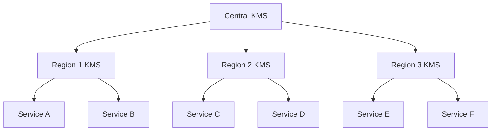

# Encryption Standards and Methods

## Overview
This document provides comprehensive guidance on encryption standards and methods for AI agents to make informed decisions about data protection strategies. It covers various encryption algorithms, implementation best practices, and use case scenarios.

## Key Principles

### 1. Defense in Depth
- Always employ multiple layers of encryption
- Combine encryption with other security controls
- Never rely on encryption alone for security

### 2. Appropriate Algorithm Selection
- Match encryption strength to data sensitivity
- Consider performance requirements
- Account for compliance requirements

### 3. Key Management
- Keys should be at least as protected as the data they encrypt
- Implement proper key rotation policies
- Maintain key escrow systems for disaster recovery

## Encryption Categories

### Symmetric Encryption

#### AES (Advanced Encryption Standard)
**Usage**: Bulk data encryption, file/disk encryption, database encryption

**Key Sizes**:
- AES-128: Suitable for most business applications
- AES-192: Government/military applications
- AES-256: Maximum security applications

**Best Practices**:
```
- Use AES-GCM mode for authenticated encryption
- Avoid ECB mode (reveals patterns)
- Use unique IVs for each encryption operation
- Implement proper padding schemes
```

**Example Implementation Considerations**:
```json
{
  "algorithm": "AES-256-GCM",
  "keySize": 256,
  "tagLength": 128,
  "ivLength": 96,
  "paddingScheme": "PKCS7"
}
```

#### ChaCha20-Poly1305
**Usage**: Mobile devices, IoT, scenarios where AES acceleration isn't available

**Advantages**:
- Software-friendly implementation
- Resistant to timing attacks
- Good performance on low-power devices

### Asymmetric Encryption

#### RSA
**Key Sizes**:
- 2048-bit: Minimum recommended (deprecated by 2030)
- 3072-bit: Medium-term security
- 4096-bit: Long-term security

**Use Cases**:
- Digital signatures
- Key exchange
- Certificate generation
- Email encryption (S/MIME)

**Best Practices**:
```
- Use OAEP padding for encryption
- Use PSS padding for signatures
- Never use textbook RSA
- Consider performance impact of large keys
```

#### Elliptic Curve Cryptography (ECC)
**Recommended Curves**:
- P-256 (secp256r1): NIST standard
- P-384 (secp384r1): Higher security
- Curve25519: Modern, high-performance

**Advantages**:
- Smaller key sizes for equivalent security
- Better performance than RSA
- Lower power consumption

### Hashing and Message Authentication

#### SHA Family
**Current Standards**:
- SHA-256: Standard choice
- SHA-384: Higher security applications
- SHA-512: Maximum security

**Deprecated**:
- SHA-1 (vulnerable to collisions)
- MD5 (completely broken)

#### HMAC
**Usage**: Message authentication, API security

**Best Practices**:
```
- Use SHA-256 or higher
- Key length should match hash output
- Implement constant-time comparison
```

## Implementation Guidelines

### 1. Data at Rest Encryption

#### Full Disk Encryption
**Technologies**:
- BitLocker (Windows)
- FileVault (macOS)
- LUKS (Linux)

**Configuration**:
```yaml
encryption:
  algorithm: AES-256-XTS
  authentication: TPM 2.0
  recovery: 
    - Recovery Key
    - Active Directory
  pre-boot-authentication: true
```

#### Database Encryption
**Options**:
1. **Transparent Data Encryption (TDE)**
   - Encrypts at page level
   - No application changes required
   - Performance overhead: 5-10%

2. **Column-Level Encryption**
   - Granular control
   - Higher performance impact
   - Requires application changes

3. **Application-Level Encryption**
   - Maximum control
   - Cross-database portability
   - Highest complexity

### 2. Data in Transit Encryption

#### TLS/SSL Configuration
**Minimum Requirements**:
- TLS 1.2 (1.3 preferred)
- Disable SSLv3, TLS 1.0, 1.1
- Strong cipher suites only

**Recommended Cipher Suite Order**:
```
1. TLS_AES_256_GCM_SHA384
2. TLS_CHACHA20_POLY1305_SHA256
3. TLS_AES_128_GCM_SHA256
4. ECDHE-RSA-AES256-GCM-SHA384
5. ECDHE-RSA-AES128-GCM-SHA256
```

#### VPN Technologies
**Protocol Recommendations**:
- OpenVPN (AES-256-GCM)
- IPSec (IKEv2)
- WireGuard (ChaCha20-Poly1305)

### 3. Key Management

#### Key Lifecycle


#### Hardware Security Modules (HSM)
**Use Cases**:
- Root CA key storage
- Code signing certificates
- Database master keys
- Payment processing keys

**Selection Criteria**:
- FIPS 140-2 Level 3 minimum
- Performance requirements
- High availability needs
- Integration capabilities

#### Cloud Key Management Services
**Options**:
- Azure Key Vault
- AWS KMS
- Google Cloud KMS
- HashiCorp Vault

**Best Practices**:
```json
{
  "keyRotation": {
    "enabled": true,
    "interval": "90 days"
  },
  "accessControl": {
    "principle": "least-privilege",
    "segregationOfDuties": true
  },
  "audit": {
    "logging": "enabled",
    "retention": "7 years"
  }
}
```

## Compliance Requirements

### Industry Standards

#### PCI DSS
- Strong cryptography (AES-128 minimum)
- Key strength of 112 bits or higher
- Annual key rotation

#### HIPAA
- Encryption required for PHI
- Both at-rest and in-transit
- Key management documentation required

#### GDPR
- Encryption as appropriate technical measure
- Pseudonymization techniques
- Right to erasure considerations

### Government Standards

#### FIPS 140-2/3
**Levels**:
1. Basic security requirements
2. Tamper-evident physical security
3. Tamper-resistant with identity-based authentication
4. Complete physical security envelope

#### Common Criteria
- EAL ratings for security products
- Protection profiles for specific use cases
- Mutual recognition agreements

## Decision Framework

### Algorithm Selection Matrix

| Data Type | Sensitivity | At Rest | In Transit | Key Management |
|-----------|-------------|---------|------------|----------------|
| PII | High | AES-256-GCM | TLS 1.3 | HSM Required |
| Financial | Critical | AES-256-XTS | IPSec + TLS | HSM Required |
| Healthcare | High | AES-256-CBC | TLS 1.3 | Cloud KMS |
| Public Data | Low | None/AES-128 | TLS 1.2 | Software |

### Performance Considerations

```yaml
performance_impact:
  aes_128_gcm:
    cpu_overhead: "5-10%"
    throughput: "2-3 GB/s"
  aes_256_gcm:
    cpu_overhead: "10-15%"
    throughput: "1.5-2 GB/s"
  rsa_2048:
    operations_per_second: 500-1000
  ecc_p256:
    operations_per_second: 5000-10000
```

## Implementation Checklist

### Initial Assessment
- [ ] Identify data classification levels
- [ ] Map compliance requirements
- [ ] Inventory current crypto usage
- [ ] Assess risk levels

### Design Phase
- [ ] Select appropriate algorithms
- [ ] Design key management strategy
- [ ] Plan encryption architecture
- [ ] Define key rotation policies

### Implementation Phase
- [ ] Implement encryption controls
- [ ] Deploy key management system
- [ ] Configure monitoring and alerting
- [ ] Set up automated testing

### Operational Phase
- [ ] Document procedures
- [ ] Train personnel
- [ ] Conduct regular audits
- [ ] Plan for crypto-agility
- [ ] Establish incident response procedures

### Continuous Improvement
- [ ] Monitor performance metrics
- [ ] Track compliance status
- [ ] Update to latest standards
- [ ] Review and update policies

## Common Pitfalls to Avoid

1. **Hard-coded Keys**
   - Never embed keys in source code
   - Use environment variables or key vaults

2. **Weak Random Number Generation**
   - Use cryptographically secure RNG
   - Seed properly from entropy sources

3. **Key Reuse**
   - Generate unique keys for each purpose
   - Implement proper key derivation

4. **Ignoring Padding Oracle Attacks**
   - Use authenticated encryption modes
   - Implement constant-time operations

5. **Poor Key Storage**
   - Never store keys in plaintext
   - Use hardware security where possible

## Future Considerations

### Quantum-Resistant Cryptography
**Algorithms to Consider**:
- CRYSTALS-Kyber (Key Exchange)
- CRYSTALS-Dilithium (Signatures)
- FALCON (Signatures)
- SPHINCS+ (Signatures)

### Migration Strategy
1. Inventory current cryptographic usage
2. Identify quantum-vulnerable systems
3. Implement crypto-agility
4. Test quantum-resistant algorithms
5. Plan phased migration

## Monitoring and Metrics

### Key Performance Indicators
- Encryption coverage percentage
- Key rotation compliance rate
- Certificate expiration tracking
- Cryptographic failure rates

### Alerting Thresholds
```json
{
  "alerts": {
    "key_expiration": "30 days",
    "certificate_expiration": "60 days",
    "failed_encryption_operations": "> 1%",
    "weak_cipher_usage": "any occurrence"
  }
}
```

## Advanced Implementation Patterns

### Envelope Encryption
```python
def envelope_encrypt(data, key_encryption_key):
    """
    Implement envelope encryption pattern
    """
    # Generate data encryption key
    dek = generate_random_key(256)
    
    # Encrypt data with DEK
    encrypted_data = aes_encrypt(data, dek)
    
    # Encrypt DEK with KEK
    encrypted_dek = rsa_encrypt(dek, key_encryption_key)
    
    return {
        'encrypted_data': encrypted_data,
        'encrypted_dek': encrypted_dek,
        'algorithm': 'AES-256-GCM',
        'kek_id': key_encryption_key.id
    }
```

### Format Preserving Encryption (FPE)
```yaml
fpe_use_cases:
  credit_cards:
    algorithm: "FF1"
    radix: 10
    preserve_format: "XXXX-XXXX-XXXX-XXXX"
  ssn:
    algorithm: "FF3-1"
    radix: 10
    preserve_format: "XXX-XX-XXXX"
  phone_numbers:
    algorithm: "FF1"
    radix: 10
    preserve_format: "(XXX) XXX-XXXX"
```

### Homomorphic Encryption Considerations
```json
{
  "homomorphic_types": {
    "partially_homomorphic": {
      "algorithms": ["RSA", "ElGamal", "Paillier"],
      "operations": "single_operation",
      "performance": "acceptable",
      "use_cases": ["secure_voting", "privacy_preserving_analytics"]
    },
    "somewhat_homomorphic": {
      "algorithms": ["BGV", "BFV"],
      "operations": "limited_operations",
      "performance": "slow",
      "use_cases": ["machine_learning", "medical_data_analysis"]
    },
    "fully_homomorphic": {
      "algorithms": ["TFHE", "CKKS"],
      "operations": "unlimited_operations",
      "performance": "very_slow",
      "use_cases": ["cloud_computing", "privacy_preserving_ai"]
    }
  }
}
```

## Container and Kubernetes Encryption

### Container Image Encryption
```yaml
container_encryption:
  image_encryption:
    tools:
      - "containerd encryption"
      - "CRI-O encryption"
    key_management:
      - "Kubernetes secrets"
      - "External KMS integration"
  
  runtime_encryption:
    memory_encryption:
      - "Intel SGX"
      - "AMD SEV"
    storage_encryption:
      - "Encrypted volumes"
      - "Ephemeral encryption"
```

### Kubernetes Secrets Management
```bash
# Enable encryption at rest
apiVersion: apiserver.config.k8s.io/v1
kind: EncryptionConfiguration
resources:
  - resources:
    - secrets
    providers:
    - aescbc:
        keys:
        - name: key1
          secret: <BASE64_ENCODED_SECRET>
    - identity: {}
```

## Zero-Knowledge Proofs Integration

### Implementation Patterns
```python
class ZKProofSystem:
    def generate_proof(self, secret, public_input):
        """
        Generate zero-knowledge proof
        """
        commitment = self.commit(secret)
        challenge = self.get_challenge(commitment, public_input)
        response = self.respond(secret, challenge)
        return {
            'commitment': commitment,
            'challenge': challenge,
            'response': response
        }
    
    def verify_proof(self, proof, public_input):
        """
        Verify zero-knowledge proof
        """
        return self.check_proof(proof, public_input)
```

### Use Cases
```yaml
zk_applications:
  authentication:
    - "Password verification without transmission"
    - "Biometric authentication"
    - "Multi-factor authentication"
  
  compliance:
    - "Age verification"
    - "Income verification"
    - "Regulatory compliance proofs"
  
  blockchain:
    - "Private transactions"
    - "Identity verification"
    - "Confidential smart contracts"
```

## Encryption in Distributed Systems

### Service Mesh Encryption
```json
{
  "service_mesh_config": {
    "mtls": {
      "enabled": true,
      "certificate_provider": "citadel",
      "rotation_interval": "24h",
      "minimum_protocol": "TLSv1.3"
    },
    "traffic_policy": {
      "mode": "STRICT",
      "cipher_suites": [
        "TLS_AES_256_GCM_SHA384",
        "TLS_AES_128_GCM_SHA256"
      ]
    }
  }
}
```

### Distributed Key Management


## Compliance Automation

### Encryption Compliance Scanning
```python
class EncryptionComplianceScanner:
    def scan_infrastructure(self):
        results = {
            'compliant': [],
            'non_compliant': [],
            'warnings': []
        }
        
        # Check TLS versions
        for service in self.services:
            tls_version = self.check_tls_version(service)
            if tls_version < "1.2":
                results['non_compliant'].append({
                    'service': service.name,
                    'issue': 'TLS version below minimum',
                    'severity': 'HIGH'
                })
        
        # Check encryption at rest
        for database in self.databases:
            if not database.encryption_enabled:
                results['non_compliant'].append({
                    'resource': database.name,
                    'issue': 'Encryption at rest disabled',
                    'severity': 'CRITICAL'
                })
        
        return results
```

### Automated Remediation
```yaml
remediation_playbook:
  weak_tls:
    detection: "TLS < 1.2"
    action:
      - "Update TLS configuration"
      - "Restart service"
      - "Verify new configuration"
  
  unencrypted_storage:
    detection: "No encryption at rest"
    action:
      - "Enable TDE/disk encryption"
      - "Rotate existing data"
      - "Update backup procedures"
  
  expired_certificates:
    detection: "Certificate expiry < 30 days"
    action:
      - "Request new certificate"
      - "Deploy certificate"
      - "Verify deployment"
```

## Performance Optimization Strategies

### Hardware Acceleration
```json
{
  "acceleration_options": {
    "intel_aes_ni": {
      "speedup": "5-10x",
      "algorithms": ["AES-GCM", "AES-CBC"],
      "detection": "grep aes /proc/cpuinfo"
    },
    "gpu_acceleration": {
      "speedup": "50-100x",
      "algorithms": ["AES", "RSA", "ECC"],
      "libraries": ["CUDA", "OpenCL"]
    },
    "fpga_acceleration": {
      "speedup": "100-1000x",
      "algorithms": ["Custom implementations"],
      "use_cases": ["High-frequency trading", "Video streaming"]
    }
  }
}
```

### Caching Strategies
```python
class EncryptionCache:
    def __init__(self, max_size=1000, ttl=3600):
        self.cache = LRUCache(max_size)
        self.ttl = ttl
    
    def encrypt_with_cache(self, data, key):
        cache_key = hash(data + key)
        
        # Check cache
        if cached := self.cache.get(cache_key):
            if cached['timestamp'] + self.ttl > time.time():
                return cached['result']
        
        # Perform encryption
        result = encrypt(data, key)
        
        # Cache result
        self.cache.set(cache_key, {
            'result': result,
            'timestamp': time.time()
        })
        
        return result
```

## Incident Response for Crypto Failures

### Crypto-Related Incident Types
```yaml
incident_types:
  key_compromise:
    severity: "CRITICAL"
    response:
      - "Immediate key rotation"
      - "Identify affected data"
      - "Notify stakeholders"
      - "Forensic analysis"
  
  weak_crypto_detected:
    severity: "HIGH"
    response:
      - "Inventory affected systems"
      - "Prioritize remediation"
      - "Update configurations"
  
  certificate_expiry:
    severity: "MEDIUM"
    response:
      - "Renew certificate"
      - "Test deployment"
      - "Update monitoring"
```

### Emergency Response Procedures
```markdown
## Crypto Incident Response Checklist

### Immediate Actions (0-4 hours)
1. [ ] Isolate affected systems
2. [ ] Preserve evidence
3. [ ] Initiate key rotation
4. [ ] Document timeline

### Short-term Actions (4-24 hours)
1. [ ] Complete forensic analysis
2. [ ] Implement temporary mitigations
3. [ ] Communicate with stakeholders
4. [ ] Begin re-encryption if needed

### Long-term Actions (1-7 days)
1. [ ] Complete system remediation
2. [ ] Update policies/procedures
3. [ ] Conduct lessons learned
4. [ ] Improve monitoring
```

## References and Resources

1. NIST Special Publication 800-57: Key Management
2. NIST Special Publication 800-38: Block Cipher Modes
3. OWASP Cryptographic Storage Cheat Sheet
4. Azure Encryption Best Practices
5. AWS Encryption SDK Documentation
6. Google Cloud Encryption at Rest
7. NIST Post-Quantum Cryptography Standards
8. IETF RFC 8446: TLS 1.3 Specification
9. FIPS 140-3: Security Requirements for Cryptographic Modules
10. ISO/IEC 18033: Encryption Algorithms

---
*Last Updated: 2024*
*Next Review: Quarterly*
*Version: 2.0*
