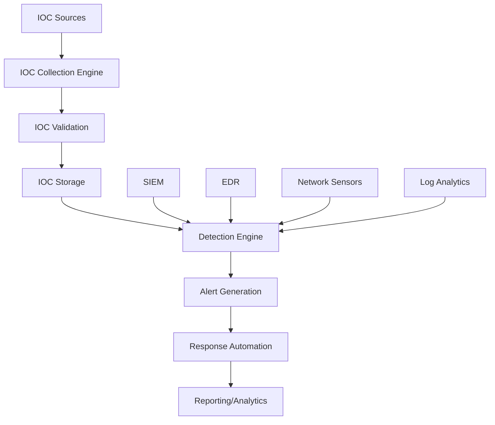
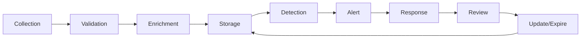

# IOC Detection - Comprehensive Guide

## Table of Contents
1. [Introduction](#introduction)
2. [IOC Definition and Categories](#ioc-definition-and-categories)
3. [IOC Detection Architecture](#ioc-detection-architecture)
4. [Detection Methods](#detection-methods)
5. [IOC Sources and Intelligence Feeds](#ioc-sources-and-intelligence-feeds)
6. [Implementation Guidelines](#implementation-guidelines)
7. [IOC Management Lifecycle](#ioc-management-lifecycle)
8. [Automation and Orchestration](#automation-and-orchestration)
9. [Response Procedures](#response-procedures)
10. [False Positive Management](#false-positive-management)
11. [Performance Considerations](#performance-considerations)
12. [Integration with Azure Services](#integration-with-azure-services)
13. [Best Practices](#best-practices)
14. [Troubleshooting and Optimization](#troubleshooting-and-optimization)
15. [Metrics and KPIs](#metrics-and-kpis)

## 1. Introduction

### Purpose
This document provides comprehensive guidance for implementing, managing, and optimizing Indicators of Compromise (IOC) detection systems. It serves as both an operational handbook for security teams and a technical reference for system implementation and automation.

### Scope
- IOC collection, validation, and deployment
- Detection mechanisms and technologies
- Response procedures and automation
- Integration with Azure security services
- Performance optimization strategies
- Operational best practices

### Target Audience
- Security Operations Center (SOC) analysts
- Security engineers
- System administrators
- AI agents for automated detection and response

## 2. IOC Definition and Categories

### What are IOCs?
Indicators of Compromise (IOCs) are artifacts observed on a network or system that, with high confidence, indicate a computer security incident has occurred or is currently occurring.

### IOC Categories

#### 2.1 Network-Based IOCs
```yaml
network_iocs:
  - type: ip_address
    description: "Malicious IP addresses"
    examples:
      - "192.168.1.100"
      - "10.0.0.25"
    attributes:
      - reputation_score
      - geolocation
      - asn_info
      - first_seen
      - last_seen
      
  - type: domain
    description: "Malicious domains"
    examples:
      - "malicious-site.com"
      - "phishing-domain.net"
    attributes:
      - registration_date
      - registrar
      - dns_records
      - ssl_certificate_hash
      
  - type: url
    description: "Malicious URLs"
    examples:
      - "http://badsite.com/malware.exe"
      - "https://phishing.site/login"
    attributes:
      - path
      - query_parameters
      - response_headers
      - content_hash
```

#### 2.2 Host-Based IOCs
```yaml
host_iocs:
  - type: file_hash
    description: "Malicious file hashes"
    formats:
      - md5: "32 character hexadecimal"
      - sha1: "40 character hexadecimal"
      - sha256: "64 character hexadecimal"
    examples:
      md5: "098f6bcd4621d373cade4e832627b4f6"
      sha1: "a94a8fe5ccb19ba61c4c0873d391e987982fbbd3"
      sha256: "9f86d081884c7d659a2feaa0c55ad015a3bf4f1b2b0b822cd15d6c15b0f00a08"
      
  - type: file_path
    description: "Suspicious file locations"
    examples:
      - "C:\\Windows\\Temp\\evil.exe"
      - "/tmp/.hidden/backdoor"
    
  - type: registry_key
    description: "Malicious registry modifications"
    examples:
      - "HKLM\\Software\\Microsoft\\Windows\\CurrentVersion\\Run\\Malware"
      - "HKCU\\Software\\Classes\\*\\shell\\open\\command"
      
  - type: process_name
    description: "Malicious process names"
    examples:
      - "svchost.exe" # When running from wrong location
      - "csrss.exe" # When spawned by wrong parent
```

#### 2.3 Behavioral IOCs
```yaml
behavioral_iocs:
  - type: command_line
    description: "Suspicious command line patterns"
    examples:
      - "powershell -encodedcommand [base64]"
      - "cmd.exe /c echo malicious > file.bat"
      
  - type: network_behavior
    description: "Suspicious network patterns"
    examples:
      - "Periodic beaconing to C2 server"
      - "Large data exfiltration"
      - "Port scanning activities"
      
  - type: file_behavior
    description: "Suspicious file operations"
    examples:
      - "Mass file encryption"
      - "Rapid file deletion"
      - "Shadow copy deletion"
```

## 3. IOC Detection Architecture

### 3.1 Architecture Components



### 3.2 Component Details

#### IOC Collection Engine
```python
# Example IOC Collection Implementation
class IOCCollectionEngine:
    def __init__(self):
        self.sources = []
        self.validators = []
        self.storage = IOCStorage()
    
    def add_source(self, source):
        """Add new IOC source"""
        self.sources.append(source)
    
    def collect_iocs(self):
        """Collect IOCs from all configured sources"""
        collected_iocs = []
        for source in self.sources:
            try:
                iocs = source.fetch_iocs()
                collected_iocs.extend(iocs)
            except Exception as e:
                logging.error(f"Failed to collect from {source.name}: {e}")
        return collected_iocs
    
    def validate_iocs(self, iocs):
        """Validate collected IOCs"""
        valid_iocs = []
        for ioc in iocs:
            if self.is_valid_ioc(ioc):
                valid_iocs.append(ioc)
        return valid_iocs
    
    def is_valid_ioc(self, ioc):
        """Validate individual IOC"""
        for validator in self.validators:
            if not validator.validate(ioc):
                return False
        return True
```

#### IOC Storage Schema
```sql
-- IOC Storage Database Schema
CREATE TABLE iocs (
    id UUID PRIMARY KEY,
    ioc_type VARCHAR(50) NOT NULL,
    ioc_value TEXT NOT NULL,
    confidence_score FLOAT,
    source VARCHAR(100),
    first_seen TIMESTAMP,
    last_seen TIMESTAMP,
    expiration_date TIMESTAMP,
    tags TEXT[],
    metadata JSONB,
    created_at TIMESTAMP DEFAULT CURRENT_TIMESTAMP,
    updated_at TIMESTAMP DEFAULT CURRENT_TIMESTAMP
);

CREATE INDEX idx_ioc_value ON iocs(ioc_value);
CREATE INDEX idx_ioc_type ON iocs(ioc_type);
CREATE INDEX idx_expiration ON iocs(expiration_date);
CREATE INDEX idx_tags ON iocs USING GIN(tags);
```

## 4. Detection Methods

### 4.1 Real-Time Detection
```python
class RealTimeDetector:
    def __init__(self, ioc_store):
        self.ioc_store = ioc_store
        self.detection_cache = {}
        self.alert_manager = AlertManager()
    
    def detect(self, event):
        """Perform real-time IOC detection"""
        detections = []
        
        # Extract potential IOCs from event
        extracted_iocs = self.extract_iocs(event)
        
        for ioc in extracted_iocs:
            if self.is_malicious(ioc):
                detection = {
                    'timestamp': datetime.utcnow(),
                    'event': event,
                    'ioc': ioc,
                    'confidence': self.get_confidence(ioc)
                }
                detections.append(detection)
                
        if detections:
            self.alert_manager.create_alerts(detections)
            
        return detections
    
    def extract_iocs(self, event):
        """Extract IOCs from event data"""
        extracted = []
        
        # Extract IPs
        ip_pattern = r'\b(?:[0-9]{1,3}\.){3}[0-9]{1,3}\b'
        ips = re.findall(ip_pattern, str(event))
        extracted.extend([{'type': 'ip', 'value': ip} for ip in ips])
        
        # Extract domains
        domain_pattern = r'(?:[a-z0-9](?:[a-z0-9-]{0,61}[a-z0-9])?\.)+[a-z0-9][a-z0-9-]{0,61}[a-z0-9]'
        domains = re.findall(domain_pattern, str(event), re.IGNORECASE)
        extracted.extend([{'type': 'domain', 'value': domain} for domain in domains])
        
        # Extract file hashes
        hash_patterns = {
            'md5': r'\b[a-fA-F0-9]{32}\b',
            'sha1': r'\b[a-fA-F0-9]{40}\b',
            'sha256': r'\b[a-fA-F0-9]{64}\b'
        }
        
        for hash_type, pattern in hash_patterns.items():
            hashes = re.findall(pattern, str(event))
            extracted.extend([{'type': f'hash_{hash_type}', 'value': h} for h in hashes])
        
        return extracted
```

### 4.2 Batch Detection
```python
class BatchDetector:
    def __init__(self, ioc_store):
        self.ioc_store = ioc_store
        self.batch_size = 1000
        
    def detect_batch(self, log_file):
        """Perform batch IOC detection on log files"""
        detections = []
        
        with open(log_file, 'r') as f:
            batch = []
            for line in f:
                batch.append(line)
                if len(batch) >= self.batch_size:
                    batch_detections = self.process_batch(batch)
                    detections.extend(batch_detections)
                    batch = []
            
            # Process remaining lines
            if batch:
                batch_detections = self.process_batch(batch)
                detections.extend(batch_detections)
        
        return detections
    
    def process_batch(self, lines):
        """Process a batch of log lines"""
        detections = []
        
        # Extract all IOCs from batch
        all_iocs = []
        for line in lines:
            extracted = self.extract_iocs(line)
            all_iocs.extend(extracted)
        
        # Deduplicate IOCs
        unique_iocs = list({(ioc['type'], ioc['value']): ioc for ioc in all_iocs}.values())
        
        # Check against IOC store in bulk
        malicious_iocs = self.ioc_store.bulk_check(unique_iocs)
        
        # Create detections
        for ioc in malicious_iocs:
            detection = {
                'timestamp': datetime.utcnow(),
                'ioc': ioc,
                'source': 'batch_detection',
                'confidence': ioc.get('confidence', 0.5)
            }
            detections.append(detection)
        
        return detections
```

### 4.3 Pattern-Based Detection
```yaml
detection_patterns:
  - name: "PowerShell Encoded Command"
    type: "command_line"
    pattern: "powershell.*-encodedcommand"
    severity: "high"
    
  - name: "Suspicious Process Hierarchy"
    type: "process_creation"
    pattern: |
      parent_process: "winword.exe"
      child_process: "cmd.exe"
    severity: "medium"
    
  - name: "Lateral Movement Indicator"
    type: "network"
    pattern: |
      source_internal: true
      destination_internal: true
      port: [445, 3389, 22]
      frequency: "> 10/hour"
    severity: "high"
```

## 5. IOC Sources and Intelligence Feeds

### 5.1 External Threat Intelligence Feeds
```python
class ThreatIntelligenceFeed:
    def __init__(self, feed_config):
        self.name = feed_config['name']
        self.url = feed_config['url']
        self.api_key = feed_config.get('api_key')
        self.format = feed_config['format']
        self.update_interval = feed_config.get('update_interval', 3600)
        
    def fetch_iocs(self):
        """Fetch IOCs from threat intelligence feed"""
        headers = {}
        if self.api_key:
            headers['Authorization'] = f'Bearer {self.api_key}'
        
        try:
            response = requests.get(self.url, headers=headers, timeout=30)
            response.raise_for_status()
            
            if self.format == 'stix':
                return self.parse_stix(response.content)
            elif self.format == 'csv':
                return self.parse_csv(response.text)
            elif self.format == 'json':
                return self.parse_json(response.json())
            else:
                raise ValueError(f"Unsupported format: {self.format}")
                
        except Exception as e:
            logging.error(f"Failed to fetch IOCs from {self.name}: {e}")
            return []
    
    def parse_stix(self, content):
        """Parse STIX format IOCs"""
        # Implementation for STIX parsing
        pass
    
    def parse_csv(self, content):
        """Parse CSV format IOCs"""
        iocs = []
        reader = csv.DictReader(io.StringIO(content))
        
        for row in reader:
            ioc = {
                'type': row.get('type'),
                'value': row.get('indicator'),
                'confidence': float(row.get('confidence', 0.5)),
                'tags': row.get('tags', '').split(','),
                'source': self.name
            }
            iocs.append(ioc)
        
        return iocs
```

### 5.2 Popular IOC Sources
```yaml
ioc_sources:
  - name: "MISP"
    url: "https://misp-instance.org/events/restSearch"
    format: "json"
    authentication: "api_key"
    
  - name: "AlienVault OTX"
    url: "https://otx.alienvault.com/api/v1/pulses/subscribed"
    format: "json"
    authentication: "api_key"
    
  - name: "Abuse.ch URLhaus"
    url: "https://urlhaus.abuse.ch/downloads/csv/"
    format: "csv"
    authentication: "none"
    
  - name: "Emerging Threats"
    url: "https://rules.emergingthreats.net/open/suricata/rules/compromised-ips.txt"
    format: "text"
    authentication: "none"
    
  - name: "Microsoft Defender ATP"
    url: "https://api.securitycenter.microsoft.com/api/indicators"
    format: "json"
    authentication: "oauth"
```

## 6. Implementation Guidelines

### 6.1 Initial Setup
```bash
# Step 1: Install required components
az vm create --resource-group SecurityOps --name IOCDetector \
    --image Ubuntu2204 --size Standard_D4s_v3 \
    --admin-username azureuser --generate-ssh-keys

# Step 2: Install dependencies
sudo apt update
sudo apt install -y python3-pip postgresql redis-server

# Step 3: Install Python packages
pip3 install azure-storage-blob azure-keyvault-secrets \
    azure-monitor redis psycopg2-binary requests

# Step 4: Configure database
sudo -u postgres createdb ioc_detection
sudo -u postgres createuser ioc_user -P
```

### 6.2 Azure Integration Setup
```python
# Azure Configuration
import os
from azure.identity import DefaultAzureCredential
from azure.keyvault.secrets import SecretClient
from azure.storage.blob import BlobServiceClient
from azure.monitor.query import LogsQueryClient

class AzureIOCIntegration:
    def __init__(self):
        self.credential = DefaultAzureCredential()
        self.key_vault_url = os.environ['AZURE_KEY_VAULT_URL']
        self.storage_account = os.environ['AZURE_STORAGE_ACCOUNT']
        self.workspace_id = os.environ['AZURE_LOG_ANALYTICS_WORKSPACE_ID']
        
        # Initialize clients
        self.secret_client = SecretClient(
            vault_url=self.key_vault_url,
            credential=self.credential
        )
        
        self.blob_client = BlobServiceClient(
            account_url=f"https://{self.storage_account}.blob.core.windows.net",
            credential=self.credential
        )
        
        self.logs_client = LogsQueryClient(credential=self.credential)
    
    def get_secret(self, secret_name):
        """Retrieve secret from Azure Key Vault"""
        return self.secret_client.get_secret(secret_name).value
    
    def upload_ioc_list(self, ioc_list, container_name="ioc-lists"):
        """Upload IOC list to Azure Blob Storage"""
        blob_name = f"ioc_list_{datetime.utcnow().isoformat()}.json"
        blob_client = self.blob_client.get_blob_client(
            container=container_name,
            blob=blob_name
        )
        
        blob_client.upload_blob(
            json.dumps(ioc_list),
            overwrite=True
        )
        
        return blob_name
    
    def query_logs_for_ioc(self, ioc_value, time_range="PT24H"):
        """Query Azure Log Analytics for IOC matches"""
        query = f"""
        SecurityEvent
        | where TimeGenerated > ago({time_range})
        | where Computer contains "{ioc_value}" or
                DestinationIP == "{ioc_value}" or
                SourceIP == "{ioc_value}" or
                FileHash contains "{ioc_value}"
        | project TimeGenerated, Computer, Account, Activity, SourceIP, DestinationIP
        | order by TimeGenerated desc
        | limit 100
        """
        
        response = self.logs_client.query_workspace(
            workspace_id=self.workspace_id,
            query=query,
            timespan=time_range
        )
        
        return response.tables[0].rows if response.tables else []
```

### 6.3 Detection Engine Configuration
```yaml
# detection_config.yaml
detection_engine:
  real_time:
    enabled: true
    buffer_size: 10000
    flush_interval: 5
    
  batch:
    enabled: true
    schedule: "*/15 * * * *"  # Every 15 minutes
    directories:
      - "/var/log/syslog"
      - "/var/log/auth.log"
      - "/var/log/azure/*"
    
  thresholds:
    confidence_minimum: 0.6
    alert_rate_limit: 100  # Max alerts per minute
    
  enrichment:
    enabled: true
    sources:
      - geoip
      - whois
      - reputation
      
  performance:
    cache_size: 100000
    cache_ttl: 3600
    parallel_workers: 4
```

## 7. IOC Management Lifecycle

### 7.1 IOC Lifecycle Stages


### 7.2 IOC Aging and Expiration
```python
class IOCLifecycleManager:
    def __init__(self, ioc_store):
        self.ioc_store = ioc_store
        self.default_ttl = {
            'ip': 30,  # days
            'domain': 90,
            'hash': 365,
            'url': 7
        }
    
    def age_iocs(self):
        """Age IOCs based on last seen timestamp"""
        aged_iocs = []
        current_time = datetime.utcnow()
        
        for ioc in self.ioc_store.get_active_iocs():
            age_days = (current_time - ioc['last_seen']).days
            ttl = self.default_ttl.get(ioc['type'], 30)
            
            if age_days > ttl:
                ioc['status'] = 'expired'
                aged_iocs.append(ioc)
            elif age_days > ttl * 0.8:
                ioc['confidence'] *= 0.8  # Reduce confidence
                aged_iocs.append(ioc)
        
        self.ioc_store.update_batch(aged_iocs)
        return aged_iocs
    
    def refresh_ioc(self, ioc):
        """Refresh IOC based on recent activity"""
        ioc['last_seen'] = datetime.utcnow()
        ioc['confidence'] = min(ioc['confidence'] * 1.1, 1.0)
        self.ioc_store.update(ioc)
```

## 8. Automation and Orchestration

### 8.1 Automated Response Playbooks
```python
class IOCResponsePlaybook:
    def __init__(self, name, actions):
        self.name = name
        self.actions = actions
        self.executed_actions = []
    
    def execute(self, detection):
        """Execute playbook actions for detected IOC"""
        context = {
            'detection': detection,
            'timestamp': datetime.utcnow(),
            'results': {}
        }
        
        for action in self.actions:
            try:
                result = action.execute(context)
                context['results'][action.name] = result
                self.executed_actions.append({
                    'action': action.name,
                    'status': 'success',
                    'result': result
                })
            except Exception as e:
                self.executed_actions.append({
                    'action': action.name,
                    'status': 'failed',
                    'error': str(e)
                })
                
                if action.fail_strategy == 'stop':
                    break
                    
        return self.executed_actions

# Example Actions
class BlockIPAction:
    def __init__(self, firewall_api):
        self.name = "Block IP"
        self.firewall_api = firewall_api
        self.fail_strategy = 'continue'
    
    def execute(self, context):
        ioc = context['detection']['ioc']
        if ioc['type'] == 'ip':
            return self.firewall_api.block_ip(ioc['value'])
        return {'status': 'skipped', 'reason': 'Not an IP IOC'}

class IsolateHostAction:
    def __init__(self, edr_api):
        self.name = "Isolate Host"
        self.edr_api = edr_api
        self.fail_strategy = 'stop'
    
    def execute(self, context):
        host = context['detection'].get('host')
        if host:
            return self.edr_api.isolate_host(host)
        return {'status': 'failed', 'reason': 'No host information'}
```

### 8.2 SOAR Integration
```python
class SOARIntegration:
    def __init__(self, soar_config):
        self.api_url = soar_config['api_url']
        self.api_key = soar_config['api_key']
        self.incident_template = soar_config['incident_template']
    
    def create_incident(self, detection):
        """Create incident in SOAR platform"""
        incident_data = {
            'title': f"IOC Detection: {detection['ioc']['type']} - {detection['ioc']['value']}",
            'severity': self.calculate_severity(detection),
            'description': self.format_description(detection),
            'ioc_type': detection['ioc']['type'],
            'ioc_value': detection['ioc']['value'],
            'confidence': detection['confidence'],
            'detection_time': detection['timestamp'].isoformat(),
            'artifacts': self.collect_artifacts(detection)
        }
        
        headers = {
            'Authorization': f'Bearer {self.api_key}',
            'Content-Type': 'application/json'
        }
        
        response = requests.post(
            f"{self.api_url}/incidents",
            json=incident_data,
            headers=headers
        )
        
        return response.json()
    
    def calculate_severity(self, detection):
        """Calculate incident severity based on IOC type and confidence"""
        severity_matrix = {
            'ip': {'high': 'critical', 'medium': 'high', 'low': 'medium'},
            'domain': {'high': 'critical', 'medium': 'high', 'low': 'medium'},
            'hash': {'high': 'critical', 'medium': 'high', 'low': 'low'},
            'url': {'high': 'high', 'medium': 'medium', 'low': 'low'}
        }
        
        ioc_type = detection['ioc']['type']
        confidence = detection['confidence']
        
        if confidence > 0.8:
            confidence_level = 'high'
        elif confidence > 0.6:
            confidence_level = 'medium'
        else:
            confidence_level = 'low'
            
        return severity_matrix.get(ioc_type, {}).get(confidence_level, 'medium')
```

## 9. Response Procedures

### 9.1 Immediate Response Actions
```yaml
immediate_response:
  network_iocs:
    - action: "Block at firewall"
      automation: true
      approval_required: false
      
    - action: "Update DNS sinkhole"
      automation: true
      approval_required: false
      
    - action: "Enable packet capture"
      automation: true
      duration: "30 minutes"
      
  host_iocs:
    - action: "Isolate endpoint"
      automation: true
      approval_required: true
      approval_threshold: "high"
      
    - action: "Kill process"
      automation: true
      approval_required: false
      
    - action: "Collect forensic data"
      automation: true
      artifacts:
        - memory_dump
        - process_list
        - network_connections
```

### 9.2 Investigation Procedures
```python
class IOCInvestigator:
    def __init__(self, log_sources, threat_intel):
        self.log_sources = log_sources
        self.threat_intel = threat_intel
        
    def investigate_ioc(self, ioc):
        """Comprehensive IOC investigation"""
        investigation = {
            'ioc': ioc,
            'timestamp': datetime.utcnow(),
            'findings': {}
        }
        
        # Historical analysis
        investigation['findings']['historical'] = self.historical_analysis(ioc)
        
        # Threat intelligence lookup
        investigation['findings']['threat_intel'] = self.threat_intel_lookup(ioc)
        
        # Related IOCs
        investigation['findings']['related_iocs'] = self.find_related_iocs(ioc)
        
        # Impact assessment
        investigation['findings']['impact'] = self.assess_impact(ioc)
        
        return investigation
    
    def historical_analysis(self, ioc):
        """Analyze historical occurrences of IOC"""
        occurrences = []
        
        for log_source in self.log_sources:
            matches = log_source.search(
                ioc['value'],
                start_time=datetime.utcnow() - timedelta(days=90)
            )
            occurrences.extend(matches)
        
        return {
            'first_seen': min([o['timestamp'] for o in occurrences]) if occurrences else None,
            'last_seen': max([o['timestamp'] for o in occurrences]) if occurrences else None,
            'occurrence_count': len(occurrences),
            'affected_systems': list(set([o['system'] for o in occurrences]))
        }
    
    def threat_intel_lookup(self, ioc):
        """Look up IOC in threat intelligence sources"""
        intel_results = {}
        
        for source in self.threat_intel.sources:
            result = source.lookup(ioc['value'])
            if result:
                intel_results[source.name] = result
        
        return intel_results
    
    def find_related_iocs(self, ioc):
        """Find IOCs related to the detected one"""
        related = []
        
        # Example: Find all IOCs from same campaign
        if 'campaign' in ioc.get('tags', []):
            campaign_iocs = self.threat_intel.get_campaign_iocs(ioc['tags'])
            related.extend(campaign_iocs)
        
        # Example: Find IOCs with same infrastructure
        if ioc['type'] == 'domain':
            ip_resolution = self.resolve_domain(ioc['value'])
            if ip_resolution:
                related.append({
                    'type': 'ip',
                    'value': ip_resolution,
                    'relationship': 'resolves_to'
                })
        
        return related
```

## 10. False Positive Management

### 10.1 False Positive Identification
```python
class FalsePositiveManager:
    def __init__(self, ioc_store):
        self.ioc_store = ioc_store
        self.whitelist = set()
        self.fp_patterns = []
        self.fp_threshold = 0.2  # 20% false positive rate
        
    def analyze_false_positives(self, time_period=timedelta(days=7)):
        """Analyze false positive patterns"""
        alerts = self.ioc_store.get_alerts(
            start_time=datetime.utcnow() - time_period
        )
        
        fp_analysis = {}
        
        for alert in alerts:
            ioc_key = f"{alert['ioc']['type']}:{alert['ioc']['value']}"
            
            if ioc_key not in fp_analysis:
                fp_analysis[ioc_key] = {
                    'total_alerts': 0,
                    'false_positives': 0,
                    'confidence_scores': []
                }
            
            fp_analysis[ioc_key]['total_alerts'] += 1
            fp_analysis[ioc_key]['confidence_scores'].append(alert['confidence'])
            
            if alert.get('verified_false_positive'):
                fp_analysis[ioc_key]['false_positives'] += 1
        
        # Identify high FP rate IOCs
        high_fp_iocs = []
        for ioc_key, stats in fp_analysis.items():
            fp_rate = stats['false_positives'] / stats['total_alerts']
            if fp_rate > self.fp_threshold:
                high_fp_iocs.append({
                    'ioc': ioc_key,
                    'fp_rate': fp_rate,
                    'avg_confidence': sum(stats['confidence_scores']) / len(stats['confidence_scores'])
                })
        
        return high_fp_iocs
    
    def add_to_whitelist(self, ioc_value, reason, expiration=None):
        """Add IOC to whitelist"""
        whitelist_entry = {
            'value': ioc_value,
            'reason': reason,
            'added_by': 'system',
            'added_at': datetime.utcnow(),
            'expiration': expiration
        }
        
        self.whitelist.add(ioc_value)
        self.ioc_store.add_whitelist_entry(whitelist_entry)
        
        return whitelist_entry
```

### 10.2 Whitelist Management
```yaml
whitelist_categories:
  internal_infrastructure:
    - pattern: "10.0.0.0/8"
      type: "ip_range"
      reason: "Internal IP range"
      
    - pattern: "*.company.internal"
      type: "domain_pattern"
      reason: "Internal domain"
      
  known_services:
    - value: "8.8.8.8"
      type: "ip"
      reason: "Google DNS"
      
    - value: "update.microsoft.com"
      type: "domain"
      reason: "Microsoft Update Service"
      
  business_partners:
    - value: "partner.com"
      type: "domain"
      reason: "Business partner domain"
      expiration: "2024-12-31"
```

## 11. Performance Considerations

### 11.1 Optimization Strategies
```python
class PerformanceOptimizer:
    def __init__(self, detection_engine):
        self.detection_engine = detection_engine
        self.metrics = {
            'cache_hits': 0,
            'cache_misses': 0,
            'detection_time': [],
            'memory_usage': []
        }
    
    def optimize_cache(self):
        """Optimize IOC cache based on usage patterns"""
        cache_stats = self.detection_engine.get_cache_stats()
        
        # Identify frequently accessed IOCs
        hot_iocs = sorted(
            cache_stats.items(),
            key=lambda x: x[1]['access_count'],
            reverse=True
        )[:1000]
        
        # Preload hot IOCs into memory
        for ioc, stats in hot_iocs:
            self.detection_engine.cache.preload(ioc)
        
        # Adjust cache size based on hit rate
        hit_rate = self.metrics['cache_hits'] / (
            self.metrics['cache_hits'] + self.metrics['cache_misses']
        )
        
        if hit_rate < 0.8:
            self.detection_engine.cache.increase_size(1.2)
        elif hit_rate > 0.95:
            self.detection_engine.cache.decrease_size(0.9)
    
    def optimize_detection_rules(self):
        """Optimize detection rule ordering"""
        rule_performance = []
        
        for rule in self.detection_engine.rules:
            avg_execution_time = sum(rule.execution_times) / len(rule.execution_times)
            match_rate = rule.matches / rule.executions
            
            # Calculate efficiency score
            efficiency = match_rate / avg_execution_time
            
            rule_performance.append({
                'rule': rule,
                'efficiency': efficiency,
                'avg_time': avg_execution_time
            })
        
        # Reorder rules by efficiency
        optimized_rules = sorted(
            rule_performance,
            key=lambda x: x['efficiency'],
            reverse=True
        )
        
        self.detection_engine.rules = [r['rule'] for r in optimized_rules]
```

### 11.2 Scaling Considerations
```yaml
scaling_configuration:
  horizontal_scaling:
    detection_nodes:
      min: 2
      max: 10
      cpu_threshold: 70
      memory_threshold: 80
      
    redis_cluster:
      nodes: 3
      replication_factor: 2
      
    database:
      type: "PostgreSQL"
      read_replicas: 2
      connection_pool_size: 100
      
  vertical_scaling:
    detection_node_size: "Standard_D8s_v3"
    cache_node_size: "Standard_E4s_v3"
    database_size: "Standard_D16s_v3"
    
  performance_tuning:
    batch_size: 5000
    parallel_workers: 8
    cache_ttl: 3600
    index_optimization: true
```

## 12. Integration with Azure Services

### 12.1 Azure Sentinel Integration
```python
class AzureSentinelIntegration:
    def __init__(self, workspace_id, workspace_key):
        self.workspace_id = workspace_id
        self.workspace_key = workspace_key
        self.log_type = "IOCDetection"
        
    def send_to_sentinel(self, detections):
        """Send IOC detections to Azure Sentinel"""
        # Prepare data for Sentinel
        body = []
        for detection in detections:
            record = {
                'TimeGenerated': detection['timestamp'].isoformat(),
                'IOCType': detection['ioc']['type'],
                'IOCValue': detection['ioc']['value'],
                'Confidence': detection['confidence'],
                'Source': detection.get('source', 'Unknown'),
                'DetectionMethod': detection.get('method', 'Pattern'),
                'AffectedSystem': detection.get('system', 'Unknown'),
                'Severity': self.calculate_severity(detection)
            }
            body.append(record)
        
        # Send to Log Analytics
        self.post_data(json.dumps(body))
    
    def post_data(self, body):
        """Post data to Azure Log Analytics"""
        method = 'POST'
        content_type = 'application/json'
        resource = '/api/logs'
        
        rfc1123date = datetime.utcnow().strftime('%a, %d %b %Y %H:%M:%S GMT')
        content_length = len(body)
        
        signature = self.build_signature(
            self.workspace_id,
            self.workspace_key,
            rfc1123date,
            content_length,
            method,
            content_type,
            resource
        )
        
        uri = f"https://{self.workspace_id}.ods.opinsights.azure.com{resource}?api-version=2016-04-01"
        
        headers = {
            'content-type': content_type,
            'Authorization': signature,
            'Log-Type': self.log_type,
            'x-ms-date': rfc1123date
        }
        
        response = requests.post(uri, data=body, headers=headers)
        return response.status_code
```

### 12.2 Key Vault Integration
```python
class KeyVaultIOCManager:
    def __init__(self, vault_url):
        self.credential = DefaultAzureCredential()
        self.secret_client = SecretClient(
            vault_url=vault_url,
            credential=self.credential
        )
        
    def store_sensitive_iocs(self, iocs):
        """Store sensitive IOCs in Key Vault"""
        for ioc in iocs:
            if ioc.get('sensitive', False):
                secret_name = f"ioc-{ioc['type']}-{hashlib.sha256(ioc['value'].encode()).hexdigest()[:8]}"
                secret_value = json.dumps({
                    'value': ioc['value'],
                    'metadata': ioc.get('metadata', {}),
                    'classification': ioc.get('classification', 'confidential')
                })
                
                self.secret_client.set_secret(secret_name, secret_value)
    
    def retrieve_sensitive_ioc(self, ioc_type, ioc_hash):
        """Retrieve sensitive IOC from Key Vault"""
        secret_name = f"ioc-{ioc_type}-{ioc_hash}"
        
        try:
            secret = self.secret_client.get_secret(secret_name)
            return json.loads(secret.value)
        except Exception as e:
            logging.error(f"Failed to retrieve IOC: {e}")
            return None
```

## 13. Best Practices

### 13.1 IOC Collection Best Practices
1. **Source Validation**
   - Verify authenticity of IOC sources
   - Use HTTPS for all external feeds
   - Implement source reputation scoring
   - Regular source health checks

2. **Format Standardization**
   ```python
   def standardize_ioc(raw_ioc):
       """Standardize IOC format"""
       standardized = {
           'type': raw_ioc.get('type', '').lower(),
           'value': normalize_value(raw_ioc['value']),
           'confidence': float(raw_ioc.get('confidence', 0.5)),
           'source': raw_ioc.get('source', 'unknown'),
           'timestamp': parse_timestamp(raw_ioc.get('timestamp')),
           'tags': standardize_tags(raw_ioc.get('tags', [])),
           'metadata': raw_ioc.get('metadata', {})
       }
       
       return standardized
   ```

3. **Deduplication**
   ```python
   def deduplicate_iocs(iocs):
       """Remove duplicate IOCs"""
       seen = set()
       unique_iocs = []
       
       for ioc in iocs:
           key = f"{ioc['type']}:{ioc['value']}"
           if key not in seen:
               seen.add(key)
               unique_iocs.append(ioc)
       
       return unique_iocs
   ```

### 13.2 Detection Best Practices
1. **Contextual Analysis**
   - Consider source reputation
   - Analyze behavioral patterns
   - Check historical data
   - Correlate with other indicators

2. **Performance Optimization**
   - Use bloom filters for initial checks
   - Implement tiered caching
   - Batch process where possible
   - Optimize regex patterns

3. **Alert Quality**
   - Implement alert fatigue prevention
   - Use dynamic thresholds
   - Provide actionable context
   - Include remediation steps

### 13.3 Response Best Practices
1. **Automated Response**
   - Start with low-risk actions
   - Implement approval workflows
   - Log all automated actions
   - Regular playbook review

2. **Human-in-the-Loop**
   - Critical actions require approval
   - Provide investigation tools
   - Maintain audit trail
   - Enable manual override

3. **Continuous Improvement**
   - Regular false positive analysis
   - IOC effectiveness metrics
   - Response time optimization
   - Feedback loop implementation

## 14. Troubleshooting and Optimization

### 14.1 Common Issues and Solutions
```yaml
troubleshooting_guide:
  high_false_positives:
    symptoms:
      - "Alert fatigue"
      - "Low investigation efficiency"
    causes:
      - "Overly broad IOC patterns"
      - "Outdated IOC lists"
      - "Missing context"
    solutions:
      - "Implement confidence scoring"
      - "Regular IOC review and cleanup"
      - "Add contextual filters"
      - "Tune detection thresholds"
      
  performance_degradation:
    symptoms:
      - "Slow detection times"
      - "High memory usage"
      - "Queue backlogs"
    causes:
      - "Large IOC datasets"
      - "Inefficient patterns"
      - "Insufficient resources"
    solutions:
      - "Implement caching strategy"
      - "Optimize pattern matching"
      - "Scale detection nodes"
      - "Archive old IOCs"
      
  missed_detections:
    symptoms:
      - "Known threats not detected"
      - "Low detection rates"
    causes:
      - "Incomplete IOC coverage"
      - "Incorrect IOC formats"
      - "Processing delays"
    solutions:
      - "Expand IOC sources"
      - "Validate IOC formats"
      - "Reduce processing latency"
      - "Implement catch-up mechanisms"
```

### 14.2 Performance Monitoring
```python
class IOCPerformanceMonitor:
    def __init__(self):
        self.metrics = {
            'detection_latency': [],
            'ioc_processing_rate': [],
            'memory_usage': [],
            'cache_hit_rate': [],
            'alert_rate': []
        }
        
    def monitor_detection_performance(self):
        """Monitor detection engine performance"""
        while True:
            # Detection latency
            start_time = time.time()
            test_detection = self.run_test_detection()
            latency = time.time() - start_time
            self.metrics['detection_latency'].append(latency)
            
            # IOC processing rate
            processed_count = self.get_processed_count()
            self.metrics['ioc_processing_rate'].append(processed_count)
            
            # Memory usage
            memory_usage = psutil.Process().memory_info().rss / 1024 / 1024  # MB
            self.metrics['memory_usage'].append(memory_usage)
            
            # Cache hit rate
            cache_stats = self.get_cache_stats()
            hit_rate = cache_stats['hits'] / (cache_stats['hits'] + cache_stats['misses'])
            self.metrics['cache_hit_rate'].append(hit_rate)
            
            # Alert rate
            alert_count = self.get_alert_count()
            self.metrics['alert_rate'].append(alert_count)
            
            # Log metrics
            self.log_metrics()
            
            # Check for anomalies
            self.check_anomalies()
            
            time.sleep(60)  # Monitor every minute
    
    def check_anomalies(self):
        """Check for performance anomalies"""
        # Check detection latency
        avg_latency = sum(self.metrics['detection_latency'][-60:]) / 60
        if avg_latency > 1.0:  # 1 second threshold
            self.alert(f"High detection latency: {avg_latency:.2f}s")
        
        # Check memory usage
        current_memory = self.metrics['memory_usage'][-1]
        if current_memory > 8192:  # 8GB threshold
            self.alert(f"High memory usage: {current_memory:.0f}MB")
        
        # Check cache hit rate
        avg_hit_rate = sum(self.metrics['cache_hit_rate'][-60:]) / 60
        if avg_hit_rate < 0.7:  # 70% threshold
            self.alert(f"Low cache hit rate: {avg_hit_rate:.2%}")
```

## 15. Metrics and KPIs

### 15.1 Key Performance Indicators
```yaml
kpis:
  detection_effectiveness:
    - metric: "True Positive Rate"
      formula: "TP / (TP + FN)"
      target: "> 95%"
      
    - metric: "False Positive Rate"
      formula: "FP / (FP + TN)"
      target: "< 5%"
      
    - metric: "Detection Coverage"
      formula: "Detected Threats / Total Threats"
      target: "> 90%"
      
  operational_efficiency:
    - metric: "Mean Time to Detect (MTTD)"
      formula: "Avg(Detection Time - Threat Time)"
      target: "< 5 minutes"
      
    - metric: "Mean Time to Respond (MTTR)"
      formula: "Avg(Response Time - Detection Time)"
      target: "< 15 minutes"
      
    - metric: "Automation Rate"
      formula: "Automated Responses / Total Responses"
      target: "> 80%"
      
  system_performance:
    - metric: "Processing Throughput"
      formula: "IOCs Processed / Time"
      target: "> 10000/minute"
      
    - metric: "System Availability"
      formula: "Uptime / Total Time"
      target: "> 99.9%"
      
    - metric: "Resource Utilization"
      formula: "Used Resources / Available Resources"
      target: "< 80%"
```

### 15.2 Reporting Dashboard
```python
class IOCMetricsDashboard:
    def __init__(self, data_source):
        self.data_source = data_source
        
    def generate_executive_summary(self, time_period='week'):
        """Generate executive summary of IOC metrics"""
        summary = {
            'period': time_period,
            'generated_at': datetime.utcnow(),
            'metrics': {}
        }
        
        # Detection metrics
        detections = self.data_source.get_detections(time_period)
        summary['metrics']['total_detections'] = len(detections)
        summary['metrics']['unique_iocs'] = len(set([d['ioc']['value'] for d in detections]))
        summary['metrics']['critical_alerts'] = len([d for d in detections if d['severity'] == 'critical'])
        
        # Performance metrics
        summary['metrics']['avg_detection_time'] = self.calculate_avg_detection_time(detections)
        summary['metrics']['false_positive_rate'] = self.calculate_fp_rate(detections)
        
        # Top IOCs
        summary['top_iocs'] = self.get_top_iocs(detections, limit=10)
        
        # Trend analysis
        summary['trends'] = self.analyze_trends(time_period)
        
        return summary
    
    def create_visual_dashboard(self):
        """Create visual dashboard for IOC metrics"""
        # This would integrate with visualization tools like Grafana
        dashboard_config = {
            'title': 'IOC Detection Dashboard',
            'panels': [
                {
                    'title': 'Detection Timeline',
                    'type': 'graph',
                    'query': 'SELECT time, count FROM detections GROUP BY time',
                    'visualization': 'line_chart'
                },
                {
                    'title': 'IOC Types Distribution',
                    'type': 'pie_chart',
                    'query': 'SELECT ioc_type, count FROM detections GROUP BY ioc_type',
                    'visualization': 'pie'
                },
                {
                    'title': 'Top Affected Systems',
                    'type': 'bar_chart',
                    'query': 'SELECT system, count FROM detections GROUP BY system ORDER BY count DESC LIMIT 10',
                    'visualization': 'bar'
                },
                {
                    'title': 'Performance Metrics',
                    'type': 'gauge',
                    'metrics': [
                        'detection_latency',
                        'processing_rate',
                        'cache_hit_rate'
                    ]
                }
            ]
        }
        
        return dashboard_config
```

## Conclusion

This comprehensive IOC Detection guide provides the foundation for building and operating an effective threat detection system. Key takeaways:

1. **Implement a layered approach** - Combine multiple detection methods and sources
2. **Automate where possible** - Use playbooks and orchestration for rapid response
3. **Continuously optimize** - Regular review of false positives and system performance
4. **Integrate with existing tools** - Leverage Azure services and security platforms
5. **Maintain metrics** - Track KPIs to ensure system effectiveness

Regular review and updates of this documentation ensure the IOC detection system remains effective against evolving threats.

---

**Document Version**: 1.0  
**Last Updated**: May 2025  
**Next Review**: August 2025  
**Owner**: Security Operations Team