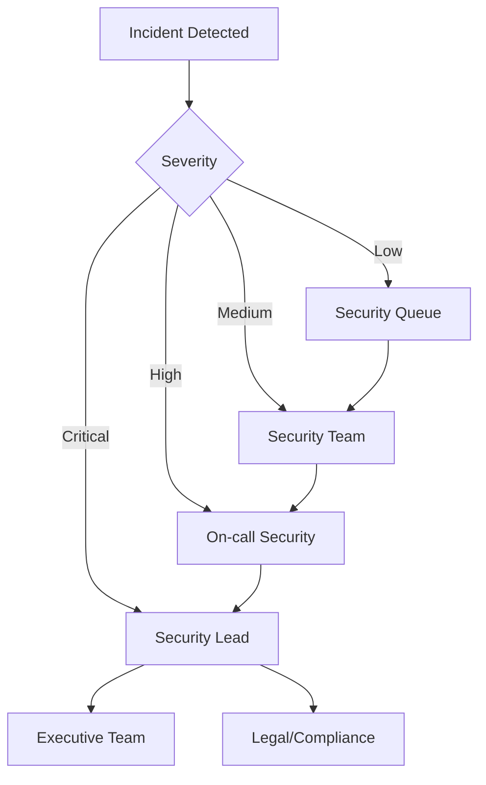

# SQL Injection Response

## Table of Contents
1. [Overview](#overview)
2. [Detection Indicators](#detection-indicators)
3. [Severity Classification](#severity-classification)
4. [Immediate Response Actions](#immediate-response-actions)
5. [Detailed Investigation Procedures](#detailed-investigation-procedures)
6. [Azure-Specific Response](#azure-specific-response)
7. [Remediation Steps](#remediation-steps)
8. [Evidence Collection](#evidence-collection)
9. [Mitigation Strategies](#mitigation-strategies)
10. [Post-Incident Actions](#post-incident-actions)
11. [Tools and Resources](#tools-and-resources)
12. [Automation Scripts](#automation-scripts)
13. [Best Practices](#best-practices)

## Overview

SQL injection attacks represent one of the most critical web application security threats. This document provides a comprehensive guide for responding to SQL injection incidents, including detection, immediate response, investigation, remediation, and long-term prevention strategies.

### Definition
SQL injection is a code injection technique that exploits vulnerabilities in an application's software when user input is not properly sanitized or validated before being included in SQL queries. Attackers can manipulate SQL queries to:
- Access unauthorized data
- Modify or delete database content
- Execute administrative operations
- Bypass authentication mechanisms
- Execute commands on the underlying operating system

### Common SQL Injection Types
1. **Classic SQL Injection**: Direct injection into SQL queries
2. **Blind SQL Injection**: Inferring data through true/false responses
3. **Time-Based Blind SQL Injection**: Using time delays to extract information
4. **Union-Based SQL Injection**: Using UNION SQL operator to combine results
5. **Error-Based SQL Injection**: Extracting data through database error messages
6. **Second-Order SQL Injection**: Injection payload executed in a different context

## Detection Indicators

### Log Analysis Indicators
Monitor logs for the following patterns:

```sql
-- Common SQL injection patterns to watch for:
' OR 1=1 --
'; DROP TABLE users; --
UNION SELECT * FROM information_schema.tables
SELECT @@version
SELECT * FROM users WHERE username = '' OR '1'='1'
```

### IDS/IPS Alerts
Configure detection rules for:
- Multiple single quotes in parameters
- SQL keywords in user input (UNION, SELECT, DROP, INSERT, UPDATE)
- Encoded SQL injection attempts (%27, %20OR%201=1)
- Time-based injection patterns (WAITFOR DELAY, SLEEP())

### Application Behavior Anomalies
- Unexpected database errors in logs
- Unusual query execution times
- Increased database resource consumption
- Unauthorized data access patterns
- Authentication bypass attempts

### Azure-Specific Indicators
```powershell
# Azure SQL Database threat detection alerts
- SQL_Injection
- SQL_Injection_Vulnerability
- Unsafe_Action
```

## Severity Classification

### Critical (P1)
- Successful data exfiltration confirmed
- Administrative access compromised
- Production database affected
- Customer data potentially exposed
- Authentication bypass achieved

### High (P2)
- SQL injection vulnerability confirmed but not exploited
- Non-production systems affected
- Limited data exposure risk
- Detection of automated scanning tools

### Medium (P3)
- Suspected SQL injection attempts blocked
- Failed injection attempts detected
- Testing/development environments affected

### Low (P4)
- Vulnerability scanning detected
- Proof-of-concept testing observed
- No successful exploitation

## Immediate Response Actions

### 1. Initial Assessment (0-5 minutes)
```bash
# Document incident details
Incident ID: INC-SQLI-[YYYYMMDD]-[NUMBER]
Detection Time: [TIMESTAMP]
Affected Systems: [LIST]
Initial Severity: [P1/P2/P3/P4]
```

### 2. Containment Actions (5-15 minutes)

#### Network Level
```bash
# Block attacker IP using Azure Network Security Groups
az network nsg rule create \
  --resource-group [RESOURCE_GROUP] \
  --nsg-name [NSG_NAME] \
  --name Block_SQLi_Attacker \
  --priority 100 \
  --source-address-prefixes [ATTACKER_IP] \
  --destination-port-ranges '*' \
  --access Deny
```

#### Application Level
```python
# Implement emergency WAF rules
waf_rule = {
    "name": "Emergency_SQLi_Block",
    "priority": 1,
    "rule_type": "MatchRule",
    "match_conditions": [{
        "match_variables": [{
            "variable_name": "RequestBody",
            "selector": "*"
        }],
        "operator": "Contains",
        "match_values": ["UNION", "SELECT", "DROP", "'OR'1'='1"]
    }],
    "action": "Block"
}
```

#### Database Level
```sql
-- Temporarily restrict database access
ALTER LOGIN [suspicious_account] DISABLE;
-- Revoke permissions if necessary
REVOKE EXECUTE ON DATABASE::[database_name] FROM [suspicious_user];
```

### 3. Notification Procedures (15-30 minutes)

#### Stakeholder Matrix
| Role | Contact Method | Notification Time |
|------|---------------|-------------------|
| Security Team Lead | Phone + Email | Immediate |
| Database Administrator | Phone + Email | Within 5 minutes |
| Application Owner | Email + Teams | Within 10 minutes |
| Legal/Compliance | Email | Within 30 minutes |
| Executive Team | Email Summary | Within 1 hour |

## Detailed Investigation Procedures

### Phase 1: Attack Vector Identification

#### Web Server Log Analysis
```bash
# Search for SQL injection patterns in IIS logs
Get-Content C:\inetpub\logs\LogFiles\W3SVC1\*.log | Select-String -Pattern "('|%27|UNION|SELECT|DROP|INSERT|UPDATE|DELETE)" | Out-File SQLi_Suspects.txt

# Linux/Apache equivalent
grep -E "('|%27|UNION|SELECT|DROP|INSERT|UPDATE|DELETE)" /var/log/apache2/access.log > sqli_suspects.txt
```

#### Application Log Analysis
```csharp
// Search application logs for SQL errors
var sqlErrors = LogManager.GetLogger()
    .GetLogs()
    .Where(log => log.Message.Contains("SqlException") || 
                  log.Message.Contains("syntax error") ||
                  log.Message.Contains("unclosed quotation"))
    .ToList();
```

### Phase 2: Impact Assessment

#### Data Access Audit
```sql
-- Check recent database access patterns
SELECT 
    session_id,
    login_name,
    host_name,
    program_name,
    client_interface_name,
    login_time,
    last_request_start_time,
    last_request_end_time
FROM sys.dm_exec_sessions
WHERE login_time > DATEADD(hour, -24, GETDATE())
ORDER BY login_time DESC;

-- Audit table modifications
SELECT 
    OBJECT_NAME(object_id) AS TableName,
    last_user_update,
    user_seeks,
    user_scans,
    user_lookups,
    user_updates
FROM sys.dm_db_index_usage_stats
WHERE database_id = DB_ID()
AND last_user_update > DATEADD(hour, -24, GETDATE());
```

#### Query History Analysis
```sql
-- Identify suspicious queries
SELECT 
    creation_time,
    last_execution_time,
    execution_count,
    total_worker_time,
    total_logical_reads,
    query_text = SUBSTRING(qt.text, (qs.statement_start_offset/2)+1,
        ((CASE qs.statement_end_offset
            WHEN -1 THEN DATALENGTH(qt.text)
            ELSE qs.statement_end_offset
        END - qs.statement_start_offset)/2)+1)
FROM sys.dm_exec_query_stats qs
CROSS APPLY sys.dm_exec_sql_text(qs.sql_handle) qt
WHERE creation_time > DATEADD(hour, -24, GETDATE())
AND qt.text LIKE '%UNION%' OR qt.text LIKE '%information_schema%'
ORDER BY creation_time DESC;
```

### Phase 3: Vulnerability Identification

#### Code Review Checklist
- [ ] Parameterized queries usage
- [ ] Input validation implementation
- [ ] Stored procedure security
- [ ] Dynamic SQL usage
- [ ] Error handling and information disclosure
- [ ] Database permission model

#### Automated Scanning
```powershell
# Run SQL injection vulnerability scanner
sqlmap -u "https://example.com/page.aspx?id=1" --batch --risk=3 --level=5 --threads=10 --output-dir=./sqlmap_results

# OWASP ZAP scanning
zap-cli quick-scan --spider -r https://example.com -f json -o zap_report.json
```

## Azure-Specific Response

### Azure SQL Database Protection
```powershell
# Enable Advanced Threat Protection
Set-AzSqlDatabaseAdvancedThreatProtectionSetting `
    -ResourceGroupName "myResourceGroup" `
    -ServerName "myserver" `
    -DatabaseName "mydatabase" `
    -StorageAccountName "mystorageaccount" `
    -EmailAdmins $true `
    -ExcludedDetectionType @()

# Configure audit logging
Set-AzSqlDatabaseAudit `
    -ResourceGroupName "myResourceGroup" `
    -ServerName "myserver" `
    -DatabaseName "mydatabase" `
    -AuditActionGroup "BATCH_STARTED_GROUP","FAILED_DATABASE_AUTHENTICATION_GROUP" `
    -StorageAccountName "mystorageaccount" `
    -RetentionInDays 90
```

### Azure Web Application Firewall
```json
{
  "name": "SQLiProtectionRule",
  "priority": 1,
  "ruleType": "MatchRule",
  "matchConditions": [
    {
      "matchVariables": [
        {
          "variableName": "RequestBody"
        }
      ],
      "operator": "ContainsAny",
      "matchValues": [
        "' OR 1=1",
        "'; DROP TABLE",
        "UNION SELECT",
        "/**/",
        "xp_cmdshell"
      ],
      "transforms": ["Lowercase", "UrlDecode", "HtmlEntityDecode"]
    }
  ],
  "action": "Block"
}
```

## Remediation Steps

### Immediate Fixes

#### 1. Parameterized Query Implementation
```csharp
// Vulnerable code - DO NOT USE
string query = "SELECT * FROM Users WHERE Username = '" + username + "'";

// Secure implementation
using (SqlCommand cmd = new SqlCommand("SELECT * FROM Users WHERE Username = @Username", connection))
{
    cmd.Parameters.AddWithValue("@Username", username);
    // Execute query
}
```

#### 2. Stored Procedure Security
```sql
-- Secure stored procedure
CREATE PROCEDURE GetUserByUsername
    @Username NVARCHAR(50)
AS
BEGIN
    SET NOCOUNT ON;
    SELECT UserId, Username, Email
    FROM Users
    WHERE Username = @Username;
END
```

#### 3. Input Validation
```csharp
public class UserInput
{
    [Required]
    [RegularExpression(@"^[a-zA-Z0-9_-]{3,20}$")]
    public string Username { get; set; }
    
    [Required]
    [EmailAddress]
    public string Email { get; set; }
}

// Validation method
public bool ValidateInput(string input)
{
    // Whitelist allowed characters
    var allowedChars = new Regex(@"^[a-zA-Z0-9\s\-_@.]+$");
    if (!allowedChars.IsMatch(input))
    {
        return false;
    }
    
    // Check for SQL keywords
    string[] sqlKeywords = { "SELECT", "INSERT", "UPDATE", "DELETE", "DROP", "UNION", "EXEC" };
    foreach (var keyword in sqlKeywords)
    {
        if (input.ToUpper().Contains(keyword))
        {
            return false;
        }
    }
    
    return true;
}
```

### Long-term Solutions

#### 1. ORM Implementation
```csharp
// Entity Framework example
public async Task<User> GetUserAsync(string username)
{
    using (var context = new ApplicationDbContext())
    {
        return await context.Users
            .FirstOrDefaultAsync(u => u.Username == username);
    }
}
```

#### 2. Least Privilege Database Access
```sql
-- Create application-specific login
CREATE LOGIN [AppLogin] WITH PASSWORD = 'StrongPassword123!';
CREATE USER [AppUser] FOR LOGIN [AppLogin];

-- Grant minimal permissions
GRANT SELECT ON dbo.Users TO [AppUser];
GRANT INSERT ON dbo.Orders TO [AppUser];
DENY DELETE ON SCHEMA::dbo TO [AppUser];
```

#### 3. Error Handling
```csharp
try
{
    // Database operation
}
catch (SqlException ex)
{
    // Log detailed error internally
    _logger.LogError(ex, "Database error occurred");
    
    // Return generic error to user
    return new ErrorResponse
    {
        Message = "An error occurred processing your request",
        ErrorCode = "DB_ERROR_001"
    };
}
```

## Evidence Collection

### Forensic Data Gathering

#### 1. Network Traffic Capture
```bash
# Capture traffic for analysis
tcpdump -i eth0 -w sqli_incident.pcap 'port 443 or port 80 or port 1433'

# Azure Network Watcher packet capture
az network watcher packet-capture create \
    --resource-group myResourceGroup \
    --vm myVM \
    --name sqlInjectionCapture \
    --storage-account myStorageAccount
```

#### 2. Log Preservation
```powershell
# Archive relevant logs
$incidentId = "INC-SQLI-20240513-001"
$logPath = "C:\IncidentResponse\$incidentId"
New-Item -ItemType Directory -Path $logPath

# Collect IIS logs
Copy-Item -Path "C:\inetpub\logs\LogFiles\*" -Destination "$logPath\IIS_Logs" -Recurse

# Collect application logs
Copy-Item -Path "C:\Applications\MyApp\Logs\*" -Destination "$logPath\App_Logs" -Recurse

# Export event logs
wevtutil epl Security "$logPath\Security.evtx"
wevtutil epl Application "$logPath\Application.evtx"
```

#### 3. Database Audit Trail
```sql
-- Export audit data
SELECT *
INTO OUTFILE '/backup/sql_injection_audit.csv'
FIELDS TERMINATED BY ','
ENCLOSED BY '"'
LINES TERMINATED BY '\n'
FROM sys.dm_audit_actions
WHERE action_time > DATEADD(day, -7, GETDATE());
```

## Mitigation Strategies

### Technical Controls

#### 1. Web Application Firewall Rules
```json
{
  "customRules": [
    {
      "name": "PreventSQLi",
      "priority": 1,
      "ruleType": "MatchRule",
      "matchConditions": [
        {
          "matchVariables": [
            {"variableName": "RequestBody"},
            {"variableName": "RequestUri"},
            {"variableName": "QueryString"}
          ],
          "operator": "RegEx",
          "negationConditon": false,
          "matchValues": [
            "(\\b(ALTER|CREATE|DELETE|DROP|EXEC(UTE)?|INSERT( +INTO)?|MERGE|SELECT|UPDATE|UNION( +ALL)?)\\b)",
            "(--)|(;)|(\\|\\|)|(\\*)",
            "(\\b(AND|OR)\\b\\s*\\(?\\s*\\d+\\s*(=|>|<)\\s*\\d+)",
            "('\\s*OR\\s*'1'\\s*=\\s*'1)",
            "(\\bWAITFOR\\s+DELAY\\s+'\\d+:\\d+:\\d+')",
            "(\\bBENCHMARK\\s*\\(\\s*\\d+\\s*,\\s*\\w+\\s*\\))"
          ],
          "transforms": ["UrlDecode", "HtmlEntityDecode", "Lowercase", "RemoveNulls"]
        }
      ],
      "action": "Block"
    }
  ]
}
```

#### 2. Database Activity Monitoring
```sql
-- Create audit specification
CREATE DATABASE AUDIT SPECIFICATION [SqlInjectionAudit]
FOR SERVER AUDIT [ServerAudit]
ADD (SELECT ON SCHEMA::[dbo] BY [public]),
ADD (INSERT ON SCHEMA::[dbo] BY [public]),
ADD (UPDATE ON SCHEMA::[dbo] BY [public]),
ADD (DELETE ON SCHEMA::[dbo] BY [public]),
ADD (EXECUTE ON SCHEMA::[dbo] BY [public])
WITH (STATE = ON);
```

#### 3. Runtime Application Self-Protection (RASP)
```csharp
public class SqlInjectionProtectionAttribute : ActionFilterAttribute
{
    private readonly string[] _dangerousPatterns = new[]
    {
        @"(\b(SELECT|UPDATE|INSERT|DELETE|DROP|UNION|EXEC)\b)",
        @"(--)|(;)|(\/\*)",
        @"('(''|[^'])*')",
        @"(xp_|sp_)",
        @"(WAITFOR\s+DELAY)",
        @"(BENCHMARK\s*\()"
    };

    public override void OnActionExecuting(ActionExecutingContext context)
    {
        foreach (var parameter in context.ActionArguments)
        {
            if (parameter.Value is string stringValue)
            {
                foreach (var pattern in _dangerousPatterns)
                {
                    if (Regex.IsMatch(stringValue, pattern, RegexOptions.IgnoreCase))
                    {
                        context.Result = new BadRequestObjectResult(new
                        {
                            error = "Invalid input detected",
                            timestamp = DateTime.UtcNow
                        });
                        
                        // Log the attempt
                        LogSecurityEvent(context.HttpContext, stringValue, pattern);
                        return;
                    }
                }
            }
        }
        
        base.OnActionExecuting(context);
    }
}
```

### Administrative Controls

#### 1. Security Policies
- Mandatory code reviews for database-interacting code
- Regular security training for developers
- Incident response plan updates
- Vulnerability disclosure procedures

#### 2. Change Management
```yaml
database_change_requirements:
  - code_review: mandatory
  - security_scan: mandatory
  - approval_required: 
    - development_lead
    - security_team
  - testing_requirements:
    - unit_tests: required
    - integration_tests: required
    - security_tests: required
    - penetration_test: quarterly
```

## Post-Incident Actions

### Lessons Learned Meeting

#### Agenda Template
1. Incident Timeline Review (15 minutes)
2. Detection Effectiveness (10 minutes)
3. Response Effectiveness (10 minutes)
4. Technical Root Cause Analysis (20 minutes)
5. Process Improvements (15 minutes)
6. Action Items Assignment (10 minutes)

### Technical Improvements

#### 1. Security Testing Integration
```yaml
# CI/CD Pipeline Security Tests
security_tests:
  - stage: security_scan
    jobs:
      - job: dependency_check
        script: |
          dependency-check --project MyApp --scan . --format JSON --out dependency-report.json
      
      - job: static_analysis
        script: |
          sonarqube-scanner \
            -Dsonar.projectKey=MyApp \
            -Dsonar.sources=. \
            -Dsonar.host.url=http://sonarqube:9000
      
      - job: dynamic_analysis
        script: |
          owasp-zap -daemon -port 8080 -config api.key=12345
          zap-cli quick-scan --spider -r http://test.app
          zap-cli report -o zap-report.html -f html
```

#### 2. Monitoring Enhancements
```python
# Enhanced SQL injection detection
import re
from datetime import datetime

class SqlInjectionDetector:
    def __init__(self):
        self.patterns = [
            (r"(\b(SELECT|UPDATE|INSERT|DELETE|DROP|UNION)\b)", "SQL_KEYWORD"),
            (r"('|\"|;|--|\*|/*|*/|xp_|sp_)", "SQL_SPECIAL_CHAR"),
            (r"(WAITFOR\s+DELAY|BENCHMARK\s*\(|SLEEP\s*\()", "TIME_BASED"),
            (r"(@@\w+|DATABASE\(\)|USER\(\)|VERSION\(\))", "INFO_GATHERING"),
            (r"(\bOR\b\s*\d+\s*=\s*\d+|\bAND\b\s*\d+\s*=\s*\d+)", "BOOLEAN_LOGIC")
        ]
    
    def analyze_request(self, request_data):
        alerts = []
        for pattern, category in self.patterns:
            if re.search(pattern, request_data, re.IGNORECASE):
                alerts.append({
                    "timestamp": datetime.utcnow(),
                    "category": category,
                    "pattern": pattern,
                    "data": request_data[:500]  # Truncate for logging
                })
        return alerts
```

### Documentation Updates

#### 1. Runbook Updates
- Add new detection patterns discovered
- Update response procedures based on lessons learned
- Include new tools or scripts developed
- Update contact information

#### 2. Knowledge Base Articles
```markdown
# SQL Injection Incident - [DATE]

## Summary
Brief description of the incident

## Root Cause
Technical explanation of the vulnerability

## Resolution
Steps taken to resolve the issue

## Prevention
Long-term preventive measures implemented

## Lessons Learned
Key takeaways and improvements made
```

## Tools and Resources

### Detection Tools
1. **OWASP ZAP**: Web application security scanner
2. **SQLMap**: Automated SQL injection tool
3. **Burp Suite**: Web vulnerability scanner
4. **ModSecurity**: Open-source WAF

### Analysis Tools
```bash
# Log analysis tools
grep, awk, sed              # Unix text processing
LogParser                   # Windows log analysis
Splunk                      # Enterprise log management
ELK Stack                   # Elasticsearch, Logstash, Kibana
```

### Response Tools
```python
# Automated response script
import requests
import json
from datetime import datetime

class SqlInjectionResponder:
    def __init__(self, waf_endpoint, db_endpoint):
        self.waf_endpoint = waf_endpoint
        self.db_endpoint = db_endpoint
    
    def block_ip(self, ip_address, reason):
        """Block an IP address at the WAF level"""
        payload = {
            "action": "block",
            "ip": ip_address,
            "reason": reason,
            "duration": 3600,  # 1 hour
            "timestamp": datetime.utcnow().isoformat()
        }
        
        response = requests.post(
            f"{self.waf_endpoint}/rules",
            json=payload,
            headers={"Authorization": f"Bearer {self.waf_token}"}
        )
        
        return response.json()
    
    def isolate_database_user(self, username):
        """Temporarily disable a database user"""
        payload = {
            "action": "disable",
            "username": username,
            "reason": "SQL injection investigation",
            "timestamp": datetime.utcnow().isoformat()
        }
        
        response = requests.post(
            f"{self.db_endpoint}/users/disable",
            json=payload,
            headers={"Authorization": f"Bearer {self.db_token}"}
        )
        
        return response.json()
```

### Azure Resources
- [Azure Security Center](https://azure.microsoft.com/services/security-center/)
- [Azure Sentinel](https://azure.microsoft.com/services/azure-sentinel/)
- [Azure SQL Database Threat Detection](https://docs.microsoft.com/azure/sql-database/sql-database-threat-detection)
- [Azure Web Application Firewall](https://docs.microsoft.com/azure/web-application-firewall/)

## Automation Scripts

### Automated Response Script
```powershell
# SQL Injection Automated Response Script
param(
    [Parameter(Mandatory=$true)]
    [string]$IncidentId,
    
    [Parameter(Mandatory=$true)]
    [string]$AttackerIP,
    
    [Parameter(Mandatory=$true)]
    [string]$TargetApplication,
    
    [Parameter(Mandatory=$false)]
    [string]$Severity = "High"
)

# Import required modules
Import-Module Az.Network
Import-Module Az.Sql
Import-Module Az.Monitor

# Configuration
$LogPath = "C:\SecurityIncidents\SQLInjection\$IncidentId"
$NSGName = "Web-NSG"
$ResourceGroup = "Production-RG"
$SQLServer = "prod-sql-server"
$Database = "ApplicationDB"

# Create incident directory
New-Item -ItemType Directory -Path $LogPath -Force

# Function to log actions
function Write-IncidentLog {
    param($Message)
    $Timestamp = Get-Date -Format "yyyy-MM-dd HH:mm:ss"
    "$Timestamp - $Message" | Out-File -FilePath "$LogPath\response.log" -Append
}

# Step 1: Block attacker IP
Write-IncidentLog "Blocking IP: $AttackerIP"
$rule = New-AzNetworkSecurityRuleConfig `
    -Name "Block_SQLi_$IncidentId" `
    -Description "SQL Injection Response - $IncidentId" `
    -Access Deny `
    -Protocol * `
    -Direction Inbound `
    -Priority 100 `
    -SourceAddressPrefix $AttackerIP `
    -SourcePortRange * `
    -DestinationAddressPrefix * `
    -DestinationPortRange *

$nsg = Get-AzNetworkSecurityGroup -Name $NSGName -ResourceGroupName $ResourceGroup
$nsg.SecurityRules.Add($rule)
Set-AzNetworkSecurityGroup -NetworkSecurityGroup $nsg

# Step 2: Enable SQL Threat Detection if not already enabled
Write-IncidentLog "Enabling SQL Threat Detection"
Set-AzSqlDatabaseAdvancedThreatProtectionSetting `
    -ResourceGroupName $ResourceGroup `
    -ServerName $SQLServer `
    -DatabaseName $Database `
    -StorageAccountName "securitylogs" `
    -EmailAdmins $true

# Step 3: Capture current connections
Write-IncidentLog "Capturing database connections"
$query = @"
SELECT 
    session_id,
    login_name,
    host_name,
    program_name,
    client_interface_name,
    login_time,
    last_request_start_time
FROM sys.dm_exec_sessions
WHERE database_id = DB_ID('$Database')
ORDER BY login_time DESC
"@

Invoke-Sqlcmd -ServerInstance $SQLServer -Database $Database -Query $query | 
    Export-Csv "$LogPath\active_connections.csv" -NoTypeInformation

# Step 4: Create alert rule
Write-IncidentLog "Creating alert rule"
$condition = New-AzMetricAlertRuleV2Criteria `
    -MetricName "sql_injection_attempts" `
    -Operator GreaterThan `
    -Threshold 1 `
    -TimeAggregation Count

$alert = Add-AzMetricAlertRuleV2 `
    -Name "SQLi_Alert_$IncidentId" `
    -ResourceGroupName $ResourceGroup `
    -WindowSize (New-TimeSpan -Minutes 5) `
    -Frequency (New-TimeSpan -Minutes 1) `
    -TargetResourceId "/subscriptions/.../databases/$Database" `
    -Criteria $condition `
    -Severity 0

# Step 5: Generate incident report
Write-IncidentLog "Generating incident report"
$Report = @{
    IncidentId = $IncidentId
    Timestamp = Get-Date
    AttackerIP = $AttackerIP
    TargetApplication = $TargetApplication
    Severity = $Severity
    ResponseActions = @(
        "Blocked attacker IP in NSG",
        "Enabled SQL Threat Detection",
        "Captured active connections",
        "Created monitoring alert",
        "Generated incident report"
    )
    Status = "Contained"
}

$Report | ConvertTo-Json -Depth 3 | Out-File "$LogPath\incident_report.json"

# Step 6: Send notification
$Subject = "SQL Injection Incident - $IncidentId"
$Body = @"
SQL Injection incident detected and responded to automatically.

Incident ID: $IncidentId
Attacker IP: $AttackerIP
Target: $TargetApplication
Severity: $Severity
Status: Contained

Actions Taken:
- Blocked attacker IP
- Enabled advanced threat protection
- Captured forensic data
- Created monitoring alerts

Please review the incident at: $LogPath
"@

Send-MailMessage `
    -To "security-team@company.com" `
    -From "security-alerts@company.com" `
    -Subject $Subject `
    -Body $Body `
    -SmtpServer "smtp.company.com"

Write-IncidentLog "Response completed successfully"
```

### Vulnerability Assessment Script
```python
#!/usr/bin/env python3
"""
SQL Injection Vulnerability Assessment Script
Performs automated checks for common SQL injection vulnerabilities
"""

import requests
import time
import json
import argparse
from urllib.parse import urljoin, quote
from datetime import datetime

class SQLiAssessment:
    def __init__(self, target_url, verbose=False):
        self.target_url = target_url
        self.verbose = verbose
        self.vulnerabilities = []
        self.test_payloads = [
            ("'", "Single quote test"),
            ("1' OR '1'='1", "Basic OR injection"),
            ("1' OR '1'='1' --", "OR injection with comment"),
            ("1' UNION SELECT NULL--", "UNION injection test"),
            ("1'; DROP TABLE test--", "Command injection test"),
            ("1' AND SLEEP(5)--", "Time-based blind injection"),
            ("1' AND 1=1--", "Boolean-based blind injection"),
            ("admin'--", "Authentication bypass"),
            ("' OR 1=1#", "MySQL comment injection"),
            ("'; WAITFOR DELAY '00:00:05'--", "SQL Server time delay"),
            ("1' ORDER BY 1--", "Column enumeration"),
            ("1' AND @@version--", "Version disclosure"),
            ("-1' UNION SELECT @@version--", "Version extraction"),
            ("' HAVING 1=1--", "HAVING clause injection"),
            ("' GROUP BY 1--", "GROUP BY injection")
        ]
    
    def test_endpoint(self, endpoint, method='GET', data=None):
        """Test a single endpoint for SQL injection"""
        results = []
        url = urljoin(self.target_url, endpoint)
        
        for payload, description in self.test_payloads:
            if self.verbose:
                print(f"Testing: {description}")
            
            try:
                if method == 'GET':
                    # Test in query parameters
                    test_url = f"{url}?id={quote(payload)}"
                    start_time = time.time()
                    response = requests.get(test_url, timeout=10)
                    response_time = time.time() - start_time
                else:
                    # Test in POST body
                    test_data = {key: payload for key in (data or {'id': ''})}
                    start_time = time.time()
                    response = requests.post(url, data=test_data, timeout=10)
                    response_time = time.time() - start_time
                
                # Analyze response
                vulnerability_indicators = [
                    "sql syntax",
                    "mysql_fetch",
                    "ORA-01756",
                    "SQLServer",
                    "Incorrect syntax",
                    "Unclosed quotation mark",
                    "[Microsoft][ODBC SQL Server Driver]",
                    "Warning: mysql_",
                    "valid MySQL result",
                    "PostgreSQL query failed",
                    "Warning: pg_",
                    "column does not exist",
                    "the used select statements have different number of columns"
                ]
                
                is_vulnerable = False
                error_type = None
                
                # Check for SQL errors in response
                response_text = response.text.lower()
                for indicator in vulnerability_indicators:
                    if indicator.lower() in response_text:
                        is_vulnerable = True
                        error_type = indicator
                        break
                
                # Check for time-based vulnerabilities
                if "SLEEP" in payload or "WAITFOR" in payload:
                    if response_time > 4.5:  # Expected 5 second delay
                        is_vulnerable = True
                        error_type = "Time-based SQL injection"
                
                # Check for boolean-based vulnerabilities
                if "1=1" in payload and response.status_code == 200:
                    # Compare with false condition
                    false_payload = payload.replace("1=1", "1=2")
                    false_response = requests.get(
                        f"{url}?id={quote(false_payload)}", 
                        timeout=10
                    )
                    if len(response.text) != len(false_response.text):
                        is_vulnerable = True
                        error_type = "Boolean-based blind SQL injection"
                
                if is_vulnerable:
                    vulnerability = {
                        "endpoint": endpoint,
                        "method": method,
                        "payload": payload,
                        "description": description,
                        "error_type": error_type,
                        "response_code": response.status_code,
                        "response_time": response_time,
                        "timestamp": datetime.utcnow().isoformat()
                    }
                    results.append(vulnerability)
                    self.vulnerabilities.append(vulnerability)
                    
                    if self.verbose:
                        print(f"  [!] VULNERABLE: {error_type}")
            
            except requests.exceptions.Timeout:
                if "SLEEP" in payload or "WAITFOR" in payload:
                    # Timeout might indicate successful time-based injection
                    vulnerability = {
                        "endpoint": endpoint,
                        "method": method,
                        "payload": payload,
                        "description": description,
                        "error_type": "Possible time-based injection (timeout)",
                        "timestamp": datetime.utcnow().isoformat()
                    }
                    results.append(vulnerability)
                    self.vulnerabilities.append(vulnerability)
            
            except Exception as e:
                if self.verbose:
                    print(f"  Error: {str(e)}")
        
        return results
    
    def generate_report(self):
        """Generate assessment report"""
        report = {
            "assessment_date": datetime.utcnow().isoformat(),
            "target_url": self.target_url,
            "vulnerabilities_found": len(self.vulnerabilities),
            "risk_level": self._calculate_risk_level(),
            "vulnerabilities": self.vulnerabilities,
            "recommendations": self._generate_recommendations()
        }
        
        return report
    
    def _calculate_risk_level(self):
        """Calculate overall risk level"""
        if not self.vulnerabilities:
            return "Low"
        
        critical_indicators = ["DROP", "DELETE", "UPDATE", "INSERT"]
        critical_vulns = sum(1 for v in self.vulnerabilities 
                           if any(ind in v['payload'] for ind in critical_indicators))
        
        if critical_vulns > 0:
            return "Critical"
        elif len(self.vulnerabilities) > 5:
            return "High"
        elif len(self.vulnerabilities) > 2:
            return "Medium"
        else:
            return "Low"
    
    def _generate_recommendations(self):
        """Generate security recommendations"""
        recommendations = [
            "Implement parameterized queries for all database interactions",
            "Use stored procedures with proper input validation",
            "Apply principle of least privilege to database accounts",
            "Enable SQL query logging and monitoring",
            "Implement Web Application Firewall (WAF) rules",
            "Conduct regular security assessments",
            "Provide security training to development team"
        ]
        
        if self.vulnerabilities:
            recommendations.insert(0, "URGENT: Address identified SQL injection vulnerabilities immediately")
        
        return recommendations
    
    def save_report(self, filename):
        """Save report to file"""
        report = self.generate_report()
        with open(filename, 'w') as f:
            json.dump(report, f, indent=2)
        print(f"Report saved to: {filename}")


def main():
    parser = argparse.ArgumentParser(description='SQL Injection Vulnerability Assessment')
    parser.add_argument('url', help='Target URL to assess')
    parser.add_argument('-e', '--endpoints', nargs='+', 
                       default=['/', '/login', '/search', '/user', '/admin'],
                       help='Endpoints to test')
    parser.add_argument('-v', '--verbose', action='store_true', 
                       help='Verbose output')
    parser.add_argument('-o', '--output', default='sqli_assessment.json',
                       help='Output file for report')
    
    args = parser.parse_args()
    
    print(f"Starting SQL injection assessment for: {args.url}")
    assessor = SQLiAssessment(args.url, verbose=args.verbose)
    
    for endpoint in args.endpoints:
        print(f"\nTesting endpoint: {endpoint}")
        assessor.test_endpoint(endpoint)
    
    assessor.save_report(args.output)
    
    # Print summary
    report = assessor.generate_report()
    print(f"\nAssessment Complete")
    print(f"Vulnerabilities Found: {report['vulnerabilities_found']}")
    print(f"Risk Level: {report['risk_level']}")
    
    if report['vulnerabilities_found'] > 0:
        print("\nVulnerable Endpoints:")
        for vuln in report['vulnerabilities']:
            print(f"  - {vuln['endpoint']} ({vuln['method']}): {vuln['error_type']}")


if __name__ == "__main__":
    main()
```

## Best Practices

### Development Best Practices

#### 1. Secure Coding Standards
```csharp
// Secure Database Access Layer
public interface ISecureDataAccess
{
    Task<T> ExecuteQueryAsync<T>(string storedProcedure, object parameters);
    Task<int> ExecuteCommandAsync(string storedProcedure, object parameters);
}

public class SecureDataAccess : ISecureDataAccess
{
    private readonly string _connectionString;
    private readonly ILogger<SecureDataAccess> _logger;
    
    public SecureDataAccess(string connectionString, ILogger<SecureDataAccess> logger)
    {
        _connectionString = connectionString;
        _logger = logger;
    }
    
    public async Task<T> ExecuteQueryAsync<T>(string storedProcedure, object parameters)
    {
        try
        {
            using (var connection = new SqlConnection(_connectionString))
            {
                return await connection.QuerySingleOrDefaultAsync<T>(
                    storedProcedure,
                    parameters,
                    commandType: CommandType.StoredProcedure
                );
            }
        }
        catch (SqlException ex)
        {
            _logger.LogError(ex, "Database query failed");
            throw new DataAccessException("Query failed", ex);
        }
    }
    
    public async Task<int> ExecuteCommandAsync(string storedProcedure, object parameters)
    {
        try
        {
            using (var connection = new SqlConnection(_connectionString))
            {
                return await connection.ExecuteAsync(
                    storedProcedure,
                    parameters,
                    commandType: CommandType.StoredProcedure
                );
            }
        }
        catch (SqlException ex)
        {
            _logger.LogError(ex, "Database command failed");
            throw new DataAccessException("Command failed", ex);
        }
    }
}
```

#### 2. Input Validation Framework
```csharp
public class InputValidator
{
    private readonly List<IValidationRule> _rules;
    
    public InputValidator()
    {
        _rules = new List<IValidationRule>
        {
            new SqlInjectionRule(),
            new XssRule(),
            new LengthRule(),
            new RegexRule()
        };
    }
    
    public ValidationResult Validate(string input, ValidationContext context)
    {
        var result = new ValidationResult { IsValid = true };
        
        foreach (var rule in _rules)
        {
            var ruleResult = rule.Validate(input, context);
            if (!ruleResult.IsValid)
            {
                result.IsValid = false;
                result.Errors.AddRange(ruleResult.Errors);
            }
        }
        
        return result;
    }
}

public class SqlInjectionRule : IValidationRule
{
    private readonly string[] _sqlKeywords = 
    {
        "SELECT", "INSERT", "UPDATE", "DELETE", "DROP", "CREATE",
        "ALTER", "UNION", "EXEC", "EXECUTE", "SCRIPT", "--", "/*", "*/"
    };
    
    public ValidationResult Validate(string input, ValidationContext context)
    {
        var result = new ValidationResult { IsValid = true };
        
        foreach (var keyword in _sqlKeywords)
        {
            if (input.Contains(keyword, StringComparison.OrdinalIgnoreCase))
            {
                result.IsValid = false;
                result.Errors.Add($"Potentially dangerous keyword detected: {keyword}");
            }
        }
        
        return result;
    }
}
```

### Operational Best Practices

#### 1. Monitoring Configuration
```yaml
# Azure Monitor Alert Rules for SQL Injection
alerts:
  - name: SQL_Injection_Detection
    condition:
      query: |
        AzureDiagnostics
        | where Category == "SQLSecurityAuditEvents"
        | where Statement_s contains_any ("UNION", "SELECT", "'OR'", "--")
        | where ActivityId_g != ""
      threshold: 1
      operator: GreaterThan
      timeWindow: PT5M
    actions:
      - type: Email
        recipients: ["security-team@company.com"]
      - type: Webhook
        uri: "https://incident.company.com/webhook"
      - type: RunBook
        name: "SQL_Injection_Response"
    severity: Critical
```

#### 2. Regular Security Assessments
```bash
#!/bin/bash
# Monthly SQL Injection Assessment Script

TARGETS=(
    "https://app1.company.com"
    "https://app2.company.com"
    "https://api.company.com"
)

DATE=$(date +%Y%m%d)
REPORT_DIR="/security/reports/sqli/$DATE"
mkdir -p "$REPORT_DIR"

for target in "${TARGETS[@]}"; do
    echo "Assessing: $target"
    
    # OWASP ZAP scan
    docker run -t owasp/zap2docker-stable zap-baseline.py \
        -t "$target" \
        -r "$REPORT_DIR/$(basename $target)_zap.html"
    
    # SQLMap scan
    sqlmap -u "$target" \
        --batch \
        --risk=3 \
        --level=5 \
        --output-dir="$REPORT_DIR/$(basename $target)_sqlmap"
    
    # Custom assessment
    python3 /security/scripts/sqli_assessment.py \
        "$target" \
        -o "$REPORT_DIR/$(basename $target)_custom.json"
done

# Generate consolidated report
python3 /security/scripts/generate_sqli_report.py \
    "$REPORT_DIR" \
    -o "$REPORT_DIR/consolidated_report.pdf"

# Send report
mail -s "Monthly SQL Injection Assessment - $DATE" \
    -a "$REPORT_DIR/consolidated_report.pdf" \
    security-team@company.com < /dev/null
```

### Escalation Path



---
*Document Version: 1.0*  
*Last Updated: [Current Date]*  
*Next Review: [Date + 3 months]*  
*Classification: Internal Use Only*