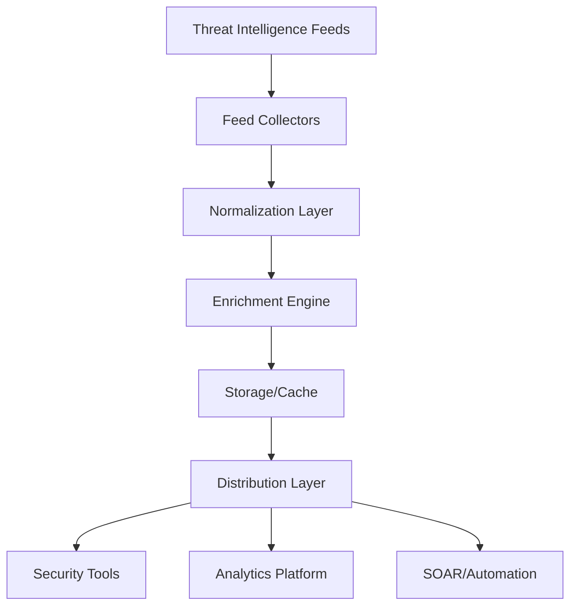

## Overview

Threat Intelligence Feeds are continuous streams of data regarding potential or current threats to an organization's security infrastructure. These feeds provide actionable intelligence that enables security teams to proactively defend against cyber threats, detect ongoing attacks, and respond effectively to security incidents.

## Table of Contents

1. [Introduction to Threat Intelligence](#introduction-to-threat-intelligence)
2. [Types of Threat Intelligence Feeds](#types-of-threat-intelligence-feeds)
3. [Major Threat Intelligence Feed Providers](#major-threat-intelligence-feed-providers)
4. [Open Source Intelligence (OSINT) Feeds](#open-source-intelligence-osint-feeds)
5. [Commercial Threat Intelligence Feeds](#commercial-threat-intelligence-feeds)
6. [Microsoft-Specific Threat Intelligence](#microsoft-specific-threat-intelligence)
7. [Feed Integration Architecture](#feed-integration-architecture)
8. [Data Formats and Standards](#data-formats-and-standards)
9. [Feed Processing and Enrichment](#feed-processing-and-enrichment)
10. [Implementation Best Practices](#implementation-best-practices)
11. [Azure Integration](#azure-integration)
12. [Automated Response Workflows](#automated-response-workflows)
13. [Feed Validation and Quality Assessment](#feed-validation-and-quality-assessment)
14. [Performance Optimization](#performance-optimization)
15. [Metrics and KPIs](#metrics-and-kpis)

## Introduction to Threat Intelligence

Threat Intelligence is evidence-based knowledge about an existing or emerging menace or hazard to assets that can be used to inform decisions regarding the subject's response to that menace or hazard.

### Key Components

- **Indicators of Compromise (IoCs)**: Observable artifacts that suggest a system has been compromised
- **Tactics, Techniques, and Procedures (TTPs)**: Behavior patterns of threat actors
- **Context**: Information that provides meaning to the indicators
- **Actionable Intelligence**: Information that can be acted upon immediately

### Intelligence Cycle

1. **Direction**: Define intelligence requirements
2. **Collection**: Gather raw data from various sources
3. **Processing**: Convert raw data into usable format
4. **Analysis**: Evaluate and interpret processed data
5. **Dissemination**: Distribute intelligence to stakeholders
6. **Feedback**: Assess effectiveness and refine process

## Types of Threat Intelligence Feeds

### 1. Strategic Intelligence

High-level information about threats, typically consumed by executives and decision-makers.

**Characteristics:**
- Long-term trends and patterns
- Risk assessments
- Threat actor motivations
- Industry-specific threats

**Example Format:**
```json
{
  \"report_type\": \"strategic\",
  \"threat_landscape\": {
    \"industry\": \"financial_services\",
    \"primary_threats\": [\"ransomware\", \"data_theft\", \"insider_threats\"],
    \"risk_level\": \"high\",
    \"trend\": \"increasing\"
  }
}
```

### 2. Tactical Intelligence

Information about threat actors' TTPs, used by security architects and managers.

**Characteristics:**
- Attack methodologies
- Tools and infrastructure
- Campaign information
- Defense recommendations

**Example Format:**
```json
{
  \"campaign_id\": \"APT28-2024-Q1\",
  \"actor\": \"APT28\",
  \"tactics\": [\"initial_access\", \"persistence\", \"lateral_movement\"],
  \"techniques\": {
    \"T1566\": \"Phishing\",
    \"T1053\": \"Scheduled Task/Job\"
  },
  \"mitigations\": [\"email_filtering\", \"endpoint_detection\"]
}
```

### 3. Operational Intelligence

Information about specific attacks, used by incident responders and SOC analysts.

**Characteristics:**
- Active campaigns
- Infrastructure details
- Communication channels
- Real-time updates

**Example Format:**
```json
{
  \"incident_id\": \"INC-2024-0542\",
  \"attack_type\": \"supply_chain\",
  \"affected_software\": \"SolarWinds\",
  \"c2_servers\": [\"192.168.1.100\", \"10.0.0.50\"],
  \"status\": \"active\",
  \"severity\": \"critical\"
}
```

### 4. Technical Intelligence

Specific indicators and artifacts, used by security tools and analysts.

**Characteristics:**
- IP addresses
- Domain names
- File hashes
- Network signatures

**Example Format:**
```json
{
  \"ioc_type\": \"technical\",
  \"indicators\": [
    {
      \"type\": \"ip\",
      \"value\": \"192.168.1.100\",
      \"confidence\": 95,
      \"last_seen\": \"2024-05-13T10:30:00Z\"
    },
    {
      \"type\": \"hash\",
      \"value\": \"d41d8cd98f00b204e9800998ecf8427e\",
      \"algorithm\": \"md5\",
      \"malware_family\": \"emotet\"
    }
  ]
}
```

## Major Threat Intelligence Feed Providers

### 1. MITRE ATT&CK

**Description**: Framework for understanding adversary behavior
**URL**: https://attack.mitre.org/
**Format**: STIX 2.0
**Coverage**: Global, all industries

**Integration Example:**
```python
import requests
from stix2 import TAXIICollectionSource

# Connect to MITRE ATT&CK TAXII server
collection = TAXIICollectionSource(
    url=\"https://cti-taxii.mitre.org/stix/collections/\",
    collection_id=\"95ecc380-afe9-11e4-9b6c-751b66dd541e\"
)

# Retrieve attack patterns
attack_patterns = collection.query([
    {
        \"field\": \"type\",
        \"op\": \"=\",
        \"value\": \"attack-pattern\"
    }
])
```

### 2. AlienVault OTX (Open Threat Exchange)

**Description**: Community-driven threat intelligence platform
**URL**: https://otx.alienvault.com/
**Format**: JSON, STIX
**Coverage**: Global, community-contributed

**API Integration:**
```python
from OTXv2 import OTXv2

otx = OTXv2(\"YOUR_API_KEY\")

# Get latest pulses
pulses = otx.getall_pulses(limit=10)

for pulse in pulses:
    print(f\"Title: {pulse['name']}\")
    print(f\"Tags: {pulse['tags']}\")
    print(f\"Indicators: {len(pulse['indicators'])}\")
```

### 3. Recorded Future

**Description**: Commercial threat intelligence platform
**Pricing**: Enterprise subscription
**Format**: JSON, STIX
**Coverage**: Global, all threat types

**Integration Example:**
```python
import requests

headers = {
    \"X-RFToken\": \"YOUR_API_TOKEN\"
}

# Get threat list
response = requests.get(
    \"https://api.recordedfuture.com/v2/threat/list\",
    headers=headers
)

threats = response.json()
```

### 4. CrowdStrike Falcon Intelligence

**Description**: Adversary intelligence and attribution
**Pricing**: Commercial
**Format**: JSON, STIX
**Coverage**: APT groups, cybercrime

**Integration:**
```python
from falconpy import Intel

falcon = Intel(
    client_id=\"YOUR_CLIENT_ID\",
    client_secret=\"YOUR_CLIENT_SECRET\"
)

# Get latest indicators
response = falcon.query_intel_indicators(
    filter=\"type:'domain'\",
    limit=100
)
```

## Open Source Intelligence (OSINT) Feeds

### 1. Abuse.ch Feeds

#### URLhaus
**Purpose**: Malicious URL tracking
**URL**: https://urlhaus.abuse.ch/
**Format**: CSV, JSON

```python
import requests
import csv

# Download URLhaus feed
response = requests.get(\"https://urlhaus.abuse.ch/downloads/csv_recent/\")
csv_data = csv.DictReader(response.text.splitlines())

for row in csv_data:
    print(f\"URL: {row['url']}\")
    print(f\"Threat: {row['threat']}\")
    print(f\"Date: {row['dateadded']}\")
```

#### Feodo Tracker
**Purpose**: Banking trojan C&C tracking
**URL**: https://feodotracker.abuse.ch/
**Format**: JSON, CSV

```json
{
  \"ip\": \"192.168.1.100\",
  \"port\": 443,
  \"malware\": \"Emotet\",
  \"status\": \"online\",
  \"country\": \"US\",
  \"first_seen\": \"2024-05-01\",
  \"last_online\": \"2024-05-13\"
}
```

### 2. Emerging Threats

**Description**: Community-based IDS rules and IP reputation
**URL**: https://rules.emergingthreats.net/
**Format**: Snort rules, IP lists

**Implementation:**
```bash
# Download ET compromise IP list
wget https://rules.emergingthreats.net/blockrules/compromised-ips.txt

# Integrate with firewall
while read ip; do
    iptables -A INPUT -s $ip -j DROP
done < compromised-ips.txt
```

### 3. CIRCL MISP Feeds

**Description**: Malware Information Sharing Platform feeds
**URL**: https://www.circl.lu/doc/misp/feed-osint/
**Format**: MISP JSON

```python
import requests
import json

# Get CIRCL OSINT feed
feed_url = \"https://www.circl.lu/doc/misp/feed-osint/feed.json\"
response = requests.get(feed_url)
feed_data = response.json()

for event in feed_data:
    print(f\"Event: {event['info']}\")
    print(f\"Date: {event['date']}\")
    print(f\"Threat Level: {event['threat_level_id']}\")
```

## Commercial Threat Intelligence Feeds

### 1. FireEye/Mandiant Advantage

**Features:**
- APT intelligence
- Malware analysis
- Vulnerability intelligence
- Incident response support

**Integration:**
```python
from mandiant_advantageapi import ThreatIntelligence

ti = ThreatIntelligence(api_key=\"YOUR_KEY\")

# Get latest threats
threats = ti.get_threats(
    limit=50,
    since=\"2024-05-01\"
)

for threat in threats:
    print(f\"Actor: {threat['actor']}\")
    print(f\"Malware: {threat['malware_families']}\")
```

### 2. Palo Alto Networks AutoFocus

**Features:**
- Malware analysis
- Threat hunting
- Tag-based intelligence
- WildFire integration

**API Usage:**
```python
import requests
import json

headers = {
    \"Content-Type\": \"application/json\",
    \"apikey\": \"YOUR_API_KEY\"
}

# Search for indicators
query = {
    \"query\": {
        \"operator\": \"all\",
        \"children\": [
            {
                \"field\": \"sample.malware\",
                \"operator\": \"is\",
                \"value\": 1
            }
        ]
    },
    \"size\": 50,
    \"scope\": \"global\"
}

response = requests.post(
    \"https://autofocus.paloaltonetworks.com/api/v1.0/samples/search\",
    headers=headers,
    data=json.dumps(query)
)
```

### 3. Symantec DeepSight Intelligence

**Features:**
- Vulnerability intelligence
- Threat intelligence
- Attack kits tracking
- Malware families

**Integration Example:**
```xml
<!-- DeepSight XML Feed Format -->
<threatintel>
    <report id=\"DS-2024-0001\">
        <title>New Ransomware Variant</title>
        <severity>high</severity>
        <indicators>
            <indicator type=\"md5\">d41d8cd98f00b204e9800998ecf8427e</indicator>
            <indicator type=\"domain\">malicious-domain.com</indicator>
            <indicator type=\"ip\">192.168.1.100</indicator>
        </indicators>
        <mitigations>
            <mitigation>Block listed IPs at firewall</mitigation>
            <mitigation>Update AV signatures</mitigation>
        </mitigations>
    </report>
</threatintel>
```

## Microsoft-Specific Threat Intelligence

### 1. Microsoft Defender Threat Intelligence (MDTI)

**Description**: Microsoft's premium threat intelligence service
**Integration**: Native Azure and M365 integration
**Coverage**: Global threats, Microsoft ecosystem

**PowerShell Integration:**
```powershell
# Connect to MDTI
Connect-MicrosoftDefender

# Get threat intelligence
$threats = Get-MdtiIndicators -Type \"IPAddress\" -Limit 100

foreach ($threat in $threats) {
    Write-Host \"Indicator: $($threat.Value)\"
    Write-Host \"Confidence: $($threat.Confidence)\"
    Write-Host \"Severity: $($threat.Severity)\"
}
```

### 2. Microsoft Security Graph API

**Description**: Unified API for Microsoft security products
**Format**: JSON
**Authentication**: OAuth 2.0

**Implementation:**
```python
import requests
from msal import ConfidentialClientApplication

# Setup authentication
app = ConfidentialClientApplication(
    client_id=\"YOUR_CLIENT_ID\",
    client_secret=\"YOUR_CLIENT_SECRET\",
    authority=\"https://login.microsoftonline.com/YOUR_TENANT_ID\"
)

token = app.acquire_token_for_client(
    scopes=[\"https://graph.microsoft.com/.default\"]
)

# Get security alerts
headers = {
    \"Authorization\": f\"Bearer {token['access_token']}\"
}

response = requests.get(
    \"https://graph.microsoft.com/v1.0/security/alerts\",
    headers=headers
)

alerts = response.json()[\"value\"]
```

### 3. Azure Sentinel Threat Intelligence

**Description**: Cloud-native SIEM threat intelligence
**Integration**: Built-in connectors
**Features**: TI matching, enrichment, analytics

**KQL Query Example:**
```kql
// Query threat intelligence indicators
ThreatIntelligenceIndicator
| where TimeGenerated > ago(24h)
| where ConfidenceScore > 80
| summarize count() by ThreatType, SourceSystem
| order by count_ desc

// Match indicators with events
let ti_ips = ThreatIntelligenceIndicator
| where TimeGenerated > ago(7d)
| where NetworkIP != \"\"
| distinct NetworkIP;
CommonSecurityLog
| where TimeGenerated > ago(24h)
| where DestinationIP in (ti_ips) or SourceIP in (ti_ips)
| project TimeGenerated, SourceIP, DestinationIP, Activity
```

## Feed Integration Architecture

### Reference Architecture



### Component Details

#### 1. Feed Collectors

**Purpose**: Retrieve data from various sources
**Technologies**: Python, PowerShell, APIs
**Considerations**: Rate limiting, authentication

```python
import asyncio
import aiohttp
from typing import List, Dict

class FeedCollector:
    def __init__(self, feeds: List[Dict]):
        self.feeds = feeds
        self.session = None
    
    async def collect_all(self):
        self.session = aiohttp.ClientSession()
        tasks = [self.collect_feed(feed) for feed in self.feeds]
        results = await asyncio.gather(*tasks)
        await self.session.close()
        return results
    
    async def collect_feed(self, feed: Dict):
        try:
            async with self.session.get(
                feed['url'],
                headers=feed.get('headers', {})
            ) as response:
                data = await response.json()
                return {
                    'source': feed['name'],
                    'data': data,
                    'timestamp': datetime.utcnow()
                }
        except Exception as e:
            return {
                'source': feed['name'],
                'error': str(e)
            }
```

#### 2. Normalization Layer

**Purpose**: Convert feeds to common format
**Standard**: STIX 2.1
**Benefits**: Consistency, interoperability

```python
from stix2 import Indicator, Bundle
import re

class FeedNormalizer:
    def normalize_ioc(self, ioc: Dict) -> Indicator:
        pattern = self._create_pattern(ioc)
        
        return Indicator(
            pattern=pattern,
            pattern_type=\"stix\",
            labels=[ioc.get('type', 'unknown')],
            confidence=ioc.get('confidence', 50),
            created_by_ref=ioc.get('source'),
            external_references=[{
                \"source_name\": ioc.get('source'),
                \"url\": ioc.get('reference_url')
            }]
        )
    
    def _create_pattern(self, ioc: Dict) -> str:
        ioc_type = ioc.get('type')
        value = ioc.get('value')
        
        if ioc_type == 'ip':
            return f\"[network-traffic:dst_ref.value = '{value}']\"
        elif ioc_type == 'domain':
            return f\"[domain-name:value = '{value}']\"
        elif ioc_type == 'hash':
            hash_type = ioc.get('hash_type', 'MD5')
            return f\"[file:hashes.{hash_type} = '{value}']\"
        else:
            return f\"[{ioc_type}:value = '{value}']\"
```

#### 3. Enrichment Engine

**Purpose**: Add context to indicators
**Sources**: GeoIP, WHOIS, VirusTotal
**Output**: Enriched intelligence

```python
import geoip2.database
import whois
import requests

class EnrichmentEngine:
    def __init__(self, vt_api_key: str):
        self.vt_api_key = vt_api_key
        self.geoip_reader = geoip2.database.Reader('GeoLite2-City.mmdb')
    
    async def enrich_ip(self, ip: str) -> Dict:
        enrichment = {}
        
        # GeoIP lookup
        try:
            response = self.geoip_reader.city(ip)
            enrichment['geo'] = {
                'country': response.country.name,
                'city': response.city.name,
                'latitude': response.location.latitude,
                'longitude': response.location.longitude
            }
        except:
            pass
        
        # VirusTotal lookup
        vt_url = f\"https://www.virustotal.com/api/v3/ip_addresses/{ip}\"
        headers = {\"x-apikey\": self.vt_api_key}
        
        response = requests.get(vt_url, headers=headers)
        if response.status_code == 200:
            vt_data = response.json()
            enrichment['reputation'] = {
                'malicious': vt_data['data']['attributes']['last_analysis_stats']['malicious'],
                'suspicious': vt_data['data']['attributes']['last_analysis_stats']['suspicious']
            }
        
        return enrichment
    
    async def enrich_domain(self, domain: str) -> Dict:
        enrichment = {}
        
        # WHOIS lookup
        try:
            w = whois.whois(domain)
            enrichment['whois'] = {
                'registrar': w.registrar,
                'creation_date': str(w.creation_date),
                'expiration_date': str(w.expiration_date)
            }
        except:
            pass
        
        return enrichment
```

### Storage Architecture

#### 1. Hot Storage (Redis)

**Purpose**: Fast access to recent indicators
**TTL**: 24-48 hours
**Use Case**: Real-time lookups

```python
import redis
import json
from datetime import timedelta

class ThreatIntelCache:
    def __init__(self, redis_host: str, redis_port: int):
        self.redis_client = redis.Redis(
            host=redis_host,
            port=redis_port,
            decode_responses=True
        )
    
    def store_indicator(self, indicator: Dict, ttl_hours: int = 24):
        key = f\"ti:{indicator['type']}:{indicator['value']}\"
        self.redis_client.setex(
            key,
            timedelta(hours=ttl_hours),
            json.dumps(indicator)
        )
    
    def get_indicator(self, ioc_type: str, value: str) -> Dict:
        key = f\"ti:{ioc_type}:{value}\"
        data = self.redis_client.get(key)
        return json.loads(data) if data else None
    
    def search_indicators(self, pattern: str) -> List[Dict]:
        keys = self.redis_client.keys(f\"ti:*:{pattern}*\")
        results = []
        for key in keys:
            data = self.redis_client.get(key)
            if data:
                results.append(json.loads(data))
        return results
```

#### 2. Warm Storage (Elasticsearch)

**Purpose**: Historical analysis, searching
**Retention**: 30-90 days
**Use Case**: Investigation, hunting

```python
from elasticsearch import Elasticsearch
from datetime import datetime

class ThreatIntelES:
    def __init__(self, es_host: str):
        self.es = Elasticsearch([es_host])
        self.index_name = \"threat-intel\"
    
    def index_indicator(self, indicator: Dict):
        indicator['@timestamp'] = datetime.utcnow()
        self.es.index(
            index=self.index_name,
            body=indicator
        )
    
    def search_indicators(self, query: Dict, size: int = 100):
        return self.es.search(
            index=self.index_name,
            body={
                \"query\": query,
                \"size\": size,
                \"sort\": [{\"@timestamp\": {\"order\": \"desc\"}}]
            }
        )
    
    def aggregate_by_source(self, days: int = 7):
        return self.es.search(
            index=self.index_name,
            body={
                \"query\": {
                    \"range\": {
                        \"@timestamp\": {
                            \"gte\": f\"now-{days}d\"
                        }
                    }
                },
                \"aggs\": {
                    \"sources\": {
                        \"terms\": {
                            \"field\": \"source.keyword\",
                            \"size\": 20
                        }
                    }
                }
            }
        )
```

#### 3. Cold Storage (Azure Blob)

**Purpose**: Long-term archival
**Retention**: 1+ years
**Format**: Compressed JSON/Parquet

```python
from azure.storage.blob import BlobServiceClient
import json
import gzip
from datetime import datetime

class ThreatIntelArchive:
    def __init__(self, connection_string: str):
        self.blob_service = BlobServiceClient.from_connection_string(
            connection_string
        )
        self.container_name = \"threat-intel-archive\"
    
    def archive_daily_data(self, date: str, data: List[Dict]):
        # Compress data
        json_data = json.dumps(data).encode('utf-8')
        compressed_data = gzip.compress(json_data)
        
        # Upload to blob
        blob_name = f\"{date}/threat_intel_{date}.json.gz\"
        blob_client = self.blob_service.get_blob_client(
            container=self.container_name,
            blob=blob_name
        )
        
        blob_client.upload_blob(compressed_data, overwrite=True)
    
    def retrieve_archived_data(self, date: str) -> List[Dict]:
        blob_name = f\"{date}/threat_intel_{date}.json.gz\"
        blob_client = self.blob_service.get_blob_client(
            container=self.container_name,
            blob=blob_name
        )
        
        # Download and decompress
        compressed_data = blob_client.download_blob().readall()
        json_data = gzip.decompress(compressed_data).decode('utf-8')
        
        return json.loads(json_data)
```

## Data Formats and Standards

### 1. STIX 2.1 (Structured Threat Information Expression)

**Purpose**: Standardized threat intelligence format
**Components**: Objects, relationships, markings

**Example STIX Bundle:**
```json
{
    \"type\": \"bundle\",
    \"id\": \"bundle--12345678-1234-1234-1234-123456789012\",
    \"objects\": [
        {
            \"type\": \"indicator\",
            \"spec_version\": \"2.1\",
            \"id\": \"indicator--87654321-4321-4321-4321-210987654321\",
            \"created\": \"2024-05-13T10:00:00.000Z\",
            \"modified\": \"2024-05-13T10:00:00.000Z\",
            \"name\": \"Malicious IP\",
            \"pattern\": \"[network-traffic:dst_ref.value = '192.168.1.100']\",
            \"pattern_type\": \"stix\",
            \"pattern_version\": \"2.1\",
            \"valid_from\": \"2024-05-13T10:00:00.000Z\",
            \"labels\": [\"malicious-activity\"],
            \"confidence\": 90,
            \"external_references\": [
                {
                    \"source_name\": \"OSINT Feed\",
                    \"url\": \"https://example.com/report\"
                }
            ]
        },
        {
            \"type\": \"malware\",
            \"spec_version\": \"2.1\",
            \"id\": \"malware--12345678-1234-1234-1234-123456789012\",
            \"created\": \"2024-05-13T10:00:00.000Z\",
            \"modified\": \"2024-05-13T10:00:00.000Z\",
            \"name\": \"Emotet\",
            \"malware_types\": [\"trojan\"],
            \"is_family\": true
        },
        {
            \"type\": \"relationship\",
            \"spec_version\": \"2.1\",
            \"id\": \"relationship--12345678-1234-1234-1234-123456789012\",
            \"created\": \"2024-05-13T10:00:00.000Z\",
            \"modified\": \"2024-05-13T10:00:00.000Z\",
            \"relationship_type\": \"indicates\",
            \"source_ref\": \"indicator--87654321-4321-4321-4321-210987654321\",
            \"target_ref\": \"malware--12345678-1234-1234-1234-123456789012\"
        }
    ]
}
```

### 2. MISP Format

**Purpose**: Malware Information Sharing Platform format
**Features**: Events, attributes, taxonomies

**Example MISP Event:**
```json
{
    \"Event\": {
        \"id\": \"1234\",
        \"org_id\": \"1\",
        \"date\": \"2024-05-13\",
        \"info\": \"Ransomware Campaign Targeting Healthcare\",
        \"threat_level_id\": \"1\",
        \"analysis\": \"2\",
        \"Attribute\": [
            {
                \"id\": \"5678\",
                \"type\": \"ip-dst\",
                \"category\": \"Network activity\",
                \"value\": \"192.168.1.100\",
                \"to_ids\": true,
                \"comment\": \"C2 server\",
                \"Tag\": [
                    {
                        \"name\": \"malware:ransomware\"
                    }
                ]
            },
            {
                \"id\": \"5679\",
                \"type\": \"md5\",
                \"category\": \"Payload delivery\",
                \"value\": \"d41d8cd98f00b204e9800998ecf8427e\",
                \"to_ids\": true,
                \"comment\": \"Ransomware payload\"
            }
        ],
        \"Tag\": [
            {
                \"name\": \"tlp:amber\"
            },
            {
                \"name\": \"type:ransomware\"
            }
        ]
    }
}
```

### 3. OpenIOC

**Purpose**: Indicator of Compromise format by Mandiant
**Format**: XML-based
**Use Case**: Incident response, forensics

**Example OpenIOC:**
```xml
<ioc xmlns=\"http://openioc.org/schemas/OpenIOC_1.1\">
    <metadata>
        <short_description>Emotet Infection</short_description>
        <description>Indicators for Emotet banking trojan</description>
        <authored_by>SOC Team</authored_by>
        <authored_date>2024-05-13T10:00:00</authored_date>
    </metadata>
    <criteria>
        <Indicator operator=\"OR\">
            <IndicatorItem condition=\"is\">
                <Context document=\"FileItem\" search=\"FileItem/Md5sum\" type=\"mir\"/>
                <Content type=\"md5\">d41d8cd98f00b204e9800998ecf8427e</Content>
            </IndicatorItem>
            <IndicatorItem condition=\"contains\">
                <Context document=\"Network\" search=\"Network/DNS\" type=\"network\"/>
                <Content type=\"string\">malicious-domain.com</Content>
            </IndicatorItem>
        </Indicator>
    </criteria>
</ioc>
```

### 4. CSV/TSV Formats

**Purpose**: Simple, human-readable format
**Use Case**: Quick imports, manual review

**Example CSV Format:**
```csv
indicator_type,value,confidence,source,first_seen,last_seen,tags
ip,192.168.1.100,95,OSINT,2024-05-01,2024-05-13,c2;emotet
domain,malicious.com,85,Commercial,2024-04-15,2024-05-10,phishing
hash,d41d8cd98f00b204e9800998ecf8427e,100,Internal,2024-05-13,2024-05-13,ransomware
url,http://bad-site.com/payload,90,Community,2024-05-12,2024-05-13,malware-distribution
```

## Feed Processing and Enrichment

### Processing Pipeline

```python
import asyncio
from typing import List, Dict
import logging

class ThreatIntelPipeline:
    def __init__(self):
        self.validators = []
        self.enrichers = []
        self.outputs = []
        self.logger = logging.getLogger(__name__)
    
    async def process_feed(self, feed_data: List[Dict]) -> List[Dict]:
        \"\"\"Main processing pipeline\"\"\"
        processed_data = []
        
        for item in feed_data:
            try:
                # Validation
                if not await self.validate_item(item):
                    continue
                
                # Enrichment
                enriched_item = await self.enrich_item(item)
                
                # Output
                await self.output_item(enriched_item)
                
                processed_data.append(enriched_item)
                
            except Exception as e:
                self.logger.error(f\"Error processing item: {e}\")
        
        return processed_data
    
    async def validate_item(self, item: Dict) -> bool:
        \"\"\"Validate indicator\"\"\"
        for validator in self.validators:
            if not await validator.validate(item):
                return False
        return True
    
    async def enrich_item(self, item: Dict) -> Dict:
        \"\"\"Enrich indicator with additional context\"\"\"
        enriched = item.copy()
        
        for enricher in self.enrichers:
            additional_data = await enricher.enrich(item)
            enriched.update(additional_data)
        
        return enriched
    
    async def output_item(self, item: Dict):
        \"\"\"Send to output destinations\"\"\"
        tasks = [output.send(item) for output in self.outputs]
        await asyncio.gather(*tasks)
```

### Validation Rules

```python
import re
import ipaddress
from datetime import datetime, timedelta

class IndicatorValidator:
    def __init__(self):
        self.ip_pattern = re.compile(r'^\\d{1,3}\\.\\d{1,3}\\.\\d{1,3}\\.\\d{1,3}$')
        self.domain_pattern = re.compile(
            r'^([a-zA-Z0-9]([a-zA-Z0-9\\-]{0,61}[a-zA-Z0-9])?\\.)+[a-zA-Z]{2,}$'
        )
        self.hash_patterns = {
            'md5': re.compile(r'^[a-fA-F0-9]{32}$'),
            'sha1': re.compile(r'^[a-fA-F0-9]{40}$'),
            'sha256': re.compile(r'^[a-fA-F0-9]{64}$')
        }
    
    async def validate(self, indicator: Dict) -> bool:
        \"\"\"Validate indicator format and metadata\"\"\"
        
        # Check required fields
        if not all(key in indicator for key in ['type', 'value']):
            return False
        
        # Validate by type
        indicator_type = indicator['type']
        value = indicator['value']
        
        if indicator_type == 'ip':
            return self.validate_ip(value)
        elif indicator_type == 'domain':
            return self.validate_domain(value)
        elif indicator_type in ['md5', 'sha1', 'sha256']:
            return self.validate_hash(value, indicator_type)
        elif indicator_type == 'url':
            return self.validate_url(value)
        
        return True
    
    def validate_ip(self, ip: str) -> bool:
        \"\"\"Validate IP address\"\"\"
        try:
            ip_obj = ipaddress.ip_address(ip)
            # Filter out private IPs unless specifically needed
            return not ip_obj.is_private
        except ValueError:
            return False
    
    def validate_domain(self, domain: str) -> bool:
        \"\"\"Validate domain name\"\"\"
        return bool(self.domain_pattern.match(domain))
    
    def validate_hash(self, hash_value: str, hash_type: str) -> bool:
        \"\"\"Validate hash format\"\"\"
        pattern = self.hash_patterns.get(hash_type)
        return bool(pattern and pattern.match(hash_value))
    
    def validate_url(self, url: str) -> bool:
        \"\"\"Validate URL format\"\"\"
        from urllib.parse import urlparse
        try:
            result = urlparse(url)
            return all([result.scheme, result.netloc])
        except:
            return False
```

### Enrichment Services

```python
import aiohttp
import dns.resolver
from typing import Dict, Optional

class GeoIPEnricher:
    def __init__(self, api_key: str):
        self.api_key = api_key
        self.base_url = \"https://api.ipgeolocation.io/ipgeo\"
    
    async def enrich(self, indicator: Dict) -> Dict:
        if indicator['type'] != 'ip':
            return {}
        
        async with aiohttp.ClientSession() as session:
            params = {
                'apiKey': self.api_key,
                'ip': indicator['value']
            }
            
            async with session.get(self.base_url, params=params) as response:
                if response.status == 200:
                    data = await response.json()
                    return {
                        'geo': {
                            'country': data.get('country_name'),
                            'city': data.get('city'),
                            'isp': data.get('isp'),
                            'latitude': data.get('latitude'),
                            'longitude': data.get('longitude')
                        }
                    }
        return {}

class DNSEnricher:
    async def enrich(self, indicator: Dict) -> Dict:
        if indicator['type'] not in ['domain', 'ip']:
            return {}
        
        enrichment = {}
        
        try:
            if indicator['type'] == 'domain':
                # A record lookup
                answers = dns.resolver.resolve(indicator['value'], 'A')
                enrichment['resolved_ips'] = [str(rdata) for rdata in answers]
                
                # MX record lookup
                try:
                    mx_answers = dns.resolver.resolve(indicator['value'], 'MX')
                    enrichment['mx_records'] = [str(rdata.exchange) for rdata in mx_answers]
                except:
                    pass
            
            elif indicator['type'] == 'ip':
                # Reverse DNS lookup
                try:
                    rev_name = dns.reversename.from_address(indicator['value'])
                    answers = dns.resolver.resolve(rev_name, 'PTR')
                    enrichment['reverse_dns'] = [str(rdata) for rdata in answers]
                except:
                    pass
        
        except Exception as e:
            enrichment['dns_error'] = str(e)
        
        return enrichment

class VirusTotalEnricher:
    def __init__(self, api_key: str):
        self.api_key = api_key
        self.base_url = \"https://www.virustotal.com/api/v3\"
    
    async def enrich(self, indicator: Dict) -> Dict:
        endpoint_map = {
            'ip': f\"/ip_addresses/{indicator['value']}\",
            'domain': f\"/domains/{indicator['value']}\",
            'url': f\"/urls/{self._encode_url(indicator['value'])}\",
            'md5': f\"/files/{indicator['value']}\",
            'sha1': f\"/files/{indicator['value']}\",
            'sha256': f\"/files/{indicator['value']}\"
        }
        
        endpoint = endpoint_map.get(indicator['type'])
        if not endpoint:
            return {}
        
        async with aiohttp.ClientSession() as session:
            headers = {\"x-apikey\": self.api_key}
            
            async with session.get(
                f\"{self.base_url}{endpoint}\",
                headers=headers
            ) as response:
                if response.status == 200:
                    data = await response.json()
                    return self._parse_vt_response(data)
        
        return {}
    
    def _encode_url(self, url: str) -> str:
        import base64
        return base64.urlsafe_b64encode(url.encode()).decode().strip(\"=\")
    
    def _parse_vt_response(self, data: Dict) -> Dict:
        attributes = data.get('data', {}).get('attributes', {})
        last_analysis = attributes.get('last_analysis_stats', {})
        
        return {
            'virustotal': {
                'malicious': last_analysis.get('malicious', 0),
                'suspicious': last_analysis.get('suspicious', 0),
                'undetected': last_analysis.get('undetected', 0),
                'reputation': attributes.get('reputation', 0),
                'last_analysis_date': attributes.get('last_analysis_date')
            }
        }
```

## Implementation Best Practices

### 1. Feed Selection Criteria

When selecting threat intelligence feeds, consider:

- **Relevance**: Alignment with your threat landscape
- **Timeliness**: Update frequency and latency
- **Accuracy**: False positive rate
- **Coverage**: Geographic and industry coverage
- **Format**: Compatibility with existing tools
- **Cost**: Budget constraints
- **Support**: Vendor responsiveness

### 2. Integration Guidelines

```python
class FeedIntegrationBestPractices:
    def __init__(self):
        self.retry_config = {
            'max_retries': 3,
            'backoff_factor': 2,
            'max_backoff': 300
        }
        
        self.rate_limits = {
            'default': 100,  # requests per minute
            'virustotal': 4,  # per minute for free tier
            'abuseipdb': 1000  # per day
        }
    
    async def fetch_with_retry(self, url: str, headers: Dict = None):
        \"\"\"Fetch with exponential backoff retry\"\"\"
        for attempt in range(self.retry_config['max_retries']):
            try:
                async with aiohttp.ClientSession() as session:
                    async with session.get(url, headers=headers) as response:
                        if response.status == 200:
                            return await response.json()
                        elif response.status == 429:  # Rate limited
                            retry_after = int(response.headers.get('Retry-After', 60))
                            await asyncio.sleep(retry_after)
                        else:
                            response.raise_for_status()
            except Exception as e:
                if attempt < self.retry_config['max_retries'] - 1:
                    wait_time = min(
                        self.retry_config['backoff_factor'] ** attempt,
                        self.retry_config['max_backoff']
                    )
                    await asyncio.sleep(wait_time)
                else:
                    raise e
    
    def validate_api_key(self, service: str, api_key: str) -> bool:
        \"\"\"Validate API key format\"\"\"
        patterns = {
            'virustotal': r'^[a-f0-9]{64}$',
            'abuseipdb': r'^[a-f0-9]{80}$',
            'shodan': r'^[a-zA-Z0-9]{32}$'
        }
        
        pattern = patterns.get(service)
        if pattern:
            return bool(re.match(pattern, api_key))
        return True
    
    async def rate_limit_check(self, service: str, current_count: int) -> bool:
        \"\"\"Check if within rate limits\"\"\"
        limit = self.rate_limits.get(service, self.rate_limits['default'])
        return current_count < limit
```

### 3. Data Quality Management

```python
class DataQualityManager:
    def __init__(self):
        self.metrics = {
            'total_processed': 0,
            'valid_indicators': 0,
            'enrichment_success': 0,
            'duplicate_indicators': 0,
            'expired_indicators': 0
        }
    
    def assess_feed_quality(self, feed_name: str, indicators: List[Dict]) -> Dict:
        \"\"\"Assess quality metrics for a feed\"\"\"
        quality_report = {
            'feed_name': feed_name,
            'total_indicators': len(indicators),
            'unique_indicators': len(set(i['value'] for i in indicators)),
            'type_distribution': {},
            'confidence_distribution': {},
            'age_distribution': {}
        }
        
        for indicator in indicators:
            # Type distribution
            ioc_type = indicator.get('type', 'unknown')
            quality_report['type_distribution'][ioc_type] = \\
                quality_report['type_distribution'].get(ioc_type, 0) + 1
            
            # Confidence distribution
            confidence = indicator.get('confidence', 0)
            conf_bucket = f\"{(confidence // 10) * 10}-{((confidence // 10) * 10) + 9}\"
            quality_report['confidence_distribution'][conf_bucket] = \\
                quality_report['confidence_distribution'].get(conf_bucket, 0) + 1
            
            # Age distribution
            if 'first_seen' in indicator:
                age_days = (datetime.now() - 
                           datetime.fromisoformat(indicator['first_seen'])).days
                if age_days < 7:
                    age_bucket = '0-7 days'
                elif age_days < 30:
                    age_bucket = '7-30 days'
                elif age_days < 90:
                    age_bucket = '30-90 days'
                else:
                    age_bucket = '90+ days'
                
                quality_report['age_distribution'][age_bucket] = \\
                    quality_report['age_distribution'].get(age_bucket, 0) + 1
        
        # Calculate quality score
        quality_report['quality_score'] = self.calculate_quality_score(quality_report)
        
        return quality_report
    
    def calculate_quality_score(self, report: Dict) -> float:
        \"\"\"Calculate overall quality score (0-100)\"\"\"
        score = 100.0
        
        # Penalize for duplicates
        duplicate_ratio = (report['total_indicators'] - report['unique_indicators']) / \\
                         report['total_indicators'] if report['total_indicators'] > 0 else 0
        score -= duplicate_ratio * 20
        
        # Penalize for old indicators
        old_indicators = report['age_distribution'].get('90+ days', 0)
        old_ratio = old_indicators / report['total_indicators'] \\
                    if report['total_indicators'] > 0 else 0
        score -= old_ratio * 15
        
        # Penalize for low confidence
        low_conf = report['confidence_distribution'].get('0-9', 0) + \\
                  report['confidence_distribution'].get('10-19', 0)
        low_conf_ratio = low_conf / report['total_indicators'] \\
                        if report['total_indicators'] > 0 else 0
        score -= low_conf_ratio * 10
        
        return max(0, min(100, score))
```

### 4. Deduplication Strategy

```python
import hashlib
from typing import Set, Dict
from datetime import datetime, timedelta

class DeduplicationManager:
    def __init__(self, cache_ttl_hours: int = 24):
        self.seen_indicators: Dict[str, datetime] = {}
        self.cache_ttl = timedelta(hours=cache_ttl_hours)
    
    def get_indicator_hash(self, indicator: Dict) -> str:
        \"\"\"Generate unique hash for indicator\"\"\"
        # Create consistent hash based on type and value
        key_parts = [
            indicator.get('type', ''),
            indicator.get('value', '').lower()
        ]
        key_string = '|'.join(key_parts)
        return hashlib.sha256(key_string.encode()).hexdigest()
    
    def is_duplicate(self, indicator: Dict) -> bool:
        \"\"\"Check if indicator is duplicate\"\"\"
        indicator_hash = self.get_indicator_hash(indicator)
        current_time = datetime.now()
        
        # Clean expired entries
        self.clean_expired_entries(current_time)
        
        if indicator_hash in self.seen_indicators:
            return True
        
        # Add to seen indicators
        self.seen_indicators[indicator_hash] = current_time
        return False
    
    def clean_expired_entries(self, current_time: datetime):
        \"\"\"Remove expired entries from cache\"\"\"
        expired_keys = [
            key for key, timestamp in self.seen_indicators.items()
            if current_time - timestamp > self.cache_ttl
        ]
        
        for key in expired_keys:
            del self.seen_indicators[key]
    
    def merge_duplicate_context(self, existing: Dict, new: Dict) -> Dict:
        \"\"\"Merge context from duplicate indicators\"\"\"
        merged = existing.copy()
        
        # Update confidence (take maximum)
        merged['confidence'] = max(
            existing.get('confidence', 0),
            new.get('confidence', 0)
        )
        
        # Merge sources
        existing_sources = set(existing.get('sources', []))
        new_sources = set(new.get('sources', []))
        merged['sources'] = list(existing_sources.union(new_sources))
        
        # Update last_seen
        merged['last_seen'] = max(
            existing.get('last_seen', ''),
            new.get('last_seen', '')
        )
        
        # Merge tags
        existing_tags = set(existing.get('tags', []))
        new_tags = set(new.get('tags', []))
        merged['tags'] = list(existing_tags.union(new_tags))
        
        return merged
```

## Azure Integration

### 1. Azure Sentinel Integration

```python
import os
from azure.monitor.query import LogsQueryClient
from azure.identity import DefaultAzureCredential
from datetime import datetime, timedelta

class AzureSentinelIntegration:
    def __init__(self, workspace_id: str):
        self.workspace_id = workspace_id
        self.credential = DefaultAzureCredential()
        self.logs_client = LogsQueryClient(self.credential)
    
    async def upload_indicators(self, indicators: List[Dict]):
        \"\"\"Upload indicators to Azure Sentinel\"\"\"
        # Use Microsoft Graph API for TI upload
        graph_endpoint = \"https://graph.microsoft.com/v1.0/security/tiIndicators\"
        
        for indicator in indicators:
            ti_indicator = self.convert_to_sentinel_format(indicator)
            
            response = await self.graph_api_request(
                method=\"POST\",
                endpoint=graph_endpoint,
                data=ti_indicator
            )
    
    def convert_to_sentinel_format(self, indicator: Dict) -> Dict:
        \"\"\"Convert to Sentinel TI format\"\"\"
        sentinel_indicator = {
            \"pattern\": self.create_pattern(indicator),
            \"patternType\": \"stix\",
            \"source\": indicator.get('source', 'External Feed'),
            \"confidence\": indicator.get('confidence', 50),
            \"validFrom\": indicator.get('first_seen', datetime.utcnow().isoformat()),
            \"validUntil\": (datetime.utcnow() + timedelta(days=90)).isoformat(),
            \"labels\": indicator.get('tags', []),
            \"threatTypes\": self.map_threat_types(indicator)
        }
        
        return sentinel_indicator
    
    def create_pattern(self, indicator: Dict) -> str:
        \"\"\"Create STIX pattern for Sentinel\"\"\"
        ioc_type = indicator.get('type')
        value = indicator.get('value')
        
        patterns = {
            'ip': f\"[network-traffic:dst_ref.value = '{value}']\",
            'domain': f\"[domain-name:value = '{value}']\",
            'url': f\"[url:value = '{value}']\",
            'hash': f\"[file:hashes.MD5 = '{value}']\"
        }
        
        return patterns.get(ioc_type, f\"[indicator:value = '{value}']\")
    
    def map_threat_types(self, indicator: Dict) -> List[str]:
        \"\"\"Map indicator tags to Sentinel threat types\"\"\"
        threat_type_mapping = {
            'malware': 'Malware',
            'c2': 'C2',
            'phishing': 'Phishing',
            'apt': 'APT',
            'ransomware': 'Ransomware'
        }
        
        threat_types = []
        for tag in indicator.get('tags', []):
            for key, value in threat_type_mapping.items():
                if key in tag.lower():
                    threat_types.append(value)
        
        return threat_types or ['Unknown']
    
    async def query_matched_indicators(self, hours: int = 24) -> List[Dict]:
        \"\"\"Query logs for matched indicators\"\"\"
        query = f\"\"\"
        ThreatIntelligenceIndicator
        | where TimeGenerated > ago({hours}h)
        | where ConfidenceScore > 70
        | join kind=inner (
            SecurityEvent
            | where TimeGenerated > ago({hours}h)
        ) on $left.ThreatType == $right.EventID
        | project TimeGenerated, ThreatType, IndicatorValue, 
                  Computer, Account, Activity
        | limit 100
        \"\"\"
        
        response = self.logs_client.query_workspace(
            workspace_id=self.workspace_id,
            query=query,
            timespan=timedelta(hours=hours)
        )
        
        return [dict(row) for row in response.tables[0].rows]
```

### 2. Azure Security Center Integration

```python
from azure.mgmt.security import SecurityCenter
from azure.identity import DefaultAzureCredential

class AzureSecurityCenterIntegration:
    def __init__(self, subscription_id: str):
        self.subscription_id = subscription_id
        self.credential = DefaultAzureCredential()
        self.security_client = SecurityCenter(
            self.credential,
            self.subscription_id
        )
    
    async def create_custom_alert_rule(self, rule_name: str, indicators: List[Dict]):
        \"\"\"Create custom alert rule based on threat intel\"\"\"
        
        # Build query from indicators
        ip_list = [i['value'] for i in indicators if i['type'] == 'ip']
        
        custom_rule = {
            \"displayName\": f\"TI Alert: {rule_name}\",
            \"description\": \"Alert based on threat intelligence feed\",
            \"severity\": \"High\",
            \"enabled\": True,
            \"query\": f\"\"\"
                SecurityEvent
                | where DestinationIP in ({','.join([f'\"{ip}\"' for ip in ip_list])})
                | project TimeGenerated, Computer, Account, 
                         SourceIP, DestinationIP, Activity
            \"\"\",
            \"frequencyInMinutes\": 15,
            \"timeWindowInMinutes\": 15,
            \"triggerOperator\": \"GreaterThan\",
            \"triggerThreshold\": 0
        }
        
        # Create alert rule
        response = await self.security_client.alert_rules.create_or_update(
            resource_group_name=\"security-rg\",
            workspace_name=\"sentinel-workspace\",
            rule_id=rule_name,
            rule=custom_rule
        )
        
        return response
    
    async def get_security_recommendations(self) -> List[Dict]:
        \"\"\"Get security recommendations\"\"\"
        recommendations = self.security_client.security_solutions.list()
        
        return [
            {
                \"name\": rec.display_name,
                \"severity\": rec.security_family,
                \"description\": rec.description
            }
            for rec in recommendations
        ]
```

### 3. Azure Event Hub Integration

```python
from azure.eventhub import EventHubProducerClient, EventData
from azure.eventhub.aio import EventHubProducerClient as AsyncEventHubProducerClient
import json

class EventHubIntegration:
    def __init__(self, connection_string: str, event_hub_name: str):
        self.connection_string = connection_string
        self.event_hub_name = event_hub_name
    
    async def stream_indicators(self, indicators: List[Dict]):
        \"\"\"Stream indicators to Event Hub\"\"\"
        async with AsyncEventHubProducerClient.from_connection_string(
            self.connection_string,
            eventhub_name=self.event_hub_name
        ) as producer:
            
            # Create batch
            event_data_batch = await producer.create_batch()
            
            for indicator in indicators:
                try:
                    # Add event to batch
                    event_data = EventData(json.dumps(indicator))
                    event_data_batch.add(event_data)
                except ValueError:
                    # Batch is full, send it
                    await producer.send_batch(event_data_batch)
                    event_data_batch = await producer.create_batch()
                    event_data_batch.add(event_data)
            
            # Send remaining events
            if event_data_batch:
                await producer.send_batch(event_data_batch)
    
    def create_consumer_client(self):
        \"\"\"Create Event Hub consumer client\"\"\"
        from azure.eventhub import EventHubConsumerClient
        
        return EventHubConsumerClient.from_connection_string(
            self.connection_string,
            consumer_group=\"$Default\",
            eventhub_name=self.event_hub_name
        )
```

## Automated Response Workflows

### 1. SOAR Integration

```python
import aiohttp
from typing import Dict, List
import json

class SOARIntegration:
    def __init__(self, soar_url: str, api_key: str):
        self.soar_url = soar_url
        self.api_key = api_key
        self.headers = {
            \"Authorization\": f\"Bearer {api_key}\",
            \"Content-Type\": \"application/json\"
        }
    
    async def create_playbook_run(self, playbook_id: str, context: Dict):
        \"\"\"Trigger SOAR playbook\"\"\"
        endpoint = f\"{self.soar_url}/api/playbooks/{playbook_id}/run\"
        
        async with aiohttp.ClientSession() as session:
            async with session.post(
                endpoint,
                headers=self.headers,
                json=context
            ) as response:
                return await response.json()
    
    async def block_ip_workflow(self, ip: str, context: Dict):
        \"\"\"Automated IP blocking workflow\"\"\"
        workflow = {
            \"playbook\": \"block_malicious_ip\",
            \"inputs\": {
                \"ip_address\": ip,
                \"reason\": context.get('threat_type', 'Malicious IP from TI feed'),
                \"duration\": \"24h\",
                \"confidence\": context.get('confidence', 0)
            },
            \"actions\": [
                {
                    \"action\": \"firewall_block\",
                    \"target\": \"perimeter_firewall\",
                    \"parameters\": {
                        \"ip\": ip,
                        \"direction\": \"inbound\",
                        \"action\": \"deny\"
                    }
                },
                {
                    \"action\": \"update_waf\",
                    \"target\": \"web_application_firewall\",
                    \"parameters\": {
                        \"ip\": ip,
                        \"action\": \"block\"
                    }
                },
                {
                    \"action\": \"notify_soc\",
                    \"target\": \"soc_team\",
                    \"parameters\": {
                        \"channel\": \"slack\",
                        \"message\": f\"Auto-blocked IP {ip} due to TI match\"
                    }
                }
            ]
        }
        
        return await self.create_playbook_run(\"block_malicious_ip\", workflow)
    
    async def isolate_endpoint_workflow(self, hostname: str, context: Dict):
        \"\"\"Automated endpoint isolation\"\"\"
        workflow = {
            \"playbook\": \"isolate_compromised_endpoint\",
            \"inputs\": {
                \"hostname\": hostname,
                \"reason\": context.get('threat_type', 'Potential compromise'),
                \"indicators\": context.get('matched_indicators', [])
            },
            \"actions\": [
                {
                    \"action\": \"isolate_endpoint\",
                    \"target\": \"edr_platform\",
                    \"parameters\": {
                        \"hostname\": hostname,
                        \"isolation_type\": \"network\"
                    }
                },
                {
                    \"action\": \"collect_forensics\",
                    \"target\": \"edr_platform\",
                    \"parameters\": {
                        \"hostname\": hostname,
                        \"artifacts\": [\"memory\", \"disk\", \"network\"]
                    }
                },
                {
                    \"action\": \"create_incident\",
                    \"target\": \"ticketing_system\",
                    \"parameters\": {
                        \"title\": f\"Endpoint isolation: {hostname}\",
                        \"severity\": \"high\",
                        \"auto_generated\": True
                    }
                }
            ]
        }
        
        return await self.create_playbook_run(\"isolate_compromised_endpoint\", workflow)
```

### 2. Automated Mitigation Actions

```python
class AutomatedMitigation:
    def __init__(self, config: Dict):
        self.config = config
        self.action_log = []
    
    async def execute_mitigation(self, indicator: Dict, match_context: Dict):
        \"\"\"Execute appropriate mitigation based on indicator type and context\"\"\"
        
        mitigation_map = {
            'ip': self.mitigate_malicious_ip,
            'domain': self.mitigate_malicious_domain,
            'hash': self.mitigate_malicious_file,
            'url': self.mitigate_malicious_url
        }
        
        mitigation_func = mitigation_map.get(indicator['type'])
        if mitigation_func:
            result = await mitigation_func(indicator, match_context)
            self.log_action(indicator, result)
            return result
        
        return None
    
    async def mitigate_malicious_ip(self, indicator: Dict, context: Dict):
        \"\"\"Mitigate malicious IP\"\"\"
        actions = []
        
        # High confidence - automatic block
        if indicator.get('confidence', 0) > 90:
            actions.append(await self.block_ip_firewall(indicator['value']))
            actions.append(await self.update_ids_rules(indicator))
        
        # Medium confidence - alert only
        elif indicator.get('confidence', 0) > 60:
            actions.append(await self.create_alert(indicator, context))
        
        return {
            'indicator': indicator,
            'actions_taken': actions,
            'timestamp': datetime.utcnow().isoformat()
        }
    
    async def mitigate_malicious_domain(self, indicator: Dict, context: Dict):
        \"\"\"Mitigate malicious domain\"\"\"
        actions = []
        
        # Update DNS sinkhole
        if indicator.get('confidence', 0) > 80:
            actions.append(await self.add_dns_sinkhole(indicator['value']))
        
        # Update proxy block list
        actions.append(await self.update_proxy_blocklist(indicator['value']))
        
        # Update email filtering
        if 'phishing' in indicator.get('tags', []):
            actions.append(await self.update_email_filter(indicator['value']))
        
        return {
            'indicator': indicator,
            'actions_taken': actions,
            'timestamp': datetime.utcnow().isoformat()
        }
    
    async def mitigate_malicious_file(self, indicator: Dict, context: Dict):
        \"\"\"Mitigate malicious file hash\"\"\"
        actions = []
        
        # Update antivirus signatures
        actions.append(await self.update_av_signatures(indicator))
        
        # Update EDR block list
        actions.append(await self.update_edr_blocklist(indicator))
        
        # Scan for presence on endpoints
        if indicator.get('confidence', 0) > 85:
            actions.append(await self.scan_endpoints_for_hash(indicator['value']))
        
        return {
            'indicator': indicator,
            'actions_taken': actions,
            'timestamp': datetime.utcnow().isoformat()
        }
    
    async def mitigate_malicious_url(self, indicator: Dict, context: Dict):
        """Mitigate malicious URL"""
        actions = []
        
        # Update URL filtering
        actions.append(await self.update_url_filter(indicator['value']))
        
        # Update email gateway
        if 'phishing' in indicator.get('tags', []):
            actions.append(await self.update_email_gateway(indicator['value']))
        
        # Update proxy categories
        actions.append(await self.categorize_url_proxy(indicator))
        
        return {
            'indicator': indicator,
            'actions_taken': actions,
            'timestamp': datetime.utcnow().isoformat()
        }
    
    def log_action(self, indicator: Dict, result: Dict):
        """Log mitigation action"""
        self.action_log.append({
            'timestamp': datetime.utcnow().isoformat(),
            'indicator': indicator,
            'result': result,
            'success': all(action.get('success', False) for action in result.get('actions_taken', []))
        })

## Feed Validation and Quality Assessment

### Quality Metrics Framework

```python
class QualityMetrics:
    def __init__(self):
        self.metrics = {
            'accuracy': 0.0,
            'completeness': 0.0,
            'timeliness': 0.0,
            'relevance': 0.0,
            'uniqueness': 0.0
        }
    
    def calculate_accuracy(self, feed_data: List[Dict]) -> float:
        """Calculate accuracy score based on validation results"""
        if not feed_data:
            return 0.0
        
        valid_count = sum(1 for item in feed_data if item.get('validation_status') == 'valid')
        return (valid_count / len(feed_data)) * 100
    
    def calculate_completeness(self, feed_data: List[Dict]) -> float:
        """Calculate completeness score based on required fields"""
        required_fields = ['type', 'value', 'source', 'confidence', 'timestamp']
        
        if not feed_data:
            return 0.0
        
        complete_count = 0
        for item in feed_data:
            if all(field in item and item[field] is not None for field in required_fields):
                complete_count += 1
        
        return (complete_count / len(feed_data)) * 100
    
    def calculate_timeliness(self, feed_data: List[Dict]) -> float:
        """Calculate timeliness score based on data freshness"""
        if not feed_data:
            return 0.0
        
        current_time = datetime.utcnow()
        fresh_count = 0
        
        for item in feed_data:
            if 'timestamp' in item:
                item_time = datetime.fromisoformat(item['timestamp'].replace('Z', '+00:00'))
                age = current_time - item_time
                
                # Consider data fresh if less than 24 hours old
                if age.total_seconds() < 86400:
                    fresh_count += 1
        
        return (fresh_count / len(feed_data)) * 100
    
    def calculate_relevance(self, feed_data: List[Dict], context: Dict) -> float:
        """Calculate relevance score based on organizational context"""
        if not feed_data:
            return 0.0
        
        relevant_count = 0
        industry_tags = context.get('industry_tags', [])
        geographic_scope = context.get('geographic_scope', [])
        threat_types = context.get('threat_types', [])
        
        for item in feed_data:
            item_tags = item.get('tags', [])
            relevance_score = 0
            
            # Check industry relevance
            if any(tag in item_tags for tag in industry_tags):
                relevance_score += 1
            
            # Check geographic relevance
            if 'geo' in item and item['geo'].get('country') in geographic_scope:
                relevance_score += 1
            
            # Check threat type relevance
            if any(threat in item_tags for threat in threat_types):
                relevance_score += 1
            
            if relevance_score > 0:
                relevant_count += 1
        
        return (relevant_count / len(feed_data)) * 100
    
    def calculate_uniqueness(self, feed_data: List[Dict]) -> float:
        """Calculate uniqueness score based on duplicate detection"""
        if not feed_data:
            return 0.0
        
        unique_values = set()
        for item in feed_data:
            key = f"{item.get('type')}:{item.get('value')}"
            unique_values.add(key)
        
        return (len(unique_values) / len(feed_data)) * 100
    
    def calculate_overall_quality(self, feed_data: List[Dict], context: Dict) -> Dict:
        """Calculate overall quality score"""
        self.metrics['accuracy'] = self.calculate_accuracy(feed_data)
        self.metrics['completeness'] = self.calculate_completeness(feed_data)
        self.metrics['timeliness'] = self.calculate_timeliness(feed_data)
        self.metrics['relevance'] = self.calculate_relevance(feed_data, context)
        self.metrics['uniqueness'] = self.calculate_uniqueness(feed_data)
        
        # Weighted average
        weights = {
            'accuracy': 0.3,
            'completeness': 0.2,
            'timeliness': 0.2,
            'relevance': 0.2,
            'uniqueness': 0.1
        }
        
        overall_score = sum(self.metrics[metric] * weight 
                           for metric, weight in weights.items())
        
        return {
            'metrics': self.metrics,
            'overall_score': overall_score,
            'timestamp': datetime.utcnow().isoformat()
        }
```

### Feed Reliability Assessment

```python
class FeedReliabilityAssessment:
    def __init__(self):
        self.historical_scores = {}
        self.false_positive_rates = {}
        self.response_times = {}
    
    def assess_feed_reliability(self, feed_name: str, period_days: int = 30) -> Dict:
        """Assess feed reliability over a period"""
        reliability_score = 100.0
        
        # Check false positive rate
        fp_rate = self.calculate_false_positive_rate(feed_name, period_days)
        if fp_rate > 0.1:  # More than 10% false positives
            reliability_score -= (fp_rate * 100)
        
        # Check consistency
        consistency_score = self.calculate_consistency_score(feed_name, period_days)
        reliability_score *= (consistency_score / 100)
        
        # Check availability
        availability_score = self.calculate_availability_score(feed_name, period_days)
        reliability_score *= (availability_score / 100)
        
        return {
            'feed_name': feed_name,
            'reliability_score': max(0, min(100, reliability_score)),
            'false_positive_rate': fp_rate,
            'consistency_score': consistency_score,
            'availability_score': availability_score,
            'assessment_date': datetime.utcnow().isoformat()
        }
    
    def calculate_false_positive_rate(self, feed_name: str, period_days: int) -> float:
        """Calculate false positive rate for a feed"""
        # This would query historical data to calculate actual FP rate
        # For demo purposes, return a simulated value
        return self.false_positive_rates.get(feed_name, 0.05)
    
    def calculate_consistency_score(self, feed_name: str, period_days: int) -> float:
        """Calculate consistency score based on data quality over time"""
        historical_data = self.historical_scores.get(feed_name, [])
        if not historical_data:
            return 100.0
        
        # Calculate standard deviation of quality scores
        scores = [entry['overall_score'] for entry in historical_data]
        if len(scores) < 2:
            return 100.0
        
        mean_score = sum(scores) / len(scores)
        variance = sum((x - mean_score) ** 2 for x in scores) / len(scores)
        std_dev = variance ** 0.5
        
        # Lower standard deviation means higher consistency
        consistency = max(0, 100 - (std_dev * 2))
        return consistency
    
    def calculate_availability_score(self, feed_name: str, period_days: int) -> float:
        """Calculate availability score based on uptime"""
        # This would check actual feed availability logs
        # For demo purposes, return a simulated value
        return 99.5  # 99.5% availability
```

## Performance Optimization

### Caching Strategy

```python
class ThreatIntelCache:
    def __init__(self, cache_backend='redis'):
        self.cache_backend = cache_backend
        self.cache_layers = {
            'l1': {},  # In-memory cache
            'l2': None  # Redis/External cache
        }
        
        if cache_backend == 'redis':
            import redis
            self.cache_layers['l2'] = redis.Redis(
                host='localhost',
                port=6379,
                decode_responses=True
            )
    
    async def get(self, key: str) -> Optional[Dict]:
        """Get from cache with fallback layers"""
        # Check L1 cache
        if key in self.cache_layers['l1']:
            entry = self.cache_layers['l1'][key]
            if not self._is_expired(entry):
                return entry['data']
        
        # Check L2 cache
        if self.cache_layers['l2']:
            try:
                data = self.cache_layers['l2'].get(key)
                if data:
                    parsed_data = json.loads(data)
                    # Populate L1 cache
                    self.cache_layers['l1'][key] = {
                        'data': parsed_data,
                        'timestamp': datetime.utcnow()
                    }
                    return parsed_data
            except Exception as e:
                logging.error(f"L2 cache error: {e}")
        
        return None
    
    async def set(self, key: str, value: Dict, ttl_seconds: int = 3600):
        """Set in cache with TTL"""
        # Set in L1 cache
        self.cache_layers['l1'][key] = {
            'data': value,
            'timestamp': datetime.utcnow(),
            'ttl': ttl_seconds
        }
        
        # Set in L2 cache
        if self.cache_layers['l2']:
            try:
                self.cache_layers['l2'].setex(
                    key,
                    ttl_seconds,
                    json.dumps(value)
                )
            except Exception as e:
                logging.error(f"L2 cache set error: {e}")
    
    def _is_expired(self, entry: Dict) -> bool:
        """Check if cache entry is expired"""
        age = (datetime.utcnow() - entry['timestamp']).total_seconds()
        return age > entry.get('ttl', 3600)
    
    async def invalidate_pattern(self, pattern: str):
        """Invalidate cache entries matching pattern"""
        # Clear from L1 cache
        keys_to_remove = [k for k in self.cache_layers['l1'] if pattern in k]
        for key in keys_to_remove:
            del self.cache_layers['l1'][key]
        
        # Clear from L2 cache
        if self.cache_layers['l2']:
            try:
                for key in self.cache_layers['l2'].scan_iter(match=f"*{pattern}*"):
                    self.cache_layers['l2'].delete(key)
            except Exception as e:
                logging.error(f"L2 cache invalidation error: {e}")
```

### Batch Processing Optimization

```python
class BatchProcessor:
    def __init__(self, batch_size: int = 1000, max_workers: int = 10):
        self.batch_size = batch_size
        self.max_workers = max_workers
    
    async def process_feed_batch(self, feed_data: List[Dict]) -> List[Dict]:
        """Process feed data in optimized batches"""
        if len(feed_data) <= self.batch_size:
            return await self._process_batch(feed_data)
        
        # Split into batches
        batches = [feed_data[i:i + self.batch_size] 
                  for i in range(0, len(feed_data), self.batch_size)]
        
        # Process batches concurrently
        tasks = []
        sem = asyncio.Semaphore(self.max_workers)
        
        async def process_with_semaphore(batch):
            async with sem:
                return await self._process_batch(batch)
        
        for batch in batches:
            tasks.append(process_with_semaphore(batch))
        
        results = await asyncio.gather(*tasks)
        
        # Flatten results
        return [item for batch_result in results for item in batch_result]
    
    async def _process_batch(self, batch: List[Dict]) -> List[Dict]:
        """Process a single batch"""
        processed = []
        
        for item in batch:
            try:
                # Add processing logic here
                processed_item = await self._process_item(item)
                processed.append(processed_item)
            except Exception as e:
                logging.error(f"Error processing item: {e}")
        
        return processed
    
    async def _process_item(self, item: Dict) -> Dict:
        """Process individual item"""
        # Simulate processing
        await asyncio.sleep(0.001)
        item['processed'] = True
        item['processed_at'] = datetime.utcnow().isoformat()
        return item
```

### Query Optimization

```python
class QueryOptimizer:
    def __init__(self):
        self.query_cache = {}
        self.index_fields = ['type', 'value', 'source', 'timestamp']
    
    def optimize_query(self, query: Dict) -> Dict:
        """Optimize query for better performance"""
        optimized = query.copy()
        
        # Use indexed fields first
        if 'filter' in optimized:
            filters = optimized['filter']
            sorted_filters = sorted(
                filters.items(),
                key=lambda x: 0 if x[0] in self.index_fields else 1
            )
            optimized['filter'] = dict(sorted_filters)
        
        # Add query hints
        optimized['hints'] = {
            'use_index': True,
            'batch_size': 1000,
            'timeout': 30000
        }
        
        return optimized
    
    def create_efficient_query(self, indicators: List[str], 
                            indicator_type: str) -> Dict:
        """Create efficient bulk query"""
        # Use IN operator for bulk queries
        return {
            'query': {
                'bool': {
                    'filter': [
                        {'term': {'type': indicator_type}},
                        {'terms': {'value': indicators}}
                    ]
                }
            },
            'size': len(indicators),
            '_source': ['value', 'confidence', 'tags', 'timestamp'],
            'timeout': '30s'
        }
    
    def paginated_query(self, base_query: Dict, page_size: int = 1000) -> Generator:
        """Create paginated query generator"""
        offset = 0
        
        while True:
            query = base_query.copy()
            query['from'] = offset
            query['size'] = page_size
            
            yield query
            
            offset += page_size
```

## Metrics and KPIs

### Key Performance Indicators

```python
class ThreatIntelKPIs:
    def __init__(self):
        self.metrics = {
            'operational': {},
            'tactical': {},
            'strategic': {}
        }
    
    def calculate_operational_kpis(self, data: Dict) -> Dict:
        """Calculate operational KPIs"""
        return {
            'indicators_processed': data.get('total_indicators', 0),
            'processing_time_avg': data.get('avg_processing_time', 0),
            'enrichment_success_rate': data.get('enrichment_success', 0) / 
                                     data.get('enrichment_attempts', 1) * 100,
            'api_response_time': data.get('avg_api_response', 0),
            'cache_hit_rate': data.get('cache_hits', 0) / 
                             data.get('cache_requests', 1) * 100,
            'false_positive_rate': data.get('false_positives', 0) / 
                                  data.get('total_alerts', 1) * 100
        }
    
    def calculate_tactical_kpis(self, data: Dict) -> Dict:
        """Calculate tactical KPIs"""
        return {
            'threat_coverage': self._calculate_threat_coverage(data),
            'detection_rate': data.get('threats_detected', 0) / 
                            data.get('threats_present', 1) * 100,
            'mean_time_to_detect': data.get('total_detection_time', 0) / 
                                  data.get('detection_count', 1),
            'automation_rate': data.get('automated_responses', 0) / 
                              data.get('total_responses', 1) * 100,
            'feed_quality_score': self._calculate_feed_quality(data)
        }
    
    def calculate_strategic_kpis(self, data: Dict) -> Dict:
        """Calculate strategic KPIs"""
        return {
            'risk_reduction': self._calculate_risk_reduction(data),
            'cost_per_threat_prevented': data.get('total_cost', 0) / 
                                       max(data.get('threats_prevented', 1), 1),
            'roi': self._calculate_roi(data),
            'maturity_score': self._calculate_maturity_score(data),
            'threat_landscape_visibility': self._calculate_visibility(data)
        }
    
    def _calculate_threat_coverage(self, data: Dict) -> float:
        """Calculate threat coverage percentage"""
        known_threats = data.get('known_threat_types', [])
        covered_threats = data.get('covered_threat_types', [])
        
        if not known_threats:
            return 0.0
        
        coverage = len(set(covered_threats)) / len(set(known_threats)) * 100
        return min(coverage, 100)
    
    def _calculate_feed_quality(self, data: Dict) -> float:
        """Calculate overall feed quality score"""
        quality_factors = {
            'accuracy': data.get('accuracy_score', 0),
            'timeliness': data.get('timeliness_score', 0),
            'completeness': data.get('completeness_score', 0),
            'relevance': data.get('relevance_score', 0)
        }
        
        weights = {
            'accuracy': 0.4,
            'timeliness': 0.3,
            'completeness': 0.2,
            'relevance': 0.1
        }
        
        weighted_score = sum(quality_factors[factor] * weight 
                           for factor, weight in weights.items())
        return weighted_score
    
    def _calculate_risk_reduction(self, data: Dict) -> float:
        """Calculate risk reduction percentage"""
        baseline_risk = data.get('baseline_risk_score', 100)
        current_risk = data.get('current_risk_score', baseline_risk)
        
        if baseline_risk == 0:
            return 0.0
        
        reduction = (baseline_risk - current_risk) / baseline_risk * 100
        return max(0, reduction)
    
    def _calculate_roi(self, data: Dict) -> float:
        """Calculate return on investment"""
        costs = data.get('total_costs', 0)
        benefits = data.get('total_benefits', 0)
        
        if costs == 0:
            return 0.0
        
        roi = (benefits - costs) / costs * 100
        return roi
    
    def _calculate_maturity_score(self, data: Dict) -> float:
        """Calculate threat intelligence maturity score"""
        maturity_factors = {
            'automation_level': data.get('automation_score', 0),
            'integration_level': data.get('integration_score', 0),
            'process_maturity': data.get('process_score', 0),
            'team_expertise': data.get('expertise_score', 0),
            'tool_sophistication': data.get('tool_score', 0)
        }
        
        # Simple average for demo, could be weighted
        return sum(maturity_factors.values()) / len(maturity_factors)
    
    def _calculate_visibility(self, data: Dict) -> float:
        """Calculate threat landscape visibility"""
        total_threats = data.get('total_threat_actors', 0)
        tracked_threats = data.get('tracked_threat_actors', 0)
        
        if total_threats == 0:
            return 0.0
        
        visibility = tracked_threats / total_threats * 100
        return min(visibility, 100)
```

### Metrics Dashboard

```python
class ThreatIntelDashboard:
    def __init__(self):
        self.metrics_collector = MetricsCollector()
        self.kpi_calculator = ThreatIntelKPIs()
    
    async def generate_dashboard_data(self, time_range: str = '24h') -> Dict:
        """Generate dashboard data for specified time range"""
        raw_metrics = await self.metrics_collector.collect_metrics(time_range)
        
        dashboard_data = {
            'timestamp': datetime.utcnow().isoformat(),
            'time_range': time_range,
            'summary': self._generate_summary(raw_metrics),
            'operational_kpis': self.kpi_calculator.calculate_operational_kpis(raw_metrics),
            'tactical_kpis': self.kpi_calculator.calculate_tactical_kpis(raw_metrics),
            'strategic_kpis': self.kpi_calculator.calculate_strategic_kpis(raw_metrics),
            'feed_performance': self._analyze_feed_performance(raw_metrics),
            'threat_trends': self._analyze_threat_trends(raw_metrics),
            'alerts': self._generate_alerts(raw_metrics)
        }
        
        return dashboard_data
    
    def _generate_summary(self, metrics: Dict) -> Dict:
        """Generate executive summary"""
        return {
            'total_indicators': metrics.get('total_indicators', 0),
            'active_feeds': metrics.get('active_feeds', 0),
            'threats_detected': metrics.get('threats_detected', 0),
            'auto_mitigations': metrics.get('auto_mitigations', 0),
            'system_health': self._calculate_system_health(metrics)
        }
    
    def _analyze_feed_performance(self, metrics: Dict) -> List[Dict]:
        """Analyze individual feed performance"""
        feed_metrics = metrics.get('feed_metrics', {})
        performance_data = []
        
        for feed_name, feed_data in feed_metrics.items():
            performance_data.append({
                'feed_name': feed_name,
                'indicators_count': feed_data.get('indicator_count', 0),
                'quality_score': feed_data.get('quality_score', 0),
                'false_positive_rate': feed_data.get('false_positive_rate', 0),
                'last_update': feed_data.get('last_update'),
                'status': feed_data.get('status', 'unknown')
            })
        
        return sorted(performance_data, 
                     key=lambda x: x['quality_score'], 
                     reverse=True)
    
    def _analyze_threat_trends(self, metrics: Dict) -> Dict:
        """Analyze threat trends"""
        return {
            'trending_threats': metrics.get('trending_threats', []),
            'emerging_campaigns': metrics.get('emerging_campaigns', []),
            'threat_actor_activity': metrics.get('actor_activity', {}),
            'geographic_distribution': metrics.get('geo_distribution', {}),
            'sector_targeting': metrics.get('sector_targeting', {})
        }
    
    def _generate_alerts(self, metrics: Dict) -> List[Dict]:
        """Generate alerts based on metrics"""
        alerts = []
        
        # Check feed health
        for feed_name, feed_data in metrics.get('feed_metrics', {}).items():
            if feed_data.get('status') == 'error':
                alerts.append({
                    'severity': 'high',
                    'type': 'feed_error',
                    'message': f"Feed {feed_name} is experiencing errors",
                    'timestamp': datetime.utcnow().isoformat()
                })
            
            # Check false positive rate
            fp_rate = feed_data.get('false_positive_rate', 0)
            if fp_rate > 0.15:  # 15% threshold
                alerts.append({
                    'severity': 'medium',
                    'type': 'high_false_positives',
                    'message': f"Feed {feed_name} has high false positive rate: {fp_rate:.1%}",
                    'timestamp': datetime.utcnow().isoformat()
                })
        
        # Check system performance
        if metrics.get('avg_processing_time', 0) > 5000:  # 5 seconds
            alerts.append({
                'severity': 'medium',
                'type': 'performance_degradation',
                'message': "Processing time exceeds threshold",
                'timestamp': datetime.utcnow().isoformat()
            })
        
        return alerts
    
    def _calculate_system_health(self, metrics: Dict) -> str:
        """Calculate overall system health status"""
        health_score = 100
        
        # Deduct points for issues
        if metrics.get('feed_errors', 0) > 0:
            health_score -= 20
        
        if metrics.get('avg_processing_time', 0) > 3000:
            health_score -= 15
        
        if metrics.get('cache_hit_rate', 100) < 80:
            health_score -= 10
        
        if health_score >= 90:
            return 'healthy'
        elif health_score >= 70:
            return 'degraded'
        else:
            return 'unhealthy'
```

### Reporting Framework

```python
class ThreatIntelReporting:
    def __init__(self):
        self.report_templates = {
            'executive': self._executive_report_template,
            'operational': self._operational_report_template,
            'technical': self._technical_report_template
        }
    
    async def generate_report(self, report_type: str, 
                            time_range: str = '7d') -> Dict:
        """Generate threat intelligence report"""
        if report_type not in self.report_templates:
            raise ValueError(f"Unknown report type: {report_type}")
        
        # Collect data
        data = await self._collect_report_data(time_range)
        
        # Generate report using template
        report = self.report_templates[report_type](data)
        
        return {
            'report_type': report_type,
            'generated_at': datetime.utcnow().isoformat(),
            'time_range': time_range,
            'content': report
        }
    
    def _executive_report_template(self, data: Dict) -> Dict:
        """Executive report template"""
        return {
            'summary': {
                'threat_landscape': data.get('threat_summary'),
                'key_metrics': {
                    'threats_prevented': data.get('threats_prevented', 0),
                    'risk_reduction': f"{data.get('risk_reduction', 0):.1f}%",
                    'roi': f"{data.get('roi', 0):.1f}%"
                },
                'top_threats': data.get('top_threats', [])[:5]
            },
            'recommendations': self._generate_recommendations(data),
            'trends': {
                'emerging_threats': data.get('emerging_threats', []),
                'threat_actor_activity': data.get('actor_trends', {})
            }
        }
    
    def _operational_report_template(self, data: Dict) -> Dict:
        """Operational report template"""
        return {
            'operations_summary': {
                'indicators_processed': data.get('total_indicators', 0),
                'detections': data.get('total_detections', 0),
                'auto_mitigations': data.get('auto_mitigations', 0),
                'false_positives': data.get('false_positives', 0)
            },
            'feed_performance': data.get('feed_performance', {}),
            'system_performance': {
                'avg_processing_time': data.get('avg_processing_time', 0),
                'cache_hit_rate': data.get('cache_hit_rate', 0),
                'api_availability': data.get('api_availability', 0)
            },
            'incidents': data.get('incident_summary', {}),
            'action_items': self._generate_action_items(data)
        }
    
    def _technical_report_template(self, data: Dict) -> Dict:
        """Technical report template"""
        return {
            'technical_metrics': {
                'infrastructure': data.get('infrastructure_metrics', {}),
                'integration_status': data.get('integration_status', {}),
                'api_performance': data.get('api_metrics', {}),
                'data_quality': data.get('quality_metrics', {})
            },
            'system_health': data.get('system_health', {}),
            'optimization_opportunities': self._identify_optimizations(data),
            'technical_debt': data.get('technical_debt', {}),
            'upgrade_recommendations': self._generate_upgrade_recommendations(data)
        }
    
    async def _collect_report_data(self, time_range: str) -> Dict:
        """Collect data for report generation"""
        # This would aggregate data from various sources
        # For demo purposes, returning mock data structure
        return {
            'threat_summary': "Overview of current threat landscape",
            'threats_prevented': 1250,
            'risk_reduction': 35.7,
            'roi': 285.0,
            'top_threats': [
                {"name": "Emotet", "count": 450},
                {"name": "Cobalt Strike", "count": 380},
                {"name": "Ransomware", "count": 290}
            ],
            'emerging_threats': [
                "New variant of ransomware targeting healthcare",
                "Supply chain attacks increasing"
            ],
            'total_indicators': 45000,
            'total_detections': 1500,
            'auto_mitigations': 890,
            'false_positives': 45
        }
    
    def _generate_recommendations(self, data: Dict) -> List[str]:
        """Generate recommendations based on data"""
        recommendations = []
        
        if data.get('false_positive_rate', 0) > 0.1:
            recommendations.append(
                "Review and tune threat intelligence feeds to reduce false positives"
            )
        
        if data.get('automation_rate', 0) < 0.7:
            recommendations.append(
                "Increase automation of response actions to improve efficiency"
            )
        
        if data.get('feed_coverage', 0) < 0.8:
            recommendations.append(
                "Consider additional threat intelligence sources for better coverage"
            )
        
        return recommendations
    
    def _generate_action_items(self, data: Dict) -> List[Dict]:
        """Generate operational action items"""
        action_items = []
        
        # Check for feed issues
        for feed, metrics in data.get('feed_performance', {}).items():
            if metrics.get('quality_score', 100) < 70:
                action_items.append({
                    'priority': 'high',
                    'action': f"Review and improve {feed} feed quality",
                    'reason': f"Quality score below threshold: {metrics['quality_score']}"
                })
        
        # Check for performance issues
        if data.get('avg_processing_time', 0) > 2000:
            action_items.append({
                'priority': 'medium',
                'action': "Optimize processing pipeline for better performance",
                'reason': "Processing time exceeds 2 seconds"
            })
        
        return action_items
    
    def _identify_optimizations(self, data: Dict) -> List[Dict]:
        """Identify optimization opportunities"""
        optimizations = []
        
        if data.get('cache_hit_rate', 100) < 80:
            optimizations.append({
                'area': 'caching',
                'suggestion': "Implement tiered caching strategy",
                'expected_improvement': "20-30% performance improvement"
            })
        
        if data.get('batch_processing_enabled', True) is False:
            optimizations.append({
                'area': 'processing',
                'suggestion': "Enable batch processing for large feeds",
                'expected_improvement': "40-50% throughput increase"
            })
        
        return optimizations
    
    def _generate_upgrade_recommendations(self, data: Dict) -> List[Dict]:
        """Generate upgrade recommendations"""
        recommendations = []
        
        # Check API versions
        for integration, info in data.get('integration_status', {}).items():
            if info.get('api_version', '') < info.get('latest_version', ''):
                recommendations.append({
                    'component': integration,
                    'current_version': info['api_version'],
                    'recommended_version': info['latest_version'],
                    'benefits': "Improved performance and new features"
                })
        
        return recommendations
```

## Best Practices Summary

### 1. Feed Selection and Management

- Evaluate feeds based on relevance, accuracy, and timeliness
- Maintain a diverse portfolio of feeds (OSINT, commercial, sector-specific)
- Regularly assess feed quality and remove underperforming sources
- Implement proper API key management and rotation

### 2. Integration Best Practices

- Use asynchronous processing for better performance
- Implement proper retry logic with exponential backoff
- Cache frequently accessed data
- Monitor API rate limits and quotas

### 3. Data Quality

- Validate all incoming indicators
- Normalize data to standard formats (STIX/MISP)
- Implement deduplication across feeds
- Track and measure data quality metrics

### 4. Security Considerations

- Encrypt API keys and credentials
- Use secure communication channels (TLS)
- Implement access controls for sensitive operations
- Regular security audits of integration points

### 5. Performance Optimization

- Use batch processing for large datasets
- Implement multi-tier caching
- Optimize database queries and indexes
- Monitor and alert on performance metrics

### 6. Operational Excellence

- Automate routine tasks
- Implement comprehensive logging
- Create runbooks for common scenarios
- Regular training for SOC teams

## Conclusion

Threat Intelligence Feeds are a critical component of modern cybersecurity operations. Successful implementation requires careful planning, robust architecture, and continuous optimization. By following the practices outlined in this guide, organizations can build an effective threat intelligence program that provides actionable insights and improves overall security posture.

Key takeaways:
- Choose feeds that align with your threat landscape
- Implement proper data validation and enrichment
- Automate response actions where possible
- Continuously measure and improve feed quality
- Maintain visibility through comprehensive metrics and reporting

Remember that threat intelligence is not just about collecting data—it's about turning that data into actionable insights that protect your organization from evolving threats.