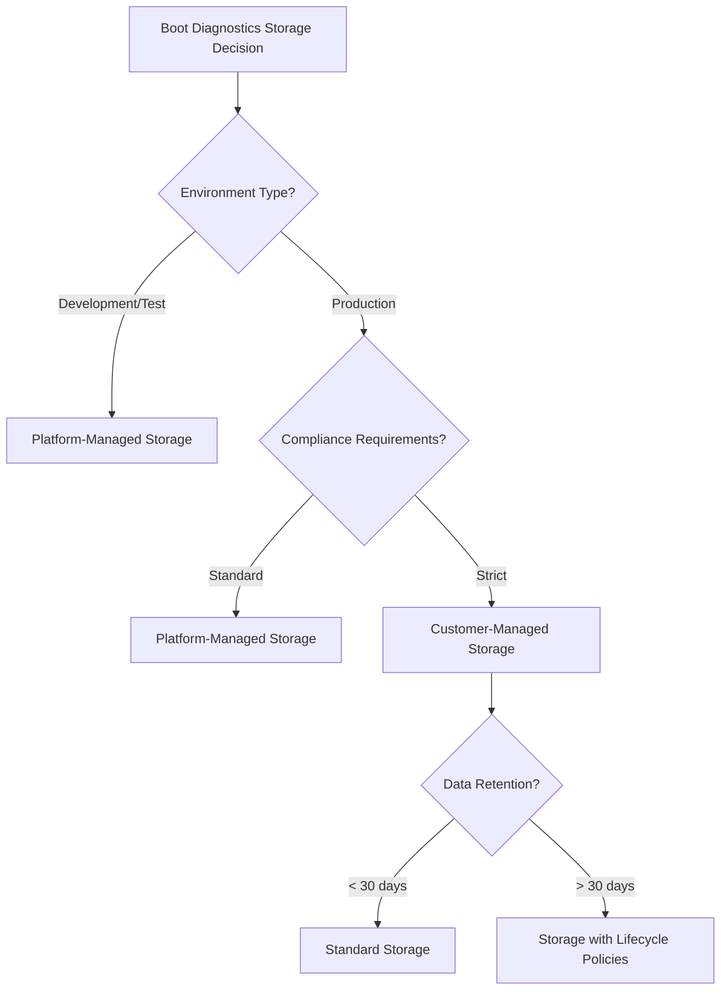

# Enabling Boot Diagnostics for Azure Virtual Machines

## Table of Contents
1. [Overview](#overview)
2. [Prerequisites](#prerequisites)
3. [Storage Requirements](#storage-requirements)
4. [Enabling Boot Diagnostics Methods](#enabling-boot-diagnostics-methods)
5. [Storage Options](#storage-options)
6. [Best Practices and Recommendations](#best-practices-and-recommendations)
7. [Monitoring and Incident Response](#monitoring-and-incident-response)
8. [Automation and Scale Considerations](#automation-and-scale-considerations)
9. [Troubleshooting Common Issues](#troubleshooting-common-issues)
10. [Security Considerations](#security-considerations)
11. [Cost Optimization](#cost-optimization)
12. [Compliance and Governance](#compliance-and-governance)

## Overview

Boot diagnostics is a critical debugging feature for Azure Virtual Machines (VMs) that captures serial console output and screenshot information during the boot process. This information is invaluable for troubleshooting VM startup issues, kernel panics, boot failures, and other system-level problems that may occur before the operating system fully loads.

### Key Benefits
- **Real-time visibility**: View serial console output and screenshots without needing to access the VM directly
- **Early-stage diagnostics**: Capture information during boot sequence before remote access is available
- **Post-mortem analysis**: Review historical boot data to identify patterns or recurring issues
- **Compliance support**: Maintain audit trails of VM boot sequences
- **Non-invasive troubleshooting**: Gather diagnostic data without affecting the running VM

### Critical Use Cases
1. **VM fails to boot**: Identify errors in the boot sequence
2. **Blue Screen of Death (BSOD)**: Capture error codes and stack traces
3. **Kernel panic**: Debug Linux kernel issues
4. **Network connectivity issues**: Verify network initialization during boot
5. **Driver failures**: Identify problematic drivers during startup
6. **Configuration errors**: Detect misconfigurations preventing proper boot

## Prerequisites

Before enabling boot diagnostics, ensure the following prerequisites are met:

### Azure Subscription Requirements
- Active Azure subscription with appropriate permissions
- Contributor or higher role on the resource group containing the VM
- Storage Account Contributor role for managed storage scenarios

### VM Requirements
- Supported VM sizes (all Azure VM sizes support boot diagnostics)
- Generation 1 or Generation 2 VMs
- Running Windows Server 2008 R2 or later, or Linux distributions with serial console support

### Storage Requirements
- Azure Storage Account (for customer-managed storage)
- Sufficient storage capacity for diagnostic data
- Network connectivity between VM and storage account

### PowerShell/CLI Requirements
```powershell
# Required PowerShell modules
Install-Module -Name Az.Compute -MinimumVersion 4.0.0
Install-Module -Name Az.Storage -MinimumVersion 3.0.0

# Azure CLI minimum version
az --version  # Should be 2.30.0 or higher
```

## Storage Requirements

Boot diagnostics requires storage to persist serial console logs and screenshots. Understanding storage requirements is crucial for proper implementation:

### Storage Types

#### 1. Platform-Managed Storage (Recommended)
- **Automatic provisioning**: Azure manages storage lifecycle
- **Cost-effective**: No additional storage account charges
- **Simplified management**: No storage account permissions to configure
- **Regional availability**: Available in all Azure regions

#### 2. Customer-Managed Storage
- **Custom retention policies**: Control data lifecycle
- **Centralized storage**: Use existing storage accounts
- **Advanced features**: Enable storage analytics, encryption options
- **Network security**: Apply firewall rules and private endpoints

### Storage Capacity Planning

```yaml
Storage Requirements:
  Serial_Console_Log:
    Max_Size: 256 KB per VM
    Retention: Until manually cleared or VM deleted
    Growth_Rate: ~1-2 KB per boot cycle
  
  Screenshots:
    Max_Size: 1 MB per screenshot
    Frequency: One per boot + on-demand
    Retention: Last screenshot only (older ones overwritten)
  
  Recommended_Capacity:
    Per_VM: 5 MB minimum
    Per_100_VMs: 500 MB
    Buffer: 20% additional capacity
```

### Storage Account Configuration for Customer-Managed Storage

```json
{
  "storageAccountConfiguration": {
    "name": "bootdiagnosticstorage",
    "sku": "Standard_LRS",
    "kind": "StorageV2",
    "properties": {
      "minimumTlsVersion": "TLS1_2",
      "allowBlobPublicAccess": false,
      "networkAcls": {
        "defaultAction": "Deny",
        "virtualNetworkRules": [
          {
            "id": "/subscriptions/{subscription-id}/resourceGroups/{rg}/providers/Microsoft.Network/virtualNetworks/{vnet}/subnets/{subnet}",
            "action": "Allow"
          }
        ]
      }
    },
    "containers": [
      {
        "name": "bootdiagnostics-{vm-name}-{vm-id}",
        "publicAccess": "None"
      }
    ]
  }
}
```

## Enabling Boot Diagnostics Methods

### Method 1: Azure Portal

**Step-by-step process:**

1. Navigate to your VM in the Azure Portal
2. Under the "Support + troubleshooting" section, select "Boot diagnostics"
3. Click "Settings"
4. Toggle "Enable boot diagnostics" to "On"
5. Choose storage option:
   - **Platform-managed storage**: Select "Enable with managed storage account"
   - **Customer-managed storage**: Select "Enable with custom storage account"
6. If using customer-managed storage, select the storage account
7. Click "Save"

**Portal configuration considerations:**
- Changes require VM restart to take effect
- Existing diagnostic data will be preserved
- Storage account must be in the same region as the VM

### Method 2: Azure PowerShell

```powershell
# Enable boot diagnostics with platform-managed storage
function Enable-AzureVMBootDiagnostics {
    param(
        [Parameter(Mandatory=$true)]
        [string]$ResourceGroupName,
        
        [Parameter(Mandatory=$true)]
        [string]$VMName,
        
        [Parameter(Mandatory=$false)]
        [string]$StorageAccountName,
        
        [Parameter(Mandatory=$false)]
        [switch]$UseManagedStorage
    )
    
    try {
        # Get the VM object
        $vm = Get-AzVM -ResourceGroupName $ResourceGroupName -VMName $VMName
        
        if ($UseManagedStorage) {
            # Enable with platform-managed storage
            Set-AzVMBootDiagnostic -VM $vm -Enable
            Write-Host "Boot diagnostics enabled with platform-managed storage" -ForegroundColor Green
        }
        else {
            # Enable with customer-managed storage
            if (-not $StorageAccountName) {
                throw "StorageAccountName is required when not using managed storage"
            }
            
            # Get storage account
            $storageAccount = Get-AzStorageAccount -ResourceGroupName $ResourceGroupName `
                                                  -Name $StorageAccountName
            
            # Get storage URI
            $storageUri = $storageAccount.PrimaryEndpoints.Blob
            
            # Enable boot diagnostics
            Set-AzVMBootDiagnostic -VM $vm `
                                  -Enable `
                                  -StorageAccountUri $storageUri
            
            Write-Host "Boot diagnostics enabled with storage account: $StorageAccountName" -ForegroundColor Green
        }
        
        # Update VM
        Update-AzVM -ResourceGroupName $ResourceGroupName -VM $vm
        
        Write-Host "VM updated successfully. Boot diagnostics is now enabled." -ForegroundColor Green
        
    }
    catch {
        Write-Error "Failed to enable boot diagnostics: $_"
        throw
    }
}

# Example usage:
# Platform-managed storage
Enable-AzureVMBootDiagnostics -ResourceGroupName "myRG" `
                              -VMName "myVM" `
                              -UseManagedStorage

# Customer-managed storage
Enable-AzureVMBootDiagnostics -ResourceGroupName "myRG" `
                              -VMName "myVM" `
                              -StorageAccountName "mystorageaccount"
```

### Method 3: Azure CLI

```bash
#!/bin/bash

# Function to enable boot diagnostics
enable_boot_diagnostics() {
    local resource_group=$1
    local vm_name=$2
    local storage_account=$3
    local use_managed_storage=${4:-false}
    
    if [ "$use_managed_storage" = true ]; then
        # Enable with platform-managed storage
        az vm boot-diagnostics enable \
            --resource-group "$resource_group" \
            --name "$vm_name" \
            --storage ""
        
        echo "Boot diagnostics enabled with platform-managed storage"
    else
        # Enable with customer-managed storage
        if [ -z "$storage_account" ]; then
            echo "Error: Storage account name required for customer-managed storage"
            return 1
        fi
        
        # Get storage account URI
        storage_uri=$(az storage account show \
            --resource-group "$resource_group" \
            --name "$storage_account" \
            --query primaryEndpoints.blob \
            --output tsv)
        
        # Enable boot diagnostics
        az vm boot-diagnostics enable \
            --resource-group "$resource_group" \
            --name "$vm_name" \
            --storage "$storage_uri"
        
        echo "Boot diagnostics enabled with storage account: $storage_account"
    fi
}

# Example usage:
# Platform-managed storage
enable_boot_diagnostics "myRG" "myVM" "" true

# Customer-managed storage
enable_boot_diagnostics "myRG" "myVM" "mystorageaccount" false
```

### Method 4: ARM Template

```json
{
    "$schema": "https://schema.management.azure.com/schemas/2019-04-01/deploymentTemplate.json#",
    "contentVersion": "1.0.0.0",
    "parameters": {
        "vmName": {
            "type": "string",
            "metadata": {
                "description": "Name of the virtual machine"
            }
        },
        "location": {
            "type": "string",
            "defaultValue": "[resourceGroup().location]",
            "metadata": {
                "description": "Location for the resources"
            }
        },
        "bootDiagnosticsEnabled": {
            "type": "bool",
            "defaultValue": true,
            "metadata": {
                "description": "Enable boot diagnostics"
            }
        },
        "storageUri": {
            "type": "string",
            "defaultValue": "",
            "metadata": {
                "description": "Storage URI for boot diagnostics. Leave empty for managed storage"
            }
        }
    },
    "resources": [
        {
            "type": "Microsoft.Compute/virtualMachines",
            "apiVersion": "2021-03-01",
            "name": "[parameters('vmName')]",
            "location": "[parameters('location')]",
            "properties": {
                "diagnosticsProfile": {
                    "bootDiagnostics": {
                        "enabled": "[parameters('bootDiagnosticsEnabled')]",
                        "storageUri": "[if(empty(parameters('storageUri')), json('null'), parameters('storageUri'))]"
                    }
                }
            }
        }
    ]
}
```

### Method 5: Terraform

```hcl
# Boot diagnostics with platform-managed storage
resource "azurerm_linux_virtual_machine" "example" {
  name                = "example-vm"
  resource_group_name = azurerm_resource_group.example.name
  location            = azurerm_resource_group.example.location
  size                = "Standard_DS2_v2"
  
  # ... other VM configuration ...
  
  boot_diagnostics {
    enabled = true
    # Omit storage_account_uri for platform-managed storage
  }
}

# Boot diagnostics with customer-managed storage
resource "azurerm_storage_account" "boot_diagnostics" {
  name                     = "bootdiagstorageaccount"
  resource_group_name      = azurerm_resource_group.example.name
  location                 = azurerm_resource_group.example.location
  account_tier             = "Standard"
  account_replication_type = "LRS"
  min_tls_version          = "TLS1_2"
  
  network_rules {
    default_action = "Deny"
    ip_rules       = ["10.0.0.0/16"]
    virtual_network_subnet_ids = [azurerm_subnet.example.id]
  }
}

resource "azurerm_windows_virtual_machine" "example" {
  name                = "example-vm"
  resource_group_name = azurerm_resource_group.example.name
  location            = azurerm_resource_group.example.location
  size                = "Standard_DS2_v2"
  
  # ... other VM configuration ...
  
  boot_diagnostics {
    enabled             = true
    storage_account_uri = azurerm_storage_account.boot_diagnostics.primary_blob_endpoint
  }
}
```

## Storage Options

### Platform-Managed Storage (Recommended)

**Advantages:**
- Zero configuration overhead
- Automatic lifecycle management
- No additional costs
- Built-in security and compliance
- Automatic cleanup on VM deletion

**Limitations:**
- Limited retention control
- No custom encryption keys
- Cannot apply storage firewall rules
- Data location tied to VM region

**Best Use Cases:**
- Standard VM deployments
- Development and test environments
- Cost-sensitive workloads
- Simplified operations

### Customer-Managed Storage

**Advantages:**
- Custom retention policies
- Customer-managed encryption keys
- Storage firewall and network restrictions
- Centralized diagnostic data
- Advanced analytics capabilities

**Limitations:**
- Additional configuration required
- Storage costs
- Management overhead
- Network configuration complexity

**Best Use Cases:**
- Enterprise environments
- Compliance requirements
- Multi-VM diagnostic centralization
- Long-term data retention needs

### Storage Account Best Practices

```yaml
Storage_Account_Configuration:
  Naming_Convention:
    Pattern: "bootdiag{environment}{region}{number}"
    Example: "bootdiagprodeus2001"
  
  Security_Settings:
    Minimum_TLS_Version: "TLS1_2"
    Public_Blob_Access: false
    Shared_Key_Access: false (when using AAD auth)
    Infrastructure_Encryption: true
  
  Network_Security:
    Default_Action: "Deny"
    Allowed_Networks:
      - VM_Subnets
      - Management_Subnets
      - Azure_Services
    Private_Endpoints: true (for production)
  
  Performance_Tier:
    Development: "Standard_LRS"
    Production: "Standard_ZRS"
    Multi_Region: "Standard_GRS"
  
  Lifecycle_Management:
    Serial_Logs:
      Tier_To_Cool: 30_days
      Delete_After: 365_days
    Screenshots:
      Tier_To_Cool: 7_days
      Delete_After: 90_days
```

## Best Practices and Recommendations

### 1. Storage Strategy Selection



### 2. Implementation Checklist

- [ ] **Pre-deployment Planning**
  - [ ] Identify VM criticality levels
  - [ ] Determine storage requirements
  - [ ] Plan for network connectivity
  - [ ] Review compliance requirements

- [ ] **Implementation Steps**
  - [ ] Enable boot diagnostics during VM creation
  - [ ] Configure storage based on requirements
  - [ ] Set up monitoring alerts
  - [ ] Document configuration standards

- [ ] **Post-deployment Validation**
  - [ ] Verify diagnostic data capture
  - [ ] Test screenshot retrieval
  - [ ] Confirm serial console access
  - [ ] Validate storage permissions

### 3. Standardization Guidelines

**Detailed Explanation of Standardization Approach:**

Standardizing boot diagnostics configuration across your organization ensures consistent troubleshooting capabilities and reduces the complexity of incident response. Here's why each environment has different configurations:

- **Production Environment**: Uses customer-managed storage for compliance tracking, longer retention periods (365 days) for audit trails, and mandatory encryption for sensitive data protection
- **Development Environment**: Uses platform-managed storage to reduce operational overhead, shorter retention (30 days) since historical data is less critical
- **Test Environment**: Minimal retention (7 days) and simplified configuration to optimize costs while maintaining basic diagnostic capabilities

```powershell
# Standard configuration function for organization-wide deployment
function Set-OrganizationBootDiagnostics {
    param(
        [Parameter(Mandatory=$true)]
        [string]$SubscriptionId,
        
        [Parameter(Mandatory=$true)]
        [ValidateSet("Production", "Development", "Test")]
        [string]$Environment,
        
        [Parameter(Mandatory=$false)]
        [string]$StandardStorageAccountId
    )
    
    # Set subscription context
    Set-AzContext -SubscriptionId $SubscriptionId
    
    # Define configuration based on environment
    # EXPLANATION: Each environment has different requirements:
    # - Production: Strict compliance, long retention, centralized storage
    # - Development: Flexibility, moderate retention, simplified management
    # - Test: Minimal retention, cost optimization
    $config = @{
        "Production" = @{
            UseManagedStorage = $false      # Use customer-managed for compliance
            RequireEncryption = $true       # Mandatory for sensitive data
            RetentionDays = 365            # Long retention for audit requirements
        }
        "Development" = @{
            UseManagedStorage = $true      # Simplified management
            RequireEncryption = $false     # Optional for non-sensitive data
            RetentionDays = 30            # Moderate retention for debugging
        }
        "Test" = @{
            UseManagedStorage = $true      # Cost optimization
            RequireEncryption = $false     # Not required for test data
            RetentionDays = 7             # Minimal retention
        }
    }
    
    # Get all VMs in subscription
    $vms = Get-AzVM
    
    # Process each VM individually to handle errors gracefully
    foreach ($vm in $vms) {
        $envConfig = $config[$Environment]
        
        try {
            # Apply boot diagnostics configuration based on environment
            if ($envConfig.UseManagedStorage) {
                # Platform-managed storage for simplified operations
                Set-AzVMBootDiagnostic -VM $vm -Enable
                Write-Host "[SUCCESS] Enabled platform-managed boot diagnostics for VM: $($vm.Name)" -ForegroundColor Green
            } else {
                # Customer-managed storage for compliance requirements
                if (-not $StandardStorageAccountId) {
                    throw "Storage account URI required for production environment"
                }
                Set-AzVMBootDiagnostic -VM $vm `
                                      -Enable `
                                      -StorageAccountUri $StandardStorageAccountId
                Write-Host "[SUCCESS] Enabled customer-managed boot diagnostics for VM: $($vm.Name)" -ForegroundColor Green
            }
            
            # Apply the configuration to the VM
            Update-AzVM -ResourceGroupName $vm.ResourceGroupName -VM $vm
            
        } catch {
            Write-Warning "[ERROR] Failed to configure boot diagnostics for VM: $($vm.Name) - $_"
            # Continue processing other VMs even if one fails
        }
    }
}

# Example usage with error handling:
try {
    # Production environment with centralized storage
    Set-OrganizationBootDiagnostics -SubscriptionId "xxxx-xxxx-xxxx" `
                                    -Environment "Production" `
                                    -StandardStorageAccountId "https://prodbootdiag.blob.core.windows.net/"
} catch {
    Write-Error "Failed to apply organization boot diagnostics standards: $_"
}
```

**Key Benefits of This Standardized Approach:**

1. **Consistency**: All VMs in the same environment have identical boot diagnostics configurations
2. **Compliance**: Production environments automatically meet regulatory requirements
3. **Cost Optimization**: Non-production environments use cost-effective managed storage
4. **Error Resilience**: Script continues processing even if individual VMs fail
5. **Audit Trail**: Success/failure logging for each VM configuration

### 4. Documentation Standards

Every VM should have the following documented:

```yaml
VM_Boot_Diagnostics_Documentation:
  VM_Name: "PROD-WEB-001"
  Resource_Group: "RG-Production-Web"
  Boot_Diagnostics_Enabled: true
  Storage_Type: "Platform-Managed"
  Storage_Account: "N/A"
  Configuration_Date: "2024-01-15"
  Configured_By: "admin@company.com"
  Notes: "Standard production configuration"
  
  Incident_Response_Info:
    Primary_Contact: "sysadmin-team@company.com"
    Secondary_Contact: "infrastructure@company.com"
    Escalation_Path: "Level 1 -> Level 2 -> Management"
    SLA: "15 minutes for critical VMs"

## Monitoring and Incident Response

### Real-time Monitoring Configuration

**Why Real-time Monitoring is Critical:**

Boot diagnostics data is most valuable when accessed promptly during incidents. Setting up proactive monitoring ensures:
- Immediate notification of boot failures
- Historical pattern analysis for recurring issues
- Reduced Mean Time To Resolution (MTTR)
- Compliance with SLA requirements

```json
{
  "monitoringConfiguration": {
    "alertRules": [
      {
        "name": "VM-Boot-Failed",
        "description": "Alert when VM fails to boot successfully",
        "condition": {
          "allOf": [
            {
              "field": "category",
              "equals": "Boot"
            },
            {
              "field": "resultType",
              "equals": "Failed"
            }
          ]
        },
        "action": {
          "actionGroupId": "/subscriptions/{sub-id}/resourceGroups/{rg}/providers/Microsoft.Insights/actionGroups/critical-alerts",
          "severity": "1",
          "autoMitigate": false
        }
      },
      {
        "name": "VM-Boot-Delayed",
        "description": "Alert when VM boot takes longer than expected",
        "condition": {
          "field": "bootDuration",
          "greaterThan": "300"
        },
        "action": {
          "severity": "2",
          "autoMitigate": true
        }
      }
    ]
  }
}
```

### Incident Response Procedures

**Step-by-Step Incident Response Process:**

1. **Initial Detection**
   ```powershell
   # Quick diagnostic check script
   function Get-VMBootStatus {
       param(
           [string]$ResourceGroupName,
           [string]$VMName
       )
       
       # Check VM power state
       $vm = Get-AzVM -ResourceGroupName $ResourceGroupName -Name $VMName -Status
       $powerState = $vm.Statuses | Where-Object {$_.Code -like "PowerState/*"} | Select-Object -ExpandProperty DisplayStatus
       
       Write-Host "VM Power State: $powerState"
       
       # Get boot diagnostics data
       $bootDiag = Get-AzVMBootDiagnosticsData -ResourceGroupName $ResourceGroupName -Name $VMName
       
       # Display last boot time and status
       Write-Host "Last Boot Attempt: $($bootDiag.LastBootTime)"
       Write-Host "Boot Status: $($bootDiag.Status)"
       
       # Check for recent errors
       if ($bootDiag.SerialConsoleLogBlobUri) {
           Write-Host "Serial console log available at: $($bootDiag.SerialConsoleLogBlobUri)"
       }
       
       return $bootDiag
   }
   ```

2. **Serial Console Analysis**
   ```bash
   # Linux VM boot analysis
   # Common issues to look for in serial console:
   
   # Kernel panic indicators
   grep -i "kernel panic" /var/log/serial-console.log
   grep -i "unable to mount root" /var/log/serial-console.log
   
   # Network initialization failures
   grep -i "failed to bring up" /var/log/serial-console.log
   grep -i "dhcp timeout" /var/log/serial-console.log
   
   # Disk issues
   grep -i "failed to mount" /var/log/serial-console.log
   grep -i "filesystem corruption" /var/log/serial-console.log
   ```

3. **Screenshot Analysis**
   - **Windows BSOD**: Look for stop codes (e.g., 0x0000007B for inaccessible boot device)
   - **Linux Kernel Panic**: Identify the failing module or driver
   - **Boot Loop Detection**: Multiple screenshots showing the same error

4. **Remediation Actions**
   ```powershell
   # Common remediation script
   function Start-VMBootRemediation {
       param(
           [string]$ResourceGroupName,
           [string]$VMName,
           [string]$IssueType
       )
       
       switch ($IssueType) {
           "NetworkConfig" {
               # Reset network configuration
               Write-Host "Resetting network configuration..."
               # Run Azure Run Command to reset network
           }
           "DiskIssue" {
               # Attach OS disk to recovery VM
               Write-Host "Preparing disk recovery..."
               # Create recovery VM and attach disk
           }
           "KernelPanic" {
               # Restore from last known good configuration
               Write-Host "Restoring previous kernel..."
               # Use backup or snapshot
           }
       }
   }
   ```

### Automated Response Patterns

**Why Automation is Essential:**
- Reduces human error during high-stress incidents
- Ensures consistent response procedures
- Enables 24/7 incident response capability
- Provides audit trail of actions taken

```yaml
Automated_Response_Playbook:
  Trigger: VM_Boot_Failure_Alert
  Actions:
    1_Gather_Diagnostics:
      - Capture_Serial_Console_Log
      - Take_Screenshot
      - Get_VM_Activity_Log
      - Check_Resource_Health
    
    2_Initial_Remediation:
      - Attempt_Soft_Restart
      - Wait: 5_minutes
      - Check_Boot_Status
    
    3_Advanced_Remediation:
      Condition: "Soft restart failed"
      Actions:
        - Stop_Deallocate_VM
        - Wait: 2_minutes
        - Start_VM
        - Monitor_Boot_Progress
    
    4_Escalation:
      Condition: "Advanced remediation failed"
      Actions:
        - Create_Support_Ticket
        - Attach_Diagnostic_Bundle
        - Notify_On_Call_Engineer
        - Prepare_Recovery_VM
```

## Automation and Scale Considerations

### Enterprise-Scale Implementation

**Challenges at Scale:**
- Managing thousands of VMs across multiple subscriptions
- Ensuring consistent configuration across regions
- Handling storage capacity for large deployments
- Automating compliance reporting

### Azure Policy for Boot Diagnostics

```json
{
  "properties": {
    "displayName": "Enforce Boot Diagnostics on all VMs",
    "description": "This policy ensures boot diagnostics is enabled on all VMs with appropriate storage configuration",
    "mode": "All",
    "metadata": {
      "category": "Compute",
      "version": "1.0.0"
    },
    "parameters": {
      "effect": {
        "type": "String",
        "metadata": {
          "displayName": "Effect",
          "description": "DeployIfNotExists, AuditIfNotExists, or Disabled"
        },
        "allowedValues": [
          "DeployIfNotExists",
          "AuditIfNotExists",
          "Disabled"
        ],
        "defaultValue": "DeployIfNotExists"
      },
      "storageType": {
        "type": "String",
        "metadata": {
          "displayName": "Storage Type",
          "description": "Platform-managed or Customer-managed storage"
        },
        "allowedValues": [
          "PlatformManaged",
          "CustomerManaged"
        ],
        "defaultValue": "PlatformManaged"
      }
    },
    "policyRule": {
      "if": {
        "field": "type",
        "equals": "Microsoft.Compute/virtualMachines"
      },
      "then": {
        "effect": "[parameters('effect')]",
        "details": {
          "type": "Microsoft.Compute/virtualMachines",
          "existenceCondition": {
            "field": "Microsoft.Compute/virtualMachines/diagnosticsProfile.bootDiagnostics.enabled",
            "equals": "true"
          },
          "roleDefinitionIds": [
            "/providers/Microsoft.Authorization/roleDefinitions/9980e02c-c2be-4d73-94e8-173b1dc7cf3c"
          ],
          "deployment": {
            "properties": {
              "mode": "incremental",
              "template": {
                "$schema": "https://schema.management.azure.com/schemas/2019-04-01/deploymentTemplate.json#",
                "contentVersion": "1.0.0.0",
                "resources": [
                  {
                    "type": "Microsoft.Compute/virtualMachines",
                    "apiVersion": "2021-03-01",
                    "name": "[field('name')]",
                    "location": "[field('location')]",
                    "properties": {
                      "diagnosticsProfile": {
                        "bootDiagnostics": {
                          "enabled": true,
                          "storageUri": "[if(equals(parameters('storageType'), 'PlatformManaged'), json('null'), reference(resourceId('Microsoft.Storage/storageAccounts', variables('storageAccountName'))).primaryEndpoints.blob)]"
                        }
                      }
                    }
                  }
                ]
              }
            }
          }
        }
      }
    }
  }
}
```

### PowerShell Module for Scale Management

```powershell
# BootDiagnostics-Management.psm1

function Initialize-BootDiagnosticsAtScale {
    <#
    .SYNOPSIS
    Configures boot diagnostics across multiple subscriptions and resource groups
    
    .DESCRIPTION
    This function provides enterprise-scale management of boot diagnostics,
    including parallel processing, error handling, and reporting
    
    .PARAMETER ConfigFile
    JSON configuration file with subscription and storage mappings
    
    .PARAMETER MaxConcurrency
    Maximum number of parallel operations (default: 10)
    
    .EXAMPLE
    Initialize-BootDiagnosticsAtScale -ConfigFile "config.json" -MaxConcurrency 20
    #>
    
    param(
        [Parameter(Mandatory=$true)]
        [string]$ConfigFile,
        
        [Parameter(Mandatory=$false)]
        [int]$MaxConcurrency = 10
    )
    
    # Load configuration
    $config = Get-Content $ConfigFile | ConvertFrom-Json
    
    # Create job pool for parallel processing
    $jobs = @()
    $results = @()
    
    foreach ($subscription in $config.subscriptions) {
        # Wait if we've reached max concurrency
        while ($jobs.Count -ge $MaxConcurrency) {
            $completedJobs = $jobs | Where-Object { $_.State -eq 'Completed' }
            $results += $completedJobs | Receive-Job
            $jobs = $jobs | Where-Object { $_.State -ne 'Completed' }
            Start-Sleep -Seconds 1
        }
        
        # Start new job
        $job = Start-Job -ScriptBlock {
            param($subscription)
            
            Set-AzContext -SubscriptionId $subscription.id
            
            $vmCount = 0
            $successCount = 0
            $failureCount = 0
            
            foreach ($rg in $subscription.resourceGroups) {
                $vms = Get-AzVM -ResourceGroupName $rg
                
                foreach ($vm in $vms) {
                    $vmCount++
                    try {
                        if ($subscription.useManagedStorage) {
                            Set-AzVMBootDiagnostic -VM $vm -Enable
                        } else {
                            Set-AzVMBootDiagnostic -VM $vm -Enable -StorageAccountUri $subscription.storageUri
                        }
                        Update-AzVM -ResourceGroupName $rg -VM $vm
                        $successCount++
                    } catch {
                        $failureCount++
                        Write-Error "Failed to configure VM: $($vm.Name) - $_"
                    }
                }
            }
            
            return @{
                SubscriptionId = $subscription.id
                TotalVMs = $vmCount
                Success = $successCount
                Failed = $failureCount
            }
        } -ArgumentList $subscription
        
        $jobs += $job
    }
    
    # Wait for all jobs to complete
    $jobs | Wait-Job
    $results += $jobs | Receive-Job
    
    # Generate report
    $report = $results | ForEach-Object {
        [PSCustomObject]@{
            Subscription = $_.SubscriptionId
            TotalVMs = $_.TotalVMs
            Successful = $_.Success
            Failed = $_.Failed
            SuccessRate = [math]::Round(($_.Success / $_.TotalVMs) * 100, 2)
        }
    }
    
    # Export report
    $report | Export-Csv -Path "BootDiagnostics-Report-$(Get-Date -Format 'yyyy-MM-dd').csv" -NoTypeInformation
    
    # Display summary
    $totalVMs = ($report | Measure-Object -Property TotalVMs -Sum).Sum
    $totalSuccess = ($report | Measure-Object -Property Successful -Sum).Sum
    $overallSuccessRate = [math]::Round(($totalSuccess / $totalVMs) * 100, 2)
    
    Write-Host "Boot Diagnostics Configuration Summary" -ForegroundColor Cyan
    Write-Host "Total VMs Processed: $totalVMs"
    Write-Host "Successfully Configured: $totalSuccess"
    Write-Host "Overall Success Rate: $overallSuccessRate%"
    
    return $report
}
```

### Configuration File Example

```json
{
  "subscriptions": [
    {
      "id": "11111111-1111-1111-1111-111111111111",
      "name": "Production",
      "useManagedStorage": false,
      "storageUri": "https://prodbootdiag.blob.core.windows.net/",
      "resourceGroups": [
        "RG-PROD-EAST",
        "RG-PROD-WEST",
        "RG-PROD-CENTRAL"
      ]
    },
    {
      "id": "22222222-2222-2222-2222-222222222222",
      "name": "Development",
      "useManagedStorage": true,
      "resourceGroups": [
        "RG-DEV-ALL"
      ]
    }
  ],
  "settings": {
    "parallelism": 20,
    "retryCount": 3,
    "retryDelay": 5
  }
}
```

## Troubleshooting Common Issues

### Issue 1: Boot Diagnostics Not Capturing Data

**Symptoms:**
- No serial console output available
- Screenshot shows as unavailable
- "Boot diagnostics data not available" error

**Root Causes and Solutions:**

1. **Storage Account Connectivity Issues**
   ```powershell
   # Diagnostic script
   function Test-BootDiagnosticsConnectivity {
       param(
           [string]$VMResourceGroup,
           [string]$VMName,
           [string]$StorageAccountName
       )
       
       # Test 1: VM to Storage Account connectivity
       $vm = Get-AzVM -ResourceGroupName $VMResourceGroup -Name $VMName
       $storageAccount = Get-AzStorageAccount | Where-Object {$_.StorageAccountName -eq $StorageAccountName}
       
       # Check if VM and storage are in same region
       if ($vm.Location -ne $storageAccount.Location) {
           Write-Warning "VM and Storage Account are in different regions. This may cause latency issues."
       }
       
       # Test 2: Network security rules
       $nsg = Get-AzNetworkSecurityGroup -ResourceGroupName $VMResourceGroup
       $outboundRules = $nsg.SecurityRules | Where-Object {$_.Direction -eq "Outbound"}
       
       $storageServiceTag = $outboundRules | Where-Object {$_.DestinationAddressPrefix -contains "Storage" -or $_.DestinationAddressPrefix -contains "*"}
       
       if (-not $storageServiceTag) {
           Write-Error "No outbound rule found for Storage service tag. Boot diagnostics may fail."
           Write-Host "Suggested Fix: Add outbound NSG rule for Storage service tag"
       }
       
       # Test 3: Storage firewall rules
       $storageFirewall = $storageAccount.NetworkRuleSet
       if ($storageFirewall.DefaultAction -eq "Deny") {
           Write-Warning "Storage account has restrictive firewall rules"
           
           # Check if VM subnet is allowed
           $vmSubnet = Get-AzVirtualNetwork -ResourceGroupName $VMResourceGroup | 
                       Select-Object -ExpandProperty Subnets | 
                       Where-Object {$_.Name -eq $vm.NetworkProfile.NetworkInterfaces[0].Id.Split('/')[-1]}
           
           $allowed = $storageFirewall.VirtualNetworkRules | Where-Object {$_.VirtualNetworkResourceId -eq $vmSubnet.Id}
           
           if (-not $allowed) {
               Write-Error "VM subnet not allowed in storage firewall rules"
               Write-Host "Suggested Fix: Add VM subnet to storage account firewall exceptions"
           }
       }
   }
   ```

2. **Incorrect Storage URI Format**
   ```powershell
   # Validate and fix storage URI
   function Fix-StorageUri {
       param([string]$StorageUri)
       
       # Ensure proper format
       if ($StorageUri -notmatch '^https://.*\.blob\.core\.windows\.net/) {
           # Fix common issues
           $StorageUri = $StorageUri.TrimEnd('/')
           
           if ($StorageUri -notmatch '^https://') {
               $StorageUri = "https://" + $StorageUri
           }
           
           if ($StorageUri -notmatch '\.blob\.core\.windows\.net) {
               $StorageUri += ".blob.core.windows.net"
           }
           
           $StorageUri += "/"
       }
       
       return $StorageUri
   }
   ```

3. **VM Agent Issues**
   ```powershell
   # Check VM agent status
   function Test-VMAgentStatus {
       param(
           [string]$ResourceGroupName,
           [string]$VMName
       )
       
       $vm = Get-AzVM -ResourceGroupName $ResourceGroupName -Name $VMName -Status
       $agentStatus = $vm.VMAgent.Statuses | Where-Object {$_.Code -like "ProvisioningState/*"}
       
       if ($agentStatus.DisplayStatus -ne "Ready") {
           Write-Error "VM Agent is not ready. Status: $($agentStatus.DisplayStatus)"
           Write-Host "Boot diagnostics requires a functioning VM agent"
           
           # Suggested remediation
           Write-Host "Remediation steps:"
           Write-Host "1. Restart the VM"
           Write-Host "2. If Windows: Run 'msiexec /i WindowsAzureVMAgent.msi /quiet'"
           Write-Host "3. If Linux: Reinstall waagent package"
       } else {
           Write-Host "VM Agent is healthy" -ForegroundColor Green
       }
   }
   ```

### Issue 2: Serial Console Not Working

**Symptoms:**
- "Serial console connection failed"
- Empty serial console output
- Console shows disconnected state

**Root Causes and Solutions:**

1. **Serial Console Feature Disabled**
   ```powershell
   # Enable serial console at subscription level
   function Enable-SerialConsoleFeature {
       param([string]$SubscriptionId)
       
       Set-AzContext -SubscriptionId $SubscriptionId
       
       # Check current status
       $serialConsoleStatus = Get-AzProviderFeature `
           -ProviderNamespace "Microsoft.SerialConsole" `
           -FeatureName "SerialConsole"
       
       if ($serialConsoleStatus.RegistrationState -ne "Registered") {
           Write-Host "Enabling Serial Console feature for subscription..."
           Register-AzProviderFeature `
               -ProviderNamespace "Microsoft.SerialConsole" `
               -FeatureName "SerialConsole"
           
           # Wait for registration
           while ((Get-AzProviderFeature -ProviderNamespace "Microsoft.SerialConsole" -FeatureName "SerialConsole").RegistrationState -ne "Registered") {
               Write-Host "Waiting for feature registration..."
               Start-Sleep -Seconds 10
           }
           
           Write-Host "Serial Console feature enabled successfully" -ForegroundColor Green
       } else {
           Write-Host "Serial Console feature is already enabled" -ForegroundColor Green
       }
   }
   ```

2. **OS-Level Serial Console Configuration**
   
   **For Linux VMs:**
   ```bash
   # Check GRUB configuration
   grep "console=" /etc/default/grub
   
   # Ensure serial console is enabled
   GRUB_CMDLINE_LINUX="console=tty0 console=ttyS0,115200n8 earlyprintk=ttyS0,115200"
   
   # Update GRUB
   grub2-mkconfig -o /boot/grub2/grub.cfg  # For RHEL/CentOS
   update-grub  # For Ubuntu/Debian
   
   # Enable getty service
   systemctl enable serial-getty@ttyS0.service
   systemctl start serial-getty@ttyS0.service
   ```
   
   **For Windows VMs:**
   ```powershell
   # Enable EMS (Emergency Management Services)
   bcdedit /emssettings EMSPORT:1 EMSBAUDRATE:115200
   bcdedit /ems on
   bcdedit /bootems on
   
   # Configure Special Administration Console
   sc config sacsvr start=auto
   net start sacsvr
   ```

### Issue 3: Storage Capacity Problems

**Symptoms:**
- "Storage quota exceeded" errors
- Old diagnostic data not being overwritten
- Incomplete serial console logs

**Solutions:**

1. **Implement Storage Lifecycle Management**
   ```powershell
   function Configure-DiagnosticsLifecycle {
       param(
           [string]$StorageAccountName,
           [string]$ResourceGroupName
       )
       
       $storageAccount = Get-AzStorageAccount `
           -ResourceGroupName $ResourceGroupName `
           -Name $StorageAccountName
       
       $ctx = $storageAccount.Context
       
       # Create lifecycle policy
       $lifecyclePolicy = @{
           Rules = @(
               @{
                   Name = "BootDiagnosticsCleanup"
                   Enabled = $true
                   Type = "Lifecycle"
                   Definition = @{
                       Actions = @{
                           BaseBlob = @{
                               TierToCool = @{
                                   DaysAfterModificationGreaterThan = 30
                               }
                               Delete = @{
                                   DaysAfterModificationGreaterThan = 90
                               }
                           }
                       }
                       Filters = @{
                           PrefixMatch = @("bootdiagnostics")
                       }
                   }
               }
           )
       }
       
       Set-AzStorageAccountManagementPolicy `
           -ResourceGroupName $ResourceGroupName `
           -StorageAccountName $StorageAccountName `
           -Policy $lifecyclePolicy
   }
   ```

2. **Monitor Storage Usage**
   ```powershell
   function Get-BootDiagnosticsStorageUsage {
       param(
           [string]$StorageAccountName,
           [string]$ResourceGroupName
       )
       
       $storageAccount = Get-AzStorageAccount `
           -ResourceGroupName $ResourceGroupName `
           -Name $StorageAccountName
       
       $ctx = $storageAccount.Context
       
       # Get all boot diagnostics containers
       $containers = Get-AzStorageContainer -Context $ctx | 
                      Where-Object {$_.Name -match "^bootdiagnostics-"}
       
       $totalSize = 0
       $containerStats = @()
       
       foreach ($container in $containers) {
           $blobs = Get-AzStorageBlob -Container $container.Name -Context $ctx
           $containerSize = ($blobs | Measure-Object -Property Length -Sum).Sum
           
           $containerStats += [PSCustomObject]@{
               Container = $container.Name
               VMName = $container.Name -replace "bootdiagnostics-", "" -replace "-[a-f0-9]{8}.*$", ""
               SizeMB = [math]::Round($containerSize / 1MB, 2)
               BlobCount = $blobs.Count
               LastModified = ($blobs | Sort-Object -Property LastModified -Descending | Select-Object -First 1).LastModified
           }
           
           $totalSize += $containerSize
       }
       
       # Display results
       Write-Host "Boot Diagnostics Storage Report" -ForegroundColor Cyan
       Write-Host "Total Size: $([math]::Round($totalSize / 1MB, 2)) MB"
       Write-Host "Container Count: $($containers.Count)"
       
       $containerStats | Sort-Object -Property SizeMB -Descending | Format-Table -AutoSize
       
       return $containerStats
   }
   ```

## Security Considerations

### Data Protection and Encryption

**Why Security Matters for Boot Diagnostics:**

Boot diagnostic data can contain sensitive information including:
- System configuration details
- Error messages revealing architecture
- IP addresses and network configurations
- Application startup sequences
- Potentially sensitive file paths

### Encryption at Rest

```json
{
  "encryptionConfiguration": {
    "storageServiceEncryption": {
      "enabled": true,
      "keySource": "Microsoft.Keyvault",
      "keyVaultUri": "https://mykeyvault.vault.azure.net/",
      "keyName": "bootdiag-encryption-key",
      "keyVersion": "current"
    },
    "infrastructureEncryption": {
      "enabled": true,
      "description": "Double encryption for highly sensitive environments"
    }
  }
}
```

### Network Security

**Private Endpoint Configuration:**

```powershell
function Configure-PrivateEndpoint {
    param(
        [string]$StorageAccountName,
        [string]$ResourceGroupName,
        [string]$VNetName,
        [string]$SubnetName
    )
    
    # Create private endpoint for storage
    $storageAccount = Get-AzStorageAccount \
        -ResourceGroupName $ResourceGroupName \
        -Name $StorageAccountName
    
    $subnet = Get-AzVirtualNetwork \
        -ResourceGroupName $ResourceGroupName \
        -Name $VNetName | \
        Select -ExpandProperty subnets | \
        Where-Object {$_.Name -eq $SubnetName}
    
    # Create private endpoint
    $privateEndpoint = New-AzPrivateEndpoint \
        -ResourceGroupName $ResourceGroupName \
        -Name "pe-$StorageAccountName" \
        -Location $storageAccount.Location \
        -Subnet $subnet \
        -PrivateLinkServiceConnection @(
            New-AzPrivateLinkServiceConnection \
                -Name "plsc-$StorageAccountName" \
                -PrivateLinkServiceId $storageAccount.Id \
                -GroupId "blob"
        )
    
    # Configure DNS
    $zone = New-AzPrivateDnsZone \
        -ResourceGroupName $ResourceGroupName \
        -Name "privatelink.blob.core.windows.net"
    
    # Link DNS zone to VNet
    New-AzPrivateDnsVirtualNetworkLink \
        -ResourceGroupName $ResourceGroupName \
        -ZoneName "privatelink.blob.core.windows.net" \
        -Name "link-$VNetName" \
        -VirtualNetworkId $subnet.Id
    
    # Create DNS record
    New-AzPrivateDnsRecordConfig \
        -IPv4Address $privateEndpoint.PrivateIpAddresses[0] | \
        New-AzPrivateDnsRecordSet \
            -ResourceGroupName $ResourceGroupName \
            -ZoneName "privatelink.blob.core.windows.net" \
            -Name $StorageAccountName \
            -RecordType A
}
```

### Access Control and RBAC

**Role Assignments for Boot Diagnostics:**

```powershell
function Set-BootDiagnosticsRBAC {
    param(
        [string]$StorageAccountName,
        [string]$ResourceGroupName,
        [string]$UserPrincipalName,
        [ValidateSet("Reader", "Contributor", "Admin")]
        [string]$AccessLevel
    )
    
    $storageAccount = Get-AzStorageAccount \
        -ResourceGroupName $ResourceGroupName \
        -Name $StorageAccountName
    
    # Define role mappings
    $roleMap = @{
        "Reader" = "Storage Blob Data Reader"
        "Contributor" = "Storage Blob Data Contributor"
        "Admin" = "Storage Account Contributor"
    }
    
    $roleDefinition = Get-AzRoleDefinition -Name $roleMap[$AccessLevel]
    
    # Assign role
    New-AzRoleAssignment \
        -SignInName $UserPrincipalName \
        -RoleDefinitionName $roleDefinition.Name \
        -Scope $storageAccount.Id
    
    Write-Host "Assigned $AccessLevel permissions to $UserPrincipalName"
}
```

### Audit Logging

```json
{
  "diagnosticSettings": {
    "name": "boot-diagnostics-audit",
    "storageAccountId": "/subscriptions/{sub-id}/resourceGroups/{rg}/providers/Microsoft.Storage/storageAccounts/{account}",
    "logs": [
      {
        "category": "StorageRead",
        "enabled": true,
        "retentionPolicy": {
          "enabled": true,
          "days": 90
        }
      },
      {
        "category": "StorageWrite",
        "enabled": true,
        "retentionPolicy": {
          "enabled": true,
          "days": 90
        }
      },
      {
        "category": "StorageDelete",
        "enabled": true,
        "retentionPolicy": {
          "enabled": true,
          "days": 365
        }
      }
    ]
  }
}
```

## Cost Optimization

### Cost Analysis and Estimation

**Understanding Boot Diagnostics Costs:**

1. **Platform-Managed Storage**: No additional storage costs
2. **Customer-Managed Storage**: 
   - Storage capacity charges
   - Transaction costs
   - Network egress charges
   - Lifecycle management costs

```powershell
function Calculate-BootDiagnosticsCost {
    param(
        [int]$VMCount,
        [string]$StorageRedundancy = "LRS",
        [int]$RetentionDays = 30,
        [int]$BootsPerMonth = 10
    )
    
    # Storage pricing (example rates - check current Azure pricing)
    $storagePricing = @{
        "LRS" = 0.0208  # per GB per month
        "ZRS" = 0.0260
        "GRS" = 0.0416
    }
    
    # Calculate storage requirements
    $serialLogSize = 0.256  # MB per VM
    $screenshotSize = 1     # MB per screenshot
    $dataPerVM = ($serialLogSize + $screenshotSize) / 1024  # Convert to GB
    
    # Monthly storage cost
    $totalStorageGB = $VMCount * $dataPerVM * ($RetentionDays / 30)
    $storageCost = $totalStorageGB * $storagePricing[$StorageRedundancy]
    
    # Transaction costs (write operations)
    $writeOperations = $VMCount * $BootsPerMonth * 2  # Log + screenshot
    $writeCost = $writeOperations * 0.00002  # Example rate per operation
    
    # Total monthly cost
    $totalCost = $storageCost + $writeCost
    
    # Create cost report
    $costReport = [PSCustomObject]@{
        VMCount = $VMCount
        StorageRedundancy = $StorageRedundancy
        RetentionDays = $RetentionDays
        EstimatedStorageGB = [math]::Round($totalStorageGB, 2)
        MonthlystorageCost = [math]::Round($storageCost, 2)
        MonthlyTransactionCost = [math]::Round($writeCost, 2)
        TotalMonthlyCost = [math]::Round($totalCost, 2)
        AnnualCost = [math]::Round($totalCost * 12, 2)
        CostPerVM = [math]::Round($totalCost / $VMCount, 4)
    }
    
    return $costReport
}

# Example usage
$costEstimate = Calculate-BootDiagnosticsCost -VMCount 100 -StorageRedundancy "LRS" -RetentionDays 30
$costEstimate | Format-List
```

### Cost Optimization Strategies

1. **Use Platform-Managed Storage When Possible**
   - Zero storage costs
   - Automatic cleanup
   - Simplified management

2. **Implement Lifecycle Policies**
   ```json
   {
     "lifecycle": {
       "rules": [
         {
           "name": "OptimizeCosts",
           "type": "Lifecycle",
           "definition": {
             "actions": {
               "baseBlob": {
                 "tierToCool": {
                   "daysAfterModificationGreaterThan": 7
                 },
                 "tierToArchive": {
                   "daysAfterModificationGreaterThan": 30
                 },
                 "delete": {
                   "daysAfterModificationGreaterThan": 90
                 }
               }
             }
           }
         }
       ]
     }
   }
   ```

3. **Regional Considerations**
   - Deploy storage in cheaper regions when compliance allows
   - Use Zone Redundant Storage (ZRS) instead of Geo-Redundant Storage (GRS)
   - Consolidate storage accounts to reduce management overhead

4. **Monitoring and Alerting**
   ```powershell
   function Set-CostAlerts {
       param(
           [string]$ResourceGroupName,
           [decimal]$MonthlyBudget
       )
       
       # Create budget alert
       New-AzConsumptionBudget \
           -ResourceGroupName $ResourceGroupName \
           -Name "BootDiagnosticsBudget" \
           -Amount $MonthlyBudget \
           -Category "Cost" \
           -TimeGrain "Monthly" \
           -StartDate (Get-Date -Day 1) \
           -NotificationKey "costAlert" \
           -NotificationEnabled \
           -NotificationThreshold 80,100 \
           -ContactEmail "finance@company.com"
   }
   ```

## Compliance and Governance

### Regulatory Requirements

**Common Compliance Standards:**

1. **GDPR (General Data Protection Regulation)**
   - Ensure encryption at rest
   - Implement data retention policies
   - Enable audit logging
   - Provide data access controls

2. **HIPAA (Health Insurance Portability and Accountability Act)**
   - Encrypt data in transit and at rest
   - Implement access controls
   - Maintain audit trails
   - Ensure data integrity

3. **PCI DSS (Payment Card Industry Data Security Standard)**
   - Secure network configurations
   - Strong access control measures
   - Regular monitoring and testing
   - Information security policies

### Compliance Configuration Template

```yaml
Compliance_Configuration:
  GDPR:
    Encryption:
      At_Rest: Required
      In_Transit: Required
      Key_Management: Customer_Managed
    Retention:
      Maximum_Days: 365
      Auto_Delete: Enabled
    Access_Control:
      MFA_Required: true
      Privileged_Access_Management: Enabled
    Audit:
      Log_All_Access: true
      Retention_Days: 730
  
  HIPAA:
    Encryption:
      Algorithm: AES256
      Key_Rotation: 90_days
    Access:
      Role_Based: Mandatory
      Time_Limited: true
      Break_Glass_Procedures: Documented
    Monitoring:
      Real_Time_Alerts: true
      Anomaly_Detection: Enabled
  
  PCI_DSS:
    Network_Security:
      Private_Endpoints: Required
      Network_Isolation: Mandatory
    Access_Control:
      Least_Privilege: Enforced
      Regular_Reviews: Quarterly
    Testing:
      Vulnerability_Scans: Monthly
      Penetration_Testing: Annual
```

### Governance Framework

```powershell
# Compliance validation script
function Validate-BootDiagnosticsCompliance {
    param(
        [string]$SubscriptionId,
        [string]$ComplianceStandard
    )
    
    Set-AzContext -SubscriptionId $SubscriptionId
    
    $complianceResults = @()
    $vms = Get-AzVM
    
    foreach ($vm in $vms) {
        $result = [PSCustomObject]@{
            VMName = $vm.Name
            ResourceGroup = $vm.ResourceGroupName
            BootDiagnosticsEnabled = $false
            StorageEncrypted = $false
            NetworkSecure = $false
            AuditEnabled = $false
            ComplianceStatus = "Non-Compliant"
        }
        
        # Check boot diagnostics
        if ($vm.DiagnosticsProfile.BootDiagnostics.Enabled) {
            $result.BootDiagnosticsEnabled = $true
            
            # Check storage encryption
            if ($vm.DiagnosticsProfile.BootDiagnostics.StorageUri) {
                $storageAccountName = ($vm.DiagnosticsProfile.BootDiagnostics.StorageUri -split '\\.')[0] -replace 'https://',''
                $storageAccount = Get-AzStorageAccount | Where-Object {$_.StorageAccountName -eq $storageAccountName}
                
                if ($storageAccount.Encryption.Services.Blob.Enabled) {
                    $result.StorageEncrypted = $true
                }
                
                # Check network security
                if ($storageAccount.NetworkRuleSet.DefaultAction -eq "Deny") {
                    $result.NetworkSecure = $true
                }
            }
            
            # Check audit configuration
            $diagnosticSetting = Get-AzDiagnosticSetting \
                -ResourceId $vm.Id \
                -ErrorAction SilentlyContinue
            
            if ($diagnosticSetting) {
                $result.AuditEnabled = $true
            }
        }
        
        # Determine compliance status
        if ($result.BootDiagnosticsEnabled -and 
            $result.StorageEncrypted -and 
            $result.NetworkSecure -and 
            $result.AuditEnabled) {
            $result.ComplianceStatus = "Compliant"
        }
        
        $complianceResults += $result
    }
    
    # Generate compliance report
    $summary = @{
        TotalVMs = $complianceResults.Count
        CompliantVMs = ($complianceResults | Where-Object {$_.ComplianceStatus -eq "Compliant"}).Count
        NonCompliantVMs = ($complianceResults | Where-Object {$_.ComplianceStatus -eq "Non-Compliant"}).Count
        CompliancePercentage = [math]::Round((($complianceResults | Where-Object {$_.ComplianceStatus -eq "Compliant"}).Count / $complianceResults.Count) * 100, 2)
    }
    
    # Export detailed report
    $reportPath = "Compliance-Report-$ComplianceStandard-$(Get-Date -Format 'yyyy-MM-dd').csv"
    $complianceResults | Export-Csv -Path $reportPath -NoTypeInformation
    
    Write-Host "Compliance Summary:" -ForegroundColor Cyan
    Write-Host "Total VMs: $($summary.TotalVMs)"
    Write-Host "Compliant: $($summary.CompliantVMs)" -ForegroundColor Green
    Write-Host "Non-Compliant: $($summary.NonCompliantVMs)" -ForegroundColor Red
    Write-Host "Compliance Rate: $($summary.CompliancePercentage)%"
    Write-Host "Detailed report saved to: $reportPath"
    
    return $complianceResults
}
```

### Policy Enforcement

```json
{
  "policyDefinition": {
    "name": "Enforce-BootDiagnostics-Compliance",
    "displayName": "Enforce Boot Diagnostics Compliance Standards",
    "description": "Ensures all VMs meet organizational compliance requirements for boot diagnostics",
    "mode": "All",
    "policyRule": {
      "if": {
        "allOf": [
          {
            "field": "type",
            "equals": "Microsoft.Compute/virtualMachines"
          },
          {
            "anyOf": [
              {
                "field": "Microsoft.Compute/virtualMachines/diagnosticsProfile.bootDiagnostics.enabled",
                "notEquals": "true"
              },
              {
                "field": "tags['Compliance-Exempt']",
                "exists": "false"
              }
            ]
          }
        ]
      },
      "then": {
        "effect": "deny"
      }
    }
  }
}
```

## Summary and Quick Reference

### Decision Matrix

| Scenario | Recommended Configuration | Storage Type | Retention |
|----------|-------------------------|--------------|----------|
| Development/Test | Platform-Managed | Managed | Default |
| Production (Standard) | Platform-Managed | Managed | Default |
| Production (Regulated) | Customer-Managed | Custom | 365 days |
| High Security | Customer-Managed + PE | Custom | Custom |
| Cost-Sensitive | Platform-Managed | Managed | Default |

### Quick Commands Reference

```powershell
# Enable boot diagnostics with platform-managed storage
Set-AzVMBootDiagnostic -VM $vm -Enable

# Enable with customer-managed storage
Set-AzVMBootDiagnostic -VM $vm -Enable -StorageAccountUri "https://storage.blob.core.windows.net/"

# Check boot diagnostics status
Get-AzVM -Name "VMName" -ResourceGroupName "RGName" | Select-Object -ExpandProperty DiagnosticsProfile

# View boot diagnostics data
Get-AzVMBootDiagnosticsData -Name "VMName" -ResourceGroupName "RGName"

# Access serial console
az vm boot-diagnostics get-boot-log --name "VMName" --resource-group "RGName"
```

### Troubleshooting Checklist

- [ ] Verify boot diagnostics is enabled
- [ ] Check storage account connectivity
- [ ] Validate network security rules
- [ ] Confirm VM agent is running
- [ ] Review storage capacity
- [ ] Check subscription features
- [ ] Verify RBAC permissions
- [ ] Test serial console access

### Best Practices Summary

1. **Always enable boot diagnostics** during VM creation
2. **Use platform-managed storage** unless compliance requires otherwise
3. **Implement monitoring** for boot failures
4. **Document configuration** standards
5. **Regular compliance audits**
6. **Automate deployment** using templates or policies
7. **Train support staff** on diagnostic procedures
8. **Maintain runbooks** for common issues

### Additional Resources

- [Azure Boot Diagnostics Documentation](https://docs.microsoft.com/en-us/azure/virtual-machines/boot-diagnostics)
- [Serial Console Documentation](https://docs.microsoft.com/en-us/azure/virtual-machines/serial-console)
- [Azure Storage Security Guide](https://docs.microsoft.com/en-us/azure/storage/common/storage-security-guide)
- [Azure Compliance Documentation](https://docs.microsoft.com/en-us/azure/compliance/)
- [Azure Policy Documentation](https://docs.microsoft.com/en-us/azure/governance/policy/)

---

*This document was created to serve as a comprehensive guide for AI agents and engineers to implement, manage, and troubleshoot boot diagnostics in Azure environments. It should be reviewed and updated regularly to reflect the latest Azure features and best practices.*