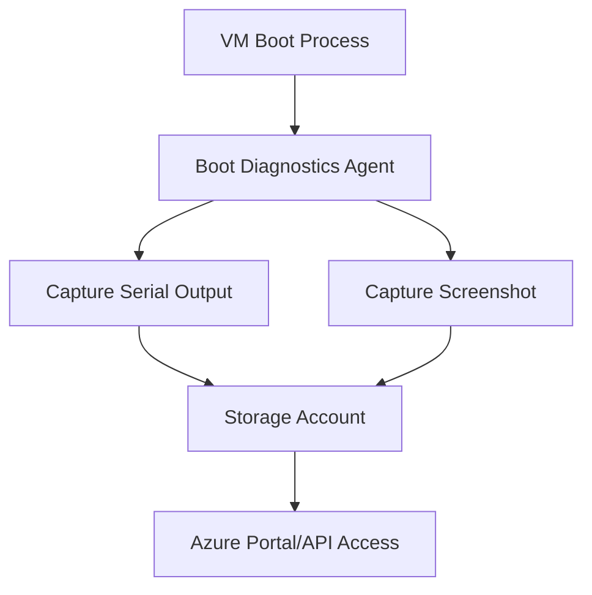
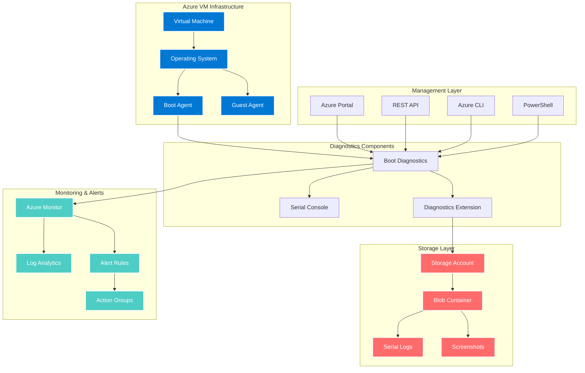
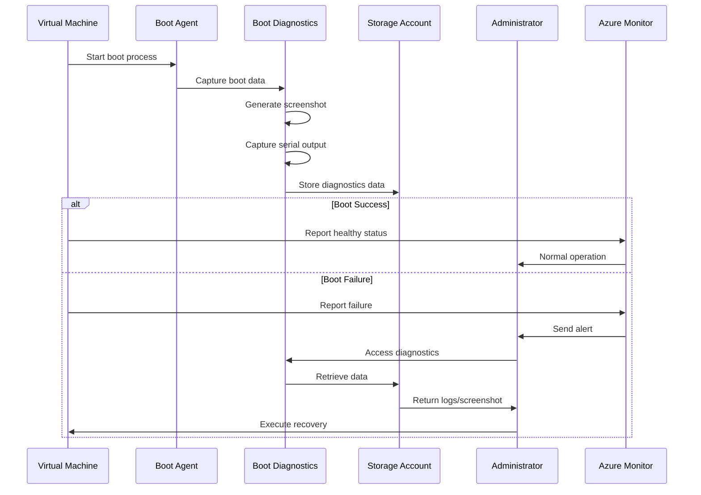

# Azure Virtual Machine Boot Diagnostics: Comprehensive Troubleshooting Guide

## Overview

This guide provides detailed procedures and best practices for troubleshooting Azure Virtual Machine (VM) boot issues. It's designed for AI agents, administrators, and engineers to diagnose and resolve boot problems efficiently during incidents and implement preventive measures.

## Table of Contents

1. [Understanding Boot Diagnostics](#understanding-boot-diagnostics)
2. [Common Boot Issues and Symptoms](#common-boot-issues-and-symptoms)
3. [Prerequisites and Initial Assessment](#prerequisites-and-initial-assessment)
4. [Diagnostic Tools and Methods](#diagnostic-tools-and-methods)
5. [Step-by-Step Troubleshooting Procedures](#step-by-step-troubleshooting-procedures)
6. [Advanced Troubleshooting Techniques](#advanced-troubleshooting-techniques)
7. [Automation and Scripts](#automation-and-scripts)
8. [Prevention and Best Practices](#prevention-and-best-practices)
9. [Recovery Procedures](#recovery-procedures)
10. [Reference Architecture](#reference-architecture)

## Understanding Boot Diagnostics

### What is Boot Diagnostics?

Boot diagnostics is a debugging feature for Azure VMs that captures console output and screenshots during the boot process. This information is crucial for diagnosing VM startup issues when remote connections are unavailable.

### Key Components

- **Serial Console Output**: Text-based log of the boot process
- **Screenshot Capture**: Visual representation of the VM's current state
- **Storage Account**: Repository for diagnostic data
- **Diagnostic Extension**: Agent responsible for data collection

### Data Collection Mechanism



## Common Boot Issues and Symptoms

### 1. Windows Boot Issues

#### Blue Screen of Death (BSOD)
- **Symptoms**: VM shows blue screen with error code
- **Common Causes**:
  - Driver conflicts
  - Corrupted system files
  - Hardware virtualization issues
  - Memory problems

**Example Error Codes**:
```
STOP: 0x0000007B (INACCESSIBLE_BOOT_DEVICE)
STOP: 0x00000074 (BAD_SYSTEM_CONFIG_INFO)
STOP: 0x0000007E (SYSTEM_THREAD_EXCEPTION_NOT_HANDLED)
```

#### Boot Configuration Database (BCD) Corruption
- **Symptoms**: "BOOTMGR is missing" or "An operating system wasn't found"
- **Causes**:
  - Improper shutdown
  - Disk corruption
  - Failed updates

#### Stuck at Windows Logo
- **Symptoms**: VM hangs at Windows logo during boot
- **Causes**:
  - Pending Windows updates
  - Service failures
  - Registry issues

### 2. Linux Boot Issues

#### Kernel Panic
- **Symptoms**: System halts with kernel panic message
- **Common Messages**:
```
Kernel panic - not syncing: VFS: Unable to mount root fs
Kernel panic - not syncing: No init found
```

#### GRUB Issues
- **Symptoms**: GRUB rescue prompt or error messages
- **Common Errors**:
```
error: no such partition
error: file '/boot/grub/i386-pc/normal.mod' not found
```

#### File System Corruption
- **Symptoms**: fsck errors during boot
- **Example**:
```
[FAILED] Failed to mount /data.
See 'systemctl status data.mount' for details.
```

### 3. General Boot Issues

#### Network Configuration Problems
- **Symptoms**: VM boots but no network connectivity
- **Causes**:
  - Incorrect network adapter configuration
  - Firewall rules blocking connectivity
  - DHCP failures

#### Disk Space Issues
- **Symptoms**: Boot process hangs or fails
- **Indicators**:
```
No space left on device
Failed to write to temporary files
```

## Prerequisites and Initial Assessment

### Required Permissions

```json
{
  "permissions": [
    "Microsoft.Compute/virtualMachines/read",
    "Microsoft.Compute/virtualMachines/instanceView/read",
    "Microsoft.Storage/storageAccounts/blobServices/containers/blobs/read",
    "Microsoft.Compute/virtualMachines/extensions/read"
  ]
}
```

### Initial Assessment Checklist

1. **Verify Boot Diagnostics is Enabled**
```powershell
# PowerShell
Get-AzVM -ResourceGroupName "MyRG" -Name "MyVM" | Select-Object -ExpandProperty DiagnosticsProfile
```

```bash
# Azure CLI
az vm boot-diagnostics get-boot-log --resource-group MyRG --name MyVM
```

2. **Check VM Status**
```powershell
# PowerShell
Get-AzVM -ResourceGroupName "MyRG" -Name "MyVM" -Status
```

3. **Review Recent Changes**
- Check activity logs for recent operations
- Review update history
- Verify disk operations

### Information Gathering Template

```yaml
VM_Assessment:
  VM_Name: 
  Resource_Group: 
  Location: 
  VM_Size: 
  OS_Type: # Windows/Linux
  OS_Version: 
  Last_Known_Good_State: 
  Recent_Changes:
    - Change_Type: 
      Date: 
      Description: 
  Current_Status:
    Power_State: 
    Provisioning_State: 
    Agent_Status: 
  Boot_Diagnostics:
    Enabled: 
    Storage_Account: 
    Last_Screenshot_Time: 
    Serial_Log_Available: 
```

## Diagnostic Tools and Methods

### 1. Azure Portal Tools

#### Boot Diagnostics Console
- Navigate to: VM → Support + troubleshooting → Boot diagnostics
- Features:
  - Serial console output viewer
  - Screenshot display
  - Download capabilities

#### Serial Console
- Direct terminal access to VM
- Requirements:
  - Boot diagnostics enabled
  - VM must be running
  - Proper NSG rules

### 2. Command-Line Tools

#### Azure PowerShell
```powershell
# Get boot diagnostics log
$bootLog = Get-AzVMBootDiagnosticsData -ResourceGroupName "MyRG" -Name "MyVM"

# Download screenshot
Invoke-WebRequest -Uri $bootLog.ConsoleScreenshotBlobUri -OutFile "screenshot.jpg"

# Get serial log
Invoke-WebRequest -Uri $bootLog.SerialConsoleLogBlobUri -OutFile "serial.log"
```

#### Azure CLI
```bash
# Get boot log
az vm boot-diagnostics get-boot-log \
  --resource-group MyRG \
  --name MyVM \
  --output table

# Download screenshot
az storage blob download \
  --account-name mystorageaccount \
  --container-name bootdiagnostics-myvm \
  --name screenshot.jpg \
  --file ./screenshot.jpg
```

### 3. REST API

```http
GET https://management.azure.com/subscriptions/{subscriptionId}/resourceGroups/{resourceGroupName}/providers/Microsoft.Compute/virtualMachines/{vmName}/bootDiagnosticsData?api-version=2021-03-01

Authorization: Bearer {token}
```

## Step-by-Step Troubleshooting Procedures

### Phase 1: Initial Diagnosis

1. **Capture Current State**
```powershell
# PowerShell script to capture VM state
function Get-VMBootDiagnostics {
    param(
        [string]$ResourceGroup,
        [string]$VMName
    )
    
    $vm = Get-AzVM -ResourceGroupName $ResourceGroup -Name $VMName
    $vmStatus = Get-AzVM -ResourceGroupName $ResourceGroup -Name $VMName -Status
    
    $diagnosticsData = @{
        VMName = $VMName
        PowerState = $vmStatus.Statuses[1].DisplayStatus
        ProvisioningState = $vmStatus.Statuses[0].DisplayStatus
        BootDiagnosticsEnabled = $vm.DiagnosticsProfile.BootDiagnostics.Enabled
        Timestamp = Get-Date
    }
    
    return $diagnosticsData
}
```

2. **Analyze Boot Diagnostics Data**
```python
# Python script to parse serial console log
import re
from datetime import datetime

def analyze_boot_log(log_file_path):
    """Analyze boot log for common issues"""
    
    issues = []
    
    with open(log_file_path, 'r') as file:
        content = file.read()
        
        # Check for kernel panic
        if re.search(r'Kernel panic', content, re.IGNORECASE):
            issues.append({
                'type': 'KERNEL_PANIC',
                'severity': 'CRITICAL',
                'details': 'Kernel panic detected in boot log'
            })
        
        # Check for disk errors
        if re.search(r'(disk error|I/O error)', content, re.IGNORECASE):
            issues.append({
                'type': 'DISK_ERROR',
                'severity': 'HIGH',
                'details': 'Disk I/O errors detected'
            })
        
        # Check for memory issues
        if re.search(r'(out of memory|OOM)', content, re.IGNORECASE):
            issues.append({
                'type': 'MEMORY_ERROR',
                'severity': 'HIGH',
                'details': 'Memory allocation issues detected'
            })
        
        # Check for service failures
        if re.search(r'(failed to start|service failed)', content, re.IGNORECASE):
            issues.append({
                'type': 'SERVICE_FAILURE',
                'severity': 'MEDIUM',
                'details': 'Service startup failures detected'
            })
    
    return issues
```

### Phase 2: Common Resolution Procedures

#### Windows Boot Issues Resolution

1. **Fix Boot Configuration Database (BCD)**
```cmd
# Commands to run in recovery console
bcdedit /enum all
bcdedit /export C:\BCD_Backup
bootrec /fixmbr
bootrec /fixboot
bootrec /scanos
bootrec /rebuildbcd
```

2. **System File Checker**
```cmd
sfc /scannow /offbootdir=C:\ /offwindir=C:\Windows
dism /image:C:\ /cleanup-image /restorehealth
```

3. **Registry Repair**
```powershell
# PowerShell commands for registry repair
$registryPath = "C:\Windows\System32\config"
$backupPath = "C:\RegBackup"

# Create backup
New-Item -ItemType Directory -Path $backupPath -Force
Copy-Item "$registryPath\*" -Destination $backupPath -Force

# Restore from RegBack
Copy-Item "C:\Windows\System32\config\RegBack\*" -Destination $registryPath -Force
```

#### Linux Boot Issues Resolution

1. **GRUB Recovery**
```bash
# Commands for GRUB repair
# Boot from recovery media
mount /dev/sda1 /mnt
mount --bind /dev /mnt/dev
mount --bind /proc /mnt/proc
mount --bind /sys /mnt/sys
chroot /mnt

# Reinstall GRUB
grub-install /dev/sda
update-grub

# Exit chroot
exit
umount /mnt/sys
umount /mnt/proc
umount /mnt/dev
umount /mnt
```

2. **File System Check**
```bash
# Force fsck on boot
touch /forcefsck

# Or modify kernel parameters
# Add "fsck.mode=force" to kernel command line

# Manual fsck
fsck -y /dev/sda1
```

3. **Kernel Issues**
```bash
# Boot with previous kernel
# At GRUB menu, select "Advanced options"
# Choose previous kernel version

# Update initramfs
update-initramfs -u -k all

# Reinstall kernel
apt-get install --reinstall linux-image-$(uname -r)
```

### Phase 3: Advanced Recovery Options

#### Using Azure Serial Console

1. **Access Serial Console**
```powershell
# Enable serial console
$vm = Get-AzVM -ResourceGroupName "MyRG" -Name "MyVM"
$vm.DiagnosticsProfile.BootDiagnostics.Enabled = $true
$vm.DiagnosticsProfile.BootDiagnostics.StorageUri = "https://mystorageaccount.blob.core.windows.net/"
Update-AzVM -ResourceGroupName "MyRG" -VM $vm
```

2. **Common Serial Console Commands**

For Windows:
```
# Enter SAC prompt
ch -si 1
cmd

# Check disk
chkdsk C: /f /r

# View event logs
wevtutil qe System /f:text /c:10
```

For Linux:
```bash
# Check system logs
journalctl -xb

# View boot messages
dmesg | grep -i error

# Check disk usage
df -h
```

#### Using Recovery VM

1. **Attach OS Disk to Recovery VM**
```powershell
# PowerShell script to attach disk to recovery VM
function Attach-OSDiskToRecoveryVM {
    param(
        [string]$SourceVMRG,
        [string]$SourceVMName,
        [string]$RecoveryVMRG,
        [string]$RecoveryVMName
    )
    
    # Get source VM
    $sourceVM = Get-AzVM -ResourceGroupName $SourceVMRG -Name $SourceVMName
    
    # Stop source VM
    Stop-AzVM -ResourceGroupName $SourceVMRG -Name $SourceVMName -Force
    
    # Get OS disk
    $osDisk = Get-AzDisk -ResourceGroupName $SourceVMRG -DiskName $sourceVM.StorageProfile.OsDisk.Name
    
    # Attach to recovery VM
    $recoveryVM = Get-AzVM -ResourceGroupName $RecoveryVMRG -Name $RecoveryVMName
    Add-AzVMDataDisk -VM $recoveryVM -Name $osDisk.Name -CreateOption Attach -ManagedDiskId $osDisk.Id -Lun 1
    Update-AzVM -ResourceGroupName $RecoveryVMRG -VM $recoveryVM
}
```

2. **Perform Recovery Operations**

Windows Recovery:
```powershell
# On recovery VM
# Identify attached disk
Get-Disk | Where-Object {$_.OperationalStatus -eq 'Online' -and $_.PartitionStyle -eq 'MBR'}

# Assign drive letter
$disk = Get-Disk | Where-Object {$_.FriendlyName -like "*Azure*"}
$disk | Set-Disk -IsOffline $false
$disk | Set-Disk -IsReadOnly $false

# Run repairs
chkdsk F: /f /r
sfc /scannow /offbootdir=F:\ /offwindir=F:\Windows
```

Linux Recovery:
```bash
# On recovery VM
# Identify attached disk
lsblk

# Mount the disk
mkdir /recovery
mount /dev/sdc1 /recovery

# Chroot into the system
mount --bind /dev /recovery/dev
mount --bind /proc /recovery/proc
mount --bind /sys /recovery/sys
chroot /recovery

# Perform repairs
update-initramfs -u
grub-install /dev/sdc
update-grub
```

## Advanced Troubleshooting Techniques

### Performance Analysis During Boot

```powershell
# PowerShell script to analyze boot performance
function Get-BootPerformanceMetrics {
    param(
        [string]$ResourceGroup,
        [string]$VMName,
        [datetime]$StartTime = (Get-Date).AddHours(-1),
        [datetime]$EndTime = (Get-Date)
    )
    
    # Get metrics
    $metrics = Get-AzMetric `
        -ResourceId "/subscriptions/$((Get-AzContext).Subscription.Id)/resourceGroups/$ResourceGroup/providers/Microsoft.Compute/virtualMachines/$VMName" `
        -TimeGrain 00:01:00 `
        -StartTime $StartTime `
        -EndTime $EndTime `
        -MetricNames "Percentage CPU", "Disk Read Operations/Sec", "Disk Write Operations/Sec"
    
    $results = @()
    foreach ($metric in $metrics) {
        $results += @{
            MetricName = $metric.Name.Value
            Average = ($metric.Data | Measure-Object -Property Average -Average).Average
            Maximum = ($metric.Data | Measure-Object -Property Maximum -Maximum).Maximum
        }
    }
    
    return $results
}
```

### Memory Dump Analysis

```powershell
# Configure memory dump settings
function Set-MemoryDumpConfiguration {
    param(
        [string]$ResourceGroup,
        [string]$VMName
    )
    
    $script = @'
    # Configure Windows for complete memory dump
    Set-ItemProperty -Path "HKLM:\SYSTEM\CurrentControlSet\Control\CrashControl" -Name "CrashDumpEnabled" -Value 1
    Set-ItemProperty -Path "HKLM:\SYSTEM\CurrentControlSet\Control\CrashControl" -Name "MinidumpDir" -Value "%SystemRoot%\Minidump"
    
    # Ensure adequate page file
    $computerSystem = Get-WmiObject -Class Win32_ComputerSystem
    $computerSystem.AutomaticManagedPagefile = $false
    $computerSystem.Put()
    
    $pageFile = Get-WmiObject -Class Win32_PageFileSetting
    if ($pageFile -eq $null) {
        Set-WmiInstance -Class Win32_PageFileSetting -Arguments @{Name="C:\pagefile.sys"; InitialSize=0; MaximumSize=0}
    }
'@
    
    # Run script on VM
    Invoke-AzVMRunCommand `
        -ResourceGroupName $ResourceGroup `
        -VMName $VMName `
        -CommandId 'RunPowerShellScript' `
        -ScriptPath $script
}
```

### Network Boot Diagnostics

```python
# Python script for network diagnostics during boot
import subprocess
import json
from datetime import datetime

def diagnose_network_boot_issues(vm_name, resource_group):
    """Diagnose network-related boot issues"""
    
    diagnostics = {
        'timestamp': datetime.now().isoformat(),
        'vm_name': vm_name,
        'resource_group': resource_group,
        'network_issues': []
    }
    
    # Check NSG rules
    cmd = f"az network nsg list --resource-group {resource_group} --output json"
    result = subprocess.run(cmd, shell=True, capture_output=True, text=True)
    
    if result.returncode == 0:
        nsgs = json.loads(result.stdout)
        for nsg in nsgs:
            for rule in nsg.get('securityRules', []):
                if rule['access'] == 'Deny' and rule['priority'] < 1000:
                    diagnostics['network_issues'].append({
                        'type': 'NSG_BLOCKING_RULE',
                        'nsg_name': nsg['name'],
                        'rule_name': rule['name'],
                        'priority': rule['priority']
                    })
    
    # Check effective NSG rules
    cmd = f"az network nic list --resource-group {resource_group} --output json"
    result = subprocess.run(cmd, shell=True, capture_output=True, text=True)
    
    if result.returncode == 0:
        nics = json.loads(result.stdout)
        for nic in nics:
            if vm_name.lower() in nic['virtualMachine']['id'].lower():
                # Get effective NSG rules
                cmd = f"az network nic list-effective-nsg --resource-group {resource_group} --name {nic['name']} --output json"
                result = subprocess.run(cmd, shell=True, capture_output=True, text=True)
                
                if result.returncode == 0:
                    effective_rules = json.loads(result.stdout)
                    # Analyze rules
                    for rule_set in effective_rules:
                        for rule in rule_set.get('effectiveSecurityRules', []):
                            if rule['access'] == 'Deny' and 'SSH' in rule['name']:
                                diagnostics['network_issues'].append({
                                    'type': 'SSH_BLOCKED',
                                    'rule_name': rule['name'],
                                    'source': rule['sourceAddressPrefix']
                                })
    
    return diagnostics
```

## Automation and Scripts

### Automated Boot Issue Detection

```python
# Python script for automated boot issue detection
import os
import json
import logging
from azure.identity import DefaultAzureCredential
from azure.mgmt.compute import ComputeManagementClient
from azure.storage.blob import BlobServiceClient
import re

class BootDiagnosticsAnalyzer:
    def __init__(self, subscription_id):
        self.credential = DefaultAzureCredential()
        self.subscription_id = subscription_id
        self.compute_client = ComputeManagementClient(
            self.credential, 
            subscription_id
        )
        self.logger = logging.getLogger(__name__)
        
    def analyze_vm_boot(self, resource_group, vm_name):
        """Comprehensive boot analysis for a VM"""
        
        results = {
            'vm_name': vm_name,
            'resource_group': resource_group,
            'timestamp': datetime.now().isoformat(),
            'status': 'unknown',
            'issues': [],
            'recommendations': []
        }
        
        try:
            # Get VM info
            vm = self.compute_client.virtual_machines.get(
                resource_group, 
                vm_name, 
                expand='instanceView'
            )
            
            # Check power state
            power_state = self._get_power_state(vm.instance_view)
            results['power_state'] = power_state
            
            if power_state != 'PowerState/running':
                results['issues'].append({
                    'type': 'POWER_STATE',
                    'severity': 'HIGH',
                    'description': f'VM is in {power_state} state'
                })
            
            # Get boot diagnostics data
            boot_diag_data = self.compute_client.virtual_machines.retrieve_boot_diagnostics_data(
                resource_group,
                vm_name
            )
            
            # Analyze serial log
            serial_log_issues = self._analyze_serial_log(
                boot_diag_data.serial_console_log_blob_uri
            )
            results['issues'].extend(serial_log_issues)
            
            # Generate recommendations
            results['recommendations'] = self._generate_recommendations(
                results['issues']
            )
            
            # Determine overall status
            if not results['issues']:
                results['status'] = 'healthy'
            elif any(issue['severity'] == 'CRITICAL' for issue in results['issues']):
                results['status'] = 'critical'
            else:
                results['status'] = 'warning'
                
        except Exception as e:
            self.logger.error(f"Error analyzing VM {vm_name}: {str(e)}")
            results['status'] = 'error'
            results['error'] = str(e)
            
        return results
    
    def _get_power_state(self, instance_view):
        """Extract power state from instance view"""
        for status in instance_view.statuses:
            if status.code.startswith('PowerState/'):
                return status.code
        return 'PowerState/unknown'
    
    def _analyze_serial_log(self, log_uri):
        """Analyze serial console log for issues"""
        issues = []
        
        if not log_uri:
            return issues
            
        try:
            # Parse storage account info from URI
            from urllib.parse import urlparse
            parsed_uri = urlparse(log_uri)
            account_name = parsed_uri.netloc.split('.')[0]
            
            # Download log content
            blob_service_client = BlobServiceClient(
                account_url=f"https://{account_name}.blob.core.windows.net",
                credential=self.credential
            )
            
            container_name = parsed_uri.path.split('/')[1]
            blob_name = '/'.join(parsed_uri.path.split('/')[2:])
            
            blob_client = blob_service_client.get_blob_client(
                container=container_name,
                blob=blob_name
            )
            
            log_content = blob_client.download_blob().readall().decode('utf-8')
            
            # Pattern matching for common issues
            patterns = {
                'kernel_panic': {
                    'pattern': r'Kernel panic',
                    'severity': 'CRITICAL',
                    'type': 'KERNEL_PANIC'
                },
                'disk_error': {
                    'pattern': r'(I/O error|disk error|ata\d+:.*error)',
                    'severity': 'HIGH',
                    'type': 'DISK_ERROR'
                },
                'memory_error': {
                    'pattern': r'(Out of memory|OOM|memory allocation failure)',
                    'severity': 'HIGH',
                    'type': 'MEMORY_ERROR'
                },
                'filesystem_error': {
                    'pattern': r'(EXT4-fs error|XFS.*error|filesystem error)',
                    'severity': 'HIGH',
                    'type': 'FILESYSTEM_ERROR'
                },
                'service_failure': {
                    'pattern': r'(Failed to start|service.*failed|systemd.*failed)',
                    'severity': 'MEDIUM',
                    'type': 'SERVICE_FAILURE'
                },
                'network_error': {
                    'pattern': r'(Network is unreachable|Failed to start.*network)',
                    'severity': 'MEDIUM',
                    'type': 'NETWORK_ERROR'
                }
            }
            
            for issue_type, config in patterns.items():
                matches = re.findall(config['pattern'], log_content, re.IGNORECASE)
                if matches:
                    issues.append({
                        'type': config['type'],
                        'severity': config['severity'],
                        'description': f'{issue_type} detected: {matches[0][:100]}',
                        'count': len(matches)
                    })
                    
        except Exception as e:
            self.logger.error(f"Error analyzing serial log: {str(e)}")
            
        return issues
    
    def _generate_recommendations(self, issues):
        """Generate recommendations based on detected issues"""
        recommendations = []
        
        issue_types = {issue['type'] for issue in issues}
        
        if 'KERNEL_PANIC' in issue_types:
            recommendations.append({
                'priority': 'HIGH',
                'action': 'Restore VM from backup or attach OS disk to recovery VM',
                'steps': [
                    'Stop the affected VM',
                    'Create a recovery VM with the same OS',
                    'Attach the OS disk to recovery VM',
                    'Mount and repair the filesystem',
                    'Update kernel or fix boot configuration'
                ]
            })
            
        if 'DISK_ERROR' in issue_types:
            recommendations.append({
                'priority': 'HIGH',
                'action': 'Check disk health and perform filesystem check',
                'steps': [
                    'Run disk diagnostics via recovery VM',
                    'Execute fsck or chkdsk on affected disk',
                    'Consider migrating to new disk if hardware issues persist',
                    'Review disk performance metrics'
                ]
            })
            
        if 'MEMORY_ERROR' in issue_types:
            recommendations.append({
                'priority': 'MEDIUM',
                'action': 'Resize VM or optimize memory usage',
                'steps': [
                    'Review VM size and consider upgrading',
                    'Check for memory leaks in applications',
                    'Review system logs for OOM killer activity',
                    'Optimize service memory configurations'
                ]
            })
            
        if 'SERVICE_FAILURE' in issue_types:
            recommendations.append({
                'priority': 'MEDIUM',
                'action': 'Investigate and fix service failures',
                'steps': [
                    'Access VM via serial console',
                    'Review systemd or event logs',
                    'Disable problematic services temporarily',
                    'Fix service configurations',
                    'Re-enable services one by one'
                ]
            })
            
        return recommendations

# Example usage
def main():
    analyzer = BootDiagnosticsAnalyzer(subscription_id="your-subscription-id")
    result = analyzer.analyze_vm_boot("myResourceGroup", "myVM")
    print(json.dumps(result, indent=2))

if __name__ == "__main__":
    main()
```

### PowerShell Module for Boot Diagnostics

```powershell
# BootDiagnostics.psm1 - PowerShell module for boot diagnostics

function Get-AzVMBootDiagnosticsSummary {
    <#
    .SYNOPSIS
    Get comprehensive boot diagnostics summary for an Azure VM
    
    .DESCRIPTION
    Retrieves and analyzes boot diagnostics data including serial log and screenshot
    
    .PARAMETER ResourceGroupName
    The resource group containing the VM
    
    .PARAMETER VMName
    The name of the virtual machine
    
    .EXAMPLE
    Get-AzVMBootDiagnosticsSummary -ResourceGroupName "MyRG" -VMName "MyVM"
    #>
    [CmdletBinding()]
    param(
        [Parameter(Mandatory=$true)]
        [string]$ResourceGroupName,
        
        [Parameter(Mandatory=$true)]
        [string]$VMName
    )
    
    try {
        # Get VM information
        $vm = Get-AzVM -ResourceGroupName $ResourceGroupName -Name $VMName -Status
        
        $summary = [PSCustomObject]@{
            VMName = $VMName
            ResourceGroup = $ResourceGroupName
            PowerState = ($vm.Statuses | Where-Object Code -like 'PowerState/*').DisplayStatus
            ProvisioningState = ($vm.Statuses | Where-Object Code -eq 'ProvisioningState/succeeded').DisplayStatus
            AgentStatus = ($vm.VMAgent.Statuses | Select-Object -First 1).DisplayStatus
            Timestamp = Get-Date
            BootDiagnosticsEnabled = $false
            Issues = @()
            Recommendations = @()
        }
        
        # Check if boot diagnostics is enabled
        $bootDiag = Get-AzVMBootDiagnosticsData -ResourceGroupName $ResourceGroupName -Name $VMName -ErrorAction SilentlyContinue
        
        if ($bootDiag) {
            $summary.BootDiagnosticsEnabled = $true
            
            # Download and analyze serial log
            if ($bootDiag.SerialConsoleLogBlobUri) {
                $serialLog = Invoke-WebRequest -Uri $bootDiag.SerialConsoleLogBlobUri -UseBasicParsing
                $logContent = [System.Text.Encoding]::UTF8.GetString($serialLog.Content)
                
                # Analyze log for issues
                $issues = Analyze-BootLog -LogContent $logContent
                $summary.Issues = $issues
                
                # Generate recommendations
                $summary.Recommendations = Get-BootRecommendations -Issues $issues
            }
        }
        
        return $summary
    }
    catch {
        Write-Error "Failed to get boot diagnostics summary: $_"
    }
}

function Analyze-BootLog {
    [CmdletBinding()]
    param(
        [Parameter(Mandatory=$true)]
        [string]$LogContent
    )
    
    $issues = @()
    
    # Windows-specific patterns
    $windowsPatterns = @{
        'BSOD' = 'STOP:\s*0x[0-9A-F]{8}'
        'BootFailure' = 'Windows failed to start|BOOTMGR is missing'
        'ServiceFailure' = 'service\s+failed\s+to\s+start|Failed to start'
        'DiskError' = 'disk error|The disk check could not be performed'
        'RegistryError' = 'registry cannot load the hive|REGISTRY ERROR'
    }
    
    # Linux-specific patterns
    $linuxPatterns = @{
        'KernelPanic' = 'Kernel panic|Unable to mount root fs'
        'InitFailure' = 'Failed to start|systemd.*Failed'
        'FilesystemError' = 'EXT4-fs error|XFS.*error|filesystem error'
        'MemoryError' = 'Out of memory|OOM killer'
        'NetworkError' = 'Failed to start.*network|Network is unreachable'
    }
    
    # Detect OS type and apply appropriate patterns
    $patterns = if ($LogContent -match 'Windows|NTFS|BOOTMGR') {
        $windowsPatterns
    } else {
        $linuxPatterns
    }
    
    foreach ($issue in $patterns.GetEnumerator()) {
        if ($LogContent -match $issue.Value) {
            $issues += [PSCustomObject]@{
                Type = $issue.Key
                Severity = Get-IssueSeverity -IssueType $issue.Key
                Description = "Detected $($issue.Key) in boot log"
                Pattern = $Matches[0]
            }
        }
    }
    
    return $issues
}

function Get-IssueSeverity {
    param([string]$IssueType)
    
    switch ($IssueType) {
        {$_ -in 'BSOD', 'KernelPanic', 'BootFailure'} { return 'CRITICAL' }
        {$_ -in 'DiskError', 'FilesystemError', 'MemoryError'} { return 'HIGH' }
        {$_ -in 'ServiceFailure', 'NetworkError', 'InitFailure'} { return 'MEDIUM' }
        default { return 'LOW' }
    }
}

function Get-BootRecommendations {
    [CmdletBinding()]
    param(
        [Parameter(Mandatory=$true)]
        [array]$Issues
    )
    
    $recommendations = @()
    
    foreach ($issue in $Issues) {
        switch ($issue.Type) {
            'BSOD' {
                $recommendations += [PSCustomObject]@{
                    Priority = 'HIGH'
                    Action = 'Analyze memory dump and repair Windows installation'
                    Steps = @(
                        'Access VM via Serial Console or Recovery VM',
                        'Run memory dump analysis',
                        'Execute SFC /scannow and DISM commands',
                        'Update or rollback recent drivers'
                    )
                }
            }
            'KernelPanic' {
                $recommendations += [PSCustomObject]@{
                    Priority = 'HIGH'
                    Action = 'Boot with previous kernel or repair boot configuration'
                    Steps = @(
                        'Access GRUB menu via Serial Console',
                        'Select previous kernel version',
                        'Update initramfs',
                        'Reinstall current kernel package'
                    )
                }
            }
            'DiskError' {
                $recommendations += [PSCustomObject]@{
                    Priority = 'HIGH'
                    Action = 'Perform disk check and repair'
                    Steps = @(
                        'Attach OS disk to recovery VM',
                        'Run chkdsk /f /r (Windows) or fsck -y (Linux)',
                        'Check disk health metrics',
                        'Consider disk replacement if errors persist'
                    )
                }
            }
            'ServiceFailure' {
                $recommendations += [PSCustomObject]@{
                    Priority = 'MEDIUM'
                    Action = 'Investigate and fix service failures'
                    Steps = @(
                        'Access via Serial Console',
                        'Check service logs',
                        'Disable problematic services',
                        'Fix configuration issues',
                        'Re-enable services'
                    )
                }
            }
        }
    }
    
    return $recommendations | Sort-Object Priority -Descending | Get-Unique -AsString
}

# Export module functions
Export-ModuleMember -Function Get-AzVMBootDiagnosticsSummary, Analyze-BootLog, Get-BootRecommendations
```

### Automated Recovery Script

```bash
#!/bin/bash
# automated_boot_recovery.sh - Automated boot recovery script for Linux VMs

set -e

# Configuration
RECOVERY_MODE=${1:-"auto"}
VM_NAME=$2
RESOURCE_GROUP=$3
DISK_NAME=$4

# Logging
LOG_FILE="/var/log/boot_recovery_$(date +%Y%m%d_%H%M%S).log"
log() {
    echo "[$(date '+%Y-%m-%d %H:%M:%S')] $1" | tee -a "$LOG_FILE"
}

# Check if running as root
if [[ $EUID -ne 0 ]]; then
   log "ERROR: This script must be run as root"
   exit 1
fi

# Function to mount recovery disk
mount_recovery_disk() {
    log "Mounting recovery disk..."
    
    # Find the recovery disk
    RECOVERY_DISK=$(lsblk -rno NAME,TYPE | grep disk | grep -v sda | head -1 | cut -d' ' -f1)
    
    if [[ -z "$RECOVERY_DISK" ]]; then
        log "ERROR: No recovery disk found"
        return 1
    fi
    
    # Create mount point
    MOUNT_POINT="/mnt/recovery"
    mkdir -p "$MOUNT_POINT"
    
    # Mount the disk
    mount "/dev/${RECOVERY_DISK}1" "$MOUNT_POINT"
    log "Mounted /dev/${RECOVERY_DISK}1 to $MOUNT_POINT"
    
    return 0
}

# Function to perform filesystem check
check_filesystem() {
    local disk_path=$1
    log "Performing filesystem check on $disk_path..."
    
    # Get filesystem type
    FS_TYPE=$(blkid -o value -s TYPE "$disk_path")
    
    case "$FS_TYPE" in
        ext4)
            e2fsck -y "$disk_path"
            ;;
        xfs)
            xfs_repair "$disk_path"
            ;;
        btrfs)
            btrfs check --repair "$disk_path"
            ;;
        *)
            log "WARNING: Unknown filesystem type: $FS_TYPE"
            return 1
            ;;
    esac
    
    log "Filesystem check completed"
    return 0
}

# Function to repair GRUB
repair_grub() {
    log "Repairing GRUB bootloader..."
    
    # Chroot into the system
    mount --bind /dev "$MOUNT_POINT/dev"
    mount --bind /proc "$MOUNT_POINT/proc"
    mount --bind /sys "$MOUNT_POINT/sys"
    
    # Execute GRUB repair commands
    chroot "$MOUNT_POINT" /bin/bash <<EOF
    update-grub
    grub-install /dev/sda
EOF
    
    # Cleanup
    umount "$MOUNT_POINT/sys"
    umount "$MOUNT_POINT/proc"
    umount "$MOUNT_POINT/dev"
    
    log "GRUB repair completed"
    return 0
}

# Function to fix kernel issues
fix_kernel_issues() {
    log "Fixing kernel issues..."
    
    # Chroot into the system
    mount --bind /dev "$MOUNT_POINT/dev"
    mount --bind /proc "$MOUNT_POINT/proc"
    mount --bind /sys "$MOUNT_POINT/sys"
    
    # Update initramfs
    chroot "$MOUNT_POINT" /bin/bash <<EOF
    update-initramfs -u -k all
    
    # Remove old kernels if space is an issue
    apt-get autoremove --purge -y
    
    # Reinstall current kernel
    CURRENT_KERNEL=$(uname -r)
    apt-get install --reinstall linux-image-\$CURRENT_KERNEL -y
EOF
    
    # Cleanup
    umount "$MOUNT_POINT/sys"
    umount "$MOUNT_POINT/proc"
    umount "$MOUNT_POINT/dev"
    
    log "Kernel fix completed"
    return 0
}

# Function to analyze and fix service issues
fix_service_issues() {
    log "Analyzing service issues..."
    
    # Chroot into the system
    mount --bind /dev "$MOUNT_POINT/dev"
    mount --bind /proc "$MOUNT_POINT/proc"
    mount --bind /sys "$MOUNT_POINT/sys"
    
    chroot "$MOUNT_POINT" /bin/bash <<EOF
    # Get failed services
    systemctl --failed > /tmp/failed_services.txt
    
    # Disable problematic services
    while read -r line; do
        SERVICE=\$(echo "\$line" | awk '{print \$2}')
        if [[ ! -z "\$SERVICE" ]]; then
            systemctl disable "\$SERVICE"
            echo "Disabled service: \$SERVICE"
        fi
    done < /tmp/failed_services.txt
    
    # Reset failed state
    systemctl reset-failed
EOF
    
    # Cleanup
    umount "$MOUNT_POINT/sys"
    umount "$MOUNT_POINT/proc"
    umount "$MOUNT_POINT/dev"
    
    log "Service fix completed"
    return 0
}

# Main recovery process
main() {
    log "Starting boot recovery process..."
    log "Recovery mode: $RECOVERY_MODE"
    
    # Mount recovery disk
    if ! mount_recovery_disk; then
        log "ERROR: Failed to mount recovery disk"
        exit 1
    fi
    
    case "$RECOVERY_MODE" in
        "auto")
            # Automatic recovery - try all fixes
            check_filesystem "/dev/${RECOVERY_DISK}1"
            repair_grub
            fix_kernel_issues
            fix_service_issues
            ;;
        "filesystem")
            check_filesystem "/dev/${RECOVERY_DISK}1"
            ;;
        "grub")
            repair_grub
            ;;
        "kernel")
            fix_kernel_issues
            ;;
        "services")
            fix_service_issues
            ;;
        *)
            log "ERROR: Unknown recovery mode: $RECOVERY_MODE"
            exit 1
            ;;
    esac
    
    # Unmount recovery disk
    umount "$MOUNT_POINT"
    
    log "Boot recovery process completed"
    
    # Generate summary report
    cat > "/tmp/recovery_summary.txt" <<EOF
Recovery Summary
================
Date: $(date)
VM Name: $VM_NAME
Resource Group: $RESOURCE_GROUP
Recovery Mode: $RECOVERY_MODE
Log File: $LOG_FILE

Actions Performed:
$(grep "completed" "$LOG_FILE")

Next Steps:
1. Detach the disk from recovery VM
2. Reattach to original VM
3. Start the VM and monitor boot process
4. Check boot diagnostics for any remaining issues
EOF
    
    cat "/tmp/recovery_summary.txt"
}

# Execute main function
main
```

## Prevention and Best Practices

### Proactive Monitoring Setup

```yaml
# Azure Monitor Alert Rules for Boot Issues
alert_rules:
  - name: VM_Boot_Failure
    description: Alert when VM fails to boot
    condition:
      metric: VirtualMachine.BootTime
      operator: GreaterThan
      threshold: 300  # seconds
      aggregation: Average
      evaluation_frequency: 5m
      window_size: 15m
    severity: 2
    actions:
      - type: email
        recipients: 
          - ops-team@company.com
      - type: webhook
        uri: https://alerts.company.com/boot-failure
      - type: runbook
        runbook_uri: https://automation.company.com/fix-boot

  - name: Boot_Diagnostics_Storage_Full
    description: Alert when boot diagnostics storage is near capacity
    condition:
      metric: Storage.UsedCapacity
      operator: GreaterThan
      threshold: 90  # percent
      resource_type: StorageAccount
      filter: "Name contains 'bootdiag'"
    severity: 3
    actions:
      - type: email
        recipients:
          - storage-team@company.com
```

### Configuration Best Practices

```json
{
  "boot_diagnostics_configuration": {
    "best_practices": {
      "storage_account": {
        "type": "Standard_LRS",
        "separate_account": true,
        "retention_days": 30,
        "naming_convention": "bootdiag{region}{environment}{number}"
      },
      "vm_configuration": {
        "enable_boot_diagnostics": true,
        "enable_serial_console": true,
        "guest_diagnostics_extension": true,
        "managed_boot_diagnostics": true
      },
      "monitoring": {
        "log_analytics_workspace": true,
        "metrics_collection": {
          "boot_time": true,
          "guest_metrics": true,
          "performance_counters": true
        },
        "alert_configuration": {
          "boot_failure": true,
          "disk_space": true,
          "memory_pressure": true
        }
      }
    }
  }
}
```

### Preventive Maintenance Scripts

```powershell
# Preventive maintenance script for Windows VMs
function Invoke-PreventiveBootMaintenance {
    [CmdletBinding()]
    param(
        [Parameter(Mandatory=$true)]
        [string]$ResourceGroupName,
        
        [Parameter(Mandatory=$true)]
        [string]$VMName
    )
    
    $maintenanceLog = @()
    
    try {
        # Check disk space
        $diskSpaceScript = @'
        Get-WmiObject Win32_LogicalDisk | Where-Object {$_.DriveType -eq 3} | ForEach-Object {
            $freeSpacePercent = [math]::Round(($_.FreeSpace / $_.Size) * 100, 2)
            @{
                Drive = $_.DeviceID
                FreeSpacePercent = $freeSpacePercent
                FreeSpaceGB = [math]::Round($_.FreeSpace / 1GB, 2)
                TotalSpaceGB = [math]::Round($_.Size / 1GB, 2)
            }
        }
'@
        
        $diskSpace = Invoke-AzVMRunCommand `
            -ResourceGroupName $ResourceGroupName `
            -VMName $VMName `
            -CommandId 'RunPowerShellScript' `
            -ScriptString $diskSpaceScript
        
        $maintenanceLog += [PSCustomObject]@{
            Check = "Disk Space"
            Result = $diskSpace.Value[0].Message
            Timestamp = Get-Date
        }
        
        # Check and clean temporary files
        $cleanupScript = @'
        # Clean Windows temp files
        Remove-Item -Path "$env:TEMP\*" -Recurse -Force -ErrorAction SilentlyContinue
        Remove-Item -Path "C:\Windows\Temp\*" -Recurse -Force -ErrorAction SilentlyContinue
        
        # Run Disk Cleanup
        Start-Process -FilePath "cleanmgr.exe" -ArgumentList "/sagerun:1" -Wait
        
        # Clear event logs if they're too large
        Get-EventLog -List | Where-Object {$_.MaximumKilobytes -gt 20480} | ForEach-Object {
            Clear-EventLog -LogName $_.Log
        }
        
        "Cleanup completed successfully"
'@
        
        $cleanup = Invoke-AzVMRunCommand `
            -ResourceGroupName $ResourceGroupName `
            -VMName $VMName `
            -CommandId 'RunPowerShellScript' `
            -ScriptString $cleanupScript
        
        $maintenanceLog += [PSCustomObject]@{
            Check = "Temp File Cleanup"
            Result = $cleanup.Value[0].Message
            Timestamp = Get-Date
        }
        
        # Check Windows Update status
        $updateScript = @'
        $updateSession = New-Object -ComObject Microsoft.Update.Session
        $updateSearcher = $updateSession.CreateUpdateSearcher()
        $searchResult = $updateSearcher.Search("IsInstalled=0")
        
        @{
            PendingUpdates = $searchResult.Updates.Count
            CriticalUpdates = ($searchResult.Updates | Where-Object {$_.MsrcSeverity -eq "Critical"}).Count
            LastUpdateCheck = (Get-ItemProperty "HKLM:\SOFTWARE\Microsoft\Windows\CurrentVersion\WindowsUpdate\Auto Update\Results\Detect" -Name LastSuccessTime).LastSuccessTime
        }
'@
        
        $updates = Invoke-AzVMRunCommand `
            -ResourceGroupName $ResourceGroupName `
            -VMName $VMName `
            -CommandId 'RunPowerShellScript' `
            -ScriptString $updateScript
        
        $maintenanceLog += [PSCustomObject]@{
            Check = "Windows Updates"
            Result = $updates.Value[0].Message
            Timestamp = Get-Date
        }
        
        # Verify system file integrity
        $sfcScript = @'
        # Run system file checker
        $sfcResult = sfc /scannow
        
        # Check result
        if ($LASTEXITCODE -eq 0) {
            "System files are intact"
        } else {
            "System file issues detected. Exit code: $LASTEXITCODE"
        }
'@
        
        $sfc = Invoke-AzVMRunCommand `
            -ResourceGroupName $ResourceGroupName `
            -VMName $VMName `
            -CommandId 'RunPowerShellScript' `
            -ScriptString $sfcScript
        
        $maintenanceLog += [PSCustomObject]@{
            Check = "System File Integrity"
            Result = $sfc.Value[0].Message
            Timestamp = Get-Date
        }
        
        # Generate maintenance report
        $report = [PSCustomObject]@{
            VMName = $VMName
            ResourceGroup = $ResourceGroupName
            MaintenanceDate = Get-Date
            Checks = $maintenanceLog
            Recommendations = Get-MaintenanceRecommendations -MaintenanceLog $maintenanceLog
        }
        
        return $report
        
    } catch {
        Write-Error "Preventive maintenance failed: $_"
    }
}

function Get-MaintenanceRecommendations {
    param($MaintenanceLog)
    
    $recommendations = @()
    
    foreach ($check in $MaintenanceLog) {
        switch ($check.Check) {
            "Disk Space" {
                # Parse disk space results and make recommendations
                # This is simplified - in reality you'd parse the JSON result
                if ($check.Result -match "FreeSpacePercent.*: (\d+)") {
                    $freePercent = [int]$Matches[1]
                    if ($freePercent -lt 20) {
                        $recommendations += "CRITICAL: Less than 20% free disk space. Immediate cleanup required."
                    } elseif ($freePercent -lt 30) {
                        $recommendations += "WARNING: Less than 30% free disk space. Schedule cleanup."
                    }
                }
            }
            "Windows Updates" {
                if ($check.Result -match "CriticalUpdates.*: (\d+)") {
                    $criticalCount = [int]$Matches[1]
                    if ($criticalCount -gt 0) {
                        $recommendations += "CRITICAL: $criticalCount critical updates pending. Schedule maintenance window."
                    }
                }
            }
            "System File Integrity" {
                if ($check.Result -match "issues detected") {
                    $recommendations += "WARNING: System file integrity issues detected. Schedule repair."
                }
            }
        }
    }
    
    return $recommendations
}
```

## Recovery Procedures

### Complete VM Recovery Process

```yaml
recovery_process:
  phase_1_assessment:
    - task: Document current state
      steps:
        - Record VM configuration
        - Capture boot diagnostics
        - Save serial console output
        - Take screenshot
        - Document error messages
    
    - task: Identify recovery method
      decision_tree:
        - question: Is Serial Console accessible?
          yes: Use in-place recovery
          no: Continue to next question
        
        - question: Is OS disk healthy?
          yes: Use recovery VM method
          no: Restore from backup
        
        - question: Is backup available?
          yes: Proceed with backup restore
          no: Use disk recovery service

  phase_2_recovery:
    in_place_recovery:
      windows:
        - Access Serial Console
        - Enter SAC prompt
        - Run recovery commands
        - Repair boot configuration
        - Fix service issues
        - Restart VM
      
      linux:
        - Access Serial Console
        - Enter single-user mode
        - Run fsck on filesystems
        - Repair GRUB configuration
        - Fix service issues
        - Restart VM
    
    recovery_vm_method:
      - Create recovery VM
      - Stop affected VM
      - Detach OS disk
      - Attach to recovery VM
      - Mount and repair
      - Detach from recovery VM
      - Reattach to original VM
      - Start original VM
    
    backup_restore:
      - Identify latest working backup
      - Create new VM from backup
      - Verify functionality
      - Update DNS/networking
      - Decommission failed VM

  phase_3_validation:
    - task: Verify boot success
      checks:
        - VM powers on successfully
        - Boot diagnostics shows normal boot
        - Guest agent reports healthy
        - Services are running
        - Network connectivity established
    
    - task: Post-recovery actions
      actions:
        - Update documentation
        - Notify stakeholders
        - Schedule root cause analysis
        - Implement preventive measures
        - Test backup procedures
```

### Emergency Recovery Runbook

```markdown
# Emergency Boot Recovery Runbook

## Incident Response Checklist

### Immediate Actions (0-15 minutes)
- [ ] Confirm VM boot failure via portal
- [ ] Check boot diagnostics availability
- [ ] Capture screenshot and serial log
- [ ] Notify incident response team
- [ ] Create incident ticket
- [ ] Begin documentation

### Initial Diagnosis (15-30 minutes)
- [ ] Analyze boot diagnostics data
- [ ] Review recent changes (Activity Log)
- [ ] Check for platform issues (Azure Status)
- [ ] Identify error patterns
- [ ] Determine recovery strategy

### Recovery Execution (30-90 minutes)
- [ ] Execute chosen recovery method
- [ ] Monitor progress
- [ ] Document all actions
- [ ] Test fixes incrementally
- [ ] Verify each step

### Validation (90-120 minutes)
- [ ] Confirm successful boot
- [ ] Verify all services
- [ ] Test application functionality
- [ ] Check performance metrics
- [ ] Update documentation

### Post-Incident (120+ minutes)
- [ ] Conduct root cause analysis
- [ ] Update runbooks
- [ ] Create preventive measures
- [ ] Schedule follow-up review
- [ ] Close incident ticket

## Recovery Decision Matrix

| Symptom | Serial Console Access | Recovery Method | Priority |
|---------|----------------------|-----------------|----------|
| BSOD | Yes | In-place repair | High |
| BSOD | No | Recovery VM | High |
| Kernel Panic | Yes | Serial console fix | High |
| Kernel Panic | No | Recovery VM | High |
| Service Failure | Yes | Disable services | Medium |
| Disk Error | No | Disk repair via recovery | High |
| Network Issue | Yes | Reconfigure network | Medium |
| Boot Loop | No | Backup restore | Critical |

## Contact Information

- Azure Support: 1-800-AZURE
- Incident Manager: [Contact]
- Engineering Lead: [Contact]
- Security Team: [Contact]
```

## Reference Architecture

### Boot Diagnostics Infrastructure



### Data Flow Diagram



## Summary

This comprehensive guide provides:

1. **Detailed troubleshooting procedures** for common boot issues
2. **Automated scripts and tools** for efficient diagnosis
3. **Prevention strategies** to minimize boot failures
4. **Recovery procedures** for various failure scenarios
5. **Best practices** for maintaining boot health

Key takeaways:
- Always enable boot diagnostics before issues occur
- Regular preventive maintenance reduces boot failures
- Automated monitoring catches issues early
- Having multiple recovery options ensures business continuity
- Documentation and runbooks speed up recovery time

Remember to:
- Keep this guide updated with new issues and solutions
- Test recovery procedures regularly
- Train team members on these procedures
- Maintain backups and recovery VMs
- Monitor Azure service health for platform issues

File: troubleshooting_boot_issues.md fully processed. End found at line: Summary section completion.